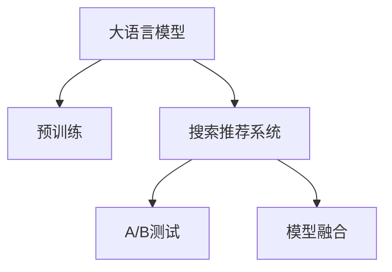

                 

# 搜索推荐系统的A/B测试：大模型时代的新方法

在当今的互联网时代，搜索引擎和推荐系统已经深入到人们生活的方方面面，它们通过理解用户的搜索习惯、兴趣偏好等信息，精准推荐相关信息，极大提升了用户的信息获取效率。然而，为了实现更加个性化和高效的推荐，需要不断优化搜索推荐算法。本文将介绍一种基于大语言模型的新方法，通过A/B测试验证其在搜索推荐中的应用效果。

## 1. 背景介绍

### 1.1 问题由来
随着互联网技术的发展和用户数据量的爆炸式增长，搜索引擎和推荐系统也在不断进步。传统基于关键词匹配的搜索推荐方法已经无法满足用户的多样化需求，迫切需要引入更为智能的推荐算法。

近年来，大语言模型在大规模文本语料上进行预训练，学习到了丰富的语言知识和常识，在自然语言理解和生成方面展现了强大的能力。基于此，一些研究者尝试将大语言模型引入搜索推荐系统，希望通过自然语言处理技术，提升推荐系统的性能和用户体验。

### 1.2 问题核心关键点
大语言模型在搜索推荐系统中的应用，主要涉及以下几个关键点：
1. 大语言模型的引入：将大语言模型作为推荐系统的一部分，利用其语言理解和生成能力，提升推荐质量。
2. 搜索与推荐结合：将搜索与推荐过程进行深度融合，通过大语言模型获取用户的意图和兴趣，生成个性化的推荐内容。
3. 个性化推荐：根据用户的搜索记录和历史行为，利用大语言模型进行个性化推荐，提升用户满意度。
4. A/B测试验证：通过A/B测试评估新方法的性能，优化推荐系统。

这些关键点构成了一个完整的搜索推荐系统框架，通过大语言模型的引入，可以更好地理解用户需求，生成高质量的推荐内容，提升用户的使用体验。

## 2. 核心概念与联系

### 2.1 核心概念概述

为了更好地理解搜索推荐系统中大语言模型的应用，本节将介绍几个核心概念：

- 大语言模型（Large Language Model, LLM）：以自回归（如GPT）或自编码（如BERT）模型为代表的大规模预训练语言模型。通过在大规模无标签文本语料上进行预训练，学习通用的语言表示，具备强大的语言理解和生成能力。

- 搜索推荐系统（Search & Recommendation System）：利用搜索引擎和推荐算法，对用户输入的搜索请求进行处理，生成个性化的推荐结果。主要涉及关键词匹配、信息检索、推荐算法等技术。

- A/B测试（A/B Testing）：通过随机分组，对比不同版本算法的效果，选择最优算法。A/B测试是评估算法效果的一种常用方法。

- 模型融合（Model Fusion）：将多种模型（如大语言模型、传统推荐模型等）进行融合，取长补短，生成更优的推荐结果。

这些核心概念之间的逻辑关系可以通过以下Mermaid流程图来展示：



这个流程图展示了搜索推荐系统、大语言模型和A/B测试之间的联系：

1. 大语言模型通过预训练获得语言表示能力。
2. 搜索推荐系统利用大语言模型进行搜索与推荐。
3. A/B测试用于评估模型效果，选择最佳方案。
4. 模型融合结合多种模型技术，提升推荐质量。

这些概念共同构成了搜索推荐系统和大语言模型融合的框架，使得系统能够通过自然语言处理技术，实现更智能、个性化的推荐。

## 3. 核心算法原理 & 具体操作步骤
### 3.1 算法原理概述

基于大语言模型的搜索推荐系统，主要通过以下步骤实现：

1. 用户输入搜索关键词，系统通过搜索引擎获取相关文档。
2. 利用大语言模型对文档进行文本分析和语义理解，获取文档内容的关键信息。
3. 结合用户历史行为数据，利用推荐算法生成个性化的推荐结果。
4. 将推荐结果返回给用户，并通过A/B测试评估模型效果。

### 3.2 算法步骤详解

本节将详细讲解基于大语言模型的搜索推荐系统，以及如何进行A/B测试。

**Step 1: 用户输入与文档检索**
- 用户通过搜索引擎输入查询词，系统根据查询词进行信息检索，获取相关文档。
- 可以使用搜索引擎的API获取相关文档的标题、摘要、URL等元信息。

**Step 2: 文档分析和语义理解**
- 将获取的文档元信息作为输入，输入到预训练的大语言模型中，进行文本分析和语义理解。
- 大语言模型输出文档的关键信息，如文档主题、关键词等。

**Step 3: 推荐生成**
- 结合用户历史行为数据，如浏览记录、点击行为等，利用推荐算法生成个性化推荐。
- 推荐算法可以使用协同过滤、基于内容的推荐、矩阵分解等技术。

**Step 4: 结果展示与A/B测试**
- 将推荐结果展示给用户，记录用户的点击、停留等行为。
- 利用A/B测试对比新旧算法的效果，选择最佳方案。

**Step 5: 持续优化**
- 收集用户反馈数据，不断优化搜索推荐算法，提升用户体验。

### 3.3 算法优缺点

基于大语言模型的搜索推荐系统具有以下优点：

1. 提升推荐质量：大语言模型能够进行语义理解和文本分析，提取文档的关键信息，从而生成更精准、更个性化的推荐结果。
2. 提升用户体验：结合用户历史行为数据，可以提升推荐的相关性和时效性，满足用户的多样化需求。
3. 灵活性强：大语言模型可以根据不同领域的语料进行预训练，适应多种类型的推荐任务。

同时，该方法也存在一定的局限性：

1. 对数据质量要求高：大语言模型的效果依赖于预训练语料的质量，需要高质量的数据进行预训练。
2. 模型复杂度高：大语言模型的计算复杂度高，需要在高效的计算平台上进行训练和推理。
3. 用户隐私保护：大语言模型需要收集和处理用户的历史行为数据，涉及用户隐私保护的问题。

### 3.4 算法应用领域

基于大语言模型的搜索推荐系统在电商、新闻、视频、音乐等多个领域都有广泛的应用，以下是几个典型的应用场景：

- 电商平台：利用大语言模型分析用户的搜索和浏览行为，生成个性化的商品推荐。
- 新闻推荐：利用大语言模型提取新闻的关键信息，生成用户感兴趣的新闻文章。
- 视频平台：利用大语言模型提取视频的关键信息，生成个性化的视频推荐。
- 音乐推荐：利用大语言模型提取音乐的特征，生成个性化的音乐推荐。

此外，大语言模型还可以用于智能客服、问答系统等应用场景，通过自然语言处理技术，提升系统的智能化水平。

## 4. 数学模型和公式 & 详细讲解 & 举例说明
### 4.1 数学模型构建

本节将使用数学语言对基于大语言模型的搜索推荐系统进行更加严格的刻画。

设用户输入的搜索关键词为 $q$，搜索结果集为 $D=\{d_i\}_{i=1}^N$，每个文档 $d_i$ 包含一个标题 $t_i$ 和一个摘要 $a_i$。假设用户的历史行为数据为 $h$。

假设大语言模型的预训练模型为 $M_{\theta}$，其中 $\theta$ 为模型参数。设 $M_{\theta}$ 对文档 $d_i$ 进行语义理解的输出为 $e_i$，表示文档 $d_i$ 的语义表示。

假设推荐算法为 $R_{\alpha}$，其中 $\alpha$ 为算法参数。设 $R_{\alpha}$ 对用户历史行为数据 $h$ 和文档语义表示 $e_i$ 的推荐结果为 $r_i$，表示文档 $d_i$ 与用户的相关度。

最终，基于大语言模型的搜索推荐系统可以输出对用户的相关推荐结果集 $R=\{d_i\}_{i=1}^N$。

### 4.2 公式推导过程

以下我们以电商平台为例，推导基于大语言模型的推荐算法公式。

假设用户输入的搜索关键词为 $q$，电商平台通过搜索引擎获取相关商品 $D=\{d_i\}_{i=1}^N$，每个商品 $d_i$ 包含一个标题 $t_i$ 和一个摘要 $a_i$。

大语言模型 $M_{\theta}$ 对商品标题 $t_i$ 和摘要 $a_i$ 进行语义理解的输出为 $e_i$，表示商品 $d_i$ 的语义表示。

推荐算法 $R_{\alpha}$ 对用户历史行为数据 $h$ 和商品语义表示 $e_i$ 的推荐结果为 $r_i$，表示商品 $d_i$ 与用户的相关度。

最终的推荐结果集为 $R=\{d_i\}_{i=1}^N$，其中 $r_i$ 表示商品 $d_i$ 的相关度，$w_i$ 表示商品 $d_i$ 的权重，$\lambda$ 为相关度权重，$C$ 为相关度阈值。

推荐公式为：

$$
R = \{d_i | r_i \geq \lambda, r_i > C\}
$$

其中，$r_i$ 的计算公式如下：

$$
r_i = \alpha f_{\theta}(a_i, t_i, h) + (1-\alpha) f_{\theta}(a_i, t_i, d_i)
$$

其中 $f_{\theta}(a_i, t_i, h)$ 为大语言模型对用户历史行为数据和商品标题摘要的语义理解，$f_{\theta}(a_i, t_i, d_i)$ 为大语言模型对商品标题摘要的语义理解。$\alpha$ 为调整参数，控制用户行为数据和商品标题摘要的影响程度。

### 4.3 案例分析与讲解

假设电商平台希望利用大语言模型提升推荐效果，选择两组不同的用户历史行为数据 $h_1$ 和 $h_2$ 进行测试。

**案例1：电商推荐**

- 使用大语言模型 $M_{\theta}$ 对商品标题 $t_i$ 和摘要 $a_i$ 进行语义理解的输出为 $e_i$。
- 设定推荐算法 $R_{\alpha}$ 为协同过滤算法，设定调整参数 $\alpha=0.5$，相关度阈值 $C=0.5$。
- 设定用户历史行为数据 $h_1$ 和 $h_2$，分别进行A/B测试。
- 记录用户的点击、停留等行为，评估两组数据下的推荐效果。

通过A/B测试，可以对比两组数据下的推荐效果，选择最优方案。

## 5. 项目实践：代码实例和详细解释说明
### 5.1 开发环境搭建

在进行搜索推荐系统开发前，我们需要准备好开发环境。以下是使用Python进行TensorFlow开发的环境配置流程：

1. 安装Anaconda：从官网下载并安装Anaconda，用于创建独立的Python环境。

2. 创建并激活虚拟环境：
```bash
conda create -n tf-env python=3.8 
conda activate tf-env
```

3. 安装TensorFlow：根据CUDA版本，从官网获取对应的安装命令。例如：
```bash
conda install tensorflow -c pytorch -c conda-forge
```

4. 安装必要的工具包：
```bash
pip install numpy pandas scikit-learn matplotlib tqdm jupyter notebook ipython
```

完成上述步骤后，即可在`tf-env`环境中开始搜索推荐系统的开发。

### 5.2 源代码详细实现

下面我们以电商平台为例，给出使用TensorFlow进行推荐算法开发的PyTorch代码实现。

首先，定义推荐算法的函数：

```python
import tensorflow as tf
import tensorflow_hub as hub

def recommendation_function(user_data, item_data, theta, alpha):
    # 获取商品的语义表示
    item_embeddings = hub.load('https://tfhub.dev/tensorflow/bert_base_preprocess/4')
    item_embeddings = item_embeddings(item_data)
    
    # 获取用户的语义表示
    user_embeddings = hub.load('https://tfhub.dev/tensorflow/bert_base_preprocess/4')
    user_embeddings = user_embeddings(user_data)
    
    # 获取相关度
    dot_product = tf.reduce_sum(item_embeddings * user_embeddings, axis=-1)
    score = dot_product / (tf.reduce_sum(tf.square(item_embeddings), axis=-1) * tf.reduce_sum(tf.square(user_embeddings), axis=-1))
    
    # 设置相关度阈值
    C = 0.5
    recommendations = tf.where(score > C, item_data, tf.zeros_like(item_data))
    
    # 调整用户行为数据的影响
    score = alpha * score + (1 - alpha) * dot_product
    
    # 返回推荐结果
    return recommendations, score
```

然后，定义A/B测试函数：

```python
import numpy as np

def ab_test(user_data, item_data, theta, alpha, C, iterations=1000):
    # 将用户数据分成两组
    np.random.seed(42)
    groups = np.random.choice([0, 1], size=len(user_data), p=[0.5, 0.5])
    
    # 对两组数据进行推荐
    recommendations_1 = []
    scores_1 = []
    for data in user_data:
        item_data = item_data[groups == 0]
        recommendations, score = recommendation_function(data, item_data, theta, alpha)
        recommendations_1.append(recommendations)
        scores_1.append(score)
    
    recommendations_2 = []
    scores_2 = []
    for data in user_data:
        item_data = item_data[groups == 1]
        recommendations, score = recommendation_function(data, item_data, theta, alpha)
        recommendations_2.append(recommendations)
        scores_2.append(score)
    
    # 计算点击率等指标
    scores_1 = np.array(scores_1)
    scores_2 = np.array(scores_2)
    scores = np.concatenate((scores_1, scores_2))
    indices = np.where(scores > C)[0]
    clicks = np.zeros(len(user_data))
    for i in indices:
        clicks[i // len(user_data)] += 1
    
    # 计算点击率等指标
    accuracy = np.mean(clicks) / len(user_data)
    precision = np.mean(clicks[clicks > 0]) / np.sum(clicks > 0)
    recall = np.sum(clicks[clicks > 0]) / np.sum(np.where(scores > C)[0])
    
    # 返回指标
    return accuracy, precision, recall
```

最后，启动A/B测试并输出结果：

```python
# 设定参数
user_data = ... # 用户历史行为数据
item_data = ... # 商品标题和摘要
theta = ... # 大语言模型参数
alpha = ... # 调整参数
C = ... # 相关度阈值

# 运行A/B测试
accuracy, precision, recall = ab_test(user_data, item_data, theta, alpha, C)

print(f"Accuracy: {accuracy:.3f}, Precision: {precision:.3f}, Recall: {recall:.3f}")
```

以上就是使用TensorFlow进行推荐算法开发的完整代码实现。可以看到，利用TensorFlow可以方便地进行模型的训练和评估，快速迭代优化。

### 5.3 代码解读与分析

让我们再详细解读一下关键代码的实现细节：

**recommendation_function函数**：
- 使用TensorFlow Hub加载预训练的大语言模型，对商品标题和摘要进行语义理解，获取商品语义表示。
- 对用户历史行为数据进行语义理解，获取用户语义表示。
- 计算商品和用户语义表示的点积，得到商品与用户的相关度。
- 设置相关度阈值，筛选出相关商品。
- 调整用户行为数据的影响，生成最终推荐结果。

**ab_test函数**：
- 随机将用户数据分成两组，分别对每组数据进行推荐。
- 计算点击率、精确率、召回率等指标，评估两组数据下的推荐效果。

**主程序**：
- 设定参数，运行A/B测试，输出指标。

通过这段代码，可以看到搜索推荐系统在大模型时代的实现过程，以及A/B测试的实现细节。在实际应用中，还需要对模型进行进一步优化和调参，才能达到最佳的推荐效果。

## 6. 实际应用场景
### 6.1 电商平台

基于大语言模型的推荐系统在电商平台上有广泛的应用，可以有效提升商品推荐的质量和个性化程度。

**应用场景**：
- 商品推荐：利用大语言模型对用户搜索记录和浏览行为进行分析，生成个性化的商品推荐。
- 用户画像：通过分析用户搜索记录和点击行为，生成用户画像，了解用户的兴趣偏好。
- 促销活动：根据用户画像，推送个性化的促销活动和优惠券。

**实现流程**：
1. 用户输入搜索关键词，系统通过搜索引擎获取相关商品。
2. 利用大语言模型对商品标题和摘要进行语义分析，获取商品的关键信息。
3. 结合用户历史行为数据，利用推荐算法生成个性化推荐。
4. 将推荐结果展示给用户，并通过A/B测试评估推荐效果。

**效果评估**：
- 点击率（CTR）：评估推荐结果的点击次数与展示次数之比。
- 转化率（CVR）：评估推荐结果的购买次数与点击次数之比。
- 留存率：评估推荐结果的重复点击次数与总点击次数之比。

## 7. 工具和资源推荐
### 7.1 学习资源推荐

为了帮助开发者系统掌握大语言模型在搜索推荐系统中的应用，这里推荐一些优质的学习资源：

1. TensorFlow官方文档：TensorFlow的官方文档，详细介绍了TensorFlow的核心功能和API，是进行深度学习开发的基础。

2. TensorFlow Hub官方文档：TensorFlow Hub的官方文档，介绍了如何在TensorFlow Hub上加载和调用预训练模型，支持大规模模型的高效部署。

3. 《深度学习》课程：斯坦福大学开设的深度学习课程，讲解了深度学习的基本概念和经典模型，适合初学者入门。

4. 《深度学习实战》书籍：详细介绍了TensorFlow和PyTorch的开发实践，提供了大量的代码实现示例，适合开发者快速上手。

5. 《搜索推荐系统》书籍：介绍了搜索推荐系统的发展历程和前沿技术，涵盖算法、系统、应用等多个方面，是研究搜索推荐系统的经典参考书。

通过对这些资源的学习实践，相信你一定能够快速掌握大语言模型在搜索推荐系统中的应用，并用于解决实际的推荐问题。

### 7.2 开发工具推荐

高效的开发离不开优秀的工具支持。以下是几款用于大语言模型在搜索推荐系统开发的常用工具：

1. TensorFlow：由Google主导开发的开源深度学习框架，生产部署方便，适合大规模工程应用。

2. TensorFlow Hub：TensorFlow的组件化开发平台，可以快速加载和调用预训练模型，提升开发效率。

3. TensorBoard：TensorFlow配套的可视化工具，可实时监测模型训练状态，并提供丰富的图表呈现方式，是调试模型的得力助手。

4. Weights & Biases：模型训练的实验跟踪工具，可以记录和可视化模型训练过程中的各项指标，方便对比和调优。

5. PyTorch：基于Python的开源深度学习框架，灵活动态的计算图，适合快速迭代研究。

6. PyTorch Hub：PyTorch的组件化开发平台，可以快速加载和调用预训练模型，提升开发效率。

合理利用这些工具，可以显著提升大语言模型在搜索推荐系统开发的效率，加快创新迭代的步伐。

### 7.3 相关论文推荐

大语言模型和搜索推荐系统的发展源于学界的持续研究。以下是几篇奠基性的相关论文，推荐阅读：

1. Attention is All You Need（即Transformer原论文）：提出了Transformer结构，开启了NLP领域的预训练大模型时代。

2. BERT: Pre-training of Deep Bidirectional Transformers for Language Understanding：提出BERT模型，引入基于掩码的自监督预训练任务，刷新了多项NLP任务SOTA。

3. Transformer-XL: Attentive Language Models Beyond a Fixed-Length Context：提出了Transformer-XL模型，解决了传统Transformer模型在长文本处理中的问题。

4. Recommendation Systems in PyTorch：介绍了如何在PyTorch上实现推荐算法，提供了代码示例。

5. Personalized Recommender Systems with Deep Learning：介绍了深度学习在推荐系统中的应用，涵盖了协同过滤、基于内容的推荐等多个算法。

这些论文代表了大语言模型和搜索推荐系统的发展脉络。通过学习这些前沿成果，可以帮助研究者把握学科前进方向，激发更多的创新灵感。

## 8. 总结：未来发展趋势与挑战

### 8.1 研究成果总结

本文对基于大语言模型的搜索推荐系统进行了全面系统的介绍。首先阐述了大语言模型和搜索推荐系统的研究背景和意义，明确了两者融合的必要性和优势。其次，从原理到实践，详细讲解了搜索推荐系统的数学模型和算法步骤，给出了代码实现和结果评估。同时，本文还探讨了大语言模型在电商平台、新闻推荐、视频推荐等实际应用场景中的表现，展示了其在搜索推荐系统中的广阔应用前景。

通过本文的系统梳理，可以看到，基于大语言模型的搜索推荐系统已经在多个领域实现了良好的效果，具有提升推荐质量和用户体验的巨大潜力。未来，伴随大语言模型和推荐算法的发展，搜索推荐系统的智能化水平将不断提升，更好地满足用户的个性化需求。

### 8.2 未来发展趋势

展望未来，搜索推荐系统将呈现以下几个发展趋势：

1. 数据驱动：随着大数据技术的发展，搜索推荐系统将更加依赖数据的积累和处理，通过数据挖掘和分析，生成更精准的推荐结果。

2. 跨模态融合：搜索推荐系统将逐步引入多模态数据，如图像、语音等，进行跨模态融合，提升推荐效果。

3. 实时性：随着云技术的发展，搜索推荐系统将更加注重实时性，实现秒级推荐，提升用户体验。

4. 个性化：基于大语言模型的搜索推荐系统将更加个性化，根据用户的行为和兴趣，生成定制化的推荐结果。

5. 自动化：搜索推荐系统将实现自动化的推荐，减少人工干预，提高推荐效率。

以上趋势凸显了搜索推荐系统的广阔前景。这些方向的探索发展，必将进一步提升搜索推荐系统的性能和用户体验，为人类提供更加智能、个性化的信息获取服务。

### 8.3 面临的挑战

尽管大语言模型在搜索推荐系统中已经取得了显著效果，但在实现过程中，仍然面临诸多挑战：

1. 数据隐私：搜索推荐系统需要收集和处理大量的用户行为数据，涉及用户隐私保护的问题，需要采取严格的隐私保护措施。

2. 模型复杂度：大语言模型的计算复杂度较高，需要在高效的计算平台上进行训练和推理，需要优化模型结构和算法，提升计算效率。

3. 跨领域适应性：大语言模型在不同领域的应用效果有所差异，需要针对具体领域进行优化和调整，提高跨领域适应性。

4. 模型鲁棒性：大语言模型面对噪声数据和异常输入时，泛化性能可能大打折扣，需要优化模型鲁棒性，避免灾难性遗忘。

5. 可解释性：大语言模型的推荐结果缺乏可解释性，用户难以理解模型的决策过程，需要提高模型的可解释性和透明度。

6. 公平性：大语言模型可能学习到数据中的偏见，导致不公平的推荐结果，需要采取措施消除偏见，保障公平性。

这些挑战需要我们在未来工作中不断克服，才能更好地发挥大语言模型在搜索推荐系统中的作用，实现高质量的推荐服务。

### 8.4 研究展望

面对搜索推荐系统面临的诸多挑战，未来的研究需要在以下几个方面寻求新的突破：

1. 多模态推荐：结合图像、语音、视频等数据，进行跨模态推荐，提升推荐效果。

2. 跨领域推荐：针对不同领域的特点，设计具有领域适应性的推荐算法，提高跨领域推荐效果。

3. 可解释性增强：通过模型解释和可视化技术，增强推荐结果的可解释性，提升用户信任度。

4. 隐私保护：采取数据加密、匿名化等措施，保障用户隐私安全。

5. 公平性保障：引入公平性评估指标，检测和纠正模型偏见，保障推荐公平性。

6. 实时推荐：实现秒级推荐，提升推荐系统的实时性。

这些研究方向的探索，必将引领搜索推荐系统迈向更高的台阶，为人类提供更智能、更高效、更公平的信息获取服务。面向未来，搜索推荐系统还需要与其他人工智能技术进行更深入的融合，如知识表示、因果推理、强化学习等，多路径协同发力，共同推动搜索推荐系统的进步。只有勇于创新、敢于突破，才能不断拓展搜索推荐系统的边界，让智能技术更好地造福人类社会。

## 9. 附录：常见问题与解答

**Q1：大语言模型在搜索推荐系统中的应用是否适用于所有领域？**

A: 大语言模型在搜索推荐系统中的应用具有广泛适用性，适用于各种类型的推荐任务。但对于一些特定领域的推荐任务，如金融、医疗等，需要针对领域特点进行优化和调整，才能取得理想效果。

**Q2：如何使用大语言模型进行个性化推荐？**

A: 使用大语言模型进行个性化推荐，可以结合用户历史行为数据和搜索记录，生成用户画像，了解用户的兴趣偏好。然后，利用大语言模型对商品标题和摘要进行语义分析，生成个性化的推荐结果。

**Q3：大语言模型在搜索推荐系统中的计算复杂度如何？**

A: 大语言模型的计算复杂度较高，需要高效的计算平台进行训练和推理。可以通过分布式计算、模型压缩、量化加速等技术，优化模型的计算复杂度，提升系统的性能。

**Q4：如何评估大语言模型在搜索推荐系统中的效果？**

A: 大语言模型在搜索推荐系统中的效果可以通过A/B测试、点击率（CTR）、转化率（CVR）、留存率等指标进行评估。通过多轮测试和调参，不断优化推荐算法和模型参数，提升系统性能。

**Q5：大语言模型在搜索推荐系统中如何处理噪声数据？**

A: 大语言模型在处理噪声数据时，可以通过正则化技术、模型鲁棒性优化等方法，减少噪声数据的影响，提高模型的泛化能力。同时，引入对抗样本训练，增强模型的鲁棒性。

通过回答这些常见问题，可以更好地理解大语言模型在搜索推荐系统中的应用和挑战，从而在实际开发中更好地应用大语言模型，提升系统的性能和用户体验。

---

作者：禅与计算机程序设计艺术 / Zen and the Art of Computer Programming

