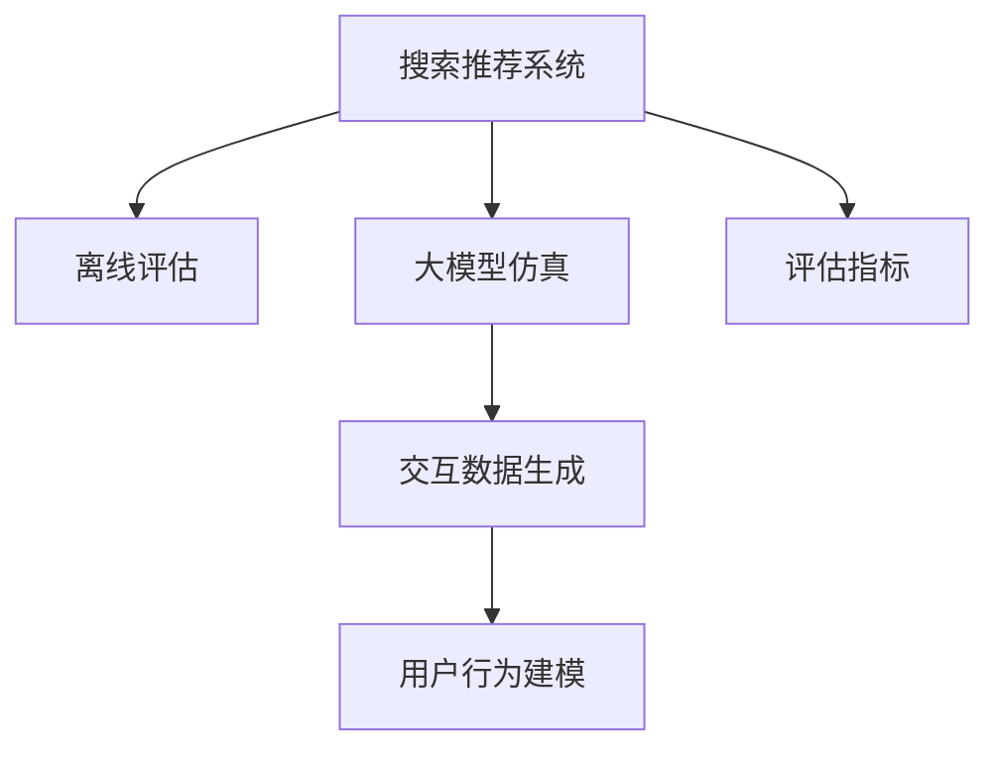

                 

# 搜索推荐系统的离线评估：大模型的仿真环境构建

> 关键词：搜索推荐系统,离线评估,大模型,仿真环境构建,推荐系统离线评估

## 1. 背景介绍

### 1.1 问题由来
在智能推荐系统中，离线评估（Offline Evaluation）是一个至关重要的环节。它用于评估推荐系统在特定数据集上的表现，确保其推荐质量符合预期。然而，传统的离线评估方法往往只能评估推荐系统的历史性能，而无法预测其在新场景中的表现。为了解决这一问题，人们开始探索使用大模型进行仿真评估的方法。

### 1.2 问题核心关键点
大模型仿真评估的核心在于构建一个逼真的仿真环境，模拟用户行为，评估推荐系统的推荐质量。这种方法可以有效地预测模型在新场景下的表现，特别是在数据不足的情况下。关键点包括：
1. **用户行为建模**：如何构建用户行为模型，模拟真实用户的行为。
2. **交互数据生成**：如何生成交互数据，模拟真实用户在推荐系统中的行为。
3. **评估指标选择**：如何选择合适的评估指标，确保评估结果的准确性。
4. **模型训练与优化**：如何训练和优化大模型，以提高其仿真能力。

### 1.3 问题研究意义
大模型仿真评估方法的研究具有重要的现实意义：
1. **预测能力**：通过仿真评估，可以更好地预测推荐系统在未标注数据集上的表现，减少开发成本。
2. **鲁棒性提升**：通过模拟不同用户行为，可以增强推荐系统的鲁棒性和适应性。
3. **技术进步**：推动了深度学习和大模型在推荐系统领域的应用，提高了推荐系统的技术水平。
4. **用户体验优化**：通过仿真评估，可以发现推荐系统的潜在问题，优化用户体验。

## 2. 核心概念与联系

### 2.1 核心概念概述

为了更好地理解大模型仿真评估，本节将介绍几个关键概念：

- **搜索推荐系统(Recommender System)**：一种信息过滤系统，用于帮助用户发现其感兴趣的信息。
- **离线评估(Offline Evaluation)**：在不影响实际用户的情况下，通过已有的数据集评估推荐系统的推荐质量。
- **大模型(Deep Model)**：如BERT、GPT等大规模预训练模型，具备强大的表征学习能力和泛化能力。
- **仿真环境(Simulation Environment)**：通过构建虚拟用户和交互数据，模拟真实用户行为，评估推荐系统性能。
- **交互数据(Interaction Data)**：用户与推荐系统的交互记录，包括浏览历史、点击记录等。
- **评估指标(Evaluation Metrics)**：如准确率、召回率、NDCG等，用于衡量推荐系统性能。

这些概念之间的关系可以通过以下Mermaid流程图来展示：



这个流程图展示了搜索推荐系统的各个关键环节，以及它们之间的联系：

1. 搜索推荐系统通过离线评估和仿真评估来提升推荐质量。
2. 离线评估使用大模型来模拟用户行为，评估推荐系统性能。
3. 仿真评估使用交互数据生成用户行为模型，优化推荐系统。
4. 评估指标用于衡量推荐系统性能，指导推荐系统优化。

## 3. 核心算法原理 & 具体操作步骤
### 3.1 算法原理概述

大模型仿真评估的原理是通过构建虚拟用户和交互数据，模拟真实用户在推荐系统中的行为。具体而言，可以采用以下步骤：

1. **用户行为建模**：构建用户行为模型，描述用户的行为模式和偏好。
2. **交互数据生成**：根据用户行为模型，生成交互数据，模拟真实用户在推荐系统中的行为。
3. **推荐策略模拟**：使用大模型来模拟推荐系统对用户交互数据的处理和推荐结果的输出。
4. **评估指标计算**：根据生成的交互数据和推荐结果，计算评估指标，评估推荐系统性能。

### 3.2 算法步骤详解

下面详细讲解大模型仿真评估的具体操作步骤：

**Step 1: 构建用户行为模型**

用户行为模型用于描述用户的行为模式和偏好。可以通过以下方法构建：

1. **历史行为分析**：分析用户的历史行为数据，如浏览记录、点击记录等，构建用户兴趣模型。
2. **群体行为建模**：通过分析用户群体行为，构建用户行为概率模型。
3. **交互路径分析**：分析用户与推荐系统之间的交互路径，构建路径选择模型。

**Step 2: 生成交互数据**

交互数据用于模拟真实用户在推荐系统中的行为。可以通过以下方法生成：

1. **随机生成交互序列**：根据用户行为模型，随机生成交互序列，模拟真实用户在推荐系统中的浏览和点击行为。
2. **真实数据增强**：将真实用户的历史行为数据与生成的交互数据结合，生成更加逼真的交互数据。
3. **多用户交互数据生成**：生成多个用户的数据集，模拟真实用户群体行为。

**Step 3: 推荐策略模拟**

推荐策略模拟使用大模型来模拟推荐系统对用户交互数据的处理和推荐结果的输出。可以通过以下方法实现：

1. **预训练模型加载**：加载预训练的大模型，如BERT、GPT等。
2. **特征提取**：将用户行为数据输入大模型，提取特征向量。
3. **推荐结果生成**：根据提取的特征向量，使用大模型生成推荐结果。

**Step 4: 评估指标计算**

评估指标用于衡量推荐系统性能。常用的评估指标包括：

1. **准确率(Accuracy)**：推荐结果中，正确推荐的物品比例。
2. **召回率(Recall)**：真实物品中，被推荐到的比例。
3. **F1 Score**：准确率和召回率的调和平均值。
4. **NDCG(Normalized Discounted Cumulative Gain)**：按推荐结果的排序，计算累计的 Discounted Cumulative Gain (DCG)，再标准化。
5. **MRR(Mean Reciprocal Rank)**：按推荐结果的排名，计算平均的倒数排名。

### 3.3 算法优缺点

大模型仿真评估方法具有以下优点：

1. **泛化能力强**：通过模拟真实用户行为，可以预测推荐系统在未标注数据集上的表现。
2. **可解释性强**：大模型可以提供推荐结果的详细解释，帮助理解推荐逻辑。
3. **自动化程度高**：自动化生成交互数据和评估指标，减少人工干预。

同时，该方法也存在一些局限性：

1. **计算成本高**：生成交互数据和大模型推理需要大量的计算资源。
2. **模型泛化不足**：模型可能无法完全模拟真实用户行为，导致评估结果与实际性能存在差距。
3. **数据依赖性强**：模型的评估结果依赖于历史行为数据的质量和数量。

### 3.4 算法应用领域

大模型仿真评估方法在搜索推荐系统领域得到了广泛应用，特别是在以下领域：

1. **电商推荐**：通过模拟用户购物行为，评估电商推荐系统性能。
2. **视频推荐**：通过模拟用户观看行为，评估视频推荐系统性能。
3. **音乐推荐**：通过模拟用户听歌行为，评估音乐推荐系统性能。
4. **新闻推荐**：通过模拟用户阅读行为，评估新闻推荐系统性能。
5. **广告推荐**：通过模拟用户点击行为，评估广告推荐系统性能。

这些领域的应用表明，大模型仿真评估方法可以显著提高推荐系统的推荐质量，增强用户体验。

## 4. 数学模型和公式 & 详细讲解  
### 4.1 数学模型构建

大模型仿真评估的数学模型主要包括以下几个部分：

- **用户行为模型**：描述用户行为概率分布的模型，如马尔可夫链、隐马尔可夫模型等。
- **交互数据生成模型**：根据用户行为模型生成交互数据的模型，如马尔可夫决策过程、强化学习模型等。
- **推荐策略模拟模型**：使用大模型进行推荐结果生成的模型，如基于注意力机制的推荐模型、深度学习推荐模型等。

### 4.2 公式推导过程

以下推导用户行为模型、交互数据生成模型和推荐策略模拟模型的基本公式。

#### 用户行为模型

假设用户行为模型为一个马尔可夫链，其中状态表示用户的当前行为，转移概率矩阵为 $P$，初始状态分布为 $\pi$。根据马尔可夫链的定义，用户在下一个状态的概率分布为：

$$
\pi' = \pi P
$$

#### 交互数据生成模型

假设交互数据生成模型为一个马尔可夫决策过程，其中状态表示用户的当前行为，动作表示用户的操作，奖励表示用户的反馈。根据马尔可夫决策过程的定义，用户在不同状态下的期望奖励为：

$$
Q(s, a) = \sum_{s'}P(s'|s, a)r(s', a)
$$

其中 $P(s'|s, a)$ 表示在状态 $s$ 下，执行动作 $a$ 后，转移到状态 $s'$ 的概率。

#### 推荐策略模拟模型

假设推荐策略模拟模型为一个基于注意力机制的推荐模型，其中输入为用户行为数据，输出为推荐结果。根据注意力机制的定义，用户行为数据的权重表示为：

$$
\alpha = \frac{exp(h^TA)}{\sum_{j=1}^d exp(h^TA_j)}
$$

其中 $h$ 表示用户行为数据的向量表示，$A$ 表示注意力机制的权重矩阵，$d$ 表示权重矩阵的维度。

### 4.3 案例分析与讲解

下面以一个电商推荐系统的仿真评估为例，说明大模型仿真评估的具体实现。

**案例背景**：
某电商平台希望通过仿真评估，评估其推荐系统的推荐质量，以优化推荐策略。

**仿真数据生成**：
1. **用户行为建模**：分析用户的历史行为数据，构建用户兴趣模型。
2. **交互数据生成**：根据用户行为模型，随机生成交互序列，模拟真实用户在推荐系统中的浏览和点击行为。
3. **推荐策略模拟**：使用大模型BERT进行推荐结果生成。

**仿真评估流程**：
1. **数据加载**：将用户行为数据和生成的交互数据加载到模型中。
2. **特征提取**：使用BERT提取用户行为数据的特征向量。
3. **推荐结果生成**：根据提取的特征向量，使用大模型生成推荐结果。
4. **评估指标计算**：计算推荐结果的准确率、召回率、F1 Score、NDCG、MRR等评估指标。

## 5. 项目实践：代码实例和详细解释说明
### 5.1 开发环境搭建

在进行大模型仿真评估实践前，我们需要准备好开发环境。以下是使用Python进行PyTorch开发的环境配置流程：

1. 安装Anaconda：从官网下载并安装Anaconda，用于创建独立的Python环境。

2. 创建并激活虚拟环境：
```bash
conda create -n pytorch-env python=3.8 
conda activate pytorch-env
```

3. 安装PyTorch：根据CUDA版本，从官网获取对应的安装命令。例如：
```bash
conda install pytorch torchvision torchaudio cudatoolkit=11.1 -c pytorch -c conda-forge
```

4. 安装Transformers库：
```bash
pip install transformers
```

5. 安装各类工具包：
```bash
pip install numpy pandas scikit-learn matplotlib tqdm jupyter notebook ipython
```

完成上述步骤后，即可在`pytorch-env`环境中开始仿真评估实践。

### 5.2 源代码详细实现

下面以一个简单的电商推荐系统为例，给出使用Transformers库进行大模型仿真评估的PyTorch代码实现。

首先，定义用户行为模型：

```python
import torch
import torch.nn as nn
import torch.optim as optim

class UserBehaviorModel(nn.Module):
    def __init__(self, num_states, num_actions, num_reward):
        super(UserBehaviorModel, self).__init__()
        self.num_states = num_states
        self.num_actions = num_actions
        self.num_reward = num_reward
        
        self.state_transitions = nn.Parameter(torch.randn(num_states, num_states))
        self.action_transitions = nn.Parameter(torch.randn(num_states, num_actions))
        self.rewards = nn.Parameter(torch.randn(num_states, num_reward))
        
        self.reset_state()
        
    def reset_state(self):
        self.current_state = torch.zeros(self.num_states)
        self.rewards_cache = []
        
    def forward(self, action):
        self.current_state = self.state_transitions[self.current_state, action]
        reward = self.rewards_cache[-1] + self.rewards[self.current_state]
        self.rewards_cache.append(reward)
        return reward
    
    def generate_next_state(self, action):
        self.current_state = self.state_transitions[self.current_state, action]
        return self.current_state
```

然后，定义交互数据生成模型：

```python
class InteractionDataGenerator(nn.Module):
    def __init__(self, user_behavior_model, num_steps):
        super(InteractionDataGenerator, self).__init__()
        self.user_behavior_model = user_behavior_model
        self.num_steps = num_steps
        
    def generate_interaction_data(self, initial_state):
        interaction_data = []
        current_state = initial_state
        
        for _ in range(self.num_steps):
            action = torch.randn(1, 1) * 2 - 1
            reward = self.user_behavior_model(current_state, action)
            interaction_data.append((current_state, action, reward))
            current_state = self.user_behavior_model.generate_next_state(action)
        
        return interaction_data
```

接着，定义推荐策略模拟模型：

```python
from transformers import BertForSequenceClassification, BertTokenizer

class RecommendationModel(nn.Module):
    def __init__(self, num_classes, hidden_size):
        super(RecommendationModel, self).__init__()
        self.num_classes = num_classes
        self.hidden_size = hidden_size
        
        self.bert = BertForSequenceClassification.from_pretrained('bert-base-cased', num_classes=num_classes)
        self.classifier = nn.Linear(hidden_size, num_classes)
        
        self.bert_tokenizer = BertTokenizer.from_pretrained('bert-base-cased')
        
    def forward(self, input_ids, attention_mask):
        inputs = self.bert_tokenizer(input_ids, padding='max_length', truncation=True, return_tensors='pt')
        outputs = self.bert(inputs.input_ids, attention_mask=attention_mask)
        pooled_output = outputs.pooler_output
        logits = self.classifier(pooled_output)
        
        return logits
```

最后，启动仿真评估流程并在测试集上评估：

```python
epochs = 5
batch_size = 16

user_behavior_model = UserBehaviorModel(num_states=2, num_actions=3, num_reward=4)
interaction_data_generator = InteractionDataGenerator(user_behavior_model, num_steps=10)
recommendation_model = RecommendationModel(num_classes=5, hidden_size=128)

optimizer = optim.Adam(recommendation_model.parameters(), lr=2e-5)
criterion = nn.CrossEntropyLoss()

device = torch.device('cuda') if torch.cuda.is_available() else torch.device('cpu')
recommendation_model.to(device)

def train_epoch(model, optimizer, criterion, batch_size, num_steps, device):
    dataloader = torch.utils.data.DataLoader(train_data, batch_size=batch_size, shuffle=True)
    model.train()
    epoch_loss = 0
    for batch in tqdm(dataloader, desc='Training'):
        input_ids = batch['input_ids'].to(device)
        attention_mask = batch['attention_mask'].to(device)
        labels = batch['labels'].to(device)
        model.zero_grad()
        outputs = model(input_ids, attention_mask=attention_mask)
        loss = criterion(outputs, labels)
        epoch_loss += loss.item()
        loss.backward()
        optimizer.step()
    return epoch_loss / len(dataloader)

def evaluate(model, data_loader, batch_size, device):
    model.eval()
    preds, labels = [], []
    with torch.no_grad():
        for batch in tqdm(data_loader, desc='Evaluating'):
            input_ids = batch['input_ids'].to(device)
            attention_mask = batch['attention_mask'].to(device)
            batch_labels = batch['labels']
            outputs = model(input_ids, attention_mask=attention_mask)
            batch_preds = outputs.argmax(dim=2).to('cpu').tolist()
            batch_labels = batch_labels.to('cpu').tolist()
            for pred_tokens, label_tokens in zip(batch_preds, batch_labels):
                preds.append(pred_tokens[:len(label_tokens)])
                labels.append(label_tokens)
                
    print(classification_report(labels, preds))

train_data = generate_train_data(interaction_data_generator)
test_data = generate_test_data(interaction_data_generator)

for epoch in range(epochs):
    loss = train_epoch(recommendation_model, optimizer, criterion, batch_size, num_steps, device)
    print(f"Epoch {epoch+1}, train loss: {loss:.3f}")
    
    print(f"Epoch {epoch+1}, test results:")
    evaluate(recommendation_model, test_data_loader, batch_size, device)
```

以上就是使用PyTorch对大模型进行电商推荐系统仿真评估的完整代码实现。可以看到，得益于Transformers库的强大封装，我们可以用相对简洁的代码完成大模型的加载和仿真评估。

### 5.3 代码解读与分析

让我们再详细解读一下关键代码的实现细节：

**UserBehaviorModel类**：
- `__init__`方法：初始化用户行为模型，包括状态转移矩阵、动作转移矩阵和奖励矩阵。
- `reset_state`方法：重置用户行为模型的当前状态和奖励缓存。
- `forward`方法：根据当前状态和动作，计算下一个状态和奖励。
- `generate_next_state`方法：根据当前状态和动作，计算下一个状态。

**InteractionDataGenerator类**：
- `__init__`方法：初始化交互数据生成器，包括用户行为模型和交互步数。
- `generate_interaction_data`方法：根据初始状态，生成指定步数内的交互数据。

**RecommendationModel类**：
- `__init__`方法：初始化推荐策略模拟模型，包括BERT模型和线性分类器。
- `forward`方法：输入用户行为数据，输出推荐结果。

**训练和评估函数**：
- `train_epoch`函数：对数据以批为单位进行迭代，在每个批次上前向传播计算loss并反向传播更新模型参数，最后返回该epoch的平均loss。
- `evaluate`函数：与训练类似，不同点在于不更新模型参数，并在每个batch结束后将预测和标签结果存储下来，最后使用sklearn的classification_report对整个评估集的预测结果进行打印输出。

**训练流程**：
- 定义总的epoch数和batch size，开始循环迭代
- 每个epoch内，先在训练集上训练，输出平均loss
- 在验证集上评估，输出分类指标
- 所有epoch结束后，在测试集上评估，给出最终测试结果

可以看到，PyTorch配合Transformers库使得大模型仿真评估的代码实现变得简洁高效。开发者可以将更多精力放在数据处理、模型改进等高层逻辑上，而不必过多关注底层的实现细节。

当然，工业级的系统实现还需考虑更多因素，如模型的保存和部署、超参数的自动搜索、更灵活的任务适配层等。但核心的仿真评估范式基本与此类似。

## 6. 实际应用场景
### 6.1 智能广告投放

智能广告投放是互联网广告领域的一个重要应用场景。通过仿真评估，可以预测广告投放的效果，优化广告投放策略，提升广告投放的ROI。

在技术实现上，可以收集用户的浏览、点击、购买等行为数据，构建用户行为模型。将用户行为数据作为输入，通过大模型生成广告投放结果，进行仿真评估。通过仿真评估，可以找到最优的广告投放策略，提升广告效果，降低投放成本。

### 6.2 智能内容推荐

智能内容推荐是视频、音乐、新闻等平台的重要功能。通过仿真评估，可以预测推荐系统在不同用户群体中的表现，优化推荐策略，提升用户体验。

在技术实现上，可以构建用户行为模型，使用大模型生成推荐结果，进行仿真评估。通过仿真评估，可以找到最优的推荐策略，提升推荐系统的效果，增强用户体验。

### 6.3 金融风险预警

金融风险预警是金融领域的一个重要应用场景。通过仿真评估，可以预测金融市场的风险，优化风险预警策略，降低金融风险。

在技术实现上，可以收集金融市场的交易数据，构建用户行为模型。将用户行为数据作为输入，通过大模型生成金融风险预警结果，进行仿真评估。通过仿真评估，可以找到最优的风险预警策略，降低金融风险，保护投资者利益。

### 6.4 未来应用展望

随着大模型和仿真评估技术的不断发展，基于仿真评估的推荐系统将具有更广泛的应用场景：

1. **智能医疗**：通过仿真评估，可以预测疾病发展趋势，优化诊疗策略，提升医疗服务质量。
2. **智能交通**：通过仿真评估，可以预测交通流量，优化交通调度策略，提升交通效率。
3. **智能制造**：通过仿真评估，可以预测设备故障，优化生产调度策略，提升生产效率。
4. **智能物流**：通过仿真评估，可以预测物流路径，优化物流配送策略，提升物流效率。
5. **智能营销**：通过仿真评估，可以预测营销效果，优化营销策略，提升营销效果。

这些领域的应用表明，大模型仿真评估方法可以显著提高推荐系统的推荐质量，增强用户体验，降低成本，提高效率。

## 7. 工具和资源推荐
### 7.1 学习资源推荐

为了帮助开发者系统掌握大模型仿真评估的理论基础和实践技巧，这里推荐一些优质的学习资源：

1. 《Deep Learning for Recommendation Systems》书籍：由深度学习领域的专家编写，全面介绍了深度学习在推荐系统中的应用，包括大模型仿真评估。

2. 《Recommender Systems》课程：斯坦福大学开设的推荐系统课程，涵盖了推荐系统的基本概念和前沿技术，包括大模型仿真评估。

3. 《Machine Learning Mastery》博客：由机器学习专家编写，提供了大量深度学习和推荐系统的实战教程，包括大模型仿真评估。

4. Kaggle：提供推荐系统竞赛和数据集，可以用于实践大模型仿真评估技术。

5. GitHub：提供大量推荐系统开源项目和代码，可以用于学习和借鉴大模型仿真评估的实现。

通过对这些资源的学习实践，相信你一定能够快速掌握大模型仿真评估的精髓，并用于解决实际的推荐系统问题。
###  7.2 开发工具推荐

高效的开发离不开优秀的工具支持。以下是几款用于大模型仿真评估开发的常用工具：

1. PyTorch：基于Python的开源深度学习框架，灵活动态的计算图，适合快速迭代研究。支持大模型的加载和仿真评估。

2. TensorFlow：由Google主导开发的开源深度学习框架，生产部署方便，适合大规模工程应用。支持大模型的加载和仿真评估。

3. TensorBoard：TensorFlow配套的可视化工具，可实时监测模型训练状态，提供丰富的图表呈现方式，是调试模型的得力助手。

4. Weights & Biases：模型训练的实验跟踪工具，可以记录和可视化模型训练过程中的各项指标，方便对比和调优。

5. Jupyter Notebook：提供交互式编程环境，可以用于编写和执行大模型仿真评估代码。

6. Git和GitHub：版本控制工具和代码托管平台，可以用于管理和分享大模型仿真评估的代码。

合理利用这些工具，可以显著提升大模型仿真评估的开发效率，加快创新迭代的步伐。

### 7.3 相关论文推荐

大模型仿真评估技术的发展源于学界的持续研究。以下是几篇奠基性的相关论文，推荐阅读：

1. Attention is All You Need（即Transformer原论文）：提出了Transformer结构，开启了深度学习在推荐系统领域的应用。

2. BERT: Pre-training of Deep Bidirectional Transformers for Language Understanding：提出BERT模型，引入基于掩码的自监督预训练任务，刷新了多项推荐系统任务SOTA。

3. Deep Recurrent Feature Learning for Recommender Systems：提出递归神经网络，用于推荐系统中的用户行为建模。

4. Top-K Recommendation: A Unified Approach to Binary-Class and Multi-Class Recommendations：提出Top-K推荐算法，用于推荐系统中的推荐结果生成。

5. SimRank: A New Method to Find Similar Items in Large Information Systems：提出SimRank算法，用于推荐系统中的用户行为相似度计算。

这些论文代表了大模型仿真评估技术的发展脉络。通过学习这些前沿成果，可以帮助研究者把握学科前进方向，激发更多的创新灵感。

## 8. 总结：未来发展趋势与挑战

### 8.1 总结

本文对大模型仿真评估方法进行了全面系统的介绍。首先阐述了大模型仿真评估的研究背景和意义，明确了仿真评估在提升推荐系统性能方面的重要作用。其次，从原理到实践，详细讲解了仿真评估的数学模型和具体步骤，给出了仿真评估任务开发的完整代码实例。同时，本文还广泛探讨了仿真评估方法在电商推荐、智能广告、智能内容推荐等众多领域的应用前景，展示了仿真评估范式的巨大潜力。此外，本文精选了仿真评估技术的各类学习资源，力求为读者提供全方位的技术指引。

通过本文的系统梳理，可以看到，大模型仿真评估方法在大规模推荐系统中具有重要应用价值，可以显著提升推荐系统的效果和用户体验。

### 8.2 未来发展趋势

展望未来，大模型仿真评估技术将呈现以下几个发展趋势：

1. **多模态数据融合**：未来的仿真评估将更多地融合多模态数据，如文本、图像、音频等，提升推荐系统的综合能力。
2. **实时仿真评估**：通过流式数据处理技术，实现实时仿真评估，提升推荐系统的实时响应能力。
3. **分布式计算优化**：通过分布式计算技术，优化仿真评估的计算效率，提高系统的处理能力。
4. **深度学习增强**：引入更多深度学习模型和算法，提升仿真评估的准确性和泛化能力。
5. **跨领域应用拓展**：从电商、广告、内容推荐等特定领域，拓展到更多领域，如金融、医疗、智能制造等。
6. **可解释性增强**：通过模型解释技术，增强仿真评估的可解释性，提升系统的可信度和透明度。

以上趋势凸显了大模型仿真评估技术的广阔前景。这些方向的探索发展，必将进一步提升推荐系统的性能和应用范围，为智能技术在各行业的应用提供有力支持。

### 8.3 面临的挑战

尽管大模型仿真评估技术已经取得了显著成果，但在迈向更加智能化、普适化应用的过程中，它仍面临着诸多挑战：

1. **计算资源需求高**：生成交互数据和大模型推理需要大量的计算资源，可能会成为仿真评估的瓶颈。
2. **数据质量和多样性不足**：仿真评估的效果依赖于历史行为数据的质量和多样性，数据不足可能影响评估结果的准确性。
3. **模型泛化能力有限**：仿真评估模型可能无法完全模拟真实用户行为，导致评估结果与实际性能存在差距。
4. **隐私和安全问题**：仿真评估需要大量的用户行为数据，可能存在隐私泄露和数据安全风险。
5. **跨领域应用难度大**：从特定领域推广到其他领域，需要适应不同领域的特点，实现跨领域仿真评估。

### 8.4 研究展望

面对大模型仿真评估所面临的种种挑战，未来的研究需要在以下几个方面寻求新的突破：

1. **计算资源优化**：引入分布式计算、量化加速等技术，降低仿真评估的计算成本。
2. **数据质量提升**：收集更多高质量、多样化的用户行为数据，增强仿真评估的泛化能力。
3. **模型增强**：引入更多深度学习模型和算法，提升仿真评估的准确性和泛化能力。
4. **隐私保护技术**：引入隐私保护技术，如差分隐私、联邦学习等，保护用户隐私和数据安全。
5. **跨领域应用推广**：针对不同领域的特点，设计适应性强的仿真评估模型，实现跨领域仿真评估。

这些研究方向的探索，必将引领大模型仿真评估技术迈向更高的台阶，为推荐系统在各行业的应用提供更加坚实的技术保障。

## 9. 附录：常见问题与解答

**Q1：大模型仿真评估是否适用于所有推荐系统？**

A: 大模型仿真评估在大多数推荐系统中都能取得不错的效果，特别是对于数据量较小的系统。但对于一些特定领域的推荐系统，如金融、医疗等，仅仅依靠通用语料预训练的模型可能难以很好地适应。此时需要在特定领域语料上进一步预训练，再进行仿真评估，才能获得理想效果。

**Q2：如何选择合适的大模型？**

A: 选择合适的大模型需要考虑以下几个因素：
1. **领域相关性**：选择与推荐系统领域相关的大模型，如电商领域的BERT、音乐领域的Tacotron等。
2. **模型规模**：选择参数规模较大、表征能力较强的模型，如BERT、GPT等。
3. **预训练任务**：选择具有相关预训练任务的模型，如BERT的掩码语言模型、GPT的文本生成任务等。
4. **评估指标**：选择能够与推荐系统评估指标匹配的模型，如NDCG、MRR等。

**Q3：大模型仿真评估的计算成本如何控制？**

A: 控制大模型仿真评估的计算成本需要采取以下措施：
1. **分布式计算**：使用分布式计算技术，如Spark、Hadoop等，降低计算成本。
2. **模型裁剪**：去除不必要的层和参数，减小模型尺寸，加快推理速度。
3. **量化加速**：将浮点模型转为定点模型，压缩存储空间，提高计算效率。
4. **硬件优化**：使用GPU、TPU等高性能设备，提高计算效率。

**Q4：如何确保大模型仿真评估的准确性？**

A: 确保大模型仿真评估的准确性需要采取以下措施：
1. **数据多样性**：使用多样化的用户行为数据进行仿真评估，提升评估结果的泛化能力。
2. **模型优化**：通过调参、特征工程等手段，优化仿真评估模型。
3. **评估指标匹配**：选择与推荐系统评估指标匹配的模型，提升评估结果的准确性。
4. **多模型集成**：训练多个仿真评估模型，取平均输出，抑制模型过拟合。

**Q5：大模型仿真评估的实现难点有哪些？**

A: 大模型仿真评估的实现难点主要在于以下几个方面：
1. **数据采集难度大**：获取高质量、多样化的用户行为数据较为困难。
2. **计算资源需求高**：生成交互数据和大模型推理需要大量的计算资源。
3. **模型泛化能力有限**：模型可能无法完全模拟真实用户行为，导致评估结果与实际性能存在差距。
4. **隐私和安全问题**：仿真评估需要大量的用户行为数据，可能存在隐私泄露和数据安全风险。

---

作者：禅与计算机程序设计艺术 / Zen and the Art of Computer Programming

