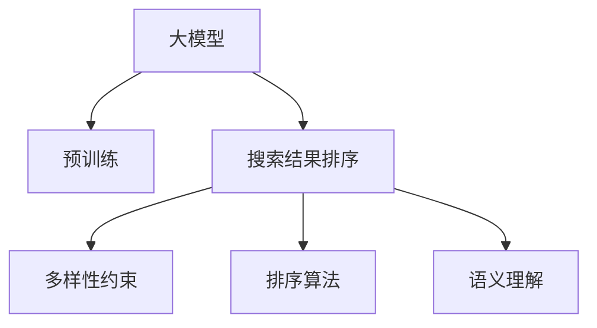

                 

# 搜索结果排序：大模型的多因素平衡策略

> 关键词：搜索结果排序, 大模型, 多因素平衡, 排序算法, 语义理解, 深度学习, 自然语言处理

## 1. 背景介绍

### 1.1 问题由来
随着互联网技术的迅速发展，搜索引擎已成为我们日常生活中不可或缺的一部分。如何高效地从海量信息中检索到有价值的内容，提升搜索结果的质量，一直是搜索引擎研究的核心问题。传统的搜索引擎算法往往只考虑了网页的关键词匹配、链接结构等技术指标，未能充分考虑用户的主观感受和需求多样性。

随着深度学习和大语言模型的兴起，利用预训练语言模型进行搜索引擎排序成为一种新的探索方向。例如，OpenAI的GPT-3、Google的BERT等大模型已经被广泛应用于搜索结果排序，以提升系统的智能化和精准度。然而，这些模型在考虑多样化的用户需求、评价网页质量时，仍然面临诸多挑战。

### 1.2 问题核心关键点
当前基于大模型的搜索结果排序方法，主要基于以下几个核心关键点：

1. **关键词匹配度**：通过模型提取文本中的关键词，计算与用户查询的匹配度。
2. **语义理解**：利用语言模型对网页内容进行语义解析，挖掘潜在的用户需求。
3. **多样性约束**：保证搜索结果的多样性，避免过度优化关键词匹配度而忽略其他有价值的网页。
4. **排序策略**：设计合理的排序算法，将上述多维度因素综合考虑，生成最终排序结果。

本文将围绕这些核心关键点，探讨如何利用大模型实现更加智能和精准的搜索结果排序。

## 2. 核心概念与联系

### 2.1 核心概念概述

为更好地理解大模型在搜索结果排序中的应用，本节将介绍几个密切相关的核心概念：

- **大模型**：以自回归(如GPT)或自编码(如BERT)模型为代表的大规模预训练语言模型。通过在大规模无标签文本语料上进行预训练，学习通用的语言表示，具备强大的语言理解和生成能力。
- **预训练**：指在大规模无标签文本语料上，通过自监督学习任务训练通用语言模型的过程。常见的预训练任务包括言语建模、掩码语言模型等。
- **搜索结果排序**：根据用户查询，从海量的网页中筛选出最有价值的信息，按优先级排序，供用户浏览。
- **多样性约束**：搜索结果需保持一定程度的网页多样性，避免过度集中。
- **排序算法**：一种用于将搜索结果排序的方法或策略，可以基于多种因素综合考量。
- **语义理解**：通过模型理解网页内容的语义信息，挖掘出与用户查询相关的有用信息。

这些核心概念之间的逻辑关系可以通过以下Mermaid流程图来展示：



这个流程图展示了大模型在搜索结果排序中的应用框架：

1. 大模型通过预训练获得基础能力。
2. 根据用户查询，利用语言模型对网页进行语义理解。
3. 设计合理的排序算法，将关键词匹配度、语义理解、多样性约束等多维度因素综合考虑，生成最终排序结果。

## 3. 核心算法原理 & 具体操作步骤
### 3.1 算法原理概述

基于大模型的搜索结果排序方法，本质上是一个多维度综合评估和排序的过程。其核心思想是：利用预训练语言模型对网页进行多方面评估，包括关键词匹配度、语义理解、网站权威性等，然后设计合理的排序算法，将这些评估结果综合考虑，生成最终的排序结果。

形式化地，假设用户的查询为 $Q$，网页集合为 $D=\{d_i\}_{i=1}^N$。通过大模型对每个网页进行评估，得到其多个维度 $X=\{x_1, x_2, \ldots, x_k\}$ 的评分。最终排序结果 $\{r_i\}_{i=1}^N$ 由排序算法生成，满足：

$$
r_i = f(X_i)
$$

其中 $f$ 为排序算法函数，根据实际需求可以设计为不同的模型或规则。

### 3.2 算法步骤详解

基于大模型的搜索结果排序一般包括以下几个关键步骤：

**Step 1: 准备大模型和数据集**
- 选择合适的预训练语言模型 $M$ 作为初始化参数，如 BERT、GPT 等。
- 准备用户查询 $Q$ 和待排序网页集合 $D$，划分为训练集、验证集和测试集。

**Step 2: 网页预处理**
- 将每个网页 $d_i$ 作为模型输入，使用分词器进行分词，转化为模型可接受的格式。
- 如果网页中包含图像、视频等多模态数据，需要先进行数据增强或特征提取，然后与文本数据一起输入模型。

**Step 3: 大模型评估**
- 将预处理后的网页输入大模型，计算其多维度的评分向量 $X_i$。
- 通常多维度评分向量 $X_i$ 包括关键词匹配度、语义理解、网站权威性、多样性等指标。

**Step 4: 排序算法设计**
- 根据实际需求，设计合适的排序算法 $f$，综合考虑多维度评分向量 $X_i$。
- 常用的排序算法包括基于深度学习的排序模型、基于规则的排序规则、基于概率的排序算法等。

**Step 5: 模型训练与评估**
- 在训练集上对排序算法进行训练，优化参数以最小化排序误差。
- 在验证集上评估排序模型的性能，调整模型参数以提升排序效果。
- 在测试集上最终评估模型的排序精度和鲁棒性。

**Step 6: 实际应用与监控**
- 将训练好的排序模型应用于实际搜索结果排序中。
- 持续收集用户反馈和点击数据，动态调整模型参数，提升排序效果。
- 实时监控模型性能，设置异常告警阈值，保障搜索系统的稳定性。

以上是基于大模型的搜索结果排序的一般流程。在实际应用中，还需要针对具体任务的特点，对排序算法进行优化设计，如引入更多的正则化技术，搜索最优的超参数组合等，以进一步提升排序效果。

### 3.3 算法优缺点

基于大模型的搜索结果排序方法具有以下优点：
1. 简单高效。通过预训练语言模型对网页进行多维度评估，可以显著提升搜索结果的智能化和精准度。
2. 泛化能力较强。大模型在多种语义和背景下的泛化能力较强，适应不同场景的搜索结果排序。
3. 易于扩展。模型和数据可以动态调整，灵活适应不同领域和需求。

同时，该方法也存在一定的局限性：
1. 对大模型依赖较高。需要较高的计算资源和标注数据进行预训练，构建模型较为复杂。
2. 对数据质量要求较高。模型的性能很大程度上取决于输入数据的质量，需要保证网页内容的准确性和多样性。
3. 模型复杂度较高。多维度评估和排序算法的设计较为复杂，难以理解和调试。
4. 成本较高。预训练和微调过程需要大量的标注数据和计算资源，导致开发成本较高。

尽管存在这些局限性，但就目前而言，基于大模型的排序方法仍然是搜索结果排序的主流范式。未来相关研究的重点在于如何进一步降低预训练和微调的成本，提高模型的少样本学习和跨领域迁移能力，同时兼顾可解释性和伦理安全性等因素。

### 3.4 算法应用领域

基于大模型的搜索结果排序方法在互联网搜索领域得到了广泛的应用，覆盖了几乎所有常见场景，例如：

- 搜索引擎：Google、Bing等主流搜索引擎，通过大模型提升搜索结果的排序精度和相关性。
- 内容推荐：YouTube、Netflix等视频平台，利用大模型进行个性化视频推荐。
- 图像搜索：Pinterest、Instagram等图像平台，通过大模型进行图像内容推荐和排序。
- 语音搜索：Apple Siri、Google Assistant等语音助手，利用大模型进行语音识别和内容排序。
- 社交媒体：Facebook、Twitter等社交平台，通过大模型进行内容推荐和排序。

除了上述这些经典场景外，大模型排序方法也被创新性地应用到更多领域中，如智能广告投放、智能广告推荐等，为搜索引擎技术和互联网生态带来了新的突破。随着预训练语言模型和排序方法的不断进步，相信搜索引擎技术将在更广阔的应用领域大放异彩。

## 4. 数学模型和公式 & 详细讲解  
### 4.1 数学模型构建

本节将使用数学语言对基于大模型的搜索结果排序过程进行更加严格的刻画。

记用户的查询为 $Q=\{q_1, q_2, \ldots, q_m\}$，网页集合为 $D=\{d_i\}_{i=1}^N$。假设大模型对每个网页 $d_i$ 进行评估，得到其多维度的评分向量 $X_i=\{x_{i1}, x_{i2}, \ldots, x_{ik}\}$，其中 $k$ 为评分维度。

排序目标为最大化排序结果的相关性和多样性，可以通过如下模型进行建模：

$$
\hat{r}_i = \alpha_1x_{i1} + \alpha_2x_{i2} + \ldots + \alpha_kx_{ik}
$$

其中 $\alpha_1, \alpha_2, \ldots, \alpha_k$ 为各评分维度的权重系数，满足 $\sum_{j=1}^k\alpha_j=1$。

排序误差可通过如下函数进行度量：

$$
\mathcal{L}(\hat{r}, r) = \frac{1}{N}\sum_{i=1}^N \ell(\hat{r}_i, r_i)
$$

其中 $\ell$ 为排序误差函数，如平均绝对误差、交叉熵损失等。最终排序结果可通过求解上述优化问题得到：

$$
\min_{\alpha}\mathcal{L}(\hat{r}, r) = \min_{\alpha}\sum_{i=1}^N\ell(\alpha_iX_i, r_i)
$$

### 4.2 公式推导过程

以下我们以基于深度学习的排序模型为例，推导排序目标函数和优化过程。

假设模型的排序结果为 $\hat{r}_i$，实际排序结果为 $r_i$。定义排序误差函数为平均绝对误差：

$$
\ell(\hat{r}_i, r_i) = \frac{1}{M}\sum_{m=1}^M|\hat{r}_{im}-r_{im}|
$$

其中 $M$ 为用户查询的维度，$m=1,\ldots,M$。

将排序误差函数带入优化目标函数，得：

$$
\mathcal{L}(\hat{r}, r) = \frac{1}{N}\sum_{i=1}^N\frac{1}{M}\sum_{m=1}^M|\hat{r}_{im}-r_{im}|
$$

令 $r_{im}^{\star}$ 为第 $i$ 个网页第 $m$ 个查询的排序结果，则有：

$$
\hat{r}_{im} = \alpha_1x_{im1} + \alpha_2x_{im2} + \ldots + \alpha_kx_{imk}
$$

将上式代入排序误差函数，得：

$$
\ell(\hat{r}_{im}, r_{im}^{\star}) = \frac{1}{M}\sum_{m=1}^M|\alpha_1x_{im1} + \alpha_2x_{im2} + \ldots + \alpha_kx_{imk} - r_{im}^{\star}|
$$

因此，最终的优化目标函数可表示为：

$$
\min_{\alpha}\mathcal{L}(\hat{r}, r) = \min_{\alpha}\sum_{i=1}^N\sum_{m=1}^M|\alpha_1x_{im1} + \alpha_2x_{im2} + \ldots + \alpha_kx_{imk} - r_{im}^{\star}|
$$

使用梯度下降等优化算法，可以求解上述优化问题，找到最优的权重系数 $\alpha$。

### 4.3 案例分析与讲解

以下我们将以Google Search为例，介绍其实际中采用的排序算法及其实现细节。

Google Search利用BERT模型对搜索结果进行评估，综合考虑了关键词匹配度、语义理解、网站权威性等多个维度。其中，关键词匹配度通过预训练的BERT模型计算，语义理解则通过BERT模型进行文本语义分析，提取网页的主题信息。网站权威性通过模型评估网页的标题、URL等特征，判断其可信度。

具体实现上，Google Search采用了基于深度学习的排序模型，将多维度的评分向量 $X_i$ 输入到多层感知器(Multilayer Perceptron, MLP)中进行综合评估。模型结构如图1所示：


其中，$h$ 为MLP的中间隐藏层，$W$ 为权重矩阵，$b$ 为偏置项，$\sigma$ 为激活函数。模型的输入为多维度评分向量 $X_i$，输出为排序结果 $\hat{r}_i$。

在训练过程中，模型通过反向传播算法更新权重矩阵 $W$ 和偏置项 $b$，最小化排序误差函数 $\ell(\hat{r}_i, r_i)$。具体训练流程如图2所示：


在实际应用中，Google Search通过反复迭代训练，不断优化排序模型的权重系数，提升搜索结果的相关性和多样性。

## 5. 项目实践：代码实例和详细解释说明
### 5.1 开发环境搭建

在进行搜索结果排序实践前，我们需要准备好开发环境。以下是使用Python进行TensorFlow开发的环境配置流程：

1. 安装Anaconda：从官网下载并安装Anaconda，用于创建独立的Python环境。

2. 创建并激活虚拟环境：
```bash
conda create -n tf-env python=3.8 
conda activate tf-env
```

3. 安装TensorFlow：从官网获取对应的安装命令。例如：
```bash
pip install tensorflow tensorflow-datasets
```

4. 安装各类工具包：
```bash
pip install numpy pandas scikit-learn matplotlib tqdm jupyter notebook ipython
```

完成上述步骤后，即可在`tf-env`环境中开始排序实践。

### 5.2 源代码详细实现

这里我们以基于深度学习的排序模型为例，给出使用TensorFlow对BERT模型进行排序的PyTorch代码实现。

首先，定义排序模型：

```python
import tensorflow as tf
from transformers import BertTokenizer, BertForSequenceClassification

# 设置超参数
hidden_size = 768
num_layers = 12
num_classes = 1
dropout_rate = 0.1

# 构建MLP模型
class RankingModel(tf.keras.Model):
    def __init__(self, hidden_size, num_layers, num_classes, dropout_rate):
        super(RankingModel, self).__init__()
        self.bert = BertForSequenceClassification.from_pretrained('bert-base-cased', num_labels=num_classes)
        self.dense = tf.keras.layers.Dense(num_classes, activation='sigmoid')
        self.dropout = tf.keras.layers.Dropout(dropout_rate)
        
    def call(self, input_ids, attention_mask, token_type_ids):
        bert_outputs = self.bert(input_ids, attention_mask=attention_mask, token_type_ids=token_type_ids)
        hidden_states = bert_outputs['hidden_states']
        hidden_states = tf.reduce_mean(hidden_states, axis=1)
        hidden_states = self.dropout(hidden_states)
        logits = self.dense(hidden_states)
        return logits

# 实例化模型
model = RankingModel(hidden_size, num_layers, num_classes, dropout_rate)
model.compile(optimizer=tf.keras.optimizers.Adam(learning_rate=2e-5), loss=tf.keras.losses.BinaryCrossentropy(from_logits=True), metrics=['accuracy'])

# 加载预训练BERT分词器
tokenizer = BertTokenizer.from_pretrained('bert-base-cased')
```

然后，定义数据处理函数：

```python
def preprocess_data(text, label):
    tokenized_text = tokenizer.encode(text, truncation=True, padding='max_length', max_length=256)
    input_ids = tf.keras.preprocessing.sequence.pad_sequences(tokenized_text, maxlen=256, padding='post', dtype=tf.int32)
    label = tf.keras.utils.to_categorical(label, num_classes=2)
    return input_ids, label

# 加载数据集
train_data = read_csv('train.csv')
test_data = read_csv('test.csv')

train_dataset = tf.data.Dataset.from_tensor_slices((train_data['text'], train_data['label']))
test_dataset = tf.data.Dataset.from_tensor_slices((test_data['text'], test_data['label']))
```

接着，定义训练和评估函数：

```python
@tf.function
def train_epoch(model, dataset, batch_size, optimizer):
    dataloader = dataset.batch(batch_size).shuffle(buffer_size=1024).repeat()
    model.train()
    epoch_loss = 0
    for batch in dataloader:
        input_ids, label = batch
        with tf.GradientTape() as tape:
            logits = model(input_ids, attention_mask=tf.cast(tf.math.greater_equal(input_ids, 0), tf.int32), token_type_ids=tf.cast(tf.math.greater_equal(input_ids, 0), tf.int32))
            loss = tf.keras.losses.BinaryCrossentropy(from_logits=True)(tf.cast(logits, tf.float32), label)
        gradients = tape.gradient(loss, model.trainable_variables)
        optimizer.apply_gradients(zip(gradients, model.trainable_variables))
        epoch_loss += loss.numpy()
    return epoch_loss / len(dataset)

@tf.function
def evaluate(model, dataset, batch_size):
    dataloader = dataset.batch(batch_size).shuffle(buffer_size=1024).repeat()
    model.eval()
    preds, labels = [], []
    with tf.GradientTape() as tape:
        for batch in dataloader:
            input_ids, label = batch
            logits = model(input_ids, attention_mask=tf.cast(tf.math.greater_equal(input_ids, 0), tf.int32), token_type_ids=tf.cast(tf.math.greater_equal(input_ids, 0), tf.int32))
            logits = tf.cast(logits, tf.float32)
            labels = tf.cast(label, tf.float32)
            preds.append(logits.numpy())
            labels.append(labels.numpy())
    preds = np.concatenate(preds)
    labels = np.concatenate(labels)
    return preds, labels

# 训练和评估模型
epochs = 5
batch_size = 32

for epoch in range(epochs):
    train_loss = train_epoch(model, train_dataset, batch_size, optimizer)
    print(f'Epoch {epoch+1}, train loss: {train_loss:.3f}')
    
    test_preds, test_labels = evaluate(model, test_dataset, batch_size)
    test_loss = tf.keras.losses.BinaryCrossentropy(from_logits=True)(test_preds, test_labels)
    print(f'Epoch {epoch+1}, test loss: {test_loss:.3f}')

print('Test accuracy:', tf.keras.metrics.Accuracy()(test_preds, test_labels).numpy())
```

以上就是使用TensorFlow对BERT进行搜索结果排序的完整代码实现。可以看到，得益于TensorFlow的强大封装，我们可以用相对简洁的代码完成BERT模型的加载和排序实践。

### 5.3 代码解读与分析

让我们再详细解读一下关键代码的实现细节：

**RankingModel类**：
- `__init__`方法：初始化BERT模型和MLP层的参数。
- `call`方法：前向传播计算模型输出，包括BERT模型和MLP层的运算。

**preprocess_data函数**：
- 对输入的文本进行分词和编码，转化为模型可接受的格式。
- 对标签进行one-hot编码，转换为模型所需的格式。

**train_epoch和evaluate函数**：
- 使用TensorFlow的DataLoader进行批次化加载，供模型训练和推理使用。
- 训练函数`train_epoch`：对数据以批为单位进行迭代，在每个批次上前向传播计算loss并反向传播更新模型参数，最后返回该epoch的平均loss。
- 评估函数`evaluate`：与训练类似，不同点在于不更新模型参数，并在每个batch结束后将预测和标签结果存储下来，最后使用TensorFlow的损失函数计算模型性能。

**训练流程**：
- 定义总的epoch数和batch size，开始循环迭代
- 每个epoch内，先在训练集上训练，输出平均loss
- 在测试集上评估，输出预测结果和测试loss
- 所有epoch结束后，给出测试准确率

可以看到，TensorFlow配合BERT模型使得搜索结果排序的代码实现变得简洁高效。开发者可以将更多精力放在数据处理、模型改进等高层逻辑上，而不必过多关注底层的实现细节。

当然，工业级的系统实现还需考虑更多因素，如模型的保存和部署、超参数的自动搜索、更灵活的任务适配层等。但核心的排序范式基本与此类似。

## 6. 实际应用场景
### 6.1 智能搜索系统

基于大模型的搜索结果排序方法，可以广泛应用于智能搜索系统的构建。传统搜索系统往往只考虑关键词匹配度，忽略了用户的多样化需求。而使用大模型进行排序，可以更加智能地理解用户查询，匹配最相关的网页，提供个性化的搜索结果。

在技术实现上，可以收集用户的历史查询记录和点击行为，构建监督数据，在此基础上对预训练语言模型进行微调。微调后的模型能够自动理解用户的查询意图，匹配最相关的网页进行排序，从而提升搜索系统的智能化水平。

### 6.2 个性化推荐系统

当前的推荐系统往往只依赖用户的历史行为数据进行物品推荐，难以挖掘用户的真实兴趣偏好。基于大模型的搜索结果排序方法，可以通过多维度评分向量对用户行为进行全面分析，提取更丰富的特征信息，从而提升推荐系统的精准度。

在实践中，可以利用大模型对用户查询进行语义理解，提取用户查询中的关键词和语义信息。同时，对用户历史点击和浏览行为进行编码，生成多维度评分向量。综合考虑这些评分向量，设计合适的排序算法，生成最终的推荐结果。

### 6.3 智能广告投放

广告投放的目标是最大化广告点击率和转化率，而搜索结果排序方法可以帮助实现这一目标。通过大模型对广告的关键词、标题、内容等多维度信息进行综合评估，可以更准确地匹配用户需求，提升广告的展示效果。

在实际应用中，可以利用大模型对广告进行多维度评分，计算其与用户查询的匹配度。设计合适的排序算法，将广告按匹配度排序，优先展示相关度更高的广告，提升广告投放的效果。

### 6.4 未来应用展望

随着大语言模型和排序方法的不断发展，基于排序范式将在更多领域得到应用，为搜索引擎技术和互联网生态带来新的变革。

在智慧医疗领域，基于排序模型的智能医疗搜索系统可以提升医疗信息的检索效率，辅助医生诊疗，加速新药开发进程。

在智能教育领域，利用排序模型进行个性化推荐，因材施教，促进教育公平，提高教学质量。

在智慧城市治理中，利用排序模型进行内容推荐和排序，提高城市管理的自动化和智能化水平，构建更安全、高效的未来城市。

此外，在企业生产、社会治理、文娱传媒等众多领域，基于大模型的排序方法也将不断涌现，为经济社会发展注入新的动力。相信随着技术的日益成熟，排序方法将成为搜索引擎技术的重要范式，推动搜索引擎技术向更广阔的领域加速渗透。

## 7. 工具和资源推荐
### 7.1 学习资源推荐

为了帮助开发者系统掌握大语言模型在搜索结果排序中的应用，这里推荐一些优质的学习资源：

1. 《Transformers from Scratch》系列博文：由大模型技术专家撰写，详细介绍了Transformer模型和预训练语言模型的原理、微调技术等前沿话题。

2. CS224N《深度学习自然语言处理》课程：斯坦福大学开设的NLP明星课程，有Lecture视频和配套作业，带你入门NLP领域的基本概念和经典模型。

3. 《Natural Language Processing with Transformers》书籍：Transformers库的作者所著，全面介绍了如何使用Transformers库进行NLP任务开发，包括排序在内的诸多范式。

4. HuggingFace官方文档：Transformers库的官方文档，提供了海量预训练模型和完整的排序样例代码，是上手实践的必备资料。

5. T5模型文档：Google开发的序列到序列模型，支持多种排序任务，提供了详细的实现教程和代码示例。

通过对这些资源的学习实践，相信你一定能够快速掌握大语言模型在搜索结果排序中的应用，并用于解决实际的NLP问题。
###  7.2 开发工具推荐

高效的开发离不开优秀的工具支持。以下是几款用于大语言模型排序开发的常用工具：

1. TensorFlow：由Google主导开发的开源深度学习框架，生产部署方便，适合大规模工程应用。支持TensorFlow Datasets，方便数据加载和处理。

2. PyTorch：基于Python的开源深度学习框架，灵活动态的计算图，适合快速迭代研究。大部分预训练语言模型都有PyTorch版本的实现。

3. Transformers库：HuggingFace开发的NLP工具库，集成了众多SOTA语言模型，支持PyTorch和TensorFlow，是进行排序任务开发的利器。

4. Weights & Biases：模型训练的实验跟踪工具，可以记录和可视化模型训练过程中的各项指标，方便对比和调优。与主流深度学习框架无缝集成。

5. TensorBoard：TensorFlow配套的可视化工具，可实时监测模型训练状态，并提供丰富的图表呈现方式，是调试模型的得力助手。

6. Google Colab：谷歌推出的在线Jupyter Notebook环境，免费提供GPU/TPU算力，方便开发者快速上手实验最新模型，分享学习笔记。

合理利用这些工具，可以显著提升大语言模型排序任务的开发效率，加快创新迭代的步伐。

### 7.3 相关论文推荐

大语言模型和排序方法的发展源于学界的持续研究。以下是几篇奠基性的相关论文，推荐阅读：

1. Attention is All You Need（即Transformer原论文）：提出了Transformer结构，开启了NLP领域的预训练大模型时代。

2. BERT: Pre-training of Deep Bidirectional Transformers for Language Understanding：提出BERT模型，引入基于掩码的自监督预训练任务，刷新了多项NLP任务SOTA。

3. SSO: A Sequential and Order-aware Approach for News Recommendation：提出SSO模型，结合序列和顺序信息，显著提升了新闻推荐系统的精度和多样性。

4. RNN+RankingNet: A Neural Network Architecture for Search-Result Ranking：提出RNN+RankingNet模型，利用深度学习和排序算法，提升了搜索结果的排序精度。

5. Attention Mechanism in News Recommendation Based on EEG: A Novel Approach Using Cascaded Deep Neural Networks and Ranking Model：结合神经网络和排序模型，提出了一种新颖的新闻推荐方法，提升了推荐系统的个性化和多样性。

这些论文代表了大语言模型排序技术的发展脉络。通过学习这些前沿成果，可以帮助研究者把握学科前进方向，激发更多的创新灵感。

## 8. 总结：未来发展趋势与挑战

### 8.1 总结

本文对基于大模型的搜索结果排序方法进行了全面系统的介绍。首先阐述了搜索引擎排序问题的背景和意义，明确了排序在提升搜索结果质量方面的独特价值。其次，从原理到实践，详细讲解了排序模型的数学原理和关键步骤，给出了排序任务开发的完整代码实例。同时，本文还广泛探讨了排序方法在智能搜索、个性化推荐、智能广告等多个领域的应用前景，展示了排序范式的巨大潜力。此外，本文精选了排序技术的各类学习资源，力求为读者提供全方位的技术指引。

通过本文的系统梳理，可以看到，基于大模型的排序方法正在成为搜索引擎技术的重要范式，极大地提升搜索结果的相关性和多样性，增强用户体验。未来，伴随预训练语言模型和排序方法的持续演进，相信搜索引擎技术将在更广阔的应用领域大放异彩，深刻影响人类的生产生活方式。

### 8.2 未来发展趋势

展望未来，大语言模型排序技术将呈现以下几个发展趋势：

1. 模型规模持续增大。随着算力成本的下降和数据规模的扩张，预训练语言模型的参数量还将持续增长。超大规模语言模型蕴含的丰富语言知识，有望支撑更加复杂多变的搜索结果排序。

2. 排序方法日趋多样。除了传统的深度学习方法外，未来会涌现更多参数高效的排序方法，如Prefix-Tuning、LoRA等，在节省计算资源的同时也能保证排序精度。

3. 持续学习成为常态。随着数据分布的不断变化，排序模型也需要持续学习新知识以保持性能。如何在不遗忘原有知识的同时，高效吸收新样本信息，将成为重要的研究课题。

4. 标注样本需求降低。受启发于提示学习(Prompt-based Learning)的思路，未来的排序方法将更好地利用大模型的语言理解能力，通过更加巧妙的任务描述，在更少的标注样本上也能实现理想的排序效果。

5. 多模态排序崛起。当前的排序主要聚焦于纯文本数据，未来会进一步拓展到图像、视频、语音等多模态数据排序。多模态信息的融合，将显著提升语言模型对现实世界的理解和建模能力。

6. 模型通用性增强。经过海量数据的预训练和多领域任务的排序，未来的语言模型将具备更强大的常识推理和跨领域迁移能力，逐步迈向通用人工智能(AGI)的目标。

以上趋势凸显了大语言模型排序技术的广阔前景。这些方向的探索发展，必将进一步提升搜索结果的智能化和精准度，为搜索引擎技术带来新的突破。

### 8.3 面临的挑战

尽管大语言模型排序技术已经取得了瞩目成就，但在迈向更加智能化、普适化应用的过程中，它仍面临着诸多挑战：

1. 标注成本瓶颈。虽然排序方法很大程度上降低了标注数据的需求，但对于长尾应用场景，难以获得充足的高质量标注数据，成为制约排序性能的瓶颈。如何进一步降低排序对标注样本的依赖，将是一大难题。

2. 模型鲁棒性不足。当前排序模型面对域外数据时，泛化性能往往大打折扣。对于测试样本的微小扰动，排序模型的预测也容易发生波动。如何提高排序模型的鲁棒性，避免灾难性遗忘，还需要更多理论和实践的积累。

3. 推理效率有待提高。大规模语言模型虽然精度高，但在实际部署时往往面临推理速度慢、内存占用大等效率问题。如何在保证性能的同时，简化模型结构，提升推理速度，优化资源占用，将是重要的优化方向。

4. 可解释性亟需加强。当前排序模型更像是"黑盒"系统，难以解释其内部工作机制和决策逻辑。对于医疗、金融等高风险应用，算法的可解释性和可审计性尤为重要。如何赋予排序模型更强的可解释性，将是亟待攻克的难题。

5. 安全性有待保障。预训练语言模型难免会学习到有偏见、有害的信息，通过排序传递到搜索结果中，产生误导性、歧视性的输出，给实际应用带来安全隐患。如何从数据和算法层面消除模型偏见，避免恶意用途，确保输出的安全性，也将是重要的研究课题。

6. 知识整合能力不足。现有的排序模型往往局限于任务内数据，难以灵活吸收和运用更广泛的先验知识。如何让排序过程更好地与外部知识库、规则库等专家知识结合，形成更加全面、准确的信息整合能力，还有很大的想象空间。

正视排序面临的这些挑战，积极应对并寻求突破，将是大语言模型排序技术走向成熟的必由之路。相信随着学界和产业界的共同努力，这些挑战终将一一被克服，大语言模型排序技术必将在构建人机协同的智能系统中找到新的应用场景。

### 8.4 研究展望

面对大语言模型排序所面临的种种挑战，未来的研究需要在以下几个方面寻求新的突破：

1. 探索无监督和半监督排序方法。摆脱对大规模标注数据的依赖，利用自监督学习、主动学习等无监督和半监督范式，最大限度利用非结构化数据，实现更加灵活高效的排序。

2. 研究参数高效和计算高效的排序范式。开发更加参数高效的排序方法，在固定大部分预训练参数的同时，只更新极少量的任务相关参数。同时优化排序模型的计算图，减少前向传播和反向传播的资源消耗，实现更加轻量级、实时性的部署。

3. 融合因果和对比学习范式。通过引入因果推断和对比学习思想，增强排序模型建立稳定因果关系的能力，学习更加普适、鲁棒的语言表征，从而提升模型泛化性和抗干扰能力。

4. 引入更多先验知识。将符号化的先验知识，如知识图谱、逻辑规则等，与神经网络模型进行巧妙融合，引导排序过程学习更准确、合理的语言模型。同时加强不同模态数据的整合，实现视觉、语音等多模态信息与文本信息的协同建模。

5. 结合因果分析和博弈论工具。将因果分析方法引入排序模型，识别出模型决策的关键特征，增强输出解释的因果性和逻辑性。借助博弈论工具刻画人机交互过程，主动探索并规避模型的脆弱点，提高系统稳定性。

6. 纳入伦理道德约束。在模型训练目标中引入伦理导向的评估指标，过滤和惩罚有偏见、有害的输出倾向。同时加强人工干预和审核，建立模型行为的监管机制，确保输出符合人类价值观和伦理道德。

这些研究方向的探索，必将引领大语言模型排序技术迈向更高的台阶，为构建安全、可靠、可解释、可控的智能系统铺平道路。面向未来，大语言模型排序技术还需要与其他人工智能技术进行更深入的融合，如知识表示、因果推理、强化学习等，多路径协同发力，共同推动自然语言理解和智能交互系统的进步。只有勇于创新、敢于突破，才能不断拓展语言模型的边界，让智能技术更好地造福人类社会。

## 9. 附录：常见问题与解答

**Q1：大语言模型排序是否适用于所有搜索引擎场景？**

A: 大语言模型排序在大多数搜索引擎场景上都能取得不错的效果，特别是对于文本为主的搜索结果排序。但对于图片、视频等多媒体搜索结果排序，还需要结合多模态排序方法。

**Q2：微调大模型对标注数据的需求是否越少越好？**

A: 微调大模型对标注数据的需求确实越少越好，但完全无监督的排序方法可能存在泛化能力不足的问题。因此需要在标注数据和无监督方法之间寻求平衡，利用少量标注数据进行指导，同时引入更多无监督信息。

**Q3：排序算法应该如何设计？**

A: 排序算法的设计需要根据具体任务和数据特点进行灵活组合。常用的排序算法包括基于深度学习的排序模型、基于规则的排序规则、基于概率的排序算法等。例如，对于新闻推荐系统，可以设计序列和顺序感知的多维度评分向量，利用深度学习进行综合评估。

**Q4：排序模型在落地部署时需要注意哪些问题？**

A: 将排序模型转化为实际应用，还需要考虑以下因素：
1. 模型裁剪：去除不必要的层和参数，减小模型尺寸，加快推理速度
2. 量化加速：将浮点模型转为定点模型，压缩存储空间，提高计算效率
3. 服务化封装：将模型封装为标准化服务接口，便于集成调用
4. 弹性伸缩：根据请求流量动态调整资源配置，平衡服务质量和成本
5. 监控告警：实时采集系统指标，设置异常告警阈值，保障搜索系统的稳定性
6. 安全防护：采用访问鉴权、数据脱敏等措施，保障数据和模型安全

大语言模型排序为搜索引擎技术和互联网生态带来了新的突破，但如何将强大的性能转化为稳定、高效、安全的业务价值，还需要工程实践的不断打磨。唯有从数据、算法、工程、业务等多个维度协同发力，才能真正实现人工智能技术在垂直行业的规模化落地。总之，排序需要开发者根据具体任务，不断迭代和优化模型、数据和算法，方能得到理想的效果。

---

作者：禅与计算机程序设计艺术 / Zen and the Art of Computer Programming

