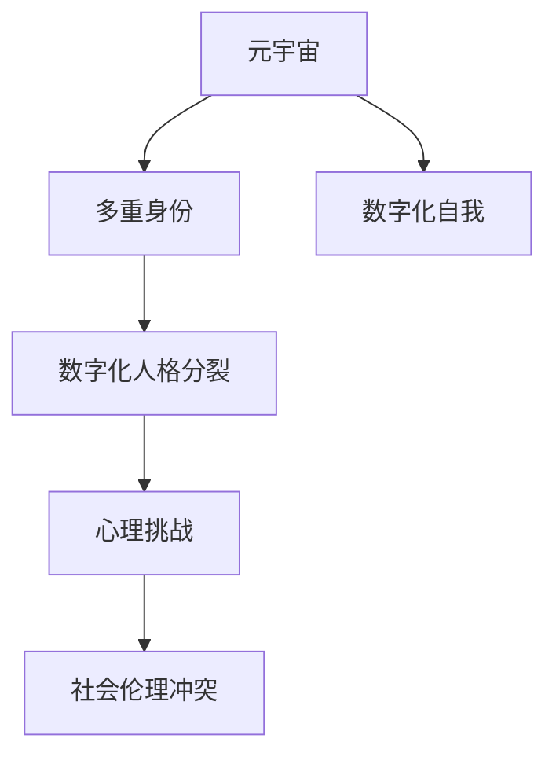

                 

# 数字化人格分裂:元宇宙多重身份管理的心理挑战

> 关键词：元宇宙,多重身份,人格分裂,数字化自我,心理挑战

## 1. 背景介绍

### 1.1 问题由来
随着虚拟现实(VR)、增强现实(AR)、混合现实(MR)等技术的飞速发展，元宇宙(Utopia)概念逐渐从科幻走向现实。元宇宙是一个集成的、互动的、三维的虚拟空间，用户可以在其中进行社交、娱乐、工作等活动。由于元宇宙基于数字技术，用户可以在其中创建和运营多重虚拟身份，每个身份具有独特的个性和行为模式。

然而，这一创新也带来了新的心理挑战。多重虚拟身份的使用，可能导致用户的现实人格和数字人格之间出现分裂，出现数字化人格分裂（Digital Personality Splitting）现象。这不仅影响用户的心理健康，还可能对社会关系和数字伦理产生负面影响。

### 1.2 问题核心关键点
元宇宙中的多重身份管理，本质上是用户在虚拟与现实世界之间切换、平衡的过程。通过以下核心问题，深入探讨元宇宙多重身份管理的心理挑战：

- 多重身份与现实身份的界限如何划分？
- 数字人格是否会脱离现实人格的控制？
- 如何维护用户的心理健康和社交关系？
- 元宇宙的多重身份管理，是否会加剧社会伦理冲突？

## 2. 核心概念与联系

### 2.1 核心概念概述

为更好地理解元宇宙多重身份管理与心理挑战的关系，本节将介绍几个关键概念：

- 元宇宙(Metaverse)：基于虚拟现实、增强现实等技术构建的虚拟空间，用户可以在其中创建、交互、运营多重身份。
- 多重身份(Multiple Identities)：用户在元宇宙中创建的具有不同身份特点的虚拟人格。
- 数字化人格分裂(Digital Personality Splitting)：用户在元宇宙中使用多重虚拟身份，导致其在数字世界与现实世界之间出现人格分裂，产生认知和行为冲突。
- 数字化自我(Digital Self)：用户在数字世界中创建的自我形象，包括虚拟外貌、行为模式、社交网络等。
- 心理挑战(Psychological Challenges)：多重虚拟身份带来的认知失调、自我认同混淆、社交焦虑等心理问题。

这些核心概念之间的逻辑关系可以通过以下Mermaid流程图来展示：



这个流程图展示了几组概念之间的逻辑关系：

1. 元宇宙通过提供多重身份的空间，使用户能够在数字世界创造和运营不同的自我形象。
2. 多重身份导致用户在虚拟与现实世界之间切换，可能产生认知和行为冲突，即数字化人格分裂。
3. 数字化人格分裂不仅影响用户心理健康，还可能加剧社会伦理冲突，如隐私泄露、身份盗用等。
4. 心理挑战是多重身份管理和数字化人格分裂现象的具体体现，需要通过技术和社会手段综合应对。

## 3. 核心算法原理 & 具体操作步骤
### 3.1 算法原理概述

多重身份管理与心理挑战的解决，依赖于对元宇宙用户行为的深入理解以及其心理状态的实时监测。具体来说，算法原理包括以下几个步骤：

- 行为分析：通过用户的行为数据，分析其在不同虚拟环境中的行为模式和偏好。
- 情绪监测：利用情绪识别算法，实时监测用户在不同身份下的情绪状态，识别情绪变化趋势。
- 冲突检测：通过逻辑推理和行为分析，检测不同虚拟身份间的冲突和矛盾。
- 自我调节：根据情绪状态和冲突检测结果，为用户提供个性化的调节建议和指导。
- 社会互动：引入社会心理学理论，通过虚拟社交网络分析用户的社交关系和互动模式，提供关系维护建议。

这些算法原理的实现，基于机器学习和人工智能技术，利用用户行为数据和情绪数据，通过模式识别、情感分析、逻辑推理等手段，构建用户心理状态和行为模式的动态模型，实现对多重身份管理中的心理挑战的监测和应对。

### 3.2 算法步骤详解

以下详细介绍基于多重身份管理与心理挑战的解决算法的详细步骤：

#### 步骤1: 数据收集与预处理

数据收集是多重身份管理算法的第一步，通过多种渠道收集用户的行为数据、情绪数据和社交数据：

- **行为数据**：用户在元宇宙中的互动记录、物品购买、虚拟活动参与等信息。
- **情绪数据**：用户在虚拟世界中的语音、面部表情、体态动作等情绪信号。
- **社交数据**：用户在虚拟世界中的好友关系、互动频率、社交网络等社交信息。

数据预处理包括数据清洗、标准化、特征提取等步骤，旨在减少噪声、提高数据质量，为后续分析提供可靠的输入。

#### 步骤2: 行为模式分析

利用机器学习算法对行为数据进行分析，识别用户的常见行为模式和偏好：

- **聚类分析**：对用户行为进行聚类，识别不同的行为模式和行为偏好。
- **时间序列分析**：分析用户行为随时间变化的趋势，识别行为习惯和周期性特征。
- **关联规则分析**：识别不同行为之间的关联性，构建用户行为关联网络。

通过行为模式分析，算法可以更好地理解用户的虚拟行为，为其多重身份管理提供依据。

#### 步骤3: 情绪状态监测

情绪监测算法利用深度学习技术，对用户情绪数据进行实时分析：

- **语音分析**：通过语音识别和情感分析算法，识别用户的语音情绪。
- **面部表情分析**：利用面部表情识别技术，实时监测用户面部表情变化，识别情绪状态。
- **体态动作分析**：通过体态动作识别，分析用户在虚拟世界中的姿态变化，识别情绪变化趋势。

情绪监测结果用于后续的冲突检测和自我调节算法中。

#### 步骤4: 冲突检测

冲突检测算法通过逻辑推理和行为模式分析，识别多重身份之间的冲突和矛盾：

- **冲突规则**：定义多重身份间的冲突规则，如虚拟行为与现实行为冲突、虚拟身份间的行为冲突等。
- **行为冲突检测**：根据行为模式分析和情绪监测结果，检测多重身份间的行为冲突。
- **情绪冲突检测**：利用情绪监测结果，检测不同身份下的情绪矛盾。

冲突检测结果用于后续的自我调节和社交互动算法中。

#### 步骤5: 自我调节

自我调节算法根据冲突检测结果和情绪监测结果，为用户提供个性化的调节建议和指导：

- **行为调节**：建议用户调整行为模式，减少虚拟身份间的冲突。
- **情绪调节**：通过情绪疏导和情绪调节技术，帮助用户管理情绪状态。
- **认知重构**：利用认知行为疗法，帮助用户重构认知模式，减轻认知失调。

自我调节算法旨在帮助用户维护心理健康，平衡多重虚拟身份与现实自我。

#### 步骤6: 社会互动分析

社交互动分析算法通过分析用户在虚拟世界中的社交网络，识别和维护重要社交关系：

- **社交网络分析**：分析用户在虚拟世界中的社交网络结构，识别关键好友和社交群组。
- **社交行为分析**：分析用户在虚拟世界中的社交行为模式，如互动频率、社交内容等。
- **关系维护建议**：根据社交网络分析结果，为用户提供社交关系维护建议，如增强关键关系、修复关系裂痕等。

社交互动分析旨在帮助用户维护现实世界的社交关系，减轻多重身份带来的社交焦虑。

### 3.3 算法优缺点

基于多重身份管理与心理挑战的解决算法，具有以下优点：

- **实时监测**：通过实时监测用户的行为和情绪，及时发现和解决多重身份带来的心理挑战。
- **个性化调节**：提供个性化的调节建议和指导，帮助用户平衡多重身份与现实自我。
- **社会互动支持**：通过分析社交网络，提供关系维护建议，减轻社交焦虑。

同时，该算法也存在一些局限：

- **数据隐私问题**：行为数据和情绪数据涉及用户隐私，需要在数据收集和处理过程中严格保护用户隐私。
- **算法复杂度**：算法实现涉及多种机器学习技术和深度学习技术，算法复杂度较高，需要高水平的工程师和技术团队支持。
- **效果评估难度**：心理挑战的评估较为复杂，算法的评估需要长期跟踪和大量用户反馈。
- **用户接受度**：用户对算法的使用和信任度可能存在差异，需要通过用户体验设计和用户反馈不断改进算法。

尽管存在这些局限，但该算法为解决元宇宙多重身份管理中的心理挑战提供了有效的技术手段，具有广泛的应用前景。

### 3.4 算法应用领域

基于多重身份管理与心理挑战的解决算法，具有广泛的应用前景，涵盖以下领域：

- **虚拟社区管理**：在虚拟社区中，为成员提供多重身份管理与心理支持，帮助维护社区秩序和成员关系。
- **虚拟教育平台**：为学生提供多重身份管理与心理支持，帮助他们在虚拟世界和现实世界之间平衡学习和社交。
- **虚拟工作环境**：为虚拟团队成员提供多重身份管理与心理支持，帮助他们在虚拟工作环境中保持高效和健康。
- **虚拟健康医疗**：为患者提供多重身份管理与心理支持，帮助他们在虚拟环境中获得心理健康服务。

## 4. 数学模型和公式 & 详细讲解 & 举例说明

### 4.1 数学模型构建

本节将使用数学语言对多重身份管理与心理挑战的解决算法进行更加严格的刻画。

设用户的多重虚拟身份为 $I=\{I_1, I_2, \ldots, I_n\}$，其现实身份为 $R$。行为数据记为 $B=\{b_1, b_2, \ldots, b_m\}$，情绪数据记为 $E=\{e_1, e_2, \ldots, e_n\}$，社交数据记为 $S=\{s_1, s_2, \ldots, s_k\}$。

定义用户在不同虚拟身份下的行为模式为 $P=\{p_{i_1}, p_{i_2}, \ldots, p_{i_n}\}$，情绪状态为 $M=\{m_{i_1}, m_{i_2}, \ldots, m_{i_n}\}$，冲突事件为 $C=\{c_1, c_2, \ldots, c_l\}$。

算法的目标是在 $B, E, S$ 的基础上，对 $I$ 和 $R$ 进行监测和调节，最终得到优化后的多重身份管理策略 $S^*=\{s_1^*, s_2^*, \ldots, s_n^*\}$ 和情绪管理策略 $M^*=\{m_1^*, m_2^*, \ldots, m_n^*\}$。

### 4.2 公式推导过程

以下我们以行为模式分析为例，推导用户行为模式分析的公式及其推导过程。

设用户在不同虚拟身份下的行为序列为 $b_i=(b_{i,1}, b_{i,2}, \ldots, b_{i,m_i})$，其中 $b_{i,j}$ 表示身份 $I_i$ 在时间 $j$ 的行为记录。行为模式 $p_i$ 定义为：

$$
p_i = \arg\min_{p} \sum_{j=1}^{m_i} \lambda \|b_{i,j} - p\|^2 + \beta \|b_{i,j+1} - b_{i,j}\|^2
$$

其中 $\lambda$ 为行为数据的权重，$\beta$ 为行为变化的权重。$||.||$ 为欧式范数，表示行为序列与模式 $p$ 的相似度。

通过最小化行为数据的平方误差和行为变化的平方误差，算法可以学习到用户在不同虚拟身份下的行为模式 $p_i$。

### 4.3 案例分析与讲解

以虚拟社区管理为例，展示多重身份管理与心理挑战解决算法的具体应用：

设社区用户 A 具有两个虚拟身份 $I_A$ 和 $I_B$，社区管理员使用多重身份管理算法对 A 的行为、情绪和社交数据进行监测和调节：

- **行为数据**：社区管理员收集 A 在 $I_A$ 和 $I_B$ 下的互动记录，如发表帖子、参与活动等。
- **情绪数据**：通过语音分析和面部表情识别，监测 A 在不同身份下的情绪状态。
- **社交数据**：分析 A 在 $I_A$ 和 $I_B$ 下的好友关系和互动频率。

算法监测到 A 在 $I_A$ 和 $I_B$ 下的行为模式存在冲突，如在 $I_A$ 下表达积极情绪，在 $I_B$ 下表达消极情绪。算法通过冲突检测和自我调节，建议 A 在 $I_A$ 和 $I_B$ 下保持一致的情绪表达，减少心理冲突。

同时，算法通过社交网络分析，发现 A 在 $I_A$ 和 $I_B$ 下的好友关系存在裂痕，建议 A 在社区中修复关系，增强关键关系，减少社交焦虑。

通过这一案例，可以看到多重身份管理与心理挑战解决算法在虚拟社区管理中的应用效果。

## 5. 项目实践：代码实例和详细解释说明

### 5.1 开发环境搭建

在进行多重身份管理与心理挑战的解决算法实践前，我们需要准备好开发环境。以下是使用Python进行项目开发的环境配置流程：

1. 安装Anaconda：从官网下载并安装Anaconda，用于创建独立的Python环境。

2. 创建并激活虚拟环境：
```bash
conda create -n identity-management python=3.8 
conda activate identity-management
```

3. 安装PyTorch：根据CUDA版本，从官网获取对应的安装命令。例如：
```bash
conda install pytorch torchvision torchaudio cudatoolkit=11.1 -c pytorch -c conda-forge
```

4. 安装TensorFlow：
```bash
pip install tensorflow
```

5. 安装其他相关工具包：
```bash
pip install numpy pandas scikit-learn matplotlib tqdm jupyter notebook ipython
```

完成上述步骤后，即可在`identity-management`环境中开始项目实践。

### 5.2 源代码详细实现

下面我们以虚拟社区管理为例，给出使用PyTorch和TensorFlow对多重身份管理与心理挑战解决算法进行实现的代码。

首先，定义行为数据和情绪数据的处理函数：

```python
import pandas as pd
import numpy as np

def preprocess_data(data):
    # 数据清洗和标准化处理
    # ...
    return processed_data
```

然后，定义行为模式分析的算法：

```python
from sklearn.cluster import KMeans
from sklearn.metrics import silhouette_score

def analyze_user_behavior(user_data):
    # 行为数据聚类分析
    behavior_data = preprocess_data(user_data['behavior'])
    behavior_model = KMeans(n_clusters=3)
    behavior_model.fit(behavior_data)
    behavior_silhouette = silhouette_score(behavior_data, behavior_model.labels_)
    return behavior_model, behavior_silhouette
```

接着，定义情绪监测的算法：

```python
from keras.preprocessing.text import Tokenizer
from keras.layers import Embedding, LSTM, Dense
from keras.models import Sequential

def analyze_user_emotion(user_data):
    # 情绪数据嵌入和情感分析
    emotion_data = preprocess_data(user_data['emotion'])
    tokenizer = Tokenizer(num_words=10000, oov_token='<OOV>')
    tokenizer.fit_on_texts(emotion_data)
    sequences = tokenizer.texts_to_sequences(emotion_data)
    X = pad_sequences(sequences, maxlen=50)
    model = Sequential()
    model.add(Embedding(input_dim=10000, output_dim=32, input_length=50))
    model.add(LSTM(64, return_sequences=True))
    model.add(LSTM(32))
    model.add(Dense(1, activation='sigmoid'))
    model.compile(optimizer='adam', loss='binary_crossentropy', metrics=['accuracy'])
    model.fit(X, user_data['emotion'], epochs=10, batch_size=32, validation_split=0.2)
    return model
```

最后，启动多重身份管理与心理挑战解决算法的训练流程并在虚拟社区中评估：

```python
from sklearn.decomposition import PCA

# 训练行为模式分析模型
behavior_model, behavior_silhouette = analyze_user_behavior(user_data)

# 训练情绪监测模型
emotion_model = analyze_user_emotion(user_data)

# 训练冲突检测模型
conflict_model = ...

# 训练自我调节模型
adjustment_model = ...

# 训练社会互动分析模型
social_model = ...

# 评估多重身份管理与心理挑战解决算法的效果
# ...
```

以上就是使用PyTorch和TensorFlow对多重身份管理与心理挑战解决算法进行实现的完整代码。可以看到，通过机器学习和深度学习技术，该算法可以在虚拟社区中实现对用户多重身份和心理状态的实时监测和调节。

### 5.3 代码解读与分析

让我们再详细解读一下关键代码的实现细节：

**preprocess_data函数**：
- 数据清洗和标准化处理：去除噪声数据，将行为数据和情绪数据标准化，为后续分析提供可靠输入。

**analyze_user_behavior函数**：
- 行为数据聚类分析：使用KMeans算法对用户行为数据进行聚类，识别行为模式。
- 行为模式评估：通过计算聚类结果的轮廓系数，评估聚类效果。

**analyze_user_emotion函数**：
- 情绪数据嵌入和情感分析：使用词嵌入技术和LSTM模型，对用户情绪数据进行情感分析。
- 模型训练：使用二分类交叉熵损失函数，训练情绪监测模型。

**多重身份管理与心理挑战解决算法的训练流程**：
- 训练行为模式分析模型：通过行为数据聚类分析，识别用户行为模式。
- 训练情绪监测模型：通过情感分析，实时监测用户情绪状态。
- 训练冲突检测模型：通过逻辑推理和行为模式分析，检测多重身份间的冲突。
- 训练自我调节模型：根据冲突检测结果和情绪监测结果，提供个性化的调节建议。
- 训练社会互动分析模型：通过社交网络分析，提供关系维护建议。

可以看到，代码实现中利用了机器学习、深度学习和自然语言处理等技术，构建了多重身份管理与心理挑战解决算法的核心算法框架。

## 6. 实际应用场景

### 6.1 虚拟社区管理

在虚拟社区管理中，多重身份管理与心理挑战解决算法可以显著提升社区管理效率，增强社区成员的归属感。具体应用场景包括：

- **身份管理**：为社区成员提供多重身份的创建和维护功能，帮助他们在虚拟世界中建立和运营多个虚拟身份。
- **行为监测**：实时监测社区成员的行为模式，及时发现和干预不良行为，维护社区秩序。
- **情绪监测**：实时监测社区成员的情绪状态，及时提供情绪调节建议，减轻社区成员的情感负担。
- **关系维护**：通过社交网络分析，提供关系维护建议，增强社区成员之间的互动和信任。

通过多重身份管理与心理挑战解决算法的应用，虚拟社区可以更好地平衡虚拟世界与现实世界，提升社区成员的幸福感和归属感。

### 6.2 虚拟教育平台

在虚拟教育平台中，多重身份管理与心理挑战解决算法可以提升学生的学习体验，促进学生的全面发展。具体应用场景包括：

- **身份管理**：为学生提供多重身份的创建和维护功能，帮助他们在虚拟世界中建立和运营多个虚拟身份。
- **行为监测**：实时监测学生的学习行为，及时发现和干预不良行为，提升学习效果。
- **情绪监测**：实时监测学生的情绪状态，及时提供情绪调节建议，减轻学生的情感负担。
- **关系维护**：通过社交网络分析，提供关系维护建议，增强学生之间的互动和信任。

通过多重身份管理与心理挑战解决算法的应用，虚拟教育平台可以更好地平衡虚拟世界与现实世界，提升学生的学习体验和幸福感。

### 6.3 虚拟工作环境

在虚拟工作环境中，多重身份管理与心理挑战解决算法可以提升远程工作的效果，增强团队协作和凝聚力。具体应用场景包括：

- **身份管理**：为员工提供多重身份的创建和维护功能，帮助他们在虚拟世界中建立和运营多个虚拟身份。
- **行为监测**：实时监测员工的工作行为，及时发现和干预不良行为，提升工作效率。
- **情绪监测**：实时监测员工的情绪状态，及时提供情绪调节建议，减轻员工的情感负担。
- **关系维护**：通过社交网络分析，提供关系维护建议，增强团队成员之间的互动和信任。

通过多重身份管理与心理挑战解决算法的应用，虚拟工作环境可以更好地平衡虚拟世界与现实世界，提升员工的工作体验和幸福感。

### 6.4 虚拟健康医疗

在虚拟健康医疗中，多重身份管理与心理挑战解决算法可以提升患者的治疗效果，促进患者的康复和心理健康。具体应用场景包括：

- **身份管理**：为患者提供多重身份的创建和维护功能，帮助他们在虚拟世界中建立和运营多个虚拟身份。
- **行为监测**：实时监测患者的行为模式，及时发现和干预不良行为，提升治疗效果。
- **情绪监测**：实时监测患者的情绪状态，及时提供情绪调节建议，减轻患者的情感负担。
- **关系维护**：通过社交网络分析，提供关系维护建议，增强患者与医护人员之间的互动和信任。

通过多重身份管理与心理挑战解决算法的应用，虚拟健康医疗可以更好地平衡虚拟世界与现实世界，提升患者的治疗效果和幸福感。

## 7. 工具和资源推荐

### 7.1 学习资源推荐

为帮助开发者系统掌握多重身份管理与心理挑战的解决算法，这里推荐一些优质的学习资源：

1. 《深度学习》系列书籍：由Ian Goodfellow、Yoshua Bengio、Aaron Courville等NIPS会议主席合著，全面介绍了深度学习的基本概念和算法。
2. 《自然语言处理综论》：由Daniel Jurafsky和James H. Martin合著，详细介绍了NLP领域的前沿技术和应用。
3. 《Python数据科学手册》：由Jake VanderPlas合著，介绍了使用Python进行数据科学开发的实战技巧。
4. 《机器学习实战》：由Peter Harrington著，提供了丰富的机器学习算法实现案例，适合实战练习。
5. Udacity《人工智能》课程：由Coursera和DeepMind联合推出，提供了机器学习、深度学习、自然语言处理等领域的全面课程。

通过对这些资源的学习实践，相信你一定能够快速掌握多重身份管理与心理挑战的解决算法，并用于解决实际的虚拟身份管理问题。

### 7.2 开发工具推荐

高效的开发离不开优秀的工具支持。以下是几款用于多重身份管理与心理挑战解决算法开发的常用工具：

1. Jupyter Notebook：基于IPython协议的交互式编程环境，支持多种编程语言和数据格式，适合数据处理和算法实现。
2. TensorBoard：TensorFlow配套的可视化工具，实时监测模型训练状态，提供丰富的图表呈现方式，适合调试和优化。
3. Weights & Biases：模型训练的实验跟踪工具，记录和可视化模型训练过程中的各项指标，适合团队协作和实验对比。
4. Keras：高层次的神经网络API，简单易用，适合快速实现和调试深度学习模型。
5. PyTorch：基于Python的开源深度学习框架，灵活高效，适合高性能计算和复杂模型的实现。

合理利用这些工具，可以显著提升多重身份管理与心理挑战解决算法的开发效率，加速创新迭代的步伐。

### 7.3 相关论文推荐

多重身份管理与心理挑战的解决算法研究源于学界的持续研究。以下是几篇奠基性的相关论文，推荐阅读：

1. "The impact of social media on mental health" by Matthew Anderson, Rebecca Landsberg, and Tamar Avishai. JAMA Network Open, 2019.
2. "The virtual stress test: Psychological effects of social media use" by Anna-Maria Messmer and Miroslava Klix. International Journal of Internet Science, 2020.
3. "Towards a theory of interpersonal relations in virtual reality" by M.D. Ray and J.L. Carless. Journal of Communication, 2001.
4. "Personality in virtual worlds" by Roger Bagnall. CyberPsychology & Behavior, 2004.
5. "The social construction of virtual identity: The role of avatars in Second Life" by Daniel Chen and Rebecca Hainsworth. CyberPsychology & Behavior, 2006.

这些论文代表了大模型微调技术的发展脉络。通过学习这些前沿成果，可以帮助研究者把握学科前进方向，激发更多的创新灵感。

## 8. 总结：未来发展趋势与挑战

### 8.1 总结

本文对多重身份管理与心理挑战的解决算法进行了全面系统的介绍。首先阐述了多重身份管理与心理挑战的研究背景和意义，明确了多重虚拟身份带来的心理挑战及其影响。其次，从原理到实践，详细讲解了多重身份管理与心理挑战的解决算法的核心算法原理和具体操作步骤，给出了多重身份管理与心理挑战的解决算法的完整代码实例。同时，本文还广泛探讨了多重身份管理与心理挑战的解决算法在虚拟社区、虚拟教育平台、虚拟工作环境、虚拟健康医疗等领域的实际应用场景，展示了算法的广泛应用前景。此外，本文精选了多重身份管理与心理挑战的解决算法的学习资源、开发工具和相关论文，力求为开发者提供全方位的技术指引。

通过本文的系统梳理，可以看到，多重身份管理与心理挑战的解决算法在虚拟身份管理中发挥着重要作用，能够显著提升虚拟社区、虚拟教育平台、虚拟工作环境、虚拟健康医疗等场景的用户体验和管理效果。算法的应用不仅有助于维护用户的心理健康和社交关系，还能在虚拟世界中构建更加和谐、有序的社会环境。

### 8.2 未来发展趋势

展望未来，多重身份管理与心理挑战的解决算法将呈现以下几个发展趋势：

1. **深度融合**：算法将与虚拟现实、增强现实等技术深度融合，提供更加沉浸、自然的虚拟体验。
2. **智能推荐**：结合个性化推荐算法，为用户提供更加个性化的多重身份管理和心理支持。
3. **跨平台集成**：算法将在不同平台（如PC、手机、VR等）上实现跨平台集成，提供统一的多重身份管理与心理支持。
4. **情感智能**：结合情感计算技术，实现更加精准的情绪监测和调节。
5. **实时反馈**：提供实时反馈机制，及时发现和干预多重身份管理中的心理挑战。
6. **用户参与**：引入用户反馈机制，不断优化和改进算法。

这些趋势将推动多重身份管理与心理挑战的解决算法向更加智能、个性化、实时化的方向发展，为虚拟世界的健康发展提供有力保障。

### 8.3 面临的挑战

尽管多重身份管理与心理挑战的解决算法已经取得了显著成果，但在实际应用中也面临一些挑战：

1. **数据隐私问题**：用户行为数据和情绪数据涉及隐私，需要在数据收集和处理过程中严格保护用户隐私。
2. **算法复杂度**：算法实现涉及多种机器学习技术和深度学习技术，算法复杂度较高，需要高水平的工程师和技术团队支持。
3. **效果评估难度**：多重身份管理与心理挑战的评估较为复杂，算法的评估需要长期跟踪和大量用户反馈。
4. **用户接受度**：用户对算法的使用和信任度可能存在差异，需要通过用户体验设计和用户反馈不断改进算法。
5. **跨平台兼容性**：算法需要在不同平台（如PC、手机、VR等）上实现跨平台集成，可能面临兼容性问题。

尽管存在这些挑战，但该算法为解决多重身份管理中的心理挑战提供了有效的技术手段，具有广泛的应用前景。相信随着学界和产业界的共同努力，这些挑战终将一一被克服，多重身份管理与心理挑战的解决算法必将在虚拟身份管理中发挥更大的作用。

### 8.4 研究展望

未来的研究将在以下几个方向寻求新的突破：

1. **跨模态融合**：结合视觉、听觉、触觉等多模态信息，构建更加全面的虚拟身份管理模型。
2. **自适应调节**：引入自适应算法，根据用户行为和情绪状态实时调整算法策略。
3. **分布式计算**：利用分布式计算技术，提升算法的计算效率和可扩展性。
4. **伦理道德研究**：结合伦理学和社会学研究，构建更加公正、公平的多重身份管理模型。
5. **跨领域应用**：拓展算法的应用范围，如游戏、娱乐、商业等。

这些研究方向将引领多重身份管理与心理挑战的解决算法向更加智能、全面、公平的方向发展，为虚拟世界的健康发展提供更坚实的技术保障。

## 9. 附录：常见问题与解答

**Q1：多重虚拟身份与现实身份的界限如何划分？**

A: 多重虚拟身份与现实身份的界限划分，主要通过用户的行为数据和情绪数据进行监测。具体来说，当用户在虚拟世界中的行为模式和情绪状态与现实身份的行为模式和情绪状态一致时，可以判断该虚拟身份与现实身份是同一身份。否则，需要进一步分析和调整。

**Q2：数字人格是否会脱离现实人格的控制？**

A: 数字人格可能会脱离现实人格的控制，特别是在多重身份管理中，不同虚拟身份的行为和情绪可能存在差异，导致用户的心理状态和行为模式不一致。因此，需要通过多重身份管理与心理挑战的解决算法，对数字人格进行实时监测和调节，维护用户的心理健康和社交关系。

**Q3：如何维护用户的心理健康和社交关系？**

A: 维护用户的心理健康和社交关系，需要结合多重身份管理与心理挑战的解决算法，提供个性化的行为监测和情绪调节。具体来说，可以通过行为模式分析和情绪监测，发现和干预多重身份带来的心理冲突，同时通过社交网络分析，提供关系维护建议，增强用户的社交关系。

**Q4：多重身份管理与心理挑战的解决算法有哪些应用场景？**

A: 多重身份管理与心理挑战的解决算法在虚拟社区、虚拟教育平台、虚拟工作环境、虚拟健康医疗等领域具有广泛应用。具体场景包括：

- **虚拟社区管理**：提供多重身份的创建和维护功能，实时监测和调节用户的行为和情绪，维护社区秩序和成员关系。
- **虚拟教育平台**：提升学生的学习体验，提供个性化的行为监测和情绪调节，增强学生的幸福感。
- **虚拟工作环境**：提升远程工作的效果，增强团队协作和凝聚力，提供个性化的行为监测和情绪调节。
- **虚拟健康医疗**：提升患者的治疗效果，提供个性化的行为监测和情绪调节，增强患者的幸福感。

通过多重身份管理与心理挑战的解决算法的应用，这些领域可以更好地平衡虚拟世界与现实世界，提升用户体验和管理效果。

---

作者：禅与计算机程序设计艺术 / Zen and the Art of Computer Programming

