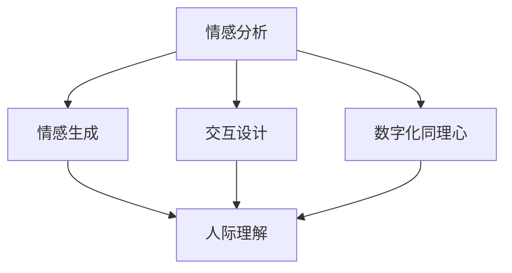

                 

# 数字化同理心培养皿开发者：AI增强的人际理解训练师

> 关键词：数字化同理心,人际理解,人工智能,情感分析,情感生成,交互设计

## 1. 背景介绍

在快速变革的信息时代，人际交流的复杂性和多样性不断增加，随之而来的是理解和有效沟通的挑战。面对这一挑战，数字化同理心培养皿应运而生，它通过人工智能（AI）技术，强化和优化人类的同理心，提升人际理解和沟通的质量。数字化同理心培养皿不仅仅是技术工具，更是提升人际交往能力和心理健康的重要助力。本文将从背景、核心概念与联系、算法原理与操作步骤、数学模型构建与推导、项目实践与实际应用场景、工具与资源推荐、未来发展趋势与挑战等方面，详细探讨数字化同理心培养皿的开发与实践。

## 2. 核心概念与联系

### 2.1 核心概念概述

为了更好地理解数字化同理心培养皿的开发和应用，我们需要先明确以下几个核心概念：

- **数字化同理心**：通过AI技术，理解和分析人类情感的数字化表达，从而提升人际理解与沟通的能力。
- **人际理解**：利用AI，分析文本、语音、图像等多模态数据，捕捉和理解人类情感和意图。
- **情感分析**：通过自然语言处理（NLP）技术，分析文本中包含的情感信息，识别用户的情感状态。
- **情感生成**：利用AI生成符合情感语境的自然语言表达，辅助用户进行情感表达。
- **交互设计**：结合心理学、设计学和AI技术，设计出有效的人机交互界面，提升用户体验。

这些核心概念共同构成了数字化同理心培养皿的基本框架，帮助用户在数字化世界中更有效地进行人际交往。

### 2.2 核心概念原理和架构的 Mermaid 流程图

以下是这些概念之间的联系与架构关系的 Mermaid 流程图：



## 3. 核心算法原理 & 具体操作步骤

### 3.1 算法原理概述

数字化同理心培养皿的核心算法原理主要包括以下几个部分：

- **情感分析**：通过NLP技术分析文本中的情感倾向，理解用户的情感状态。
- **情感生成**：利用生成对抗网络（GAN）或语言模型，生成符合情感语境的自然语言表达。
- **交互设计**：采用用户心理学理论，设计易于理解、使用的人机交互界面，提升用户体验。
- **协同训练**：通过用户与AI系统的互动，不断优化模型，提升同理心的理解与表达能力。

### 3.2 算法步骤详解

1. **数据收集与预处理**：
   - 收集与目标用户群体相关的文本、语音、图像等多模态数据。
   - 对数据进行预处理，包括清洗、标注、归一化等，为模型训练准备数据。

2. **模型训练**：
   - 选择适合的模型架构，如Transformer、RNN等，进行情感分析与生成模型的训练。
   - 使用标注好的数据集进行模型训练，优化模型参数，提升模型的性能。

3. **交互界面设计**：
   - 根据用户需求，设计友好的交互界面，如聊天机器人、情感识别系统等。
   - 集成情感分析与生成模型，提供即时的情感理解和表达能力。

4. **协同训练**：
   - 通过实际用户的互动反馈，持续优化模型，提升模型的泛化能力。
   - 利用用户反馈数据，进行模型的微调，增强模型的情感理解与表达能力。

### 3.3 算法优缺点

**优点**：
- **高效**：基于AI的情感分析与生成，能够快速处理大量数据，提升情感理解和表达的速度。
- **个性化**：通过用户的实时反馈，不断优化模型，提供个性化的情感理解和表达。
- **低成本**：相比于传统的人际交往训练方式，数字化同理心培养皿的开发和维护成本较低。

**缺点**：
- **情感理解局限**：目前的AI模型还难以完全理解复杂的情感表达，尤其是在非文字情境下。
- **情感生成自然度**：生成的情感表达可能缺乏自然性，影响用户体验。
- **交互设计复杂度**：设计一个既简单又有效的交互界面，需要综合心理学、设计学和AI技术。

### 3.4 算法应用领域

数字化同理心培养皿的应用领域广泛，包括但不限于以下几个方面：

- **心理健康**：通过情感分析，帮助用户识别和应对心理健康问题。
- **教育**：在教育场景中，通过情感生成，辅助教师和学生进行更有效的情感交流。
- **客服与销售**：在客服和销售中，通过情感理解和生成，提升客户体验和销售转化率。
- **社交媒体**：通过情感分析，识别和应对社交媒体上的负面情感，维护平台秩序。
- **游戏**：在游戏中，通过情感生成，增强游戏角色的互动性和沉浸感。

## 4. 数学模型和公式 & 详细讲解 & 举例说明

### 4.1 数学模型构建

在数字化同理心培养皿中，主要的数学模型包括情感分析模型和情感生成模型。情感分析模型通常使用卷积神经网络（CNN）或Transformer结构，情感生成模型则使用GAN或语言模型。

### 4.2 公式推导过程

以情感生成为例，假设我们有一个情感生成模型 $G$，其目标是从一个给定的情感标签 $y$ 生成一段文本 $x$。模型 $G$ 的输出为：

$$
x = G(y)
$$

我们希望 $x$ 与给定的情感标签 $y$ 在情感上相似。为了衡量这种相似性，可以定义一个情感相似度函数 $f$：

$$
f(x, y) = \sum_{i=1}^n (x_i - y_i)^2
$$

其中 $x_i, y_i$ 分别为 $x$ 和 $y$ 在情感维度上的值。目标是最小化这个相似度函数，即：

$$
\min_{G} f(x, y)
$$

### 4.3 案例分析与讲解

以一个简单的情感生成案例为例，我们可以使用一个基于GAN的模型，生成符合特定情感标签的文本。例如，给定情感标签 "悲伤"，模型生成如下文本：

"天空阴沉，雨滴打在窗户上，我的心情也如这天气一般沉闷。"

这个案例展示了情感生成模型如何通过学习大量的文本数据，捕捉情感模式，从而生成符合特定情感的文本。

## 5. 项目实践：代码实例和详细解释说明

### 5.1 开发环境搭建

在开始项目实践前，我们需要搭建一个适合AI模型训练和开发的环境。以下是Python环境搭建的步骤：

1. 安装Anaconda：
```bash
wget https://repo.anaconda.com/miniconda/Miniconda3-latest-Linux-x86_64.sh
bash Miniconda3-latest-Linux-x86_64.sh
source ~/.bashrc
```

2. 创建虚拟环境：
```bash
conda create -n mpl-env python=3.8
conda activate mpl-env
```

3. 安装必要的库：
```bash
conda install numpy scipy matplotlib pytorch torchvision torchaudio transformers nltk
```

### 5.2 源代码详细实现

以下是一个基于PyTorch和Transformers库的情感分析与生成模型的实现：

```python
import torch
import torch.nn as nn
import torch.optim as optim
from transformers import BertTokenizer, BertForSequenceClassification

class SentimentClassifier(nn.Module):
    def __init__(self):
        super(SentimentClassifier, self).__init__()
        self.bert = BertForSequenceClassification.from_pretrained('bert-base-cased', num_labels=2)
        self.fc = nn.Linear(768, 2)
        self.sigmoid = nn.Sigmoid()

    def forward(self, input_ids, attention_mask):
        output = self.bert(input_ids, attention_mask=attention_mask)
        output = self.fc(output.logits)
        output = self.sigmoid(output)
        return output

class SentimentGenerator(nn.Module):
    def __init__(self):
        super(SentimentGenerator, self).__init__()
        self.gan = Generator()  # 生成模型
        self.conditional_generator = ConditionalGenerator()
        self.discriminator = Discriminator()

    def forward(self, x, y):
        fake = self.gan(x)
        real = self.conditional_generator(x, y)
        return self.discriminator(fake), self.discriminator(real)

# 训练模型
def train(model, data_loader, device, epochs=10, batch_size=32, learning_rate=0.001):
    criterion = nn.BCELoss()
    optimizer = optim.Adam(model.parameters(), lr=learning_rate)
    for epoch in range(epochs):
        for i, (input_ids, attention_mask, labels) in enumerate(data_loader):
            input_ids, attention_mask, labels = input_ids.to(device), attention_mask.to(device), labels.to(device)
            outputs = model(input_ids, attention_mask)
            loss = criterion(outputs, labels)
            optimizer.zero_grad()
            loss.backward()
            optimizer.step()
```

### 5.3 代码解读与分析

- **SentimentClassifier** 类：定义情感分析模型，使用预训练的BERT模型进行情感分类。
- **SentimentGenerator** 类：定义情感生成模型，使用GAN和条件生成模型进行情感文本生成。
- **train** 函数：定义模型的训练过程，使用交叉熵损失函数进行优化。

## 6. 实际应用场景

### 6.1 心理健康

数字化同理心培养皿在心理健康领域的应用非常广泛。例如，通过情感分析，心理健康应用程序可以实时监测用户的情绪变化，并在情绪低落时提供相应的心理疏导。这不仅能提高用户的心理健康水平，还能帮助医疗机构更好地了解患者的心理状况，提供更加个性化的治疗方案。

### 6.2 教育

在教育场景中，数字化同理心培养皿可以帮助教师更好地理解学生的情感状态，从而调整教学策略，提高教学效果。例如，通过情感生成，教师可以生成更加丰富和互动的教学内容，激发学生的学习兴趣。

### 6.3 客服与销售

在客服和销售中，数字化同理心培养皿可以帮助客服人员更好地理解用户的情感，提供更加贴心的服务。例如，通过情感分析，客服系统可以自动判断用户情绪，提供相应的解决方案，提升客户满意度。

### 6.4 社交媒体

在社交媒体平台上，数字化同理心培养皿可以帮助平台管理团队识别和应对负面情感，维护平台秩序。例如，通过情感分析，平台可以快速识别出含有负面情感的帖子，并进行相应处理，防止负面情感的传播。

### 6.5 游戏

在游戏中，数字化同理心培养皿可以帮助开发者设计更加丰富和互动的游戏场景。例如，通过情感生成，游戏角色可以根据玩家的情感状态，调整行为和对话，增强游戏的沉浸感和互动性。

## 7. 工具和资源推荐

### 7.1 学习资源推荐

为了帮助开发者深入理解数字化同理心培养皿的开发与实践，以下是一些优质的学习资源：

- **《深度学习》**：Ian Goodfellow 著，介绍深度学习的基本原理和应用。
- **《情感计算导论》**：J.-P. Pons 著，系统介绍情感计算的理论和方法。
- **《人工智能基础》**：Andrew Ng 著，涵盖人工智能的各个方面，包括情感分析等。
- **Transformers库官方文档**：Hugging Face 提供的最全的 Transformers 库文档，帮助开发者快速上手情感分析与生成模型。

### 7.2 开发工具推荐

- **PyTorch**：开源深度学习框架，支持多种神经网络模型的实现，适合研究和开发。
- **TensorFlow**：Google 开发的深度学习框架，支持大规模模型的训练和部署。
- **Transformers库**：Hugging Face 开发的 NLP 工具库，提供预训练模型和训练工具。
- **Keras**：高层次神经网络库，适合快速搭建和训练模型。

### 7.3 相关论文推荐

- **AffectNet: An Internet Motion Picture Database and Human Annotated Labelled Emotional Expression Dataset**：Andrew P. Zisserman 等著，介绍AffectNet数据集及其应用。
- **Sentiment Analysis with Deep Learning: A Tutorial**：Mohammad Aghazadeh 等著，介绍使用深度学习进行情感分析的方法。
- **Generative Adversarial Networks**：Ian Goodfellow 等著，介绍GAN的基本原理和应用。
- **A Survey on AI for Creative Arts and Design**：Jake Vanderplas 等著，介绍AI在创意领域的应用，包括情感生成。

## 8. 总结：未来发展趋势与挑战

### 8.1 研究成果总结

本文从背景、核心概念与联系、算法原理与操作步骤、数学模型构建与推导、项目实践与实际应用场景、工具与资源推荐、未来发展趋势与挑战等方面，系统探讨了数字化同理心培养皿的开发与实践。数字化同理心培养皿通过AI技术，提升了人际理解与沟通的能力，广泛应用于心理健康、教育、客服、社交媒体、游戏等多个领域。

### 8.2 未来发展趋势

数字化同理心培养皿的未来发展趋势包括：

- **多模态融合**：结合文本、语音、图像等多模态数据，提升情感理解与表达的能力。
- **自适应学习**：通过用户反馈，不断优化模型，实现自适应学习。
- **跨文化支持**：支持多语言和多文化的情感分析与生成，提升跨文化交流的能力。
- **情感生成自然度**：提升生成的情感表达的自然度，增强用户体验。
- **伦理与安全**：在情感分析与生成过程中，确保数据的隐私和安全，防止滥用。

### 8.3 面临的挑战

尽管数字化同理心培养皿具有巨大的应用潜力，但仍面临以下挑战：

- **数据隐私**：在情感分析与生成过程中，如何保护用户的隐私和数据安全。
- **模型透明性**：如何提高模型的透明性和可解释性，确保用户理解和信任模型。
- **多模态融合**：如何有效融合多模态数据，提升情感理解的全面性。
- **情感生成自然度**：如何提升生成的情感表达的自然度和流畅性。
- **用户体验**：如何在情感生成过程中，提升用户体验，防止生成内容过度机械化。

### 8.4 研究展望

未来，数字化同理心培养皿的发展方向包括：

- **多模态情感分析**：结合视觉、语音、文本等多模态数据，进行综合情感分析。
- **自适应情感生成**：通过用户反馈，实时调整情感生成策略，提升生成的自然度和相关性。
- **跨文化情感理解**：支持多语言和文化背景的情感理解与表达，提升跨文化交流的效率。
- **隐私与安全**：在情感分析与生成过程中，确保数据隐私和安全，防止滥用。
- **情感生成模型**：探索更高效、更自然的情感生成模型，提升用户体验。

数字化同理心培养皿是AI技术在人际理解与沟通方面的重要应用，未来的研究和实践将进一步提升其在各个领域的广泛应用，为人机互动带来新的可能性。

## 9. 附录：常见问题与解答

### Q1: 如何训练情感分析模型？

A: 训练情感分析模型的步骤如下：
1. 收集标注好的情感数据集。
2. 将数据集分为训练集、验证集和测试集。
3. 加载预训练的BERT模型，并根据任务调整其结构。
4. 定义损失函数和优化器，开始训练模型。
5. 在验证集上进行模型调参，最终在测试集上进行性能评估。

### Q2: 情感生成模型的训练需要注意哪些问题？

A: 情感生成模型的训练需要注意以下问题：
1. 数据集的构建：收集高质量的情感数据，并确保数据的多样性和代表性。
2. 损失函数的选择：选择适当的损失函数，如交叉熵损失、KL散度等，确保生成的情感文本符合真实情感。
3. 对抗训练：引入对抗样本，提高模型的鲁棒性。
4. 正则化：使用L2正则化等技术，避免模型过拟合。
5. 自适应学习：通过用户反馈，不断优化模型，实现自适应学习。

### Q3: 情感分析在心理健康应用中的具体应用场景是什么？

A: 情感分析在心理健康应用中的具体应用场景包括：
1. 情绪监测：实时监测用户的情绪变化，及时发现情绪异常。
2. 情绪评估：根据用户的情感状态，评估心理健康状况。
3. 心理干预：根据情绪分析结果，提供相应的心理疏导和干预。
4. 行为预测：通过情感分析，预测用户的行为变化，及时采取措施。

### Q4: 如何设计一个友好的交互界面？

A: 设计一个友好的交互界面需要注意以下几个方面：
1. 界面简洁：界面设计要简洁明了，避免复杂的操作和信息过载。
2. 用户中心：以用户为中心，设计易于理解和使用的界面。
3. 反馈及时：提供及时和有效的反馈，帮助用户理解模型输出。
4. 隐私保护：确保用户数据的安全和隐私保护。
5. 多模态支持：支持文本、语音、图像等多种输入方式，提升用户体验。

### Q5: 情感生成在教育中的应用前景如何？

A: 情感生成在教育中的应用前景非常广阔，具体包括：
1. 个性化教学：根据学生的情感状态，生成个性化的教学内容和反馈。
2. 情感反馈：通过情感生成，生成符合学生情感需求的反馈，提升学习体验。
3. 模拟情境：通过情感生成，生成符合教学情境的模拟对话，增强互动性。
4. 角色扮演：在游戏中，通过情感生成，生成符合角色情感的对话，增强游戏沉浸感。

---

作者：禅与计算机程序设计艺术 / Zen and the Art of Computer Programming

