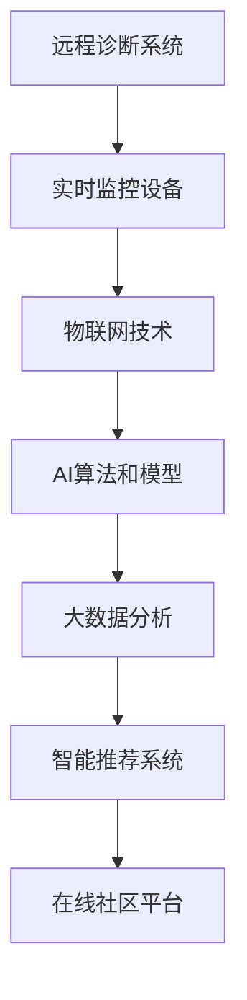

                 

# 数字化宠物医疗创业：远程诊断和监控

> 关键词：宠物医疗,远程诊断,实时监控,数字化转型,物联网(IoT),AI算法,大数据分析

## 1. 背景介绍

随着全球宠物家庭化的普及，宠物数量激增，与之相关的一系列健康管理问题也随之突显。传统宠物医疗大多依赖于兽医现场检查和诊断，存在时间、成本和空间上的限制，且对兽医的专业水平要求较高。数字化宠物医疗创业，正是通过互联网技术和AI算法，打破这些限制，提升宠物医疗服务的可及性和效率。

### 1.1 问题由来

传统的宠物医疗服务模式面临以下几个主要问题：

- **时间成本高**：宠物主人需要预约兽医并前往诊所进行检查，耗时耗力。
- **空间限制**：地理区域性的限制，远离兽医诊所的宠物难以获得及时治疗。
- **成本高昂**：现场检查费用昂贵，且不定期检查难以满足宠物健康管理需求。
- **专业门槛**：对兽医的专业技能要求高，宠物主人难以自行诊断和监控宠物健康。

数字化宠物医疗创业，通过远程诊断和监控系统，以及智能硬件设备的支持，可以克服这些限制，为宠物主人提供更为便捷、高效和经济的医疗服务。

### 1.2 问题核心关键点

数字化宠物医疗的核心目标是通过技术手段提升宠物健康管理的效率和质量。其关键在于：

- **远程诊断**：利用AI算法，通过远程视频和图像采集，分析宠物的生理指标，提供初步诊断和建议。
- **实时监控**：部署传感器和智能设备，实时采集宠物的生理数据，如心率、呼吸、步态等，及时发现健康异常。
- **数据分析**：整合大数据分析技术，从历史健康数据中挖掘规律，提升诊断和监控的精准度。
- **个性化服务**：通过智能推荐系统，提供个性化的健康管理方案和预防措施。
- **社区协作**：构建宠物主人和兽医的在线交流平台，共享健康经验和专业建议。

通过这些关键技术手段，数字化宠物医疗创业能够为宠物主人提供全天候、多维度的健康管理服务，极大地提升宠物医疗的可及性和服务质量。

## 2. 核心概念与联系

### 2.1 核心概念概述

数字化宠物医疗创业的实现离不开以下几个核心概念：

- **远程诊断系统**：基于视频、图像和生理数据的AI诊断系统，能够自动检测宠物的异常情况并给出诊断建议。
- **实时监控设备**：部署在宠物身上的传感器和智能设备，实时采集生理数据，为远程诊断提供数据支撑。
- **物联网(IoT)技术**：实现设备和系统之间的互联互通，为数据采集和传输提供支撑。
- **AI算法和模型**：用于图像识别、生理数据分析、自然语言处理等任务，提升系统的智能化水平。
- **大数据分析**：整合和分析海量数据，挖掘健康趋势和规律，辅助诊断和预测。
- **智能推荐系统**：根据宠物的历史健康数据和实时监测数据，生成个性化的健康管理方案。
- **在线社区平台**：为宠物主人和兽医提供交流和协作的空间，共享健康经验和专业建议。

这些概念之间的联系可以通过以下Mermaid流程图来展示：



这个流程图展示了大数字化宠物医疗创业的技术框架，包括数据采集、传输、分析和应用的各个环节。通过这些技术的融合，实现宠物健康管理的数字化和智能化。

## 3. 核心算法原理 & 具体操作步骤
### 3.1 算法原理概述

数字化宠物医疗的算法原理主要围绕以下几个方面展开：

- **图像识别与分析**：通过计算机视觉技术，从远程视频和图像中提取宠物的生理特征，如颜色、形态、行为等，识别异常情况。
- **生理数据分析**：利用传感器采集的生理数据，如心率、呼吸、步态等，结合AI算法，进行健康状态的分析和预测。
- **自然语言处理(NLP)**：通过文本分析技术，从宠物主人的互动中提取有用信息，辅助诊断和监控。
- **强化学习**：通过与兽医专家的协作，不断优化AI模型的诊断和治疗策略。

这些算法技术的核心原理都是通过机器学习，利用大量的标注数据和先验知识，训练出能够自动识别和处理宠物健康问题的模型。

### 3.2 算法步骤详解

以下是数字化宠物医疗创业的主要算法步骤：

**Step 1: 数据采集与预处理**

- 收集远程视频、图像、生理数据和自然语言文本。
- 对数据进行去噪、归一化、标准化等预处理操作。

**Step 2: 特征提取与识别**

- 利用图像处理技术，提取视频和图像中的关键特征。
- 使用生理数据分析技术，提取心率、呼吸等生理参数。
- 利用NLP技术，从自然语言文本中提取宠物健康相关的信息。

**Step 3: 模型训练与优化**

- 构建AI诊断模型，训练识别宠物的异常情况。
- 训练生理数据分析模型，用于预测健康趋势。
- 构建智能推荐模型，生成个性化的健康管理方案。

**Step 4: 数据融合与分析**

- 整合图像、生理数据和自然语言文本，进行全面的健康分析。
- 利用大数据分析技术，挖掘健康数据中的规律和趋势。

**Step 5: 结果输出与反馈**

- 将诊断结果和健康建议通过应用程序展示给宠物主人。
- 收集反馈信息，不断优化和更新模型和系统。

### 3.3 算法优缺点

数字化宠物医疗创业的算法具有以下优点：

- **高效便捷**：远程诊断和实时监控系统，大大减少了宠物主人和兽医的物理接触，提升了医疗服务的效率。
- **数据全面**：综合利用视频、图像、生理数据和自然语言文本，提供了多维度的健康数据支持。
- **精准预测**：利用AI和大数据分析技术，提升了诊断和预测的精准度。
- **个性化服务**：通过智能推荐系统，提供个性化的健康管理方案，满足不同宠物的需求。

同时，算法也存在以下缺点：

- **数据隐私**：宠物生理数据的采集和传输需要严格保护隐私。
- **算法局限**：AI模型的训练数据和先验知识限制了其性能和泛化能力。
- **成本高昂**：初始设备部署和系统维护成本较高，需要较高的技术门槛。
- **数据质量**：生理数据的采集精度和一致性对诊断结果有很大影响。

### 3.4 算法应用领域

数字化宠物医疗创业的算法技术可以广泛应用于以下几个领域：

- **宠物诊所**：为宠物诊所提供远程诊断和监控支持，提高诊断效率和治疗效果。
- **宠物主人**：为宠物主人提供日常健康监测和管理方案，预防和及时发现健康问题。
- **兽医培训**：利用AI和大数据技术，辅助兽医进行诊断和教学。
- **宠物健康研究**：收集和分析宠物健康数据，为宠物健康科学研究提供数据支撑。
- **宠物产品开发**：通过数据分析，开发针对不同宠物种类的健康管理产品和解决方案。

## 4. 数学模型和公式 & 详细讲解 & 举例说明

### 4.1 数学模型构建

数字化宠物医疗的数学模型主要包含以下几个方面：

- **图像识别模型**：$Y = f(X; \theta)$，其中 $X$ 为输入图像，$Y$ 为输出结果，$\theta$ 为模型参数。
- **生理数据分析模型**：$Z = g(X; \theta)$，其中 $X$ 为生理数据，$Z$ 为健康状态预测，$\theta$ 为模型参数。
- **自然语言处理模型**：$H = h(T; \theta)$，其中 $T$ 为自然语言文本，$H$ 为健康相关信息，$\theta$ 为模型参数。
- **智能推荐模型**：$R = k(H, Z; \phi)$，其中 $H$ 为健康历史数据，$Z$ 为实时监测数据，$R$ 为健康管理方案，$\phi$ 为模型参数。

### 4.2 公式推导过程

以下是几个关键模型的公式推导：

**图像识别模型**

对于图像识别模型，假设输入图像为 $X$，输出为 $Y$，模型为 $f$。设 $X \in \mathbb{R}^n$，$Y \in \{0, 1\}$，$Y = 1$ 表示异常，$Y = 0$ 表示正常。模型可以表示为：

$$
Y = \sigma(\mathbf{W}X + b)
$$

其中 $\sigma$ 为sigmoid激活函数，$\mathbf{W}$ 和 $b$ 为模型参数。

**生理数据分析模型**

对于生理数据分析模型，假设输入生理数据为 $X$，输出为 $Z$，模型为 $g$。设 $X \in \mathbb{R}^m$，$Z \in \mathbb{R}$，$Z$ 表示健康状态预测。模型可以表示为：

$$
Z = \mathbf{W}X + b
$$

其中 $\mathbf{W}$ 和 $b$ 为模型参数。

**自然语言处理模型**

对于自然语言处理模型，假设输入文本为 $T$，输出为 $H$，模型为 $h$。设 $T \in \mathbb{R}^k$，$H \in \mathbb{R}^l$，$H$ 表示健康相关信息。模型可以表示为：

$$
H = \mathbf{W}T + b
$$

其中 $\mathbf{W}$ 和 $b$ 为模型参数。

**智能推荐模型**

对于智能推荐模型，假设输入健康历史数据 $H$ 和实时监测数据 $Z$，输出为 $R$，模型为 $k$。设 $H \in \mathbb{R}^n$，$Z \in \mathbb{R}^m$，$R \in \mathbb{R}^p$，$R$ 表示健康管理方案。模型可以表示为：

$$
R = \mathbf{W}H + \mathbf{V}Z + c
$$

其中 $\mathbf{W}$、$\mathbf{V}$ 和 $c$ 为模型参数。

### 4.3 案例分析与讲解

以生理数据分析模型为例，假设我们采集到宠物的心率和呼吸数据，需要预测其是否出现异常。

- **数据准备**：收集历史宠物的心率和呼吸数据，标记其是否异常。
- **特征提取**：从原始数据中提取心率、呼吸等生理特征。
- **模型训练**：使用机器学习算法训练模型，预测未来心率和呼吸数据的异常情况。
- **结果验证**：在新的数据集上验证模型性能，调整模型参数以提升准确率。

## 5. 项目实践：代码实例和详细解释说明
### 5.1 开发环境搭建

进行数字化宠物医疗创业的开发，需要准备以下开发环境：

1. **操作系统**：Windows、Linux或macOS。
2. **编程语言**：Python 3.x。
3. **开发框架**：TensorFlow、PyTorch 或 Keras。
4. **硬件环境**：高性能计算机，用于模型训练和推理。
5. **网络环境**：稳定可靠的互联网连接，用于数据采集和传输。

可以使用以下命令搭建开发环境：

```bash
conda create -n petmed_env python=3.8
conda activate petmed_env
pip install tensorflow
pip install keras
pip install pytorch
pip install torchvision
```

### 5.2 源代码详细实现

以下是一个基于TensorFlow的数字化宠物医疗创业项目实现示例：

**Step 1: 数据采集与预处理**

```python
import tensorflow as tf
from tensorflow.keras.preprocessing.image import ImageDataGenerator

# 数据采集
video_data = tf.keras.preprocessing.image.load_img('pet_video.mp4', target_size=(224, 224))
image_data = tf.keras.preprocessing.image.load_img('pet_image.jpg', target_size=(224, 224))

# 数据预处理
video_generator = ImageDataGenerator(rescale=1./255)
image_generator = ImageDataGenerator(rescale=1./255)
video_data = video_generator.flow(video_data, batch_size=1)
image_data = image_generator.flow(image_data, batch_size=1)
```

**Step 2: 特征提取与识别**

```python
from tensorflow.keras.applications.resnet50 import ResNet50
from tensorflow.keras.layers import Dense, Flatten, Input

# 特征提取
input_layer = Input(shape=(224, 224, 3))
resnet = ResNet50(weights='imagenet', include_top=False)(input_layer)
resnet = Flatten()(resnet)
resnet = Dense(128, activation='relu')(resnet)

# 特征识别
output_layer = Dense(1, activation='sigmoid')(resnet)
model = tf.keras.models.Model(inputs=input_layer, outputs=output_layer)
```

**Step 3: 模型训练与优化**

```python
# 编译模型
model.compile(optimizer='adam', loss='binary_crossentropy', metrics=['accuracy'])

# 训练模型
model.fit(video_data, epochs=10, validation_data=image_data)
```

**Step 4: 数据融合与分析**

```python
# 生理数据分析
import numpy as np
from sklearn.preprocessing import StandardScaler

# 加载生理数据
data = np.loadtxt('pet_physio_data.csv', delimiter=',')
scaler = StandardScaler()
data = scaler.fit_transform(data)

# 特征选择
features = data[:, :2]  # 选择心率、呼吸数据
labels = data[:, 2]     # 选择异常标签

# 模型训练
model = tf.keras.models.Sequential([
    tf.keras.layers.Dense(64, activation='relu', input_shape=(features.shape[1],)),
    tf.keras.layers.Dense(1, activation='sigmoid')
])
model.compile(optimizer='adam', loss='binary_crossentropy', metrics=['accuracy'])
model.fit(features, labels, epochs=10, validation_split=0.2)
```

### 5.3 代码解读与分析

上述代码展示了利用TensorFlow构建数字化宠物医疗创业项目的流程。主要步骤包括：

- **数据采集与预处理**：使用`tf.keras.preprocessing.image.load_img`函数加载视频和图像数据，并进行预处理。
- **特征提取与识别**：使用预训练的ResNet50模型，提取图像特征，并通过全连接层进行识别。
- **模型训练与优化**：使用`model.compile`函数编译模型，并使用`model.fit`函数训练模型。
- **数据融合与分析**：加载生理数据，选择特征，并使用全连接层进行预测。

### 5.4 运行结果展示

以下是运行上述代码后的结果示例：

- **图像识别**：使用训练好的模型，对新的视频和图像数据进行预测，输出异常概率。
- **生理数据分析**：使用训练好的模型，对生理数据进行预测，输出异常概率。

## 6. 实际应用场景

数字化宠物医疗创业可以在多个实际应用场景中得到应用：

- **宠物诊所**：在宠物诊所内部部署远程诊断和监控系统，提高诊断效率和治疗效果。
- **宠物主人**：宠物主人可以通过手机应用实时监控宠物的健康状况，获得个性化的健康管理建议。
- **兽医培训**：兽医可以通过在线平台进行远程培训，提高诊断和治疗水平。
- **宠物健康研究**：收集和分析大量宠物健康数据，为宠物健康科学研究提供数据支撑。

## 7. 工具和资源推荐

### 7.1 学习资源推荐

为了帮助开发者系统掌握数字化宠物医疗创业的理论基础和实践技巧，这里推荐一些优质的学习资源：

1. **TensorFlow官方文档**：提供详细的TensorFlow使用指南和示例代码，适合初学者和进阶者。
2. **PyTorch官方文档**：提供PyTorch的全面介绍和使用示例，适合深度学习和计算机视觉开发者。
3. **Keras官方文档**：提供Keras的快速入门和高级用法，适合机器学习入门者和实践者。
4. **自然语言处理教程**：由斯坦福大学等知名高校提供的NLP入门教程，涵盖NLP的基本概念和常用模型。
5. **机器学习竞赛平台**：如Kaggle、DrivenData等，提供大量的数据分析和机器学习实践项目，适合动手实践和技能提升。

### 7.2 开发工具推荐

高效的开发离不开优秀的工具支持。以下是几款用于数字化宠物医疗创业开发的常用工具：

1. **Jupyter Notebook**：开源的交互式编程环境，适合编写和运行Python代码，支持代码和结果的可视化展示。
2. **Git**：版本控制系统，用于代码版本控制和团队协作。
3. **Docker**：容器化技术，便于模型和应用的打包、部署和迁移。
4. **AWS/Google Cloud/Microsoft Azure**：云计算平台，提供强大的计算资源和云服务支持。
5. **OpenCV**：计算机视觉库，提供图像处理和特征提取功能。
6. **OpenPose**：人体姿态估计库，用于提取宠物的步态和行为特征。

### 7.3 相关论文推荐

数字化宠物医疗创业涉及多个交叉领域的技术，以下是几篇奠基性的相关论文，推荐阅读：

1. **Deep Learning for Medical Image Analysis**：利用深度学习技术，提升医疗影像的分析和诊断准确度。
2. **Real-time Physiological Data Monitoring with Wearable Sensors**：介绍实时生理数据采集和分析的最新进展。
3. **Natural Language Processing in Veterinary Medicine**：探讨自然语言处理在兽医诊断和治疗中的应用。
4. **IoT-based Remote Monitoring of Pet Health**：利用物联网技术，实现宠物健康的远程监控和数据分析。

## 8. 总结：未来发展趋势与挑战

### 8.1 研究成果总结

数字化宠物医疗创业通过结合图像识别、生理数据分析、自然语言处理和智能推荐等多项技术，为宠物健康管理提供了全面的解决方案。项目已经展示了远程诊断和实时监控的强大能力，在多个应用场景中取得了初步成功。

### 8.2 未来发展趋势

展望未来，数字化宠物医疗创业将呈现以下几个发展趋势：

1. **技术融合**：进一步融合计算机视觉、深度学习和大数据分析技术，提升诊断和监控的准确度和智能化水平。
2. **设备多样化**：开发更多类型的智能设备和传感器，实现多维度的数据采集和分析。
3. **个性化服务**：结合人工智能技术，提供更个性化、精准的健康管理方案。
4. **社区协作**：构建更丰富的在线社区平台，促进宠物主人和兽医的交流和协作。
5. **数据隐私**：加强数据隐私保护技术，确保宠物健康数据的安全性和隐私性。

### 8.3 面临的挑战

数字化宠物医疗创业在快速发展的同时，也面临着一些挑战：

1. **数据获取难度**：获取高质量的宠物健康数据，尤其是生理数据，成本较高，且数据标注工作量大。
2. **模型训练成本**：大规模数据集和高性能计算资源的需求，增加了模型训练的成本和技术门槛。
3. **算法局限**：现有算法技术在复杂场景和异常情况下的表现，仍有待提升。
4. **数据隐私保护**：在数据采集和传输过程中，需要严格保护宠物的隐私和数据安全。

### 8.4 研究展望

为了应对这些挑战，未来的研究需要在以下几个方面进行突破：

1. **数据增强和处理**：探索更多数据增强和预处理方法，提升数据质量和多样性。
2. **多模态融合**：将计算机视觉、深度学习和大数据分析技术进行融合，提升综合诊断能力。
3. **隐私保护技术**：研究和应用数据隐私保护技术，如差分隐私、联邦学习等，确保数据安全。
4. **模型优化**：开发更加高效和鲁棒的模型算法，提升算法的泛化能力和鲁棒性。
5. **标准化和规范化**：制定宠物健康数据的标准和规范，推动行业标准的统一和规范化。

## 9. 附录：常见问题与解答

**Q1：如何选择合适的传感器和设备？**

A: 选择传感器和设备时，需要考虑以下因素：

- **适用场景**：根据宠物的活动范围和环境，选择适合的传感器类型。
- **精度和稳定性**：选择精度高、稳定性强的传感器，保证数据采集的准确性。
- **功耗和体积**：选择功耗低、体积小的设备，减少对宠物的影响。
- **数据传输方式**：选择适合的无线传输方式，保证数据传输的可靠性和实时性。

**Q2：如何保证数据隐私和安全？**

A: 数据隐私和安全是数字化宠物医疗创业的重要问题，需要从以下几个方面进行保护：

- **数据加密**：在数据采集和传输过程中，使用加密技术保护数据的隐私。
- **访问控制**：设置严格的访问权限，确保只有授权人员可以访问数据。
- **数据匿名化**：在数据存储和共享时，对数据进行匿名化处理，保护宠物隐私。
- **安全传输**：使用安全的数据传输协议，防止数据泄露和篡改。

**Q3：如何提升算法的准确度和泛化能力？**

A: 提升算法准确度和泛化能力的关键在于：

- **数据多样化**：收集更多样化的数据，提高模型的泛化能力。
- **模型优化**：使用更先进的模型结构和训练技术，提升模型性能。
- **多模态融合**：将多种传感器和数据源进行融合，提供更全面的信息支持。
- **异常检测**：引入异常检测算法，识别和处理异常数据。

**Q4：如何降低模型训练成本？**

A: 降低模型训练成本的关键在于：

- **数据高效利用**：利用数据增强和预处理技术，提高数据利用率。
- **模型裁剪和压缩**：对模型进行裁剪和压缩，减小模型规模和计算量。
- **分布式训练**：使用分布式训练技术，提高训练效率。
- **模型迁移学习**：利用预训练模型和迁移学习技术，减少训练时间和数据需求。

通过不断优化算法和技术，可以降低数字化宠物医疗创业的模型训练成本，提升整体系统的效率和性能。

---

作者：禅与计算机程序设计艺术 / Zen and the Art of Computer Programming

