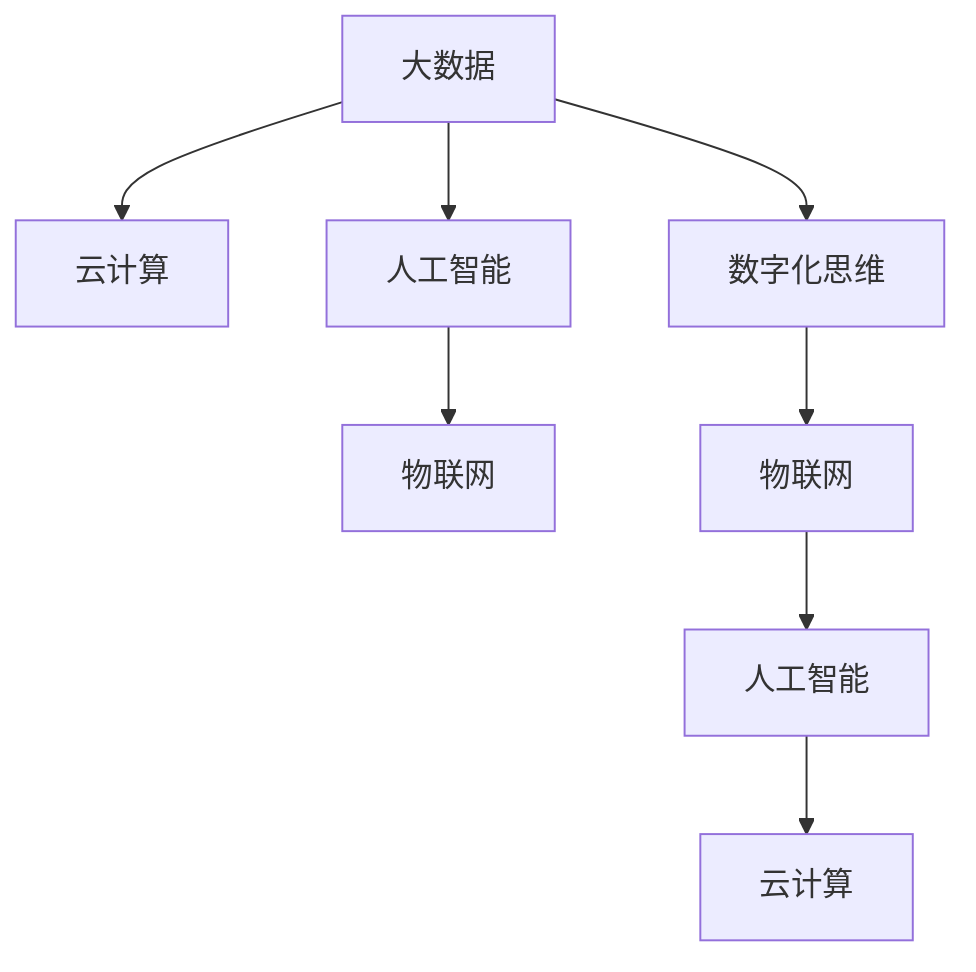

                 

# 数字化思维：全球脑时代的生存技能

## 1. 背景介绍

### 1.1 问题由来
当前，人类社会正处于一场前所未有的数字化转型浪潮之中。随着大数据、云计算、人工智能等技术的飞速发展，数字化正在深刻改变着人类的生产、生活、思维方式。世界正迎来一个“全球脑时代”，人类在数字化的加持下，大脑的能力得到了前所未有的拓展。

### 1.2 问题核心关键点
数字化思维是指运用数字技术和工具，以数据驱动的逻辑和方式进行思考、决策和创新的能力。随着数字化技术不断深入我们的生活和工作，掌握数字化思维变得尤为重要。数字化思维不仅帮助人们更好地理解和利用数据，提升工作效率，还能促进创新和创造，推动社会的进步。

### 1.3 问题研究意义
数字化思维的掌握，对于个人职业发展、企业竞争力和社会整体创新能力的提升，具有重要意义：

1. **提升个人竞争力**：数字化思维能够帮助个人更好地适应数字化环境，提高问题解决能力和创新能力。
2. **增强企业竞争力**：企业通过数字化思维，可以实现高效的数据分析、精准的市场定位和灵活的决策，保持竞争力。
3. **推动社会创新**：数字化思维在科研、教育、医疗等领域的应用，推动了技术创新和社会进步。

## 2. 核心概念与联系

### 2.1 核心概念概述

为更好地理解数字化思维，本节将介绍几个关键概念：

- **数字化思维**：指运用数字技术和工具，以数据驱动的逻辑和方式进行思考、决策和创新的能力。
- **大数据**：指通过各种数据采集技术获得的海量、高速度、多源异构的数据集。
- **云计算**：指通过互联网提供按需、可扩展的计算资源，支持数据存储、处理和分析。
- **人工智能**：指通过算法和模型，赋予计算机系统学习能力，实现自主决策和行动。
- **物联网**：指通过各种网络技术，将物体设备接入互联网，实现智能互联和自动化控制。

这些概念之间的逻辑关系可以通过以下Mermaid流程图来展示：



这个流程图展示了大数据、云计算、人工智能、物联网等技术之间的相互关系，以及它们与数字化思维的联系。

## 3. 核心算法原理 & 具体操作步骤
### 3.1 算法原理概述

数字化思维的实现基于一系列的算法和模型，通过数据驱动的方式进行思考和决策。核心算法包括数据预处理、特征工程、模型选择和评估、预测和决策等步骤。

### 3.2 算法步骤详解

#### 3.2.1 数据预处理
数据预处理是数字化思维的基础。主要包括数据清洗、数据归一化、特征选择等步骤。

- **数据清洗**：去除噪声、缺失值、异常值等不符合规范的数据。
- **数据归一化**：将数据转换为标准化的数值范围，便于算法处理。
- **特征选择**：选择对目标变量影响最大的特征，提升模型效率。

#### 3.2.2 特征工程
特征工程是构建高质量模型的关键。通过对原始数据进行转换和组合，生成新的特征，提升模型表现。

- **特征转换**：如对数值型数据进行对数转换、标准化处理等。
- **特征组合**：通过计算特征之间的组合关系，生成新的特征。
- **特征降维**：如PCA、LDA等算法，降低特征维度，提升计算效率。

#### 3.2.3 模型选择和评估
模型选择和评估是数字化思维的核心。选择合适的模型和评估指标，评估模型性能，指导后续优化。

- **模型选择**：如线性回归、决策树、随机森林、神经网络等。
- **模型评估**：如交叉验证、ROC曲线、AUC值等。
- **模型优化**：通过超参数调优、集成学习等方法，提升模型精度。

#### 3.2.4 预测和决策
预测和决策是数字化思维的最终目标。基于模型进行预测和决策，指导实际应用。

- **预测**：使用训练好的模型，对新的数据进行预测。
- **决策**：根据预测结果，做出合适的决策。

### 3.3 算法优缺点

数字化思维的算法具有以下优点：

- **数据驱动**：以数据为基础进行思考和决策，提高决策的科学性和准确性。
- **灵活多样**：算法多样，适用于不同类型的问题。
- **自动化**：模型训练和预测过程可以自动化，提升效率。

但同时也存在一些缺点：

- **数据依赖**：算法依赖高质量的数据，数据质量影响结果。
- **模型复杂**：复杂的模型需要较长的训练时间和计算资源。
- **结果解释**：模型预测结果缺乏可解释性，难以理解其内在逻辑。

### 3.4 算法应用领域

数字化思维在各个领域都有广泛的应用，包括：

- **金融领域**：通过大数据和人工智能技术，实现精准的风险评估和投资决策。
- **医疗领域**：利用大数据和人工智能，进行疾病预测、患者分类等。
- **零售领域**：通过数据分析，优化库存管理、客户分析等，提升销售业绩。
- **制造业**：实现设备监控、质量控制、供应链管理等，提升生产效率。
- **农业**：通过物联网和人工智能，进行作物监测、病虫害预测等，提升农业生产水平。

## 4. 数学模型和公式 & 详细讲解  
### 4.1 数学模型构建

数字化思维的数学模型构建，通常涉及线性回归、决策树、随机森林、神经网络等多种算法。以线性回归为例，其数学模型如下：

$$
y = \beta_0 + \beta_1 x_1 + \beta_2 x_2 + \cdots + \beta_p x_p + \epsilon
$$

其中，$y$ 为目标变量，$x_1, x_2, \cdots, x_p$ 为自变量，$\beta_0, \beta_1, \beta_2, \cdots, \beta_p$ 为模型参数，$\epsilon$ 为误差项。

### 4.2 公式推导过程

以线性回归为例，其损失函数为均方误差（Mean Squared Error, MSE）：

$$
\text{MSE} = \frac{1}{n} \sum_{i=1}^n (y_i - \hat{y}_i)^2
$$

其中，$y_i$ 为实际观测值，$\hat{y}_i$ 为模型预测值，$n$ 为样本数量。

使用梯度下降算法求解最优参数：

$$
\theta = \arg\min_\theta \text{MSE}(\theta)
$$

其中，$\theta$ 为模型参数。

### 4.3 案例分析与讲解

假设有一个房价预测问题，数据集包含房屋面积、卧室数量、卫生间数量、地理位置等多个特征，以及房价。通过线性回归模型，可以预测新房的房价。

使用Scikit-learn库，编写代码实现线性回归模型，并使用交叉验证进行模型评估：

```python
from sklearn.linear_model import LinearRegression
from sklearn.model_selection import train_test_split, cross_val_score
from sklearn.metrics import mean_squared_error

X = dataset.drop('price', axis=1)
y = dataset['price']

X_train, X_test, y_train, y_test = train_test_split(X, y, test_size=0.2, random_state=42)

model = LinearRegression()
model.fit(X_train, y_train)

y_pred = model.predict(X_test)

mse = mean_squared_error(y_test, y_pred)
print('Mean Squared Error:', mse)
```

通过交叉验证，评估模型的性能：

```python
cv_scores = cross_val_score(model, X_train, y_train, cv=5, scoring='neg_mean_squared_error')
print('Cross-Validation Scores:', cv_scores)
```

## 5. 项目实践：代码实例和详细解释说明
### 5.1 开发环境搭建

在进行数字化思维项目开发前，需要准备开发环境。以下是使用Python进行Scikit-learn开发的环境配置流程：

1. 安装Anaconda：从官网下载并安装Anaconda，用于创建独立的Python环境。

2. 创建并激活虚拟环境：
```bash
conda create -n sklearn-env python=3.8 
conda activate sklearn-env
```

3. 安装Scikit-learn：
```bash
conda install scikit-learn
```

4. 安装各类工具包：
```bash
pip install numpy pandas scikit-learn matplotlib tqdm jupyter notebook ipython
```

完成上述步骤后，即可在`sklearn-env`环境中开始项目开发。

### 5.2 源代码详细实现

以房价预测问题为例，编写完整的Scikit-learn代码实现：

```python
from sklearn.linear_model import LinearRegression
from sklearn.model_selection import train_test_split, cross_val_score
from sklearn.metrics import mean_squared_error

# 加载数据集
X = dataset.drop('price', axis=1)
y = dataset['price']

# 划分训练集和测试集
X_train, X_test, y_train, y_test = train_test_split(X, y, test_size=0.2, random_state=42)

# 训练模型
model = LinearRegression()
model.fit(X_train, y_train)

# 预测并评估
y_pred = model.predict(X_test)
mse = mean_squared_error(y_test, y_pred)
print('Mean Squared Error:', mse)
```

### 5.3 代码解读与分析

让我们再详细解读一下关键代码的实现细节：

**线性回归模型**：
- `LinearRegression`类：Scikit-learn提供的线性回归模型类。
- `fit`方法：训练模型。
- `predict`方法：预测新数据。

**模型评估**：
- `mean_squared_error`函数：计算均方误差。
- `cross_val_score`函数：进行交叉验证，评估模型性能。

**数据集划分**：
- `train_test_split`函数：将数据集划分为训练集和测试集。

通过以上代码，实现了完整的线性回归模型训练、预测和评估流程，展示了Scikit-learn库的强大功能和简洁性。

## 6. 实际应用场景
### 6.1 金融领域

数字化思维在金融领域有广泛的应用。通过大数据和人工智能技术，金融机构可以实现精准的风险评估和投资决策。例如，银行可以通过分析客户的交易记录、信用记录等信息，评估其信用风险，进行精准授信。

具体而言，可以使用决策树、随机森林等算法，构建信用评分模型，对客户的信用进行评估。模型输入包括客户的年龄、性别、职业、婚姻状况、收入、住房情况等，输出为信用评分。通过信用评分，银行可以确定客户的信用等级，决定是否发放贷款、贷款额度和利率。

### 6.2 医疗领域

数字化思维在医疗领域的应用，可以实现疾病预测、患者分类等。医疗机构可以利用大数据和人工智能技术，分析病人的病历、体检数据等，预测疾病风险，提升诊断准确性。

例如，医院可以通过分析病人的病历和体检数据，构建疾病预测模型。模型输入包括病人的年龄、性别、病史、检查结果等，输出为患病概率。通过疾病预测模型，医院可以提前采取预防措施，提升病人的健康水平。

### 6.3 零售领域

零售行业通过数字化思维，可以优化库存管理、客户分析等，提升销售业绩。零售商可以通过分析销售数据、客户反馈等，预测市场需求，优化库存配置。

例如，零售商可以使用时间序列预测模型，预测未来一定时期内的商品需求量。模型输入包括历史销售数据、节假日、促销活动等信息，输出为预测需求量。通过预测结果，零售商可以及时调整库存，避免商品积压或短缺，提升客户满意度。

### 6.4 制造业

制造业通过数字化思维，可以实现设备监控、质量控制、供应链管理等，提升生产效率。制造业企业可以利用物联网技术，实时监控设备的运行状态，预测设备故障。

例如，制造企业可以使用随机森林模型，预测设备的故障概率。模型输入包括设备的运行时间、振动数据、温度数据等，输出为设备故障概率。通过故障预测，制造企业可以提前进行设备维护，避免生产线停机，提升生产效率。

### 6.5 农业

农业通过物联网和人工智能技术，可以实现作物监测、病虫害预测等，提升农业生产水平。农业企业可以利用传感器技术，实时监测作物的生长环境，预测病虫害风险。

例如，农业企业可以使用支持向量机（Support Vector Machine, SVM）模型，预测作物的病虫害风险。模型输入包括土壤湿度、气温、降雨、病虫害发生历史等，输出为病虫害风险等级。通过病虫害预测，农业企业可以及时采取防治措施，保护作物生长，提升农业生产效益。

## 7. 工具和资源推荐
### 7.1 学习资源推荐

为了帮助开发者系统掌握数字化思维的理论基础和实践技巧，这里推荐一些优质的学习资源：

1. **《Python数据科学手册》**：深入浅出地介绍了Python在数据科学中的应用，涵盖数据分析、机器学习、可视化等多个方面。
2. **《机器学习实战》**：详细介绍了机器学习的基本概念、算法和实现，适合初学者入门。
3. **Coursera的机器学习课程**：由斯坦福大学教授Andrew Ng开设的机器学习课程，覆盖了机器学习的基本理论和实践。
4. **Kaggle竞赛平台**：通过参加Kaggle数据科学竞赛，实战练习，提升数据分析和机器学习能力。
5. **PyCon和Scikit-learn社区**：参加PyCon会议和Scikit-learn社区活动，学习最新技术进展，交流经验。

通过对这些资源的学习实践，相信你一定能够快速掌握数字化思维的精髓，并用于解决实际的数据问题。

### 7.2 开发工具推荐

高效的开发离不开优秀的工具支持。以下是几款用于数字化思维开发的常用工具：

1. **Jupyter Notebook**：支持Python、R等多种语言，易于共享和协作。
2. **PyCharm**：强大的IDE，支持Python、R等语言，提供自动补全、调试等功能。
3. **Scikit-learn**：强大的机器学习库，提供多种算法和模型，易于使用。
4. **TensorFlow**：谷歌开源的机器学习框架，支持深度学习模型，性能优异。
5. **Pandas**：强大的数据处理库，支持数据清洗、转换、分析等。

合理利用这些工具，可以显著提升数字化思维任务的开发效率，加快创新迭代的步伐。

### 7.3 相关论文推荐

数字化思维的研究源于学界的持续研究。以下是几篇奠基性的相关论文，推荐阅读：

1. **《深度学习》**：深度学习领域的经典教材，由Yoshua Bengio、Ian Goodfellow和Aaron Courville合著，深入浅出地介绍了深度学习的基本概念和实现。
2. **《大规模在线学习系统》**：由Andrew Ng教授主讲，介绍大规模在线学习系统的设计和实现。
3. **《Data Science and Statistical Learning》**：由Daphne Koller教授主讲，介绍数据科学和统计学习的基本概念和实现。
4. **《机器学习与统计学习》**：由Thomas Mitchell教授主讲，介绍机器学习的基本概念和实现。
5. **《机器学习：模型、算法与应用》**：由周志华教授主讲，介绍机器学习的基本概念和实现，适合初学者入门。

这些论文代表了大规模学习和大数据挖掘的研究方向，通过学习这些前沿成果，可以帮助研究者把握学科前进方向，激发更多的创新灵感。

## 8. 总结：未来发展趋势与挑战

### 8.1 总结

本文对数字化思维进行了全面系统的介绍。首先阐述了数字化思维的背景和意义，明确了数字化思维在各个领域的广泛应用。其次，从原理到实践，详细讲解了数字化思维的核心算法和操作步骤，给出了完整的代码实例。最后，探讨了数字化思维的未来发展趋势和面临的挑战，提供了深入的见解和实用的建议。

通过本文的系统梳理，可以看到，数字化思维已经成为数字化时代的关键能力，深刻影响着人类的生产、生活和学习方式。数字化思维不仅帮助人们更好地理解和利用数据，提升工作效率，还能促进创新和创造，推动社会的进步。

### 8.2 未来发展趋势

展望未来，数字化思维将呈现以下几个发展趋势：

1. **数据驱动决策**：数字化思维将更加普及和深入，各行各业都将实现数据驱动的决策，提升效率和效果。
2. **智能自动化**：基于AI的自动化决策将更加普及，减少人为干预，提高决策效率和精度。
3. **实时化**：数字化思维将实现实时化，实时分析和预测，快速响应变化。
4. **跨领域融合**：数字化思维将与物联网、区块链、区块链等技术融合，实现更广泛的智能应用。
5. **人机协同**：数字化思维将实现人机协同，提升决策的科学性和合理性。

以上趋势凸显了数字化思维的广阔前景。这些方向的探索发展，必将进一步推动数字化技术的应用，提升各行业的竞争力。

### 8.3 面临的挑战

尽管数字化思维在各个领域都有广泛应用，但在迈向更加智能化、普适化应用的过程中，仍然面临诸多挑战：

1. **数据质量问题**：数据质量不高，数据噪音、缺失值、异常值等问题，影响模型效果。
2. **模型复杂性**：数字化思维涉及复杂的算法和模型，模型训练和调试难度大。
3. **结果解释性**：数字化思维的算法和模型缺乏可解释性，难以理解其内部逻辑。
4. **隐私和安全问题**：数字化思维涉及大量数据，数据隐私和安全问题需要引起重视。
5. **跨领域应用难度**：数字化思维在不同领域的应用，需要结合领域知识，解决跨领域应用难度。

这些挑战需要研究者从技术、伦理、法律等多个方面共同努力，才能克服，推动数字化思维的发展。

### 8.4 研究展望

面向未来，数字化思维的研究方向将在以下几个方面展开：

1. **大数据处理技术**：提升大数据处理效率，降低数据质量问题，提升数据驱动决策的准确性。
2. **AI算法优化**：优化AI算法，提高模型性能和可解释性，解决模型复杂性问题。
3. **跨领域应用研究**：结合领域知识，研究数字化思维在不同领域的应用，解决跨领域应用难度。
4. **隐私和安全保护**：研究数据隐私和安全保护技术，解决隐私和安全问题。
5. **人机协同研究**：研究人机协同技术，提升决策的科学性和合理性。

这些研究方向的探索，必将引领数字化思维技术迈向更高的台阶，为构建安全、可靠、高效、智能的决策系统提供技术支撑。

## 9. 附录：常见问题与解答

**Q1：数字化思维和数据驱动决策有什么区别？**

A: 数字化思维是一种思维方式，以数据为基础进行思考和决策。数据驱动决策是一种应用方法，基于数字化思维，通过数据驱动的逻辑和方式进行决策。数字化思维注重方法和过程，数据驱动决策注重结果和应用。

**Q2：如何提升数据质量？**

A: 提升数据质量，可以通过以下方法：
1. 数据清洗：去除噪声、缺失值、异常值等不符合规范的数据。
2. 数据预处理：对数据进行归一化、标准化等处理，提升数据质量。
3. 数据增强：通过数据增强技术，生成更多的数据，提升数据丰富度。
4. 数据标注：对数据进行标注，提升数据准确性。

**Q3：如何选择适合的算法和模型？**

A: 选择适合的算法和模型，可以从以下几个方面考虑：
1. 数据类型：选择适合的算法和模型，处理不同类型的数据。
2. 数据量：根据数据量选择适合的算法和模型，处理大规模数据时可以选择分布式算法。
3. 问题类型：根据问题类型选择适合的算法和模型，处理分类问题可以选择决策树、随机森林等算法。
4. 模型性能：根据模型性能选择适合的算法和模型，处理复杂问题可以选择深度学习等算法。

**Q4：如何提升模型性能？**

A: 提升模型性能，可以通过以下方法：
1. 数据增强：通过数据增强技术，生成更多的数据，提升数据丰富度。
2. 超参数调优：通过超参数调优，找到最优的模型参数。
3. 集成学习：通过集成学习，提升模型的鲁棒性和泛化能力。
4. 迁移学习：通过迁移学习，将已有模型的知识迁移到新问题中，提升模型性能。

这些方法需要根据具体情况灵活选择，才能提升模型性能。

**Q5：如何处理跨领域应用难度？**

A: 处理跨领域应用难度，可以从以下几个方面考虑：
1. 领域知识：结合领域知识，理解问题本质，选择合适的算法和模型。
2. 数据融合：将不同领域的数据融合，提升数据的丰富度。
3. 模型融合：将不同领域的模型融合，提升模型的泛化能力。
4. 交叉验证：通过交叉验证，评估模型在不同领域的表现，进行优化。

这些方法需要根据具体情况灵活选择，才能解决跨领域应用难度。

---

作者：禅与计算机程序设计艺术 / Zen and the Art of Computer Programming

