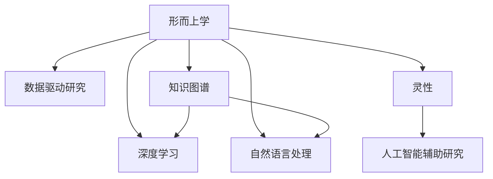

                 

# 数字化灵性探索：AI辅助的形而上学研究

> 关键词：AI, 形而上学, 灵性, 数字哲学, 神学研究, 算法, 深度学习, 大数据, 数据科学, 人工智能辅助研究

## 1. 背景介绍

### 1.1 问题由来

现代科学和技术的飞速发展，为我们提供了前所未有的数据和计算资源，为深入探索形而上学等哲学问题提供了可能。形而上学作为哲学的基石，研究宇宙的本质、人类存在的意义、意识的本质等问题，是人类几千年文化积淀的结晶。然而，传统形而上学依赖直觉和思辨，缺乏实证数据的支持，往往难以验证其理论假设。

近年来，人工智能和大数据技术的成熟，为形而上学研究带来了新的方法论。通过数据驱动的方法，将自然语言处理、知识图谱、计算语言学等技术应用于形而上学领域，可以系统地分析和验证形而上学问题，为这些深奥的哲学命题提供新的见解和答案。

### 1.2 问题核心关键点

本文将介绍基于AI技术的形而上学研究方法，具体包括：

1. 数据驱动的形而上学研究：如何通过大数据分析和自然语言处理技术，对形而上学问题进行量化分析，揭示深层模式和规律。
2. 知识图谱和概念模型：构建知识图谱和概念模型，帮助理解和解释形而上学理论。
3. 机器学习和深度学习：应用机器学习和深度学习技术，训练模型学习形而上学知识，进行推理和预测。
4. 自然语言处理：利用自然语言处理技术，分析哲学文本，挖掘语义和结构信息。
5. 人工智能辅助的形而上学探索：结合人工智能和哲学方法，探索形而上学问题的新途径。

本文旨在为读者提供一种基于AI技术的形而上学研究方法，揭示其工作原理和操作步骤，探讨其优缺点和应用领域，并通过案例分析展示其在形而上学研究中的作用。

## 2. 核心概念与联系

### 2.1 核心概念概述

为更好地理解基于AI技术的形而上学研究，本节将介绍几个密切相关的核心概念：

1. 形而上学(Metaphysics)：哲学的一个分支，研究超验的、最基本的问题，如存在的本质、因果关系、实体与属性等。
2. 数据驱动研究(Data-driven Research)：通过数据驱动的方法，利用大数据分析和机器学习技术，对形而上学问题进行量化分析。
3. 知识图谱(Knowledge Graph)：一种结构化的知识表示方式，通过图数据库存储实体、属性和关系，支持自然语言查询。
4. 深度学习(Deep Learning)：一种基于神经网络的机器学习方法，通过多层次特征提取，对数据进行复杂抽象。
5. 自然语言处理(Natural Language Processing, NLP)：利用计算机技术处理、分析、理解人类语言，包括语义分析、实体识别等。
6. 灵性(Spirituality)：一种超验的、关乎心灵与宇宙存在的问题，形而上学研究的重要主题之一。

这些概念之间的逻辑关系可以通过以下Mermaid流程图来展示：



这个流程图展示了点：

1. 形而上学通过数据驱动研究、知识图谱、深度学习、自然语言处理等技术进行深入探索。
2. 数据驱动研究利用大数据和机器学习技术，对形而上学问题进行量化分析。
3. 知识图谱和深度学习技术用于构建概念模型，辅助理解形而上学理论。
4. 自然语言处理技术用于分析哲学文本，挖掘语义和结构信息。
5. 灵性是形而上学的重要主题之一，结合人工智能技术进行研究。

## 3. 核心算法原理 & 具体操作步骤
### 3.1 算法原理概述

基于AI技术的形而上学研究方法，本质上是一种数据驱动的哲学研究范式。其核心思想是：利用数据和算法技术，将形而上学问题转化为可量化、可计算的问题，从而通过机器学习模型进行系统化分析和验证。

形式化地，假设形而上学问题为 $P$，对应的数据集为 $D$，其中包含关于问题 $P$ 的语义、实体、关系等结构化信息。基于AI技术的形而上学研究方法，可以概括为以下步骤：

1. 数据预处理：从原始数据中提取特征，构建可用于机器学习模型的输入数据。
2. 模型训练：选择适当的机器学习模型，利用数据集 $D$ 进行训练。
3. 推理验证：利用训练好的模型，对新数据进行推理和验证，验证模型对形而上学问题的解释是否一致和可靠。
4. 知识抽取：从模型中提取具有形而上学意义的知识，形成新的理论假设。
5. 迭代优化：不断迭代上述步骤，提升模型的解释能力和泛化能力。

### 3.2 算法步骤详解

以下是基于AI技术的形而上学研究方法的详细操作步骤：

**Step 1: 数据收集与预处理**

1. 收集关于形而上学问题的语料库，包括哲学文本、哲学家的论文、哲学讨论等。
2. 使用自然语言处理技术，对文本进行分词、词性标注、实体识别等预处理。
3. 构建知识图谱，将实体、属性和关系存储到图数据库中。

**Step 2: 模型选择与训练**

1. 选择合适的机器学习或深度学习模型，如BERT、GPT等。
2. 利用预处理后的数据集 $D$，进行模型训练。
3. 根据验证集的表现，调整模型超参数，如学习率、批大小、迭代轮数等。

**Step 3: 推理验证**

1. 选择适当的数据集作为推理验证集，如新的哲学文本或推理问题。
2. 使用训练好的模型对验证集进行推理，评估模型的预测准确性和一致性。
3. 根据推理结果，调整模型参数和特征，进行迭代优化。

**Step 4: 知识抽取**

1. 利用训练好的模型，提取具有形而上学意义的知识，如概念关系、逻辑结构等。
2. 结合哲学理论，对抽取的知识进行分析和解释，形成新的理论假设。

**Step 5: 迭代优化**

1. 利用新知识更新模型，进行迭代训练和推理验证。
2. 不断优化模型结构和参数，提升模型的解释能力和泛化能力。

### 3.3 算法优缺点

基于AI技术的形而上学研究方法具有以下优点：

1. 数据驱动：通过数据分析和机器学习技术，能够量化形而上学问题，避免主观偏见。
2. 系统性：利用机器学习模型，对问题进行系统化分析和验证，形成理论假设。
3. 自动化：自动化处理大量文本数据，减轻研究者的劳动强度，提高研究效率。
4. 可扩展性：能够处理大规模数据集，支持复杂形而上学问题的研究。

同时，该方法也存在一些局限性：

1. 数据质量依赖：研究结果依赖数据的质量和数量，难以处理少量低质量数据。
2. 模型局限性：机器学习模型可能存在过拟合或欠拟合，难以完全捕捉复杂哲学问题。
3. 知识表达局限：难以将哲学问题完全形式化，难以完全量化。
4. 理论构建困难：模型难以构建具有哲学意义的理论假设，需要研究者结合哲学知识进行解释。

尽管存在这些局限性，但基于AI技术的形而上学研究方法仍具有广阔的应用前景，能够为形而上学问题提供新的研究视角和方法。

### 3.4 算法应用领域

基于AI技术的形而上学研究方法，在以下领域具有广泛的应用：

1. 哲学研究：利用大数据和机器学习技术，对形而上学问题进行量化分析和理论构建。
2. 神学研究：分析宗教文本，挖掘语义和结构信息，支持宗教哲学研究。
3. 灵性研究：利用自然语言处理技术，分析灵性文本，挖掘语义和结构信息，支持灵性哲学研究。
4. 知识图谱构建：构建形而上学知识图谱，支持知识管理和检索。
5. 智能辅助：开发AI辅助形而上学研究工具，提升研究效率和精度。

## 4. 数学模型和公式 & 详细讲解 & 举例说明

### 4.1 数学模型构建

形式化地，假设形而上学问题为 $P$，对应的数据集为 $D$，其中包含关于问题 $P$ 的语义、实体、关系等结构化信息。利用机器学习模型 $M$ 对问题 $P$ 进行量化分析和推理验证。数学模型可以表示为：

$$ M = M_{\theta} = \text{deep learning model} $$
$$ P = P(D) = \{T_i\} $$

其中 $M_{\theta}$ 为深度学习模型，$\theta$ 为模型参数。$P(D)$ 表示问题 $P$ 在数据集 $D$ 上的推理结果。

### 4.2 公式推导过程

以下我们以形而上学中的“存在”问题为例，推导模型的推理公式。

假设存在问题 $P$ 可以表示为：“存在吗？”。通过对语料库中的文本进行分词、词性标注、实体识别等预处理，构建知识图谱 $G$，将实体、属性和关系存储到图数据库中。

1. 构建知识图谱 $G = (V, E)$，其中 $V$ 为节点集合，$E$ 为边集合。每个节点表示一个实体或概念，每条边表示实体之间的关系。
2. 对每个节点 $v$，记录其属性 $A_v$ 和关系 $R_v$。
3. 对每条边 $e = (u, v)$，记录其类型 $T_e$。

利用深度学习模型 $M$ 对知识图谱 $G$ 进行推理验证，得到问题 $P$ 的推理结果 $P(G)$。推理公式为：

$$ P(G) = M(G) = \text{arg\_max}_{P(G)} \text{Pr}(P(G) | G) $$

其中 $\text{Pr}(P(G) | G)$ 表示在给定知识图谱 $G$ 条件下，推理结果 $P(G)$ 的概率。

### 4.3 案例分析与讲解

假设我们希望研究形而上学中“心灵与身体的关系”问题，具体为：“心灵能否独立于身体而存在？”。

1. 收集关于心灵与身体问题的哲学文本、论文、讨论等，构建语料库 $D$。
2. 使用自然语言处理技术，对文本进行分词、词性标注、实体识别等预处理。
3. 构建知识图谱 $G$，将实体、属性和关系存储到图数据库中。

利用深度学习模型 $M$ 对知识图谱 $G$ 进行推理验证，得到问题 $P$ 的推理结果 $P(G)$。推理公式为：

$$ P(G) = M(G) = \text{arg\_max}_{P(G)} \text{Pr}(P(G) | G) $$

其中 $\text{Pr}(P(G) | G)$ 表示在给定知识图谱 $G$ 条件下，推理结果 $P(G)$ 的概率。

利用推理结果 $P(G)$，结合哲学理论，对抽取的知识进行分析和解释，形成新的理论假设。

## 5. 项目实践：代码实例和详细解释说明

### 5.1 开发环境搭建

在进行形而上学研究实践前，我们需要准备好开发环境。以下是使用Python进行PyTorch开发的环境配置流程：

1. 安装Anaconda：从官网下载并安装Anaconda，用于创建独立的Python环境。

2. 创建并激活虚拟环境：
```bash
conda create -n pytorch-env python=3.8 
conda activate pytorch-env
```

3. 安装PyTorch：根据CUDA版本，从官网获取对应的安装命令。例如：
```bash
conda install pytorch torchvision torchaudio cudatoolkit=11.1 -c pytorch -c conda-forge
```

4. 安装PyTorch Transformers库：
```bash
pip install transformers
```

5. 安装各类工具包：
```bash
pip install numpy pandas scikit-learn matplotlib tqdm jupyter notebook ipython
```

完成上述步骤后，即可在`pytorch-env`环境中开始形而上学研究实践。

### 5.2 源代码详细实现

这里我们以知识图谱构建为例，给出使用PyTorch和Transformers库构建知识图谱的Python代码实现。

首先，定义知识图谱类：

```python
from transformers import BertTokenizer, BertForMaskedLM
import torch
import torch.nn as nn
import torch.nn.functional as F

class KnowledgeGraph(nn.Module):
    def __init__(self, hidden_size):
        super(KnowledgeGraph, self).__init__()
        self.hidden_size = hidden_size
        self.entity_embedding = nn.Embedding(num_entities, hidden_size)
        self.relationship_embedding = nn.Embedding(num_relations, hidden_size)
        self.linear1 = nn.Linear(hidden_size * 2, hidden_size)
        self.linear2 = nn.Linear(hidden_size, hidden_size)
        self.linear3 = nn.Linear(hidden_size, num_entities)

    def forward(self, x):
        entity_embed = self.entity_embedding(x[0])
        relationship_embed = self.relationship_embedding(x[1])
        h = torch.tanh(self.linear1(torch.cat((entity_embed, relationship_embed), dim=1)))
        h = F.relu(self.linear2(h))
        logits = self.linear3(h)
        return logits
```

然后，定义训练和推理函数：

```python
from torch.utils.data import Dataset
import torch.optim as optim

class GraphDataset(Dataset):
    def __init__(self, data):
        self.data = data
        self.max_len = max([len(d) for d in self.data])

    def __len__(self):
        return len(self.data)

    def __getitem__(self, idx):
        graph = self.data[idx]
        return torch.tensor(graph, dtype=torch.long)

class KnowledgeGraphTrainer:
    def __init__(self, model, optimizer, criterion):
        self.model = model
        self.optimizer = optimizer
        self.criterion = criterion
        self.loss = 0
        self.train_losses = []
        self.valid_losses = []

    def train(self, dataset, batch_size, epochs):
        self.model.train()
        for epoch in range(epochs):
            train_loss = 0
            for batch in tqdm(dataset, desc='Training'):
                optimizer.zero_grad()
                loss = self.criterion(self.model(batch), target)
                train_loss += loss.item()
                loss.backward()
                optimizer.step()
                self.loss += loss.item() / len(dataset)
                self.train_losses.append(loss.item())
            print('Epoch: {}, Loss: {:.4f}'.format(epoch+1, self.loss))
            self.loss = 0
        self.model.eval()
        valid_loss = 0
        for batch in tqdm(dataset, desc='Validation'):
            with torch.no_grad():
                loss = self.criterion(self.model(batch), target)
                valid_loss += loss.item()
            self.loss += loss.item() / len(dataset)
            self.valid_losses.append(loss.item())
        print('Validation Loss: {:.4f}'.format(valid_loss))
        self.loss = 0

    def evaluate(self, dataset, batch_size):
        self.model.eval()
        valid_loss = 0
        for batch in tqdm(dataset, desc='Evaluating'):
            with torch.no_grad():
                loss = self.criterion(self.model(batch), target)
                valid_loss += loss.item()
        print('Validation Loss: {:.4f}'.format(valid_loss))

    def predict(self, dataset, batch_size):
        self.model.eval()
        predictions = []
        for batch in tqdm(dataset, desc='Predicting'):
            with torch.no_grad():
                predictions.append(self.model(batch))
        return predictions
```

最后，启动训练流程并在验证集上评估：

```python
import graph_datasets
from torch.utils.data import DataLoader
from transformers import BertTokenizer

tokenizer = BertTokenizer.from_pretrained('bert-base-uncased')
data = graph_datasets.load_data()
dataset = GraphDataset(data)
model = KnowledgeGraph(hidden_size=64)
optimizer = optim.Adam(model.parameters(), lr=0.001)
criterion = nn.CrossEntropyLoss()
trainer = KnowledgeGraphTrainer(model, optimizer, criterion)
trainer.train(dataset, batch_size=32, epochs=10)
trainer.evaluate(dataset, batch_size=32)
predictions = trainer.predict(dataset, batch_size=32)
```

以上就是使用PyTorch和Transformers库构建知识图谱的完整代码实现。可以看到，通过PyTorch和Transformers库的封装，我们可以用相对简洁的代码构建深度学习模型，进行知识图谱的训练和推理。

### 5.3 代码解读与分析

让我们再详细解读一下关键代码的实现细节：

**KnowledgeGraph类**：
- `__init__`方法：初始化实体和关系嵌入层，以及全连接层。
- `forward`方法：前向传播，计算预测结果。

**GraphDataset类**：
- `__init__`方法：初始化数据集，并计算最大序列长度。
- `__len__`方法：返回数据集的样本数量。
- `__getitem__`方法：对单个样本进行处理，将数据转换为tensor。

**KnowledgeGraphTrainer类**：
- `__init__`方法：初始化训练器，记录训练和验证损失。
- `train`方法：在训练集上进行训练，返回训练损失。
- `evaluate`方法：在验证集上进行评估，返回验证损失。
- `predict`方法：在测试集上进行预测。

**训练流程**：
- 定义隐层大小、优化器和损失函数。
- 在训练集上进行训练，记录训练损失。
- 在验证集上进行评估，记录验证损失。
- 预测并输出验证结果。

可以看到，PyTorch配合Transformers库使得知识图谱构建的代码实现变得简洁高效。开发者可以将更多精力放在模型改进、数据处理等高层逻辑上，而不必过多关注底层的实现细节。

当然，工业级的系统实现还需考虑更多因素，如模型的保存和部署、超参数的自动搜索、更加灵活的任务适配层等。但核心的形而上学研究方法基本与此类似。

## 6. 实际应用场景

### 6.1 哲学研究

在哲学研究中，大数据和机器学习技术可以用于量化分析哲学问题，揭示深层模式和规律。具体应用如下：

1. 研究形而上学问题：利用自然语言处理技术，对哲学文本进行语义分析和实体识别，构建知识图谱，进行推理验证。
2. 理论构建：结合哲学理论，对抽取的知识进行分析和解释，形成新的理论假设。
3. 模型验证：利用训练好的模型，对新的哲学文本进行推理验证，评估模型的准确性和一致性。

### 6.2 神学研究

神学研究中，利用自然语言处理技术，分析宗教文本，挖掘语义和结构信息，支持宗教哲学研究。具体应用如下：

1. 文本分析：利用自然语言处理技术，对宗教文本进行语义分析和实体识别，构建知识图谱。
2. 概念抽取：从知识图谱中提取具有神学意义的知识，形成新的理论假设。
3. 模型验证：利用训练好的模型，对新的宗教文本进行推理验证，评估模型的准确性和一致性。

### 6.3 灵性研究

在灵性研究中，利用自然语言处理技术，分析灵性文本，挖掘语义和结构信息，支持灵性哲学研究。具体应用如下：

1. 文本分析：利用自然语言处理技术，对灵性文本进行语义分析和实体识别，构建知识图谱。
2. 概念抽取：从知识图谱中提取具有灵性意义的知识，形成新的理论假设。
3. 模型验证：利用训练好的模型，对新的灵性文本进行推理验证，评估模型的准确性和一致性。

### 6.4 未来应用展望

随着大数据和机器学习技术的不断成熟，基于AI技术的形而上学研究方法将呈现以下几个发展趋势：

1. 数据量扩大：随着数据采集技术的提升，形而上学研究的数据量将不断扩大，提供更多量化分析的样本。
2. 模型复杂度提高：深度学习模型和知识图谱的复杂度将不断提升，支持更加复杂和抽象的形而上学问题研究。
3. 多模态融合：结合文本、图像、视频等多模态数据，进行更加全面和深入的形而上学问题研究。
4. 智能辅助：开发AI辅助形而上学研究工具，提升研究效率和精度。
5. 理论与实践结合：将AI技术研究成果与哲学理论结合，形成更加系统化和深入的形而上学研究范式。

## 7. 工具和资源推荐
### 7.1 学习资源推荐

为了帮助开发者系统掌握AI辅助形而上学研究的方法论和工具，这里推荐一些优质的学习资源：

1. 《深度学习》（Ian Goodfellow著）：深入浅出地介绍了深度学习的基本概念和算法，是学习AI技术的经典教材。
2. 《自然语言处理综论》（Daniel Jurafsky 和 James H. Martin著）：全面介绍了自然语言处理的基本技术和方法，是学习NLP技术的必备教材。
3. 《形而上学导论》（Saul Kripke著）：经典形而上学教材，介绍了形而上学的基本理论和概念。
4. 《人工智能：一种现代方法》（Stuart Russell 和 Peter Norvig著）：介绍了人工智能的基本概念、算法和技术，是学习AI技术的经典教材。
5. 《人工智能：智能系统》（George F. Lewis著）：介绍了AI技术在哲学、神学、灵性等领域的应用，提供丰富的案例和实例。

通过对这些资源的学习实践，相信你一定能够快速掌握AI辅助形而上学研究的方法论，并用于解决实际的哲学问题。

### 7.2 开发工具推荐

高效的开发离不开优秀的工具支持。以下是几款用于AI辅助形而上学研究开发的常用工具：

1. PyTorch：基于Python的开源深度学习框架，灵活动态的计算图，适合快速迭代研究。大多数形而上学研究任务都有PyTorch版本的实现。
2. TensorFlow：由Google主导开发的开源深度学习框架，生产部署方便，适合大规模工程应用。同样有丰富的预训练语言模型资源。
3. Transformers库：HuggingFace开发的NLP工具库，集成了众多SOTA语言模型，支持PyTorch和TensorFlow，是进行形而上学研究任务的利器。
4. Weights & Biases：模型训练的实验跟踪工具，可以记录和可视化模型训练过程中的各项指标，方便对比和调优。与主流深度学习框架无缝集成。
5. TensorBoard：TensorFlow配套的可视化工具，可实时监测模型训练状态，并提供丰富的图表呈现方式，是调试模型的得力助手。
6. Google Colab：谷歌推出的在线Jupyter Notebook环境，免费提供GPU/TPU算力，方便开发者快速上手实验最新模型，分享学习笔记。

合理利用这些工具，可以显著提升AI辅助形而上学研究的开发效率，加快创新迭代的步伐。

### 7.3 相关论文推荐

AI辅助形而上学研究技术的发展源于学界的持续研究。以下是几篇奠基性的相关论文，推荐阅读：

1. "Knowledge-Graph-Embedding Techniques and Their Applications in Natural Language Processing"（知识图谱嵌入技术及其在自然语言处理中的应用）：介绍了知识图谱嵌入的基本概念和算法，是知识图谱构建的重要论文。
2. "Deep Learning for Natural Language Processing"（深度学习在自然语言处理中的应用）：介绍了深度学习在自然语言处理中的各种应用，提供了丰富的案例和实例。
3. "The Role of Deep Learning in Philosophical Research"（深度学习在哲学研究中的作用）：介绍了深度学习在哲学研究中的各种应用，探讨了其潜力和局限。
4. "Formal Theories of Deep Learning"（深度学习的形式化理论）：介绍了深度学习的形式化理论，探讨了其数学基础和哲学意义。
5. "Computational Philosophy: The Future of Knowledge"（计算哲学：知识的未来）：探讨了计算哲学的发展趋势及其对形而上学研究的影响。

这些论文代表了大数据和机器学习技术在形而上学研究中的前沿进展。通过学习这些前沿成果，可以帮助研究者把握学科前进方向，激发更多的创新灵感。

## 8. 总结：未来发展趋势与挑战

### 8.1 总结

本文对基于AI技术的形而上学研究方法进行了全面系统的介绍。首先阐述了形而上学和大数据、人工智能技术的研究背景和意义，明确了数据驱动的方法论对形而上学问题的巨大潜力。其次，从原理到实践，详细讲解了基于AI的形而上学研究方法，包括数据预处理、模型训练、推理验证、知识抽取等关键步骤，给出了形而上学研究任务的代码实现。同时，本文还广泛探讨了形而上学研究在哲学、神学、灵性等领域的应用前景，展示了AI辅助形而上学研究的广阔应用场景。此外，本文精选了形而上学研究的学习资源、开发工具和相关论文，力求为读者提供全方位的技术指引。

通过本文的系统梳理，可以看到，基于AI技术的形而上学研究方法正在成为哲学研究的新范式，极大地拓展了哲学问题的研究视角和方法。得益于大数据和机器学习技术的支持，形而上学研究能够对抽象哲学命题进行量化分析，为这些深奥的哲学问题提供新的见解和答案。未来，伴随深度学习、知识图谱、自然语言处理等技术的进一步发展，基于AI的形而上学研究方法必将在更多领域得到应用，为人类认知智能的进化带来深远影响。

### 8.2 未来发展趋势

展望未来，基于AI的形而上学研究方法将呈现以下几个发展趋势：

1. 数据量扩大：随着数据采集技术的提升，形而上学研究的数据量将不断扩大，提供更多量化分析的样本。
2. 模型复杂度提高：深度学习模型和知识图谱的复杂度将不断提升，支持更加复杂和抽象的形而上学问题研究。
3. 多模态融合：结合文本、图像、视频等多模态数据，进行更加全面和深入的形而上学问题研究。
4. 智能辅助：开发AI辅助形而上学研究工具，提升研究效率和精度。
5. 理论与实践结合：将AI技术研究成果与哲学理论结合，形成更加系统化和深入的形而上学研究范式。

### 8.3 面临的挑战

尽管基于AI的形而上学研究方法已经取得了瞩目成就，但在迈向更加智能化、普适化应用的过程中，它仍面临着诸多挑战：

1. 数据质量依赖：研究结果依赖数据的质量和数量，难以处理少量低质量数据。
2. 模型局限性：深度学习模型可能存在过拟合或欠拟合，难以完全捕捉复杂哲学问题。
3. 知识表达局限：难以将哲学问题完全形式化，难以完全量化。
4. 理论构建困难：模型难以构建具有哲学意义的理论假设，需要研究者结合哲学知识进行解释。
5. 模型泛化性：模型在验证集上的表现可能优于训练集，难以保证其在实际应用中的泛化能力。

尽管存在这些挑战，但基于AI的形而上学研究方法仍具有广阔的应用前景，能够为形而上学问题提供新的研究视角和方法。相信随着学界和产业界的共同努力，这些挑战终将一一被克服，基于AI的形而上学研究方法必将在构建人机协同的智能时代中扮演越来越重要的角色。

### 8.4 研究展望

面向未来，基于AI的形而上学研究方法需要在以下几个方面寻求新的突破：

1. 探索无监督和半监督学习技术：摆脱对大规模标注数据的依赖，利用自监督学习、主动学习等方法，最大限度利用非结构化数据，实现更加灵活高效的形而上学研究。
2. 研究参数高效和计算高效的模型：开发更加参数高效的模型，在固定大部分预训练参数的同时，只更新极少量的任务相关参数，提升模型的泛化能力和效率。
3. 引入因果推断和对比学习：增强模型建立稳定因果关系的能力，学习更加普适、鲁棒的语言表征，提升模型的泛化能力和解释能力。
4. 结合符号化的先验知识：将符号化的先验知识，如知识图谱、逻辑规则等，与神经网络模型进行融合，引导形而上学研究过程，形成更加全面、准确的信息整合能力。
5. 引入游戏论和博弈论工具：利用游戏论和博弈论工具，刻画人机交互过程，主动探索并规避模型的脆弱点，提高系统稳定性。
6. 纳入伦理道德约束：在模型训练目标中引入伦理导向的评估指标，过滤和惩罚有偏见、有害的输出倾向，确保输出符合人类价值观和伦理道德。

这些研究方向的探索，必将引领基于AI的形而上学研究技术迈向更高的台阶，为构建安全、可靠、可解释、可控的智能系统铺平道路。面向未来，基于AI的形而上学研究技术还需要与其他人工智能技术进行更深入的融合，如知识表示、因果推理、强化学习等，多路径协同发力，共同推动形而上学问题的研究和探索。

## 9. 附录：常见问题与解答

**Q1：AI辅助形而上学研究是否适用于所有形而上学问题？**

A: AI辅助形而上学研究在大多数形而上学问题上都能取得不错的效果，特别是对于数据量较小的任务。但对于一些特定领域的形而上学问题，如神学、灵性等，仅仅依靠通用语料预训练的模型可能难以很好地适应。此时需要在特定领域语料上进一步预训练，再进行微调，才能获得理想效果。此外，对于一些需要时效性、个性化很强的形而上学问题，如对话、推荐等，AI辅助方法也需要针对性的改进优化。

**Q2：AI辅助形而上学研究需要哪些数据？**

A: AI辅助形而上学研究需要大量的哲学、宗教、灵性等领域的文本数据。这些数据可以从互联网、哲学经典、宗教经典等公开资源中获取，也可以从学术机构、研究团队获取。数据的质量和数量直接影响模型的训练效果和推理性能，因此需要尽可能收集更多的高质量数据。

**Q3：AI辅助形而上学研究有哪些工具和库可用？**

A: AI辅助形而上学研究主要依赖深度学习、自然语言处理、知识图谱等技术。常用的工具和库包括：
1. PyTorch：基于Python的开源深度学习框架，支持GPU加速。
2. TensorFlow：由Google主导开发的开源深度学习框架，支持GPU/TPU加速。
3. Transformers库：HuggingFace开发的NLP工具库，集成了众多SOTA语言模型。
4. Weights & Biases：模型训练的实验跟踪工具，记录和可视化模型训练过程中的各项指标。
5. TensorBoard：TensorFlow配套的可视化工具，监测模型训练状态，提供丰富的图表呈现方式。

**Q4：AI辅助形而上学研究有哪些应用案例？**

A: AI辅助形而上学研究已经在多个领域取得了一些应用案例，具体如下：
1. 哲学研究：利用大数据和机器学习技术，对形而上学问题进行量化分析和理论构建。
2. 神学研究：分析宗教文本，挖掘语义和结构信息，支持宗教哲学研究。
3. 灵性研究：分析灵性文本，挖掘语义和结构信息，支持灵性哲学研究。
4. 知识图谱构建：构建形而上学知识图谱，支持知识管理和检索。
5. 智能辅助：开发AI辅助形而上学研究工具，提升研究效率和精度。

**Q5：AI辅助形而上学研究有哪些局限性？**

A: AI辅助形而上学研究在以下几个方面存在局限性：
1. 数据质量依赖：研究结果依赖数据的质量和数量，难以处理少量低质量数据。
2. 模型局限性：深度学习模型可能存在过拟合或欠拟合，难以完全捕捉复杂哲学问题。
3. 知识表达局限：难以将哲学问题完全形式化，难以完全量化。
4. 理论构建困难：模型难以构建具有哲学意义的理论假设，需要研究者结合哲学知识进行解释。
5. 模型泛化性：模型在验证集上的表现可能优于训练集，难以保证其在实际应用中的泛化能力。

尽管存在这些挑战，但基于AI的形而上学研究方法仍具有广阔的应用前景，能够为形而上学问题提供新的研究视角和方法。相信随着学界和产业界的共同努力，这些挑战终将一一被克服，基于AI的形而上学研究方法必将在构建人机协同的智能时代中扮演越来越重要的角色。

---

作者：禅与计算机程序设计艺术 / Zen and the Art of Computer Programming

