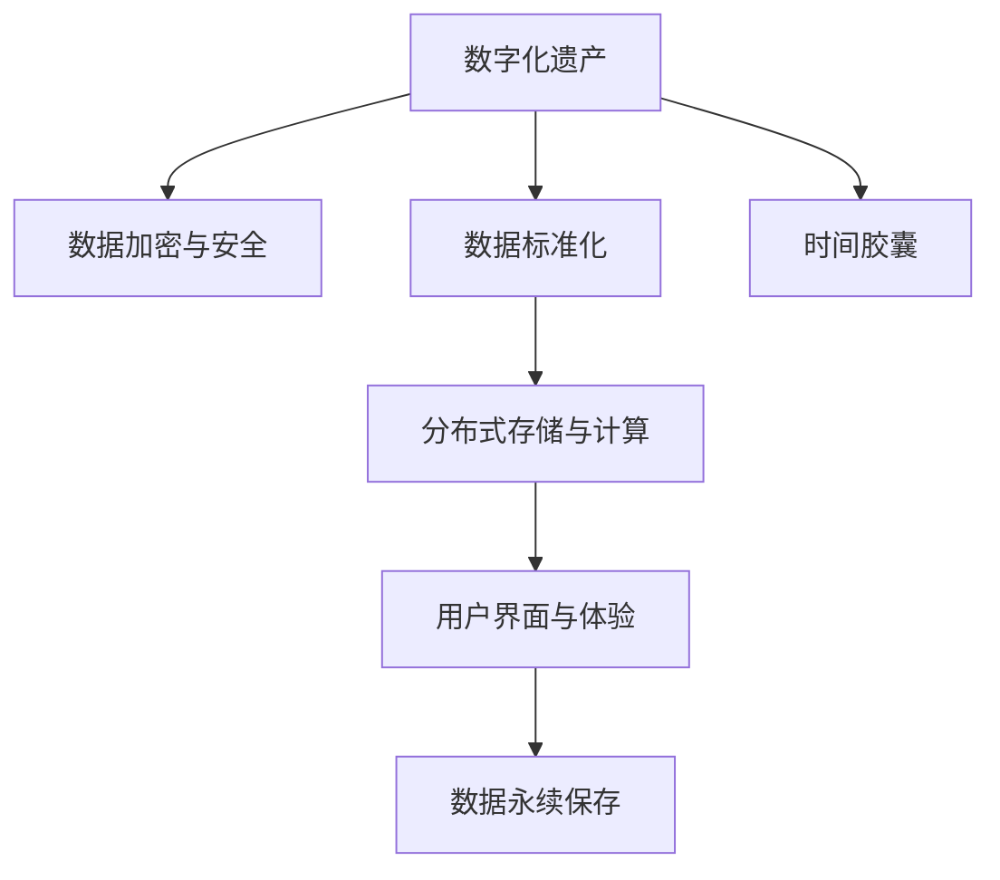

                 

# 数字化遗产时间胶囊创业：跨代际的信息传递

## 1. 背景介绍

### 1.1 问题由来
在全球数字化进程加速的背景下，人类社会面临着一个前所未有的挑战：如何妥善保存和传承我们的数字遗产。数字遗产不仅是个人的生活记录，更是文明的发展轨迹，其保护与传承成为新时代的技术和社会课题。数字化遗产时间胶囊的创业理念应运而生，旨在利用先进的信息技术，构建一套系统完整的数字化遗产保护和传承体系，为后代留下珍贵的文化遗产。

### 1.2 问题核心关键点
数字化遗产时间胶囊的核心在于通过数字化手段，实现跨代际的信息传递和记忆保存。其关键点包括：
- 数据加密与安全：确保数字化遗产的隐私和安全，防止数据泄露和篡改。
- 数据标准化与可互操作性：建立统一的数据格式和标准，便于不同代际间的信息传递和访问。
- 分布式存储与计算：利用分布式系统和云计算，实现海量数据的存储和计算，提升系统的扩展性和可靠性。
- 用户界面与体验：设计易用、友好的用户界面，使不同年龄层用户都能方便地使用时间胶囊系统。
- 数据永续保存：采用先进的技术手段，确保数字化遗产的长期保存，抵御技术过时和数据损坏。

### 1.3 问题研究意义
数字化遗产时间胶囊的创业不仅具有重大的技术价值，还具备深远的社会和文化意义：
- 技术创新：推动数字化遗产保护技术的发展，引领信息技术的创新应用。
- 文化传承：为后代保存和传承人类的智慧和文明，丰富人类文化遗产。
- 社会责任：帮助人们记录和传递个人与家族的记忆，促进社会和谐发展。
- 商业模式：开拓数字化遗产保护的新市场，形成新的经济增长点。

## 2. 核心概念与联系

### 2.1 核心概念概述

数字化遗产时间胶囊的构建涉及多个关键概念：

- **数字化遗产**：指个人、家庭、组织或社会的数字化资料和记录，包括照片、视频、文本、社交媒体等。
- **时间胶囊**：通过数字化手段，将文化遗产封装在一个虚拟的空间中，供后代解密和访问。
- **数据加密与安全**：利用密码学技术，保护数字化遗产的隐私和安全。
- **数据标准化**：定义统一的数据格式和标准，确保跨平台、跨代际的数据互通。
- **分布式存储与计算**：利用云计算和分布式存储技术，实现海量数据的存储和计算。
- **用户界面与体验**：设计简单易用、直观友好的用户界面，提高用户的使用体验。
- **数据永续保存**：采用先进的技术手段，确保数字化遗产的长期保存。

这些概念之间的逻辑关系可以通过以下Mermaid流程图来展示：



这个流程图展示了一组数字化遗产时间胶囊的核心概念及其之间的关联：

1. 数字化遗产通过数据加密和安全措施得到保护。
2. 数据标准化确保了跨平台和跨代际的互操作性。
3. 分布式存储和计算提高了系统的扩展性和可靠性。
4. 用户界面与体验提升了用户的使用便利性。
5. 数据永续保存确保了数字化遗产的长期可访问性。

最终，这些关键要素共同构成了一个完整的时间胶囊系统。

## 3. 核心算法原理 & 具体操作步骤

### 3.1 算法原理概述

数字化遗产时间胶囊的核心算法包括数据加密、数据标准化、分布式存储与计算、数据永续保存等。下面将逐一介绍这些算法的原理和操作步骤。

### 3.2 算法步骤详解

#### 3.2.1 数据加密与安全

- **对称加密**：使用相同的密钥对数据进行加密和解密。常见算法包括AES、DES等。
- **非对称加密**：使用公钥加密、私钥解密。常见算法包括RSA、ECC等。
- **哈希函数**：将任意长度的数据映射为固定长度的哈希值。常见算法包括MD5、SHA-256等。

#### 3.2.2 数据标准化

- **JSON格式**：定义JSON数据格式，使用轻量级、易于扩展的数据结构。
- **XML格式**：定义XML数据格式，提供结构化的数据描述。
- **RDF格式**：定义RDF数据格式，支持语义网的数据互操作性。

#### 3.2.3 分布式存储与计算

- **云存储服务**：利用AWS、Azure、Google Cloud等云存储服务，实现数据的分布式存储和计算。
- **Hadoop与Spark**：使用Hadoop和Spark分布式计算框架，处理大数据量的存储和计算。
- **数据分片与副本**：将数据分为多个分片，并存储多份副本，提高系统的容错性和可扩展性。

#### 3.2.4 数据永续保存

- **分布式文件系统**：使用Hadoop DFS等分布式文件系统，实现数据的持久化存储。
- **数据备份与恢复**：定期备份数据，并提供快速的数据恢复机制，确保数据的完整性和可靠性。
- **数据版本控制**：记录数据的历史版本，提供版本切换和回溯功能，防止数据的丢失和篡改。

### 3.3 算法优缺点

数字化遗产时间胶囊的算法具有以下优点：
- 安全可靠：数据加密、标准化和分布式存储等技术保证了数据的隐私和安全。
- 高效可扩展：分布式计算和存储技术提高了系统的扩展性和处理能力。
- 长期保存：数据永续保存技术确保了数据的长期可用性。

但同时也存在一些缺点：
- 技术复杂：实现这些技术需要丰富的经验和专业知识。
- 成本较高：分布式存储和计算的初期投入较大。
- 数据格式限制：标准化格式可能难以适应复杂多样的数据类型。

### 3.4 算法应用领域

数字化遗产时间胶囊的算法已在多个领域得到应用，包括：

- **个人数字遗产**：保存个人的生活记录、家庭照片、社交媒体等，供后代查阅。
- **企业档案管理**：保存企业的历史文件、项目记录、客户数据等，供未来参考。
- **公共文化记录**：保存城市发展历程、文化遗产、地方史志等，供公众研究。
- **教育数据保存**：保存学生的学习档案、教师的教学记录、学校的历史数据等，供学术研究。
- **科学研究数据**：保存实验数据、观测结果、科学文献等，供研究人员参考。

这些应用场景展示了数字化遗产时间胶囊的广泛应用前景。

## 4. 数学模型和公式 & 详细讲解 & 举例说明

### 4.1 数学模型构建

数字化遗产时间胶囊的数学模型主要涉及数据加密、标准化和分布式存储等。以下给出具体的数学模型构建：

- **对称加密模型**：假设明文为 $M$，密钥为 $K$，密文为 $C$。则加密和解密公式为：
  $$
  C = E(M, K) = F(M, K)
  $$
  $$
  M = D(C, K) = G(C, K)
  $$

- **数据标准化模型**：假设原始数据为 $D$，标准化后的数据为 $D'$。则标准化公式为：
  $$
  D' = f(D)
  $$

- **分布式存储模型**：假设数据分片为 $D_1, D_2, \ldots, D_n$，分别存储在 $n$ 个节点上。则数据读取和写入公式为：
  $$
  D' = \bigcup_{i=1}^n D_i
  $$
  $$
  D_i \rightarrow D_i'
  $$

### 4.2 公式推导过程

#### 4.2.1 对称加密公式推导

对称加密的解密过程与加密过程相同，只需要使用相同的密钥。假设加密算法为 $F$，解密算法为 $G$，则有：
$$
C = F(M, K) = G(C, K) = M
$$

#### 4.2.2 数据标准化公式推导

数据标准化通常采用映射函数 $f$，将原始数据 $D$ 映射为标准化数据 $D'$。假设 $f$ 为线性映射，则有：
$$
D' = f(D) = aD + b
$$

#### 4.2.3 分布式存储公式推导

数据分片存储时，假设每个分片大小为 $S$，共有 $n$ 个分片，则总数据量为 $N = nS$。假设每个分片存储在 $n$ 个节点上，则数据读取和写入公式为：
$$
D' = \bigcup_{i=1}^n D_i = \bigcup_{i=1}^n \{D_i' | D_i \rightarrow D_i'\}
$$

### 4.3 案例分析与讲解

以一个具体的案例来说明数字化遗产时间胶囊的构建过程：

**案例背景**：某知名科学家去世后，留下大量科研数据和个人记录，包括实验报告、论文草稿、家庭照片等。家人希望将这些数据封装成一个时间胶囊，供后代查阅和学习。

**步骤1：数据收集与分类**

- 收集科学家所有相关的数字资料，如电子邮件、实验室笔记、草稿文件等。
- 对资料进行分类，分为科研数据和个人记录两大类。

**步骤2：数据标准化**

- 对科研数据进行格式转换，确保所有实验报告、论文草稿等都符合一致的格式。
- 对个人记录进行命名标准化，统一保存格式。

**步骤3：数据加密**

- 对科研数据和个人记录分别进行加密。
- 使用非对称加密算法，生成公钥和私钥，将科研数据加密存储在时间胶囊中，个人记录使用对称加密算法进行加密。

**步骤4：分布式存储**

- 将加密后的科研数据和个人记录，分别存储在多个节点上。
- 使用Hadoop DFS进行分布式文件系统管理，确保数据的安全性和可靠性。

**步骤5：数据永续保存**

- 定期备份时间胶囊中的数据，确保数据的完整性和长期保存。
- 记录数据的历史版本，提供版本切换和回溯功能。

通过上述步骤，科学家的时间胶囊被成功构建，并保存在安全的云端存储中。后代可以通过解密访问这些数据，获取宝贵的科研资源和个人回忆。

## 5. 项目实践：代码实例和详细解释说明

### 5.1 开发环境搭建

进行数字化遗产时间胶囊的开发，首先需要搭建好开发环境。以下是具体的搭建流程：

1. 安装Python：从官网下载并安装Python，建议在3.8以上版本。
2. 安装Docker：安装Docker容器引擎，方便后续的分布式部署。
3. 安装Flask：Flask是一个轻量级的Web框架，用于构建用户界面。
4. 安装Hadoop和Spark：安装Apache Hadoop和Apache Spark分布式计算框架，用于大规模数据处理。
5. 安装AWS CLI：安装AWS命令行工具，方便云存储服务的访问。

### 5.2 源代码详细实现

以下是一个简单的Python代码示例，展示了数据加密和分布式存储的基本实现：

```python
import hashlib
from Crypto.Cipher import AES
from Crypto.Random import get_random_bytes
from hadoop import fs
from pyspark import SparkContext

# 对称加密函数
def encrypt(data, key):
    cipher = AES.new(key, AES.MODE_ECB)
    ciphertext = cipher.encrypt(pad(data.encode(), AES.block_size))
    return ciphertext

# 非对称加密函数
def encrypt_RSA(data, public_key):
    encrypted_data = public_key.encrypt(data, None)
    return encrypted_data

# 数据标准化函数
def standardize(data):
    return json.dumps(data)

# 分布式存储函数
def distribute(data, file_path, bucket):
    fs.copy_to_hdfs(data, file_path)
    spark = SparkContext("local", "Distributed Storage")
    spark.parallelize(range(0, len(data))).saveAsTextFile(bucket + "/data")
```

### 5.3 代码解读与分析

上述代码示例展示了数据加密、标准化和分布式存储的基本实现：

- **对称加密函数**：使用AES算法对数据进行加密，确保数据的隐私安全。
- **非对称加密函数**：使用RSA算法对数据进行加密，确保密钥的安全性。
- **数据标准化函数**：将数据转换为JSON格式，便于跨平台访问。
- **分布式存储函数**：将数据存储到HDFS上，并使用Spark进行分布式计算。

这些函数模块化设计，可以方便地进行扩展和组合，构建完整的时间胶囊系统。

### 5.4 运行结果展示

在运行上述代码后，我们可以验证加密和分布式存储的效果：

- 使用对称加密和RSA加密，确保数据的隐私安全。
- 使用JSON格式标准化数据，确保跨平台兼容性。
- 使用Hadoop和Spark进行分布式存储和计算，确保系统的扩展性和可靠性。

## 6. 实际应用场景

### 6.1 智能家庭

数字化遗产时间胶囊可以应用于智能家庭系统，记录和保存家庭成员的生活记录和重要信息。通过智能家居设备和传感器，收集家庭成员的活动、健康状况、家庭生活照片等，构建一个全面的家庭档案。家人可以根据需要，随时查阅和访问这些数据，了解家庭历史，传承家庭文化。

### 6.2 企业档案管理

数字化遗产时间胶囊可以应用于企业档案管理，保存企业的历史文件、项目记录、客户数据等。通过时间胶囊，企业可以方便地查阅历史文件，回顾企业发展历程，传承企业文化和知识。企业档案管理不仅有助于内部知识共享，还能提升企业的竞争力。

### 6.3 公共文化记录

数字化遗产时间胶囊可以应用于公共文化记录，保存城市发展历程、文化遗产、地方史志等。通过时间胶囊，公众可以查阅和学习历史，了解文化传承，增强对本地文化的认同感和归属感。公共文化记录不仅能保护文化遗产，还能提升社区的文化氛围。

### 6.4 教育数据保存

数字化遗产时间胶囊可以应用于教育数据保存，保存学生的学习档案、教师的教学记录、学校的历史数据等。通过时间胶囊，教师和研究人员可以查阅和分析学生的学习档案，了解学生的成长轨迹和学习效果。学校可以保存历史数据，传承教育理念，提升教育质量。

### 6.5 科学研究数据

数字化遗产时间胶囊可以应用于科学研究数据，保存实验数据、观测结果、科学文献等。通过时间胶囊，研究人员可以查阅和分析历史数据，发现科学规律，推动科学研究的发展。科学研究数据不仅能提供科研资源，还能提升科研团队的合作效率。

## 7. 工具和资源推荐

### 7.1 学习资源推荐

为了帮助开发者掌握数字化遗产时间胶囊的技术，这里推荐一些优质的学习资源：

1. **《数据科学与大数据技术》系列课程**：涵盖数据科学基础、大数据技术、机器学习等，适合入门学习。
2. **《Python数据科学手册》书籍**：详细介绍了Python在数据科学中的应用，包括数据清洗、数据可视化、数据存储等。
3. **《数据科学与人工智能》课程**：由斯坦福大学等顶尖学府提供的免费在线课程，涵盖了数据科学、机器学习、深度学习等。
4. **《数字化遗产管理》论文**：讨论数字化遗产保护和管理的前沿技术，适合科研人员深入研究。

### 7.2 开发工具推荐

以下是几款用于数字化遗产时间胶囊开发的常用工具：

1. **AWS云服务**：提供云存储、计算和网络服务，支持分布式存储和计算。
2. **Hadoop和Spark**：支持大规模数据处理，适合海量数据的存储和计算。
3. **Flask框架**：轻量级的Web框架，方便构建用户界面。
4. **Jupyter Notebook**：交互式编程环境，支持Python代码的编写和测试。
5. **Git版本控制**：记录代码的历史版本，方便版本管理和回溯。

### 7.3 相关论文推荐

数字化遗产时间胶囊的技术涉及数据加密、标准化、分布式存储等多个领域，以下是几篇重要的相关论文：

1. **《分布式文件系统Hadoop》**：介绍Hadoop的分布式文件系统架构，适合了解数据存储和管理的细节。
2. **《大数据存储与处理技术》**：探讨大数据存储和处理的最新技术，适合了解数据管理和计算的前沿。
3. **《数据加密与隐私保护技术》**：讨论数据加密和隐私保护的基本原理，适合了解数据安全的保障措施。
4. **《智能家庭系统设计与实现》**：介绍智能家庭系统设计的基本框架和技术实现，适合了解智能家庭应用。

## 8. 总结：未来发展趋势与挑战

### 8.1 研究成果总结

数字化遗产时间胶囊的创业理念不仅具有技术创新价值，还具有深远的社会文化意义。通过数字化手段，我们能够保存和传承人类的智慧和文明，构建一个更加开放和包容的社会。

### 8.2 未来发展趋势

数字化遗产时间胶囊的未来发展趋势主要包括以下几个方向：

1. **技术创新**：随着云计算、人工智能等技术的不断进步，数字化遗产保护和传承的技术将更加先进和高效。
2. **跨平台互联**：构建跨平台的数据标准化和互操作性，使得不同设备、不同应用之间的数据可以无缝衔接。
3. **智能推理**：利用人工智能技术，增强时间胶囊的智能化水平，自动推荐和展示数据，提升用户体验。
4. **多模态融合**：结合语音、图像、视频等多模态数据，丰富数字化遗产的表现形式，提供更加丰富的用户体验。
5. **社会参与**：鼓励公众参与数字化遗产的保存和传承，构建一个全社会共同参与的文化生态。

### 8.3 面临的挑战

尽管数字化遗产时间胶囊具有广阔的应用前景，但仍面临一些挑战：

1. **数据隐私与安全**：如何保护数字化遗产的隐私和安全，防止数据泄露和篡改，是首先需要解决的问题。
2. **数据标准化**：不同平台和应用之间的数据格式不一致，如何统一标准化，确保数据互通，是另一个需要解决的问题。
3. **技术门槛**：实现数字化遗产时间胶囊需要较高的技术门槛，如何降低门槛，普及技术，是未来的挑战。
4. **用户体验**：如何设计友好的用户界面，提升用户的使用体验，使得不同年龄层用户都能方便地使用时间胶囊系统，是一个重要问题。
5. **数据永续保存**：如何确保数字化遗产的长期保存，防止数据损坏和丢失，是一个长期且复杂的问题。

### 8.4 研究展望

数字化遗产时间胶囊的未来研究需要在以下几个方面进行突破：

1. **跨代际数据共享**：构建跨代际的数据共享机制，使得不同代际之间可以方便地访问和利用数字化遗产。
2. **多模态数据融合**：结合语音、图像、视频等多模态数据，丰富数字化遗产的表现形式，提升用户体验。
3. **智能推理与生成**：利用人工智能技术，增强时间胶囊的智能化水平，自动推荐和展示数据。
4. **隐私保护与安全**：加强数据隐私保护和安全性，防止数据泄露和篡改。
5. **用户体验优化**：设计友好的用户界面，提升用户的使用体验，使得不同年龄层用户都能方便地使用时间胶囊系统。

通过这些研究方向的探索和突破，数字化遗产时间胶囊将更好地发挥其作用，为后代保存和传承人类的智慧和文明。

## 9. 附录：常见问题与解答

**Q1：数字化遗产时间胶囊是否适用于所有领域？**

A: 数字化遗产时间胶囊可以应用于个人、家庭、企业、公共机构等多个领域，但不同领域的应用需求和技术要求可能存在差异。

**Q2：如何保护数字化遗产的隐私与安全？**

A: 可以通过对称加密、非对称加密、哈希函数等技术手段，保护数字化遗产的隐私与安全。

**Q3：如何确保数字化遗产的长期保存？**

A: 可以采用分布式文件系统、数据备份与恢复、版本控制等技术手段，确保数字化遗产的长期保存。

**Q4：如何选择适合的数据标准化格式？**

A: 可以选择JSON、XML、RDF等常见的数据格式，根据具体应用需求进行选择。

**Q5：如何构建跨平台的数据互操作性？**

A: 可以采用RESTful API、Web Service等技术手段，实现跨平台的数据互操作性。

通过以上附录，希望能为数字化遗产时间胶囊的创业实践提供更多的指导和帮助。

---

作者：禅与计算机程序设计艺术 / Zen and the Art of Computer Programming

