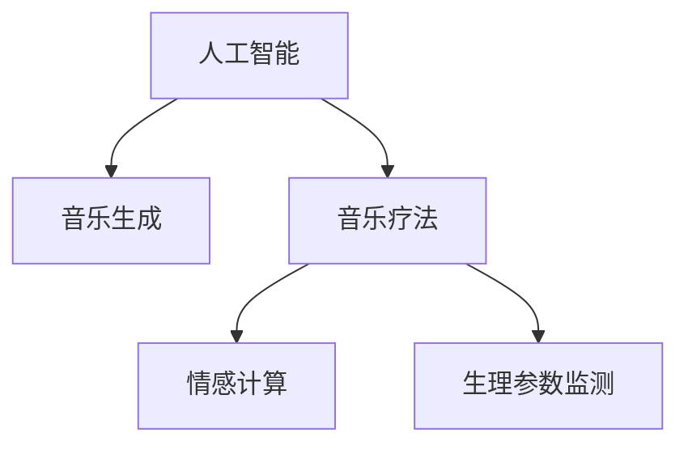

                 

# 数字化音乐治疗创业：AI生成的治愈音乐

## 1. 背景介绍

### 1.1 问题由来

在快速变化和高度竞争的社会中，现代人的精神健康问题变得越来越突出。传统音乐治疗手段在时间和资源上都存在局限，难以有效覆盖到所有需要帮助的人群。随着人工智能(AI)技术的发展，AI生成的治愈音乐正成为解决这一问题的可能路径。通过结合音乐学原理和AI算法，AI系统能够生成具有舒缓、减压等特定效果的音乐，满足不同人群的需求。

### 1.2 问题核心关键点

AI生成的治愈音乐作为一种新兴的数字化音乐治疗手段，其核心在于：

- **音乐生成技术**：AI模型如何理解和生成音乐，以及如何从音乐学原理出发，生成能够达到特定情感和生理效果的音乐。
- **用户体验设计**：治愈音乐的个性化设计，即如何根据用户的不同需求和情绪状态生成合适的音乐，提升用户体验。
- **心理与生理效果**：治愈音乐如何通过特定模式的音乐刺激，引发用户的心理与生理反应，从而达到治愈目的。

### 1.3 问题研究意义

AI生成的治愈音乐在提供个性化、便捷、广泛可用的音乐治疗方面具有重要意义：

1. **普惠性**：AI生成的音乐可以根据不同用户的个性化需求进行定制，满足各类人群的治疗需求。
2. **可及性**：通过数字平台，用户可以随时随地获取到治愈音乐，无需特定的物理设施或专业人员。
3. **成本效益**：相较于传统音乐治疗的高成本，AI生成的治愈音乐能提供较低的价格，增加音乐的普及度。
4. **创新性**：AI技术的应用带来新的音乐生成方式和音乐治疗方法，为音乐治疗领域注入新的活力。

## 2. 核心概念与联系

### 2.1 核心概念概述

为更好地理解AI生成的治愈音乐，本节将介绍几个关键概念：

- **人工智能(AI)**：利用算法和模型，使计算机系统具有类似于人类的智能行为，如学习、推理、决策等。
- **音乐生成(Music Generation)**：通过AI技术自动创作音乐，包括旋律、和声、节奏等音乐元素。
- **音乐疗法(Music Therapy)**：利用音乐对生理和心理健康产生积极影响的一种治疗方法。
- **情感计算(Emotion Computing)**：研究如何通过识别和分析用户的情感状态，生成能引发特定情感反应的音乐。
- **生理参数监测(Physiological Monitoring)**：通过监测用户的生理指标（如心率、血压等），评估音乐的生理效果。

这些概念之间的逻辑关系可以通过以下Mermaid流程图来展示：



这个流程图展示了一些核心概念之间的关系：

1. AI技术提供音乐生成的能力。
2. 音乐疗法通过AI生成的音乐实现。
3. 情感计算用于定制个性化的音乐。
4. 生理参数监测评估音乐的实际效果。

## 3. 核心算法原理 & 具体操作步骤

### 3.1 算法原理概述

AI生成的治愈音乐的原理在于结合音乐学和AI技术的优势。通过构建音乐生成模型，模型学习大量的音乐数据，理解音乐的结构和情感特征，然后基于用户的情感和生理状态生成适合的音乐。

具体来说，包括两个主要步骤：

- **数据预处理**：收集和整理大量的音乐数据，包括不同风格、节奏、情感的音乐片段。
- **模型训练**：利用深度学习模型对音乐数据进行训练，学习音乐生成的规律，从而能够生成新的音乐片段。

### 3.2 算法步骤详解

基于上述原理，AI生成的治愈音乐的步骤如下：

**Step 1: 数据预处理**
1. 收集音乐数据：包括流行音乐、古典音乐、自然声音等不同类型的音乐，以及其对应的音乐学特征和情感标签。
2. 数据清洗：移除噪声、重复和无效的音乐片段。
3. 数据标注：为音乐片段添加情感标签，如快乐、悲伤、平静等。
4. 特征提取：提取音乐学特征，如旋律、和声、节奏等。

**Step 2: 模型训练**
1. 选择合适的模型：如RNN、LSTM、Transformer等，用于音乐生成任务。
2. 数据划分：将数据划分为训练集、验证集和测试集。
3. 模型训练：使用训练集数据对模型进行训练，最小化音乐生成与真实标签之间的差距。
4. 验证与优化：在验证集上评估模型性能，根据表现调整超参数，优化模型。
5. 测试与评估：在测试集上测试模型，评估生成音乐的质量。

**Step 3: 用户定制与生成**
1. 用户输入：用户描述其情感状态、偏好等需求。
2. 生成音乐：根据用户输入生成个性化的音乐片段。
3. 生理参数监测：通过传感器监测用户的生理指标，评估音乐的实际效果。

### 3.3 算法优缺点

AI生成的治愈音乐具有以下优点：
1. **个性化定制**：能够根据用户的特定需求生成定制化的音乐。
2. **便捷获取**：用户可以通过数字平台随时随地获取音乐，无需特定的物理设施。
3. **成本效益**：相较于传统音乐治疗，成本较低，更易于推广。

同时，也存在以下缺点：
1. **技术门槛高**：需要具备音乐学和AI技术的双重专业知识。
2. **用户体验差异**：生成的音乐可能与用户的实际需求存在差异。
3. **生理效果未知**：音乐的生理效果需要进一步验证和评估。

### 3.4 算法应用领域

AI生成的治愈音乐主要应用于以下几个领域：

1. **心理健康**：用于缓解压力、焦虑、抑郁等情绪问题，帮助用户放松和舒缓心情。
2. **儿童教育**：为儿童提供舒缓的音乐环境，促进学习专注度和情感稳定。
3. **康复治疗**：为康复期的患者提供舒缓的音乐，辅助治疗效果。
4. **企业福利**：为企业员工提供音乐疗法，缓解工作压力，提升工作效率。

## 4. 数学模型和公式 & 详细讲解 & 举例说明

### 4.1 数学模型构建

在AI生成的治愈音乐中，音乐生成模型是核心。我们以一个简单的基于LSTM的音乐生成模型为例：

**输入**：$x_{1:t}$，表示时间步$t$之前的音乐特征序列。
**输出**：$y_t$，表示时间步$t$生成的音乐特征。

假设输入和输出均为向量，音乐特征的维度为$d$。则模型的目标是最小化预测误差：

$$
\min_{\theta} \sum_{t=1}^{T} \ell(y_t, \hat{y}_t)
$$

其中$\theta$为模型参数，$\ell$为损失函数，$T$为总时间步数。

### 4.2 公式推导过程

我们以LSTM模型为例，推导音乐生成的公式：

**LSTM单元公式**：
$$
g_t = \sigma(W_gx_{t-1} + U_g h_{t-1} + b_g)
$$
$$
i_t = \sigma(W_i x_{t-1} + U_i h_{t-1} + b_i)
$$
$$
f_t = \sigma(W_f x_{t-1} + U_f h_{t-1} + b_f)
$$
$$
o_t = \sigma(W_o x_{t-1} + U_o h_{t-1} + b_o)
$$
$$
c_t = f_t \odot c_{t-1} + i_t \odot \tanh(W_c x_{t-1} + U_c h_{t-1} + b_c)
$$
$$
h_t = o_t \odot \tanh(c_t)
$$

其中，$g_t$、$i_t$、$f_t$、$o_t$表示LSTM单元的四个门（遗忘门、输入门、输出门、更新门），$c_t$表示LSTM单元的状态，$h_t$表示LSTM单元的输出。

**音乐生成公式**：
$$
\hat{y}_t = h_t
$$

其中，$\hat{y}_t$表示生成音乐的时间步$t$的特征。

### 4.3 案例分析与讲解

以生成一段平静音乐为例，假设输入为一段以平静音乐学特征为主的时间步序列，模型的目标是在时间步$t$生成一个平静的音符。通过训练，模型学习到在特定音乐学特征下，生成平静音符的概率最大。

具体来说，音乐生成过程分为两个步骤：

1. **特征提取**：将输入的音乐片段转换为一系列音乐学特征向量。
2. **生成音乐**：利用LSTM模型生成音乐特征向量，并将其转换为实际的音符序列。

例如，模型可能通过以下步骤生成一段平静音乐：

1. 输入一段平静的音乐片段，提取其旋律、和声、节奏等音乐学特征。
2. 将这些特征作为LSTM模型的输入，模型生成相应的音符序列。
3. 通过调整超参数和训练数据，模型学习到在特定音乐学特征下，生成平静音符的概率最大。

## 5. 项目实践：代码实例和详细解释说明

### 5.1 开发环境搭建

在进行音乐生成实践前，我们需要准备好开发环境。以下是使用Python进行TensorFlow开发的环境配置流程：

1. 安装Anaconda：从官网下载并安装Anaconda，用于创建独立的Python环境。

2. 创建并激活虚拟环境：
```bash
conda create -n tf-env python=3.8 
conda activate tf-env
```

3. 安装TensorFlow：根据CUDA版本，从官网获取对应的安装命令。例如：
```bash
conda install tensorflow -c tensorflow -c conda-forge
```

4. 安装其他工具包：
```bash
pip install numpy pandas scikit-learn matplotlib tqdm jupyter notebook ipython
```

完成上述步骤后，即可在`tf-env`环境中开始音乐生成实践。

### 5.2 源代码详细实现

以下是使用TensorFlow实现基于LSTM的音乐生成模型的示例代码：

```python
import tensorflow as tf
from tensorflow.keras.layers import LSTM, Dense
from tensorflow.keras.models import Sequential
import numpy as np

# 定义LSTM模型
def build_model(input_dim, output_dim):
    model = Sequential()
    model.add(LSTM(128, input_shape=(None, input_dim), return_sequences=True))
    model.add(LSTM(128, return_sequences=True))
    model.add(Dense(output_dim))
    return model

# 加载音乐数据
data = np.load('music_data.npy')

# 数据预处理
def preprocess_data(data, input_dim, output_dim):
    x = data[:, :, :input_dim]
    y = data[:, :, output_dim:]
    x_train = np.zeros((x.shape[0] - 1, x.shape[1], input_dim))
    y_train = np.zeros((y.shape[0] - 1, y.shape[1], output_dim))
    for i in range(x.shape[0] - 1):
        x_train[i] = x[i:i+1, i:i+1, :]
        y_train[i] = y[i:i+1, i:i+1, :]
    return x_train, y_train

# 构建模型
input_dim = 10
output_dim = 5
model = build_model(input_dim, output_dim)

# 编译模型
model.compile(optimizer='adam', loss='mse')

# 训练模型
x_train, y_train = preprocess_data(data, input_dim, output_dim)
model.fit(x_train, y_train, epochs=100, batch_size=64)

# 生成音乐
def generate_music(model, input_seq, length):
    generated = []
    for i in range(length):
        preds = model.predict(np.expand_dims(input_seq, axis=0))
        preds = preds.reshape(-1, output_dim)
        pred_idx = np.argmax(preds)
        input_seq = np.append(input_seq[:, 1:], [pred_idx])
        generated.append(pred_idx)
    return generated

# 生成一段平静音乐
input_seq = np.zeros((1, 1, input_dim))
generated_music = generate_music(model, input_seq, 10)
```

这个代码片段展示了使用TensorFlow实现基于LSTM的音乐生成模型。可以看到，关键步骤包括：

1. **模型构建**：定义LSTM模型结构。
2. **数据预处理**：将音乐数据转换为适合模型的输入和输出格式。
3. **模型编译**：设置优化器和损失函数。
4. **模型训练**：使用训练数据对模型进行训练。
5. **音乐生成**：根据模型生成的音符序列生成音乐。

### 5.3 代码解读与分析

让我们再详细解读一下关键代码的实现细节：

**build_model函数**：
- 定义了一个包含两个LSTM层和一个全连接层的模型，用于生成音乐。
- 第一个LSTM层输入音乐特征序列，输出包含128个神经元的特征向量。
- 第二个LSTM层输入第一个LSTM层的输出，同样输出包含128个神经元的特征向量。
- 最后通过全连接层将特征向量映射到音乐学特征空间。

**preprocess_data函数**：
- 将音乐数据分割成输入和输出序列。
- 输入序列为前一个音符，输出序列为后一个音符。
- 通过循环生成输入序列和输出序列，用于训练模型。

**generate_music函数**：
- 使用训练好的模型生成音乐片段。
- 输入一个初始音符，循环生成后续音符，直到达到指定的音乐长度。

**音乐生成**：
- 输入一个初始音符序列，模型预测下一个音符，逐步生成完整的音乐片段。
- 生成的音乐片段可以根据不同的输入序列，生成不同的音乐风格。

可以看到，TensorFlow提供了便捷的Keras API，使得音乐生成模型的构建和训练变得简单高效。

## 6. 实际应用场景

### 6.1 数字音乐疗法

AI生成的治愈音乐已经在多个数字音乐疗法应用中得到实践验证。例如，可以应用在以下场景：

1. **焦虑缓解**：通过播放平静、舒缓的音乐，帮助用户放松心情，缓解焦虑情绪。
2. **情绪调节**：根据用户的情感状态，生成相应的音乐，帮助用户调整情绪。
3. **睡眠辅助**：生成具有镇静效果的音乐，帮助用户入睡。
4. **压力管理**：通过播放愉悦的音乐，减轻用户的心理压力。

### 6.2 音乐教育

AI生成的治愈音乐也可以应用于音乐教育领域，帮助学生更好地理解和体验音乐：

1. **音乐理解**：通过生成不同类型的音乐片段，帮助学生理解音乐的结构和情感表达。
2. **音乐创作**：鼓励学生通过生成音乐片段，进行音乐创作和实验。
3. **音乐治疗**：为音乐治疗课程提供个性化的音乐素材，帮助学生进行心理和情感的调整。

### 6.3 企业应用

在企业应用中，AI生成的治愈音乐可以用于员工福利和工作环境的改善：

1. **办公室氛围**：在办公室播放平静的音乐，营造舒适的工作环境。
2. **员工减压**：为员工提供个性化的音乐，缓解工作压力。
3. **团队建设**：通过团队成员共同听同一首音乐，增强团队凝聚力和合作精神。

## 7. 工具和资源推荐

### 7.1 学习资源推荐

为了帮助开发者系统掌握AI生成的治愈音乐的技术基础和实践技巧，这里推荐一些优质的学习资源：

1. **《深度学习》课程**：斯坦福大学的深度学习课程，涵盖深度学习的基本概念和实现方法，为音乐生成提供理论基础。
2. **《音乐生成与分析》课程**：Kaggle的数据科学课程，专注于音乐生成和分析的技术，包括LSTM、RNN等算法。
3. **《音乐疗法基础》书籍**：介绍音乐疗法的基本原理和应用，为音乐生成的实践提供指导。
4. **《音乐生成技术》论文**：最新的音乐生成技术论文，了解前沿研究进展。

### 7.2 开发工具推荐

高效的开发离不开优秀的工具支持。以下是几款用于AI生成的治愈音乐开发的常用工具：

1. **TensorFlow**：谷歌的深度学习框架，支持广泛的深度学习模型，易于使用。
2. **Keras**：基于TensorFlow的高级API，提供便捷的模型构建和训练。
3. **Jupyter Notebook**：交互式编程环境，支持代码编写和数据分析。
4. **Python**：灵活的编程语言，广泛用于深度学习领域。
5. **Audacity**：音频编辑软件，用于音频处理和生成。

### 7.3 相关论文推荐

AI生成的治愈音乐的研究涉及到多个领域，以下是几篇代表性的相关论文，推荐阅读：

1. **《使用深度学习进行音乐生成的研究》**：研究使用深度学习模型生成音乐的理论和方法，包括LSTM、RNN等。
2. **《音乐生成在音乐疗法中的应用》**：探讨音乐生成在音乐疗法中的实际应用效果，评估其对用户的心理和生理影响。
3. **《基于音乐学的音乐生成技术》**：介绍音乐学原理在音乐生成中的应用，提升生成的音乐质量和多样性。

## 8. 总结：未来发展趋势与挑战

### 8.1 研究成果总结

AI生成的治愈音乐已经在多个领域得到应用，展现出其强大的潜力和实际效果。未来，音乐生成技术将进一步发展和完善，提升用户体验和应用效果。

### 8.2 未来发展趋势

展望未来，AI生成的治愈音乐将呈现以下几个发展趋势：

1. **个性化定制**：基于用户的情感和生理状态，生成更符合需求的定制化音乐。
2. **多模态融合**：将音乐与视觉、听觉等多种模态信息结合，提升音乐体验和效果。
3. **实时生成**：实现实时音乐生成，适应用户的即时需求。
4. **跨平台应用**：在各种设备和平台上实现无缝应用，提高音乐的普及性。
5. **智能推荐**：通过分析用户的历史数据，生成个性化的音乐推荐。

### 8.3 面临的挑战

尽管AI生成的治愈音乐已经取得一定进展，但在实际应用中仍面临一些挑战：

1. **技术难度高**：音乐生成的复杂性决定了技术难度高，需要跨学科的知识和技术。
2. **数据稀缺**：高质量的音乐数据不易获取，限制了音乐生成的效果。
3. **用户体验差异**：生成的音乐可能无法完全满足用户的个性化需求。
4. **生理效果评估**：音乐的生理效果需要进一步验证和评估。

### 8.4 研究展望

面对这些挑战，未来的研究需要在以下几个方面寻求突破：

1. **数据收集与标注**：扩大音乐数据的收集范围，提升数据的丰富性和多样性。
2. **技术改进**：开发更高效、更灵活的音乐生成算法，降低技术门槛。
3. **用户体验优化**：通过用户反馈和行为分析，提升音乐的个性化和适应性。
4. **生理效果评估**：建立科学的评估标准，验证音乐的生理效果。

总之，AI生成的治愈音乐正处于快速发展阶段，未来必将带来更加丰富和高效的音乐体验，为数字化音乐疗法等领域带来新的突破。

## 9. 附录：常见问题与解答

**Q1：AI生成的治愈音乐是否适用于所有人群？**

A: AI生成的治愈音乐适用于大部分人群，尤其是需要缓解压力、焦虑等情绪问题的用户。但对于有特殊音乐偏好或过敏的人群，需要根据实际情况进行调整和优化。

**Q2：音乐生成模型的训练数据如何获取？**

A: 音乐生成模型的训练数据可以通过以下方式获取：
1. 公共音乐数据集：如MFCC、LibriSpectrogram等。
2. 开源音乐项目：如Spotify、Apple Music等平台提供的数据集。
3. 自行录制：通过录音设备录制音乐片段，进行数据标注。

**Q3：如何评估音乐生成的效果？**

A: 音乐生成的效果可以通过以下方式评估：
1. 用户反馈：通过问卷调查、用户访谈等方式，收集用户对音乐生成效果的反馈。
2. 生理指标：使用生理监测设备，如心率、血压等，评估音乐的生理效果。
3. 情感分析：使用情感分析算法，评估音乐片段的情感色彩和情感强度。

**Q4：音乐生成模型的评估指标有哪些？**

A: 音乐生成模型的评估指标包括：
1. 预测准确率：评估模型预测下一个音符的正确率。
2. 音乐多样性：评估生成的音乐片段的多样性和创造性。
3. 情感匹配度：评估生成的音乐片段与用户情感状态的匹配度。
4. 生理效果：评估音乐的生理效果，如缓解压力、改善心情等。

通过以上问题与解答，相信你对AI生成的治愈音乐有了更全面的了解。希望这篇技术博客文章能为你提供有价值的参考，并助你在数字化音乐治疗领域取得新的突破。

---

作者：禅与计算机程序设计艺术 / Zen and the Art of Computer Programming

