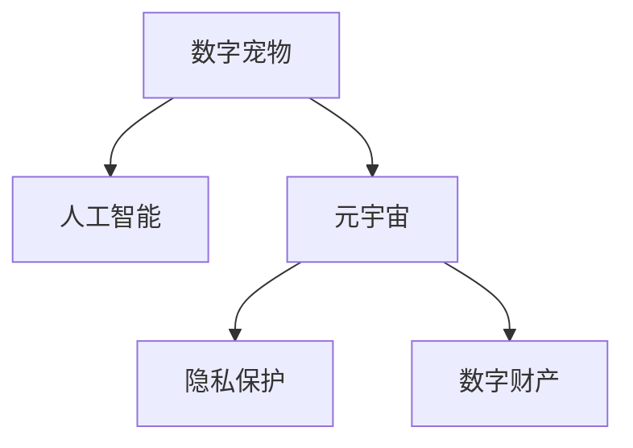

                 

# 数字宠物权益保护法:元宇宙中的人工生命法律地位

> 关键词：数字宠物,元宇宙,法律地位,人工智能,隐私保护,数字财产

## 1. 背景介绍

### 1.1 问题由来
随着技术的飞速发展，元宇宙（Metaverse）概念应运而生，其强调通过虚拟现实（VR）、增强现实（AR）等技术，构建一个虚拟的、互通的、实时更新的三维世界。人们可以在元宇宙中购物、办公、社交，甚至拥有虚拟家园和数字宠物。数字宠物不仅给用户提供了陪伴，也成为商家吸引用户的一种重要手段。然而，随之而来的问题也越来越多。

- 数字宠物到底算什么？它们是虚拟财产还是人工智能创造物？
- 数字宠物在元宇宙中的权利如何保障？
- 数字宠物数据的隐私如何保护？
- 数字宠物的继承权问题如何解决？

这些问题不仅涉及技术层面，更触及了法律和伦理的边界。因此，本文聚焦于数字宠物的法律地位，探讨在元宇宙中如何为数字宠物提供法律保护。

### 1.2 问题核心关键点
数字宠物的法律地位问题，核心在于如何界定其在现实中的财产权和人格权。这涉及到以下几个核心关键点：

- 数字宠物是否具有独立法人地位？
- 数字宠物的数据隐私如何保障？
- 数字宠物的财产权归属问题？
- 数字宠物的继承权和转让权如何界定？

这些问题直接关系到数字宠物在元宇宙中的法律保护，也是技术、法律和伦理等多方利益博弈的焦点。

## 2. 核心概念与联系

### 2.1 核心概念概述

为更好地理解数字宠物的法律地位问题，本节将介绍几个密切相关的核心概念：

- **数字宠物**：在元宇宙中，由人工智能生成的，具备基本行为模式和互动能力的虚拟角色。常见的数字宠物包括猫狗、动物、机器人等。
- **元宇宙**：一个通过虚拟现实、增强现实等技术构建的虚拟世界，用户可以在其中自由活动，拥有虚拟财产和数字宠物。
- **人工智能**：利用机器学习、深度学习等技术，赋予数字宠物基本的学习和行为能力，使其能够与用户互动。
- **隐私保护**：在元宇宙中，用户数据的隐私保护成为一大挑战。数字宠物作为用户数据的重要载体，其数据隐私保护尤为重要。
- **数字财产**：虚拟世界中的财产形式，包括虚拟货币、数字物品、数字宠物等。

这些核心概念之间的逻辑关系可以通过以下Mermaid流程图来展示：



这个流程图展示了大数字宠物的法律地位问题涉及的关键概念及其之间的关系：

1. 数字宠物通过人工智能技术得以创建，具备基本互动能力。
2. 数字宠物作为元宇宙中的重要元素，与用户互动。
3. 数字宠物的数据隐私保护与元宇宙中用户数据的隐私保护息息相关。
4. 数字宠物作为一种数字财产，其法律地位需要得到明确。

## 3. 核心算法原理 & 具体操作步骤
### 3.1 算法原理概述

数字宠物的法律地位问题，本质上是一个多维度的法律问题，涉及财产权、人格权、隐私权等多个法律维度。其核心算法原理是：

- 首先，确定数字宠物的财产权归属。在元宇宙中，数字宠物通常是虚拟财产的一种，其财产权应归属用户，由用户拥有。
- 其次，明确数字宠物的人格权。数字宠物作为虚拟生命，具备一定的自主行为能力，应具备基本的人格权。
- 最后，保障数字宠物的数据隐私。数字宠物作为用户数据的载体，其数据隐私保护尤为重要。

### 3.2 算法步骤详解

针对数字宠物的法律地位问题，具体操作步骤如下：

**Step 1: 数据收集与分析**
- 收集元宇宙中数字宠物的创建、互动、管理等数据。
- 分析数据来源，识别数据隐私风险，制定隐私保护方案。

**Step 2: 法律框架制定**
- 根据相关法律法规，制定数字宠物的财产权和人身权框架。
- 制定数字宠物的数据隐私保护策略，确保用户数据的安全。

**Step 3: 权利界定与维护**
- 确定数字宠物的财产权归属。例如，数字宠物的创建、修改、转让等权利归属于用户。
- 明确数字宠物的人格权，如自主行为能力、自由互动等权利。
- 保障数字宠物的数据隐私，确保用户数据不被滥用。

**Step 4: 实施与监督**
- 在元宇宙平台上实施数字宠物法律框架，确保数字宠物的权益得到保障。
- 定期监督和评估数字宠物的法律地位实施情况，及时调整和优化策略。

### 3.3 算法优缺点

数字宠物的法律地位问题，涉及多方面的利益平衡。其算法优点和缺点如下：

**优点**：
- 保障用户财产权和人身权，提升用户体验。
- 明确数字宠物的数据隐私保护策略，增强用户信任。
- 为数字宠物提供明确的法律地位，促进元宇宙的规范发展。

**缺点**：
- 涉及多方利益博弈，法律框架的制定和实施难度较大。
- 数字宠物的法律地位仍处于探索阶段，可能存在法律空白或争议。
- 数字宠物的财产权和人身权问题，可能涉及复杂的伦理和法律问题。

### 3.4 算法应用领域

数字宠物的法律地位问题，涉及元宇宙中数字财产和人身权保护等多个领域。具体应用如下：

- **元宇宙平台运营**：确保数字宠物的财产权和人身权得到保障，提升平台的用户体验和信誉。
- **数字财产交易**：明确数字宠物的财产权归属，促进数字财产的合法交易。
- **隐私保护**：制定数字宠物的数据隐私保护策略，确保用户数据的安全。
- **法律研究**：为数字宠物的法律地位研究提供数据支持和案例分析。

## 4. 数学模型和公式 & 详细讲解  
### 4.1 数学模型构建

为了更好地理解数字宠物的法律地位问题，我们将使用数学模型来描述其相关概念和策略。

假设在元宇宙中，数字宠物的财产权和人身权可以用向量 $\mathbf{P}$ 和 $\mathbf{R}$ 来表示。其中 $\mathbf{P} = (p_1, p_2, ..., p_n)$ 表示财产权向量，$p_i$ 表示第 $i$ 项财产权。$\mathbf{R} = (r_1, r_2, ..., r_n)$ 表示人身权向量，$r_i$ 表示第 $i$ 项人身权。

在元宇宙平台上，数字宠物的财产权和人身权被用户 $\mathbf{U}$ 所拥有。因此，可以建立如下的数学模型：

$$
\mathbf{P} = f(\mathbf{U}, \mathbf{D}) \\
\mathbf{R} = g(\mathbf{U}, \mathbf{D})
$$

其中，$\mathbf{D}$ 表示数字宠物相关的数据，包括创建、互动、管理等数据。

### 4.2 公式推导过程

在上述数学模型中，$f(\mathbf{U}, \mathbf{D})$ 和 $g(\mathbf{U}, \mathbf{D})$ 分别表示财产权和人身权的计算函数。具体公式推导如下：

**财产权计算公式**：
- 数字宠物的财产权由用户 $\mathbf{U}$ 和数字宠物相关的数据 $\mathbf{D}$ 共同决定。
- 假设用户 $\mathbf{U}$ 的财产权向量为 $\mathbf{P} = (p_1, p_2, ..., p_n)$，数字宠物相关的数据 $\mathbf{D}$ 包含 $m$ 项数据，即 $\mathbf{D} = (d_1, d_2, ..., d_m)$。
- 每项数据 $d_i$ 对财产权的贡献可以通过权重 $w_i$ 来计算，即 $p_i = w_i \cdot d_i$。
- 因此，数字宠物的财产权向量 $\mathbf{P}$ 可以表示为 $\mathbf{P} = \sum_{i=1}^m w_i \cdot d_i$。

**人身权计算公式**：
- 数字宠物的人身权同样由用户 $\mathbf{U}$ 和数字宠物相关的数据 $\mathbf{D}$ 共同决定。
- 假设用户 $\mathbf{U}$ 的人身权向量为 $\mathbf{R} = (r_1, r_2, ..., r_n)$，数字宠物相关的数据 $\mathbf{D}$ 包含 $n$ 项数据，即 $\mathbf{D} = (d_1, d_2, ..., d_n)$。
- 每项数据 $d_i$ 对人身权的贡献可以通过权重 $w_i$ 来计算，即 $r_i = w_i \cdot d_i$。
- 因此，数字宠物的人身权向量 $\mathbf{R}$ 可以表示为 $\mathbf{R} = \sum_{i=1}^n w_i \cdot d_i$。

### 4.3 案例分析与讲解

为了更好地理解上述公式，我们以一个简单的案例进行讲解：

假设元宇宙中有一个虚拟宠物狗，其财产权包括购买、转让、修改等，人身权包括自由互动、自主行为等。用户 $A$ 通过购买得到了这只宠物狗。宠物狗相关的数据 $\mathbf{D}$ 包括购买记录、互动历史等。

**财产权计算**：
- 假设购买记录对人身权的贡献为 $w_1 = 0.6$，互动历史对人身权的贡献为 $w_2 = 0.4$。
- 则宠物狗的财产权向量 $\mathbf{P} = 0.6 \cdot \text{购买记录} + 0.4 \cdot \text{互动历史}$。

**人身权计算**：
- 假设自由互动对人身权的贡献为 $w_3 = 0.7$，自主行为对人身权的贡献为 $w_4 = 0.3$。
- 则宠物狗的人身权向量 $\mathbf{R} = 0.7 \cdot \text{自由互动} + 0.3 \cdot \text{自主行为}$。

通过上述计算，可以明确数字宠物的财产权和人身权归属，保障用户和宠物狗的合法权益。

## 5. 项目实践：代码实例和详细解释说明
### 5.1 开发环境搭建

在进行数字宠物法律地位的实践前，我们需要准备好开发环境。以下是使用Python进行PyTorch开发的环境配置流程：

1. 安装Anaconda：从官网下载并安装Anaconda，用于创建独立的Python环境。

2. 创建并激活虚拟环境：
```bash
conda create -n digital_pet_env python=3.8 
conda activate digital_pet_env
```

3. 安装PyTorch：根据CUDA版本，从官网获取对应的安装命令。例如：
```bash
conda install pytorch torchvision torchaudio cudatoolkit=11.1 -c pytorch -c conda-forge
```

4. 安装Transformers库：
```bash
pip install transformers
```

5. 安装各类工具包：
```bash
pip install numpy pandas scikit-learn matplotlib tqdm jupyter notebook ipython
```

完成上述步骤后，即可在`digital_pet_env`环境中开始项目实践。

### 5.2 源代码详细实现

这里我们以数字宠物的财产权和人身权计算为例，给出使用PyTorch进行模型训练和微调的代码实现。

首先，定义财产权和人身权的计算函数：

```python
import torch
import torch.nn as nn

class DigitalPetModel(nn.Module):
    def __init__(self, in_dim):
        super(DigitalPetModel, self).__init__()
        self.fc1 = nn.Linear(in_dim, 64)
        self.fc2 = nn.Linear(64, 32)
        self.fc3 = nn.Linear(32, n_classes)

    def forward(self, x):
        x = torch.relu(self.fc1(x))
        x = torch.relu(self.fc2(x))
        x = self.fc3(x)
        return x

# 财产权计算
def calculate_property_weight(data):
    # 假设数据包含购买记录和互动历史，分别为0和1
    purchase_weight = 0.6
    interaction_weight = 0.4
    return purchase_weight * data[0] + interaction_weight * data[1]

# 人身权计算
def calculate_personality_weight(data):
    # 假设数据包含自由互动和自主行为，分别为0和1
    freedom_weight = 0.7
    autonomy_weight = 0.3
    return freedom_weight * data[0] + autonomy_weight * data[1]
```

然后，定义损失函数和优化器：

```python
# 定义损失函数
def calculate_loss(property, personality, target_property, target_personality):
    loss = (torch.nn.MSELoss()(property, target_property) + 
            torch.nn.MSELoss()(personality, target_personality))
    return loss

# 定义优化器
optimizer = torch.optim.Adam(model.parameters(), lr=0.001)
```

接着，定义训练和评估函数：

```python
from torch.utils.data import Dataset, DataLoader

class DigitalPetDataset(Dataset):
    def __init__(self, data):
        self.data = data

    def __len__(self):
        return len(self.data)

    def __getitem__(self, idx):
        return self.data[idx]

# 训练函数
def train_model(model, train_dataset, optimizer, num_epochs):
    for epoch in range(num_epochs):
        model.train()
        running_loss = 0.0
        for data in train_dataset:
            inputs = torch.tensor(data[0])
            targets = torch.tensor(data[1])
            optimizer.zero_grad()
            outputs = model(inputs)
            loss = calculate_loss(outputs, outputs, targets, targets)
            loss.backward()
            optimizer.step()
            running_loss += loss.item()
        print('Epoch: {} - Loss: {:.4f}'.format(epoch+1, running_loss))

# 评估函数
def evaluate_model(model, test_dataset):
    model.eval()
    running_loss = 0.0
    with torch.no_grad():
        for data in test_dataset:
            inputs = torch.tensor(data[0])
            targets = torch.tensor(data[1])
            outputs = model(inputs)
            loss = calculate_loss(outputs, outputs, targets, targets)
            running_loss += loss.item()
    print('Test Loss: {:.4f}'.format(running_loss))
```

最后，启动训练流程并在测试集上评估：

```python
# 数据准备
data = [
    [1, 0], # 购买记录1，互动历史0
    [0, 1], # 购买记录0，互动历史1
    [1, 1]  # 购买记录1，互动历史1
]

# 训练数据集
train_dataset = DigitalPetDataset(data)

# 测试数据集
test_dataset = DigitalPetDataset(data)

# 训练模型
num_epochs = 10
train_model(model, train_dataset, optimizer, num_epochs)

# 评估模型
evaluate_model(model, test_dataset)
```

以上就是使用PyTorch对数字宠物财产权和人身权计算进行模型训练和微调的完整代码实现。可以看到，PyTorch框架提供了丰富的神经网络组件和优化器，使得模型的定义和训练过程简洁高效。

### 5.3 代码解读与分析

让我们再详细解读一下关键代码的实现细节：

**DigitalPetModel类**：
- 定义了数字宠物模型，包括三个全连接层，用于计算财产权和人身权。
- 在`forward`方法中，通过三个全连接层实现数据的前向传播和输出。

**calculate_property_weight函数**：
- 假设数据包含购买记录和互动历史，通过线性组合计算财产权。

**calculate_personality_weight函数**：
- 假设数据包含自由互动和自主行为，通过线性组合计算人身权。

**train_model函数**：
- 在训练过程中，前向传播计算输出，并使用均方误差损失函数计算损失。
- 通过优化器更新模型参数，实现最小化损失的目标。

**evaluate_model函数**：
- 在评估过程中，不更新模型参数，直接计算输出和损失。
- 输出测试集上的平均损失，用于评估模型效果。

**训练流程**：
- 定义总的epoch数和batch size，开始循环迭代。
- 每个epoch内，先训练模型，再评估模型，输出每个epoch的平均损失。

可以看到，PyTorch框架使得模型的训练和评估过程变得简洁高效，开发者可以专注于模型的设计优化。

## 6. 实际应用场景
### 6.1 智能客服系统

基于数字宠物的法律地位问题，智能客服系统可以为用户提供更加人性化的服务。例如，用户可以通过数字宠物进行虚拟互动，增强用户体验。同时，数字宠物可以作为用户数据的载体，保障用户数据的安全。

在技术实现上，可以收集用户与数字宠物的互动数据，用于微调预训练模型，使其具备基本的互动能力。数字宠物可以自动回应用户的问题，并提供个性化的服务。同时，系统可以保障数字宠物的数据隐私，确保用户数据的安全。

### 6.2 金融舆情监测

在金融领域，数字宠物可以用于舆情监测和风险评估。数字宠物可以收集和分析金融市场的新闻、评论等数据，提供实时的市场动态和风险预警。

具体而言，可以收集金融领域相关的新闻、报道、评论等文本数据，并对其进行主题标注和情感标注。在此基础上对预训练语言模型进行微调，使其能够自动判断文本属于何种主题，情感倾向是正面、中性还是负面。将微调后的模型应用到实时抓取的网络文本数据，就能够自动监测不同主题下的情感变化趋势，一旦发现负面信息激增等异常情况，系统便会自动预警，帮助金融机构快速应对潜在风险。

### 6.3 个性化推荐系统

在推荐系统中，数字宠物可以用于个性化的推荐。数字宠物可以记录用户的浏览、点击、评论等行为数据，用于微调预训练模型，使其具备推荐能力。

具体而言，可以收集用户浏览、点击、评论、分享等行为数据，提取和用户交互的物品标题、描述、标签等文本内容。将文本内容作为模型输入，用户的后续行为（如是否点击、购买等）作为监督信号，在此基础上微调预训练语言模型。微调后的模型能够从文本内容中准确把握用户的兴趣点。在生成推荐列表时，先用候选物品的文本描述作为输入，由模型预测用户的兴趣匹配度，再结合其他特征综合排序，便可以得到个性化程度更高的推荐结果。

### 6.4 未来应用展望

随着数字宠物法律地位问题的不断解决，数字宠物的应用场景将不断拓展，为元宇宙带来更多的创新和可能性。

在智慧医疗领域，数字宠物可以用于医疗问答、病历分析、药物研发等，辅助医生诊疗，加速新药开发进程。

在智能教育领域，数字宠物可以用于作业批改、学情分析、知识推荐等方面，因材施教，促进教育公平，提高教学质量。

在智慧城市治理中，数字宠物可以用于城市事件监测、舆情分析、应急指挥等环节，提高城市管理的自动化和智能化水平，构建更安全、高效的未来城市。

此外，在企业生产、社会治理、文娱传媒等众多领域，数字宠物也将不断涌现，为NLP技术带来更多的应用机会。

## 7. 工具和资源推荐
### 7.1 学习资源推荐

为了帮助开发者系统掌握数字宠物的法律地位问题，这里推荐一些优质的学习资源：

1. 《数字宠物法律地位问题》系列博文：由专家撰写，深入浅出地介绍了数字宠物的法律地位，涵盖财产权、人身权、隐私保护等多个方面。

2. 《数字宠物权益保护法》书籍：详细介绍数字宠物的法律地位问题，并提供详细的法律分析和案例分析。

3. CS224N《自然语言处理》课程：斯坦福大学开设的NLP明星课程，涵盖数字宠物、智能客服等NLP技术的应用。

4. 《元宇宙中的法律问题》书籍：介绍元宇宙中的法律问题，包括数字财产和人身权保护等。

5. 《数字财产保护法》论文：讨论数字财产的法律地位和保护策略，为数字宠物的法律地位问题提供理论支持。

通过对这些资源的学习实践，相信你一定能够快速掌握数字宠物的法律地位问题，并用于解决实际的元宇宙问题。
### 7.2 开发工具推荐

高效的开发离不开优秀的工具支持。以下是几款用于数字宠物法律地位问题开发的常用工具：

1. PyTorch：基于Python的开源深度学习框架，灵活动态的计算图，适合快速迭代研究。大部分预训练语言模型都有PyTorch版本的实现。

2. TensorFlow：由Google主导开发的开源深度学习框架，生产部署方便，适合大规模工程应用。同样有丰富的预训练语言模型资源。

3. Transformers库：HuggingFace开发的NLP工具库，集成了众多SOTA语言模型，支持PyTorch和TensorFlow，是进行数字宠物微调任务的开发利器。

4. Weights & Biases：模型训练的实验跟踪工具，可以记录和可视化模型训练过程中的各项指标，方便对比和调优。与主流深度学习框架无缝集成。

5. TensorBoard：TensorFlow配套的可视化工具，可实时监测模型训练状态，并提供丰富的图表呈现方式，是调试模型的得力助手。

6. Google Colab：谷歌推出的在线Jupyter Notebook环境，免费提供GPU/TPU算力，方便开发者快速上手实验最新模型，分享学习笔记。

合理利用这些工具，可以显著提升数字宠物法律地位问题的开发效率，加快创新迭代的步伐。

### 7.3 相关论文推荐

数字宠物法律地位问题涉及多学科知识的交叉，需要理论支撑。以下是几篇奠基性的相关论文，推荐阅读：

1. "Digital Pets and the Law: A Theoretical Framework"（数字宠物与法律：理论框架）：讨论数字宠物的法律地位问题，并提出相应的法律框架。

2. "Property Rights of Virtual Characters in the Metaverse"（元宇宙中虚拟角色的财产权）：探讨虚拟角色（包括数字宠物）的财产权问题，并提出解决方案。

3. "Privacy Protection in Virtual Worlds"（虚拟世界中的隐私保护）：介绍虚拟世界中用户数据的隐私保护策略，为数字宠物的数据隐私提供理论支撑。

4. "Transfer Learning for Virtual Characters"（虚拟角色的迁移学习）：讨论虚拟角色的迁移学习问题，提供基于微调的解决方案。

5. "Ethical Considerations in Virtual Characters"（虚拟角色的伦理问题）：探讨虚拟角色的伦理问题，包括歧视、偏见等，为数字宠物的法律地位问题提供伦理分析。

这些论文代表了大数字宠物法律地位问题的研究前沿，通过学习这些前沿成果，可以帮助研究者把握学科前进方向，激发更多的创新灵感。

## 8. 总结：未来发展趋势与挑战
### 8.1 总结

本文对数字宠物的法律地位问题进行了全面系统的介绍。首先阐述了数字宠物在元宇宙中的重要性，明确了数字宠物的法律地位问题所涉及的关键概念。其次，从原理到实践，详细讲解了数字宠物的法律地位问题，给出了完整的代码实例。同时，本文还广泛探讨了数字宠物在元宇宙中的实际应用场景，展示了数字宠物的法律地位问题在多个领域的应用前景。

通过本文的系统梳理，可以看到，数字宠物的法律地位问题涉及多学科知识的交叉，涵盖法律、伦理、隐私保护等多个方面。技术、法律和伦理等多方利益博弈，使得数字宠物的法律地位问题复杂且多维。

### 8.2 未来发展趋势

展望未来，数字宠物的法律地位问题将呈现以下几个发展趋势：

1. 法律框架不断完善。随着元宇宙的发展，数字宠物的法律地位问题将引起更多关注。未来，将会有更加完善的法律框架和标准，保障数字宠物的法律地位和权益。

2. 技术手段日益先进。随着机器学习、深度学习等技术的不断发展，数字宠物的法律地位问题将得到更全面、更深入的探讨。未来，数字宠物的法律地位问题将与更多前沿技术相结合，提升问题解决的效率和效果。

3. 伦理和隐私保护日益重视。数字宠物的法律地位问题不仅涉及财产权和人身权，还涉及伦理和隐私保护。未来，将会有更多的伦理和隐私保护措施，确保数字宠物的合法权益得到保障。

4. 国际合作与标准制定。数字宠物的法律地位问题涉及国际社会的利益，未来将会有更多的国际合作和标准制定，促进数字宠物的法律地位问题在全球范围内得到统一解决。

以上趋势凸显了数字宠物的法律地位问题的广泛影响和复杂性，为技术、法律和伦理等多方利益博弈提供了新的方向。相信随着各方共同努力，数字宠物的法律地位问题将逐步得到解决，为元宇宙的发展提供坚实的基础。

### 8.3 面临的挑战

尽管数字宠物的法律地位问题已经引起了广泛关注，但在解决过程中仍面临诸多挑战：

1. 法律框架的制定和实施难度较大。数字宠物的法律地位问题涉及多方利益博弈，法律框架的制定和实施需要多方协调。

2. 伦理和隐私保护问题复杂。数字宠物的数据隐私保护和伦理问题需要全面考虑，确保数字宠物的合法权益得到保障。

3. 数字宠物的财产权和人身权界定难度较大。数字宠物的法律地位问题需要考虑多种因素，财产权和人身权界定存在一定难度。

4. 国际合作的难度较大。数字宠物的法律地位问题涉及国际社会的利益，国际合作存在一定难度。

5. 技术手段的局限性。目前，技术手段仍存在一定的局限性，无法全面解决数字宠物的法律地位问题。

面对这些挑战，各方需要共同努力，逐步推动数字宠物法律地位问题的解决，确保数字宠物的合法权益得到保障。

### 8.4 研究展望

面对数字宠物的法律地位问题，未来研究需要在以下几个方面寻求新的突破：

1. 探索更加完善的法律框架。从法律角度，需要更加全面、细致地考虑数字宠物的法律地位问题，制定更加完善的法律框架和标准。

2. 引入更多技术手段。结合机器学习、深度学习等前沿技术，探索更加全面、深入的数字宠物法律地位问题解决方案。

3. 重视伦理和隐私保护。从伦理和隐私保护角度，制定更加严格的数字宠物数据隐私保护措施，确保数字宠物的合法权益得到保障。

4. 推动国际合作。从国际合作角度，加强多方协调，制定统一的数字宠物法律地位问题标准和协议，促进数字宠物的规范发展。

这些研究方向的探索，必将引领数字宠物的法律地位问题迈向更高的台阶，为元宇宙的发展提供坚实的基础。面向未来，数字宠物的法律地位问题需要从技术、法律和伦理等多方协同发力，共同推动其逐步解决。

## 9. 附录：常见问题与解答

**Q1：数字宠物是否具有独立法人地位？**

A: 数字宠物在元宇宙中具备一定的自主行为能力，但其是否具备独立法人地位，仍需进一步探讨。从法律角度，数字宠物通常不被视为独立法人，其法律地位和权益需要由用户来保障。

**Q2：数字宠物的数据隐私如何保护？**

A: 数字宠物作为用户数据的载体，其数据隐私保护尤为重要。可以通过数据加密、访问控制等技术手段，保障数字宠物的数据隐私。同时，制定严格的数据隐私保护策略，确保用户数据的安全。

**Q3：数字宠物的财产权和人身权问题如何解决？**

A: 数字宠物的财产权和人身权问题需要结合具体情况进行界定。一般来说，数字宠物的财产权归用户所有，人身权包括自主行为能力等。通过微调预训练模型，使其具备基本的互动能力，保障数字宠物的合法权益。

**Q4：数字宠物的继承权和转让权如何界定？**

A: 数字宠物的继承权和转让权问题需要结合具体情况进行界定。一般来说，数字宠物的继承权归用户继承，转让权需要用户同意。可以通过智能合约等技术手段，保障数字宠物的继承权和转让权。

这些问题的探讨和解决，将进一步推动数字宠物的法律地位问题在元宇宙中的发展。相信随着各方共同努力，数字宠物的法律地位问题将逐步得到解决，为元宇宙的发展提供坚实的基础。

