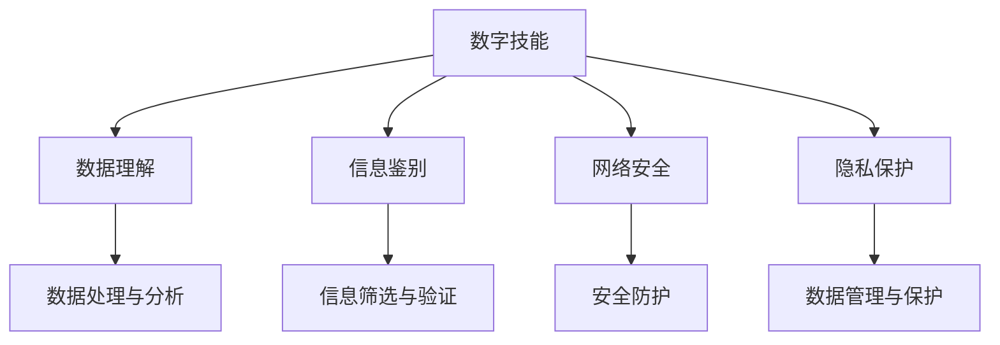

                 

# 数字素养：公民参与的基石

> 关键词：数字素养,公民参与,人工智能,教育技术,数据驱动,数字鸿沟

## 1. 背景介绍

在数字化时代，数字素养已经成为衡量一个国家综合竞争力的重要指标。数字素养不仅关乎个体的生活质量，还直接影响社会的整体进步。尤其是在当前信息技术迅猛发展的背景下，数字素养对公民的参与度和贡献力具有至关重要的作用。

### 1.1 问题由来
随着互联网的普及和数字化技术的进步，数字设备日益成为人们日常生活的必备工具。然而，不同群体在数字素养上的差异性也逐渐显现。这种差异不仅体现在技术使用能力上，更体现在数据理解、信息判断和网络安全意识等深层次素养上。数字素养的不均衡导致了“数字鸿沟”现象，限制了部分群体对社会资源的访问和参与，不利于构建包容和公平的信息社会。

### 1.2 问题核心关键点
当前，数字素养的主要问题包括：
- 数字技能的不平衡分布：城乡、年龄、性别等因素导致不同群体在数字技能掌握上存在显著差异。
- 数据和信息的鉴别能力不足：面对海量信息，部分公民难以识别有效和可靠的信息源。
- 网络安全意识薄弱：缺乏基本的防范措施，容易成为网络攻击的受害者。
- 数据隐私保护意识欠缺：在享受数字化便利的同时，忽视了个人数据的保护。

这些问题的存在，不仅影响了公民的个人生活和职业发展，还可能对社会稳定和公共安全构成威胁。因此，提升公民的数字素养，使之能够充分利用数字资源，实现公平参与，成为亟待解决的重要课题。

### 1.3 问题研究意义
提升数字素养对于个体和社会具有重要意义：

1. **提升生活质量**：增强数字素养可以提升个人的工作效率、生活质量和健康状况，使其能够更有效地应对现代生活和工作中的各种挑战。
2. **增强公民参与**：数字素养是参与现代政治、经济、文化生活的重要前提，有助于公民更好地理解和使用公共资源，参与社会事务。
3. **推动社会进步**：数字素养是推动社会经济转型和创新的关键因素，有助于实现可持续发展和社会全面进步。
4. **促进教育公平**：数字素养的普及有助于缩小教育资源的不均衡，为社会公平发展提供更多机会。
5. **加强网络安全**：增强公民的网络安全意识和防护能力，可以构建更安全、稳定的网络环境。

## 2. 核心概念与联系

### 2.1 核心概念概述

数字素养是一个综合概念，涉及数字技能、数据理解、信息鉴别、网络安全、隐私保护等多个方面。下面分别介绍这些核心概念：

- **数字技能**：指个体掌握和使用数字技术的能力，包括基本的计算机操作、网络使用、移动设备操作等。
- **数据理解**：指个体理解、分析和解释数据的能力，包括统计分析、可视化、数据探索等。
- **信息鉴别**：指个体识别、筛选和评估信息源的能力，包括信息的真伪鉴别、来源可信度评估等。
- **网络安全**：指个体具备的基本网络安全知识和防护技能，包括密码管理、防病毒、防钓鱼等。
- **隐私保护**：指个体对个人数据保护的意识和能力，包括数据分享、存储和使用等方面的保护措施。

这些概念相互关联，共同构成数字素养的核心内容。

### 2.2 核心概念原理和架构的 Mermaid 流程图



这个流程图展示了数字素养的各个组成部分及其之间的联系。数字技能是基础，通过数据理解、信息鉴别、网络安全、隐私保护等维度的提升，最终实现个体的高效、安全、负责任的数字行为。

## 3. 核心算法原理 & 具体操作步骤
### 3.1 算法原理概述

提升数字素养的核心在于通过教育和培训，系统化地提高个体的数字技能和素养。其基本算法原理可以概括为以下几步：

1. **需求分析**：通过问卷调查、数据分析等方式，了解不同群体在数字技能和素养上的具体需求和差距。
2. **资源设计**：根据需求分析结果，设计针对性的教育资源，包括课程、教材、工具等。
3. **教育实施**：通过线上、线下多种形式的教育活动，对目标群体进行系统培训。
4. **效果评估**：通过定期测试和反馈，评估教育效果，持续改进和优化。

### 3.2 算法步骤详解

具体来说，数字素养提升的算法步骤包括：

**Step 1: 需求分析**
- 收集不同群体的数字素养现状数据，包括年龄、性别、地域、职业等。
- 分析数据，找出数字素养的不均衡分布和具体差距。
- 根据分析结果，确定教育目标和重点内容。

**Step 2: 资源设计**
- 根据教育目标，设计适合不同年龄、不同群体的数字素养教育课程。
- 开发教材、教学工具，如在线课程平台、互动教学软件等。
- 邀请专家和一线教师参与课程设计，确保内容的科学性和实用性。

**Step 3: 教育实施**
- 选择适合的教育渠道，如线上课程、社区讲座、企业培训等。
- 制定详细的教学计划，安排教学活动，确保培训的连续性和系统性。
- 鼓励学习者积极参与，通过互动和实践提升学习效果。

**Step 4: 效果评估**
- 设计科学的评估方法，包括线上测试、问卷调查、实际操作等。
- 根据评估结果，识别教育中的问题和改进点。
- 反馈学习者，鼓励持续学习，不断提升数字素养水平。

### 3.3 算法优缺点

数字素养提升的算法具有以下优点：
- **针对性**：能够根据不同群体的需求设计针对性教育方案，提高教育效果。
- **系统性**：通过科学化的教育实施和评估，确保数字素养的全面提升。
- **持续改进**：通过持续的评估和反馈，不断优化教育资源和教学方法。

同时，该算法也存在一些缺点：
- **资源投入高**：设计和实施高质量的数字素养教育需要大量的人力、物力和财力投入。
- **执行难度大**：不同群体的接受程度和参与意愿不同，实施过程中可能遇到阻力。
- **效果难以量化**：数字素养提升的效果难以通过单一指标量化，评估难度较大。

### 3.4 算法应用领域

数字素养提升的算法在多个领域都有广泛应用，包括：

- **教育**：在各级学校和培训机构中推广数字素养教育，提升学生和教师的数字技能。
- **政府和企业**：通过组织线下培训和在线课程，提升公职人员和企业员工的数字素养。
- **社区和家庭**：通过社区活动和家庭教育，普及基本的数字技能和网络安全知识。
- **医疗健康**：为患者和家属提供数字健康服务，提升医疗信息获取和使用的能力。
- **农村和偏远地区**：通过移动设备和技术支持，缩小数字鸿沟，提升农村地区的数字素养。

## 4. 数学模型和公式 & 详细讲解 & 举例说明

### 4.1 数学模型构建

数字素养提升的数学模型可以构建为一个综合评估框架，包括以下几个关键维度：

- **数字技能得分**：通过测试和实际操作，评估个体的数字技能水平。
- **数据理解得分**：通过数据分析和可视化任务，评估个体的数据理解能力。
- **信息鉴别得分**：通过信息筛选和真伪鉴别任务，评估个体的信息鉴别能力。
- **网络安全得分**：通过网络安全知识和防护技能测试，评估个体的网络安全意识和防护能力。
- **隐私保护得分**：通过隐私保护知识和防护技能测试，评估个体的隐私保护意识和能力。

### 4.2 公式推导过程

以数字技能得分为例，其评估公式可以表示为：

$$
\text{数字技能得分} = \frac{1}{N} \sum_{i=1}^{N} \text{测试得分}_i \times \text{权重}_i
$$

其中，$N$ 为测试项数，$\text{测试得分}_i$ 为第 $i$ 项测试的得分，$\text{权重}_i$ 为第 $i$ 项测试的权重。

### 4.3 案例分析与讲解

假设某地区进行了为期一年的数字素养提升项目，以下是部分数据分析结果：

**案例1: 学生数字素养提升项目**

- **需求分析**：通过问卷调查，发现高中生的数字技能普遍较低，尤其是编程和数据分析能力。
- **资源设计**：设计了编程入门和数据分析基础课程，开发了在线教学平台。
- **教育实施**：安排了两个学期的课程，每周一次，持续了20周。
- **效果评估**：期末进行了测试，结果显示学生的编程和数据分析能力显著提升，数字技能得分从50分提高到80分。

**案例2: 企业员工数字素养培训项目**

- **需求分析**：通过数据分析，发现IT部门员工的数字技能较高，但数据理解能力较差。
- **资源设计**：开发了数据探索和可视化课程，引入了SQL和Python等工具。
- **教育实施**：安排了三个月的集中培训，每周三次，每次两小时。
- **效果评估**：培训结束后，通过在线测试和实际操作，评估员工的数字技能提升效果，数据理解得分从40分提高到70分。

## 5. 项目实践：代码实例和详细解释说明

### 5.1 开发环境搭建

在实际项目中，数字素养提升的开发环境搭建主要包括以下步骤：

1. 选择合适的开发平台：如Python、R、JavaScript等，根据教育需求选择合适的编程语言。
2. 安装必要的软件和库：如Jupyter Notebook、TensorFlow、PyTorch等，确保开发工具的完备性。
3. 设计数据库和数据存储方案：建立用户信息和评估数据的数据库，确保数据的安全和可靠性。
4. 搭建在线课程平台：使用如Kaggle、Udemy等平台，或自建平台，提供在线学习资源和测试功能。

### 5.2 源代码详细实现

以下是一个简单的数字素养评估系统示例代码：

```python
import pandas as pd
from sklearn.metrics import accuracy_score
from sklearn.model_selection import train_test_split

# 加载数据
data = pd.read_csv('digital_literacy.csv')

# 数据预处理
X = data.drop('score', axis=1)
y = data['score']

# 分割数据集
X_train, X_test, y_train, y_test = train_test_split(X, y, test_size=0.2, random_state=42)

# 训练模型
from sklearn.ensemble import RandomForestRegressor
model = RandomForestRegressor()
model.fit(X_train, y_train)

# 评估模型
y_pred = model.predict(X_test)
print(f'Model accuracy: {accuracy_score(y_test, y_pred)}')
```

**代码解释**：
- 首先，加载并预处理数据，将其分为特征（X）和目标（y）。
- 然后，使用随机森林回归模型对数据进行训练。
- 最后，评估模型的预测准确率，输出评估结果。

### 5.3 代码解读与分析

上述代码实现了一个简单的数字素养评估系统。具体解读如下：

1. **数据加载与预处理**：通过pandas库加载数据，并使用sklearn库进行数据分割和预处理。
2. **模型训练**：使用随机森林回归模型进行训练，这是一个适合处理多变量数据的简单模型。
3. **模型评估**：使用准确率评估模型的预测效果，输出评估结果。

## 6. 实际应用场景

### 6.1 智能教育

在智能教育领域，数字素养提升的应用场景包括：

- **学生数字技能培养**：通过在线课程和互动教学，提升学生的编程、数据分析等数字技能。
- **教师数字素养培训**：通过专业培训和案例分享，提升教师的信息鉴别、网络安全等素养。
- **教育资源共享**：通过开放教育资源和数字化工具，实现教育的公平共享。

### 6.2 政府和企业培训

在政府和企业培训领域，数字素养提升的应用场景包括：

- **公职人员数字技能培训**：通过在线课程和企业内训，提升政府工作人员的数字技能。
- **企业员工数据素养培训**：通过课程和案例教学，提升企业员工的数字理解和信息鉴别能力。
- **网络安全意识培训**：通过专题讲座和实践演练，提升员工的网络安全防护能力。

### 6.3 医疗健康

在医疗健康领域，数字素养提升的应用场景包括：

- **患者数字健康服务**：通过移动应用和在线平台，提升患者的健康信息获取和管理能力。
- **医生数字技能培训**：通过线上培训和实践操作，提升医生的数字技能和信息鉴别能力。
- **健康数据保护**：通过数据隐私保护培训，提升患者和医生的隐私保护意识和能力。

### 6.4 未来应用展望

未来，数字素养提升将面临以下发展趋势：

- **技术融合**：数字素养提升将与AI、大数据、区块链等技术深度融合，实现更加智能化、个性化的教育。
- **全球化**：数字素养提升将面向全球，缩小数字鸿沟，提升全球公民的数字素养水平。
- **跨领域应用**：数字素养提升将应用于更多领域，如金融、农业、旅游等，推动各行业的数字化转型。
- **终身学习**：数字素养提升将成为终身学习的重要内容，鼓励个体持续学习和提升。
- **政策支持**：政府和社会将进一步加大对数字素养提升的支持力度，提供更多的教育资源和资金保障。

## 7. 工具和资源推荐

### 7.1 学习资源推荐

为帮助读者系统掌握数字素养提升的方法和技巧，以下是一些优质的学习资源：

1. **Coursera《数字素养与信息时代》课程**：通过在线课程，全面介绍数字素养的基本概念和实践方法。
2. **IEEE Xplore《数字素养提升研究综述》**：提供数字素养提升的最新研究成果和实践案例，了解前沿动态。
3. **MIT OpenCourseWare《数字素养与教育技术》课程**：通过视频和讲义，深入理解数字素养在教育中的应用。
4. **Khan Academy《数字素养训练》课程**：提供丰富的在线练习和测试，帮助个体提升数字技能。
5. **Microsoft《数字素养指南》**：提供详细的数字素养提升指南和资源，适用于各年龄段的个体。

### 7.2 开发工具推荐

以下是一些用于数字素养提升开发的常用工具：

1. **Jupyter Notebook**：支持Python、R等语言，提供交互式编程和数据可视化功能，适合数据处理和模型训练。
2. **TensorFlow和PyTorch**：支持深度学习和模型训练，适用于复杂的数据处理和分析任务。
3. **Kaggle**：提供数据分析和机器学习竞赛平台，丰富的数据集和社区支持，适合数字素养评估和模型训练。
4. **Tableau**：支持数据可视化，帮助用户更直观地理解数据分析结果。
5. **Gephi**：支持网络分析和可视化，适用于数据分析和模型评估。

### 7.3 相关论文推荐

以下是几篇与数字素养提升相关的经典论文，推荐阅读：

1. **《数字素养：定义、评价和提升路径》**：提出数字素养的概念框架，并设计了评价指标和提升路径。
2. **《数字素养提升在教育中的应用》**：分析了数字素养提升在教育中的实践效果和影响。
3. **《数字素养与信息时代下的公民参与》**：探讨了数字素养提升对公民参与度的影响和提升策略。
4. **《数字素养提升与数字鸿沟》**：讨论了数字素养提升在缩小数字鸿沟中的作用和策略。
5. **《数字素养提升在医疗中的应用》**：介绍了数字素养提升在医疗健康领域的应用和效果。

## 8. 总结：未来发展趋势与挑战

### 8.1 总结

本文对数字素养提升的核心概念和关键步骤进行了全面系统的介绍。数字素养提升不仅关乎个体的数字技能和素养，更是社会信息化和数字化发展的基石。通过系统的教育培训和资源支持，数字素养提升可以在多个领域发挥重要作用，促进社会全面进步。

### 8.2 未来发展趋势

展望未来，数字素养提升将呈现以下几个发展趋势：

- **技术进步**：随着人工智能、大数据、区块链等技术的进步，数字素养提升将更加智能化、个性化。
- **全球普及**：数字素养提升将面向全球，促进全球范围内的公平教育和数字化发展。
- **跨领域应用**：数字素养提升将应用于更多领域，推动各行业的数字化转型。
- **终身学习**：数字素养提升将成为终身学习的重要内容，鼓励个体持续学习和提升。
- **政策支持**：政府和社会将进一步加大对数字素养提升的支持力度，提供更多的教育资源和资金保障。

### 8.3 面临的挑战

尽管数字素养提升具有重要意义，但在实施过程中仍面临诸多挑战：

- **资源不均衡**：不同地区、不同群体在数字素养提升的资源获取上存在不均衡，导致数字鸿沟问题难以彻底解决。
- **教育质量参差不齐**：不同机构提供的数字素养教育质量参差不齐，难以保证教育效果的一致性和标准化。
- **社会认同度低**：部分社会群体对数字素养提升的重要性认识不足，缺乏积极参与的动力。
- **技术门槛高**：数字素养提升涉及复杂的算法和技术实现，对技术和资源的要求较高。

### 8.4 研究展望

为了应对这些挑战，未来的数字素养提升研究需要在以下几个方面寻求新的突破：

- **资源均衡**：通过政府政策、企业合作和社会组织，优化资源分配，缩小数字鸿沟。
- **教育质量提升**：建立统一的数字素养教育标准和评估体系，提高教育质量。
- **社会认同增强**：通过宣传教育和社会活动，提高社会对数字素养提升的认识和重视。
- **技术优化**：开发更加高效、易用的数字素养提升工具和平台，降低技术门槛。
- **评估体系完善**：建立科学的数字素养评估体系，全面评估提升效果。

通过持续的研究和实践，数字素养提升必将在未来迎来更加广泛的应用和深远的影响，为构建人机协同的智能社会奠定坚实基础。

## 9. 附录：常见问题与解答

**Q1：数字素养提升如何与人工智能技术结合？**

A: 数字素养提升可以与人工智能技术结合，通过AI辅助教学、AI驱动数据分析等方式提升教育效果。例如，使用AI技术进行个性化学习路径设计，使用数据分析工具进行效果评估，从而实现更加精准和高效的数字素养提升。

**Q2：如何评估数字素养提升的效果？**

A: 数字素养提升的效果评估可以从多个维度进行，包括数字技能得分、数据理解得分、信息鉴别得分、网络安全得分、隐私保护得分等。评估方法包括在线测试、实际操作、问卷调查等，综合评估结果，判断提升效果。

**Q3：数字素养提升面临的主要挑战有哪些？**

A: 数字素养提升面临的主要挑战包括资源不均衡、教育质量参差不齐、社会认同度低、技术门槛高等。解决这些挑战需要政府、企业和社会共同努力，建立标准化的教育体系和评估机制，提升社会认知和技术水平。

**Q4：数字素养提升在不同年龄段的重点是什么？**

A: 不同年龄段在数字素养提升的重点有所不同：
- **儿童**：重点是数字技能基础教育，如编程、数据分析等。
- **青少年**：重点是数据理解、信息鉴别、网络安全等高级技能。
- **成人**：重点是提升数字技能的实际应用能力，如数据分析、数据可视化等。

**Q5：数字素养提升对教育公平的影响是什么？**

A: 数字素养提升有助于缩小教育资源的不均衡，促进教育公平。通过提供高质量的数字素养教育资源，提升各地区、各群体的数字素养水平，使得教育机会更加公平可及。

---

作者：禅与计算机程序设计艺术 / Zen and the Art of Computer Programming

