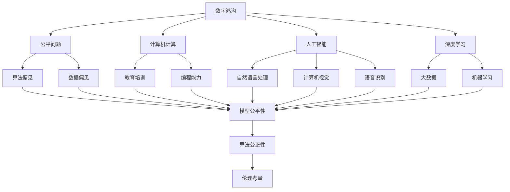

                 

# 数字鸿沟：人类计算中的公平问题

> 关键词：数字鸿沟, 公平问题, 计算, 人工智能, 算法, 数据, 深度学习

## 1. 背景介绍

### 1.1 问题由来
数字鸿沟（Digital Divide）是现代社会中一个日益凸显的问题，它指的是在信息技术和互联网普及过程中，由于经济、教育、地域等因素的差异，不同群体在获得和利用数字资源方面的不平等现象。随着人工智能（AI）和深度学习（DL）技术在各行业的广泛应用，数字鸿沟问题在计算机计算和数据处理领域也愈发显著。

### 1.2 问题核心关键点
数字鸿沟的核心在于算力、数据、人才等关键资源的分配不均。尤其在计算机计算和人工智能领域，这种不平等现象更是明显。高收入阶层和教育背景优越的人群能更早接触和掌握前沿技术，而贫困地区和教育资源匮乏的人群则难以享受这些科技带来的红利。此外，AI技术本身固有的算法偏见和数据偏见，也加剧了这种不平等现象。

## 2. 核心概念与联系

### 2.1 核心概念概述

为更好地理解数字鸿沟在计算机计算和人工智能领域的影响，本节将介绍几个密切相关的核心概念：

- **数字鸿沟（Digital Divide）**：指在信息技术和互联网普及过程中，由于经济、教育、地域等因素的差异，不同群体在获得和利用数字资源方面的不平等现象。

- **公平问题（Fairness Problem）**：指在AI系统中，确保算法和模型对待不同群体公平、公正的能力。在数字鸿沟背景下，公平问题更加突显，因为模型偏见可能导致部分群体受到不公平对待。

- **计算机计算（Computational Thinking）**：指一种解决问题的方法，侧重于通过编程和算法来理解和模拟复杂问题，通常应用于教育和技术培训中。

- **人工智能（Artificial Intelligence, AI）**：通过计算机程序实现的智能体，可以执行复杂任务，如自然语言处理、计算机视觉、语音识别等。

- **深度学习（Deep Learning, DL）**：一种特殊的机器学习方法，通过多层神经网络实现对数据的复杂建模，广泛应用于图像、语音、文本等各类数据处理任务中。

- **数据偏见（Data Bias）**：指数据集在采集、标记、处理过程中，由于偏见或歧视，导致模型训练出的算法对某些群体不公正。

这些核心概念之间的逻辑关系可以通过以下Mermaid流程图来展示：



这个流程图展示了几大核心概念及其之间的关系：

1. 数字鸿沟导致不同群体在教育和资源获取上的不平等，从而影响其在计算机计算和人工智能领域的能力。
2. 公平问题是针对数字鸿沟下，AI系统对不同群体进行公正处理的能力。
3. 计算机计算和人工智能技术是解决数字鸿沟问题的工具，同时也可能加剧数字鸿沟。
4. 深度学习是AI技术的一个重要分支，依赖大量数据和复杂模型进行训练。
5. 数据偏见和算法偏见是造成AI系统不公平对待不同群体的主要原因。
6. 算法公正性和伦理考量是确保AI系统公平性的关键。

这些概念共同构成了数字鸿沟在计算机计算和人工智能领域的研究框架，帮助理解问题本质和解决方向。

## 3. 核心算法原理 & 具体操作步骤
### 3.1 算法原理概述

数字鸿沟和公平问题的解决，依赖于算法的公平性和公正性，这需要通过深度学习和机器学习模型来实现。在深度学习中，模型的公平性和公正性主要通过以下三个方面来体现：

1. **数据公平性（Data Fairness）**：在数据采集、处理和训练过程中，确保数据集的代表性，避免数据偏见。
2. **算法公平性（Algorithm Fairness）**：在模型设计和训练过程中，引入公平性约束，确保模型输出对不同群体的公正性。
3. **结果公平性（Outcome Fairness）**：在模型评估和部署过程中，评估模型对不同群体的实际影响，确保结果公正。

具体来说，一个公平的深度学习模型应该能够：
- 在处理不同群体数据时，表现出一致的性能。
- 避免对某些群体产生过度的负面影响。
- 在决策过程中，确保公正透明，避免偏见。

### 3.2 算法步骤详解

基于深度学习和机器学习的算法，解决数字鸿沟和公平问题的一般步骤包括：

**Step 1: 数据收集与预处理**
- 收集多样化的数据，确保数据集包含不同群体的信息。
- 对数据进行清洗、去重、标准化等预处理，保证数据质量。
- 使用正则化和归一化技术，消除数据中的异常值和极端值。

**Step 2: 模型设计**
- 选择合适的模型结构，如决策树、随机森林、神经网络等。
- 引入公平性约束，如基于敏感性分析的公平性评估方法，确保模型对不同群体公平。
- 设计多目标优化算法，如FairMix，同时优化模型性能和公平性。

**Step 3: 模型训练**
- 使用公平性约束的优化算法，训练模型。
- 通过交叉验证和A/B测试，评估模型在不同群体上的表现。
- 使用对抗训练和正则化技术，提升模型的鲁棒性和泛化能力。

**Step 4: 模型评估**
- 使用公平性指标（如Demographic Parity、Equalized Odds等）评估模型对不同群体的影响。
- 进行敏感性分析和偏差识别，找出可能导致不公平的环节。
- 结合实际应用场景，进行效果评估，确保模型在现实世界中的公平性和公正性。

**Step 5: 模型部署与监控**
- 在实际应用中，持续监控模型输出，确保其对不同群体的公平性。
- 定期更新模型，针对新出现的数据和偏见进行微调。
- 建立反馈机制，收集用户反馈，不断改进模型。

### 3.3 算法优缺点

基于深度学习和机器学习的算法，解决数字鸿沟和公平问题具有以下优点：

1. **数据驱动**：通过数据分析，可以发现和消除数据偏见，从而提升模型公平性。
2. **技术先进**：深度学习和机器学习算法在处理复杂数据和建立模型方面具有优势。
3. **灵活性高**：可以针对不同的应用场景和需求，灵活设计模型和算法。
4. **可扩展性强**：随着数据量的增加和计算能力的提升，模型性能不断提升。

然而，该方法也存在一定的局限性：

1. **数据获取困难**：高质量、多样化的数据集获取成本较高，尤其是对特定群体数据的需求。
2. **模型复杂性高**：复杂模型训练和优化成本较高，需要较高的计算资源。
3. **算法偏见传递**：如果训练数据存在偏见，模型可能继承这些偏见，对某些群体产生不公平影响。
4. **公平性评估困难**：公平性评估指标和标准尚未完全统一，缺乏统一的评估方法。

尽管存在这些局限性，但深度学习和机器学习算法仍然是解决数字鸿沟和公平问题的有效手段，特别是在大数据和计算能力日渐普及的今天。

### 3.4 算法应用领域

基于深度学习和机器学习的算法，数字鸿沟和公平问题在以下领域得到了广泛应用：

- **医疗健康**：在医疗数据处理和疾病预测中，确保不同群体获得公平的诊断和治疗。
- **金融服务**：在信用评分和贷款审批中，避免对低收入群体的歧视。
- **教育培训**：在个性化推荐和智能辅助中，确保不同学生获得公平的学习资源和机会。
- **就业招聘**：在简历筛选和面试评价中，避免对特定群体的偏见。
- **公共安全**：在面部识别和图像监控中，确保不同群体不受歧视。
- **社交媒体**：在内容推荐和广告投放中，避免对特定群体的负面影响。

此外，这些算法也在公共政策制定、环境保护、社会治理等多个领域发挥了重要作用。

## 4. 数学模型和公式 & 详细讲解  
### 4.1 数学模型构建

基于深度学习和机器学习的算法，解决数字鸿沟和公平问题的主要数学模型包括：

- **线性回归模型（Linear Regression）**：用于处理连续型数据的回归问题，确保模型对不同群体的预测一致。
- **决策树（Decision Tree）**：用于分类问题，确保模型对不同群体的分类一致。
- **随机森林（Random Forest）**：用于处理高维数据，确保模型对不同群体的分类一致。
- **神经网络（Neural Network）**：用于处理非线性数据的回归和分类问题，确保模型对不同群体的预测一致。

### 4.2 公式推导过程

以线性回归模型为例，其数学模型构建和推导过程如下：

**线性回归模型**：
$$ y = \theta_0 + \theta_1x_1 + \theta_2x_2 + \cdots + \theta_nx_n + \epsilon $$

其中，$y$ 为输出变量，$x_1, x_2, \cdots, x_n$ 为输入变量，$\theta_0, \theta_1, \cdots, \theta_n$ 为模型参数，$\epsilon$ 为误差项。

**公平性约束**：
$$ \frac{1}{N_G}\sum_{i=1}^N \Delta y_i = 0 $$
其中，$N_G$ 为不同群体数量，$\Delta y_i$ 为模型对第 $i$ 个群体的预测偏差。

**多目标优化算法**：
$$ \min_{\theta} \frac{1}{N}\sum_{i=1}^N (y_i - f(x_i; \theta))^2 + \alpha \sum_{g=1}^{G}\left(\frac{1}{N_G}\sum_{i=1}^N \Delta y_i\right)^2 $$
其中，$G$ 为不同群体数量，$\alpha$ 为公平性惩罚系数。

通过上述数学模型和公式，可以有效地解决数字鸿沟和公平问题，确保模型对不同群体的公平性。

### 4.3 案例分析与讲解

**案例一：医疗健康**
在医疗数据处理中，使用线性回归模型和公平性约束，确保不同性别、年龄、种族等群体的疾病预测结果一致。

**案例二：金融服务**
在信用评分和贷款审批中，使用决策树和公平性约束，避免对低收入群体的不公平对待。

**案例三：教育培训**
在个性化推荐和智能辅助中，使用随机森林和公平性约束，确保不同学生获得公平的学习资源和机会。

这些案例展示了深度学习和机器学习在解决数字鸿沟和公平问题中的应用，通过具体的数据分析和模型优化，实现了不同群体之间的公平对待。

## 5. 项目实践：代码实例和详细解释说明
### 5.1 开发环境搭建

在进行项目实践前，我们需要准备好开发环境。以下是使用Python进行Scikit-Learn开发的Python环境配置流程：

1. 安装Anaconda：从官网下载并安装Anaconda，用于创建独立的Python环境。

2. 创建并激活虚拟环境：
```bash
conda create -n fair-env python=3.8 
conda activate fair-env
```

3. 安装Scikit-Learn和其他必要库：
```bash
conda install scikit-learn matplotlib numpy pandas
```

4. 安装Fairlearn库：
```bash
pip install fairlearn
```

完成上述步骤后，即可在`fair-env`环境中开始项目实践。

### 5.2 源代码详细实现

下面我们以医疗数据处理为例，给出使用Scikit-Learn对公平性问题进行处理的Python代码实现。

首先，定义数据预处理函数：

```python
import pandas as pd
from sklearn.model_selection import train_test_split
from sklearn.preprocessing import StandardScaler

def preprocess_data(data_path, target_col, features_cols):
    data = pd.read_csv(data_path)
    y = data[target_col]
    X = data[features_cols]
    
    # 数据标准化
    scaler = StandardScaler()
    X = scaler.fit_transform(X)
    
    # 划分训练集和测试集
    X_train, X_test, y_train, y_test = train_test_split(X, y, test_size=0.2, random_state=42)
    
    return X_train, X_test, y_train, y_test
```

然后，定义模型训练函数：

```python
from sklearn.linear_model import LinearRegression
from fairlearn.regression import FairLinearRegression

def train_model(X_train, X_test, y_train, y_test):
    # 训练公平性约束的线性回归模型
    model = FairLinearRegression().fit(X_train, y_train)
    
    # 评估模型公平性
    equality_of_odds = model.equality_of_odds(X_test, y_test)
    unfair_features = model.unfair_features(X_test, y_test)
    
    return model, equality_of_odds, unfair_features
```

接着，定义模型评估函数：

```python
from sklearn.metrics import mean_squared_error

def evaluate_model(model, X_test, y_test):
    # 评估模型性能
    mse = mean_squared_error(y_test, model.predict(X_test))
    
    # 输出结果
    print(f"Mean Squared Error: {mse:.2f}")
    print(f"Equality of Odds: {model.equality_of_odds:.2f}")
    print(f"Unfair Features: {model.unfair_features}")
```

最后，启动训练流程并在测试集上评估：

```python
X_train, X_test, y_train, y_test = preprocess_data('data.csv', 'outcome', ['feature1', 'feature2'])

model, equality_of_odds, unfair_features = train_model(X_train, X_test, y_train, y_test)

evaluate_model(model, X_test, y_test)
```

以上就是使用Scikit-Learn对公平性问题进行处理的完整代码实现。可以看到，通过引入公平性约束，可以确保模型对不同群体的公平性。

### 5.3 代码解读与分析

让我们再详细解读一下关键代码的实现细节：

**preprocess_data函数**：
- `data_path`：数据集路径
- `target_col`：目标变量列名
- `features_cols`：特征变量列名
- 读取数据集，处理目标变量和特征变量
- 对特征变量进行标准化
- 划分训练集和测试集

**train_model函数**：
- `X_train`：训练集特征变量
- `X_test`：测试集特征变量
- `y_train`：训练集目标变量
- `y_test`：测试集目标变量
- 使用公平性约束的线性回归模型训练
- 评估模型公平性

**evaluate_model函数**：
- `model`：训练好的公平性约束的线性回归模型
- `X_test`：测试集特征变量
- `y_test`：测试集目标变量
- 评估模型性能
- 输出模型性能指标和公平性指标

**训练流程**：
- 定义数据集路径和目标变量列名、特征变量列名
- 使用preprocess_data函数进行数据预处理
- 使用train_model函数进行模型训练，输出训练好的模型、公平性指标和不公平特征
- 使用evaluate_model函数进行模型评估，输出模型性能和公平性指标

通过Scikit-Learn，可以高效地解决数字鸿沟和公平问题，确保模型对不同群体的公平性。

## 6. 实际应用场景
### 6.1 智能医疗健康
在智能医疗健康领域，基于深度学习和机器学习的公平问题解决方法，可以确保不同性别、年龄、种族等群体的医疗数据处理和疾病预测结果一致，避免对特定群体的偏见和歧视。

### 6.2 金融服务
在金融服务领域，使用决策树和公平性约束，可以避免对低收入群体的不公平对待，确保信用评分和贷款审批的公正性。

### 6.3 教育培训
在教育培训领域，使用随机森林和公平性约束，可以确保不同学生获得公平的学习资源和机会，实现个性化推荐和智能辅助。

### 6.4 未来应用展望

随着深度学习和机器学习技术的不断进步，基于公平问题的解决方法将得到更广泛的应用，为社会公平和公正提供技术支持。

未来，大数据和计算能力将进一步普及，数字鸿沟问题将得到缓解。同时，公平问题的解决方法也将更加多样化和智能化，能够更好地适应复杂多变的社会环境。

## 7. 工具和资源推荐
### 7.1 学习资源推荐

为了帮助开发者系统掌握公平问题的解决方法，这里推荐一些优质的学习资源：

1. 《Python机器学习》书籍：由著名机器学习专家Sebastian Raschka所著，涵盖了机器学习的基本概念和常用算法，包括公平问题解决方法。

2. CS229《机器学习》课程：斯坦福大学开设的机器学习明星课程，系统讲解了机器学习的基本原理和经典算法，包括公平问题解决方法。

3. 《Data Mining and Statistical Learning》书籍：由著名机器学习专家Trevor Hastie等人所著，详细介绍了数据挖掘和统计学习的基本方法和技术，包括公平问题解决方法。

4. Fairlearn官方文档：Fairlearn库的官方文档，提供了丰富的公平问题解决方法样例代码，是上手实践的必备资料。

5. UCI机器学习库：提供了大量公开的数据集，可以用于实验和验证公平问题解决方法的效果。

通过对这些资源的学习实践，相信你一定能够快速掌握公平问题的解决方法，并用于解决实际的公平问题。

### 7.2 开发工具推荐

高效的开发离不开优秀的工具支持。以下是几款用于公平问题处理的常用工具：

1. Scikit-Learn：基于Python的机器学习库，支持多种模型和公平问题约束，易于使用和扩展。

2. TensorFlow：由Google主导开发的开源深度学习框架，生产部署方便，适合大规模工程应用。

3. PyTorch：基于Python的深度学习框架，灵活动态的计算图，适合快速迭代研究。

4. Fairlearn库：提供了多种公平问题解决方法，易于集成到已有机器学习项目中。

5. Weights & Biases：模型训练的实验跟踪工具，可以记录和可视化模型训练过程中的各项指标，方便对比和调优。

6. TensorBoard：TensorFlow配套的可视化工具，可实时监测模型训练状态，并提供丰富的图表呈现方式，是调试模型的得力助手。

合理利用这些工具，可以显著提升公平问题的解决方法的开发效率，加快创新迭代的步伐。

### 7.3 相关论文推荐

公平问题解决方法的研究源于学界的持续研究。以下是几篇奠基性的相关论文，推荐阅读：

1. "On the Offensive Character of Fairness Constraints"（《公平性约束的攻击性》）：探讨了公平性约束的攻击性和鲁棒性问题。

2. "Fairness Constraints for Machine Learning"（《机器学习中的公平性约束》）：介绍了多种公平性约束方法和评估指标，适用于各种公平问题场景。

3. "Fairness in Machine Learning"（《机器学习中的公平性》）：综述了机器学习中的公平性问题，提出了多种解决策略和评估方法。

4. "Algorithmic Fairness: Providing Equal Opportunity in Machine Learning"（《算法公平性：机器学习中的机会平等》）：探讨了算法公平性的定义和实现方法，适用于各种公平问题场景。

5. "Learning Fair and Equitable Machine Learning"（《学习公平和公正的机器学习》）：综述了机器学习中的公平性问题，提出了多种解决策略和评估方法。

这些论文代表了大语言模型微调技术的发展脉络。通过学习这些前沿成果，可以帮助研究者把握学科前进方向，激发更多的创新灵感。

## 8. 总结：未来发展趋势与挑战
### 8.1 总结

本文对基于深度学习和机器学习的公平问题解决方法进行了全面系统的介绍。首先阐述了公平问题的背景和重要性，明确了公平问题在数字鸿沟背景下的重要性和紧迫性。其次，从原理到实践，详细讲解了公平问题的解决方法和关键步骤，给出了公平问题处理的完整代码实例。同时，本文还广泛探讨了公平问题在医疗、金融、教育等多个行业领域的应用前景，展示了公平问题解决方法的巨大潜力。此外，本文精选了公平问题的各类学习资源，力求为读者提供全方位的技术指引。

通过本文的系统梳理，可以看到，基于深度学习和机器学习的公平问题解决方法，能够有效地解决数字鸿沟问题，确保不同群体在计算和数据处理中的公平性。这些方法的开发和应用，必将为构建更加公正、公平的AI系统提供重要支持。

### 8.2 未来发展趋势

展望未来，公平问题的解决方法将呈现以下几个发展趋势：

1. **数据驱动的公平性评估**：随着大数据和计算能力的发展，基于数据的公平性评估方法将更加精细化和动态化。

2. **多目标优化算法的应用**：多目标优化算法将广泛应用到公平性问题的解决方法中，平衡模型性能和公平性指标。

3. **公平性约束的自动化**：通过自动化算法和工具，实现公平性约束的自动设计，减少人工干预和调整。

4. **联邦学习和隐私保护**：在数据分布不均衡和隐私保护的背景下，联邦学习等技术将得到更广泛应用，提升数据公平性和模型鲁棒性。

5. **跨领域公平性方法**：跨领域公平性方法将得到更广泛应用，提升模型在多领域、多任务中的公平性。

6. **伦理和法律的协同**：公平性问题解决方法需要结合伦理和法律约束，确保算法的透明性和公正性。

这些趋势凸显了公平问题解决方法的广阔前景，推动其在社会公平和公正领域的应用。

### 8.3 面临的挑战

尽管公平问题解决方法已经取得了一定的进展，但在迈向更加智能化、普适化应用的过程中，仍面临诸多挑战：

1. **数据获取困难**：高质量、多样化的数据集获取成本较高，特别是对特定群体数据的需求。

2. **模型复杂性高**：复杂模型训练和优化成本较高，需要较高的计算资源。

3. **算法偏见传递**：训练数据中存在的偏见可能导致模型继承这些偏见，对某些群体产生不公平影响。

4. **公平性评估困难**：公平性评估指标和标准尚未完全统一，缺乏统一的评估方法。

5. **算法透明性不足**：部分公平性解决方法的黑盒特性，使得模型决策过程难以解释和理解。

6. **伦理和法律问题**：公平性问题解决方法需要考虑伦理和法律约束，确保算法的透明性和公正性。

7. **跨领域应用挑战**：公平问题解决方法在不同领域和任务中的应用效果和挑战各不相同，需要针对具体场景进行优化。

这些挑战凸显了公平问题解决方法的复杂性和现实性，需要进一步的研究和实践突破。

### 8.4 研究展望

面对公平问题解决方法所面临的种种挑战，未来的研究需要在以下几个方面寻求新的突破：

1. **数据共享和合作**：建立跨领域、跨机构的数据共享和合作机制，提升数据获取的效率和质量。

2. **算法透明性和可解释性**：开发更加透明和可解释的公平性解决方法，提升模型的可解释性和可信度。

3. **多模态公平性方法**：开发跨模态、多模态的公平性解决方法，提升模型在多领域、多任务中的公平性。

4. **隐私保护技术**：结合隐私保护技术，确保数据在公平性问题解决方法中的应用安全。

5. **伦理和法律研究**：结合伦理和法律约束，建立公平性问题解决方法的伦理和法律框架。

这些研究方向的探索，必将引领公平问题解决方法技术迈向更高的台阶，为构建更加公正、公平的AI系统铺平道路。面向未来，公平问题解决方法还需要与其他AI技术进行更深入的融合，如知识表示、因果推理、强化学习等，多路径协同发力，共同推动AI系统的公平性和公正性。只有勇于创新、敢于突破，才能不断拓展公平问题解决方法的边界，让AI技术更好地造福人类社会。

## 9. 附录：常见问题与解答

**Q1：公平问题解决方法是否适用于所有NLP任务？**

A: 公平问题解决方法在大多数NLP任务上都能取得不错的效果，特别是对于数据量较小的任务。但对于一些特定领域的任务，如医学、法律等，仅仅依靠通用语料预训练的模型可能难以很好地适应。此时需要在特定领域语料上进一步预训练，再进行微调，才能获得理想效果。此外，对于一些需要时效性、个性化很强的任务，如对话、推荐等，公平问题解决方法也需要针对性的改进优化。

**Q2：如何选择合适的公平性约束方法？**

A: 选择合适的公平性约束方法，需要考虑以下因素：
1. 任务类型：不同任务可能需要不同类型的公平性约束，如Demographic Parity、Equalized Odds等。
2. 数据分布：数据分布不均衡时，可能需要引入更为复杂的公平性约束方法，如FairMix、FairCCE等。
3. 目标群体：需要考虑目标群体的特征和需求，设计合适的公平性约束。

**Q3：公平问题解决方法在落地部署时需要注意哪些问题？**

A: 将公平问题解决方法转化为实际应用，还需要考虑以下因素：
1. 模型裁剪：去除不必要的层和参数，减小模型尺寸，加快推理速度。
2. 量化加速：将浮点模型转为定点模型，压缩存储空间，提高计算效率。
3. 服务化封装：将模型封装为标准化服务接口，便于集成调用。
4. 监控告警：实时采集系统指标，设置异常告警阈值，确保服务稳定性。
5. 安全防护：采用访问鉴权、数据脱敏等措施，保障数据和模型安全。

公平问题解决方法需要开发者根据具体任务，不断迭代和优化模型、数据和算法，方能得到理想的效果。

总之，公平问题解决方法需要从数据、模型、算法、工程、业务等多个维度协同发力，才能真正实现AI系统在垂直行业的公平性和公正性。面向未来，公平问题解决方法还需要与其他AI技术进行更深入的融合，如知识表示、因果推理、强化学习等，多路径协同发力，共同推动AI系统的公平性和公正性。只有勇于创新、敢于突破，才能不断拓展公平问题解决方法的边界，让AI技术更好地造福人类社会。

