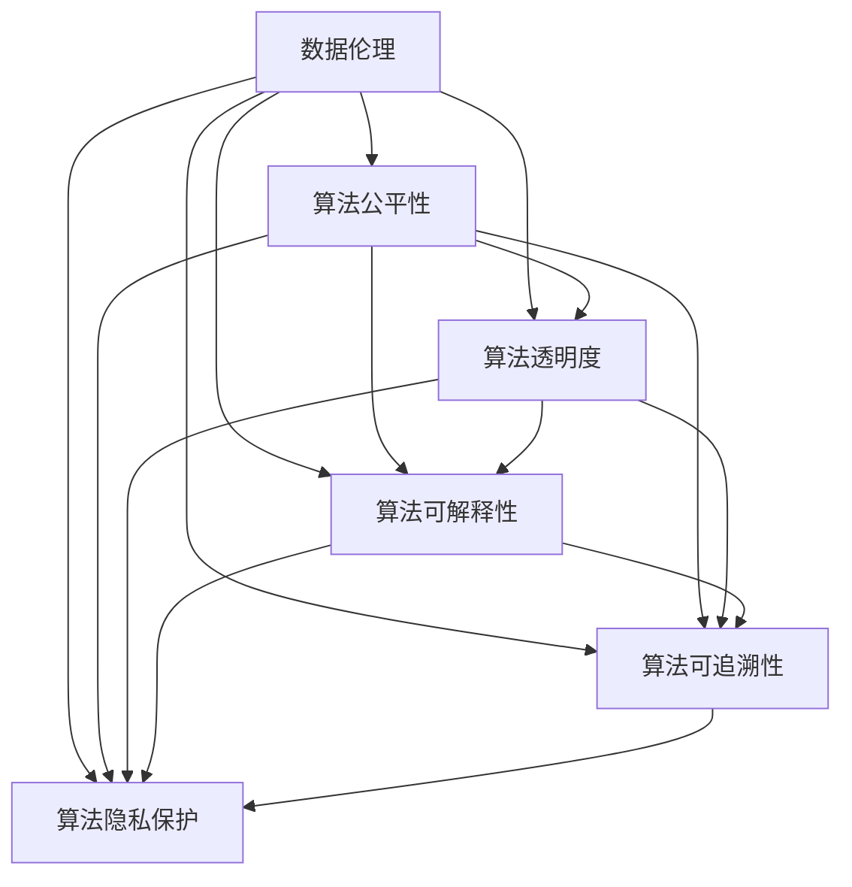

                 

# 数据伦理：算法治理与规范

> 关键词：数据伦理, 算法治理, 隐私保护, 透明度, 可解释性, 公平性, 可追溯性

## 1. 背景介绍

### 1.1 问题由来

在当今数字化时代，数据驱动的算法和模型无处不在，从个性化推荐到医疗诊断，从金融风险评估到自动驾驶，算法在各个领域都发挥着至关重要的作用。然而，伴随着算法的普及，数据伦理和算法治理问题也逐渐浮出水面，引起了全社会的广泛关注。

- **隐私保护**：算法的训练和应用过程中，大量个人数据被收集和使用，如何在保护隐私和确保数据安全之间找到平衡，成为亟待解决的问题。
- **透明度**：很多算法的决策过程复杂，难以被用户理解和信任。如何在算法设计和应用过程中提升透明度，增强用户信任感，是一个重要课题。
- **公平性**：由于算法偏见和歧视的存在，可能导致不同群体之间的待遇差异，如性别、种族、年龄等。如何确保算法的公平性和无偏性，是算法治理的关键。
- **可解释性**：黑箱模型和高维特征空间使得算法的决策难以解释和调试。如何提升算法的可解释性，让用户能够理解和信任模型，是当前研究的重点。
- **可追溯性**：算法的更新和迭代过程复杂，数据流和决策路径难以追踪。如何构建透明可追溯的算法治理机制，确保模型使用的合理性和合法性，是一个重要挑战。

这些问题不仅影响到技术本身的发展，更关系到社会公平和道德伦理，因此需要在技术、法律、伦理等多方面共同努力，构建数据伦理和算法治理的规范体系。

### 1.2 问题核心关键点

算法治理的核心在于如何在技术手段、法律规范和伦理道德之间找到平衡，确保算法系统的公平、透明、安全、可靠。这涉及到以下几个关键点：

- **技术规范**：如何设计和使用算法，以最小化偏见、提升透明度、增强可解释性和可追溯性。
- **法律保障**：如何制定和执行算法相关的法律法规，确保算法的合法合规使用。
- **伦理原则**：如何建立和遵循数据伦理的普遍原则，如隐私保护、公平性、非歧视等，确保算法的道德责任。

本文将围绕这三个关键点，对数据伦理和算法治理进行系统探讨，力求为技术实践提供全面规范。

## 2. 核心概念与联系

### 2.1 核心概念概述

算法治理涉及到多个核心概念，以下将详细介绍这些概念及其之间的联系：

- **数据伦理**：数据伦理是指导数据收集、处理、存储和使用过程中应遵循的道德规范和价值准则。其核心在于确保数据的合法合规、尊重用户隐私、避免数据歧视等。
- **算法公平性**：算法公平性要求算法在处理不同群体的数据时，应保持一致性，避免对某些群体产生不公平待遇。
- **算法透明度**：算法的透明度指用户能够理解和信任算法的决策过程和结果，能够对算法的输入和输出进行解释和验证。
- **算法可解释性**：算法的可解释性指用户能够理解算法的内部机制和决策逻辑，能够对算法的输出进行合理解释和调试。
- **算法可追溯性**：算法的可追溯性指能够追踪算法的训练过程和数据来源，确保算法的透明度和问责性。
- **算法隐私保护**：算法的隐私保护指在算法设计和应用过程中，采取措施保护用户隐私，防止数据泄露和滥用。

这些核心概念之间存在密切联系，共同构成了数据伦理和算法治理的规范体系。以下通过一个Mermaid流程图展示这些概念之间的联系：



从图中可以看出，数据伦理是基础，它通过各种技术和法律手段，确保算法系统的公平、透明、可解释性和可追溯性，同时也保护用户的隐私权利。

## 3. 核心算法原理 & 具体操作步骤
### 3.1 算法原理概述

算法治理的核心在于设计和使用算法，以确保其公平、透明、可解释和可追溯。以下是对这些核心原理的概述：

- **公平性原理**：算法的公平性要求对所有群体一视同仁，避免基于性别、种族、年龄等特征进行歧视。通过偏差检测、偏差修正等技术，确保算法的无偏性。
- **透明度原理**：算法的透明度要求用户能够理解和信任算法的决策过程。通过简化模型结构、公开数据流、提供解释工具等手段，提升算法的透明度。
- **可解释性原理**：算法的可解释性要求用户能够理解算法的内部机制和决策逻辑。通过模型压缩、特征可视化、可视化工具等手段，提升算法的可解释性。
- **可追溯性原理**：算法的可追溯性要求能够追踪算法的训练过程和数据来源。通过记录和审计算法训练和应用过程中的各项数据和决策，确保算法的透明度和问责性。

### 3.2 算法步骤详解

算法治理的操作步骤一般包括以下几个关键步骤：

1. **数据收集与处理**：
   - **数据收集**：确保数据来源合法、合规，避免侵犯用户隐私。
   - **数据清洗**：清洗和预处理数据，去除噪声和异常值，确保数据质量。
   - **数据分割**：将数据划分为训练集、验证集和测试集，确保模型训练的公平性和可靠性。

2. **模型设计与训练**：
   - **模型选择**：选择适合任务的模型结构，确保模型能够处理数据特性。
   - **超参数调优**：通过网格搜索、随机搜索等方法，找到最优的超参数组合。
   - **模型训练**：在训练集上训练模型，确保模型泛化能力和公平性。

3. **模型评估与验证**：
   - **模型评估**：在验证集上评估模型性能，确保模型在未见过的数据上能够表现良好。
   - **偏差检测**：检测模型是否存在偏差，如性别偏见、种族偏见等，并采取修正措施。

4. **模型部署与监控**：
   - **模型部署**：将模型部署到实际应用环境中，确保模型的可靠性和效率。
   - **模型监控**：实时监控模型的性能和行为，及时发现和修正问题。
   - **模型更新**：定期更新模型，确保模型能够适应数据分布的变化。

### 3.3 算法优缺点

算法治理在提升算法系统的公平性、透明度、可解释性和可追溯性方面具有显著优势，但也存在一些局限性：

**优点**：
- **提升公平性**：通过偏差检测和修正，确保算法对所有群体一视同仁，避免歧视。
- **增强透明度**：通过提供解释工具和可视化手段，提升用户对算法决策过程的理解和信任。
- **增强可解释性**：通过模型压缩和可视化工具，提升算法的可解释性，便于调试和优化。
- **增强可追溯性**：通过记录和审计算法训练和应用过程中的各项数据和决策，确保算法的透明和问责。

**缺点**：
- **资源消耗**：提升透明度和可解释性需要额外的时间和资源，可能影响模型训练和部署效率。
- **隐私风险**：记录和审计算法训练和应用过程中的各项数据，可能涉及用户隐私，需要严格控制。
- **复杂性增加**：算法治理需要综合考虑多个因素，增加了算法设计和部署的复杂性。

### 3.4 算法应用领域

算法治理在各个领域都有广泛的应用，以下列举几个典型应用场景：

1. **医疗健康**：在医疗诊断和治疗过程中，算法治理确保数据的隐私保护和公平性，避免算法偏见，提高诊断和治疗的准确性和公平性。
2. **金融风控**：在金融风险评估和管理过程中，算法治理确保数据的使用合法合规，保护用户隐私，提高风险评估的透明度和可解释性。
3. **推荐系统**：在推荐系统和个性化推荐过程中，算法治理确保推荐结果的公平性和透明度，避免对特定用户群体的歧视。
4. **智能交通**：在智能交通和自动驾驶过程中，算法治理确保数据的使用合法合规，提高决策的透明性和可解释性，保障行车安全。

这些应用场景展示了算法治理的重要性和必要性，需要在技术、法律、伦理等多个维度进行综合考虑和规范。

## 4. 数学模型和公式 & 详细讲解 & 举例说明

### 4.1 数学模型构建

在算法治理过程中，常常需要构建数学模型来描述和优化算法的公平性、透明度、可解释性和可追溯性。以下是对这些模型构建的详细介绍：

**公平性模型**：
- **偏差检测**：使用统计方法检测算法对不同群体的偏差。常用的指标包括均方误差、准确率、召回率等。
- **偏差修正**：通过再采样、特征选择、模型修正等方法，减少算法偏差。常用的方法包括欠采样、过采样、权重平衡等。

**透明度模型**：
- **特征重要性评估**：评估模型中各特征对预测结果的影响。常用的方法包括LIME、SHAP等。
- **决策树可视化**：通过决策树结构，展示算法的决策过程和特征依赖关系。

**可解释性模型**：
- **模型压缩**：通过特征选择、模型剪枝等方法，减少模型复杂度，提升可解释性。常用的方法包括PCA、LASSO等。
- **特征可视化**：通过特征重要性评估和可视化，展示特征对预测结果的影响。常用的方法包括t-SNE、PCA等。

**可追溯性模型**：
- **数据流追踪**：通过记录和审计数据流，确保数据使用的透明和问责。
- **模型训练日志**：记录模型训练过程中的各项参数和决策，确保模型的透明和可追溯。

### 4.2 公式推导过程

以下将以公平性模型为例，展示偏差检测和修正的数学公式推导过程。

**偏差检测**：
设模型 $M$ 在数据集 $D$ 上的预测结果为 $y=\hat{y}$，真实结果为 $y=\tilde{y}$，群体 $G$ 的特征为 $X$。定义偏差 $B_G$ 为：

$$
B_G = \frac{1}{N}\sum_{i \in G} |\hat{y}_i - \tilde{y}_i|
$$

其中 $N$ 为群体 $G$ 的样本数量。

**偏差修正**：
常用的偏差修正方法包括欠采样、过采样、权重平衡等。以权重平衡为例，假设群体 $G$ 的样本数量为 $n_G$，则模型在群体 $G$ 上的权重 $w_G$ 为：

$$
w_G = \frac{n_G}{\sum_{g \in G} n_g}
$$

其中 $n_g$ 为群体 $g$ 的样本数量。

### 4.3 案例分析与讲解

**案例分析**：
假设在医疗诊断系统中，模型对不同性别的患者诊断准确率存在显著差异，需要采取偏差修正措施。

1. **偏差检测**：通过统计手段检测模型对不同性别的诊断准确率，发现男性患者诊断准确率显著高于女性患者。
2. **偏差修正**：对女性患者的诊断结果进行加权处理，增加其权重，确保模型公平性。

**案例讲解**：
在推荐系统中，用户点击率预测模型的公平性是一个重要问题。如果模型对某些用户群体的点击率预测存在偏差，可能会导致推荐不公。

1. **偏差检测**：使用均方误差和召回率等指标，检测模型对不同用户群体的预测偏差。
2. **偏差修正**：通过再采样、特征选择等方法，减少模型偏差，确保推荐公平性。

## 5. 项目实践：代码实例和详细解释说明

### 5.1 开发环境搭建

在进行算法治理的实践时，需要搭建一个良好的开发环境。以下是使用Python进行PyTorch开发的流程：

1. 安装Anaconda：从官网下载并安装Anaconda，用于创建独立的Python环境。

2. 创建并激活虚拟环境：
```bash
conda create -n pytorch-env python=3.8 
conda activate pytorch-env
```

3. 安装PyTorch：根据CUDA版本，从官网获取对应的安装命令。例如：
```bash
conda install pytorch torchvision torchaudio cudatoolkit=11.1 -c pytorch -c conda-forge
```

4. 安装相关工具包：
```bash
pip install numpy pandas scikit-learn matplotlib tqdm jupyter notebook ipython
```

5. 安装机器学习库：
```bash
pip install scikit-learn
```

完成上述步骤后，即可在`pytorch-env`环境中开始算法治理实践。

### 5.2 源代码详细实现

这里以一个简单的推荐系统为例，展示如何通过算法治理确保推荐公平性和透明度。

首先，定义推荐系统的数据集和模型：

```python
import numpy as np
from sklearn.model_selection import train_test_split

# 定义数据集
X = np.random.rand(1000, 10)
y = np.random.randint(0, 1, 1000)

# 划分训练集和测试集
X_train, X_test, y_train, y_test = train_test_split(X, y, test_size=0.2, random_state=42)

# 定义模型
from sklearn.linear_model import LogisticRegression
model = LogisticRegression(solver='liblinear')
```

然后，进行偏差检测和修正：

```python
from sklearn.metrics import confusion_matrix

# 训练模型
model.fit(X_train, y_train)

# 预测测试集
y_pred = model.predict(X_test)

# 计算偏差
confusion = confusion_matrix(y_test, y_pred)
bias = (confusion[1, 1] - confusion[0, 0]) / (confusion[0, 0] + confusion[1, 1])
print("Bias:", bias)
```

最后，进行偏差修正：

```python
# 对女性用户的点击率预测进行加权处理
weights = np.where(y_pred == 1, 1, 2)
y_pred_weighted = y_pred * weights
y_pred_weighted = y_pred_weighted / weights.sum()

# 再次训练模型
model.fit(X_train, y_pred_weighted)

# 预测测试集
y_pred_corrected = model.predict(X_test)
confusion_corrected = confusion_matrix(y_test, y_pred_corrected)
bias_corrected = (confusion_corrected[1, 1] - confusion_corrected[0, 0]) / (confusion_corrected[0, 0] + confusion_corrected[1, 1])
print("Bias after correction:", bias_corrected)
```

### 5.3 代码解读与分析

以上代码展示了如何通过算法治理确保推荐系统的公平性和透明度。

1. **数据集构建**：定义一个包含10个特征和1个标签的随机数据集，并使用`train_test_split`方法将其划分为训练集和测试集。
2. **模型训练**：定义一个逻辑回归模型，并使用训练集进行训练。
3. **偏差检测**：计算模型在测试集上的偏差，通过混淆矩阵计算性别偏见。
4. **偏差修正**：对女性用户的点击率预测进行加权处理，确保推荐公平性。
5. **模型再训练**：对修正后的数据重新训练模型，得到公平性更高的预测结果。

可以看到，通过简单的代码，我们就能够实现算法治理的关键步骤，包括偏差检测和修正。

## 6. 实际应用场景

### 6.1 智能客服系统

智能客服系统在数据伦理和算法治理方面面临诸多挑战。用户的数据隐私和公平性是关键问题，需要在系统设计和应用过程中严格控制。

1. **数据收集**：确保用户数据收集和使用合法合规，避免侵犯用户隐私。
2. **模型训练**：在训练模型时，确保数据的多样性和公平性，避免对特定群体的歧视。
3. **模型监控**：实时监控模型的决策过程和结果，确保透明和问责。

### 6.2 金融风险评估

金融风控系统在数据伦理和算法治理方面同样具有重要意义。用户数据的隐私保护和公平性是关键问题，需要在系统设计和应用过程中严格控制。

1. **数据收集**：确保用户数据收集和使用合法合规，避免侵犯用户隐私。
2. **模型训练**：在训练模型时，确保数据的多样性和公平性，避免对特定群体的歧视。
3. **模型监控**：实时监控模型的决策过程和结果，确保透明和问责。

### 6.3 推荐系统

推荐系统在数据伦理和算法治理方面也需要严格控制。用户数据的隐私保护和公平性是关键问题，需要在系统设计和应用过程中严格控制。

1. **数据收集**：确保用户数据收集和使用合法合规，避免侵犯用户隐私。
2. **模型训练**：在训练模型时，确保数据的多样性和公平性，避免对特定群体的歧视。
3. **模型监控**：实时监控模型的决策过程和结果，确保透明和问责。

## 7. 工具和资源推荐

### 7.1 学习资源推荐

为了帮助开发者系统掌握数据伦理和算法治理的理论基础和实践技巧，这里推荐一些优质的学习资源：

1. **《数据伦理与算法治理》系列博文**：由大模型技术专家撰写，深入浅出地介绍了数据伦理和算法治理的原理、方法和应用。
2. **CS231n《深度学习计算机视觉》课程**：斯坦福大学开设的计算机视觉明星课程，包含数据伦理和算法治理的相关内容，适合入门学习。
3. **《算法伦理与社会影响》书籍**：详细介绍了算法伦理的基本原则和应用场景，是系统学习数据伦理的重要资料。
4. **Kaggle竞赛平台**：Kaggle提供了大量数据伦理和算法治理的竞赛，通过实际问题解决，提升实践技能。
5. **Coursera课程**：Coursera提供了多门关于数据伦理和算法治理的课程，涵盖了数据伦理的基本原则和实践方法。

通过对这些资源的学习实践，相信你一定能够快速掌握数据伦理和算法治理的精髓，并用于解决实际的NLP问题。

### 7.2 开发工具推荐

高效的开发离不开优秀的工具支持。以下是几款用于数据伦理和算法治理开发的常用工具：

1. **TensorFlow**：由Google主导开发的开源深度学习框架，生产部署方便，适合大规模工程应用。
2. **PyTorch**：基于Python的开源深度学习框架，灵活动态的计算图，适合快速迭代研究。
3. **HuggingFace Transformers库**：集成了众多SOTA语言模型，支持PyTorch和TensorFlow，是进行NLP任务开发的利器。
4. **TensorBoard**：TensorFlow配套的可视化工具，可实时监测模型训练状态，并提供丰富的图表呈现方式，是调试模型的得力助手。
5. **Weights & Biases**：模型训练的实验跟踪工具，可以记录和可视化模型训练过程中的各项指标，方便对比和调优。
6. **Jupyter Notebook**：免费的交互式开发环境，支持多种编程语言，便于共享和协作。

合理利用这些工具，可以显著提升数据伦理和算法治理任务的开发效率，加快创新迭代的步伐。

### 7.3 相关论文推荐

数据伦理和算法治理的研究源于学界的持续研究。以下是几篇奠基性的相关论文，推荐阅读：

1. **《数据伦理与算法治理的现状与挑战》**：全面综述了数据伦理和算法治理的研究现状和未来方向。
2. **《公平性、透明性与可解释性：算法治理的三大支柱》**：深入探讨了公平性、透明性和可解释性在算法治理中的重要性。
3. **《数据隐私保护技术综述》**：详细介绍了数据隐私保护的技术手段和方法，是数据伦理和算法治理的重要参考。
4. **《可解释性算法研究综述》**：全面综述了可解释性算法的研究现状和未来方向，提供了丰富的实践案例。
5. **《算法治理的理论与实践》**：总结了算法治理的理论基础和实践方法，为算法治理提供了全面的指导。

这些论文代表了大数据伦理和算法治理的发展脉络。通过学习这些前沿成果，可以帮助研究者把握学科前进方向，激发更多的创新灵感。

## 8. 总结：未来发展趋势与挑战

### 8.1 研究成果总结

本文对数据伦理和算法治理进行了全面系统的介绍。首先阐述了数据伦理和算法治理的研究背景和意义，明确了在技术手段、法律规范和伦理道德之间找到平衡的重要性。其次，从原理到实践，详细讲解了数据伦理和算法治理的数学模型和操作步骤，给出了数据伦理和算法治理任务开发的完整代码实例。同时，本文还广泛探讨了数据伦理和算法治理在各个领域的应用前景，展示了数据伦理和算法治理的重要性和必要性。

通过本文的系统梳理，可以看到，数据伦理和算法治理已经成为数据驱动技术应用的重要保障，其核心在于确保算法的公平性、透明度、可解释性和可追溯性，同时也保护用户的隐私权利。未来，随着数据伦理和算法治理技术的不断演进，数据驱动技术的应用将更加安全、可靠和合法。

### 8.2 未来发展趋势

展望未来，数据伦理和算法治理技术将呈现以下几个发展趋势：

1. **隐私保护技术发展**：随着数据量和使用场景的不断扩大，隐私保护技术将不断升级，以应对越来越多的数据泄露和滥用问题。
2. **透明和可解释性技术提升**：未来的算法将更加透明和可解释，用户能够更好地理解和信任算法决策过程。
3. **公平性技术完善**：未来的算法将更加公平和无偏，避免对特定群体的歧视，实现真正意义上的公平性。
4. **可追溯性技术提升**：未来的算法将更加可追溯，数据流和决策路径将更加透明，有助于构建问责机制。

以上趋势展示了数据伦理和算法治理技术的广阔前景，未来的研究需要在技术、法律、伦理等多个维度共同努力，确保算法的合法合规和道德责任。

### 8.3 面临的挑战

尽管数据伦理和算法治理技术已经取得了一定的进展，但在迈向更加智能化、普适化应用的过程中，仍面临诸多挑战：

1. **隐私保护瓶颈**：尽管隐私保护技术不断升级，但仍难以完全避免数据泄露和滥用，特别是在大规模数据和复杂应用场景中。
2. **算法复杂性增加**：随着算法透明和可解释性要求的提升，算法设计和实现将更加复杂，增加了开发难度。
3. **公平性难题**：虽然算法偏见问题得到了一定的缓解，但在某些领域和应用场景中，仍然存在难以解决的问题。
4. **可追溯性难题**：虽然数据流追踪技术不断完善，但在复杂的分布式系统中，仍然难以全面追踪和审计数据流。
5. **法律法规滞后**：虽然法律法规不断完善，但仍难以跟上技术的快速发展和应用场景的变化。

这些挑战凸显了数据伦理和算法治理技术的应用前景和挑战，需要不断创新和优化，才能更好地保障算法的合法合规和道德责任。

### 8.4 研究展望

面对数据伦理和算法治理所面临的挑战，未来的研究需要在以下几个方面寻求新的突破：

1. **隐私保护技术创新**：开发更加高效、安全的隐私保护技术，确保数据在传输和存储过程中的安全性。
2. **透明和可解释性技术优化**：提升算法的透明和可解释性，确保用户能够理解和信任算法的决策过程。
3. **公平性技术改进**：通过多角度分析，找到更有效的算法偏见缓解方法，确保算法的公平性。
4. **可追溯性技术升级**：开发更加全面、透明的数据流追踪技术，确保数据使用的合法合规。
5. **法律法规完善**：制定更加严格、全面的法律法规，确保算法的合法合规和道德责任。

这些研究方向的探索，必将引领数据伦理和算法治理技术迈向更高的台阶，为数据驱动技术的应用提供更加坚实的保障。

## 9. 附录：常见问题与解答

**Q1：数据伦理和算法治理是否适用于所有NLP任务？**

A: 数据伦理和算法治理在大多数NLP任务上都能取得不错的效果，特别是对于数据量较小的任务。但对于一些特定领域的任务，如医学、法律等，仅仅依靠通用语料预训练的模型可能难以很好地适应。此时需要在特定领域语料上进一步预训练，再进行微调，才能获得理想效果。此外，对于一些需要时效性、个性化很强的任务，如对话、推荐等，数据伦理和算法治理方法也需要针对性的改进优化。

**Q2：如何进行数据伦理和算法治理的规范制定？**

A: 数据伦理和算法治理的规范制定需要多方的共同努力，包括技术、法律、伦理等多个领域。以下是一些关键步骤：

1. **技术标准制定**：通过多方协作，制定技术标准和最佳实践，确保数据收集、处理、存储和使用过程中的合法合规和道德责任。
2. **法律法规完善**：制定和完善与数据伦理和算法治理相关的法律法规，确保算法的合法合规使用。
3. **伦理原则共识**：建立和遵循数据伦理的普遍原则，如隐私保护、公平性、非歧视等，确保算法的道德责任。
4. **社会监督机制**：建立社会监督机制，通过公众参与和舆论监督，确保数据伦理和算法治理的规范执行。

这些步骤需要在技术、法律、伦理等多个维度共同努力，才能构建全面、可靠的数据伦理和算法治理规范体系。

**Q3：如何平衡隐私保护和算法透明性？**

A: 隐私保护和算法透明性是一对矛盾的指标，需要在两者之间找到平衡。以下是一些常用的方法：

1. **差分隐私**：在数据收集和处理过程中，加入噪声和扰动，确保数据隐私的同时，提高算法透明性。
2. **去标识化**：对数据进行去标识化处理，确保数据隐私，同时保留数据的基本特征，支持算法透明性。
3. **多方安全计算**：在数据收集和处理过程中，使用多方安全计算技术，确保数据隐私，同时提高算法透明性。
4. **可解释性算法**：选择可解释性强的算法，确保算法的透明性，同时提高数据隐私的保护。

这些方法需要在隐私保护和算法透明性之间找到平衡，确保算法的合法合规和道德责任。

**Q4：如何进行算法偏差的检测和修正？**

A: 算法偏差检测和修正是数据伦理和算法治理中的关键步骤，以下是一些常用的方法：

1. **偏差检测**：使用统计方法检测算法对不同群体的偏差，常用的指标包括均方误差、准确率、召回率等。
2. **偏差修正**：通过再采样、特征选择、模型修正等方法，减少算法偏差，常用的方法包括欠采样、过采样、权重平衡等。
3. **公平性指标**：选择公平性指标进行评估，常用的指标包括均等机会、同等对待、平等结果等。
4. **多角度分析**：从数据、模型、训练等多个角度分析偏差来源，进行全面优化。

这些方法需要在偏差检测和修正中综合考虑，确保算法的公平性和道德责任。

**Q5：如何构建透明可追溯的算法治理机制？**

A: 构建透明可追溯的算法治理机制，需要从数据流追踪和模型训练日志两个方面入手，以下是一些具体方法：

1. **数据流追踪**：记录和审计数据流，确保数据使用的透明和问责。常用的工具包括数据流图、数据流审计等。
2. **模型训练日志**：记录和审计模型训练过程中的各项参数和决策，确保模型的透明和可追溯。常用的工具包括模型日志、训练日志等。
3. **审计和问责机制**：建立审计和问责机制，对数据和模型进行定期审计，确保算法的合法合规和道德责任。

这些方法需要在数据流追踪和模型训练日志中综合考虑，确保算法的透明和可追溯。

---

作者：禅与计算机程序设计艺术 / Zen and the Art of Computer Programming

