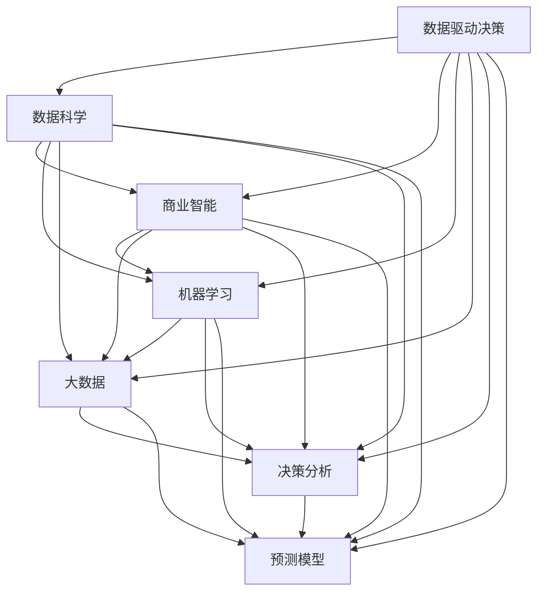

                 

# 数据驱动决策：现代管理者的必备技能

> 关键词：数据驱动决策, 管理, 人工智能, 数据科学, 机器学习, 大数据, 商业智能, 决策分析

## 1. 背景介绍

### 1.1 问题由来
在信息时代，数据已经成为企业核心资产之一。然而，如何高效利用海量数据，为决策提供有力支撑，是现代管理者的重要挑战。传统的决策过程往往依赖经验与直觉，而在数据驱动时代，管理者需要掌握利用数据进行决策的新技能，以实现科学、精准、高效的决策。

数据驱动决策(Datadriven Decision Making)，是指基于数据分析和机器学习技术，结合业务场景和领域知识，实现自动化、量化、科学化的决策过程。数据驱动决策能够帮助管理者基于事实和数据，而非直觉和经验，做出更合理的商业决策，提升企业竞争力。

### 1.2 问题核心关键点
实现数据驱动决策，需要具备以下几个关键能力：
1. 数据获取与处理：能够从企业内外多个渠道获取数据，并有效清洗、整合与存储。
2. 数据分析与建模：掌握数据分析与建模技术，通过数据挖掘、机器学习等方法发现数据中的关键信息。
3. 业务理解与决策：能够结合领域知识，理解业务问题，将数据分析结果转化为可执行的决策方案。
4. 自动化与流程优化：应用人工智能技术，实现决策流程的自动化与优化，提高决策效率。

## 2. 核心概念与联系

### 2.1 核心概念概述

为更好地理解数据驱动决策，本节将介绍几个密切相关的核心概念：

- 数据驱动决策(Data Driven Decision Making)：基于数据分析和机器学习技术，实现科学化、自动化、量化的决策过程。
- 数据科学(Data Science)：涵盖数据收集、清洗、处理、分析、建模等全流程的一系列技术。
- 商业智能(Business Intelligence)：通过数据挖掘、可视化、报表分析等技术，帮助企业决策者快速获得业务洞察。
- 机器学习(Machine Learning)：通过训练模型，从数据中自动学习和发现规律，实现预测与决策。
- 大数据(Big Data)：指规模大、结构复杂、增长快速的数据集，需采用特殊技术进行存储、处理与分析。
- 决策分析(Decision Analysis)：结合数据、领域知识、策略目标等，评估决策方案的可行性与效果。
- 预测模型(Prediction Model)：通过历史数据训练得到的模型，用于预测未来事件或行为。

这些核心概念之间的逻辑关系可以通过以下Mermaid流程图来展示：



这个流程图展示了大数据驱动决策的关键概念及其之间的关系：

1. 数据驱动决策基于数据科学和商业智能，利用机器学习技术和大数据支持，进行预测和决策分析。
2. 数据科学提供了数据处理、分析和建模等技术，而商业智能则提供了数据可视化和报表分析工具。
3. 机器学习是大数据驱动决策的核心技术之一，通过预测模型提供决策支持。
4. 大数据为数据驱动决策提供了数据来源和分析对象。
5. 决策分析是结合数据和领域知识，进行方案评估和选择的过程。

## 3. 核心算法原理 & 具体操作步骤

### 3.1 算法原理概述

数据驱动决策的核心算法原理可概括为以下几个步骤：

1. **数据获取与处理**：收集企业内外部的数据，包括客户数据、交易数据、运营数据等，并进行清洗、去重、归一化等预处理。

2. **数据建模与分析**：采用机器学习等算法，对处理后的数据进行建模，提取有价值的信息。常用的模型包括回归模型、分类模型、聚类模型等。

3. **数据可视化**：将分析结果通过图表、仪表盘等方式进行可视化，提供直观的业务洞察。

4. **决策制定**：结合数据可视化结果和领域知识，制定决策方案，并进行评估与优化。

5. **自动化执行**：将决策方案通过系统自动化执行，并进行效果跟踪和反馈。

### 3.2 算法步骤详解

以下详细介绍数据驱动决策的核心算法步骤：

**Step 1: 数据准备与预处理**
- 收集企业内外部的数据，包括客户交易数据、运营数据、市场环境数据等。
- 进行数据清洗，包括去重、缺失值填补、异常值检测等。
- 对数据进行归一化、标准化等处理，确保数据的一致性和可比性。
- 根据业务需求，选择适当的数据格式和存储方式，如使用数据库或数据湖进行存储。

**Step 2: 数据探索与建模**
- 通过可视化工具（如Tableau、Power BI）进行数据探索，发现数据中的异常点、趋势和关联。
- 使用机器学习算法（如决策树、随机森林、神经网络等）对数据进行建模，提取关键特征。
- 进行模型评估和选择，优化模型参数，提高预测准确性。

**Step 3: 数据可视化与报告**
- 使用数据可视化工具（如Matplotlib、Seaborn、D3.js等）创建图表和仪表盘，展示数据分析结果。
- 生成业务报表，提供关键绩效指标（KPI）和业务洞察。
- 定期更新数据可视化内容和报表，确保业务洞察的时效性和准确性。

**Step 4: 决策制定与执行**
- 结合数据可视化结果和业务知识，制定决策方案，并进行成本-收益分析。
- 根据决策方案，制定行动计划，明确责任和执行步骤。
- 通过自动化流程和系统工具，执行决策方案，并跟踪执行效果。

**Step 5: 效果评估与优化**
- 定期评估决策效果，通过关键绩效指标（KPI）进行评估。
- 根据评估结果，进行决策优化和调整，不断提高决策质量。

### 3.3 算法优缺点

数据驱动决策具有以下优点：
1. 客观准确：基于数据和分析，而非直觉和经验，决策更具客观性和准确性。
2. 量化可控：通过量化分析和模型预测，管理者能够更精确地控制决策过程。
3. 自动化高效：通过自动化流程和系统工具，提高决策执行效率。
4. 持续优化：能够实时监控和调整决策方案，不断优化决策效果。

同时，数据驱动决策也存在以下局限：
1. 数据质量依赖：决策质量依赖于数据的质量和完整性，数据偏差可能导致错误决策。
2. 模型依赖性：模型选择和参数调整需要专业知识和经验，模型复杂度可能影响决策效果。
3. 领域知识要求：管理者需要具备一定领域知识，才能有效结合业务场景进行决策。
4. 系统集成难度：将决策系统集成到现有流程和系统中，需要较高技术要求和资源投入。
5. 自动化风险：自动化系统可能出现故障，管理者需要具备系统维护和监控能力。

### 3.4 算法应用领域

数据驱动决策在各个领域都有广泛应用：

1. **金融行业**：用于风险管理、投资决策、信用评估等。通过数据分析和模型预测，识别潜在风险和市场趋势，优化投资组合。

2. **医疗行业**：用于患者诊疗、药物研发、医疗资源管理等。通过大数据分析和预测模型，提高诊疗精准度，加速新药研发。

3. **零售行业**：用于客户细分、库存管理、营销策略等。通过客户行为分析和市场趋势预测，制定精准营销和库存管理策略。

4. **制造业**：用于生产调度、供应链管理、质量控制等。通过生产数据和预测模型，优化生产计划，提高供应链效率。

5. **公共服务**：用于城市管理、环境监测、应急响应等。通过数据分析和可视化，提升城市治理和应急响应能力。

6. **物流行业**：用于路线规划、仓储管理、配送优化等。通过实时数据和预测模型，优化物流配送和仓储管理。

## 4. 数学模型和公式 & 详细讲解  
### 4.1 数学模型构建

在数据驱动决策中，常见的数学模型包括回归模型、分类模型、聚类模型等。这里以回归模型为例，介绍其数学模型构建过程。

假设有一组历史数据 $(x_i, y_i)$，其中 $x_i$ 为自变量，$y_i$ 为因变量。回归模型的目标是找到一条曲线 $y=f(x)$，使得预测值 $f(x)$ 与实际值 $y$ 的误差最小。

常用的回归模型有线性回归、多项式回归、逻辑回归等。这里以线性回归为例，其数学模型为：

$$
y = \beta_0 + \beta_1 x_1 + \beta_2 x_2 + ... + \beta_n x_n + \epsilon
$$

其中 $\beta_0$ 为截距，$\beta_1, \beta_2, ..., \beta_n$ 为自变量的系数，$\epsilon$ 为误差项。

通过最小化误差项 $\epsilon$，可以求解出回归模型的参数 $\beta_0, \beta_1, ..., \beta_n$。常用的求解方法包括普通最小二乘法（OLS）、梯度下降法等。

### 4.2 公式推导过程

下面推导线性回归的普通最小二乘法（OLS）求解过程。

设回归模型的参数为 $\beta_0, \beta_1, ..., \beta_n$，则误差项 $\epsilon$ 可表示为：

$$
\epsilon = y - (\beta_0 + \beta_1 x_1 + \beta_2 x_2 + ... + \beta_n x_n)
$$

最小化误差项的平方和 $SSE$，即：

$$
SSE = \sum_{i=1}^n \epsilon_i^2 = \sum_{i=1}^n (y_i - (\beta_0 + \beta_1 x_{i1} + \beta_2 x_{i2} + ... + \beta_n x_{in}))^2
$$

对每个参数求偏导数并令其为0，得到参数估计公式：

$$
\beta_j = \frac{\sum_{i=1}^n (x_{ij} y_i - \overline{x}_{ij} \overline{y}) / (\sum_{i=1}^n x_{ij}^2 - \overline{x}_{ij}^2)}{\sum_{i=1}^n x_{ij}^2 - \overline{x}_{ij}^2}, j = 1, 2, ..., n
$$

其中 $\overline{x}_{ij}$ 和 $\overline{y}$ 分别为自变量和因变量的均值。

### 4.3 案例分析与讲解

以金融行业为例，分析数据驱动决策在风险管理中的应用。

**案例背景**：某银行需要对新客户的信用风险进行评估，已有的数据包括客户的年龄、收入、贷款历史、还款记录等。银行需要构建一个信用评分模型，以预测客户违约的概率。

**数据准备**：收集历史客户的信用数据，包括年龄、收入、贷款历史、还款记录等。进行数据清洗和预处理，确保数据一致性和完整性。

**模型构建**：采用线性回归模型，将年龄、收入、贷款历史、还款记录等自变量与客户违约（0/1）因变量进行回归分析。

**模型训练与评估**：使用历史数据训练线性回归模型，并使用验证集评估模型的预测准确性。

**决策制定**：根据模型的预测结果，制定信用评分标准，将客户分为低、中、高风险等级，制定相应的信用策略。

**效果评估**：定期评估模型的预测效果，根据实际违约情况进行优化和调整。

## 5. 项目实践：代码实例和详细解释说明
### 5.1 开发环境搭建

在进行数据驱动决策实践前，我们需要准备好开发环境。以下是使用Python进行Scikit-learn开发的环境配置流程：

1. 安装Anaconda：从官网下载并安装Anaconda，用于创建独立的Python环境。

2. 创建并激活虚拟环境：
```bash
conda create -n sklearn-env python=3.8 
conda activate sklearn-env
```

3. 安装Scikit-learn：
```bash
pip install scikit-learn
```

4. 安装各类工具包：
```bash
pip install numpy pandas scikit-learn matplotlib scikit-optimize
```

完成上述步骤后，即可在`sklearn-env`环境中开始数据驱动决策的实践。

### 5.2 源代码详细实现

下面我以线性回归为例，给出使用Scikit-learn库进行金融风险评估的Python代码实现。

首先，定义线性回归模型和数据集：

```python
from sklearn.linear_model import LinearRegression
from sklearn.model_selection import train_test_split
import pandas as pd

# 读取数据集
data = pd.read_csv('credit_data.csv')

# 数据预处理
X = data[['age', 'income', 'loan_history', 'payment_record']]
y = data['default']

# 划分训练集和测试集
X_train, X_test, y_train, y_test = train_test_split(X, y, test_size=0.2, random_state=42)

# 创建线性回归模型
model = LinearRegression()

# 训练模型
model.fit(X_train, y_train)

# 预测测试集
y_pred = model.predict(X_test)
```

然后，评估模型的性能并进行决策制定：

```python
from sklearn.metrics import classification_report

# 评估模型
y_true = y_test
y_pred = model.predict(X_test)
print(classification_report(y_true, y_pred))

# 决策制定
threshold = 0.5
y_pred_binary = y_pred > threshold
default_rate = sum(y_true) / len(y_true)
low_risk_rate = sum(y_pred_binary == 0) / len(y_pred_binary)
high_risk_rate = sum(y_pred_binary == 1) / len(y_pred_binary)
print(f"低风险客户比例: {low_risk_rate:.2f}%, 高风险客户比例: {high_risk_rate:.2f}%")
```

接下来，可视化模型的预测结果：

```python
import matplotlib.pyplot as plt

# 绘制预测结果
plt.scatter(y_test, y_pred)
plt.xlabel('真实值')
plt.ylabel('预测值')
plt.title('线性回归预测结果')
plt.show()
```

以上代码展示了如何使用Scikit-learn库进行线性回归模型的构建、训练和评估，并根据模型预测结果制定信用评分策略。

### 5.3 代码解读与分析

**线性回归模型**：
- `LinearRegression()`：定义线性回归模型。
- `fit(X_train, y_train)`：使用训练集数据训练模型。

**数据预处理**：
- `pd.read_csv('credit_data.csv')`：读取数据集，假设数据集保存在csv文件中。
- `X = data[['age', 'income', 'loan_history', 'payment_record']]`：选择自变量，如年龄、收入、贷款历史和还款记录。
- `y = data['default']`：选择因变量，即客户违约。
- `train_test_split(X, y, test_size=0.2, random_state=42)`：将数据集划分为训练集和测试集，测试集占比20%，随机状态为42，确保结果可复现。

**模型评估**：
- `classification_report(y_true, y_pred)`：使用分类报告评估模型性能，输出准确率、召回率、F1分数等指标。

**决策制定**：
- `threshold = 0.5`：设置阈值，将模型预测结果转化为二分类。
- `y_pred_binary = y_pred > threshold`：根据阈值进行二分类，0表示低风险，1表示高风险。
- `default_rate`：计算违约率，即真实违约客户占总客户的比例。
- `low_risk_rate`：计算低风险客户比例，即预测为低风险的客户中，实际违约的占比。
- `high_risk_rate`：计算高风险客户比例，即预测为高风险的客户中，实际违约的占比。

**可视化**：
- `plt.scatter(y_test, y_pred)`：绘制真实值和预测值的散点图。
- `plt.xlabel('真实值')`：设置x轴标签。
- `plt.ylabel('预测值')`：设置y轴标签。
- `plt.title('线性回归预测结果')`：设置图表标题。

以上代码展示了如何利用Scikit-learn库进行线性回归模型的构建和训练，并根据模型预测结果制定信用评分策略。通过实际数据集的训练和测试，我们可以验证模型的预测效果，并进行决策制定。

## 6. 实际应用场景
### 6.1 智能客服系统

在智能客服系统中，数据驱动决策可以显著提升客户满意度和服务效率。传统客服系统依赖人工服务，响应时间长，难以处理大规模客户咨询。而基于数据驱动决策的智能客服系统，能够实时监控和分析客户咨询数据，自动生成回复，提升响应速度和质量。

**案例背景**：某电商公司的客服部门希望提升客户响应速度和质量，减少人力成本。

**数据准备**：收集客户咨询记录、对话历史、问题类型等数据，清洗和预处理数据。

**模型构建**：采用自然语言处理（NLP）技术，构建分类模型，预测客户咨询类型和回复内容。

**模型训练与评估**：使用历史数据训练分类模型，并使用验证集评估模型性能。

**决策制定**：根据模型预测结果，自动生成回复，并通过智能推送系统将回复发送给客户。

**效果评估**：通过客户满意度调查和响应时间统计，评估系统效果，进行优化和调整。

### 6.2 供应链管理

在供应链管理中，数据驱动决策可以优化库存管理和物流配送，降低成本，提高效率。传统的供应链管理依赖经验判断，缺乏数据支持和定量分析，容易受到需求波动、运输延误等因素的影响。

**案例背景**：某制造企业的供应链部门希望提高库存管理效率，降低物流成本。

**数据准备**：收集库存数据、销售数据、订单数据、物流数据等，进行数据清洗和预处理。

**模型构建**：采用时间序列分析技术，构建预测模型，预测未来需求和库存水平。

**模型训练与评估**：使用历史数据训练预测模型，并使用验证集评估模型性能。

**决策制定**：根据模型预测结果，制定库存和物流计划，优化供应链流程。

**效果评估**：通过库存周转率、物流成本、客户满意度等指标，评估系统效果，进行优化和调整。

### 6.3 营销策略优化

在营销策略优化中，数据驱动决策可以帮助企业精准定位目标客户，优化广告投放和推广效果。传统的营销策略依赖经验和直觉，缺乏数据支持和定量分析，容易浪费资源，难以实现精准营销。

**案例背景**：某电商平台希望提升广告投放效果，增加销售额。

**数据准备**：收集用户行为数据、交易数据、广告投放数据等，进行数据清洗和预处理。

**模型构建**：采用推荐系统技术，构建预测模型，预测用户购买意愿和行为倾向。

**模型训练与评估**：使用历史数据训练预测模型，并使用验证集评估模型性能。

**决策制定**：根据模型预测结果，优化广告投放策略，精准推送个性化广告。

**效果评估**：通过广告点击率、转化率、销售额等指标，评估系统效果，进行优化和调整。

## 7. 工具和资源推荐
### 7.1 学习资源推荐

为了帮助开发者系统掌握数据驱动决策的理论基础和实践技巧，这里推荐一些优质的学习资源：

1. 《数据科学基础》：这是一本系统介绍数据科学基础和常用技术的书籍，涵盖了数据收集、数据清洗、数据可视化、统计分析等各个方面。

2. 《Python数据科学手册》：这是一本面向初学者的Python数据科学入门书籍，详细介绍了NumPy、Pandas、Matplotlib等常用库的使用。

3. 《机器学习实战》：这是一本实践导向的机器学习入门书籍，通过大量案例展示了机器学习算法的应用。

4. 《商业智能：数据驱动决策》：这是一本商业智能领域的经典书籍，详细介绍了商业智能技术和应用案例。

5. 《深度学习入门》：这是一本深度学习领域的入门书籍，涵盖了神经网络、卷积神经网络、循环神经网络等核心技术。

6. 在线课程：如Coursera、edX、Udacity等平台上的数据科学和机器学习课程，提供系统的理论学习和实践机会。

通过对这些资源的学习实践，相信你一定能够快速掌握数据驱动决策的理论基础和实践技巧，并应用于实际工作中。

### 7.2 开发工具推荐

高效的开发离不开优秀的工具支持。以下是几款用于数据驱动决策开发的常用工具：

1. Python：Python是数据科学和机器学习领域的主流编程语言，具有丰富的第三方库和社区支持。

2. Jupyter Notebook：基于IPython的交互式编程环境，支持Python、R、SQL等语言，适合数据科学和机器学习项目开发。

3. Scikit-learn：开源的Python机器学习库，提供多种常用的机器学习算法和工具，简单易用。

4. TensorFlow：由Google开发的开源深度学习框架，支持分布式计算和GPU加速，适合大规模数据处理和模型训练。

5. Tableau：商业智能可视化工具，支持多种数据源，易于上手，适合数据可视化和报表分析。

6. Power BI：微软推出的商业智能工具，支持数据连接、可视化、报表生成等，易于使用。

合理利用这些工具，可以显著提升数据驱动决策的开发效率，加快创新迭代的步伐。

### 7.3 相关论文推荐

数据驱动决策的研究始于数据科学的兴起，并随着人工智能技术的发展而不断进步。以下是几篇奠基性的相关论文，推荐阅读：

1. "The Elements of Statistical Learning"（《统计学习方法》）：作者Tibshirani等，详细介绍了统计学习理论和方法，是数据科学领域的经典教材。

2. "Predictive Modeling: Principles and Practice"（《预测模型：原理与实践》）：作者Hastie等，介绍了各种预测模型和评价指标，是机器学习领域的经典教材。

3. "Data Science for Business"（《数据科学实战》）：作者John W. Foreman，详细介绍了数据科学在商业决策中的应用。

4. "Big Data: Principles and Best Practices of Scalable Real-time Data Systems"（《大数据：可扩展的实时数据系统原理与实践》）：作者Joel Dean，介绍了大数据系统架构和最佳实践。

5. "Machine Learning Yearning"（《机器学习实战手册》）：作者Andrew Ng，详细介绍了机器学习项目开发和管理的经验和技巧。

这些论文代表了大数据驱动决策的研究方向，通过学习这些前沿成果，可以帮助研究者把握学科前进方向，激发更多的创新灵感。

## 8. 总结：未来发展趋势与挑战

### 8.1 总结

本文对数据驱动决策进行了全面系统的介绍。首先阐述了数据驱动决策的背景和意义，明确了其在现代企业管理中的重要性。其次，从原理到实践，详细讲解了数据驱动决策的核心算法和操作步骤，给出了数据驱动决策任务开发的完整代码实例。同时，本文还广泛探讨了数据驱动决策在多个行业领域的应用前景，展示了其在优化决策流程、提高决策质量方面的巨大潜力。

通过本文的系统梳理，可以看到，数据驱动决策正成为现代管理者的重要工具，通过数据和算法，实现科学、高效、精准的决策过程。未来，伴随数据科学和人工智能技术的持续进步，数据驱动决策必将在更多领域得到应用，为企业管理带来革命性变革。

### 8.2 未来发展趋势

展望未来，数据驱动决策的发展趋势如下：

1. 数据技术发展：随着大数据技术的进一步发展，数据驱动决策将能够处理更复杂的非结构化数据，如文本、图像、视频等，从而提高决策的全面性和准确性。

2. 智能决策系统：基于机器学习和深度学习技术，构建智能决策系统，实现自动化的决策支持。

3. 实时决策引擎：通过实时数据处理和分析技术，构建实时决策引擎，实现动态调整和优化。

4. 联邦学习：在数据隐私和安全的前提下，通过联邦学习技术，实现跨企业、跨部门的数据共享和联合建模，提升决策系统的泛化能力。

5. 数据自动化处理：采用自动化数据处理和清洗技术，降低数据准备成本，提高决策效率。

6. 决策可视化：通过数据可视化技术，将决策过程和结果呈现给决策者，提升决策的可视化和理解度。

### 8.3 面临的挑战

尽管数据驱动决策取得了显著进展，但在实现过程中仍面临诸多挑战：

1. 数据质量问题：数据质量直接关系到决策效果，数据的完整性、准确性和一致性需要严格保障。

2. 模型复杂度问题：模型越复杂，需要的计算资源和解释成本越高，如何在复杂性和实用性之间取得平衡，是技术发展的关键。

3. 领域知识需求：数据驱动决策需要结合领域知识，理解和处理业务场景，缺乏领域知识的决策可能出现偏差。

4. 系统集成难度：将数据驱动决策系统集成到现有业务流程中，需要与现有系统进行数据和功能集成，技术复杂度较高。

5. 数据隐私和安全问题：数据驱动决策涉及大量敏感数据，如何在数据隐私和安全方面进行保障，是技术应用的瓶颈。

### 8.4 研究展望

未来，数据驱动决策研究需要在以下几个方面进行突破：

1. 跨模态数据融合：将不同模态的数据进行融合，如文本、图像、声音等，提升决策系统的全面性和准确性。

2. 因果推断：引入因果推断技术，评估决策效果的因果影响，提升决策的可靠性和透明度。

3. 自动化决策系统：构建自动化决策系统，实现全流程自动化，降低人工干预和错误风险。

4. 模型解释与可解释性：提高模型的可解释性和可理解性，增强决策的透明性和信任度。

5. 实时决策系统：构建实时决策引擎，实现动态调整和优化，提升决策的及时性和适应性。

6. 数据隐私保护：引入隐私保护技术，如差分隐私、联邦学习等，保障数据隐私和安全。

这些研究方向的探索发展，必将引领数据驱动决策技术迈向更高的台阶，为企业管理带来更强大的决策支持。面向未来，数据驱动决策技术还需要与其他人工智能技术进行更深入的融合，共同推动企业管理和运营的智能化转型。

## 9. 附录：常见问题与解答

**Q1：数据驱动决策和商业智能有什么区别？**

A: 数据驱动决策和商业智能（BI）虽然都基于数据分析和可视化，但侧重点略有不同。数据驱动决策更强调基于数据和模型进行决策，具有量化、科学化和自动化等特点；而商业智能则更侧重于数据可视化和报表生成，帮助管理者快速获得业务洞察，支持决策过程。

**Q2：数据驱动决策需要哪些关键技能？**

A: 数据驱动决策需要具备以下关键技能：
1. 数据处理与清洗：能够对复杂数据进行清洗和预处理，确保数据一致性和完整性。
2. 数据分析与建模：掌握数据分析和建模技术，能够从数据中提取关键信息。
3. 业务理解与沟通：具备良好的业务理解能力，能够与业务部门有效沟通，理解业务问题。
4. 算法设计与优化：具备算法设计和优化能力，能够选择合适的算法并调整参数，提高模型预测效果。
5. 决策制定与评估：具备决策制定能力，能够结合数据分析结果和业务场景制定决策方案，并进行效果评估和优化。

**Q3：数据驱动决策在实际应用中需要注意哪些问题？**

A: 数据驱动决策在实际应用中需要注意以下问题：
1. 数据质量：数据的完整性、准确性和一致性直接关系到决策效果，需要严格保障。
2. 数据隐私和安全：涉及敏感数据，需要采取数据保护措施，确保数据隐私和安全。
3. 模型解释与透明性：模型的可解释性和可理解性需要加强，增强决策的透明性和信任度。
4. 领域知识：结合领域知识进行决策，缺乏领域知识可能导致决策偏差。
5. 系统集成：将数据驱动决策系统集成到现有业务流程中，需要与现有系统进行数据和功能集成，技术复杂度较高。

**Q4：如何选择合适的数据驱动决策模型？**

A: 选择合适的数据驱动决策模型需要考虑以下因素：
1. 问题类型：根据问题类型（分类、回归、聚类等）选择合适的模型。
2. 数据特征：考虑数据特征（自变量和因变量的数量、类型、分布等），选择适合的模型。
3. 数据量：根据数据量（样本数和特征数）选择适合的模型。
4. 精度要求：根据精度要求（误差范围）选择合适的模型。
5. 计算资源：考虑计算资源（计算能力和存储资源），选择适合的模型。

以上问题与解答，为读者提供了全面深入的数据驱动决策知识，相信对理解和管理数据驱动决策技术具有重要参考价值。

---

作者：禅与计算机程序设计艺术 / Zen and the Art of Computer Programming

