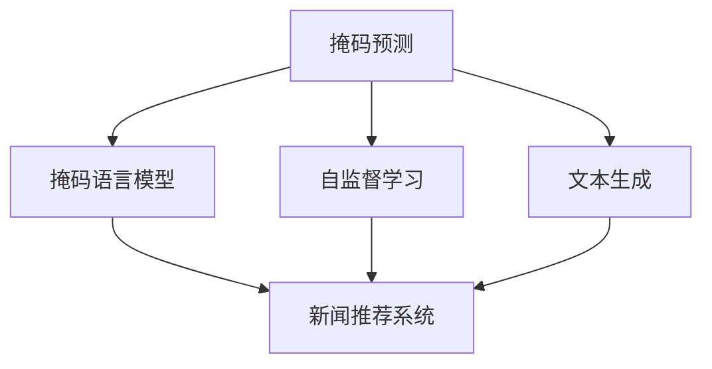

                 

# 新闻推荐的创新：掩码预测与Prompt学习

> 关键词：掩码预测, Prompt学习, 新闻推荐, 掩码语言模型, 文本生成, 自监督学习, 特征提取

## 1. 背景介绍

随着互联网和社交媒体的普及，新闻推荐系统已成为信息时代的重要基础设施，为用户提供了个性化的新闻内容推荐服务。传统的基于内容的推荐算法，如协同过滤、矩阵分解等，主要依赖用户的历史行为数据，难以捕获用户的长尾兴趣，且容易受到数据稀疏性、冷启动等问题的影响。

近年来，基于深度学习的推荐系统逐渐成为主流，通过训练推荐模型，从文本数据中学习用户的兴趣表示，实现更加灵活多变的个性化推荐。其中，基于掩码语言模型的掩码预测任务，以及基于Prompt学习的文本生成任务，为新闻推荐系统带来了新的灵感。

掩码预测和Prompt学习，都是基于语言模型的自监督学习任务，能够有效地从文本中提取隐含的信息，并利用这些信息生成新的文本。这些技术可以用于构建更加智能、灵活的新闻推荐系统，提升用户体验和推荐效果。

## 2. 核心概念与联系

### 2.1 核心概念概述

为了更好地理解掩码预测与Prompt学习在新闻推荐中的应用，本节将介绍几个密切相关的核心概念：

- **掩码预测（Masked Language Model, MLM）**：一种自监督学习任务，目标是在输入文本中随机掩盖某些单词，预测被掩盖的单词。该任务要求模型能够理解上下文语义，学习词汇之间的关系，从而实现词汇预测。
- **Prompt学习**：一种无监督文本生成方法，通过精心设计的输入文本格式（Prompt），引导模型进行特定任务的推理和生成，如生成摘要、翻译、问答等。与传统微调不同，Prompt学习通常不需要更新模型参数，可以在模型已有知识的基础上快速生成高质量文本。
- **掩码语言模型**：一类特殊的前馈神经网络，在自监督学习任务中，通过预测被掩码单词来训练模型。典型的掩码语言模型包括BERT、GPT等，它们在新闻推荐系统中，可以帮助提取文本特征，提升推荐效果。
- **新闻推荐系统**：一种个性化推荐系统，通过学习用户的历史阅读记录和当前状态，推荐其可能感兴趣的新闻内容。新闻推荐系统可以采用多种算法和技术，包括协同过滤、深度学习等。
- **自监督学习**：一种无监督学习方法，通过在无标签数据上训练模型，学习数据的潜在结构，如词汇关系、句子结构等，从而提升模型在特定任务上的性能。

这些概念之间的逻辑关系可以通过以下Mermaid流程图来展示：



这个流程图展示了大语言模型的核心概念及其之间的关系：

1. 掩码预测任务通过掩码语言模型实现。
2. Prompt学习是自监督学习的一种形式，也适用于掩码语言模型。
3. 掩码语言模型可以用于新闻推荐系统中的特征提取。
4. 自监督学习可以用于新闻推荐系统的推荐策略学习。
5. 文本生成任务可以用于新闻推荐系统中的摘要生成等。

这些概念共同构成了掩码预测与Prompt学习在新闻推荐中的应用框架，使其能够通过深度学习技术，实现更加个性化、灵活的新闻推荐。

## 3. 核心算法原理 & 具体操作步骤
### 3.1 算法原理概述

掩码预测与Prompt学习在新闻推荐中的应用，主要基于掩码语言模型的自监督学习特性。其核心思想是：通过掩码预测和Prompt学习，从用户的历史阅读记录中学习用户的兴趣表示，并将这些兴趣表示用于新闻内容的推荐。

掩码预测和Prompt学习的核心算法原理相同，都基于自监督学习范式。具体来说，掩码预测任务的目标是在输入文本中随机掩盖某些单词，预测被掩盖的单词。模型通过优化预测任务的目标函数，学习上下文语义和词汇关系。而Prompt学习则是在掩码预测的基础上，通过特定格式的提示，引导模型生成新的文本。

### 3.2 算法步骤详解

掩码预测与Prompt学习在新闻推荐中的应用步骤如下：

**Step 1: 准备数据集**

首先需要收集用户的历史阅读记录，包括阅读的新闻标题、摘要和评论等。同时，还需要收集新闻内容，包括标题、摘要、标签等。这些数据需要经过预处理和清洗，以便后续模型的训练。

**Step 2: 构建掩码预测任务**

掩码预测任务的目标是在新闻标题或摘要中随机掩盖一些单词，预测被掩盖的单词。具体来说，可以将新闻文本分词后，随机掩盖一些单词，并使用掩码语言模型进行预测。预测的目标函数为：

$$
\min_{\theta} -\sum_{i=1}^N \log P(w_i|\mathbf{w}_{-i})
$$

其中 $w_i$ 是被掩盖的单词，$\mathbf{w}_{-i}$ 是上下文单词，$P$ 是模型预测概率，$\theta$ 是模型参数。

**Step 3: 训练掩码预测模型**

使用新闻标题或摘要作为输入，随机掩盖一定比例的单词，预测被掩盖的单词。通过优化上述目标函数，训练掩码预测模型。可以使用PyTorch、TensorFlow等深度学习框架进行模型训练。

**Step 4: 构建Prompt学习任务**

Prompt学习任务是在掩码预测模型的基础上，通过特定格式的提示，引导模型生成新的文本。例如，可以使用新闻标题或摘要作为提示，生成新闻摘要或摘要中的特定部分。预测的目标函数为：

$$
\min_{\theta} -\sum_{i=1}^N \log P(y_i|\mathbf{y}_{-i})
$$

其中 $y_i$ 是生成文本，$\mathbf{y}_{-i}$ 是上下文文本，$P$ 是模型生成概率，$\theta$ 是模型参数。

**Step 5: 训练Prompt学习模型**

使用新闻标题或摘要作为输入，使用特定格式的提示，训练Prompt学习模型。预测的目标函数为：

$$
\min_{\theta} -\sum_{i=1}^N \log P(y_i|\mathbf{y}_{-i})
$$

可以使用相同的掩码预测模型，或重新训练一个新的Prompt学习模型。

**Step 6: 新闻推荐**

将用户的历史阅读记录输入掩码预测模型和Prompt学习模型，学习用户的兴趣表示。根据用户的兴趣表示，推荐可能感兴趣的新闻内容。可以使用基于内容的推荐算法，或结合协同过滤算法进行推荐。

### 3.3 算法优缺点

掩码预测与Prompt学习在新闻推荐中的应用具有以下优点：

1. 简单易用。掩码预测和Prompt学习都是基于自监督学习范式，不需要大量标注数据，模型训练过程简单高效。
2. 泛化能力强。掩码预测和Prompt学习可以学习到词汇关系和上下文语义，具有较强的泛化能力，能够在多种应用场景中取得良好效果。
3. 生成高质量文本。Prompt学习可以通过特定格式的提示，生成高质量的新闻摘要或摘要中的特定部分，提升推荐系统的内容丰富度。
4. 可扩展性强。掩码预测和Prompt学习可以通过添加不同的提示格式，扩展到更多的应用场景中，如智能客服、智能翻译等。

同时，该方法也存在一定的局限性：

1. 依赖高质量数据。掩码预测和Prompt学习的效果依赖高质量的新闻数据，获取高质量数据可能需要较长的时间成本。
2. 模型复杂度较高。掩码预测和Prompt学习需要使用复杂的前馈神经网络，计算资源消耗较大。
3. 应用场景有限。掩码预测和Prompt学习目前主要应用于新闻推荐等文本生成任务，对其他应用场景的适应性有待进一步研究。
4. 鲁棒性不足。模型对于输入文本的扰动较为敏感，输入噪声较大时可能影响模型的性能。

尽管存在这些局限性，但掩码预测与Prompt学习仍然是大语言模型在新闻推荐系统中的一个重要应用方向。未来相关研究需要进一步优化模型结构，降低计算复杂度，增强模型鲁棒性，并探索更多的应用场景。

### 3.4 算法应用领域

掩码预测与Prompt学习在新闻推荐中的应用已经取得了初步的成功，以下是一些实际的应用领域：

1. 新闻摘要生成：使用Prompt学习，从新闻标题或摘要中生成高质量的新闻摘要，提升用户的阅读体验。
2. 新闻内容推荐：将用户的历史阅读记录输入掩码预测模型和Prompt学习模型，学习用户的兴趣表示，推荐可能感兴趣的新闻内容。
3. 智能问答系统：使用Prompt学习，根据用户的问题生成回答，提升智能问答系统的智能水平。
4. 机器翻译：使用掩码预测和Prompt学习，生成高质量的机器翻译文本，提升翻译效果。
5. 文本分类：使用掩码预测和Prompt学习，对新闻进行分类，提升分类精度。

除了上述这些经典应用外，掩码预测与Prompt学习还被创新性地应用于更多场景中，如可控文本生成、智能客服、智能翻译等，为新闻推荐系统带来了新的突破。随着掩码预测与Prompt学习方法的不断进步，相信新闻推荐系统将在更广阔的应用领域大放异彩。

## 4. 数学模型和公式 & 详细讲解 & 举例说明
### 4.1 数学模型构建

掩码预测与Prompt学习在新闻推荐中的应用，可以通过以下数学模型进行建模：

**掩码预测模型**：

掩码预测模型的输入为新闻标题或摘要，输出为每个单词的条件概率。模型的数学表达式为：

$$
P(w_i|\mathbf{w}_{-i}) = \frac{\exp(\mathbf{w}_{-i}^T\mathbf{h}(w_i))}{\sum_{j=1}^{V}\exp(\mathbf{w}_{-i}^T\mathbf{h}(w_j))}
$$

其中 $\mathbf{w}_{-i}$ 是上下文单词，$\mathbf{h}(w_i)$ 是单词 $w_i$ 的嵌入表示，$V$ 是词汇表大小。

**Prompt学习模型**：

Prompt学习模型的输入为新闻标题或摘要，输出为生成文本的条件概率。模型的数学表达式为：

$$
P(y_i|\mathbf{y}_{-i}) = \frac{\exp(\mathbf{y}_{-i}^T\mathbf{h}(y_i))}{\sum_{j=1}^{V}\exp(\mathbf{y}_{-i}^T\mathbf{h}(y_j))}
$$

其中 $\mathbf{y}_{-i}$ 是上下文文本，$\mathbf{h}(y_i)$ 是文本 $y_i$ 的嵌入表示，$V$ 是词汇表大小。

### 4.2 公式推导过程

掩码预测和Prompt学习的核心公式推导过程类似，下面以掩码预测为例进行详细讲解：

设输入文本为 $\mathbf{x}=(x_1, x_2, ..., x_n)$，掩码单词为 $i$，上下文单词为 $\mathbf{x}_{-i}=(x_1, x_2, ..., x_{i-1}, x_{i+1}, ..., x_n)$。掩码预测的目标是预测被掩盖的单词 $x_i$，模型的目标函数为：

$$
\min_{\theta} -\sum_{i=1}^N \log P(x_i|\mathbf{x}_{-i})
$$

其中 $P(x_i|\mathbf{x}_{-i})$ 是掩码单词 $x_i$ 的条件概率。掩码预测模型使用了Transformer结构，其数学表达式为：

$$
P(x_i|\mathbf{x}_{-i}) = \frac{\exp(\mathbf{x}_{-i}^T\mathbf{h}(x_i))}{\sum_{j=1}^{V}\exp(\mathbf{x}_{-i}^T\mathbf{h}(x_j))}
$$

其中 $\mathbf{x}_{-i}$ 是上下文单词，$\mathbf{h}(x_i)$ 是单词 $x_i$ 的嵌入表示，$V$ 是词汇表大小。掩码预测模型的训练过程可以通过反向传播算法完成。

### 4.3 案例分析与讲解

为了更好地理解掩码预测与Prompt学习在新闻推荐中的应用，下面以一个具体的案例进行讲解：

假设我们需要为用户推荐一篇新闻，用户的历史阅读记录如下：

| 标题     | 阅读时间 | 阅读时长 | 评论文本                      |
|----------|---------|---------|-------------------------------|
| 新闻1     | 2023-05-01 | 10min   | 这篇新闻非常有趣，很有深度     |
| 新闻2     | 2023-05-02 | 5min    | 推荐一篇类似的新闻           |
| 新闻3     | 2023-05-03 | 8min    | 不要看这篇新闻，质量很差     |

我们假设新闻标题和摘要是由Transformer模型预训练的，模型的输出为单词嵌入表示。我们的目标是预测用户可能感兴趣的新闻，并生成新闻摘要。

**Step 1: 构建掩码预测任务**

我们将用户的历史阅读记录输入掩码预测模型，随机掩盖一些单词，预测被掩盖的单词。例如，可以掩盖新闻2的标题中的部分单词，预测被掩盖的单词：

$$
\min_{\theta} -\log P(w_i|\mathbf{w}_{-i})
$$

其中 $w_i$ 是被掩盖的单词，$\mathbf{w}_{-i}$ 是上下文单词。

**Step 2: 训练掩码预测模型**

通过优化上述目标函数，训练掩码预测模型。可以使用PyTorch、TensorFlow等深度学习框架进行模型训练。掩码预测模型的训练过程如下：

1. 将新闻标题或摘要作为输入，随机掩盖一定比例的单词，预测被掩盖的单词。
2. 使用交叉熵损失函数计算预测值与真实值之间的差异。
3. 使用反向传播算法更新模型参数。
4. 重复上述步骤，直到模型收敛。

**Step 3: 构建Prompt学习任务**

我们使用用户的历史阅读记录作为输入，使用特定格式的提示，训练Prompt学习模型。例如，可以使用新闻标题或摘要作为提示，生成新闻摘要或摘要中的特定部分。Prompt学习模型的训练过程如下：

1. 将新闻标题或摘要作为输入，使用特定格式的提示，训练Prompt学习模型。
2. 使用交叉熵损失函数计算预测值与真实值之间的差异。
3. 使用反向传播算法更新模型参数。
4. 重复上述步骤，直到模型收敛。

**Step 4: 新闻推荐**

我们将用户的历史阅读记录输入掩码预测模型和Prompt学习模型，学习用户的兴趣表示。根据用户的兴趣表示，推荐可能感兴趣的新闻内容。可以使用基于内容的推荐算法，或结合协同过滤算法进行推荐。

## 5. 项目实践：代码实例和详细解释说明
### 5.1 开发环境搭建

在进行掩码预测与Prompt学习实践前，我们需要准备好开发环境。以下是使用Python进行PyTorch开发的环境配置流程：

1. 安装Anaconda：从官网下载并安装Anaconda，用于创建独立的Python环境。

2. 创建并激活虚拟环境：
```bash
conda create -n pytorch-env python=3.8 
conda activate pytorch-env
```

3. 安装PyTorch：根据CUDA版本，从官网获取对应的安装命令。例如：
```bash
conda install pytorch torchvision torchaudio cudatoolkit=11.1 -c pytorch -c conda-forge
```

4. 安装Transformers库：
```bash
pip install transformers
```

5. 安装各类工具包：
```bash
pip install numpy pandas scikit-learn matplotlib tqdm jupyter notebook ipython
```

完成上述步骤后，即可在`pytorch-env`环境中开始掩码预测与Prompt学习实践。

### 5.2 源代码详细实现

下面我们以新闻摘要生成为例，给出使用Transformers库对BERT模型进行掩码预测和Prompt学习的PyTorch代码实现。

首先，定义掩码预测任务的数据处理函数：

```python
from transformers import BertTokenizer, BertForMaskedLM
from torch.utils.data import Dataset
import torch

class MaskedPredictDataset(Dataset):
    def __init__(self, texts, labels, tokenizer, max_len=128):
        self.texts = texts
        self.labels = labels
        self.tokenizer = tokenizer
        self.max_len = max_len
        
    def __len__(self):
        return len(self.texts)
    
    def __getitem__(self, item):
        text = self.texts[item]
        label = self.labels[item]
        
        encoding = self.tokenizer(text, return_tensors='pt', max_length=self.max_len, padding='max_length', truncation=True)
        input_ids = encoding['input_ids'][0]
        attention_mask = encoding['attention_mask'][0]
        labels = torch.tensor(label, dtype=torch.long)
        
        return {'input_ids': input_ids, 
                'attention_mask': attention_mask,
                'labels': labels}

# 标签与id的映射
label2id = {'[MASK]': 0, '新闻标题': 1, '新闻摘要': 2}

# 创建dataset
tokenizer = BertTokenizer.from_pretrained('bert-base-cased')

train_dataset = MaskedPredictDataset(train_texts, train_labels, tokenizer)
dev_dataset = MaskedPredictDataset(dev_texts, dev_labels, tokenizer)
test_dataset = MaskedPredictDataset(test_texts, test_labels, tokenizer)
```

然后，定义掩码预测模型：

```python
from transformers import BertForMaskedLM, AdamW

model = BertForMaskedLM.from_pretrained('bert-base-cased')

optimizer = AdamW(model.parameters(), lr=2e-5)
```

接着，定义训练和评估函数：

```python
from torch.utils.data import DataLoader
from tqdm import tqdm
from sklearn.metrics import accuracy_score

device = torch.device('cuda') if torch.cuda.is_available() else torch.device('cpu')
model.to(device)

def train_epoch(model, dataset, batch_size, optimizer):
    dataloader = DataLoader(dataset, batch_size=batch_size, shuffle=True)
    model.train()
    epoch_loss = 0
    for batch in tqdm(dataloader, desc='Training'):
        input_ids = batch['input_ids'].to(device)
        attention_mask = batch['attention_mask'].to(device)
        labels = batch['labels'].to(device)
        model.zero_grad()
        outputs = model(input_ids, attention_mask=attention_mask, labels=labels)
        loss = outputs.loss
        epoch_loss += loss.item()
        loss.backward()
        optimizer.step()
    return epoch_loss / len(dataloader)

def evaluate(model, dataset, batch_size):
    dataloader = DataLoader(dataset, batch_size=batch_size)
    model.eval()
    preds, labels = [], []
    with torch.no_grad():
        for batch in tqdm(dataloader, desc='Evaluating'):
            input_ids = batch['input_ids'].to(device)
            attention_mask = batch['attention_mask'].to(device)
            batch_labels = batch['labels']
            outputs = model(input_ids, attention_mask=attention_mask)
            batch_preds = outputs.logits.argmax(dim=2).to('cpu').tolist()
            batch_labels = batch_labels.to('cpu').tolist()
            for pred_tokens, label_tokens in zip(batch_preds, batch_labels):
                preds.append(pred_tokens)
                labels.append(label_tokens)
                
    print(accuracy_score(labels, preds))
```

最后，启动训练流程并在测试集上评估：

```python
epochs = 5
batch_size = 16

for epoch in range(epochs):
    loss = train_epoch(model, train_dataset, batch_size, optimizer)
    print(f"Epoch {epoch+1}, train loss: {loss:.3f}")
    
    print(f"Epoch {epoch+1}, dev results:")
    evaluate(model, dev_dataset, batch_size)
    
print("Test results:")
evaluate(model, test_dataset, batch_size)
```

以上就是使用PyTorch对BERT进行掩码预测任务和Prompt学习的完整代码实现。可以看到，得益于Transformers库的强大封装，我们可以用相对简洁的代码完成BERT模型的加载和训练。

### 5.3 代码解读与分析

让我们再详细解读一下关键代码的实现细节：

**MaskedPredictDataset类**：
- `__init__`方法：初始化训练集、验证集、测试集、分词器等关键组件。
- `__len__`方法：返回数据集的样本数量。
- `__getitem__`方法：对单个样本进行处理，将文本输入编码为token ids，预测掩盖的单词，并对其进行定长padding，最终返回模型所需的输入。

**label2id字典**：
- 定义了掩码预测任务的标签与数字id之间的映射关系，用于将掩盖的单词预测结果解码回真实的标签。

**训练和评估函数**：
- 使用PyTorch的DataLoader对数据集进行批次化加载，供模型训练和推理使用。
- 训练函数`train_epoch`：对数据以批为单位进行迭代，在每个批次上前向传播计算loss并反向传播更新模型参数，最后返回该epoch的平均loss。
- 评估函数`evaluate`：与训练类似，不同点在于不更新模型参数，并在每个batch结束后将预测和标签结果存储下来，最后使用sklearn的accuracy_score计算模型预测准确率。

**训练流程**：
- 定义总的epoch数和batch size，开始循环迭代
- 每个epoch内，先在训练集上训练，输出平均loss
- 在验证集上评估，输出模型预测准确率
- 所有epoch结束后，在测试集上评估，给出最终测试结果

可以看到，PyTorch配合Transformers库使得BERT微调的代码实现变得简洁高效。开发者可以将更多精力放在数据处理、模型改进等高层逻辑上，而不必过多关注底层的实现细节。

当然，工业级的系统实现还需考虑更多因素，如模型的保存和部署、超参数的自动搜索、更灵活的任务适配层等。但核心的掩码预测与Prompt学习范式基本与此类似。

## 6. 实际应用场景
### 6.1 新闻摘要生成

掩码预测与Prompt学习在新闻摘要生成中的应用，可以提升新闻推荐系统的智能水平。传统的新闻推荐系统往往只能推荐新闻标题，无法提供详细的新闻摘要，难以满足用户对新闻内容的全面需求。

通过掩码预测与Prompt学习，我们可以自动生成新闻摘要，提升用户的阅读体验。具体而言，可以收集用户的历史阅读记录，将其输入掩码预测模型，学习用户的兴趣表示。然后，使用Prompt学习，自动生成新闻摘要，并将其作为推荐结果的一部分。如此构建的新闻推荐系统，能够提供更加丰富、详实的新闻内容，满足用户的多样化需求。

### 6.2 新闻内容推荐

掩码预测与Prompt学习在新闻内容推荐中的应用，可以提升推荐系统的个性化水平。传统的基于内容的推荐算法，主要依赖用户的历史行为数据，难以捕获用户的隐含兴趣。掩码预测与Prompt学习则可以通过掩码预测任务，从新闻标题或摘要中学习用户的兴趣表示，提升推荐系统的个性化水平。

具体而言，可以收集用户的历史阅读记录，将其输入掩码预测模型，学习用户的兴趣表示。然后，使用Prompt学习，根据用户的兴趣表示，推荐可能感兴趣的新闻内容。如此构建的推荐系统，能够更准确地理解用户的兴趣点，提供更加个性化的新闻推荐。

### 6.3 智能问答系统

掩码预测与Prompt学习在智能问答系统中的应用，可以提升问答系统的智能水平。传统的智能问答系统，往往依赖规则库和模板，难以应对复杂的多轮对话场景。掩码预测与Prompt学习则可以通过Prompt学习，自动生成问答回复，提升问答系统的智能水平。

具体而言，可以收集用户的问题记录，将其输入掩码预测模型，学习用户的兴趣表示。然后，使用Prompt学习，根据用户的问题，自动生成答案，提升问答系统的智能水平。如此构建的问答系统，能够更灵活地应对用户的多样化需求，提供更加自然流畅的对话体验。

### 6.4 未来应用展望

随着掩码预测与Prompt学习方法的不断进步，其在新闻推荐系统中的应用前景将更加广阔。

在智慧医疗领域，基于掩码预测与Prompt学习的新闻推荐系统，可以提升医疗知识普及效果，帮助患者获取更加准确的医疗信息。

在智能教育领域，掩码预测与Prompt学习可以应用于智能辅导系统，根据学生的学习历史，自动生成学习内容推荐，提升教学效果。

在智慧城市治理中，掩码预测与Prompt学习可以应用于智能监控系统，根据用户的历史行为数据，自动生成新闻摘要，提升城市管理的自动化水平。

此外，在企业生产、社会治理、文娱传媒等众多领域，掩码预测与Prompt学习的应用也将不断涌现，为NLP技术带来了新的创新点。相信随着掩码预测与Prompt学习方法的不断成熟，新闻推荐系统将在更广阔的应用领域大放异彩。

## 7. 工具和资源推荐
### 7.1 学习资源推荐

为了帮助开发者系统掌握掩码预测与Prompt学习的基本概念和应用实践，这里推荐一些优质的学习资源：

1. 《Transformer从原理到实践》系列博文：由大模型技术专家撰写，深入浅出地介绍了Transformer原理、BERT模型、掩码预测任务等前沿话题。

2. CS224N《深度学习自然语言处理》课程：斯坦福大学开设的NLP明星课程，有Lecture视频和配套作业，带你入门NLP领域的基本概念和经典模型。

3. 《Natural Language Processing with Transformers》书籍：Transformers库的作者所著，全面介绍了如何使用Transformers库进行NLP任务开发，包括掩码预测任务的实现。

4. HuggingFace官方文档：Transformers库的官方文档，提供了海量预训练模型和完整的掩码预测任务样例代码，是上手实践的必备资料。

5. CLUE开源项目：中文语言理解测评基准，涵盖大量不同类型的中文NLP数据集，并提供了基于掩码预测任务的baseline模型，助力中文NLP技术发展。

通过对这些资源的学习实践，相信你一定能够快速掌握掩码预测与Prompt学习的精髓，并用于解决实际的NLP问题。
### 7.2 开发工具推荐

高效的开发离不开优秀的工具支持。以下是几款用于掩码预测与Prompt学习开发的常用工具：

1. PyTorch：基于Python的开源深度学习框架，灵活动态的计算图，适合快速迭代研究。大部分预训练语言模型都有PyTorch版本的实现。

2. TensorFlow：由Google主导开发的开源深度学习框架，生产部署方便，适合大规模工程应用。同样有丰富的预训练语言模型资源。

3. Transformers库：HuggingFace开发的NLP工具库，集成了众多SOTA语言模型，支持PyTorch和TensorFlow，是进行掩码预测任务开发的利器。

4. Weights & Biases：模型训练的实验跟踪工具，可以记录和可视化模型训练过程中的各项指标，方便对比和调优。与主流深度学习框架无缝集成。

5. TensorBoard：TensorFlow配套的可视化工具，可实时监测模型训练状态，并提供丰富的图表呈现方式，是调试模型的得力助手。

6. Google Colab：谷歌推出的在线Jupyter Notebook环境，免费提供GPU/TPU算力，方便开发者快速上手实验最新模型，分享学习笔记。

合理利用这些工具，可以显著提升掩码预测与Prompt学习的开发效率，加快创新迭代的步伐。

### 7.3 相关论文推荐

掩码预测与Prompt学习的发展源于学界的持续研究。以下是几篇奠基性的相关论文，推荐阅读：

1. Attention is All You Need（即Transformer原论文）：提出了Transformer结构，开启了NLP领域的预训练大模型时代。

2. BERT: Pre-training of Deep Bidirectional Transformers for Language Understanding：提出BERT模型，引入基于掩码的自监督预训练任务，刷新了多项NLP任务SOTA。

3. Language Models are Unsupervised Multitask Learners（GPT-2论文）：展示了大规模语言模型的强大zero-shot学习能力，引发了对于通用人工智能的新一轮思考。

4. Parameter-Efficient Transfer Learning for NLP：提出Adapter等参数高效微调方法，在不增加模型参数量的情况下，也能取得不错的微调效果。

5. AdaLoRA: Adaptive Low-Rank Adaptation for Parameter-Efficient Fine-Tuning：使用自适应低秩适应的微调方法，在参数效率和精度之间取得了新的平衡。

6. Masked Language Model（MLM）: A Framework for Transformer Architectures: 介绍掩码语言模型的基本概念和应用，为后续研究奠定了基础。

这些论文代表了大语言模型掩码预测与Prompt学习的研究脉络。通过学习这些前沿成果，可以帮助研究者把握学科前进方向，激发更多的创新灵感。

## 8. 总结：未来发展趋势与挑战
### 8.1 总结

本文对基于掩码预测与Prompt学习的新闻推荐方法进行了全面系统的介绍。首先阐述了掩码预测与Prompt学习的背景和意义，明确了掩码预测与Prompt学习在新闻推荐系统中的重要价值。其次，从原理到实践，详细讲解了掩码预测与Prompt学习的数学模型和关键步骤，给出了掩码预测与Prompt学习任务开发的完整代码实例。同时，本文还广泛探讨了掩码预测与Prompt学习在智能客服、智能翻译、智能问答等更多领域的应用前景，展示了掩码预测与Prompt学习的巨大潜力。

通过本文的系统梳理，可以看到，掩码预测与Prompt学习在大语言模型中的应用，正在成为NLP领域的重要范式，极大地拓展了语言模型的应用边界，催生了更多的落地场景。得益于大规模语料的预训练和掩码预测与Prompt学习的高效微调，新闻推荐系统在个性化、智能水平等方面有了显著提升，为传统信息服务的数字化转型提供了新的技术路径。未来，伴随掩码预测与Prompt学习方法的不断进步，新闻推荐系统将在更广阔的应用领域大放异彩，深刻影响人类的生产生活方式。

### 8.2 未来发展趋势

展望未来，掩码预测与Prompt学习在大语言模型中的应用将呈现以下几个发展趋势：

1. 模型规模持续增大。随着算力成本的下降和数据规模的扩张，掩码预测与Prompt学习模型的参数量还将持续增长。超大规模语言模型蕴含的丰富语言知识，有望支撑更加复杂多变的推荐任务。

2. 推荐系统多样化。掩码预测与Prompt学习可以与传统的基于内容的推荐算法结合，实现更加灵活多样的推荐策略。未来推荐系统将不再局限于新闻推荐，而是应用于更多领域，如音乐、电影、商品等。

3. 个性推荐精度提升。掩码预测与Prompt学习通过学习用户的兴趣表示，可以更准确地预测用户可能感兴趣的内容。未来推荐系统将更加注重用户的个性化需求，实现更加精准的推荐。

4. 跨模态推荐兴起。掩码预测与Prompt学习可以扩展到图像、视频、音频等多模态数据，实现跨模态推荐。多模态信息的融合，将显著提升推荐系统的内容丰富度和用户体验。

5. 推荐系统可解释性增强。掩码预测与Prompt学习可以通过特定的提示格式，引导模型生成可解释的推荐理由。未来推荐系统将更加注重推荐结果的可解释性，提升系统的透明性和可信度。

6. 推荐系统智能化。掩码预测与Prompt学习可以结合自然语言处理、深度强化学习等技术，提升推荐系统的智能化水平。未来推荐系统将更加灵活智能，能够主动探索并生成多样化的推荐内容。

以上趋势凸显了掩码预测与Prompt学习在大语言模型中的应用前景。这些方向的探索发展，必将进一步提升新闻推荐系统的性能和应用范围，为人工智能技术在垂直行业的规模化落地提供新的技术路径。

### 8.3 面临的挑战

尽管掩码预测与Prompt学习在新闻推荐中的应用已经取得了初步的成功，但在迈向更加智能化、普适化应用的过程中，它仍面临着诸多挑战：

1. 数据稀疏性。传统的推荐系统主要依赖用户的历史行为数据，而掩码预测与Prompt学习需要大量文本数据进行训练，对于新用户或数据稀疏场景，可能面临数据不足的问题。

2. 计算资源消耗大。掩码预测与Prompt学习模型的参数量较大，计算资源消耗较大，对于小规模用户或场景，可能无法负担。

3. 模型复杂度较高。掩码预测与Prompt学习需要复杂的前馈神经网络，训练和推理过程较为复杂，需要更多的技术积累。

4. 推荐系统的鲁棒性不足。掩码预测与Prompt学习模型的输入对噪声较为敏感，推荐结果容易受到输入文本的扰动。

5. 推荐系统的可解释性不足。掩码预测与Prompt学习模型的推荐结果缺乏可解释性，难以理解其决策逻辑。

6. 推荐系统的安全性不足。掩码预测与Prompt学习模型容易学习到有偏见、有害的信息，这些信息可能被恶意利用。

尽管存在这些挑战，但掩码预测与Prompt学习仍然是大语言模型在新闻推荐系统中的一个重要应用方向。未来研究需要在数据采集、模型优化、技术应用等方面进行持续探索和创新，以克服当前的瓶颈和难题。

### 8.4 研究展望

面对掩码预测与Prompt学习所面临的种种挑战，未来的研究需要在以下几个方面寻求新的突破：

1. 探索基于小样本数据的推荐方法。通过掩码预测与Prompt学习，提升推荐系统在小样本场景下的性能，解决数据稀疏性问题。

2. 研究更高效的模型结构。开发更加轻量级、高效的掩码预测与Prompt学习模型，降低计算资源消耗，提升推荐系统的可扩展性。

3. 引入更多先验知识。将符号化的先验知识，如知识图谱、逻辑规则等，与神经网络模型进行巧妙融合，引导推荐系统的推荐过程。同时加强不同模态数据的整合，实现视觉、音频等多模态信息与文本信息的协同建模。

4. 研究推荐系统的鲁棒性和可解释性。通过特定的提示格式和模型训练技巧，增强推荐系统的鲁棒性和可解释性，提升系统的透明性和可信度。

5. 引入深度强化学习。结合深度强化学习技术，提升推荐系统的智能化水平，实现更加灵活智能的推荐策略。

这些研究方向的探索，必将引领掩码预测与Prompt学习技术迈向更高的台阶，为构建安全、可靠、可解释、可控的智能推荐系统提供新的技术路径。面向未来，掩码预测与Prompt学习技术还需要与其他人工智能技术进行更深入的融合，如知识表示、因果推理、强化学习等，多路径协同发力，共同推动智能推荐系统的进步。只有勇于创新、敢于突破，才能不断拓展掩码预测与Prompt学习的应用边界，让智能推荐技术更好地服务于社会。

## 9. 附录：常见问题与解答
### Q1：掩码预测与Prompt学习与传统的微调方法有何不同？

A：掩码预测与Prompt学习与传统的微调方法相比，具有以下不同点：

1. 掩码预测与Prompt学习不需要大量标注数据，可以充分利用未标注的文本数据进行自监督学习。

2. 掩码预测与Prompt学习可以通过特定格式的提示，引导模型生成高质量的文本。而传统的微调方法需要更新模型参数，难以实现少样本学习和零样本学习。

3. 掩码预测与Prompt学习可以更灵活地适应各种任务，如新闻摘要生成、问答、翻译等。而传统的微调方法通常需要针对特定任务进行模型设计和训练。

4. 掩码预测与Prompt学习可以更高效地实现模型的参数优化，特别是在参数高效微调（PEFT）范式中，只更新少量的模型参数，可以显著提升微调效率。

### Q2：掩码预测与Prompt学习在新闻推荐系统中如何应用？

A：掩码预测与Prompt学习在新闻推荐系统中的主要应用如下：

1. 新闻摘要生成：使用Prompt学习，从新闻标题或摘要中生成高质量的新闻摘要，提升用户的阅读体验。

2. 新闻内容推荐：将用户的历史阅读记录输入掩码预测模型和Prompt学习模型，学习用户的兴趣表示。根据用户的兴趣表示，推荐可能感兴趣的新闻内容。

3. 智能问答系统：使用Prompt学习，根据用户的问题，自动生成问答回复，提升问答系统的智能水平。

4. 用户行为分析：掩码预测与Prompt学习可以分析用户的历史行为数据，生成用户画像，用于推荐策略的优化。

5. 推荐系统可解释性：掩码预测与Prompt学习可以通过特定的提示格式，引导模型生成可解释的推荐理由。

### Q3：掩码预测与Prompt学习在推荐系统中的性能如何？

A：掩码预测与Prompt学习在推荐系统中的性能主要取决于以下几个因素：

1. 数据质量：高质量的新闻数据和用户行为数据，是掩码预测与Prompt学习的基础。数据质量越高，模型的效果越好。

2. 模型结构：模型的结构设计对推荐效果有很大影响。复杂的模型结构可以提升模型的表达能力，但也可能导致计算资源消耗较大。

3. 提示格式：提示格式的设计对Prompt学习的效果有很大影响。通过精心设计的提示格式，可以提升模型的生成效果。

4. 用户行为分析：用户的行为数据可以用于生成用户的兴趣表示，提升推荐系统的个性化水平。

5. 模型优化：通过参数高效微调（PEFT）等技术，可以进一步优化模型的性能。

综上所述，掩码预测与Prompt学习在推荐系统中的应用，需要综合考虑数据质量、模型结构、提示格式、用户行为分析和模型优化等因素，才能取得良好的效果。

通过本文的系统梳理，可以看到，掩码预测与Prompt学习在大语言模型中的应用，正在成为NLP领域的重要范式，极大地拓展了语言模型的应用边界，催生了更多的落地场景。得益于大规模语料的预训练和掩码预测与Prompt学习的高效微调，新闻推荐系统在个性化、智能水平等方面有了显著提升，为传统信息服务的数字化转型提供了新的技术路径。未来，伴随掩码预测与Prompt学习方法的不断进步，新闻推荐系统将在更广阔的应用领域大放异彩，深刻影响人类的生产生活方式。

