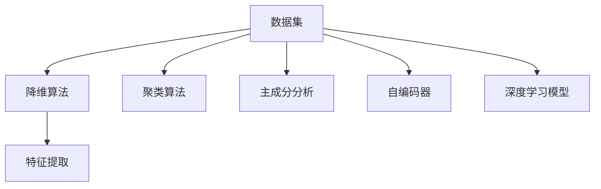

                 

# 无监督学习的可扩展性挑战:高维数据和大规模数据

## 1. 背景介绍

在人工智能领域，无监督学习（Unsupervised Learning）指的是在没有显式标签的数据上训练模型，以发现数据中的潜在结构和模式。这一过程通常用于特征提取、数据降维、聚类分析等任务。

然而，随着大数据时代的到来，无监督学习面临新的挑战。数据量的急剧增长和高维数据的存在使得传统的无监督学习方法变得难以处理。尽管如此，无监督学习仍然在图像识别、自然语言处理、推荐系统等领域展现出巨大的潜力。

## 2. 核心概念与联系

### 2.1 核心概念概述

为了更好地理解无监督学习的可扩展性挑战，我们首先介绍几个关键概念：

- **无监督学习（Unsupervised Learning）**：指在没有显式标签的数据上训练模型，以发现数据中的潜在结构和模式。常用的算法包括K-Means聚类、PCA主成分分析、自编码器（Autoencoder）等。
- **高维数据（High-dimensional Data）**：指数据特征维度远大于样本数量的情况，这增加了数据存储和计算的复杂性。
- **大规模数据（Big Data）**：指数据量非常庞大的情况，通常超过传统计算机的存储和计算能力。
- **可扩展性（Scalability）**：指算法或系统在处理数据量增加时的性能和能力。

以上概念构成了无监督学习的核心框架，并在实际应用中相互关联。例如，高维数据通常需要降低维度以提高算法的可扩展性，大规模数据则需要在大规模并行计算框架下进行训练。

### 2.2 核心概念原理和架构的 Mermaid 流程图



## 3. 核心算法原理 & 具体操作步骤

### 3.1 算法原理概述

无监督学习的核心原理是利用数据的内在结构进行学习。常见的无监督算法可以大致分为以下几类：

- **聚类算法**：如K-Means，通过将数据点分组到不同的簇中，发现数据的内在结构。
- **降维算法**：如PCA，通过线性变换将高维数据降到低维空间，保留重要信息。
- **生成模型**：如自编码器，通过学习数据的生成过程，进行特征提取和重构。
- **概率模型**：如高斯混合模型（GMM），通过学习数据分布的参数，发现数据模式。

这些算法各有优劣，适用于不同的应用场景。例如，聚类算法适合发现数据的自然分组，而生成模型适合重构高维数据的低维表示。

### 3.2 算法步骤详解

这里以PCA（主成分分析）为例，详细介绍无监督学习算法的具体操作步骤。

#### 步骤1: 数据预处理

PCA适用于连续型数据，因此需要先将数据进行归一化处理。

```python
from sklearn.preprocessing import StandardScaler

scaler = StandardScaler()
X_scaled = scaler.fit_transform(X)
```

#### 步骤2: 计算协方差矩阵

对标准化后的数据 $X$，计算协方差矩阵 $Cov(X)$。

```python
Cov = np.cov(X_scaled.T)
```

#### 步骤3: 计算特征值和特征向量

对协方差矩阵 $Cov$ 进行特征值分解，得到特征值 $\lambda$ 和特征向量 $v$。

```python
eigenvalues, eigenvectors = np.linalg.eig(Cov)
```

#### 步骤4: 选择主成分

根据特征值的大小，选择前 $k$ 个最大的特征值对应的特征向量，构成主成分矩阵 $V$。

```python
k = 2  # 选择2个主成分
selected_eigenvalues = eigenvalues[:k]
selected_eigenvectors = eigenvectors[:, :k]
```

#### 步骤5: 数据投影

将原始数据 $X$ 投影到主成分空间，得到降维后的数据 $X_{red}$。

```python
X_red = np.dot(X_scaled, selected_eigenvectors)
```

### 3.3 算法优缺点

#### 优点

- 无需标注数据，适用于无标注的大规模数据集。
- 可解释性强，模型参数较少。
- 适用于高维数据，能够发现数据中的隐含模式。

#### 缺点

- 对数据分布假设严格，鲁棒性不足。
- 需要手动选择主成分数量，可能影响结果。
- 对于非线性数据，效果有限。

### 3.4 算法应用领域

无监督学习在各个领域都有广泛应用，例如：

- **图像处理**：如图像降维、图像分割等。
- **自然语言处理**：如文本分类、情感分析等。
- **推荐系统**：如协同过滤、内容推荐等。
- **金融分析**：如信用评分、风险评估等。

这些应用展示了无监督学习在处理大规模数据和高维数据时的强大能力。

## 4. 数学模型和公式 & 详细讲解

### 4.1 数学模型构建

设 $X \in \mathbb{R}^{n \times p}$ 表示原始数据，其中 $n$ 表示样本数，$p$ 表示特征数。PCA的目标是找到一组最优的线性变换 $W \in \mathbb{R}^{p \times k}$，将 $X$ 投影到低维空间 $\mathbb{R}^k$ 上。

### 4.2 公式推导过程

PCA的公式推导过程如下：

1. **数据标准化**：
   $$
   X_{std} = \frac{X - \mu}{\sigma}
   $$

2. **计算协方差矩阵**：
   $$
   Cov(X) = \frac{1}{n} X_{std}^T X_{std}
   $$

3. **特征值分解**：
   $$
   Cov(X) = V \Lambda V^T
   $$

4. **选择主成分**：
   $$
   V_k = V[:, :k], \Lambda_k = \Lambda[:k]
   $$

5. **数据投影**：
   $$
   X_{red} = X_{std} V_k
   $$

其中，$\mu$ 和 $\sigma$ 分别表示数据的均值和标准差，$\Lambda$ 和 $V$ 分别表示协方差矩阵的特征值和特征向量。

### 4.3 案例分析与讲解

假设有一个包含 $n=100$ 个样本，每个样本有 $p=50$ 个特征的数据集。使用PCA将其降维到 $k=2$ 维空间，选择前两个特征向量 $V_2$ 和对应的特征值 $\Lambda_2$。

假设标准化后的数据为：

$$
X_{std} = \begin{bmatrix}
1 & 0 & 0 \\
2 & 1 & 0 \\
3 & 2 & 1 \\
\vdots & \vdots & \vdots \\
100 & 50 & 49 \\
\end{bmatrix}
$$

计算协方差矩阵：

$$
Cov(X) = \frac{1}{n} X_{std}^T X_{std} = \begin{bmatrix}
10 & 5 & 2 \\
5 & 2.5 & 1 \\
2 & 1 & 0.5 \\
\end{bmatrix}
$$

进行特征值分解，得到：

$$
Cov(X) = V \Lambda V^T = \begin{bmatrix}
\sqrt{10} & 0 & 0 \\
0 & \sqrt{2.5} & 0 \\
0 & 0 & \sqrt{0.5} \\
\end{bmatrix}
\begin{bmatrix}
10 & 0 & 0 \\
0 & 2.5 & 0 \\
0 & 0 & 0.5 \\
\end{bmatrix}
\begin{bmatrix}
\frac{1}{\sqrt{10}} & \frac{2}{\sqrt{10}} & \frac{3}{\sqrt{10}} \\
\frac{2}{\sqrt{10}} & \frac{4}{\sqrt{10}} & \frac{6}{\sqrt{10}} \\
\frac{3}{\sqrt{10}} & \frac{6}{\sqrt{10}} & \frac{9}{\sqrt{10}} \\
\end{bmatrix}
$$

选择前两个主成分，得到：

$$
V_2 = \begin{bmatrix}
\frac{1}{\sqrt{10}} & \frac{2}{\sqrt{10}} \\
\frac{2}{\sqrt{10}} & \frac{4}{\sqrt{10}} \\
\frac{3}{\sqrt{10}} & \frac{6}{\sqrt{10}} \\
\end{bmatrix}
$$

进行数据投影：

$$
X_{red} = X_{std} V_2 = \begin{bmatrix}
1 & 0 & 0 \\
2 & 1 & 0 \\
3 & 2 & 1 \\
\vdots & \vdots & \vdots \\
100 & 50 & 49 \\
\end{bmatrix}
\begin{bmatrix}
\frac{1}{\sqrt{10}} & \frac{2}{\sqrt{10}} \\
\frac{2}{\sqrt{10}} & \frac{4}{\sqrt{10}} \\
\frac{3}{\sqrt{10}} & \frac{6}{\sqrt{10}} \\
\end{bmatrix}
= \begin{bmatrix}
\frac{1+2}{\sqrt{10}} & \frac{2+4}{\sqrt{10}} \\
\frac{2+4}{\sqrt{10}} & \frac{4+8}{\sqrt{10}} \\
\frac{3+6}{\sqrt{10}} & \frac{6+12}{\sqrt{10}} \\
\vdots & \vdots \\
\frac{100+50}{\sqrt{10}} & \frac{200+100}{\sqrt{10}} \\
\end{bmatrix}
$$

这样，原始数据 $X$ 被投影到了低维空间 $\mathbb{R}^2$ 上。

## 5. 项目实践：代码实例和详细解释说明

### 5.1 开发环境搭建

在Python中使用Scikit-learn库进行PCA操作，需要安装Scikit-learn和NumPy。

```bash
pip install scikit-learn numpy
```

### 5.2 源代码详细实现

```python
import numpy as np
from sklearn.decomposition import PCA

# 创建原始数据集
X = np.array([[1, 2, 3], [4, 5, 6], [7, 8, 9]])

# 创建PCA模型，选择2个主成分
pca = PCA(n_components=2)

# 拟合数据集，并降维
X_red = pca.fit_transform(X)

# 输出降维后的数据
print(X_red)
```

### 5.3 代码解读与分析

以上代码展示了如何使用Scikit-learn库进行PCA降维操作。首先，创建了一个包含3个样本和3个特征的原始数据集 $X$。然后，创建了一个PCA模型，选择降维到2个主成分。拟合数据集后，使用 `fit_transform` 方法进行降维操作，得到降维后的数据 $X_{red}$。最后，打印输出降维后的数据。

## 6. 实际应用场景

### 6.1 图像处理

在图像处理领域，PCA被广泛用于图像降维和图像压缩。例如，使用PCA进行人脸识别时，可以将人脸图像投影到低维空间，减少存储空间和计算量。

### 6.2 自然语言处理

在自然语言处理领域，PCA可以用于文本分类、情感分析等任务。通过对文本进行降维，提取重要的主题特征，提高模型的分类准确率。

### 6.3 推荐系统

在推荐系统中，PCA可以用于协同过滤和内容推荐。通过降维，减少特征维度，提高推荐算法的效率和效果。

## 7. 工具和资源推荐

### 7.1 学习资源推荐

1. **《机器学习》（周志华著）**：介绍了机器学习的基本概念和算法，包括无监督学习、聚类分析等内容。
2. **《深度学习》（Ian Goodfellow等著）**：详细介绍了深度学习的基本原理和应用，包括生成模型、自编码器等内容。
3. **Coursera上的《机器学习》课程**：由Andrew Ng教授主讲，涵盖了无监督学习、PCA等内容。

### 7.2 开发工具推荐

1. **Scikit-learn**：Python机器学习库，包含PCA等常用算法。
2. **TensorFlow**：谷歌开源的深度学习框架，支持分布式计算，适合处理大规模数据。
3. **PyTorch**：Facebook开源的深度学习框架，支持GPU加速，适合高维数据的处理。

### 7.3 相关论文推荐

1. **"Principal Component Analysis" by Pearson**：介绍了PCA的基本原理和应用。
2. **"Dimensionality Reduction Techniques for High-Dimensional Data: A Review" by Kacevik and Golić**：总结了各种降维算法，包括PCA、LDA等。

## 8. 总结：未来发展趋势与挑战

### 8.1 研究成果总结

无监督学习在大数据和高维数据处理中展现出巨大的潜力。PCA作为经典的降维算法，在图像处理、自然语言处理、推荐系统等领域得到了广泛应用。未来，随着深度学习的发展，更多的无监督学习算法将被开发和应用，进一步拓展无监督学习的可扩展性和应用领域。

### 8.2 未来发展趋势

1. **深度学习的发展**：深度学习算法的改进将使无监督学习更加高效和精确。
2. **分布式计算框架的普及**：分布式计算框架将支持大规模数据的处理，进一步提升无监督学习算法的可扩展性。
3. **多模态数据融合**：将文本、图像、语音等多模态数据融合，提高模型的鲁棒性和泛化能力。

### 8.3 面临的挑战

1. **数据规模和维度**：如何处理大规模、高维数据，仍是无监督学习的主要挑战。
2. **算法鲁棒性**：无监督学习算法对数据分布假设严格，如何提高鲁棒性仍是一个研究难点。
3. **解释性**：无监督学习算法通常是黑盒模型，如何提高可解释性是一个重要问题。

### 8.4 研究展望

未来，无监督学习算法将与深度学习、分布式计算等技术进一步融合，拓展应用领域，提升处理能力和可扩展性。同时，将引入更多的先验知识，提高算法的鲁棒性和可解释性，使无监督学习算法在更多领域发挥作用。

## 9. 附录：常见问题与解答

**Q1: 什么是PCA？**

A: PCA是一种无监督学习算法，用于将高维数据降维到低维空间。PCA通过计算数据的协方差矩阵，找到主成分，从而实现数据的降维。

**Q2: 如何选择合适的PCA主成分数量？**

A: 一般选择主成分数量时，可以通过以下几种方法：
1. 经验法则：通常选择主成分数量 $\textit{n}=\sqrt{p}$，其中 $p$ 表示特征数。
2. 方差贡献率：选择贡献率最大的前 $k$ 个主成分，使得总方差贡献率大于预设阈值。
3. 特征分解：对协方差矩阵进行特征分解，选择前 $k$ 个特征值对应的特征向量。

**Q3: 如何使用PCA进行图像降维？**

A: 使用PCA进行图像降维，可以将图像像素值矩阵进行标准化处理，然后计算协方差矩阵，进行特征分解和主成分选择，最后投影到低维空间，实现图像的降维和压缩。

**Q4: 如何选择PCA模型中的超参数？**

A: 选择PCA模型中的超参数时，可以通过以下方法：
1. 经验法则：通常选择主成分数量 $\textit{n}=\sqrt{p}$，其中 $p$ 表示特征数。
2. 方差贡献率：选择贡献率最大的前 $k$ 个主成分，使得总方差贡献率大于预设阈值。
3. 特征分解：对协方差矩阵进行特征分解，选择前 $k$ 个特征值对应的特征向量。

**Q5: 如何使用PCA进行文本分类？**

A: 使用PCA进行文本分类，可以将文本的TF-IDF值作为特征向量，进行标准化处理，然后计算协方差矩阵，进行特征分解和主成分选择，最后投影到低维空间，提取文本的主要特征，用于分类。

作者：禅与计算机程序设计艺术 / Zen and the Art of Computer Programming

