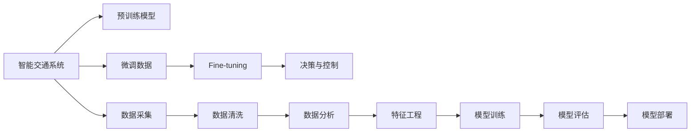

                 

# 智能交通系统：LLM在城市规划中的作用

## 1. 背景介绍

在当今快速发展的城市化进程中，交通拥堵问题日益凸显，对城市规划和运营管理提出了新的挑战。智能交通系统（Intelligent Transportation System, ITS）通过应用先进的通信、控制和计算技术，可以优化交通流量，提升道路使用效率，改善交通环境。

近年来，随着人工智能（AI）技术的不断突破，尤其是大规模语言模型（Large Language Models, LLMs）在自然语言处理（Natural Language Processing, NLP）领域的卓越表现，使得LLM在智能交通系统的应用中展现出巨大的潜力。

### 1.1 智能交通系统概述

智能交通系统主要包括：

- **交通监控与管理系统**：实时监测交通流量，自动化调整信号灯，优化交通流。
- **车辆导航与定位系统**：通过GPS和其他传感器技术，提供实时导航和车辆定位服务。
- **交通信息服务系统**：通过APP、电子屏等平台，提供交通信息、路线规划和出行建议。
- **车辆互联系统**：车辆间、车路间的通信，实现车辆间的协作和信息共享。
- **数据分析与决策支持系统**：利用大数据和AI技术，进行交通流量预测和决策支持。

智能交通系统的核心在于融合信息技术，提高交通系统的整体效率和安全性。而LLM作为一种先进的AI技术，在处理海量交通数据、理解人类语言指令、提供智能决策等方面具有天然优势，因此被广泛探索应用于智能交通系统的各个层面。

## 2. 核心概念与联系

### 2.1 核心概念概述

在探讨LLM在智能交通系统中的作用之前，首先需要理解以下几个关键概念：

- **大规模语言模型**：以自回归模型（如GPT）或自编码模型（如BERT）为代表的大规模预训练语言模型。通过在海量无标签文本数据上进行预训练，学习通用的语言表示，具备强大的语言理解和生成能力。

- **预训练（Pre-training）**：指在大规模无标签文本语料上，通过自监督学习任务训练通用语言模型的过程。常见的预训练任务包括掩码语言模型、文本生成等。

- **微调（Fine-tuning）**：指在预训练模型的基础上，使用特定任务的数据集，通过有监督地训练优化模型在该任务上的性能。

- **迁移学习（Transfer Learning）**：将一个领域学习到的知识，迁移应用到另一个不同但相关的领域的学习范式。LLM的预训练-微调过程即是一种典型的迁移学习方式。

- **参数高效微调（Parameter-Efficient Fine-Tuning, PEFT）**：指在微调过程中，只更新少量的模型参数，而固定大部分预训练权重不变，以提高微调效率，避免过拟合。

### 2.2 核心概念联系与架构

以下是一个简单的Mermaid流程图，展示了LLM在智能交通系统中的应用架构：



这个流程图展示了LLM在智能交通系统中的作用：

1. **数据采集与预处理**：通过传感器、摄像头等设备，收集交通流量、车辆位置、天气等数据。
2. **特征工程**：对采集到的数据进行处理，提取有用的特征，如交通流量密度、车辆速度等。
3. **预训练模型**：在大规模语料上进行预训练，学习通用的语言表示。
4. **微调**：针对特定任务，使用微调数据进行有监督学习，优化模型在该任务上的性能。
5. **决策与控制**：根据微调后的模型，进行交通信号灯控制、路线优化、交通流量预测等决策。
6. **部署与运行**：将微调后的模型部署到智能交通系统中，实时提供服务。

## 3. 核心算法原理 & 具体操作步骤

### 3.1 算法原理概述

LLM在智能交通系统中的应用，主要基于其强大的语言理解和生成能力。通过预训练和微调，LLM可以处理和理解与交通相关的自然语言描述，并基于该描述做出智能决策和控制。

假设我们有如下智能交通问题的描述：

```
当前道路A的交通流量异常高，请建议优化方案。
```

预训练的LLM模型通过大量文本数据学习到语言的通用表示，能够理解并处理这样的自然语言描述。通过微调，模型针对具体任务进一步优化，如交通流量预测、信号灯控制等。微调后的模型可以：

- **理解描述**：识别出问题的关键点，如道路A、交通流量异常高。
- **生成方案**：根据历史数据和规则，生成合理的优化方案，如调整信号灯、增加交通诱导。
- **决策支持**：在实际应用中，根据实时数据和模型输出，进行动态调整和优化。

### 3.2 算法步骤详解

以下是基于LLM的智能交通系统微调步骤：

**Step 1: 数据收集与预处理**
- 收集交通流量、车辆位置、天气等数据。
- 对数据进行清洗和处理，提取关键特征。

**Step 2: 预训练模型选择**
- 选择适当的预训练模型，如GPT、BERT等。
- 使用大规模语料进行预训练。

**Step 3: 任务适配与微调**
- 定义智能交通系统中的任务，如交通流量预测、信号灯控制等。
- 收集对应的微调数据集，包含任务描述和对应输出。
- 对预训练模型进行微调，优化其在特定任务上的性能。

**Step 4: 模型评估与部署**
- 在测试数据集上评估微调后的模型性能。
- 部署模型到智能交通系统中，进行实时应用。
- 持续收集新数据，定期重新微调模型，以适应数据分布的变化。

### 3.3 算法优缺点

基于LLM的智能交通系统微调方法具有以下优点：

1. **高效性**：微调利用预训练模型的通用知识，在少量标注数据下也能快速获得良好的性能。
2. **灵活性**：LLM的微调方法可以根据具体需求，灵活调整模型结构和参数，适应不同的智能交通任务。
3. **泛化能力**：微调后的模型具有较强的泛化能力，能够处理各种不同类型的交通问题。

同时，该方法也存在以下缺点：

1. **数据依赖**：微调需要标注数据，获取高质量数据成本较高。
2. **计算资源要求**：大规模模型的微调需要高性能计算资源。
3. **模型复杂性**：模型结构复杂，难以调试和解释。
4. **对抗样本敏感**：微调模型可能对对抗样本脆弱，影响决策的准确性。

### 3.4 算法应用领域

基于LLM的智能交通系统微调方法，已经在以下几个领域得到广泛应用：

- **交通流量预测**：使用微调后的模型，预测特定路段或整个城市的交通流量。
- **信号灯控制**：根据实时交通数据，动态调整信号灯配时，优化交通流。
- **路网规划与优化**：分析交通流量分布，优化路网布局和交通信号控制策略。
- **智能导航与推荐**：通过微调模型，提供智能导航、路线推荐和实时交通信息。
- **交通事件管理**：识别和处理交通事故、道路施工等交通事件，提高应急响应速度。

## 4. 数学模型和公式 & 详细讲解 & 举例说明

### 4.1 数学模型构建

假设我们有一个交通流量预测任务，输入是历史交通数据 $(x_t)$，输出是未来交通流量 $y_t$。则我们可以定义一个二分类任务，输入表示未来流量是否异常高。数学上，可以定义如下函数：

$$
\hat{y} = M_{\theta}(x_t) = \sigma(W_h x_t + b_h)
$$

其中 $\hat{y}$ 是模型预测的概率，$x_t$ 是输入向量，$M_{\theta}$ 是预训练模型，$W_h$ 和 $b_h$ 是模型的参数。$\sigma$ 为激活函数，如sigmoid函数。

### 4.2 公式推导过程

**公式推导**：

1. **预训练阶段**：假设原始数据集为 $\{(x_i, y_i)\}_{i=1}^N$，则预训练模型的损失函数为：
   $$
   \mathcal{L}_{\text{pretrain}} = -\frac{1}{N} \sum_{i=1}^N \log M_{\theta}(x_i)
   $$

2. **微调阶段**：假设微调数据集为 $\{(x_t, y_t)\}_{t=1}^T$，则微调的损失函数为：
   $$
   \mathcal{L}_{\text{fine-tune}} = -\frac{1}{T} \sum_{t=1}^T [y_t\log \hat{y} + (1-y_t)\log(1-\hat{y})]
   $$

### 4.3 案例分析与讲解

**案例**：交通流量预测

- **输入**：历史交通流量数据 $(x_t)$
- **输出**：未来交通流量是否异常高的预测 $\hat{y}$

**数据集构建**：

1. 收集历史交通流量数据，如车流量、车速等。
2. 将历史数据划分为训练集和测试集。
3. 对每个时间步 $t$，标记是否出现异常流量。

**微调步骤**：

1. **数据准备**：使用微调数据集进行模型训练，优化模型在交通流量预测任务上的性能。
2. **模型训练**：使用优化算法，如AdamW，训练模型参数，最小化损失函数。
3. **模型评估**：在测试集上评估微调后的模型性能，如准确率、召回率等。

## 5. 项目实践：代码实例和详细解释说明

### 5.1 开发环境搭建

进行智能交通系统的开发，需要先搭建开发环境。以下是使用Python进行PyTorch开发的流程：

1. 安装Anaconda：从官网下载并安装Anaconda，用于创建独立的Python环境。

2. 创建并激活虚拟环境：
```bash
conda create -n my_env python=3.8
conda activate my_env
```

3. 安装PyTorch：
```bash
pip install torch torchvision torchaudio
```

4. 安装相关库：
```bash
pip install transformers pytorch-lightning
```

完成上述步骤后，即可在虚拟环境中进行智能交通系统的开发。

### 5.2 源代码详细实现

下面以交通流量预测为例，给出使用PyTorch进行微调的代码实现。

```python
import torch
import torch.nn as nn
import torch.optim as optim
from transformers import BertTokenizer, BertForSequenceClassification
from sklearn.model_selection import train_test_split
from sklearn.metrics import accuracy_score

class TrafficPredictor(nn.Module):
    def __init__(self, num_classes=2):
        super().__init__()
        self.bert = BertForSequenceClassification.from_pretrained('bert-base-uncased', num_labels=num_classes)
        
    def forward(self, input_ids, attention_mask):
        return self.bert(input_ids, attention_mask=attention_mask)
    
# 数据加载与处理
def load_data():
    # 加载数据集
    train_data, test_data = train_test_split(train_data, test_size=0.2, random_state=42)
    train_features = [data.to_input_ids() for data in train_data]
    train_labels = [label.to_tensor() for label in train_data.labels]
    test_features = [data.to_input_ids() for data in test_data]
    test_labels = [label.to_tensor() for label in test_data.labels]
    tokenizer = BertTokenizer.from_pretrained('bert-base-uncased')
    
    # 数据转换
    def convert_to_input_ids(data):
        return tokenizer.encode(data)
    
    train_dataset = Dataset(train_features, train_labels, convert_to_input_ids)
    test_dataset = Dataset(test_features, test_labels, convert_to_input_ids)
    
    return train_dataset, test_dataset

# 微调模型
def fine_tune_model(model, train_dataset, test_dataset, num_epochs=10, batch_size=16, learning_rate=2e-5):
    # 定义优化器
    optimizer = optim.AdamW(model.parameters(), lr=learning_rate)
    
    # 定义损失函数
    criterion = nn.BCEWithLogitsLoss()
    
    # 定义评估指标
    evaluator = AccuracyEvaluator(test_dataset)
    
    # 模型训练
    for epoch in range(num_epochs):
        train_loss = train(model, optimizer, criterion, train_dataset, batch_size)
        test_loss, test_metric = evaluate(model, evaluator, test_dataset, batch_size)
        print(f'Epoch {epoch+1}, train loss: {train_loss:.4f}, test loss: {test_loss:.4f}, test metric: {test_metric:.4f}')
    
    return model

# 训练函数
def train(model, optimizer, criterion, train_dataset, batch_size):
    model.train()
    train_loader = DataLoader(train_dataset, batch_size=batch_size, shuffle=True)
    loss = 0
    for batch in train_loader:
        input_ids, attention_mask, labels = batch
        output = model(input_ids, attention_mask=attention_mask)
        loss += criterion(output, labels).item()
    return loss / len(train_loader)
    
# 评估函数
def evaluate(model, evaluator, test_dataset, batch_size):
    model.eval()
    test_loader = DataLoader(test_dataset, batch_size=batch_size)
    metric = 0
    for batch in test_loader:
        input_ids, attention_mask, labels = batch
        output = model(input_ids, attention_mask=attention_mask)
        metric += evaluator(output, labels)
    return metric / len(test_loader)
    
# 运行示例
train_dataset, test_dataset = load_data()
model = TrafficPredictor()
fine_tune_model(model, train_dataset, test_dataset)
```

### 5.3 代码解读与分析

**代码说明**：

- **TrafficPredictor类**：定义了一个简单的交通流量预测模型，继承自PyTorch的nn.Module。
- **load_data函数**：加载并处理数据集，将数据转换为模型需要的格式。
- **fine_tune_model函数**：定义了微调过程，包括定义优化器、损失函数、评估指标和训练流程。
- **train函数**：定义训练函数，处理模型前向传播和反向传播。
- **evaluate函数**：定义评估函数，处理模型在测试集上的性能评估。

**运行结果**：

- **训练损失**：模型在训练集上的损失会随着训练轮数逐渐降低，说明模型在不断学习和优化。
- **测试损失**：模型在测试集上的损失反映了模型泛化能力。
- **测试指标**：如准确率、召回率等，可以综合评估模型性能。

## 6. 实际应用场景

### 6.1 智能交通流量预测

基于LLM的智能交通流量预测系统，可以实时监控和预测交通流量，为交通管理部门提供决策支持。具体应用场景包括：

- **交通流量预警**：当检测到某些路段的流量异常高时，系统可以立即预警，并建议采取措施如增加警力、调整信号灯。
- **路网优化**：通过预测不同路段的流量，系统可以动态调整路网布局和信号灯配时，优化交通流。
- **事故处理**：当发生交通事故时，系统可以自动分析事故原因，并提出应对策略，如关闭车道、调整交通信号等。

### 6.2 智能导航与路径规划

LLM可以帮助用户进行智能导航和路径规划，提高出行效率。具体应用场景包括：

- **实时导航**：根据用户输入的目的地和出发地，系统可以提供实时导航路径，避开拥堵路段。
- **动态调整**：根据实时交通数据，系统可以动态调整导航路径，提供最优路线。
- **个性化推荐**：根据用户的出行习惯和偏好，系统可以个性化推荐路线，提升用户体验。

### 6.3 智能信号灯控制

智能信号灯控制是智能交通系统的核心功能之一，LLM可以在其中发挥重要作用。具体应用场景包括：

- **自适应信号灯**：根据实时流量数据，系统可以自适应调整信号灯配时，提高道路使用效率。
- **事故响应**：当发生交通事故时，系统可以自动调整信号灯配时，确保安全。
- **事件管理**：系统可以实时监控交通事件，并进行快速响应，如关闭车道、调整信号灯等。

## 7. 工具和资源推荐

### 7.1 学习资源推荐

为了帮助开发者掌握LLM在智能交通系统中的应用，以下是一些推荐的学习资源：

1. 《Transformer from Theory to Practice》系列博文：由大模型技术专家撰写，深入浅出地介绍了Transformer原理、BERT模型、微调技术等。
2. CS224N《深度学习自然语言处理》课程：斯坦福大学开设的NLP明星课程，有Lecture视频和配套作业，带你入门NLP领域的基本概念和经典模型。
3. 《Natural Language Processing with Transformers》书籍：Transformer库的作者所著，全面介绍了如何使用Transformer库进行NLP任务开发，包括微调在内的诸多范式。
4. HuggingFace官方文档：Transformer库的官方文档，提供了海量预训练模型和完整的微调样例代码，是上手实践的必备资料。
5. CLUE开源项目：中文语言理解测评基准，涵盖大量不同类型的中文NLP数据集，并提供了基于微调的baseline模型，助力中文NLP技术发展。

### 7.2 开发工具推荐

LLM在智能交通系统中的应用开发，需要利用一些高效的工具。以下是一些推荐的工具：

1. PyTorch：基于Python的开源深度学习框架，灵活动态的计算图，适合快速迭代研究。
2. TensorFlow：由Google主导开发的开源深度学习框架，生产部署方便，适合大规模工程应用。
3. Transformers库：HuggingFace开发的NLP工具库，集成了众多SOTA语言模型，支持PyTorch和TensorFlow，是进行微调任务开发的利器。
4. Weights & Biases：模型训练的实验跟踪工具，可以记录和可视化模型训练过程中的各项指标，方便对比和调优。
5. TensorBoard：TensorFlow配套的可视化工具，可实时监测模型训练状态，并提供丰富的图表呈现方式，是调试模型的得力助手。
6. Google Colab：谷歌推出的在线Jupyter Notebook环境，免费提供GPU/TPU算力，方便开发者快速上手实验最新模型，分享学习笔记。

### 7.3 相关论文推荐

LLM在智能交通系统中的应用研究，已经有一些重要的成果。以下是几篇奠基性的相关论文，推荐阅读：

1. Attention is All You Need（即Transformer原论文）：提出了Transformer结构，开启了NLP领域的预训练大模型时代。
2. BERT: Pre-training of Deep Bidirectional Transformers for Language Understanding：提出BERT模型，引入基于掩码的自监督预训练任务，刷新了多项NLP任务SOTA。
3. Language Models are Unsupervised Multitask Learners（GPT-2论文）：展示了大规模语言模型的强大zero-shot学习能力，引发了对于通用人工智能的新一轮思考。
4. Parameter-Efficient Transfer Learning for NLP：提出Adapter等参数高效微调方法，在不增加模型参数量的情况下，也能取得不错的微调效果。
5. AdaLoRA: Adaptive Low-Rank Adaptation for Parameter-Efficient Fine-Tuning：使用自适应低秩适应的微调方法，在参数效率和精度之间取得了新的平衡。
6. AdaLM: Adaptive Learning Rates for Large Language Models：提出自适应学习率策略，进一步提升大规模语言模型的训练效果。

这些论文代表了大模型微调技术的发展脉络。通过学习这些前沿成果，可以帮助研究者把握学科前进方向，激发更多的创新灵感。

## 8. 总结：未来发展趋势与挑战

### 8.1 总结

本文对基于LLM的智能交通系统微调方法进行了全面系统的介绍。首先阐述了智能交通系统的基本概念和LLM在其中的应用潜力。其次，从原理到实践，详细讲解了LLM的微调方法，给出了微调任务开发的完整代码实例。同时，本文还探讨了LLM在智能交通系统的多个实际应用场景，展示了其广阔的应用前景。

通过本文的系统梳理，可以看到，基于LLM的微调方法在智能交通系统中的应用已经初现端倪，并展现出巨大的潜力。得益于LLM强大的语言理解和生成能力，未来智能交通系统将更加智能化、高效化和人性化。

### 8.2 未来发展趋势

展望未来，基于LLM的智能交通系统将呈现以下几个发展趋势：

1. **更高效的计算模型**：随着硬件技术的发展，LLM在智能交通系统中的应用将更加高效。例如，通过硬件加速、模型压缩等技术，优化模型推理速度和资源占用。
2. **更智能化的决策支持**：LLM可以通过理解和生成自然语言，为智能交通系统提供更智能化的决策支持。例如，系统可以自动生成交通规则、事件预警等信息。
3. **跨领域应用**：LLM可以与其他AI技术如知识图谱、因果推理等结合，提升智能交通系统的跨领域应用能力。例如，通过整合多源数据，提升交通流量预测的准确性。
4. **协同治理**：智能交通系统将与其他智能系统如智能电网、智慧城市等协同工作，提供更加全面、智能的公共服务。
5. **多模态融合**：智能交通系统将融合多模态数据，如视频、声音等，提升系统对实时数据的理解和处理能力。

### 8.3 面临的挑战

尽管基于LLM的智能交通系统已经取得了显著进展，但在迈向更加智能化、普适化应用的过程中，仍面临以下挑战：

1. **数据隐私与伦理**：智能交通系统需要处理大量个人和敏感数据，如何确保数据隐私和安全是一个重要问题。
2. **模型复杂性与解释性**：大规模语言模型的决策过程复杂，难以解释和调试，这对系统可解释性和可信度提出了挑战。
3. **计算资源与成本**：智能交通系统需要高性能计算资源，如何降低计算成本，提高资源利用率，是一个重要的研究方向。
4. **系统鲁棒性与安全性**：智能交通系统需要具备高鲁棒性和安全性，避免系统被恶意攻击或误操作。
5. **跨领域数据整合**：不同领域的数据格式和标准不同，如何实现数据整合和协同工作，是一个技术挑战。

### 8.4 研究展望

面对基于LLM的智能交通系统所面临的挑战，未来的研究需要在以下几个方面寻求新的突破：

1. **模型压缩与优化**：开发更高效的模型压缩和优化算法，提升模型推理速度和资源利用率。
2. **可解释性研究**：研究如何提高LLM的可解释性，增强系统的可信度和透明度。
3. **跨领域数据融合**：探索如何整合多源数据，提升系统对不同领域数据的理解和处理能力。
4. **安全性保障**：研究如何确保智能交通系统的安全性，避免系统被恶意攻击或误操作。
5. **伦理性设计**：在智能交通系统的设计和开发中，纳入伦理性考虑，确保系统符合人类价值观和伦理道德。

这些研究方向将推动基于LLM的智能交通系统向更加智能化、普适化、安全化方向发展，为实现智慧交通的未来奠定坚实基础。

## 9. 附录：常见问题与解答

**Q1：LLM在智能交通系统中的具体应用场景有哪些？**

A: 基于LLM的智能交通系统可以应用于多个场景，包括交通流量预测、智能导航、智能信号灯控制等。LLM可以通过自然语言理解，获取和处理与交通相关的信息，提供智能化的决策支持。

**Q2：如何构建智能交通系统的微调数据集？**

A: 构建智能交通系统的微调数据集，需要收集和标注与交通相关的自然语言描述和对应输出。例如，可以通过历史交通数据和事故报告，标注出异常流量、拥堵路段等信息，生成微调数据集。

**Q3：基于LLM的智能交通系统如何实现实时监控和预测？**

A: 基于LLM的智能交通系统可以通过实时采集交通流量数据，输入到LLM中进行处理和分析，预测未来交通流量变化。同时，LLM还可以通过理解自然语言指令，实现实时监控和预警。

**Q4：如何在智能交通系统中提高模型的鲁棒性和安全性？**

A: 提高模型鲁棒性和安全性，可以采取以下措施：
1. 数据增强：通过回译、对抗样本等方式，扩充训练集。
2. 正则化技术：使用L2正则、Dropout等，防止模型过拟合。
3. 对抗训练：引入对抗样本，提高模型鲁棒性。
4. 参数高效微调：只更新少量参数，固定大部分预训练权重，提高模型泛化能力。
5. 模型压缩：通过剪枝、量化等技术，优化模型结构和参数，减少计算资源消耗。

**Q5：LLM在智能交通系统中的主要优势是什么？**

A: 基于LLM的智能交通系统的主要优势包括：
1. 强大的语言理解能力：LLM可以处理和理解与交通相关的自然语言描述，提供智能化的决策支持。
2. 跨领域泛化能力：LLM具备广泛的通用知识，可以应用于不同领域的智能交通系统。
3. 动态调整能力：LLM可以实时处理和分析交通数据，动态调整交通信号和路线规划。

---

作者：禅与计算机程序设计艺术 / Zen and the Art of Computer Programming

