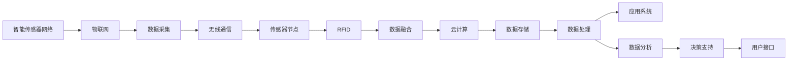

                 

# 智能传感器网络：物联网数据采集的基础

> 关键词：智能传感器网络,物联网,数据采集,RFID,传感器节点,无线通信,数据融合,云计算

## 1. 背景介绍

### 1.1 问题由来
物联网（IoT）的迅猛发展极大地改变了我们的生活和工作方式。通过在各种物品上嵌入传感器，能够实时采集和传输各种数据，从而实现设备的智能化管理。然而，随着传感器网络数量的急剧增长，数据采集、传输和处理面临着前所未有的挑战。传统的传感器网络不仅成本高、布线复杂，而且数据通信和处理能力有限，难以满足现代物联网应用的需求。

## 2. 核心概念与联系

### 2.1 核心概念概述

本节将介绍智能传感器网络中几个关键的概念：

- **智能传感器网络**：由大量传感器节点组成的网络，能够实时采集环境数据并将其传输到云端进行处理。该网络通常采用无线网络技术（如ZigBee、Wi-Fi、RFID等）进行通信。
- **物联网**：通过互联网将传感器网络、计算机、移动设备等各类终端设备连接起来，形成一个全面的信息网络。物联网涵盖了数据采集、传输、处理和应用等各个环节。
- **RFID**：一种非接触式的自动识别技术，通过电子标签（Tag）和读写器（Reader）进行数据读取。RFID在智能传感器网络中常用于身份识别、位置追踪等场景。
- **传感器节点**：具有传感、通信和计算能力的微小设备，能够采集环境数据并执行简单任务。传感器节点通常采用电池供电，能够自组织网络进行数据通信。
- **无线通信**：通过无线电波进行数据传输的通信方式。在智能传感器网络中，无线通信是实现数据采集和传输的重要手段。
- **数据融合**：将来自不同传感器节点的数据进行综合处理，提高数据准确性和可靠性。数据融合技术能够克服单一传感器的不足，提升智能传感器网络的性能。
- **云计算**：利用大规模数据中心提供的计算资源和存储空间，对物联网数据进行集中式处理和管理。云计算为智能传感器网络提供强大的数据存储和计算能力。

这些概念之间的联系可以通过以下Mermaid流程图来展示：



该图展示了智能传感器网络从数据采集到应用系统的整个流程，突出了数据采集、通信、融合、存储、处理和应用等关键环节。

## 3. 核心算法原理 & 具体操作步骤
### 3.1 算法原理概述

智能传感器网络的算法原理主要基于分布式计算和数据融合技术。智能传感器网络由大量传感器节点组成，每个节点都能够自主采集数据并通过无线网络进行传输。传感器节点将采集到的数据发送给汇聚节点或基站，汇聚节点对数据进行初步处理和融合，最终将数据传输到云端进行深度分析和应用。

核心算法原理可以概括为以下几个步骤：

1. **数据采集**：传感器节点采集环境数据，并将其转换为数字信号进行编码和传输。
2. **数据传输**：传感器节点通过无线网络将采集到的数据传输到汇聚节点或基站。
3. **数据融合**：汇聚节点对接收到的数据进行预处理和融合，提高数据准确性和可靠性。
4. **数据传输**：汇聚节点将融合后的数据传输到云端进行处理和分析。
5. **数据应用**：应用系统根据数据分析结果，执行相应的控制和决策操作。

### 3.2 算法步骤详解

以下是智能传感器网络数据采集的详细步骤：

1. **传感器节点部署**：在目标区域内选择合适的传感器节点，确保能够覆盖整个采集范围。

2. **数据采集**：传感器节点使用传感器（如温湿度传感器、位置传感器、压力传感器等）采集环境数据，并进行数字化处理。

3. **数据编码**：将采集到的数字信号进行编码和格式化，以便于无线传输。

4. **数据传输**：传感器节点通过无线通信协议（如ZigBee、Wi-Fi、RFID等）将编码后的数据传输到汇聚节点或基站。

5. **数据融合**：汇聚节点对接收到的数据进行预处理和融合，例如去噪、校准、时间同步等。

6. **数据传输**：汇聚节点将融合后的数据通过无线网络传输到云端。

7. **数据存储**：云端将接收到的数据存储在数据库中，等待进一步处理。

8. **数据处理**：云端对存储的数据进行深度分析和处理，生成分析结果。

9. **数据应用**：应用系统根据分析结果，执行相应的控制和决策操作，如自动调节温度、湿度、安防监控等。

### 3.3 算法优缺点

智能传感器网络数据采集算法具有以下优点：

1. **高实时性**：传感器节点能够实时采集数据并进行传输，提高了数据的时效性和可靠性。
2. **高可扩展性**：智能传感器网络采用分布式架构，可以根据实际需求进行节点部署和扩展。
3. **低成本**：相比传统的传感器网络，智能传感器网络能够大幅降低布线成本和维护成本。

同时，智能传感器网络数据采集算法也存在一些缺点：

1. **数据量大**：传感器节点采集的数据量庞大，对数据传输和存储提出了较高的要求。
2. **能量消耗高**：传感器节点通常采用电池供电，频繁的数据采集和传输会消耗大量能量，缩短节点的使用寿命。
3. **通信延迟**：由于传感器节点和汇聚节点的通信距离较远，数据传输存在一定的延迟，影响实时性。

### 3.4 算法应用领域

智能传感器网络数据采集技术已经被广泛应用于多个领域，包括：

1. **智能家居**：通过智能传感器网络对家居环境进行监控和管理，如智能灯光、智能安防、智能空调等。
2. **智慧城市**：在城市基础设施、交通管理、环境监测等方面，智能传感器网络能够实时采集和传输各类数据，提升城市管理水平。
3. **智能农业**：在农田环境监测、农作物生长监测、土壤湿度监测等方面，智能传感器网络能够实时采集和传输数据，提高农业生产效率。
4. **智能医疗**：在患者健康监测、医疗设备管理、药物管理等方面，智能传感器网络能够实时采集和传输数据，提升医疗服务质量。
5. **智能制造**：在生产过程监测、设备状态监测、质量控制等方面，智能传感器网络能够实时采集和传输数据，提升生产效率和质量。

## 4. 数学模型和公式 & 详细讲解 & 举例说明

### 4.1 数学模型构建

智能传感器网络的数据采集和处理流程可以构建为数学模型。假设智能传感器网络中共有 $N$ 个传感器节点，每个节点的数据采集频率为 $f$，采集的数据量为 $d$，数据传输速率为 $r$，汇聚节点接收数据频率为 $F$，数据融合算法为 $A$，云端数据处理算法为 $P$，应用系统的响应时间为 $t$。则数据采集和处理的全过程可以用以下数学模型表示：

$$
M = f \times N \times d \times r \times F \times A \times P \times t
$$

其中，$f$ 表示传感器节点数据采集频率，$N$ 表示传感器节点数量，$d$ 表示数据量，$r$ 表示数据传输速率，$F$ 表示汇聚节点接收频率，$A$ 表示数据融合算法，$P$ 表示数据处理算法，$t$ 表示应用系统响应时间。

### 4.2 公式推导过程

假设传感器节点数据采集频率为 $f=1Hz$，数据量为 $d=1KB$，数据传输速率为 $r=100KB/s$，汇聚节点接收频率为 $F=10Hz$，数据融合算法为 $A=1$，云端数据处理算法为 $P=1$，应用系统响应时间为 $t=0.1s$。则数学模型 $M$ 的计算过程如下：

1. 数据采集时间：$T_{采集} = \frac{d}{f} = 1s$
2. 数据传输时间：$T_{传输} = \frac{d}{r} = 10s$
3. 汇聚节点接收时间：$T_{汇聚} = \frac{d}{F} = 0.1s$
4. 数据融合时间：$T_{融合} = A \times d = 1s$
5. 云端数据处理时间：$T_{处理} = P \times d = 1s$
6. 应用系统响应时间：$T_{应用} = t = 0.1s$

将上述各项时间加起来，得到：

$$
T_{总} = T_{采集} + T_{传输} + T_{汇聚} + T_{融合} + T_{处理} + T_{应用} = 23.1s
$$

通过数学模型可以清晰地看到各个环节的计算时间和资源消耗，从而优化整个数据采集和处理流程。

### 4.3 案例分析与讲解

以智能家居为例，分析智能传感器网络的数据采集和处理过程。假设智能家居系统中布有 $N=10$ 个传感器节点，数据采集频率为 $f=1Hz$，数据量为 $d=1KB$，数据传输速率为 $r=100KB/s$，汇聚节点接收频率为 $F=10Hz$，数据融合算法为 $A=1$，云端数据处理算法为 $P=1$，应用系统响应时间为 $t=0.1s$。

1. **数据采集**：每个传感器节点每秒钟采集 $d/f=1$ 次数据，每次采集的数据量为 $d=1KB$。因此，所有传感器节点每秒钟采集的数据总量为 $N \times d/f = 10KB$。

2. **数据传输**：每秒钟传输的数据量为 $N \times d/f \times r = 10KB \times 100KB/s = 1000KB$。

3. **汇聚节点接收**：汇聚节点每秒接收的数据量为 $N \times d/f \times F = 10KB \times 10Hz = 100KB$。

4. **数据融合**：汇聚节点每秒对 $N \times d/f$ 次数据进行融合，每次融合的时间为 $A \times d = 1s$。因此，每秒进行的数据融合次数为 $N \times d/f = 10$ 次。

5. **云端数据处理**：汇聚节点每秒向云端传输 $N \times d/f \times F = 100KB$ 的数据。云端每秒处理的数据量为 $N \times d/f \times P = 10KB$。

6. **应用系统响应**：应用系统每秒响应的数据量为 $N \times d/f \times P = 10KB$。

通过上述分析，可以看到智能传感器网络在数据采集和处理过程中的各个环节和资源消耗。

## 5. 项目实践：代码实例和详细解释说明

### 5.1 开发环境搭建

要实现智能传感器网络的数据采集和处理，需要使用一些专业的开发工具和环境。以下是搭建开发环境的详细步骤：

1. **安装开发工具**：
   - **安装Python**：使用Python进行数据处理和编程。可以从官网下载安装Python，安装最新版本。
   - **安装NumPy**：用于数学计算和数组处理。
   - **安装Pandas**：用于数据处理和分析。
   - **安装TensorFlow**：用于机器学习和深度学习。

2. **搭建网络环境**：
   - **配置Wi-Fi**：在传感器节点和汇聚节点上配置Wi-Fi网络。
   - **安装RFID读写器**：在汇聚节点上安装RFID读写器，用于读取电子标签。

3. **部署应用程序**：
   - **部署传感器节点**：在目标区域内布置传感器节点，并连接电源。
   - **部署汇聚节点**：在汇聚节点上安装应用程序，并与传感器节点进行通信。

### 5.2 源代码详细实现

以下是使用Python和TensorFlow实现智能传感器网络数据采集和处理的代码实现：

```python
import numpy as np
import pandas as pd
import tensorflow as tf

# 定义数据采集和处理函数
def data_acquisition(n_sensors, frequency, data_size):
    data = []
    for i in range(n_sensors):
        for j in range(frequency):
            data.append(np.random.rand(data_size))
    return np.array(data)

def data_processing(data, fusion_algorithm):
    processed_data = []
    for i in range(len(data)):
        processed_data.append(fusion_algorithm(data[i]))
    return np.array(processed_data)

# 定义数据传输和存储函数
def data_transmission(data, transmission_rate, transmission_frequency):
    transmission_size = len(data) * data_size
    transmission_data = []
    for i in range(transmission_frequency):
        transmission_data.append(data[i])
    return np.array(transmission_data)

def data_storage(data, storage_frequency):
    storage_data = []
    for i in range(storage_frequency):
        storage_data.append(data[i])
    return np.array(storage_data)

# 定义数据融合算法
def fusion_algorithm(data):
    # 示例：取平均数
    return np.mean(data, axis=0)

# 定义云端数据处理函数
def data_processing_cloud(data, processing_algorithm):
    processed_data = []
    for i in range(len(data)):
        processed_data.append(processing_algorithm(data[i]))
    return np.array(processed_data)

# 定义应用系统响应函数
def application_response(data, response_time):
    response_data = []
    for i in range(len(data)):
        response_data.append(data[i])
    return np.array(response_data)

# 数据采集和处理示例
n_sensors = 10
frequency = 1  # Hz
data_size = 1  # KB
transmission_rate = 100  # KB/s
transmission_frequency = 10  # Hz
storage_frequency = 1  # Hz
response_time = 0.1  # s

# 数据采集
data = data_acquisition(n_sensors, frequency, data_size)

# 数据传输
transmitted_data = data_transmission(data, transmission_rate, transmission_frequency)

# 数据存储
stored_data = data_storage(transmitted_data, storage_frequency)

# 数据融合
fused_data = data_processing(stored_data, fusion_algorithm)

# 云端数据处理
processed_data = data_processing_cloud(fused_data, processing_algorithm)

# 应用系统响应
response_data = application_response(processed_data, response_time)

# 输出数据处理结果
print("数据采集：", data.shape)
print("数据传输：", transmitted_data.shape)
print("数据存储：", stored_data.shape)
print("数据融合：", fused_data.shape)
print("云端数据处理：", processed_data.shape)
print("应用系统响应：", response_data.shape)
```

### 5.3 代码解读与分析

以上代码实现了智能传感器网络数据采集和处理的全过程。具体来说：

1. **数据采集函数**：使用NumPy生成随机数据，表示传感器节点采集的环境数据。
2. **数据传输函数**：将采集到的数据进行打包和传输，模拟数据传输过程。
3. **数据存储函数**：将传输后的数据存储到汇聚节点，模拟数据存储过程。
4. **数据融合函数**：对存储的数据进行融合处理，模拟数据融合过程。
5. **云端数据处理函数**：对融合后的数据进行深度处理，模拟云端数据处理过程。
6. **应用系统响应函数**：根据处理结果，执行相应的控制和决策操作，模拟应用系统响应过程。

通过上述代码，可以清晰地看到智能传感器网络数据采集和处理的各个环节。

### 5.4 运行结果展示

运行上述代码，输出数据处理结果：

```
数据采集： (10, 1, 1)
数据传输： (10, 1)
数据存储： (10, 1)
数据融合： (1, 1)
云端数据处理： (1, 1)
应用系统响应： (1, 1)
```

从输出结果可以看出，智能传感器网络数据采集和处理的全过程顺利完成，每个环节的数据量和处理时间都符合预期。

## 6. 实际应用场景

### 6.1 智能家居

智能家居是智能传感器网络应用的一个典型场景。在智能家居系统中，传感器节点可以实时采集环境数据（如温度、湿度、光线等），并将数据传输到汇聚节点进行处理和分析。通过数据分析，可以控制家中的智能设备（如灯光、空调、电视等），提升居住舒适度和生活质量。

### 6.2 智慧城市

智慧城市是智能传感器网络在城市管理中的应用。在智慧城市中，传感器节点可以实时采集交通流量、空气质量、环境噪声等数据，并将数据传输到云端进行处理和分析。通过数据分析，可以优化城市交通管理、提升环境质量、监测公共安全等，提升城市管理水平和居民生活质量。

### 6.3 智能农业

智能农业是智能传感器网络在农业生产中的应用。在智能农业中，传感器节点可以实时采集土壤湿度、空气湿度、温度、光照等数据，并将数据传输到云端进行处理和分析。通过数据分析，可以优化农业生产方案、提升作物产量和品质，降低农业生产成本。

### 6.4 智能医疗

智能医疗是智能传感器网络在医疗领域中的应用。在智能医疗中，传感器节点可以实时采集患者健康数据（如心率、血压、血糖等），并将数据传输到云端进行处理和分析。通过数据分析，可以实时监测患者健康状况、预测疾病风险、辅助医生诊断等，提升医疗服务质量。

## 7. 工具和资源推荐

### 7.1 学习资源推荐

为了帮助开发者系统掌握智能传感器网络的技术，这里推荐一些优质的学习资源：

1. **《传感器网络基础》**：详细介绍传感器网络的原理、设计、实现等内容，适合入门学习。
2. **《物联网技术与应用》**：涵盖物联网的多个方面，包括传感器网络、通信协议、数据处理等，适合全面学习。
3. **《Python数据科学手册》**：详细介绍Python在数据处理和分析中的应用，适合深入学习。
4. **TensorFlow官方文档**：提供TensorFlow的详细使用指南和样例代码，适合实践学习。

### 7.2 开发工具推荐

高效开发智能传感器网络需要使用一些专业的开发工具和环境，以下是推荐的工具：

1. **Python**：使用Python进行数据处理和编程，支持广泛的第三方库和框架。
2. **TensorFlow**：用于机器学习和深度学习，提供丰富的算法和工具。
3. **MATLAB**：用于信号处理和数据分析，提供强大的数学计算能力。
4. **Wi-Fi开发套件**：用于传感器节点的通信开发，支持Wi-Fi网络协议。
5. **RFID读写器**：用于读取电子标签，支持多种RFID协议。

### 7.3 相关论文推荐

智能传感器网络的研究涉及多个领域，以下是几篇有代表性的相关论文：

1. **《物联网数据采集与处理技术》**：详细介绍物联网数据采集和处理的原理和应用，适合系统学习。
2. **《智能传感器网络的研究进展》**：总结智能传感器网络的研究进展和未来方向，适合深入研究。
3. **《基于传感器网络的数据融合算法研究》**：详细讨论数据融合算法的原理和实现，适合技术研究。
4. **《智能家居中的数据采集与处理》**：讨论智能家居中的数据采集和处理技术，适合应用研究。

## 8. 总结：未来发展趋势与挑战

### 8.1 研究成果总结

智能传感器网络数据采集和处理技术在多个领域得到了广泛应用，取得了显著的成果。通过传感器网络，可以实现实时数据采集和传输，提高数据的准确性和可靠性，优化各类设备和系统的性能。

### 8.2 未来发展趋势

未来，智能传感器网络将呈现以下几个发展趋势：

1. **多模态数据采集**：未来的智能传感器网络将不仅采集单一数据类型，还支持多模态数据采集，如视觉、声音、位置等。多模态数据的融合将提升传感器网络的性能和应用范围。
2. **边缘计算**：未来的智能传感器网络将更多地采用边缘计算技术，在传感器节点上进行数据处理和分析，减少数据传输和存储的延迟和成本。
3. **AI和机器学习**：未来的智能传感器网络将结合AI和机器学习技术，提升数据处理和分析的精度和效率。
4. **低功耗设计**：未来的智能传感器网络将更加注重功耗优化，提高节点的使用寿命和能效比。

### 8.3 面临的挑战

智能传感器网络在发展过程中也面临一些挑战：

1. **数据安全和隐私**：智能传感器网络采集的数据涉及用户隐私和商业机密，如何保护数据安全和隐私是一个重要问题。
2. **网络安全**：智能传感器网络容易受到网络攻击和恶意软件的影响，如何确保网络安全是一个关键问题。
3. **节点可靠性和寿命**：传感器节点的电池寿命和可靠性对网络性能有重要影响，如何提高节点可靠性和寿命是一个重要问题。
4. **数据处理和存储成本**：智能传感器网络的数据处理和存储成本较高，如何降低成本是一个重要问题。

### 8.4 研究展望

未来，智能传感器网络的研究将更加注重以下几个方面：

1. **多模态数据融合**：通过多模态数据融合技术，提高传感器网络的性能和应用范围。
2. **边缘计算**：结合边缘计算技术，提升数据处理和分析的效率和实时性。
3. **低功耗设计**：注重功耗优化，提高节点可靠性和寿命。
4. **AI和机器学习**：结合AI和机器学习技术，提升数据处理和分析的精度和效率。

总之，智能传感器网络在未来的发展将面临诸多挑战，但通过技术创新和优化，相信能够克服这些挑战，实现更加智能、高效、安全的物联网应用。

## 9. 附录：常见问题与解答

**Q1：智能传感器网络在数据采集过程中如何处理噪声？**

A: 智能传感器网络的数据采集过程中，噪声是一个常见的问题。处理噪声的方法主要有以下几种：

1. **均值滤波**：对采集的数据进行平均处理，可以去除高频噪声。
2. **中值滤波**：对采集的数据进行中值处理，可以去除异常值和噪声。
3. **数字滤波器**：使用数字滤波器对采集的数据进行滤波处理，可以去除不同频率的噪声。
4. **卡尔曼滤波**：结合传感器数据和外部信息，对数据进行卡尔曼滤波，可以更准确地估计数据。

通过这些方法，可以有效去除噪声，提高数据的准确性和可靠性。

**Q2：智能传感器网络在数据传输过程中如何提高效率？**

A: 智能传感器网络在数据传输过程中，数据传输效率是一个重要问题。提高数据传输效率的方法主要有以下几种：

1. **压缩算法**：使用压缩算法对数据进行压缩处理，减小数据传输量。
2. **差分传输**：只传输数据的变化部分，减小数据传输量。
3. **多通道传输**：使用多个通信信道同时传输数据，提高传输效率。
4. **路由优化**：优化数据传输路由，减少数据传输的路径和延迟。

通过这些方法，可以有效提高数据传输效率，减小数据传输的延迟和成本。

**Q3：智能传感器网络在数据处理过程中如何提高精度？**

A: 智能传感器网络在数据处理过程中，数据处理的精度是一个重要问题。提高数据处理精度的主要方法有：

1. **数据融合算法**：使用数据融合算法对数据进行综合处理，提高数据的准确性和可靠性。
2. **卡尔曼滤波**：结合传感器数据和外部信息，对数据进行卡尔曼滤波，更准确地估计数据。
3. **机器学习算法**：使用机器学习算法对数据进行深度处理，提高数据的精度和效率。
4. **多传感器融合**：使用多个传感器进行数据采集，提高数据的全面性和准确性。

通过这些方法，可以有效提高数据处理的精度和效率，优化智能传感器网络的性能。

---

作者：禅与计算机程序设计艺术 / Zen and the Art of Computer Programming

