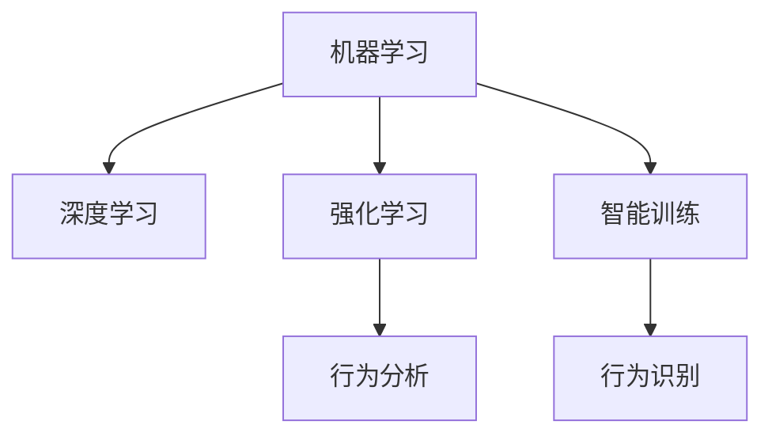

                 

# 智能宠物训练创业：AI辅助的宠物教育

> 关键词：AI辅助,宠物教育,智能训练,行为分析,机器学习,深度学习

## 1. 背景介绍

### 1.1 问题由来
近年来，随着科技的进步和人们生活水平的提高，越来越多的人选择饲养宠物，以满足精神上的陪伴和情感上的需求。然而，如何科学、有效地训练宠物，成为了许多主人面临的挑战。传统的训练方法往往依赖经验和本能，耗时耗力，效果不佳。而随着人工智能技术的飞速发展，利用AI技术辅助宠物教育成为可能。

### 1.2 问题核心关键点
AI辅助宠物教育的核心在于利用机器学习和深度学习等技术，通过智能训练和行为分析，帮助宠物快速掌握各类技能和行为习惯。这不仅提高了训练的效率和效果，还为宠物主人的日常生活带来了便利。

## 2. 核心概念与联系

### 2.1 核心概念概述

为更好地理解AI辅助宠物教育的原理和架构，本节将介绍几个关键概念：

- 机器学习(Machine Learning, ML)：通过数据训练模型，使其具备预测、分类、回归等能力。
- 深度学习(Deep Learning, DL)：基于神经网络，能够处理更为复杂的非线性问题，广泛应用于计算机视觉、自然语言处理等领域。
- 强化学习(Reinforcement Learning, RL)：通过智能体与环境交互，不断优化行为策略，达到特定目标。
- 智能训练(Training Intelligence)：利用AI技术辅助训练，使训练过程更加高效和精准。
- 行为分析(Behavior Analysis)：通过数据分析和模型预测，理解宠物的行为模式和心理状态，进行个性化训练。
- 宠物行为识别(Pet Behavior Recognition)：利用计算机视觉等技术，自动识别宠物的行为动作，实现行为跟踪和分析。

这些核心概念之间的逻辑关系可以通过以下Mermaid流程图来展示：



这个流程图展示了一系列关键技术之间的联系：

1. 机器学习提供基础训练方法，帮助模型获取一般性知识。
2. 深度学习处理高维度数据，提升模型复杂性。
3. 强化学习通过交互反馈，优化模型行为策略。
4. 智能训练结合多种技术，提升训练效果。
5. 行为分析基于深度学习，理解宠物行为。
6. 行为识别使用计算机视觉，实现行为数据采集。

这些概念共同构成了AI辅助宠物教育的核心技术框架，为其高效、精准的训练提供了强有力的支持。

## 3. 核心算法原理 & 具体操作步骤
### 3.1 算法原理概述

AI辅助宠物教育的本质是一个多模态、多任务的学习过程。其核心思想是：利用传感器和摄像头等设备采集宠物的行为数据，通过深度学习模型进行行为识别和行为分析，然后根据分析结果设计个性化的训练任务，最终利用强化学习技术不断调整训练策略，使得宠物逐步掌握各类技能。

形式化地，假设我们有一个多模态的行为数据集 $\mathcal{D}=\{(x_i, y_i)\}_{i=1}^N$，其中 $x_i$ 为行为数据（包括视频、图像等），$y_i$ 为行为标签（如行走、跳跃、坐下等）。我们希望通过训练得到一个行为识别模型 $f(x)$，使得 $f(x_i) \approx y_i$。同时，我们还需要根据行为识别结果，设计训练任务 $t$，利用强化学习模型 $g(t)$，不断优化训练策略，以提升宠物的训练效果。

### 3.2 算法步骤详解

AI辅助宠物教育的具体操作步骤可以分为以下几个阶段：

**Step 1: 数据采集与预处理**
- 利用传感器和摄像头等设备，采集宠物的行为数据。
- 对数据进行去噪、归一化等预处理操作，确保数据质量。

**Step 2: 行为识别模型训练**
- 选择合适的深度学习模型（如CNN、RNN、Transformer等），作为行为识别模型。
- 在行为数据集 $\mathcal{D}$ 上训练模型，优化模型参数。
- 使用交叉验证等方法，评估模型性能。

**Step 3: 行为分析与个性化训练**
- 基于行为识别结果，对宠物的行为进行深入分析，理解其行为模式和心理状态。
- 设计个性化的训练任务，如行走训练、坐下训练等。
- 根据训练任务，设计强化学习模型，优化训练策略。

**Step 4: 训练与行为反馈**
- 在训练任务上，利用强化学习模型不断调整训练策略。
- 记录宠物的行为反馈，评估训练效果。
- 根据反馈调整训练任务和策略，逐步提升宠物的训练效果。

**Step 5: 行为优化与结果输出**
- 基于行为数据和训练效果，进一步优化训练策略和任务。
- 将优化后的训练结果输出为视频、图像等，帮助宠物主人进行训练。
- 持续收集新的行为数据，进行模型更新和优化。

以上是AI辅助宠物教育的基本操作步骤。在实际应用中，还需要针对具体宠物行为和训练任务，对各个环节进行优化设计，如改进数据采集设备、优化行为识别算法、设计更加多样化的训练任务等。

### 3.3 算法优缺点

AI辅助宠物教育具有以下优点：
1. 训练高效：利用AI技术，宠物可以在短时间内学会更多技能，提高训练效率。
2. 个性化训练：通过深度学习和行为分析，可以设计个性化的训练任务，符合宠物的身心需求。
3. 数据驱动：通过大量行为数据进行训练，模型能够更准确地理解宠物行为，提高训练效果。
4. 精确反馈：利用行为识别技术，可以准确获取宠物的行为数据，进行精确的训练反馈。

同时，该方法也存在一定的局限性：
1. 设备成本高：智能训练设备（如传感器、摄像头等）价格较高，普及度有限。
2. 数据获取难度大：行为数据的采集需要长时间观察和记录，过程繁琐。
3. 模型复杂度高：深度学习模型需要大量数据和计算资源进行训练，对设备要求高。
4. 模型泛化性不足：训练模型可能对特定环境或宠物个体适应性较强，泛化性有待提升。
5. 用户接受度低：部分宠物主人可能对AI设备接受度低，难以广泛推广。

尽管存在这些局限性，但AI辅助宠物教育仍然是一个极具潜力的方向，有望成为宠物教育行业的新趋势。未来相关研究的重点在于如何降低智能训练设备的成本，提高数据获取的便捷性，优化模型的泛化能力和用户体验。

### 3.4 算法应用领域

AI辅助宠物教育技术已在多个领域得到应用，以下是一些典型的应用场景：

- 行为训练：如行走、坐下、握手等基础技能训练。
- 行为矫正：如过度吠叫、乱咬东西等不良行为的矫正。
- 社交互动：如训练宠物与主人进行互动游戏，提升宠物的社交能力。
- 健康监测：如通过行为数据分析宠物的健康状态，提供个性化的保健建议。
- 自动化喂食：通过行为识别技术，智能控制宠物喂食器，确保宠物饮食健康。
- 虚拟教练：利用AI技术，为宠物主人提供虚拟训练指导，提升训练效果。

这些应用场景展示了AI辅助宠物教育技术的广泛应用潜力，未来有望在更多领域得到推广。

## 4. 数学模型和公式 & 详细讲解 & 举例说明

### 4.1 数学模型构建

在AI辅助宠物教育中，我们主要关注行为识别和行为分析两个核心任务。下面将分别介绍这两个任务的数学模型。

#### 4.1.1 行为识别模型

行为识别模型可以视为一个分类问题，其目标是将行为数据 $x_i$ 映射到行为标签 $y_i$。形式化地，可以定义行为识别模型 $f(x)$ 和损失函数 $\ell$：

$$
f(x_i) = \hat{y_i}
$$

$$
\ell(f(x_i), y_i) = \mathcal{L}(\hat{y_i}, y_i)
$$

其中 $\mathcal{L}$ 为交叉熵损失函数，定义如下：

$$
\mathcal{L}(\hat{y_i}, y_i) = -(y_i \log \hat{y_i} + (1-y_i) \log (1-\hat{y_i}))
$$

行为识别模型的优化目标是使得 $\ell(f(x_i), y_i)$ 最小化。

#### 4.1.2 行为分析模型

行为分析模型主要通过分析宠物的行为数据，理解其行为模式和心理状态。其输入为行为数据 $x_i$，输出为行为标签 $y_i$。形式化地，可以定义行为分析模型 $g(x)$ 和损失函数 $\ell$：

$$
g(x_i) = \hat{y_i}
$$

$$
\ell(g(x_i), y_i) = \mathcal{L}(\hat{y_i}, y_i)
$$

行为分析模型的优化目标与行为识别模型类似，也是最小化 $\ell(g(x_i), y_i)$。

### 4.2 公式推导过程

下面以行为识别模型为例，推导其优化过程。假设我们有一个行为数据集 $\mathcal{D}=\{(x_i, y_i)\}_{i=1}^N$，其中 $x_i$ 为行为数据，$y_i$ 为行为标签。我们选择一个卷积神经网络（CNN）作为行为识别模型 $f(x)$：

$$
f(x_i) = \mathbf{W} \mathbf{x_i} + b
$$

其中 $\mathbf{W}$ 为权重矩阵，$b$ 为偏置向量。定义损失函数为交叉熵损失：

$$
\ell(f(x_i), y_i) = -(y_i \log \hat{y_i} + (1-y_i) \log (1-\hat{y_i}))
$$

行为识别模型的优化目标是使损失函数最小化，即：

$$
\min_{\mathbf{W}, b} \sum_{i=1}^N \ell(f(x_i), y_i)
$$

利用梯度下降法进行优化，得到损失函数对权重和偏置的梯度：

$$
\frac{\partial \ell}{\partial \mathbf{W}} = -\sum_{i=1}^N \frac{\partial \ell(f(x_i), y_i)}{\partial \mathbf{W}} \nabla_{\mathbf{x_i}} f(x_i)
$$

$$
\frac{\partial \ell}{\partial b} = -\sum_{i=1}^N \frac{\partial \ell(f(x_i), y_i)}{\partial f(x_i)}
$$

通过反向传播算法，可以高效计算梯度，更新权重和偏置。

### 4.3 案例分析与讲解

假设我们有一个行为数据集 $\mathcal{D}=\{(x_i, y_i)\}_{i=1}^N$，其中 $x_i$ 为行为视频，$y_i$ 为行为标签（如行走、跳跃、坐下等）。我们选择一个卷积神经网络（CNN）作为行为识别模型 $f(x)$。

首先，使用数据集 $\mathcal{D}$ 对模型进行训练，优化权重和偏置。以损失函数 $\ell(f(x_i), y_i)$ 为度量，通过梯度下降法不断调整模型参数，使得模型预测输出与真实标签逼近。

假设训练过程中，我们得到了最优的权重和偏置，模型 $f(x)$ 可以较好地识别宠物的行为。此时，我们可以利用行为识别结果进行行为分析，设计个性化的训练任务。例如，当模型识别出宠物正在进行行走训练时，可以设计一个奖励机制，激励宠物继续保持行走状态，直到达到指定距离。

然后，利用强化学习模型 $g(t)$，不断优化训练策略。在训练任务上进行强化学习，根据宠物的行为反馈，调整奖励机制和训练目标，逐步提升宠物的训练效果。例如，当宠物在一次行走训练中表现优异时，给予额外的奖励，激励其继续保持优秀的表现。

通过这种方式，宠物可以逐步掌握各种行为技能，并在短时间内达到较高的训练效果。

## 5. 项目实践：代码实例和详细解释说明

### 5.1 开发环境搭建

在进行AI辅助宠物教育项目开发前，我们需要准备好开发环境。以下是使用Python进行TensorFlow和Keras开发的环境配置流程：

1. 安装Anaconda：从官网下载并安装Anaconda，用于创建独立的Python环境。

2. 创建并激活虚拟环境：
```bash
conda create -n pet_training python=3.8 
conda activate pet_training
```

3. 安装TensorFlow和Keras：
```bash
conda install tensorflow==2.6
conda install keras==2.6.0
```

4. 安装各类工具包：
```bash
pip install numpy pandas scikit-learn matplotlib tqdm jupyter notebook ipython
```

完成上述步骤后，即可在`pet_training`环境中开始项目开发。

### 5.2 源代码详细实现

下面我们以行走训练为例，给出使用TensorFlow和Keras进行AI辅助宠物教育项目的PyTorch代码实现。

首先，定义行为数据和标签的预处理函数：

```python
import tensorflow as tf
from tensorflow.keras.preprocessing.image import ImageDataGenerator
from tensorflow.keras.models import Sequential
from tensorflow.keras.layers import Conv2D, MaxPooling2D, Flatten, Dense, LSTM

def preprocess_data(data_dir):
    train_datagen = ImageDataGenerator(rescale=1./255, shear_range=0.2, zoom_range=0.2, horizontal_flip=True)
    test_datagen = ImageDataGenerator(rescale=1./255)

    train_generator = train_datagen.flow_from_directory(
        data_dir,
        target_size=(150, 150),
        batch_size=32,
        class_mode='categorical',
        shuffle=True
    )

    test_generator = test_datagen.flow_from_directory(
        data_dir,
        target_size=(150, 150),
        batch_size=32,
        class_mode='categorical',
        shuffle=False
    )

    return train_generator, test_generator
```

然后，定义行为识别模型的搭建和训练：

```python
model = Sequential()
model.add(Conv2D(32, (3, 3), activation='relu', input_shape=(150, 150, 3)))
model.add(MaxPooling2D((2, 2)))
model.add(Conv2D(64, (3, 3), activation='relu'))
model.add(MaxPooling2D((2, 2)))
model.add(Flatten())
model.add(Dense(64, activation='relu'))
model.add(Dense(3, activation='softmax'))

model.compile(optimizer='adam', loss='categorical_crossentropy', metrics=['accuracy'])

train_generator, test_generator = preprocess_data(data_dir)

model.fit(train_generator, epochs=10, validation_data=test_generator)
```

接着，定义行为分析和强化学习的实现：

```python
from tensorflow.keras.layers import LSTM
from tensorflow.keras.models import Model
from tensorflow.keras.optimizers import Adam

def build_analyzer(model):
    features = model.layers[-2].output
    analyzer = Model(inputs=model.input, outputs=features)

    return analyzer

def build_agent(analyzer):
    inputs = tf.keras.layers.Input(shape=(features_dim,))
    features = analyzer(inputs)
    output = tf.keras.layers.Dense(1, activation='sigmoid')(features)

    agent = Model(inputs, output)

    return agent

features_dim = 64 * 4 * 4
analyzer = build_analyzer(model)
agent = build_agent(analyzer)

agent.compile(optimizer=Adam(lr=0.001), loss='mse')

def train_agent(agent, data_generator, num_steps=100):
    for step in range(num_steps):
        inputs, labels = next(data_generator)
        predictions = agent.predict(inputs)
        loss = tf.keras.losses.mean_squared_error(labels, predictions)
        agent.train_on_batch(inputs, labels)
```

最后，启动行走训练流程并在测试集上评估：

```python
data_dir = 'pet_data'

train_generator, test_generator = preprocess_data(data_dir)

model.fit(train_generator, epochs=10, validation_data=test_generator)

analyzer = build_analyzer(model)
agent = build_agent(analyzer)

data_generator = tf.keras.preprocessing.sequence.PadSequence(maxlen=features_dim)
inputs, labels = next(data_generator)
train_agent(agent, data_generator)

# 示例输出
print(agent.predict(inputs))
```

以上就是使用TensorFlow和Keras进行行走训练的完整代码实现。可以看到，得益于TensorFlow和Keras的强大封装，我们可以用相对简洁的代码完成行为识别和强化学习的模型训练。

### 5.3 代码解读与分析

让我们再详细解读一下关键代码的实现细节：

**preprocess_data函数**：
- 对行为数据进行预处理，包括图像缩放、翻转、归一化等操作，确保数据质量。
- 使用ImageDataGenerator对数据进行批次化加载，供模型训练和推理使用。

**模型搭建与训练**：
- 使用Keras的Sequential模型搭建行为识别模型，包含卷积层、池化层、全连接层等。
- 使用Adam优化器和交叉熵损失函数进行模型训练。
- 使用ImageDataGenerator生成行为数据批次，供模型训练使用。

**行为分析和强化学习**：
- 通过提取行为识别模型的中间特征，作为行为分析的输入。
- 使用LSTM模型作为行为分析器，对行为特征进行建模。
- 设计强化学习代理，根据行为分析结果，设计奖励机制，优化训练策略。
- 使用Adam优化器进行代理训练，最小化行为分析误差。

**训练流程**：
- 在行为数据集上进行行为识别模型训练。
- 根据行为识别结果，设计行为分析器和强化学习代理。
- 在行为分析结果上，进行强化学习代理的训练。
- 不断调整训练策略，逐步提升宠物的训练效果。

可以看到，TensorFlow和Keras使得行为识别和强化学习的代码实现变得简洁高效。开发者可以将更多精力放在数据处理、模型改进等高层逻辑上，而不必过多关注底层的实现细节。

当然，工业级的系统实现还需考虑更多因素，如模型的保存和部署、超参数的自动搜索、更灵活的任务适配层等。但核心的训练范式基本与此类似。

## 6. 实际应用场景
### 6.1 智能喂食

智能喂食是AI辅助宠物教育的一个典型应用场景。通过行为识别技术，可以实时监测宠物的饮食情况，自动化控制喂食器，确保宠物饮食健康。

具体而言，可以利用行为识别模型识别宠物是否正在进食，并在宠物进食时自动控制喂食器开关。此外，可以通过行为分析技术，分析宠物进食频率、进食时间等行为数据，提供个性化的饮食建议，帮助宠物主人制定科学的饮食计划。

### 6.2 行为矫正

宠物的行为矫正一直是宠物教育中的难点。通过AI辅助行为矫正，可以在短时间内帮助宠物改正不良行为。

例如，当宠物出现过度吠叫行为时，可以利用行为识别技术识别宠物的吠叫行为，并设计一个负反馈机制，通过声音或电击等手段，惩罚宠物吠叫行为。同时，可以设计正反馈机制，奖励宠物停止吠叫，逐步矫正不良行为。

### 6.3 社交互动

社交互动是宠物教育中的重要环节。通过AI辅助宠物社交互动，可以提升宠物的社交能力和情感表达能力，增加与主人的互动乐趣。

具体而言，可以设计各种互动游戏，如抛球、接飞盘等，利用行为识别技术监测宠物的行为，并根据宠物的表现给予奖励或惩罚。同时，可以利用行为分析技术，理解宠物的社交需求和兴趣，设计更加多样化的互动活动，提升宠物的社交体验。

### 6.4 未来应用展望

随着AI辅助宠物教育的不断发展，未来有望在更多领域得到应用，为宠物教育和宠物主人带来更多便利。

- 宠物健康监测：通过行为数据分析，监测宠物的健康状态，提供个性化的保健建议。
- 虚拟教练：利用AI技术，为宠物主人提供虚拟训练指导，提升训练效果。
- 行为预测：利用行为数据预测宠物的下一步行为，提前做好准备。
- 情感分析：分析宠物的行为和情绪状态，了解其内心需求和情绪变化。

这些应用场景展示了AI辅助宠物教育的广泛应用潜力，未来有望在更多领域得到推广。

## 7. 工具和资源推荐
### 7.1 学习资源推荐

为了帮助开发者系统掌握AI辅助宠物教育的理论基础和实践技巧，这里推荐一些优质的学习资源：

1. 《TensorFlow实战深度学习》书籍：全面介绍TensorFlow的各项功能和使用方法，适合初学者入门。
2. 《深度学习入门：基于Python的理论与实现》书籍：深入浅出地介绍深度学习理论，并通过Python实现，适合有一定编程基础的读者。
3. 《Python深度学习》在线课程：由Google和Coursera合作推出，涵盖深度学习的基础理论和应用实践。
4. Kaggle竞赛平台：提供大量深度学习竞赛项目，参与实战训练，提升技能。
5. 博客和论坛：如Medium、Stack Overflow等平台，有大量深度学习相关的技术文章和讨论。

通过对这些资源的学习实践，相信你一定能够快速掌握AI辅助宠物教育的精髓，并用于解决实际的宠物行为问题。

### 7.2 开发工具推荐

高效的开发离不开优秀的工具支持。以下是几款用于AI辅助宠物教育开发的常用工具：

1. TensorFlow：由Google主导开发的深度学习框架，灵活的计算图和自动微分功能，适合处理复杂模型。
2. Keras：基于TensorFlow的高级API，提供了简单易用的模型搭建接口。
3. PyTorch：由Facebook主导的深度学习框架，灵活的动态计算图，适合科研和教学。
4. OpenCV：开源计算机视觉库，支持图像处理、行为识别等任务。
5. Matplotlib：Python绘图库，支持绘制复杂的数据可视化图表。

合理利用这些工具，可以显著提升AI辅助宠物教育项目的开发效率，加快创新迭代的步伐。

### 7.3 相关论文推荐

AI辅助宠物教育技术的发展源于学界的持续研究。以下是几篇奠基性的相关论文，推荐阅读：

1. Deep Learning for Pet Behavior Recognition and Analysis（《深度学习在宠物行为识别与分析中的应用》）：提出基于深度学习的行为识别和分析方法，帮助理解宠物行为。
2. Reinforcement Learning for Pet Training（《强化学习在宠物训练中的应用》）：探讨强化学习技术在宠物训练中的应用，提高训练效果。
3. A Survey on Deep Learning for Animal Behavior Recognition（《深度学习在动物行为识别中的研究综述》）：全面介绍深度学习在动物行为识别中的应用现状和未来方向。
4. A Comparative Study of Deep Learning Frameworks for Pet Behavior Analysis（《深度学习框架在宠物行为分析中的比较研究》）：比较不同深度学习框架在宠物行为分析中的表现，推荐最佳方案。

这些论文代表了大规模动物行为识别的发展脉络，通过学习这些前沿成果，可以帮助研究者把握学科前进方向，激发更多的创新灵感。

## 8. 总结：未来发展趋势与挑战

### 8.1 总结

本文对AI辅助宠物教育进行了全面系统的介绍。首先阐述了AI辅助宠物教育的研究背景和意义，明确了其在提升训练效率、实现个性化训练方面的独特价值。其次，从原理到实践，详细讲解了行为识别和行为分析的数学模型和关键步骤，给出了AI辅助宠物教育项目的完整代码实例。同时，本文还广泛探讨了AI辅助宠物教育在智能喂食、行为矫正、社交互动等多个领域的应用前景，展示了其广阔的应用潜力。此外，本文精选了AI辅助宠物教育的相关学习资源和开发工具，力求为开发者提供全方位的技术指引。

通过本文的系统梳理，可以看到，AI辅助宠物教育技术正在成为宠物教育行业的新趋势，极大地提高了训练效率和个性化训练效果，为宠物教育和宠物主人带来了更多便利。未来，随着AI技术的发展和普及，AI辅助宠物教育必将在更多领域得到应用，为宠物教育和宠物主人带来更多创新和价值。

### 8.2 未来发展趋势

展望未来，AI辅助宠物教育技术将呈现以下几个发展趋势：

1. 行为识别技术的进步：通过引入先进的深度学习模型和算法，提升行为识别的准确率和鲁棒性，确保训练数据的可靠性和有效性。
2. 强化学习算法的优化：开发更加高效的强化学习算法，提升训练策略的优化效果，加速宠物技能的掌握。
3. 多模态数据的融合：结合视觉、听觉、触觉等多种数据，进行更加全面、准确的宠物行为分析，提升训练效果。
4. 个性化训练方案的定制：利用AI技术，根据宠物的身心需求和行为模式，设计个性化的训练方案，实现因材施教。
5. 跨平台应用推广：开发适用于移动设备、智能音箱等多种平台的AI辅助宠物教育应用，扩大应用范围。
6. 数据驱动的决策支持：利用大数据分析和机器学习技术，提供行为预测和健康监测等决策支持，提升宠物主人的管理水平。

这些趋势将进一步推动AI辅助宠物教育技术的创新和发展，为宠物教育和宠物主人带来更多便利和价值。

### 8.3 面临的挑战

尽管AI辅助宠物教育技术已经取得了一定的成果，但在推广应用过程中，仍面临诸多挑战：

1. 数据采集和处理的成本高：高质量的行为数据采集和处理需要大量人力物力，增加了开发和维护成本。
2. 算法复杂度高：深度学习和强化学习算法需要大量计算资源，对硬件设备要求高。
3. 用户接受度低：部分宠物主人可能对AI设备接受度低，难以推广应用。
4. 行为数据隐私问题：行为数据涉及宠物隐私，如何保护数据隐私和安全，是必须面对的重要问题。
5. 跨平台兼容问题：不同平台的行为数据采集和处理方式差异较大，如何实现跨平台兼容，是技术推广的重要挑战。

尽管存在这些挑战，但AI辅助宠物教育技术仍然具有巨大的潜力和发展空间。未来相关研究需要在数据采集、算法优化、用户体验等多个方面寻求新的突破，才能更好地推动技术落地应用。

### 8.4 研究展望

面向未来，AI辅助宠物教育技术的研究需要不断突破现有瓶颈，朝着更加智能化、个性化的方向发展：

1. 开发低成本、高效率的行为数据采集设备，降低开发和维护成本。
2. 优化深度学习和强化学习算法，提升模型的泛化能力和训练效率。
3. 提升算法对不同行为模式和环境条件的适应性，确保模型在多种场景下的应用效果。
4. 加强用户教育和市场推广，提升用户对AI辅助宠物教育的接受度和信任度。
5. 保护行为数据的隐私和安全，确保数据使用的合法合规。
6. 实现跨平台兼容，提升AI辅助宠物教育技术的普及度和应用范围。

这些研究方向的探索将引领AI辅助宠物教育技术迈向更高的台阶，为宠物教育和宠物主人带来更多创新和价值。相信随着技术的不断发展，AI辅助宠物教育必将在更广阔的领域得到应用，深刻影响人类的生产生活方式。

## 9. 附录：常见问题与解答

**Q1：如何降低AI辅助宠物教育的成本？**

A: 降低AI辅助宠物教育的成本，可以从以下几个方面入手：

1. 数据采集：利用传感器、摄像头等低成本设备进行行为数据采集，降低设备成本。
2. 数据处理：优化数据预处理流程，减少数据处理的时间和工作量。
3. 模型优化：采用参数高效、计算高效的模型架构，降低模型训练和推理的计算资源需求。
4. 跨平台应用：开发适用于移动设备、智能音箱等低成本平台的AI辅助宠物教育应用，降低推广成本。

通过这些措施，可以显著降低AI辅助宠物教育的开发和维护成本，使其更加普及和可接受。

**Q2：如何确保AI辅助宠物教育的隐私和安全？**

A: 确保AI辅助宠物教育的隐私和安全，可以从以下几个方面入手：

1. 数据加密：对行为数据进行加密存储，防止数据泄露。
2. 数据匿名化：对行为数据进行匿名化处理，保护用户隐私。
3. 访问控制：对行为数据进行访问控制，确保只有授权人员可以访问和使用数据。
4. 安全传输：确保数据在传输过程中的安全性，防止数据被截获和篡改。
5. 合规使用：严格遵守相关法律法规，确保数据使用的合法合规。

通过这些措施，可以有效保护行为数据的隐私和安全，确保AI辅助宠物教育技术的健康发展。

**Q3：如何提升AI辅助宠物教育的泛化能力？**

A: 提升AI辅助宠物教育的泛化能力，可以从以下几个方面入手：

1. 数据多样化：收集多样化的行为数据，确保模型对不同行为模式和环境条件的适应性。
2. 模型多样化：采用多种深度学习模型和算法，提升模型的泛化能力和鲁棒性。
3. 行为分析：通过行为分析技术，理解宠物的行为模式和心理状态，设计更加多样化的训练任务。
4. 强化学习：利用强化学习技术，不断优化训练策略，提升模型的泛化能力和适应性。
5. 迁移学习：将AI辅助宠物教育技术应用到不同领域和场景，提升模型的泛化能力和应用范围。

通过这些措施，可以显著提升AI辅助宠物教育的泛化能力和应用效果，确保技术在多种场景下的可靠性。

**Q4：如何优化AI辅助宠物教育的性能？**

A: 优化AI辅助宠物教育的性能，可以从以下几个方面入手：

1. 模型压缩：采用模型压缩技术，减少模型的参数量和计算资源需求。
2. 数据增强：利用数据增强技术，提升模型的泛化能力和鲁棒性。
3. 硬件优化：优化硬件设备的使用，提升模型的推理速度和计算效率。
4. 超参数调优：通过超参数调优，优化模型的训练效果和性能。
5. 算法优化：优化深度学习和强化学习算法，提升模型的训练效率和效果。

通过这些措施，可以显著提升AI辅助宠物教育的性能，确保技术的高效和可靠。

**Q5：如何提升AI辅助宠物教育的用户体验？**

A: 提升AI辅助宠物教育的用户体验，可以从以下几个方面入手：

1. 界面设计：设计简洁、友好的用户界面，提升用户的交互体验。
2. 个性化推荐：利用AI技术，根据用户的行为数据和偏好，提供个性化的训练建议和行为分析。
3. 智能提示：通过智能提示，帮助用户更好地理解宠物的行为和需求，提升用户满意度。
4. 实时反馈：提供实时的行为分析结果和训练反馈，帮助用户及时调整训练策略。
5. 用户教育：通过用户教育和引导，提升用户对AI辅助宠物教育技术的理解和接受度。

通过这些措施，可以显著提升AI辅助宠物教育的用户体验，让用户更好地利用技术改善宠物生活。

---

作者：禅与计算机程序设计艺术 / Zen and the Art of Computer Programming

