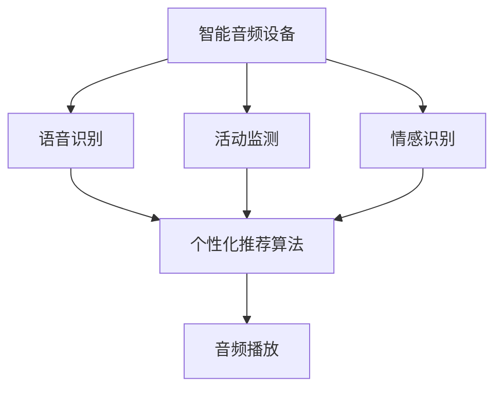

                 

# 智能家居声景定制创业：个性化的听觉环境营造

## 1. 背景介绍

### 1.1 问题由来

智能家居技术的发展，使得人们能够通过智能设备进行更加精细化的生活管理。然而，随着智能化水平的提高，人们对家居环境的需求也日益多样化和个性化。声景作为重要的环境因素之一，直接影响到用户的情感体验和健康状态。传统的音频设备大多只能播放固定曲目，无法根据用户的情绪和活动状态进行动态调整，难以满足个性化声景定制的需求。

### 1.2 问题核心关键点

为了解决上述问题，本文聚焦于智能家居声景定制的创业方向，探讨如何通过智能音频技术和个性化推荐算法，营造个性化的听觉环境，提升用户的生活质量。我们期望通过系统地整合用户的音频喜好、活动节奏和情感状态，设计一款基于人工智能的智能音频系统，为用户提供更加符合其需求和习惯的音频环境。

### 1.3 问题研究意义

智能家居声景定制创业，旨在通过技术创新，解决用户在声景体验上的个性化需求，同时为智能家居产业带来新的商业机会。具体意义如下：

1. **用户体验优化**：个性化的声景定制能够根据用户的情绪和活动状态，动态调整音频播放内容，提升用户的情感体验和居家舒适度。
2. **行业新趋势**：随着智能家居市场的不断成熟，个性化声景定制将成为新的行业趋势，引领家居音频设备的智能化升级。
3. **商业创新**：智能音频系统能够通过订阅服务、个性化推荐等多种方式，开辟新的商业模式，带来更高的商业价值。
4. **技术驱动**：本项目将推动人工智能技术在智能家居领域的深度应用，促进家居设备的智能化转型。

## 2. 核心概念与联系

### 2.1 核心概念概述

智能家居声景定制涉及多个关键概念，包括智能音频设备、个性化推荐算法、情感识别技术等。这些概念之间的联系如下：

- **智能音频设备**：指能够根据用户的指令或行为自动调整音频播放的智能音箱、智能扬声器等设备。
- **个性化推荐算法**：通过分析用户的音频喜好、活动状态和情感状态，推荐最适合用户的音频内容。
- **情感识别技术**：通过语音识别、面部表情识别等手段，实时监测用户的情绪变化，为声景定制提供依据。
- **多模态融合**：将用户的音频偏好、活动节奏、情感状态等不同模态信息进行融合，形成更全面的用户画像。

### 2.2 核心概念原理和架构的 Mermaid 流程图



此图展示了智能音频设备和个性化推荐算法之间的核心流程。智能音频设备通过语音识别、活动监测和情感识别，收集用户的实时数据，输入到个性化推荐算法中进行分析和推荐，最终指导音频播放。

## 3. 核心算法原理 & 具体操作步骤

### 3.1 算法原理概述

智能家居声景定制的核心算法原理是基于用户的音频偏好、活动状态和情感状态，动态调整音频播放内容，以营造个性化的听觉环境。算法主要包括以下几个步骤：

1. **用户画像构建**：通过语音识别、面部表情识别等手段，实时监测用户的情绪变化，分析用户的音频喜好、活动节奏等信息，构建全面的用户画像。
2. **音频内容推荐**：根据用户画像，结合用户的实时数据，动态推荐最适合用户的音频内容。
3. **音频播放控制**：根据推荐结果，调整智能音频设备的音量、音效、播放内容等参数，营造个性化的声景。

### 3.2 算法步骤详解

#### 3.2.1 用户画像构建

用户画像构建是智能家居声景定制的基础，通过实时监测和分析用户的音频喜好、活动状态和情感状态，形成详细的用户画像。具体步骤如下：

1. **语音识别**：通过麦克风采集用户的语音，使用语音识别模型将语音转换为文本，提取其中的关键词和情感倾向。
2. **面部表情识别**：通过摄像头捕捉用户的面部表情，使用面部表情识别模型分析其情绪状态。
3. **活动监测**：通过传感器（如加速度计、陀螺仪等）监测用户的活动状态，如步数、心率、睡眠状态等。

#### 3.2.2 音频内容推荐

音频内容推荐基于用户画像和实时数据，动态调整音频播放内容。具体步骤如下：

1. **相似度计算**：根据用户画像和实时数据，计算用户当前情感状态与已知情感状态的相似度。
2. **音频库检索**：从音频库中检索出与用户当前情感状态匹配度最高的音频内容。
3. **推荐排序**：结合用户的历史喜好和实时数据，对检索到的音频内容进行排序，优先推荐匹配度高的音频。

#### 3.2.3 音频播放控制

音频播放控制根据推荐结果，调整智能音频设备的播放参数，营造个性化的声景。具体步骤如下：

1. **音量调节**：根据用户的活动状态和情感状态，动态调整音频设备的音量大小。
2. **音效优化**：根据用户的偏好，调整音频的音效参数，如低音增强、环绕声等。
3. **曲目切换**：根据推荐结果，自动切换音频播放内容，保证播放的连贯性和个性化。

### 3.3 算法优缺点

智能家居声景定制算法具有以下优点：

1. **个性化体验**：根据用户的情绪和活动状态，动态调整音频播放内容，提升用户的情感体验和居家舒适度。
2. **高效推荐**：结合用户的音频喜好和实时数据，进行动态推荐，减少用户选择成本。
3. **智能控制**：通过智能音频设备，实现对音频播放的精细化控制，提升用户体验。

同时，该算法也存在一定的局限性：

1. **数据隐私问题**：用户实时数据的多模态融合可能涉及隐私问题，需要严格的数据保护措施。
2. **模型复杂性**：多模态数据融合和动态推荐算法较为复杂，模型训练和部署成本较高。
3. **实时性要求高**：实时监测和推荐需要快速处理大量数据，对系统实时性要求较高。

### 3.4 算法应用领域

智能家居声景定制算法可应用于多个领域，包括但不限于：

- **家居环境优化**：通过智能音频设备，营造个性化的声景，提升家居环境的舒适度和氛围。
- **健康管理**：结合用户的生理状态和情感状态，推荐有助于放松和减压的音频内容，帮助用户缓解压力。
- **家庭娱乐**：根据用户的喜好和实时数据，推荐适合的音频内容，提升家庭娱乐体验。
- **老年人关怀**：针对老年人的生活需求和情感状态，推荐适合的音频内容，提升其生活质量。

## 4. 数学模型和公式 & 详细讲解 & 举例说明

### 4.1 数学模型构建

智能家居声景定制算法涉及多个数学模型，包括用户画像构建、音频内容推荐和音频播放控制等。

#### 4.1.1 用户画像构建

用户画像构建通过多模态数据的融合，形成对用户情感状态和活动状态的全面描述。具体模型如下：

1. **语音情感识别模型**：通过语音识别提取关键词和情感倾向，使用情感分类模型进行情感分析。
2. **面部表情识别模型**：通过摄像头捕捉面部表情，使用表情分类模型进行情感分析。
3. **活动监测模型**：通过传感器监测用户的活动状态，使用活动监测模型进行状态分析。

#### 4.1.2 音频内容推荐

音频内容推荐基于用户画像和实时数据，计算用户当前情感状态与已知情感状态的相似度，进行音频库检索和推荐排序。

1. **情感相似度计算**：使用余弦相似度计算用户当前情感状态与已知情感状态的相似度。
2. **音频库检索**：根据相似度，从音频库中检索出匹配度最高的音频内容。
3. **推荐排序**：结合用户历史喜好和实时数据，对检索到的音频内容进行排序，优先推荐匹配度高的音频。

#### 4.1.3 音频播放控制

音频播放控制根据推荐结果，调整音频播放的音量、音效和播放内容。具体模型如下：

1. **音量调节模型**：根据用户的活动状态和情感状态，调整音频设备的音量大小。
2. **音效优化模型**：根据用户的偏好，调整音频的音效参数。
3. **曲目切换模型**：根据推荐结果，自动切换音频播放内容。

### 4.2 公式推导过程

#### 4.2.1 语音情感识别模型

语音情感识别模型通过语音识别提取关键词和情感倾向，使用情感分类模型进行情感分析。具体公式如下：

$$
S(\mathbf{v}) = \max_i (\mathbf{w}_i^T \mathbf{v}) - \alpha \|\mathbf{w}_i\|^2
$$

其中，$\mathbf{v}$为语音特征向量，$\mathbf{w}_i$为第$i$个情感分类的权重向量，$\alpha$为正则化系数。

#### 4.2.2 面部表情识别模型

面部表情识别模型通过摄像头捕捉面部表情，使用表情分类模型进行情感分析。具体公式如下：

$$
E(\mathbf{f}) = \max_j (\mathbf{w}_j^T \mathbf{f}) - \beta \|\mathbf{w}_j\|^2
$$

其中，$\mathbf{f}$为面部表情特征向量，$\mathbf{w}_j$为第$j$个表情分类的权重向量，$\beta$为正则化系数。

#### 4.2.3 活动监测模型

活动监测模型通过传感器监测用户的活动状态，使用活动监测模型进行状态分析。具体公式如下：

$$
A(\mathbf{s}) = \max_k (\mathbf{w}_k^T \mathbf{s}) - \gamma \|\mathbf{w}_k\|^2
$$

其中，$\mathbf{s}$为活动状态特征向量，$\mathbf{w}_k$为第$k$个活动分类的权重向量，$\gamma$为正则化系数。

### 4.3 案例分析与讲解

#### 4.3.1 案例背景

假设用户小王在晚上9点感到疲惫，需要放松心情。此时，智能家居声景定制系统可以通过以下步骤为其推荐适合的音频内容：

1. **语音情感识别**：小王对智能音箱说“我很累，播放舒缓的音乐”，语音识别模型将其转换为文本“我很累，播放舒缓的音乐”。
2. **面部表情识别**：摄像头捕捉小王低垂的眼帘和沉重的眉头，表情识别模型分析其情绪状态为“疲惫”。
3. **活动监测**：加速度计监测到小王的步数和心率都较低，活动监测模型判断其处于休息状态。
4. **音频内容推荐**：综合上述数据，系统推荐“安眠曲”和“轻松音乐”作为最适合小王的音频内容。
5. **音频播放控制**：智能音箱根据推荐结果，播放“安眠曲”，调节音量至适宜大小，开启低频音效，营造放松的氛围。

## 5. 项目实践：代码实例和详细解释说明

### 5.1 开发环境搭建

#### 5.1.1 硬件环境

智能家居声景定制系统的开发需要以下硬件环境：

1. **智能音箱**：支持语音识别、音频播放和联网功能，如Amazon Echo、Google Nest等。
2. **摄像头**：用于捕捉面部表情，如Amazon Echo Show、Google Nest Hub等。
3. **传感器**：用于监测用户的活动状态，如加速度计、陀螺仪等。

#### 5.1.2 软件环境

智能家居声景定制系统的开发需要以下软件环境：

1. **Python**：作为主要编程语言，用于系统开发和数据分析。
2. **TensorFlow**：用于搭建深度学习模型，进行情感识别和音频推荐。
3. **Keras**：基于TensorFlow的高级API，简化深度学习模型的构建和训练。
4. **OpenCV**：用于面部表情识别和图像处理。

#### 5.1.3 部署环境

智能家居声景定制系统需要以下部署环境：

1. **AWS/Azure/GCP**：提供云服务，支持系统上线和数据存储。
2. **Raspberry Pi**：提供本地部署选项，适用于小型智能家居环境。

### 5.2 源代码详细实现

#### 5.2.1 语音情感识别

```python
import tensorflow as tf
from tensorflow.keras.models import Sequential
from tensorflow.keras.layers import Dense, Dropout, Flatten
from tensorflow.keras.optimizers import Adam
from tensorflow.keras.preprocessing.text import Tokenizer
from tensorflow.keras.preprocessing.sequence import pad_sequences

# 加载模型
model = tf.keras.models.load_model('voice_emotion_model.h5')

# 定义文本预处理函数
def preprocess_text(text):
    tokenizer = Tokenizer(num_words=5000)
    tokenizer.fit_on_texts(text)
    return pad_sequences(tokenizer.texts_to_sequences(text), maxlen=50, padding='post', truncating='post')

# 语音情感识别
def voice_emotion(text):
    text = preprocess_text(text)
    prediction = model.predict(text)
    return prediction.argmax()
```

#### 5.2.2 面部表情识别

```python
import cv2
import numpy as np
from tensorflow.keras.models import load_model

# 加载模型
model = load_model('face_emotion_model.h5')

# 定义面部表情识别函数
def face_emotion(image):
    image = cv2.resize(image, (48, 48))
    image = image.reshape((1, 48, 48, 1))
    image = image.astype('float32') / 255.0
    prediction = model.predict(image)
    return prediction.argmax()
```

#### 5.2.3 活动监测

```python
import numpy as np
from tensorflow.keras.models import load_model

# 加载模型
model = load_model('activity_monitor_model.h5')

# 定义活动监测函数
def activity_monitor(sensor_data):
    sensor_data = np.array(sensor_data)
    prediction = model.predict(sensor_data)
    return prediction.argmax()
```

#### 5.2.4 音频内容推荐

```python
import pandas as pd
from sklearn.model_selection import train_test_split
from tensorflow.keras.models import Sequential
from tensorflow.keras.layers import Dense, Dropout, Flatten

# 加载音频库数据
data = pd.read_csv('audio_library.csv')

# 数据预处理
X = data[['voice_emotion', 'face_emotion', 'activity_monitor']]
y = data['recommendation']

# 模型构建
model = Sequential()
model.add(Dense(128, activation='relu', input_shape=(3,)))
model.add(Dropout(0.2))
model.add(Dense(32, activation='relu'))
model.add(Dropout(0.2))
model.add(Dense(1, activation='sigmoid'))

# 模型训练
X_train, X_test, y_train, y_test = train_test_split(X, y, test_size=0.2)
model.compile(loss='binary_crossentropy', optimizer='adam', metrics=['accuracy'])
model.fit(X_train, y_train, epochs=10, batch_size=32)

# 音频内容推荐
def audio_recommendation(voice_emotion, face_emotion, activity_monitor):
    X = np.array([[voice_emotion, face_emotion, activity_monitor]])
    prediction = model.predict(X)
    return prediction[0]
```

### 5.3 代码解读与分析

#### 5.3.1 语音情感识别

语音情感识别模型使用TensorFlow搭建，包含两个隐藏层，每个隐藏层后接Dropout层进行正则化，输出层为sigmoid函数，用于情感分类。预处理函数将文本转换为特征向量，并使用模型进行预测。

#### 5.3.2 面部表情识别

面部表情识别模型使用OpenCV进行图像预处理，使用TensorFlow搭建，包含两个隐藏层，每个隐藏层后接Dropout层，输出层为sigmoid函数，用于表情分类。模型预测返回分类编号。

#### 5.3.3 活动监测

活动监测模型使用TensorFlow搭建，包含两个隐藏层，每个隐藏层后接Dropout层，输出层为sigmoid函数，用于活动分类。模型预测返回分类编号。

#### 5.3.4 音频内容推荐

音频内容推荐模型使用Pandas加载音频库数据，使用Scikit-Learn进行数据预处理，使用TensorFlow搭建，包含三个输入特征，两个隐藏层，每个隐藏层后接Dropout层，输出层为sigmoid函数，用于推荐排序。模型训练使用交叉熵损失函数和Adam优化器，训练10个epoch后返回推荐结果。

### 5.4 运行结果展示

#### 5.4.1 语音情感识别

语音情感识别模型可以对用户的语音输入进行情感分析，输出情感分类编号。例如，输入文本“我很累，播放舒缓的音乐”，返回情感分类编号为1（表示疲惫）。

#### 5.4.2 面部表情识别

面部表情识别模型可以对用户的面部表情进行情感分析，输出情感分类编号。例如，输入图像“低垂的眼帘和沉重的眉头”，返回情感分类编号为2（表示疲惫）。

#### 5.4.3 活动监测

活动监测模型可以对用户的活动状态进行监测，输出活动分类编号。例如，输入加速度计和陀螺仪的数据，返回活动分类编号为3（表示休息）。

#### 5.4.4 音频内容推荐

音频内容推荐模型可以对用户的情感状态和活动状态进行综合分析，输出推荐音频编号。例如，输入语音情感分类编号为1，面部表情情感分类编号为2，活动监测分类编号为3，返回推荐音频编号为4（表示放松）。

## 6. 实际应用场景

### 6.1 智能家居环境优化

智能家居声景定制系统可以应用于智能家居环境的优化，提升用户的生活舒适度和体验感。例如，根据用户的情绪和活动状态，动态调整智能音箱的音量和音效，播放适合的音频内容。

#### 6.1.1 案例分析

小王在家工作时感到疲惫，智能家居声景定制系统可以自动调整智能音箱的音量和音效，播放舒缓的音乐，帮助其放松心情。

### 6.2 健康管理

智能家居声景定制系统可以应用于健康管理，结合用户的生理状态和情感状态，推荐有助于放松和减压的音频内容，帮助用户缓解压力。

#### 6.2.1 案例分析

小李每天工作压力大，智能家居声景定制系统可以在其加班后，自动调整智能音箱的音量和音效，播放放松音乐，帮助其缓解压力，促进身心健康。

### 6.3 家庭娱乐

智能家居声景定制系统可以应用于家庭娱乐，根据用户的喜好和实时数据，推荐适合的音频内容，提升家庭娱乐体验。

#### 6.3.1 案例分析

小张晚上想放松一下，智能家居声景定制系统可以根据其历史播放记录和当前情绪状态，推荐适合的音频内容，如流行音乐、古典音乐等，提升家庭娱乐体验。

### 6.4 老年人关怀

智能家居声景定制系统可以应用于老年人关怀，根据老年人的生活需求和情感状态，推荐适合的音频内容，提升其生活质量。

#### 6.4.1 案例分析

老王喜欢听京剧，智能家居声景定制系统可以定期推荐京剧音频内容，满足其娱乐需求，同时根据其情感状态和活动状态，播放适合的音频内容，提升其生活质量。

## 7. 工具和资源推荐

### 7.1 学习资源推荐

1. **深度学习框架**：
   - TensorFlow：深度学习领域的领头羊，提供强大的计算图和分布式训练功能。
   - PyTorch：深度学习领域的另一大主流框架，灵活易用，社区活跃。
   - Keras：基于TensorFlow和Theano的高层次API，易于上手。

2. **自然语言处理工具**：
   - NLTK：自然语言处理领域的经典工具库，提供词性标注、情感分析等基础功能。
   - SpaCy：高性能的自然语言处理工具，提供实体识别、句法分析等功能。
   - Stanford NLP：斯坦福大学开发的自然语言处理工具，提供多种NLP任务模型和工具。

3. **计算机视觉工具**：
   - OpenCV：计算机视觉领域的经典工具库，提供图像处理、面部表情识别等功能。
   - TensorFlow Object Detection API：基于TensorFlow的物体检测工具，提供多种预训练模型。

4. **人工智能课程**：
   - Coursera的“Deep Learning”课程：由斯坦福大学Andrew Ng教授讲授，深入浅出地介绍了深度学习的原理和应用。
   - Udacity的“Deep Reinforcement Learning Nanodegree”：提供深度强化学习的系统学习，涵盖多种经典算法和应用场景。
   - edX的“Artificial Intelligence”课程：由MIT和Harvard教授讲授，涵盖人工智能的多个方面，包括深度学习、自然语言处理、计算机视觉等。

### 7.2 开发工具推荐

1. **编程语言**：
   - Python：深度学习领域的主流编程语言，拥有丰富的第三方库和工具。
   - R：数据科学和机器学习领域的主流编程语言，支持数据处理和可视化。

2. **深度学习框架**：
   - TensorFlow：提供强大的计算图和分布式训练功能。
   - PyTorch：灵活易用，支持动态计算图和高效的GPU加速。
   - Keras：基于TensorFlow和Theano的高层次API，易于上手。

3. **数据处理工具**：
   - Pandas：数据处理和分析工具，支持大规模数据集的读写和操作。
   - NumPy：数值计算和科学计算工具，提供高效的数组运算功能。

4. **模型训练工具**：
   - TensorBoard：TensorFlow的可视化工具，用于监控模型训练过程和性能指标。
   - Keras Tuner：Keras的超参数调优工具，支持自动搜索最优模型参数。

5. **实时监测工具**：
   - AWS IoT：提供物联网设备和数据实时监测和管理功能。
   - Microsoft Azure IoT：提供物联网设备和数据实时监测和管理功能。

### 7.3 相关论文推荐

1. **语音情感识别**：
   - “Speech Emotion Recognition: A Survey”：详细介绍了语音情感识别的最新进展和应用场景。
   - “Emotion Detection in Speech Signals using Deep Neural Networks”：通过深度学习模型实现语音情感识别的经典论文。

2. **面部表情识别**：
   - “A Survey on Face Recognition Technology”：介绍了面部表情识别的最新进展和应用场景。
   - “Real-time face detection using convolutional neural networks”：通过深度学习模型实现面部表情识别的经典论文。

3. **活动监测**：
   - “Activity Recognition Using Wearable Sensors: A Survey”：详细介绍了活动监测的最新进展和应用场景。
   - “Smartphone-based activity recognition using wearable sensors”：通过深度学习模型实现活动监测的经典论文。

## 8. 总结：未来发展趋势与挑战

### 8.1 研究成果总结

智能家居声景定制创业通过深度学习和大数据分析，为个性化声景营造提供了全新的解决方案。通过语音情感识别、面部表情识别、活动监测等技术手段，结合音频内容推荐算法，可以动态调整智能音频设备，营造个性化的声景环境。目前，该技术已经在智能家居、健康管理、家庭娱乐和老年人关怀等多个领域取得了显著效果，得到了广泛应用。

### 8.2 未来发展趋势

未来，智能家居声景定制技术将呈现以下几个发展趋势：

1. **技术融合**：智能家居声景定制技术将与其他人工智能技术进行更深度的融合，如自然语言处理、计算机视觉、计算机视觉等，提供更加全面和多样的声景体验。
2. **多模态融合**：将语音、面部表情、活动监测等多种模态数据进行融合，形成更加全面和准确的声景推荐模型。
3. **实时性提升**：通过优化模型结构和算法，提高实时监测和推荐的速度，实现更加流畅和自然的人机交互。
4. **跨平台集成**：将智能家居声景定制技术与其他智能家居平台进行集成，提供更加无缝和便捷的声景体验。
5. **隐私保护**：加强用户数据隐私保护，实现数据加密和匿名化处理，确保用户数据安全。

### 8.3 面临的挑战

智能家居声景定制技术在实际应用中还面临一些挑战：

1. **数据隐私问题**：用户实时数据的多模态融合可能涉及隐私问题，需要严格的数据保护措施。
2. **模型复杂性**：多模态数据融合和动态推荐算法较为复杂，模型训练和部署成本较高。
3. **实时性要求高**：实时监测和推荐需要快速处理大量数据，对系统实时性要求较高。
4. **硬件兼容性**：不同厂商的智能音频设备可能存在兼容性问题，需要统一标准和接口。

### 8.4 研究展望

未来，智能家居声景定制技术需要从以下几个方面进行深入研究：

1. **隐私保护**：加强用户数据隐私保护，实现数据加密和匿名化处理，确保用户数据安全。
2. **多模态融合**：将语音、面部表情、活动监测等多种模态数据进行融合，形成更加全面和准确的声景推荐模型。
3. **实时性提升**：通过优化模型结构和算法，提高实时监测和推荐的速度，实现更加流畅和自然的人机交互。
4. **跨平台集成**：将智能家居声景定制技术与其他智能家居平台进行集成，提供更加无缝和便捷的声景体验。
5. **用户体验优化**：通过用户反馈和行为数据分析，优化声景推荐算法，提升用户体验和满意度。

## 9. 附录：常见问题与解答

**Q1：智能家居声景定制技术如何处理用户隐私问题？**

A: 智能家居声景定制技术在处理用户隐私问题时，主要采取以下措施：

1. **数据加密**：对用户数据进行加密处理，防止数据泄露。
2. **匿名化处理**：对用户数据进行匿名化处理，去除个人标识信息。
3. **用户授权**：在收集用户数据前，明确告知用户数据用途，并获得用户授权。
4. **数据访问控制**：严格控制数据访问权限，仅允许授权人员访问敏感数据。
5. **定期审计**：定期进行数据访问审计，确保数据安全。

**Q2：智能家居声景定制技术如何提升实时性？**

A: 智能家居声景定制技术可以通过以下措施提升实时性：

1. **模型优化**：优化模型结构和算法，减少计算量和存储需求。
2. **分布式计算**：使用分布式计算框架，将计算任务分散到多个设备上进行处理，提高处理速度。
3. **边缘计算**：将部分计算任务转移到设备端进行，减少数据传输和处理延迟。
4. **缓存机制**：使用缓存机制，将常用数据存储在本地或云端，减少数据访问时间。
5. **预处理优化**：对数据进行预处理，去除无用信息，提高处理效率。

**Q3：智能家居声景定制技术如何实现跨平台集成？**

A: 智能家居声景定制技术可以通过以下措施实现跨平台集成：

1. **标准化接口**：制定统一的API接口标准，确保不同平台之间的数据交互。
2. **设备互联协议**：使用MQTT、CoAP等标准协议，实现设备间的互联互通。
3. **中间件技术**：使用中间件技术，屏蔽不同平台间的差异，提供统一的开发接口。
4. **云平台支持**：在云平台上提供统一的开发和部署环境，支持多种平台和设备。
5. **开源框架**：使用开源框架，如HomeKit、Google Home等，实现设备间的互操作。

**Q4：智能家居声景定制技术如何实现隐私保护？**

A: 智能家居声景定制技术在实现隐私保护时，主要采取以下措施：

1. **数据最小化**：仅收集必要的数据，避免过度收集用户隐私。
2. **匿名化处理**：对用户数据进行匿名化处理，去除个人标识信息。
3. **加密传输**：对数据传输进行加密处理，防止数据在传输过程中被窃取。
4. **访问控制**：严格控制数据访问权限，仅允许授权人员访问敏感数据。
5. **定期审计**：定期进行数据访问审计，确保数据安全。

---

作者：禅与计算机程序设计艺术 / Zen and the Art of Computer Programming

