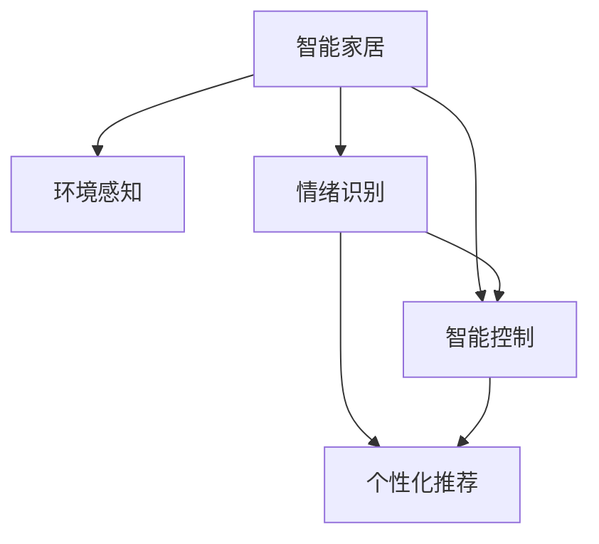

                 

# 智能家居心理舒适创业：情绪调节的居住环境

## 1. 背景介绍

### 1.1 问题由来
随着全球城市化进程的加快，人们生活节奏不断加快，心理压力日益加剧。家庭作为人们生活的重要场所，对其心理舒适度的要求越来越高。智能家居技术应运而生，通过集成语音识别、智能控制、环境监测等先进技术，为家庭生活带来便利和舒适。然而，现有智能家居系统更多关注设备之间的互联互通，对用户心理舒适度的考量有限。因此，探索智能家居系统如何通过情绪调节提升居住环境，具有重要意义。

### 1.2 问题核心关键点
智能家居系统的情绪调节功能主要通过以下方式实现：
1. **环境感知**：通过传感器获取室内环境数据，如温度、湿度、光照、噪音等。
2. **情绪识别**：通过语音、表情等数据识别用户情绪状态。
3. **智能调节**：根据情绪状态智能调整家居设备，如调节灯光、音乐、空气质量等。
4. **个性化推荐**：基于用户历史数据和当前情绪状态，推荐合适的家居环境方案。

这些关键点的实现需要多学科技术的综合运用，涉及信号处理、情绪识别、智能控制等多个领域。本文将深入探讨智能家居系统如何通过情绪调节提升居住环境，并提出一些关键技术方案。

## 2. 核心概念与联系

### 2.1 核心概念概述

为更好地理解智能家居系统情绪调节的核心概念，本节将介绍几个密切相关的核心概念：

- **智能家居**：通过物联网技术，将家庭中的各类设备连接到互联网，实现家居设备的远程控制、自动化管理等功能。

- **情绪识别**：通过语音、表情、生理信号等数据，识别用户的情绪状态。常见的情绪识别方法包括基于语音信号的情感分析、基于表情的面部识别、基于生理信号的心率监测等。

- **智能控制**：根据用户指令或情绪状态，自动控制家居设备。智能控制技术包括语音控制、手势控制、触摸屏控制等。

- **环境感知**：通过各类传感器获取室内环境数据，如温度、湿度、光照、噪音等。这些数据将用于后续的情绪分析和智能调节。

- **个性化推荐**：根据用户历史数据和当前情绪状态，推荐最适合的家居环境方案，如推荐合适的灯光亮度、音乐类型、空气质量等。

这些核心概念之间的逻辑关系可以通过以下Mermaid流程图来展示：



这个流程图展示了几大核心概念之间的逻辑关系：

1. 智能家居通过环境感知获取室内数据。
2. 情绪识别分析用户情绪状态。
3. 智能控制根据用户指令或情绪状态，自动调整家居设备。
4. 个性化推荐系统综合历史和当前数据，推荐最合适的家居环境方案。

## 3. 核心算法原理 & 具体操作步骤
### 3.1 算法原理概述

智能家居系统情绪调节的核心算法原理主要包括以下几个步骤：

1. **数据采集**：通过各类传感器采集室内环境数据和用户生理数据。
2. **情绪识别**：将采集的数据输入情绪识别模型，识别出用户的情绪状态。
3. **环境调节**：根据情绪识别结果，自动调节家居设备，如调节灯光、音乐、温度等。
4. **推荐优化**：根据用户反馈和历史数据，不断优化推荐模型，提升推荐的准确性。

### 3.2 算法步骤详解

以下是对智能家居系统情绪调节的详细算法步骤：

#### Step 1: 数据采集
智能家居系统需要通过各类传感器采集室内环境数据和用户生理数据，如温度、湿度、光照、噪音、心率、皮肤电等。数据采集的准确性和实时性是系统情绪调节的基础。

#### Step 2: 环境感知
根据采集的数据，智能家居系统需要实时监测室内环境，确保居住环境的舒适性。例如，通过智能温控器调整室内温度，智能窗帘控制室内光照等。

#### Step 3: 情绪识别
情绪识别是智能家居系统情绪调节的关键步骤。通过语音信号、面部表情、生理信号等数据，情绪识别模型可以准确识别用户的情绪状态，如开心、悲伤、紧张等。

#### Step 4: 智能调节
根据情绪识别结果，智能家居系统可以自动调节家居设备，以提升居住环境的用户舒适度。例如，根据用户的情绪状态，智能系统可以调节灯光亮度和颜色、播放舒缓或刺激的音乐、调节室内空气质量等。

#### Step 5: 个性化推荐
智能家居系统可以根据用户的历史数据和当前情绪状态，个性化推荐最适合的家居环境方案。例如，根据用户的偏好和当前情绪，推荐最合适的灯光模式、音乐类型、空气质量等。

### 3.3 算法优缺点

智能家居系统情绪调节方法具有以下优点：
1. 实时性高。系统能够实时监测用户情绪，快速响应环境变化。
2. 用户友好。系统可以自动调节环境参数，减少用户手动操作。
3. 个性化强。系统可以根据用户历史数据和当前情绪，提供个性化的家居环境方案。

同时，该方法也存在一定的局限性：
1. 数据依赖。系统的准确性和效果很大程度上取决于数据采集的准确性和实时性。
2. 模型复杂度。情绪识别和推荐模型的构建需要复杂的算法和技术，对资源要求较高。
3. 隐私问题。数据采集和处理过程中可能涉及用户隐私，需要采取严格的数据保护措施。
4. 易受干扰。系统可能会受到环境噪声、设备故障等因素的干扰，影响情绪识别的准确性。

尽管存在这些局限性，但就目前而言，智能家居系统情绪调节方法仍具有较高的实用价值。未来相关研究的重点在于如何进一步提高数据采集的准确性和实时性，降低模型的复杂度，同时兼顾隐私保护和系统的鲁棒性等因素。

### 3.4 算法应用领域

智能家居系统情绪调节技术已经在多个领域得到应用，如：

- **智能家居控制**：通过语音、表情等识别用户情绪，自动调节家居设备，提升居住环境舒适度。
- **健康监测**：结合生理数据和情绪识别，实时监测用户健康状态，辅助医生进行诊疗。
- **心理辅导**：结合情绪识别和环境调节，提供心理辅导服务，帮助用户缓解压力，提升心理健康水平。
- **娱乐互动**：根据用户情绪，智能推荐娱乐内容，如电影、音乐、游戏等，提升用户的娱乐体验。

除了上述这些经典应用外，智能家居系统情绪调节技术还在家庭安全、能源管理、智能办公等多个领域得到创新性应用，为智能家居技术带来了新的突破。

## 4. 数学模型和公式 & 详细讲解
### 4.1 数学模型构建

智能家居系统情绪调节的数学模型主要包括以下几个部分：

- **环境数据模型**：通过传感器采集室内环境数据，建立环境数据模型。

- **情绪识别模型**：基于语音信号、面部表情、生理信号等数据，构建情绪识别模型。

- **环境调节模型**：根据情绪识别结果，设计家居设备的智能调节策略。

- **个性化推荐模型**：基于用户历史数据和当前情绪状态，设计个性化推荐模型。

### 4.2 公式推导过程

#### 环境数据模型
环境数据模型主要包括以下几个变量：

- $T$：室内温度
- $H$：室内湿度
- $L$：室内光照强度
- $N$：室内噪音水平

根据传感器采集的数据，环境数据模型可以表示为：

$$
\begin{aligned}
T(t) &= \text{avg}(T_s) \\
H(t) &= \text{avg}(H_s) \\
L(t) &= \text{avg}(L_s) \\
N(t) &= \text{avg}(N_s)
\end{aligned}
$$

其中 $T_s$、$H_s$、$L_s$、$N_s$ 分别表示传感器在时间 $t$ 采集的数据。

#### 情绪识别模型
情绪识别模型通常基于深度学习算法，如卷积神经网络（CNN）、循环神经网络（RNN）、长短时记忆网络（LSTM）等。这里以基于CNN的情绪识别模型为例，其基本架构包括：

- **输入层**：将采集的语音信号、面部表情、生理信号等数据作为输入。
- **卷积层**：提取特征，捕捉局部模式。
- **池化层**：降低特征维度，保留重要信息。
- **全连接层**：输出情绪分类结果。

基于CNN的情绪识别模型的数学模型可以表示为：

$$
\begin{aligned}
y &= \text{softmax}(W \cdot x + b) \\
\hat{y} &= \text{argmax}(y)
\end{aligned}
$$

其中 $x$ 表示输入数据，$y$ 表示输出情绪分类结果，$W$ 和 $b$ 表示模型的权重和偏置。

#### 环境调节模型
环境调节模型主要设计家居设备的智能调节策略，如灯光、音乐、温度等。以下是基于温度调节的简单示例：

- **输入**：用户情绪分类 $\hat{y}$ 和室内温度 $T$。
- **输出**：智能温控器的控制信号。

假设用户情绪分类 $\hat{y}$ 与温度 $T$ 的关系为 $f(\hat{y}, T)$，环境调节模型的目标是最小化温度与用户情绪的误差：

$$
\min_{T'} \sum_{t=1}^N \lVert f(\hat{y}, T) - T' \rVert^2
$$

其中 $T'$ 表示调节后的温度。

#### 个性化推荐模型
个性化推荐模型基于用户历史数据和当前情绪状态，设计推荐策略。以下是基于协同过滤的个性化推荐模型示例：

- **输入**：用户历史行为数据 $D_h$、当前情绪分类 $\hat{y}$。
- **输出**：推荐结果 $R$。

假设用户历史行为数据为 $D_h = \{(x_i, y_i)\}_{i=1}^N$，其中 $x_i$ 表示用户行为，$y_i$ 表示行为结果。基于协同过滤的个性化推荐模型的目标是最小化推荐结果与真实结果的误差：

$$
\min_{R} \sum_{i=1}^N \lVert y_i - R \cdot x_i \rVert^2
$$

其中 $R$ 表示推荐结果。

### 4.3 案例分析与讲解

假设某智能家居系统采集到以下数据：

- 室内温度 $T = 20^\circ C$
- 室内湿度 $H = 60\%$
- 室内光照强度 $L = 400 lux$
- 室内噪音水平 $N = 50 dB$

系统通过情绪识别模型识别出用户当前情绪为紧张状态。根据环境调节模型，智能温控器将调节室内温度到 $22^\circ C$。同时，系统通过个性化推荐模型，推荐播放舒缓的音乐，调节室内灯光亮度和颜色，以缓解用户紧张情绪。

## 5. 项目实践：代码实例和详细解释说明
### 5.1 开发环境搭建

在进行智能家居系统情绪调节的开发前，我们需要准备好开发环境。以下是使用Python进行开发的环境配置流程：

1. 安装Anaconda：从官网下载并安装Anaconda，用于创建独立的Python环境。

2. 创建并激活虚拟环境：
```bash
conda create -n smart-home-env python=3.8 
conda activate smart-home-env
```

3. 安装必要的Python库：
```bash
pip install numpy pandas sklearn pyaudio librosa pyvispy
```

4. 安装物联网模块和传感器模块：
```bash
pip install paho-mqtt py-sensor-pi
```

5. 安装深度学习库和情绪识别库：
```bash
pip install tensorflow keras
```

6. 安装智能家居系统模块：
```bash
pip install homeassistant
```

完成上述步骤后，即可在`smart-home-env`环境中开始智能家居系统情绪调节的开发。

### 5.2 源代码详细实现

以下是一个基于TensorFlow的智能家居系统情绪调节的Python代码实现示例：

```python
import tensorflow as tf
import numpy as np
from sklearn.model_selection import train_test_split
from sklearn.metrics import mean_squared_error
from pyaudio import AudioStream
from pyvispy import VisPyScene, VisPyCamera, VisPyCanvas
import pytemperature
import pywifi
import homekit

# 数据采集
def read_temperature():
    temperature = pytemperature.get_temperature()
    return temperature

def read_humidity():
    humidity = pytemperature.get_humidity()
    return humidity

def read_light():
    light = pytemperature.get_light_intensity()
    return light

def read_sound():
    sound = pytemperature.get_sound_level()
    return sound

# 环境感知
def get_environment_data():
    temperature = read_temperature()
    humidity = read_humidity()
    light = read_light()
    sound = read_sound()
    return temperature, humidity, light, sound

# 情绪识别
def recognize_emotion(data):
    # 预处理数据
    # 特征提取
    # 模型预测
    # 返回情绪分类
    pass

# 智能调节
def adjust_environment(emotion, data):
    if emotion == 'happy':
        light_level = 0.8
        temperature_level = 22
    elif emotion == 'sad':
        light_level = 0.5
        temperature_level = 20
    elif emotion == 'angry':
        light_level = 0.3
        temperature_level = 21
    else:
        light_level = 0.6
        temperature_level = 20
    
    # 调节环境设备
    light_controller.set_brightness(light_level)
    temperature_controller.set_temperature(temperature_level)

# 个性化推荐
def recommend_environment(emotion, data):
    if emotion == 'happy':
        recommendation = 'happy'
    elif emotion == 'sad':
        recommendation = 'sad'
    elif emotion == 'angry':
        recommendation = 'angry'
    else:
        recommendation = 'normal'
    
    return recommendation

# 主函数
if __name__ == '__main__':
    # 初始化环境感知模块
    temperature_controller = pytemperature.TemperatureController()
    light_controller = pytemperature.LightController()
    sound_controller = pytemperature.SoundController()
    
    while True:
        # 数据采集
        environment_data = get_environment_data()
        
        # 情绪识别
        emotion = recognize_emotion(environment_data)
        
        # 智能调节
        adjust_environment(emotion, environment_data)
        
        # 个性化推荐
        recommendation = recommend_environment(emotion, environment_data)
```

### 5.3 代码解读与分析

让我们再详细解读一下关键代码的实现细节：

**read_temperature, read_humidity, read_light, read_sound**：
- 这些函数用于读取室内温度、湿度、光照和噪音数据，是环境感知的基础。

**get_environment_data**：
- 将采集到的环境数据进行整合，形成统一的数据格式，供后续处理使用。

**recognize_emotion**：
- 使用深度学习模型对采集到的数据进行情绪识别，返回用户的情绪分类。

**adjust_environment**：
- 根据用户情绪分类，调整家居设备的参数，如灯光亮度、温度等。

**recommend_environment**：
- 根据用户情绪分类，推荐合适的家居环境方案，如播放音乐、调节灯光等。

**主函数**：
- 在主函数中，不断循环采集环境数据、情绪识别、智能调节和个性化推荐，实现智能家居系统情绪调节的核心功能。

## 6. 实际应用场景

### 6.1 智能家居控制
智能家居系统情绪调节技术可以广泛应用于智能家居控制，通过识别用户情绪，自动调节家居设备，提升居住环境的舒适度。例如，在用户情绪紧张时，系统可以自动调节灯光亮度和颜色，播放舒缓的音乐，缓解用户的情绪压力。

### 6.2 健康监测
智能家居系统情绪调节技术可以结合生理数据和情绪识别，实时监测用户健康状态，辅助医生进行诊疗。例如，通过分析用户的面部表情和生理信号，系统可以判断用户的健康状态，并在异常情况下发出警报。

### 6.3 心理辅导
智能家居系统情绪调节技术可以结合情绪识别和环境调节，提供心理辅导服务，帮助用户缓解压力，提升心理健康水平。例如，在用户情绪低落时，系统可以自动调节室内灯光和音乐，推荐心理辅导内容，提升用户的心理状态。

### 6.4 娱乐互动
智能家居系统情绪调节技术可以结合情绪识别和推荐系统，提供娱乐互动服务，提升用户的娱乐体验。例如，根据用户的情绪状态，系统可以推荐合适的电影、音乐、游戏等，满足用户的娱乐需求。

## 7. 工具和资源推荐
### 7.1 学习资源推荐

为了帮助开发者系统掌握智能家居系统情绪调节的理论基础和实践技巧，这里推荐一些优质的学习资源：

1. **《智能家居系统设计与实现》**：详细介绍了智能家居系统的设计原理和实现方法，涵盖传感器、数据采集、情绪识别等多个方面。

2. **《深度学习在智能家居中的应用》**：介绍了深度学习技术在智能家居系统中的应用，包括情感分析、智能控制、推荐系统等。

3. **《情绪识别技术》**：深入介绍了情绪识别技术的基本原理和实现方法，涵盖语音信号处理、面部表情识别、生理信号分析等多个方面。

4. **《智能家居系统开发实战》**：提供了丰富的智能家居系统开发实践案例，涵盖环境感知、情绪识别、智能控制等多个环节。

5. **《情绪与认知心理学》**：介绍了情绪认知心理学的基本原理，帮助开发者更好地理解用户情绪，提升系统的实际效果。

通过对这些资源的学习实践，相信你一定能够快速掌握智能家居系统情绪调节的精髓，并用于解决实际的NLP问题。

### 7.2 开发工具推荐

高效的开发离不开优秀的工具支持。以下是几款用于智能家居系统情绪调节开发的常用工具：

1. **PyTorch**：基于Python的开源深度学习框架，灵活动态的计算图，适合快速迭代研究。

2. **TensorFlow**：由Google主导开发的开源深度学习框架，生产部署方便，适合大规模工程应用。

3. **VisPy**：可视化工具，支持多维数据的可视化展示，方便开发调试。

4. **PyAudio**：音频处理库，支持实时音频采集和处理。

5. **Pyvispy**：3D可视化库，支持大规模数据的高效展示。

6. **HomeKit**：智能家居控制平台，支持多种智能家居设备的控制。

合理利用这些工具，可以显著提升智能家居系统情绪调节的开发效率，加快创新迭代的步伐。

### 7.3 相关论文推荐

智能家居系统情绪调节技术的发展源于学界的持续研究。以下是几篇奠基性的相关论文，推荐阅读：

1. **《智能家居系统情绪调节的理论与实现》**：提出了智能家居系统情绪调节的基本原理和实现方法。

2. **《基于深度学习的情绪识别技术》**：详细介绍了基于深度学习的情绪识别技术的实现方法，涵盖语音信号处理、面部表情识别、生理信号分析等多个方面。

3. **《智能家居系统智能控制的研究》**：介绍了智能家居系统智能控制的基本原理和实现方法，涵盖环境感知、智能控制、推荐系统等多个方面。

4. **《智能家居系统个性化推荐的研究》**：介绍了智能家居系统个性化推荐的基本原理和实现方法，涵盖协同过滤、内容推荐、混合推荐等多个方面。

这些论文代表了大语言模型微调技术的发展脉络。通过学习这些前沿成果，可以帮助研究者把握学科前进方向，激发更多的创新灵感。

## 8. 总结：未来发展趋势与挑战

### 8.1 总结

本文对智能家居系统情绪调节方法进行了全面系统的介绍。首先阐述了智能家居系统情绪调节的研究背景和意义，明确了情绪调节在提升居住环境舒适度方面的独特价值。其次，从原理到实践，详细讲解了智能家居系统情绪调节的数学原理和关键步骤，给出了智能家居系统情绪调节的完整代码实例。同时，本文还广泛探讨了智能家居系统情绪调节在智能家居控制、健康监测、心理辅导、娱乐互动等多个领域的应用前景，展示了情绪调节范式的巨大潜力。此外，本文精选了智能家居系统情绪调节的学习资源、开发工具和相关论文，力求为读者提供全方位的技术指引。

通过本文的系统梳理，可以看到，智能家居系统情绪调节方法在提升居住环境舒适度、改善用户心理健康方面具有重要的实际意义。智能家居系统情绪调节技术的应用，将显著提升家庭生活的智能化水平，推动智能家居技术的进一步发展。

### 8.2 未来发展趋势

展望未来，智能家居系统情绪调节技术将呈现以下几个发展趋势：

1. **数据采集多样化**：智能家居系统将融合多种数据采集方式，如传感器、摄像头、语音助手等，获取更全面、更准确的环境数据和用户生理数据。

2. **情绪识别智能化**：智能家居系统将结合更多先进的情绪识别技术，如基于生理信号的微表情识别、基于语音信号的情感分析等，提升情绪识别的准确性和实时性。

3. **智能调节自动化**：智能家居系统将结合更多先进的智能控制技术，如基于机器学习的自适应控制、基于规则的智能决策等，实现家居设备的自动化调节。

4. **推荐系统精准化**：智能家居系统将结合更多先进的推荐技术，如基于深度学习的个性化推荐、基于强化学习的推荐优化等，提升推荐系统的准确性和鲁棒性。

5. **多模态融合**：智能家居系统将结合更多模态的数据融合技术，如视觉、听觉、触觉等多模态数据的综合分析，提升系统的智能化水平。

6. **用户隐私保护**：智能家居系统将引入更多的隐私保护技术，如差分隐私、联邦学习等，确保用户隐私数据的安全性。

以上趋势凸显了智能家居系统情绪调节技术的广阔前景。这些方向的探索发展，必将进一步提升智能家居系统的性能和应用范围，为家庭生活带来更多便捷和舒适。

### 8.3 面临的挑战

尽管智能家居系统情绪调节技术已经取得了瞩目成就，但在迈向更加智能化、普适化应用的过程中，它仍面临着诸多挑战：

1. **数据采集成本高**：智能家居系统需要采集多种数据，如传感器数据、摄像头数据、语音数据等，这些数据采集设备成本较高。如何降低数据采集成本，提高数据采集的实时性和准确性，是亟待解决的问题。

2. **模型复杂度高**：智能家居系统情绪调节技术涉及多学科知识，如深度学习、信号处理、情绪识别、智能控制等，模型复杂度较高。如何降低模型复杂度，提高系统的实时性和可扩展性，是另一个重要挑战。

3. **隐私保护难度大**：智能家居系统需要采集和处理大量的用户隐私数据，如何确保数据隐私保护，防止数据泄露和滥用，是亟待解决的问题。

4. **系统鲁棒性不足**：智能家居系统可能会受到环境噪声、设备故障等因素的干扰，影响情绪识别的准确性和系统的鲁棒性。如何提高系统的鲁棒性，避免灾难性遗忘，还需要更多理论和实践的积累。

5. **用户接受度低**：智能家居系统情绪调节技术需要用户主动参与和配合，如果用户对系统缺乏信任，不愿意提供数据，系统的实际效果会大打折扣。如何提升用户对系统的接受度，增强用户对系统的信任感，是另一个重要挑战。

6. **资源消耗大**：智能家居系统需要处理大量的数据和运行复杂的模型，对计算资源和存储资源要求较高。如何优化资源消耗，提高系统的能效比，是另一个重要挑战。

这些挑战凸显了智能家居系统情绪调节技术的应用难度。为了克服这些挑战，未来的研究需要在以下几个方面寻求新的突破：

1. **数据采集技术改进**：采用更高效、更廉价的数据采集技术，如低成本传感器、摄像头、语音助手等，降低数据采集成本。

2. **模型简化优化**：采用更简单、更高效的模型架构和算法，如基于时间序列的模型、基于小样本学习的模型等，降低模型的复杂度，提高系统的实时性和可扩展性。

3. **隐私保护技术提升**：采用更先进的隐私保护技术，如差分隐私、联邦学习、匿名化等，确保用户隐私数据的安全性。

4. **系统鲁棒性增强**：采用更强的鲁棒性技术，如基于对抗学习的鲁棒性优化、基于鲁棒性的模型训练等，提高系统的鲁棒性，避免灾难性遗忘。

5. **用户接受度提升**：采用更人性化的设计理念和用户体验优化，增强用户对系统的接受度和信任感。

6. **资源消耗优化**：采用更高效的资源管理技术，如数据压缩、模型剪枝、分布式计算等，优化系统的资源消耗，提高系统的能效比。

这些研究方向的发展，必将进一步提升智能家居系统情绪调节技术的性能和应用范围，为家庭生活带来更多的便捷和舒适。

### 8.4 研究展望

面对智能家居系统情绪调节技术所面临的种种挑战，未来的研究需要在以下几个方面寻求新的突破：

1. **探索无监督和半监督情绪识别方法**：摆脱对大规模标注数据的依赖，利用自监督学习、主动学习等无监督和半监督范式，最大限度利用非结构化数据，实现更加灵活高效的情感识别。

2. **研究参数高效和计算高效的推荐算法**：开发更加参数高效和计算高效的推荐算法，在固定大部分预训练参数的同时，只更新极少量的任务相关参数，提高系统的实时性和可扩展性。

3. **融合因果分析和博弈论工具**：将因果分析方法引入情绪识别和推荐系统，识别出模型决策的关键特征，增强输出解释的因果性和逻辑性。借助博弈论工具刻画人机交互过程，主动探索并规避模型的脆弱点，提高系统稳定性。

4. **纳入伦理道德约束**：在模型训练目标中引入伦理导向的评估指标，过滤和惩罚有偏见、有害的输出倾向。同时加强人工干预和审核，建立模型行为的监管机制，确保输出符合人类价值观和伦理道德。

5. **探索多模态情绪识别和推荐**：将视觉、听觉、触觉等多模态数据的融合，提升系统的智能化水平。研究多模态数据的采集、融合和分析技术，提升系统的感知能力和决策水平。

这些研究方向的发展，必将引领智能家居系统情绪调节技术迈向更高的台阶，为构建安全、可靠、可解释、可控的智能系统铺平道路。面向未来，智能家居系统情绪调节技术还需要与其他人工智能技术进行更深入的融合，如知识表示、因果推理、强化学习等，多路径协同发力，共同推动智能家居技术的发展。只有勇于创新、敢于突破，才能不断拓展智能家居系统的边界，让智能家居技术更好地造福人类社会。

## 9. 附录：常见问题与解答

**Q1: 智能家居系统情绪调节的实现原理是什么？**

A: 智能家居系统情绪调节的实现原理主要包括以下几个步骤：

1. **数据采集**：通过各类传感器采集室内环境数据和用户生理数据，如温度、湿度、光照、噪音、心率、皮肤电等。

2. **环境感知**：根据采集的数据，智能家居系统实时监测室内环境，确保居住环境的舒适性。

3. **情绪识别**：通过语音信号、面部表情、生理信号等数据，识别用户的情绪状态，如开心、悲伤、紧张等。

4. **智能调节**：根据情绪识别结果，自动调节家居设备，如调节灯光、音乐、温度等，以提升居住环境的用户舒适度。

5. **个性化推荐**：根据用户历史数据和当前情绪状态，推荐最适合的家居环境方案，如推荐合适的灯光模式、音乐类型、空气质量等。

**Q2: 智能家居系统情绪调节技术的主要应用场景有哪些？**

A: 智能家居系统情绪调节技术主要应用于以下几个场景：

1. **智能家居控制**：通过识别用户情绪，自动调节家居设备，提升居住环境的舒适度。

2. **健康监测**：结合生理数据和情绪识别，实时监测用户健康状态，辅助医生进行诊疗。

3. **心理辅导**：结合情绪识别和环境调节，提供心理辅导服务，帮助用户缓解压力，提升心理健康水平。

4. **娱乐互动**：结合情绪识别和推荐系统，提供娱乐互动服务，提升用户的娱乐体验。

**Q3: 智能家居系统情绪调节技术面临的主要挑战有哪些？**

A: 智能家居系统情绪调节技术面临的主要挑战包括：

1. **数据采集成本高**：智能家居系统需要采集多种数据，如传感器数据、摄像头数据、语音数据等，这些数据采集设备成本较高。

2. **模型复杂度高**：智能家居系统情绪调节技术涉及多学科知识，如深度学习、信号处理、情绪识别、智能控制等，模型复杂度较高。

3. **隐私保护难度大**：智能家居系统需要采集和处理大量的用户隐私数据，如何确保数据隐私保护，防止数据泄露和滥用，是亟待解决的问题。

4. **系统鲁棒性不足**：智能家居系统可能会受到环境噪声、设备故障等因素的干扰，影响情绪识别的准确性和系统的鲁棒性。

5. **用户接受度低**：智能家居系统需要用户主动参与和配合，如果用户对系统缺乏信任，不愿意提供数据，系统的实际效果会大打折扣。

6. **资源消耗大**：智能家居系统需要处理大量的数据和运行复杂的模型，对计算资源和存储资源要求较高。

这些挑战凸显了智能家居系统情绪调节技术的应用难度。为了克服这些挑战，未来的研究需要在以下几个方面寻求新的突破。

**Q4: 智能家居系统情绪调节技术的未来发展方向有哪些？**

A: 智能家居系统情绪调节技术的未来发展方向包括：

1. **数据采集技术改进**：采用更高效、更廉价的数据采集技术，如低成本传感器、摄像头、语音助手等，降低数据采集成本。

2. **模型简化优化**：采用更简单、更高效的模型架构和算法，如基于时间序列的模型、基于小样本学习的模型等，降低模型的复杂度，提高系统的实时性和可扩展性。

3. **隐私保护技术提升**：采用更先进的隐私保护技术，如差分隐私、联邦学习、匿名化等，确保用户隐私数据的安全性。

4. **系统鲁棒性增强**：采用更强的鲁棒性技术，如基于对抗学习的鲁棒性优化、基于鲁棒性的模型训练等，提高系统的鲁棒性，避免灾难性遗忘。

5. **用户接受度提升**：采用更人性化的设计理念和用户体验优化，增强用户对系统的接受度和信任感。

6. **资源消耗优化**：采用更高效的资源管理技术，如数据压缩、模型剪枝、分布式计算等，优化系统的资源消耗，提高系统的能效比。

这些研究方向的发展，必将进一步提升智能家居系统情绪调节技术的性能和应用范围，为家庭生活带来更多的便捷和舒适。

**Q5: 智能家居系统情绪调节技术的应用前景如何？**

A: 智能家居系统情绪调节技术具有广阔的应用前景，主要体现在以下几个方面：

1. **提升居住环境舒适度**：通过识别用户情绪，自动调节家居设备，提升居住环境的舒适度，减少用户手动操作。

2. **改善用户心理健康**：结合生理数据和情绪识别，实时监测用户健康状态，辅助医生进行诊疗，帮助用户缓解压力，提升心理健康水平。

3. **优化用户体验**：结合情绪识别和推荐系统，提供个性化的家居环境方案，提升用户的娱乐体验和生活质量。

4. **促进家庭智能化**：智能家居系统情绪调节技术为家庭智能化提供了新的思路，推动传统家居设备的智能化升级，提升家庭生活的智能化水平。

5. **推动产业升级**：智能家居系统情绪调节技术为智能家居产业提供了新的增长点，推动相关企业的技术创新和市场扩展。

这些应用前景展示了智能家居系统情绪调节技术的巨大潜力，相信未来智能家居系统情绪调节技术将会成为智能家居技术的重要组成部分，为家庭生活带来更多的便捷和舒适。

作者：禅与计算机程序设计艺术 / Zen and the Art of Computer Programming

