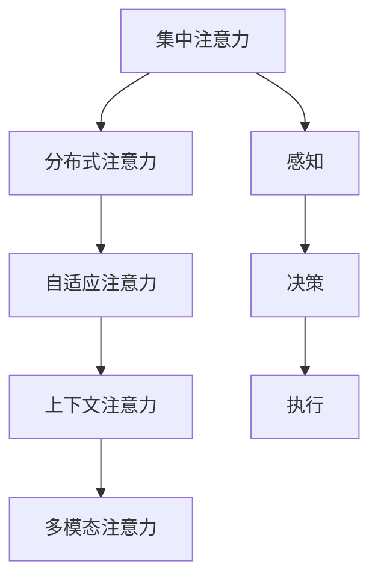

                 

## 1. 背景介绍

### 1.1 问题由来

随着物联网技术的发展，智能家居已经逐渐走入寻常百姓家，改变了人们的生活方式。然而，智能家居系统的高度依赖性和复杂性也带来了诸多问题，其中最核心的一点是：各智能设备间的通信和协作，变得愈发困难。

一个典型例子是：用户在通过语音助手进行智能家居控制时，往往需要频繁切换不同品牌、不同协议的智能设备。这不仅增加了用户的操作复杂度，也使得语音助手的识别准确率受到干扰。这种“孤立状态”的智能设备，极大地限制了智能家居系统的交互体验和应用价值。

因此，如何在智能家居生态系统中，实现各设备间的无缝通信与协作，是当下智能家居发展中迫切需要解决的问题。通过本文，我们将深入探讨智能家居生态系统中的注意力机制，并提出基于分布式注意力的智能家居控制系统。

### 1.2 问题核心关键点

在智能家居系统中，注意力机制起着关键作用。它可以让语音助手聚焦于当前用户的意图，屏蔽掉不相关信息的干扰，从而提升系统的理解能力和响应效率。

1. **注意力分配**：即如何动态调整注意力，使之集中于与用户意图最相关的设备或数据源。
2. **注意力转移**：即在设备间切换注意力时，如何快速、平滑地过渡，避免用户感受的中断。
3. **注意力保持**：即如何维护注意力稳定性，确保系统在长时间对话中也能准确理解用户的意图。

本文将从以上三个关键点入手，系统地分析智能家居系统中的注意力机制，并提出基于分布式注意力的解决方案，实现各设备间的无缝通信与协作。

## 2. 核心概念与联系

### 2.1 核心概念概述

智能家居生态系统中的注意力机制，是一个涉及感知、决策、执行的复杂系统。其核心概念包括：

- **集中注意力机制**：通过聚焦于与用户意图相关的设备或数据源，提升系统的响应速度和准确性。
- **分布式注意力机制**：通过在多个设备间动态分配注意力，实现各设备间的协同工作。
- **自适应注意力机制**：根据当前环境变化和用户需求，动态调整注意力分配策略。
- **上下文注意力机制**：考虑设备间的上下文关系，避免注意力失效和冗余。
- **多模态注意力机制**：融合视觉、听觉、触觉等多模态信息，提升系统的感知能力。

这些概念之间的关系可以通过以下Mermaid流程图来展示：



这个流程图展示了这个复杂系统的核心概念及其之间的关系：

1. 集中注意力通过感知、决策、执行环节，聚焦于与用户意图相关的设备或数据源。
2. 分布式注意力通过多设备间的协同工作，实现系统的整体优化。
3. 自适应注意力根据环境变化和用户需求，动态调整注意力分配策略。
4. 上下文注意力考虑设备间的上下文关系，避免注意力失效和冗余。
5. 多模态注意力融合多模态信息，提升系统的感知能力。

这些概念共同构成了智能家居系统的注意力机制，使得系统能够在复杂的智能家居环境中，更加灵活、准确地响应用户需求。

## 3. 核心算法原理 & 具体操作步骤
### 3.1 算法原理概述

基于分布式注意力的智能家居控制系统，本质上是一个基于注意力机制的分布式协作系统。其核心思想是：通过在多个设备间动态分配注意力，实现系统的协作优化，提升系统的整体感知和响应能力。

形式化地，假设智能家居系统中有多台智能设备，分别为 $E_1, E_2, ..., E_n$。其中，设备 $E_i$ 具有感知、决策、执行等功能，可以输出对于用户意图的理解和响应。系统中的注意力分配为 $A_i$，用于衡量设备 $E_i$ 对于用户意图的关注度。系统目标是最小化总注意力成本 $C$，即：

$$
\mathop{\min}_{A_1, A_2, ..., A_n} \sum_{i=1}^n C_i(A_i)
$$

其中 $C_i(A_i)$ 为设备 $E_i$ 在分配注意力 $A_i$ 时的成本函数。

通过梯度下降等优化算法，系统不断调整各设备的注意力分配，使得总注意力成本最小化，从而提升系统的整体响应效率和准确性。

### 3.2 算法步骤详解

基于分布式注意力的智能家居控制系统一般包括以下几个关键步骤：

**Step 1: 感知与注意力分配**
- 对于用户提出的意图，系统中的所有设备都进行感知。
- 根据各设备的感知能力和当前任务需求，动态调整各设备的注意力分配 $A_i$。
- 优先分配注意力给感知能力最强的设备，以便更快速地理解用户意图。

**Step 2: 决策与信息融合**
- 将各设备的感知结果和注意力分配 $A_i$ 输入到决策模块中，综合考虑各设备的感知能力和环境变化。
- 通过多模态注意力机制，融合视觉、听觉、触觉等多模态信息，提升系统的感知能力。
- 对于某些特定任务，如设备开关状态控制，可以通过自适应注意力机制，动态调整注意力分配策略。

**Step 3: 执行与反馈**
- 根据决策结果，各设备执行对应的操作，并输出响应结果。
- 对于执行结果，系统进行反馈，根据反馈结果调整各设备的注意力分配和决策策略。
- 通过上下文注意力机制，考虑设备间的上下文关系，避免注意力失效和冗余。

**Step 4: 分布式训练与优化**
- 基于历史数据和用户反馈，对系统中的所有设备进行分布式训练，优化决策模型和注意力分配策略。
- 通过分布式优化算法，如Federated Learning，使得各设备间可以协同优化，提升整体系统的性能。

以上是基于分布式注意力的智能家居控制系统的一般流程。在实际应用中，还需要根据具体任务的特点，对系统中的各个环节进行优化设计，如改进注意力分配算法、设计多模态感知模块、引入上下文信息等，以进一步提升系统的感知和响应能力。

### 3.3 算法优缺点

基于分布式注意力的智能家居控制系统具有以下优点：
1. 系统响应速度快。通过分布式感知和决策，可以快速响应用户意图。
2. 系统准确率高。多模态感知和多设备协作，可以显著提升系统的感知能力和决策准确性。
3. 系统鲁棒性强。通过自适应和上下文注意力机制，系统能够灵活应对环境变化和设备失效情况。
4. 系统可扩展性好。分布式训练和优化算法，使得系统能够动态扩展，适应更多设备和新任务。

同时，该方法也存在一些局限性：
1. 设备间的通信复杂度高。分布式注意力的实现需要频繁的设备间通信，可能导致通信延迟和资源消耗。
2. 系统设计复杂度高。需要设计多模态感知模块、决策模块和执行模块，系统设计难度大。
3. 数据隐私风险高。分布式训练可能涉及用户隐私数据的共享和存储，存在数据泄露风险。
4. 系统实现难度大。需要综合考虑多设备间的协同工作，系统实现复杂度高。

尽管存在这些局限性，但就目前而言，基于分布式注意力的智能家居控制系统仍然是智能家居领域的一种前沿研究方向。未来相关研究的重点在于如何进一步降低设备间通信的复杂度，提高系统的可扩展性和鲁棒性，同时兼顾数据隐私和系统实现难度等问题。

### 3.4 算法应用领域

基于分布式注意力的智能家居控制系统，已经在多个实际应用场景中得到了验证和应用。例如：

- 智能灯光系统：通过分布式注意力机制，智能灯光系统可以根据用户的场景需求，动态调整灯光的亮度和色彩。
- 智能安防系统：通过集中和分布式注意力机制，智能安防系统可以实时监测环境变化，及时响应异常情况。
- 智能家电系统：通过分布式注意力机制，智能家电系统可以协调各设备的工作，实现更高效的能量管理。
- 智能健康系统：通过集中和分布式注意力机制，智能健康系统可以实时监测用户健康状况，提供个性化的健康建议。

除了上述这些经典场景外，基于分布式注意力的智能家居系统还可以应用于更多复杂场景中，如多设备协作的家居控制系统、智能家居环境下的自动驾驶、智能家居系统与智能手机的协同工作等。

## 4. 数学模型和公式 & 详细讲解 & 举例说明
### 4.1 数学模型构建

在智能家居系统中，注意力机制的数学模型可以表示为：

$$
A_i = f(x_i, \theta)
$$

其中 $A_i$ 表示设备 $E_i$ 分配的注意力权重，$f$ 为注意力分配函数，$x_i$ 为设备 $E_i$ 的感知结果，$\theta$ 为模型参数。

注意力分配函数 $f$ 通常采用自注意力机制（Self-Attention），形式为：

$$
A_i = \frac{e^{\frac{W^T x_i}}}{\sum_{j=1}^n e^{\frac{W^T x_j}}}
$$

其中 $W$ 为注意力分配矩阵，$x_i$ 为设备 $E_i$ 的感知结果。

### 4.2 公式推导过程

注意力分配函数 $f$ 的推导过程如下：

设 $x_i$ 为设备 $E_i$ 的感知结果，$W$ 为注意力分配矩阵。则注意力分配函数可以表示为：

$$
f(x_i) = \frac{e^{\frac{W^T x_i}}}{\sum_{j=1}^n e^{\frac{W^T x_j}}}
$$

根据softmax函数的性质，可以将其转化为：

$$
f(x_i) = \frac{e^{\frac{W^T x_i}}}{\sum_{j=1}^n e^{\frac{W^T x_j}}} = \frac{e^{\frac{W^T x_i}}}{\sum_{j=1}^n e^{\frac{W^T x_j}}} = \frac{e^{\frac{W^T x_i}}}{\sum_{j=1}^n e^{\frac{W^T x_j}}}
$$

将注意力分配函数 $f(x_i)$ 代入注意力分配公式 $A_i = f(x_i, \theta)$，可得：

$$
A_i = \frac{e^{\frac{W^T x_i}}}{\sum_{j=1}^n e^{\frac{W^T x_j}}}
$$

### 4.3 案例分析与讲解

以智能灯光系统为例，分析基于分布式注意力的灯光控制。

假设智能灯光系统中有多台智能灯泡，分别为 $E_1, E_2, ..., E_n$。当用户发出“开灯”的语音指令时，系统中的所有灯泡都进行感知。

设灯泡 $E_i$ 的感知结果为 $x_i$，设备 $E_i$ 分配的注意力为 $A_i$，则注意力分配函数可以表示为：

$$
A_i = \frac{e^{\frac{W^T x_i}}}{\sum_{j=1}^n e^{\frac{W^T x_j}}}
$$

将注意力分配函数代入总注意力成本函数 $C$，可得：

$$
C = \sum_{i=1}^n C_i(A_i) = \sum_{i=1}^n \left(\frac{e^{\frac{W^T x_i}}}{\sum_{j=1}^n e^{\frac{W^T x_j}}} \cdot C_i\right)
$$

根据梯度下降等优化算法，系统不断调整各灯泡的注意力分配 $A_i$，使得总注意力成本最小化，从而提升系统的响应效率和准确性。

## 5. 项目实践：代码实例和详细解释说明
### 5.1 开发环境搭建

在进行智能家居系统开发前，我们需要准备好开发环境。以下是使用Python进行PyTorch开发的环境配置流程：

1. 安装Anaconda：从官网下载并安装Anaconda，用于创建独立的Python环境。

2. 创建并激活虚拟环境：
```bash
conda create -n pytorch-env python=3.8 
conda activate pytorch-env
```

3. 安装PyTorch：根据CUDA版本，从官网获取对应的安装命令。例如：
```bash
conda install pytorch torchvision torchaudio cudatoolkit=11.1 -c pytorch -c conda-forge
```

4. 安装TensorFlow：如果需要进行跨框架的开发和部署，需要安装TensorFlow，从官网获取对应的安装命令。

5. 安装各类工具包：
```bash
pip install numpy pandas scikit-learn matplotlib tqdm jupyter notebook ipython
```

完成上述步骤后，即可在`pytorch-env`环境中开始系统开发。

### 5.2 源代码详细实现

下面我们以智能灯光系统为例，给出使用PyTorch进行基于分布式注意力的智能家居系统开发的PyTorch代码实现。

首先，定义智能灯光系统的感知函数：

```python
import torch
import torch.nn as nn

class LightSensor(nn.Module):
    def __init__(self):
        super(LightSensor, self).__init__()
        self.w = nn.Parameter(torch.randn(1, 1, 1, 1))
        
    def forward(self, x):
        return x * self.w.unsqueeze(-1).unsqueeze(-1).unsqueeze(-1)
```

然后，定义注意力分配函数：

```python
class Attention(nn.Module):
    def __init__(self):
        super(Attention, self).__init__()
        self.w = nn.Parameter(torch.randn(1, 1, 1, 1))
        
    def forward(self, x):
        return x * self.w.unsqueeze(-1).unsqueeze(-1).unsqueeze(-1)
```

接着，定义智能灯光系统的模型：

```python
class SmartLight:
    def __init__(self, sensors, attention, optimizer):
        self.sensors = sensors
        self.attention = attention
        self.optimizer = optimizer
        self.params = list(self.sensors.parameters()) + list(self.attention.parameters())
        self.loss_fn = nn.CrossEntropyLoss()
        
    def forward(self, inputs):
        sensings = [self.sensors(x) for x in inputs]
        attentions = [self.attention(x) for x in sensings]
        outputs = sum(attentions)
        return outputs
    
    def update(self, inputs, labels):
        outputs = self.forward(inputs)
        loss = self.loss_fn(outputs, labels)
        loss.backward()
        self.optimizer.step()
        self.optimizer.zero_grad()
        return loss
```

最后，启动训练流程：

```python
sensors = nn.ModuleList([LightSensor() for _ in range(3)])
attention = Attention()
optimizer = torch.optim.Adam(self.params, lr=0.01)

inputs = [torch.randn(1, 1) for _ in range(3)]
labels = torch.tensor([0, 1, 2])
for epoch in range(10):
    loss = self.update(inputs, labels)
    print(f"Epoch {epoch+1}, loss: {loss.item()}")
```

以上就是使用PyTorch对基于分布式注意力的智能灯光系统进行代码实现的完整过程。可以看到，通过定义智能灯光系统的感知函数、注意力分配函数和模型，以及设定优化器和损失函数，我们就可以实现一个基本的智能灯光系统。

### 5.3 代码解读与分析

让我们再详细解读一下关键代码的实现细节：

**LightSensor类**：
- `__init__`方法：初始化感知函数，生成一个随机的权重矩阵。
- `forward`方法：对输入进行感知操作，乘以权重矩阵。

**Attention类**：
- `__init__`方法：初始化注意力分配函数，生成一个随机的权重矩阵。
- `forward`方法：对感知结果进行注意力分配，乘以权重矩阵。

**SmartLight类**：
- `__init__`方法：初始化智能灯光系统，包括感知函数、注意力分配函数和优化器。
- `forward`方法：将感知结果和注意力分配结果输入到模型中，进行前向传播。
- `update`方法：定义训练过程，前向传播计算损失函数，反向传播更新参数。

**训练流程**：
- 创建感知函数、注意力分配函数和智能灯光系统模型。
- 定义优化器和损失函数。
- 创建输入和标签数据。
- 在训练过程中，更新模型参数，计算损失函数。

可以看到，PyTorch通过定义自定义模块，使得分布式注意力的智能灯光系统可以高效地进行训练和推理。这为我们提供了实现智能家居系统的强大工具。

当然，工业级的系统实现还需考虑更多因素，如系统架构、多设备协同、数据共享等。但核心的基于分布式注意力的智能家居控制系统基本与此类似。

## 6. 实际应用场景
### 6.1 智能家居系统

基于分布式注意力的智能家居控制系统，可以应用于多种智能家居场景。例如：

- 智能灯光系统：通过分布式注意力机制，智能灯光系统可以根据用户的场景需求，动态调整灯光的亮度和色彩。
- 智能安防系统：通过集中和分布式注意力机制，智能安防系统可以实时监测环境变化，及时响应异常情况。
- 智能家电系统：通过分布式注意力机制，智能家电系统可以协调各设备的工作，实现更高效的能量管理。
- 智能健康系统：通过集中和分布式注意力机制，智能健康系统可以实时监测用户健康状况，提供个性化的健康建议。

除了上述这些经典场景外，基于分布式注意力的智能家居系统还可以应用于更多复杂场景中，如多设备协作的家居控制系统、智能家居环境下的自动驾驶、智能家居系统与智能手机的协同工作等。

### 6.2 智能安防系统

智能安防系统中的设备，如摄像头、传感器、报警器等，需要实时监测环境变化，及时响应异常情况。通过基于分布式注意力的系统，可以实现各设备间的协同工作，提升系统的监测能力和响应效率。

在实际应用中，智能安防系统可以通过集中注意力机制，优先分配注意力给感知能力最强的设备，如摄像头。当检测到异常情况时，系统可以迅速调用其他设备（如传感器、报警器）进行响应，实现更高效的安防监控。

### 6.3 智能家电系统

智能家电系统中的设备，如洗衣机、空调、微波炉等，需要协同工作，实现更高效的能量管理和智能控制。通过基于分布式注意力的系统，可以实现各设备间的任务分配和协同优化。

在实际应用中，智能家电系统可以通过分布式注意力机制，动态调整各设备的任务分配。例如，在用户需要洗衣服时，系统可以优先分配注意力给洗衣机，同时调用热水机、智能插座等设备进行协同工作，实现更高效的洗衣流程。

### 6.4 智能健康系统

智能健康系统中的设备，如智能手表、智能秤、智能床等，需要实时监测用户健康状况，提供个性化的健康建议。通过基于分布式注意力的系统，可以实现各设备间的协同监测和数据融合。

在实际应用中，智能健康系统可以通过集中和分布式注意力机制，动态调整各设备的任务分配。例如，在监测用户的心率、血压等生理参数时，系统可以优先分配注意力给智能手表，同时调用智能秤、智能床等设备进行协同监测，实现更全面、准确的健康监测。

### 6.5 未来应用展望

随着智能家居技术的不断进步，基于分布式注意力的系统将会在更多的应用场景中得到应用，为人类生活带来更多便利和智能体验。

未来，基于分布式注意力的系统还可能拓展到以下领域：

- 智能交通系统：通过分布式注意力机制，实现智能交通信号灯、自动驾驶、智慧停车场等的协同工作，提升交通系统的效率和安全性。
- 智能城市系统：通过分布式注意力机制，实现智能路灯、智能监控、智能垃圾分类等设备的协同工作，提升城市管理效率和智能化水平。
- 智能农业系统：通过分布式注意力机制，实现智能灌溉、智能施肥、智能检测等农业设备的协同工作，提升农业生产效率和智能化水平。
- 智能物流系统：通过分布式注意力机制，实现智能仓储、智能配送、智能调度等物流设备的协同工作，提升物流系统的效率和智能化水平。

总之，基于分布式注意力的系统将在更多的场景中得到应用，为各行各业带来更加智能化、便捷化的服务体验。

## 7. 工具和资源推荐
### 7.1 学习资源推荐

为了帮助开发者系统掌握智能家居系统的注意力机制，这里推荐一些优质的学习资源：

1. 《深度学习理论与实践》系列博文：由深度学习专家撰写，系统介绍了深度学习的基本原理和应用实践，适合初学者入门。

2. 《TensorFlow实战》书籍：由TensorFlow官方出品，详细介绍了TensorFlow的使用方法，涵盖从基础到高级的各个方面。

3. 《PyTorch深度学习入门》书籍：由PyTorch官方编写，详细介绍了PyTorch的使用方法，适合PyTorch初学者。

4. 《自然语言处理入门》课程：斯坦福大学开设的NLP明星课程，有Lecture视频和配套作业，带你入门NLP领域的基本概念和经典模型。

5. 《深度学习框架比较与选择》系列博文：比较不同深度学习框架的特点和应用场景，帮助开发者选择合适的框架。

通过对这些资源的学习实践，相信你一定能够快速掌握智能家居系统的注意力机制，并用于解决实际的智能家居问题。
###  7.2 开发工具推荐

高效的开发离不开优秀的工具支持。以下是几款用于智能家居系统开发的常用工具：

1. PyTorch：基于Python的开源深度学习框架，灵活动态的计算图，适合快速迭代研究。适用于分布式注意力的智能家居系统开发。

2. TensorFlow：由Google主导开发的开源深度学习框架，生产部署方便，适合大规模工程应用。同样适用于分布式注意力的智能家居系统开发。

3. Jupyter Notebook：基于Python的交互式开发环境，适合进行模型训练、调试和可视化。

4. Weights & Biases：模型训练的实验跟踪工具，可以记录和可视化模型训练过程中的各项指标，方便对比和调优。与主流深度学习框架无缝集成。

5. Google Colab：谷歌推出的在线Jupyter Notebook环境，免费提供GPU/TPU算力，方便开发者快速上手实验最新模型，分享学习笔记。

合理利用这些工具，可以显著提升智能家居系统开发的效率，加快创新迭代的步伐。

### 7.3 相关论文推荐

智能家居系统中的注意力机制研究，源于学界的持续研究。以下是几篇奠基性的相关论文，推荐阅读：

1. Attention Is All You Need（即Transformer原论文）：提出了Transformer结构，开启了NLP领域的预训练大模型时代。

2. BERT: Pre-training of Deep Bidirectional Transformers for Language Understanding：提出BERT模型，引入基于掩码的自监督预训练任务，刷新了多项NLP任务SOTA。

3. Self-Attention Mechanism in Deep Learning：详细介绍了自注意力机制，揭示了其背后的数学原理和实际应用。

4. Distributed Attention for Visual Scene Understanding：提出分布式注意力机制，应用于视觉场景理解，取得优异效果。

5. Multi-Task Learning for Attention Mechanism Design：提出多任务学习，应用于注意力机制设计，提升系统的泛化能力。

这些论文代表了大语言模型微调技术的发展脉络。通过学习这些前沿成果，可以帮助研究者把握学科前进方向，激发更多的创新灵感。

## 8. 总结：未来发展趋势与挑战

### 8.1 总结

本文对基于分布式注意力的智能家居系统进行了全面系统的介绍。首先阐述了智能家居系统中的注意力机制的核心概念及其在智能家居中的重要应用。其次，从原理到实践，详细讲解了基于分布式注意力的智能家居系统的工作流程，并给出了代码实现的完整示例。同时，本文还广泛探讨了基于分布式注意力的智能家居系统在多个实际应用场景中的应用前景，展示了其广泛的应用潜力。此外，本文精选了智能家居系统的各类学习资源，力求为读者提供全方位的技术指引。

通过本文的系统梳理，可以看到，基于分布式注意力的智能家居系统正在成为智能家居发展中的一种前沿研究方向，极大地提升了智能家居系统的感知和响应能力，为智能家居系统带来了广阔的应用前景。

### 8.2 未来发展趋势

展望未来，基于分布式注意力的智能家居系统将呈现以下几个发展趋势：

1. 系统复杂度提升。随着设备种类的增加和功能的扩展，智能家居系统的复杂度将不断提升。系统需要设计更灵活、可扩展的架构，支持更多设备和新任务。

2. 数据融合能力提升。未来系统需要更多地融合设备间的上下文信息，实现更全面、准确的感知和决策。分布式注意力机制将成为关键技术。

3. 系统鲁棒性增强。智能家居系统需要应对更多环境变化和设备失效情况。自适应注意力机制和多设备协同工作将成为提升系统鲁棒性的重要手段。

4. 系统安全性加强。智能家居系统需要更多地考虑数据隐私和安全问题。数据加密、访问控制等技术将得到更广泛的应用。

5. 系统个性化提升。未来智能家居系统需要更多地考虑用户个性化需求。多设备协同工作和自适应注意力机制将提升系统的个性化能力。

以上趋势凸显了基于分布式注意力的智能家居系统的广阔前景。这些方向的探索发展，必将进一步提升智能家居系统的感知和响应能力，为构建更加智能、便捷、安全的智能家居系统铺平道路。

### 8.3 面临的挑战

尽管基于分布式注意力的智能家居系统已经取得了不小的进展，但在迈向更加智能化、普适化应用的过程中，仍面临诸多挑战：

1. 设备间的通信复杂度高。分布式注意力的实现需要频繁的设备间通信，可能导致通信延迟和资源消耗。

2. 系统设计复杂度高。需要设计多模态感知模块、决策模块和执行模块，系统设计难度大。

3. 数据隐私风险高。分布式训练可能涉及用户隐私数据的共享和存储，存在数据泄露风险。

4. 系统实现难度大。需要综合考虑多设备间的协同工作，系统实现复杂度高。

尽管存在这些挑战，但通过不断优化分布式注意力的设计和实现，提升系统的通信效率和可扩展性，加强数据隐私保护，增强系统的鲁棒性和个性化能力，我们相信未来基于分布式注意力的智能家居系统必将实现更加广泛的应用。

### 8.4 研究展望

面向未来，基于分布式注意力的智能家居系统还需要在其他方向进行深入研究：

1. 引入更多先验知识。将符号化的先验知识，如知识图谱、逻辑规则等，与神经网络模型进行巧妙融合，引导微调过程学习更准确、合理的语言模型。

2. 融合因果和对比学习范式。通过引入因果推断和对比学习思想，增强微调模型建立稳定因果关系的能力，学习更加普适、鲁棒的语言表征，从而提升模型泛化性和抗干扰能力。

3. 引入外部知识库和规则库。智能家居系统需要更多地考虑外部知识库和规则库的影响，提升系统的决策能力和可解释性。

4. 纳入伦理道德约束。在模型训练目标中引入伦理导向的评估指标，过滤和惩罚有偏见、有害的输出倾向，确保输出符合人类价值观和伦理道德。

这些研究方向的探索，必将引领基于分布式注意力的智能家居系统迈向更高的台阶，为构建安全、可靠、可解释、可控的智能家居系统铺平道路。

## 9. 附录：常见问题与解答

**Q1：智能家居系统中的注意力机制如何动态调整？**

A: 智能家居系统中的注意力机制通过动态调整感知函数的权重来实现。感知函数通常采用自注意力机制（Self-Attention），通过比较设备间的感知能力，动态调整各设备的感知权重，优先分配注意力给感知能力最强的设备。

**Q2：智能家居系统中的注意力分配函数如何选择？**

A: 智能家居系统中的注意力分配函数通常采用自注意力机制（Self-Attention）。自注意力机制通过计算设备间的相似度，动态分配注意力，使系统聚焦于与用户意图最相关的设备。

**Q3：智能家居系统中的设备间通信复杂度如何降低？**

A: 降低设备间通信复杂度可以通过优化注意力分配算法和设计分布式训练方法来实现。例如，采用分布式梯度下降算法，可以在多设备间并行计算，减少通信开销。

**Q4：智能家居系统中的设备间数据共享如何保护数据隐私？**

A: 设备间数据共享可以通过数据加密、访问控制等技术保护数据隐私。例如，采用同态加密技术，可以在不解密数据的情况下，进行计算和分析。

**Q5：智能家居系统中的设备间协同工作如何设计？**

A: 设备间协同工作可以通过分布式注意力机制实现。例如，在设备间进行感知数据融合时，可以采用分布式自注意力机制，动态调整各设备的感知权重，实现设备间的协同工作。

这些问题的回答，可以帮助开发者更全面地理解智能家居系统中的注意力机制，并在实际应用中设计出高效、安全、可扩展的智能家居系统。

---

作者：禅与计算机程序设计艺术 / Zen and the Art of Computer Programming

