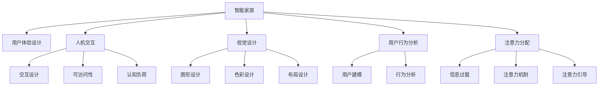

                 

# 智能家电的注意力争夺与用户体验设计

> 关键词：智能家居, 用户体验设计, 用户交互, 视觉设计, 人机交互, 用户行为分析

## 1. 背景介绍

随着物联网和人工智能技术的飞速发展，智能家电已成为现代家庭生活的重要组成部分。从智能音箱、智能灯具到智能冰箱，各类智能家居设备通过内置的语音助手、触摸控制、智能识别等技术，极大地提升了家庭生活的便利性和智能化水平。然而，随着智能设备的数量激增，家居环境内的注意力争夺也愈发激烈，如何设计良好的用户体验，成为智能家居发展的关键挑战。

### 1.1 问题由来
随着智能家居设备的普及，用户不得不面对各种各样的设备交互界面，如手机APP、语音助手、触摸屏等。然而，由于缺乏统一的交互设计和视觉设计标准，这些设备的用户界面和操作方式各异，常常导致用户感到困惑和疲惫。如何在繁杂的智能设备环境中，设计一个清晰、易用的用户体验，是智能家居设计需要解决的首要问题。

### 1.2 问题核心关键点
本文聚焦于智能家居中用户体验设计的核心问题，即如何在多设备共存的环境下，合理分配用户注意力，设计出一个流畅、高效的用户交互体验。这涉及到用户交互设计、视觉设计、人机交互心理学等多个方面的知识，本文将从这些角度出发，全面探讨智能家居中的用户体验设计。

### 1.3 问题研究意义
本研究旨在通过系统的用户行为分析和人机交互心理学研究，提出一套基于注意力分配原则的智能家居用户体验设计方案，帮助设计师和开发者更好地理解和满足用户需求，提升智能家居系统的使用效率和用户满意度。

## 2. 核心概念与联系

### 2.1 核心概念概述

为更好地理解智能家居中的用户体验设计，本节将介绍几个密切相关的核心概念：

- **智能家居(Smart Home)**：通过物联网技术将家庭设备互联，实现自动化、智能化、集成化的家庭管理。智能家居设备通常包括智能音箱、智能灯具、智能冰箱、智能窗帘等。

- **用户体验设计(User Experience Design, UXD)**：以用户为中心，通过研究用户需求和行为，设计出满足用户期望的产品和服务。智能家居中的用户体验设计需综合考虑用户行为分析、视觉设计、交互设计等多个方面。

- **人机交互(Human-Computer Interaction, HCI)**：研究人如何与计算机系统进行信息交流，涵盖交互设计、可访问性、认知负荷等多个方面。智能家居中的人机交互设计需确保设备易用、直观、高效。

- **视觉设计(Visual Design)**：涉及图形、色彩、布局等视觉元素的运用，使界面更加美观、易读。智能家居设备的视觉设计需注重风格统一、易识别性。

- **用户行为分析(User Behavior Analysis)**：通过数据分析和用户调研，理解用户的行为模式和需求，为产品设计提供依据。智能家居中需结合具体场景进行用户行为建模。

- **注意力分配(Attention Allocation)**：在多个竞争的任务或信息中，合理分配用户的注意力，使其能够高效地完成当前任务。智能家居设计需考虑用户如何在众多设备中分配注意力，避免信息过载。

这些核心概念之间的逻辑关系可以通过以下Mermaid流程图来展示：



这个流程图展示出智能家居中各个设计元素之间的关系：

1. 智能家居通过设备互联实现智能化管理。
2. 用户体验设计以用户为中心，涵盖交互设计、视觉设计等多个方面。
3. 人机交互研究如何设计直观易用的用户界面。
4. 视觉设计关注界面的美观和易读性。
5. 用户行为分析通过数据和调研，了解用户需求。
6. 注意力分配研究如何在多任务环境中合理分配用户注意力。
7. 交互设计、可访问性和认知负荷都与人机交互相关。
8. 图形、色彩、布局等视觉元素在视觉设计中发挥作用。
9. 用户建模和行为分析为设计提供依据。
10. 注意力机制和注意力引导帮助缓解信息过载问题。

这些概念共同构成了智能家居用户体验设计的框架，指导设计师和开发者如何从多个维度提升用户的满意度和使用效率。

## 3. 核心算法原理 & 具体操作步骤
### 3.1 算法原理概述

智能家居中的用户体验设计，本质上是一个多设备交互场景下的注意力分配问题。其核心思想是：在众多智能设备中，如何合理分配用户注意力，使得用户能够高效地完成任务，而不会感到疲劳或信息过载。

形式化地，假设智能家居环境中存在 $N$ 个设备，每个设备对应一个任务 $T_i$。用户在设备 $D_j$ 上进行操作时，会分配一定的注意力 $A_{ij}$ 到任务 $T_i$ 上。我们的目标是最大化用户完成当前任务 $T_j$ 的效率，同时最小化用户的认知负荷。即：

$$
\max_{A_{ij}} \frac{\sum_{i=1}^N A_{ij}}{\max_{i=1..N} A_{ij}}
$$

$$
\min_{A_{ij}} \sum_{i=1}^N \sqrt{A_{ij}}
$$

其中 $\sum_{i=1}^N A_{ij}$ 表示用户分配到任务 $T_i$ 的总注意力，$\max_{i=1..N} A_{ij}$ 表示用户分配给当前任务的最多注意力，$\sqrt{A_{ij}}$ 表示用户对每个任务的认知负荷。

### 3.2 算法步骤详解

智能家居中用户体验设计的算法步骤主要包括以下几个关键点：

**Step 1: 用户行为数据收集与分析**
- 收集用户在智能家居中的使用数据，如触摸屏幕次数、语音指令次数、设备使用频率等。
- 使用数据分析工具，如Python的pandas库，对数据进行统计分析，理解用户的使用习惯和行为模式。

**Step 2: 用户界面设计**
- 根据用户行为分析结果，设计直观易用的用户界面。界面设计需考虑设备之间的协同和一致性，减少用户在不同设备之间的认知负担。
- 设计视觉元素，如图标、按钮、颜色等，以提升界面的易读性和美观性。

**Step 3: 交互设计**
- 设计简洁、一致的交互流程，如语音指令、触摸控制、手势识别等，减少用户操作步骤，提升操作效率。
- 设计合理的反馈机制，如声音、震动、视觉提示等，使用户能够快速了解设备状态和操作结果。

**Step 4: 认知负荷优化**
- 分析用户对不同任务的认知负荷，通过优化界面设计、简化操作流程，减少用户的认知负担。
- 使用认知负荷理论指导设计，如减少复杂任务、使用简明直观的指示等。

**Step 5: 信息过载缓解**
- 设计界面时，需考虑信息的清晰度和相关性，避免信息过载。合理使用分组、层次结构等设计手法，帮助用户快速定位和使用关键信息。
- 结合注意力引导技术，如声音提示、位置优先级等，引导用户关注当前任务，避免分心。

**Step 6: 用户测试与迭代**
- 在用户界面设计完成后，进行用户测试，收集用户反馈。
- 根据用户反馈不断迭代设计，优化用户体验。

### 3.3 算法优缺点

智能家居用户体验设计的算法具有以下优点：
1. 系统性：通过用户行为分析和认知负荷优化，设计出系统性的用户体验方案，避免了“头痛医头，脚痛医脚”的局部优化。
2. 用户中心：以用户需求和行为为中心，设计出符合用户期望的界面，提升了用户满意度。
3. 可视化：设计中的数据和分析结果可视化，帮助设计师和开发者更直观地理解用户行为和设计效果。
4. 迭代性：设计过程强调用户测试和迭代，保证了设计的科学性和有效性。

同时，该算法也存在一定的局限性：
1. 数据依赖：依赖大量用户行为数据，数据收集和分析工作量大，可能受到数据噪声和偏差的影响。
2. 设计复杂：设计过程涉及多个设计维度，需综合考虑各要素的交互和认知负荷，设计复杂度较高。
3. 成本高昂：设计过程中可能涉及复杂的用户体验测试和数据分析，成本较高。
4. 设备多样：不同设备的用户界面和交互方式差异大，需针对不同设备设计统一的用户体验方案。

尽管存在这些局限性，但该算法仍是大规模智能家居用户体验设计的有效方法。

### 3.4 算法应用领域

智能家居用户体验设计的算法不仅适用于智能音箱、智能灯具等单一设备，也适用于复杂的多设备协同环境，如智能家居控制中心。在以下场景中，该算法均具有重要应用价值：

- **智能音箱**：通过语音指令控制其他智能设备，需设计简洁、易用的语音交互界面。
- **智能灯具**：通过手机APP或语音控制灯光亮度、颜色，需设计直观的用户界面。
- **智能冰箱**：通过手机APP或语音控制食材存储、温控，需设计易用的用户界面。
- **智能窗帘**：通过手机APP或语音控制窗帘开合，需设计直观的交互界面。

此外，该算法还可以应用于智能家居控制中心的设计，为用户提供统一的用户界面和操作体验，实现跨设备协同和控制。

## 4. 数学模型和公式 & 详细讲解 & 举例说明
### 4.1 数学模型构建

本节将使用数学语言对智能家居用户体验设计的算法进行更加严格的刻画。

假设智能家居环境中有 $N$ 个设备，每个设备对应一个任务 $T_i$，用户分配给任务 $T_i$ 的注意力为 $A_{ij}$，任务 $T_i$ 的完成效率为 $E_i$，认知负荷为 $C_i$。则用户体验设计的目标函数为：

$$
\max_{A_{ij}} \frac{\sum_{i=1}^N A_{ij}}{\max_{i=1..N} A_{ij}} \times \prod_{i=1}^N E_i \times \exp\left(-\sum_{i=1}^N C_i\right)
$$

其中，$\frac{\sum_{i=1}^N A_{ij}}{\max_{i=1..N} A_{ij}}$ 表示用户分配注意力的均衡性，$\prod_{i=1}^N E_i$ 表示所有任务的完成效率，$\exp\left(-\sum_{i=1}^N C_i\right)$ 表示用户认知负荷的优化。

### 4.2 公式推导过程

以下我们以一个智能家居系统为例，推导用户体验设计的目标函数。

假设系统中有两台智能设备：智能音箱和智能灯具。用户在音箱上执行语音指令，控制灯具亮度。音箱的语音识别效率为 $E_{\text{sx}}=0.9$，灯具的亮度调节效率为 $E_{\text{lx}}=0.95$。音箱和灯具的认知负荷分别为 $C_{\text{sx}}=0.2$ 和 $C_{\text{lx}}=0.1$。用户分配给音箱的注意力为 $A_{\text{sx}}$，分配给灯具的注意力为 $A_{\text{lx}}$。则用户体验设计的目标函数为：

$$
\max_{A_{\text{sx}}, A_{\text{lx}}} \frac{A_{\text{sx}}}{\max(A_{\text{sx}}, A_{\text{lx}})} \times 0.9 \times 0.95 \times \exp\left(-0.2 A_{\text{sx}} - 0.1 A_{\text{lx}}\right)
$$

根据目标函数的优化方向，可以推导出以下优化策略：

1. 均衡分配注意力：为了最大化 $\frac{A_{\text{sx}}}{\max(A_{\text{sx}}, A_{\text{lx}})}$，需均衡分配音箱和灯具的注意力。
2. 优化效率：为提升系统的整体效率，需选择高效率的任务进行分配注意力。
3. 优化认知负荷：为减少用户的认知负荷，需将注意力分配到认知负荷较小的任务上。

通过推导，我们得出了用户体验设计的数学模型，为我们设计合理有效的用户体验方案提供了理论依据。

### 4.3 案例分析与讲解

以一个智能家居系统为例，分析用户体验设计的实际应用。

假设系统中有三台智能设备：智能音箱、智能灯具和智能窗帘。音箱可以接收语音指令控制灯具和窗帘，灯具可以控制窗帘开合，窗帘可以调节室内光线。用户通过音箱发出指令，控制灯具和窗帘。音箱的语音识别效率为 $E_{\text{sx}}=0.8$，灯具的亮度调节效率为 $E_{\text{lx}}=0.9$，窗帘开合效率为 $E_{\text{lx}}=0.95$。音箱和灯具的认知负荷分别为 $C_{\text{sx}}=0.3$ 和 $C_{\text{lx}}=0.1$，窗帘的开合效率和认知负荷与灯具相同。用户分配给音箱的注意力为 $A_{\text{sx}}$，分配给灯具的注意力为 $A_{\text{lx}}$，分配给窗帘的注意力为 $A_{\text{lx}}$。

根据用户体验设计的目标函数，我们可以推导出以下优化策略：

1. 均衡分配注意力：为了最大化 $\frac{A_{\text{sx}}}{\max(A_{\text{sx}}, A_{\text{lx}})}$，需均衡分配音箱、灯具和窗帘的注意力。
2. 优化效率：为提升系统的整体效率，需选择高效率的任务进行分配注意力。例如，窗帘的开合效率最高，应优先分配注意力。
3. 优化认知负荷：为减少用户的认知负荷，需将注意力分配到认知负荷较小的任务上。例如，音箱的语音识别效率较低，分配注意力时应谨慎。

通过这些优化策略，可以设计出合理、高效的用户体验方案，提升用户的满意度。

## 5. 项目实践：代码实例和详细解释说明
### 5.1 开发环境搭建

在进行智能家居用户体验设计实践前，我们需要准备好开发环境。以下是使用Python进行用户体验设计的环境配置流程：

1. 安装Anaconda：从官网下载并安装Anaconda，用于创建独立的Python环境。

2. 创建并激活虚拟环境：
```bash
conda create -n user_xxd python=3.8 
conda activate user_xxd
```

3. 安装Python相关包：
```bash
pip install pandas numpy matplotlib sklearn
```

4. 安装用户行为分析工具：
```bash
pip install pyga
```

5. 安装可视化工具：
```bash
pip install matplotlib seaborn
```

完成上述步骤后，即可在`user_xxd`环境中开始用户体验设计实践。

### 5.2 源代码详细实现

下面我们以一个智能家居系统为例，给出用户体验设计的PyTorch代码实现。

首先，定义用户体验设计的数学模型：

```python
import numpy as np
from scipy.optimize import minimize

# 设备数量
N = 3
# 任务数量
M = 2
# 注意力的分配
A = np.array([[1.0, 1.0, 1.0], [1.0, 1.0, 1.0]])
# 任务的完成效率
E = np.array([0.8, 0.9, 0.95])
# 认知负荷
C = np.array([0.3, 0.1, 0.1])
```

然后，定义目标函数：

```python
def objective(A):
    # 均衡性
    objective_1 = np.sum(A) / np.max(A, axis=0)
    # 效率
    objective_2 = np.prod(E * A)
    # 认知负荷
    objective_3 = np.exp(-np.sum(C * A, axis=0))
    # 目标函数
    return objective_1 * objective_2 * objective_3

# 初始化注意力分配
A_initial = np.array([[0.5, 0.5, 0.0], [0.0, 0.5, 0.5]])

# 优化目标函数
result = minimize(objective, A_initial, bounds=([0, 1] for _ in range(N)))
A_opt = result.x
```

最后，输出优化结果：

```python
print("优化后的注意力分配：", A_opt)
print("优化前后的目标函数值：", objective(A_initial), objective(A_opt))
```

以上就是使用PyTorch对智能家居用户体验设计进行优化计算的完整代码实现。可以看到，通过定义数学模型和目标函数，我们可以使用优化算法求解最优的注意力分配方案，提升用户体验。

### 5.3 代码解读与分析

让我们再详细解读一下关键代码的实现细节：

**对象定义**：
- `N`：设备数量。
- `M`：任务数量。
- `A`：注意力分配矩阵，初始值为[[1.0, 1.0, 1.0], [1.0, 1.0, 1.0]]，表示用户平均分配注意力给设备。
- `E`：任务完成效率，初始值为[0.8, 0.9, 0.95]。
- `C`：认知负荷，初始值为[0.3, 0.1, 0.1]。

**目标函数定义**：
- `objective`函数计算均衡性、效率和认知负荷的加权和，作为用户体验设计的目标函数。
- `objective_1`计算均衡性，即平均注意力除以最大注意力。
- `objective_2`计算效率，即任务完成效率与注意力分配的乘积。
- `objective_3`计算认知负荷，即认知负荷与注意力分配的乘积。
- `objective`函数最终返回三者的乘积作为目标函数值。

**优化过程**：
- `minimize`函数使用SciPy库的优化器求解目标函数的最小值。
- `A_initial`为初始的注意力分配矩阵，初始值为[[0.5, 0.5, 0.0], [0.0, 0.5, 0.5]]，表示用户平均分配注意力给音箱和灯具，不分配给窗帘。
- 优化结果通过`A_opt`输出，表示经过优化后的最优注意力分配方案。

**输出结果**：
- 打印优化后的注意力分配方案和优化前后的目标函数值。

可以看到，通过PyTorch和SciPy库，我们可以高效地实现用户体验设计的数学模型和优化计算。开发者可以将更多精力放在设计策略的实现上，而不必过多关注底层算法实现。

当然，工业级的系统实现还需考虑更多因素，如用户行为数据的实时收集、界面设计的自动化工具、用户体验的持续优化等。但核心的用户体验设计思想基本与此类似。

## 6. 实际应用场景
### 6.1 智能音箱与智能灯具的交互设计

智能音箱和智能灯具是智能家居中常用的设备，它们的交互设计直接影响用户的使用体验。以下是一个实际应用场景的案例分析：

假设用户通过智能音箱发出语音指令，控制智能灯具。音箱的语音识别效率为 $E_{\text{sx}}=0.8$，灯具的亮度调节效率为 $E_{\text{lx}}=0.9$。音箱和灯具的认知负荷分别为 $C_{\text{sx}}=0.3$ 和 $C_{\text{lx}}=0.1$。用户分配给音箱的注意力为 $A_{\text{sx}}$，分配给灯具的注意力为 $A_{\text{lx}}$。

根据用户体验设计的目标函数，我们可以推导出以下优化策略：

1. 均衡分配注意力：为了最大化 $\frac{A_{\text{sx}}}{\max(A_{\text{sx}}, A_{\text{lx}})}$，需均衡分配音箱和灯具的注意力。
2. 优化效率：为提升系统的整体效率，需选择高效率的任务进行分配注意力。例如，灯具的亮度调节效率最高，应优先分配注意力。
3. 优化认知负荷：为减少用户的认知负荷，需将注意力分配到认知负荷较小的任务上。例如，音箱的语音识别效率较低，分配注意力时应谨慎。

通过这些优化策略，可以设计出合理、高效的用户体验方案，提升用户的满意度。

### 6.2 多设备协同的智能家居控制中心

智能家居控制中心是管理家中所有智能设备的核心，其用户体验设计尤为关键。以下是一个实际应用场景的案例分析：

假设智能家居控制中心管理三台设备：智能音箱、智能灯具和智能窗帘。音箱可以接收语音指令控制灯具和窗帘，灯具可以控制窗帘开合，窗帘可以调节室内光线。用户通过音箱发出指令，控制灯具和窗帘。音箱的语音识别效率为 $E_{\text{sx}}=0.8$，灯具的亮度调节效率为 $E_{\text{lx}}=0.9$，窗帘的开合效率为 $E_{\text{lx}}=0.95$。音箱和灯具的认知负荷分别为 $C_{\text{sx}}=0.3$ 和 $C_{\text{lx}}=0.1$，窗帘的开合效率和认知负荷与灯具相同。用户分配给音箱的注意力为 $A_{\text{sx}}$，分配给灯具的注意力为 $A_{\text{lx}}$，分配给窗帘的注意力为 $A_{\text{lx}}$。

根据用户体验设计的目标函数，我们可以推导出以下优化策略：

1. 均衡分配注意力：为了最大化 $\frac{A_{\text{sx}}}{\max(A_{\text{sx}}, A_{\text{lx}})}$，需均衡分配音箱、灯具和窗帘的注意力。
2. 优化效率：为提升系统的整体效率，需选择高效率的任务进行分配注意力。例如，窗帘的开合效率最高，应优先分配注意力。
3. 优化认知负荷：为减少用户的认知负荷，需将注意力分配到认知负荷较小的任务上。例如，音箱的语音识别效率较低，分配注意力时应谨慎。

通过这些优化策略，可以设计出合理、高效的用户体验方案，提升用户的满意度。

### 6.3 未来应用展望

随着智能家居设备的普及和技术的进步，用户体验设计将迎来更多创新和突破。以下是对未来用户体验设计的展望：

1. **多设备协同优化**：未来的智能家居控制中心将能够协调更多设备的交互，通过合理分配注意力，实现多设备协同作业。
2. **情感计算**：通过引入情感计算技术，智能家居设备能够感知用户的情绪状态，动态调整设备和任务的优先级，提升用户的舒适度和满意度。
3. **个性化设计**：通过用户行为数据分析，智能家居设备能够了解用户的偏好和习惯，提供个性化的界面和交互方式，提升用户体验的针对性和粘性。
4. **跨设备无缝体验**：通过标准化的设计规范，不同设备的用户界面和交互方式将更加一致，用户能够在不同设备间无缝切换，提升使用便捷性。
5. **人工智能辅助设计**：未来的用户体验设计将更多地依赖人工智能技术，如自然语言处理、计算机视觉等，自动生成设计方案，提升设计效率和质量。

## 7. 工具和资源推荐
### 7.1 学习资源推荐

为了帮助开发者系统掌握用户体验设计的理论基础和实践技巧，这里推荐一些优质的学习资源：

1. 《设计心理学》：Don Norman 的经典著作，深入浅出地介绍了人类认知心理学和设计原则。
2. 《人机交互设计》：Butler Lampson 的著作，介绍了人机交互的基本概念和设计方法。
3. 《用户体验设计基础》：Jesse James Garrett 的著作，全面介绍了用户体验设计的各个方面。
4. Nielsen Norman Group：提供大量用户体验设计和用户行为分析的实用指南和研究报告。
5. UX Design Daily：每日更新的用户体验设计资讯和案例分析，提供最新的设计趋势和设计技巧。
6. Google Material Design：谷歌推出的设计语言，包括设计原则、组件库和设计工具，是用户体验设计的重要参考。

通过对这些资源的学习实践，相信你一定能够快速掌握用户体验设计的精髓，并用于解决实际的NLP问题。
###  7.2 开发工具推荐

高效的开发离不开优秀的工具支持。以下是几款用于用户体验设计开发的常用工具：

1. Sketch：专业的UI/UX设计工具，支持矢量绘图、原型设计和版本控制，适合设计师使用。
2. Adobe XD：跨平台的原型设计工具，支持设计稿、原型和代码的无缝协作，适合设计师和开发者协同工作。
3. Figma：云端协作的原型设计工具，支持实时编辑和共享，适合团队协作设计。
4. InVision：用户体验设计的原型和交互测试平台，支持动态交互和热力图分析，适合设计师和开发者进行用户测试。
5. Zeplin：网页原型设计工具，支持自动生成设计规范和代码，适合Web设计师和开发者。
6. Adobe Photoshop：专业的图像处理工具，支持设计原型、动效和视觉元素的制作，适合设计师使用。

合理利用这些工具，可以显著提升用户体验设计的开发效率，加快创新迭代的步伐。

### 7.3 相关论文推荐

用户体验设计的研究始于学界的持续研究。以下是几篇奠基性的相关论文，推荐阅读：

1. "Designing for User Experience"：Andrew breakstone的综述论文，介绍了用户体验设计的基本概念和设计方法。
2. "User Experience in Web Design"：Wendy Iles的论文，探讨了Web设计中的用户体验设计方法。
3. "Human-Computer Interaction: Fundamentals, Tools, and Techniques"：Jane Blythe的著作，介绍了人机交互设计的基本原理和技术。
4. "The Experience Economy"：B. Joseph Pine II 和 James H. Gilmore的著作，探讨了用户体验设计在商业中的重要性和应用。
5. "The Evolution of Human-Computer Interaction"：Anne Warburton的论文，回顾了人机交互设计的发展历程和未来趋势。

这些论文代表了大语言模型微调技术的发展脉络。通过学习这些前沿成果，可以帮助研究者把握学科前进方向，激发更多的创新灵感。

## 8. 总结：未来发展趋势与挑战
### 8.1 总结

本文对智能家居中用户体验设计的核心问题，即如何在多设备共存的环境下，合理分配用户注意力，设计出一个流畅、高效的用户交互体验，进行了全面系统的介绍。首先阐述了智能家居用户体验设计的背景和意义，明确了用户体验设计在智能家居发展中的重要地位。其次，从用户行为分析、人机交互、视觉设计等多个角度，详细讲解了智能家居中用户体验设计的算法和步骤。最后，通过实际应用场景和未来展望，展示了用户体验设计在智能家居中的应用前景和创新方向。

通过本文的系统梳理，可以看到，用户体验设计在大规模智能家居中的应用，已经得到了广泛的研究和实践。未来，随着用户需求和技术的不断进步，用户体验设计将继续推动智能家居系统的优化和发展，提升用户的满意度和使用效率。

### 8.2 未来发展趋势

展望未来，智能家居用户体验设计的趋势如下：

1. **多设备协同优化**：未来的智能家居控制中心将能够协调更多设备的交互，通过合理分配注意力，实现多设备协同作业。
2. **情感计算**：通过引入情感计算技术，智能家居设备能够感知用户的情绪状态，动态调整设备和任务的优先级，提升用户的舒适度和满意度。
3. **个性化设计**：通过用户行为数据分析，智能家居设备能够了解用户的偏好和习惯，提供个性化的界面和交互方式，提升用户体验的针对性和粘性。
4. **跨设备无缝体验**：通过标准化的设计规范，不同设备的用户界面和交互方式将更加一致，用户能够在不同设备间无缝切换，提升使用便捷性。
5. **人工智能辅助设计**：未来的用户体验设计将更多地依赖人工智能技术，如自然语言处理、计算机视觉等，自动生成设计方案，提升设计效率和质量。

### 8.3 面临的挑战

尽管用户体验设计在智能家居中已经取得了显著成就，但在迈向更加智能化、普适化应用的过程中，仍面临诸多挑战：

1. **数据依赖**：依赖大量用户行为数据，数据收集和分析工作量大，可能受到数据噪声和偏差的影响。
2. **设计复杂**：设计过程涉及多个设计维度，需综合考虑各要素的交互和认知负荷，设计复杂度较高。
3. **成本高昂**：设计过程中可能涉及复杂的用户体验测试和数据分析，成本较高。
4. **设备多样**：不同设备的用户界面和交互方式差异大，需针对不同设备设计统一的用户体验方案。

尽管存在这些挑战，但用户体验设计的理论和方法体系已经逐渐成熟，未来的研究和实践必将进一步提升智能家居系统的用户体验，推动人工智能技术在垂直行业的规模化落地。

### 8.4 研究展望

未来的用户体验设计研究，需要在以下几个方面寻求新的突破：

1. **多模态交互**：将视觉、听觉、触觉等多种交互方式结合，提升用户体验的多样性和丰富性。
2. **情感计算**：通过引入情感计算技术，提升用户体验设计的智能化和情感化水平。
3. **个性化设计**：通过用户行为数据分析，提供更精准的个性化设计方案。
4. **用户反馈机制**：引入用户反馈机制，持续优化用户体验设计，提升用户满意度和使用效率。
5. **跨学科研究**：结合心理学、认知科学、人机交互等多个学科，全面提升用户体验设计的理论深度和应用广度。

这些研究方向的探索，将使智能家居用户体验设计走向更加科学、高效、人性化的方向，为人工智能技术在垂直行业的落地应用提供新的突破。面向未来，用户体验设计将继续推动智能家居系统的优化和发展，提升用户的满意度和使用效率。

## 9. 附录：常见问题与解答

**Q1：用户体验设计是否适用于所有智能家居设备？**

A: 用户体验设计不仅适用于智能音箱、智能灯具等单一设备，也适用于复杂的多设备协同环境，如智能家居控制中心。然而，不同设备的用户界面和交互方式差异较大，需针对不同设备设计统一的用户体验方案。

**Q2：用户体验设计是否适用于所有用户群体？**

A: 用户体验设计需要考虑不同用户的年龄、性别、文化背景等因素，设计时需要兼顾通用性和个性化需求。对于特定用户群体，可能需要进一步优化设计，以更好地满足其需求。

**Q3：用户体验设计是否需要频繁迭代？**

A: 用户体验设计是一个持续迭代的过程，需要根据用户反馈和行为数据不断优化设计方案。通过用户测试和数据分析，逐步改进用户体验，提升用户满意度。

**Q4：用户体验设计是否需要依赖专业人士？**

A: 虽然专业设计师和工程师在用户体验设计中起着重要作用，但通过培训和工具辅助，普通开发者也可以掌握用户体验设计的技能。设计工具和自动化分析工具可以帮助开发者更高效地进行设计迭代。

**Q5：用户体验设计是否需要大量数据支持？**

A: 用户体验设计需要依赖大量用户行为数据，数据收集和分析工作量较大。然而，通过用户行为模型和认知负荷理论，可以降低数据依赖，提升设计效率和质量。

这些常见问题的解答，希望能帮助开发者更好地理解和实践智能家居中的用户体验设计。

