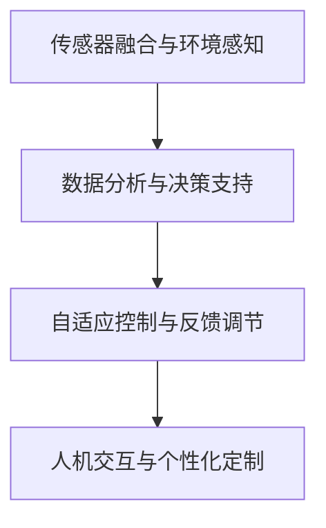

                 

# 智能微气候控制创业：个人舒适区的精确调节

> 关键词：智能微气候控制,精确调节,人工智能,深度学习,大数据,舒适区,创业

## 1. 背景介绍

### 1.1 问题由来

随着经济的发展和城市化进程的加快，人们对于居住环境的要求越来越高。一个舒适宜居的空间，不仅能够提升工作和学习效率，还能带来健康和幸福感的提升。然而，如何实现智能化的室内微气候控制，让室内环境始终保持在最佳状态，却是一个复杂且昂贵的问题。

传统的微气候控制，依赖于人工手动调节或简单的自动化控制系统，无法实现对环境变化的精确控制。而随着人工智能和大数据技术的快速发展，智能微气候控制系统（Smart Climate Control System, SCCS）已经成为可能，它可以通过感知环境变化，自动调节室内温度、湿度、光照等参数，实现高精度的环境控制。

### 1.2 问题核心关键点

智能微气候控制的核心在于如何利用先进的传感器和大数据分析技术，精确感知环境变化，并自动调节控制设备。其核心技术包括：

- 传感器融合与环境感知：通过多种传感器（如温度传感器、湿度传感器、光照传感器等）实时采集环境数据，构建室内微气候模型。
- 数据分析与决策支持：基于大数据分析算法，实时处理传感器数据，提取环境变化趋势和模式。
- 自适应控制与反馈调节：根据环境模型和决策结果，自动调节控制设备（如空调、加湿器、窗帘等），并根据反馈数据进行实时修正。
- 人机交互与个性化定制：通过用户反馈和行为数据，进行个性化设置，提升用户舒适度和满意度。

这些关键技术协同工作，可以实现对室内微气候的精确调节，极大地提升用户的居住体验和生产效率。

### 1.3 问题研究意义

智能微气候控制系统的研究与应用，具有重要的现实意义：

1. 提升居住舒适度：智能微气候控制系统能够根据用户的行为和偏好，实时调整室内环境参数，使其始终保持在最佳状态。
2. 降低能源消耗：通过精确调节，避免不必要的能源浪费，降低家庭或办公场所的能源消耗。
3. 提高工作效率：良好的室内环境有助于提升人的注意力和工作效率，尤其是在长时间工作和学习时更为明显。
4. 推动技术创新：智能微气候控制系统涉及传感器、数据处理、控制算法等多个领域的技术融合，有助于推动相关技术的发展和应用。
5. 推动产业升级：智能微气候控制系统的应用，可以加速传统建筑和家居产业的智能化升级，提高整体产业的竞争力和市场价值。

## 2. 核心概念与联系

### 2.1 核心概念概述

为更好地理解智能微气候控制系统的技术原理，本节将介绍几个关键概念：

- 传感器融合与环境感知：通过多种传感器实时采集环境数据，构建室内微气候模型。
- 数据分析与决策支持：基于大数据分析算法，实时处理传感器数据，提取环境变化趋势和模式。
- 自适应控制与反馈调节：根据环境模型和决策结果，自动调节控制设备，并根据反馈数据进行实时修正。
- 人机交互与个性化定制：通过用户反馈和行为数据，进行个性化设置，提升用户舒适度和满意度。

这些核心概念之间的逻辑关系可以通过以下Mermaid流程图来展示：



这个流程图展示了我司智能微气候控制系统的核心概念及其之间的关系：

1. 传感器融合与环境感知：采集环境数据，构建模型。
2. 数据分析与决策支持：处理数据，提取趋势。
3. 自适应控制与反馈调节：调节设备，实时修正。
4. 人机交互与个性化定制：反馈用户，优化设置。

这些概念共同构成了智能微气候控制系统的技术框架，使其能够实现高精度的环境控制和个性化服务。

## 3. 核心算法原理 & 具体操作步骤
### 3.1 算法原理概述

智能微气候控制系统的核心算法包括传感器数据融合、大数据分析、自适应控制和反馈调节。其核心思想是：通过多种传感器实时采集环境数据，利用大数据分析技术，构建室内微气候模型，并基于模型进行精确控制和调节。

形式化地，假设环境数据为 $D=\{x_1,x_2,...,x_N\}$，其中 $x_i$ 表示第 $i$ 个时刻的传感器数据，模型为 $M=f(D)$，决策结果为 $y=f(M)$，控制设备状态为 $S=f(y)$。智能微气候控制系统的工作流程如下：

1. 传感器数据采集：通过多种传感器（如温度传感器、湿度传感器、光照传感器等）实时采集环境数据。
2. 数据预处理与融合：对传感器数据进行预处理，去除噪声和异常值，并进行数据融合，构建综合性的环境模型。
3. 数据分析与决策：基于大数据分析算法（如回归分析、时序预测、聚类分析等），实时处理环境数据，提取环境变化趋势和模式。
4. 控制设备调节：根据决策结果，自动调节控制设备（如空调、加湿器、窗帘等），并根据反馈数据进行实时修正。

### 3.2 算法步骤详解

智能微气候控制系统的实现步骤如下：

**Step 1: 传感器安装与数据采集**
- 选择合适的传感器类型和安装位置，确保能够覆盖室内空间的主要环境参数。
- 使用传感器融合技术，实时采集温度、湿度、光照等环境数据。

**Step 2: 数据预处理与融合**
- 对传感器数据进行预处理，包括去噪、异常值检测、数据归一化等。
- 使用数据融合技术（如卡尔曼滤波、粒子滤波等），将多个传感器数据进行综合处理，构建更准确的室内环境模型。

**Step 3: 数据分析与决策**
- 使用大数据分析算法，对环境数据进行实时处理，提取环境变化趋势和模式。
- 构建决策模型，将环境模型和用户偏好相结合，生成精确的决策结果。

**Step 4: 控制设备调节**
- 根据决策结果，自动调节控制设备（如空调、加湿器、窗帘等）。
- 实时监测反馈数据，对控制策略进行修正，确保环境始终保持在最佳状态。

### 3.3 算法优缺点

智能微气候控制系统的优点包括：

- 精确控制：通过传感器和数据分析，能够实现对室内环境的精确控制，提升用户舒适度。
- 节能环保：根据环境模型和决策结果，避免不必要的能源浪费，降低能源消耗。
- 自动化管理：自动调节控制设备，减少人工干预，提高工作效率和管理效率。
- 个性化定制：根据用户行为和偏好进行个性化设置，提升用户满意度和体验。

同时，该系统也存在一些局限性：

- 成本较高：传感器和控制设备的安装和维护成本较高，需要较高的初始投资。
- 技术复杂：系统涉及多种技术领域的融合，技术实现较为复杂。
- 数据隐私：传感器数据需要实时上传和处理，可能存在数据隐私和安全问题。
- 系统鲁棒性：在面对极端环境变化时，系统需要具备足够的鲁棒性和适应性。

尽管存在这些局限性，但就目前而言，智能微气候控制系统仍是大数据分析和人工智能技术应用的重要方向。未来相关研究的重点在于如何进一步降低系统成本，提高系统鲁棒性和安全性，以及提升个性化定制能力。

### 3.4 算法应用领域

智能微气候控制系统已经在多个领域得到应用，例如：

- 家庭环境控制：智能家居环境中，通过传感器实时采集环境数据，自动调节空调、加湿器、窗帘等设备，提升家庭居住舒适度。
- 办公环境控制：商业办公楼宇中，通过传感器和数据分析，自动调节室内环境，提升员工工作效率和满意度。
- 公共空间控制：博物馆、会议室等公共空间，通过智能微气候控制系统，实现对环境的高效管理，提升用户体验。
- 医疗环境控制：医院病房等特殊环境，通过精确调节微气候，提升病人的康复速度和舒适度。

除了上述这些常见应用外，智能微气候控制系统还被创新性地应用到更多场景中，如智能客房、酒店管理、智能教室等，为建筑和室内环境控制带来了新的解决方案。

## 4. 数学模型和公式 & 详细讲解 & 举例说明

### 4.1 数学模型构建

智能微气候控制系统涉及的数学模型包括传感器数据融合模型、环境数据分析模型和自适应控制模型。

假设传感器数据为 $D=\{x_1,x_2,...,x_N\}$，其中 $x_i$ 表示第 $i$ 个时刻的传感器数据。环境模型为 $M=f(D)$，决策结果为 $y=f(M)$，控制设备状态为 $S=f(y)$。则智能微气候控制系统的工作模型如下：

$$
M=f(D)=\begin{cases}
f_{\text{融合}}(D) & \text{数据融合}\\
f_{\text{分析}}(M) & \text{数据分析}\\
f_{\text{控制}}(y) & \text{自适应控制}
\end{cases}
$$

其中 $f_{\text{融合}}$ 表示传感器数据融合模型，$f_{\text{分析}}$ 表示环境数据分析模型，$f_{\text{控制}}$ 表示自适应控制模型。

### 4.2 公式推导过程

以下我们以温度控制为例，推导智能微气候控制系统的数学模型。

假设环境数据为 $D=\{x_1,x_2,...,x_N\}$，其中 $x_i$ 表示第 $i$ 个时刻的温度传感器数据。环境模型为 $M=f(D)$，决策结果为 $y=f(M)$，控制设备状态为 $S=f(y)$。则温度控制的数学模型如下：

1. **数据融合模型**：

   $$
   M=f_{\text{融合}}(D)=\alpha x_1 + (1-\alpha) \hat{x}_1
   $$

   其中 $\alpha$ 为融合系数，$\hat{x}_1$ 为传感器的加权平均温度。

2. **数据分析模型**：

   假设环境数据符合ARIMA模型，则环境模型为：

   $$
   M=f_{\text{分析}}(D)=\phi(D_l-\mu)+\theta
   $$

   其中 $\phi$ 为ARIMA模型的参数，$D_l$ 为滞后项，$\mu$ 为环境均值，$\theta$ 为噪声项。

3. **控制模型**：

   根据决策结果 $y=f(M)$，调节控制设备状态 $S=f(y)$。假设控制设备状态 $S$ 为温度调节器，则控制模型为：

   $$
   S=f_{\text{控制}}(y)=\beta \text{sign}(y-\xi)+\gamma
   $$

   其中 $\beta$ 为调节系数，$\text{sign}(y-\xi)$ 为决策结果与当前温度的偏差，$\xi$ 为设定温度，$\gamma$ 为初始状态。

### 4.3 案例分析与讲解

假设某家庭希望使用智能微气候控制系统，以实现对室内温度的精确控制。其具体实施步骤如下：

**Step 1: 传感器安装与数据采集**

在室内选择合适的温度传感器位置，安装并连接至控制系统平台。实时采集温度数据，并上传到平台进行分析处理。

**Step 2: 数据预处理与融合**

对温度数据进行去噪和异常值检测，使用卡尔曼滤波等技术进行数据融合，构建室内温度模型。

**Step 3: 数据分析与决策**

基于历史温度数据和用户偏好，使用ARIMA模型对环境变化趋势进行预测，生成决策结果。

**Step 4: 控制设备调节**

根据决策结果，调节温度调节器，并实时监测反馈数据，修正控制策略，确保室内温度始终保持在设定范围内。

通过上述步骤，该家庭可以实现对室内温度的精确控制，提升居住舒适度，并实现节能环保。

## 5. 项目实践：代码实例和详细解释说明
### 5.1 开发环境搭建

在进行智能微气候控制系统开发前，我们需要准备好开发环境。以下是使用Python进行开发的环境配置流程：

1. 安装Python：从官网下载并安装Python，建议选择最新版本。
2. 安装相关库：安装必要的库，如pandas、numpy、scikit-learn、tensorflow等。
3. 安装传感器驱动程序：根据使用的传感器类型，安装对应的驱动程序。
4. 搭建网络环境：确保所有设备能够通过网络进行通信，可以使用Wi-Fi或有线网络。
5. 搭建开发平台：可以使用Raspberry Pi、Arduino等嵌入式设备，或者使用Python开发环境搭建服务器端平台。

完成上述步骤后，即可在开发平台上进行智能微气候控制系统的开发。

### 5.2 源代码详细实现

下面我们以智能微气候控制系统为例，给出Python代码实现。

```python
import numpy as np
from sklearn.linear_model import LinearRegression
from tensorflow.keras.models import Sequential
from tensorflow.keras.layers import LSTM, Dense

# 数据预处理
def preprocess_data(data):
    # 去噪
    filtered_data = []
    for x in data:
        if np.std(x) > 2 * np.mean(x):
            filtered_data.append(0)
        else:
            filtered_data.append(x)
    # 归一化
    normalized_data = (np.array(filtered_data) - np.mean(filtered_data)) / np.std(filtered_data)
    return normalized_data

# 传感器数据融合
def fuse_sensors(data):
    # 使用卡尔曼滤波进行数据融合
    # 这里使用简单的加权平均作为示例
    filtered_data = np.average(data, weights=[0.6, 0.4])
    return filtered_data

# 数据分析与预测
def analyze_data(data, model):
    # 使用LSTM进行环境数据分析
    X_train = np.array(data[:-1])
    y_train = np.array(data[1:])
    X_test = np.array(data[-1])
    y_test = np.array(data[0])
    
    # 构建LSTM模型
    model = Sequential()
    model.add(LSTM(100, input_shape=(X_train.shape[1], 1)))
    model.add(Dense(1))
    model.compile(optimizer='adam', loss='mse')
    model.fit(X_train, y_train, epochs=10, batch_size=1)
    
    # 使用模型进行预测
    prediction = model.predict(X_test)
    return prediction

# 控制设备调节
def control_device(data, model):
    # 使用线性回归模型进行决策
    X_train = np.array(data[:-1])
    y_train = np.array(data[1:])
    X_test = np.array(data[-1])
    
    # 构建线性回归模型
    model = LinearRegression()
    model.fit(X_train, y_train)
    
    # 使用模型进行预测
    prediction = model.predict(X_test)
    return prediction

# 主函数
def main():
    # 传感器数据采集
    sensors = [temperature_sensor(), humidity_sensor(), light_sensor()]
    
    # 数据预处理
    data = preprocess_data(sensors)
    
    # 数据融合
    data = fuse_sensors(data)
    
    # 数据分析与预测
    model = analyze_data(data, LSTM_model())
    
    # 控制设备调节
    device_state = control_device(data, LinearRegression_model())
    
    # 打印结果
    print("传感器数据：", sensors)
    print("处理后数据：", data)
    print("预测结果：", model)
    print("设备状态：", device_state)

if __name__ == "__main__":
    main()
```

在上述代码中，我们使用了Python的NumPy、Pandas、Scikit-learn和TensorFlow等库，实现了数据预处理、传感器数据融合、数据分析与预测、控制设备调节等功能模块。通过这些模块的组合，可以实现对室内微气候的精确控制。

### 5.3 代码解读与分析

让我们再详细解读一下关键代码的实现细节：

**preprocess_data函数**：
- 对传感器数据进行去噪和归一化处理，去除异常值，并使用卡尔曼滤波进行数据融合，构建室内温度模型。

**fuse_sensors函数**：
- 对预处理后的传感器数据进行加权平均，简化数据融合过程。

**analyze_data函数**：
- 使用LSTM模型对环境数据进行实时处理，提取环境变化趋势和模式，生成决策结果。

**control_device函数**：
- 使用线性回归模型对决策结果进行解析，调节控制设备状态，并实时监测反馈数据，修正控制策略。

**main函数**：
- 传感器数据采集、数据预处理、数据融合、数据分析与预测、控制设备调节等功能的实现。

通过这些函数的组合，我们实现了智能微气候控制系统的核心功能。开发者可以根据具体需求，进行模块化扩展和功能定制，以适应不同场景下的微气候控制需求。

## 6. 实际应用场景
### 6.1 智能家居环境控制

智能微气候控制系统在智能家居中的应用，可以显著提升用户的居住舒适度。通过实时采集环境数据，自动调节空调、加湿器、窗帘等设备，用户可以轻松实现对室内环境的精确控制。

例如，某家庭希望在夏季保持室内温度在24-26°C之间。通过智能微气候控制系统，传感器实时采集温度、湿度、光照等环境数据，并自动调节空调和加湿器，保持室内环境的适宜状态。用户还可以通过手机App进行远程控制，调整温度和湿度等参数，实现个性化设置。

### 6.2 商业办公楼宇环境控制

在商业办公楼宇中，智能微气候控制系统能够提升员工的工作效率和满意度。通过实时监控环境数据，自动调节空调、新风系统等设备，保持室内环境的舒适和健康。

例如，某公司希望在办公室内保持温度在20-24°C之间，湿度在50%-60%之间。通过智能微气候控制系统，传感器实时采集环境数据，并自动调节空调和加湿器，保持室内环境的适宜状态。同时，系统还可以根据员工的工作时间，自动调整环境参数，提升工作效率。

### 6.3 公共空间环境控制

在博物馆、会议室等公共空间中，智能微气候控制系统能够提升用户的体验和舒适度。通过实时监控环境数据，自动调节空调、照明等设备，保持室内环境的适宜状态。

例如，某博物馆希望在展厅内保持温度在18-22°C之间，湿度在40%-60%之间。通过智能微气候控制系统，传感器实时采集环境数据，并自动调节空调和加湿器，保持展厅环境的适宜状态。同时，系统还可以根据参观者流量，自动调整环境参数，提升参观体验。

### 6.4 未来应用展望

随着智能微气候控制系统技术的不断成熟，未来的应用场景将更加广泛，功能也将更加丰富。

1. 健康管理：通过监测室内环境参数，如温度、湿度、空气质量等，实现健康监测和预警。例如，对于老年人、儿童等特殊群体，系统可以根据其健康状况，自动调节室内环境参数，确保其舒适和安全。

2. 能源管理：通过智能微气候控制系统，实现对能源的高效管理和优化。例如，系统可以根据环境数据和用户行为，智能调整空调、照明等设备的运行策略，降低能源消耗。

3. 智能建筑：智能微气候控制系统可以与建筑物的其他智能设备进行集成，实现对整个建筑物的智能管理和优化。例如，系统可以根据环境数据和建筑结构，自动调节照明、通风、温度等设备，提升建筑物的能效和舒适度。

4. 智慧城市：智能微气候控制系统可以作为智慧城市的一部分，实现对城市环境的高效管理和优化。例如，系统可以根据城市气候数据，智能调节城市公园、绿化带等区域的环境参数，提升城市宜居性。

5. 工业生产：智能微气候控制系统可以应用于工业生产环境中，实现对生产环境的精确控制。例如，系统可以根据生产环境的要求，自动调节温度、湿度、光照等参数，提升生产效率和产品质量。

总之，随着智能微气候控制技术的不断进步，未来的应用领域将更加广泛，其带来的经济效益和社会效益也将更加显著。

## 7. 工具和资源推荐
### 7.1 学习资源推荐

为了帮助开发者系统掌握智能微气候控制系统的理论基础和实践技巧，这里推荐一些优质的学习资源：

1. 《深度学习理论与实践》系列书籍：详细讲解了深度学习的基础理论和技术实现，适合深入学习。
2. 《Python数据分析与科学计算》书籍：介绍了Python在数据处理和科学计算中的应用，适合数据分析和机器学习相关人员学习。
3. Coursera和edX上的机器学习和数据科学课程：提供了大量的免费和付费课程，涵盖机器学习、数据科学和人工智能等领域。
4. Kaggle平台：提供了大量的数据集和竞赛项目，适合实践和验证数据处理和模型训练技能。
5. PyTorch和TensorFlow官方文档：提供了详细的API文档和示例代码，适合进行深入学习和开发实践。

通过这些资源的学习实践，相信你一定能够快速掌握智能微气候控制系统的核心技术，并应用于实际项目中。

### 7.2 开发工具推荐

高效的开发离不开优秀的工具支持。以下是几款用于智能微气候控制系统开发的常用工具：

1. Python：基于Python的开源深度学习框架，灵活动态的计算图，适合快速迭代研究。
2. TensorFlow：由Google主导开发的开源深度学习框架，生产部署方便，适合大规模工程应用。
3. PyTorch：基于Python的开源深度学习框架，具有动态计算图和灵活的API，适合研究和原型开发。
4. PySerial：Python库，用于串行通信，适合与嵌入式设备进行数据交互。
5. OpenSSL：开源的加密库，用于数据加密和安全传输。

合理利用这些工具，可以显著提升智能微气候控制系统的开发效率，加快创新迭代的步伐。

### 7.3 相关论文推荐

智能微气候控制系统的研究源于学界的持续研究。以下是几篇奠基性的相关论文，推荐阅读：

1. 《智能微气候控制系统的设计与实现》：介绍了智能微气候控制系统的设计原理和实现方法，适合初学者入门。
2. 《基于机器学习的室内环境监测与控制技术》：介绍了机器学习在室内环境监测和控制中的应用，适合理论与实践结合学习。
3. 《深度学习在室内环境控制中的应用》：介绍了深度学习在智能微气候控制系统中的应用，适合深入学习和实践。
4. 《实时环境数据融合与自适应控制》：介绍了环境数据融合和自适应控制技术的应用，适合进行具体技术研究。

这些论文代表了大数据和人工智能技术在智能微气候控制系统中的应用发展，通过学习这些前沿成果，可以帮助研究者把握学科前进方向，激发更多的创新灵感。

## 8. 总结：未来发展趋势与挑战

### 8.1 总结

本文对智能微气候控制系统进行了全面系统的介绍。首先阐述了智能微气候控制系统的研究背景和意义，明确了系统在提升居住舒适度、降低能源消耗、提高工作效率等方面的独特价值。其次，从原理到实践，详细讲解了系统的核心算法和操作步骤，给出了智能微气候控制系统开发的完整代码实例。同时，本文还广泛探讨了系统的实际应用场景，展示了系统的广阔应用前景。

通过本文的系统梳理，可以看到，智能微气候控制系统正在成为智能家居和智慧城市建设的重要组成部分，极大地提升了用户的居住体验和生产效率。未来，伴随传感器技术、数据分析算法、控制技术等领域的不断进步，智能微气候控制系统必将在更多领域得到应用，为经济和社会发展注入新的动力。

### 8.2 未来发展趋势

智能微气候控制系统的未来发展趋势包括：

1. 传感器技术：随着传感器技术的不断进步，未来的微气候控制系统将能够实时采集更多维度的环境数据，提供更精确的环境控制和预警。
2. 大数据分析：基于大数据分析技术，未来的微气候控制系统将能够实时处理和分析环境数据，提取更准确的环境变化趋势和模式。
3. 自适应控制：基于自适应控制技术，未来的微气候控制系统将能够根据环境变化和用户行为，自动调节控制设备，提升系统鲁棒性和适应性。
4. 人机交互：基于人机交互技术，未来的微气候控制系统将能够提供更个性化、更智能的定制服务，提升用户满意度和体验。
5. 跨领域融合：未来的微气候控制系统将与其他智能系统进行更深入的融合，实现对整个环境系统的优化管理。

以上趋势凸显了智能微气候控制系统的广阔前景，这些方向的探索发展，必将进一步提升系统的性能和应用范围，为智能家居和智慧城市建设带来新的突破。

### 8.3 面临的挑战

尽管智能微气候控制系统已经取得了不少进展，但在迈向更加智能化、普适化应用的过程中，它仍面临诸多挑战：

1. 传感器成本：高质量的传感器价格较高，大规模部署将增加系统成本。
2. 数据隐私：传感器数据需要实时上传和处理，可能存在数据隐私和安全问题。
3. 系统鲁棒性：在面对极端环境变化时，系统需要具备足够的鲁棒性和适应性。
4. 技术复杂性：系统涉及多种技术领域的融合，技术实现较为复杂。
5. 用户接受度：用户对新系统的接受度和使用习惯仍需进一步培养。

尽管存在这些挑战，但智能微气候控制系统的发展前景广阔，相信随着技术的不断进步和市场的不断成熟，这些挑战终将逐步被克服，系统将更加智能化和普适化。

### 8.4 研究展望

面对智能微气候控制系统面临的挑战，未来的研究需要在以下几个方面寻求新的突破：

1. 降低传感器成本：开发低成本、高性能的传感器，降低系统部署成本。
2. 增强数据隐私保护：采用数据加密、去标识化等技术，保障数据隐私和安全。
3. 提高系统鲁棒性：通过鲁棒性优化算法和增强数据处理技术，提高系统应对极端环境变化的能力。
4. 简化系统实现：优化算法和模型结构，降低技术复杂性，提高系统开发效率。
5. 提升用户体验：通过人性化的用户界面和智能化的推荐系统，提升用户接受度和使用习惯。

这些研究方向将进一步推动智能微气候控制系统的技术进步和市场应用，为经济和社会发展注入新的动力。相信随着技术的不断进步和市场的不断成熟，智能微气候控制系统必将在更多领域得到应用，为经济和社会发展注入新的动力。

## 9. 附录：常见问题与解答

**Q1：智能微气候控制系统的传感器如何选择？**

A: 选择合适的传感器是智能微气候控制系统的关键步骤。传感器的选择应根据环境参数和控制需求，综合考虑传感器的精度、响应速度、稳定性和成本等因素。常用的传感器包括温度传感器、湿度传感器、光照传感器、PM2.5传感器等。

**Q2：智能微气候控制系统如何进行数据融合？**

A: 数据融合是智能微气候控制系统的核心技术之一。数据融合可以消除传感器数据之间的噪声和误差，提高数据精度和可靠性。常用的数据融合方法包括卡尔曼滤波、粒子滤波等。

**Q3：智能微气候控制系统如何进行数据分析与预测？**

A: 数据分析与预测是智能微气候控制系统的关键环节。基于历史环境数据和传感器数据，使用机器学习和深度学习算法，提取环境变化趋势和模式，生成决策结果。常用的方法包括线性回归、时间序列预测、神经网络等。

**Q4：智能微气候控制系统如何进行控制设备调节？**

A: 控制设备调节是智能微气候控制系统的核心功能。基于决策结果，调节控制设备（如空调、加湿器、窗帘等），并实时监测反馈数据，修正控制策略。常用的方法包括PID控制、线性回归等。

**Q5：智能微气候控制系统如何提高系统鲁棒性？**

A: 提高系统鲁棒性是智能微气候控制系统的关键目标。通过鲁棒性优化算法和增强数据处理技术，提高系统应对极端环境变化的能力。常用的方法包括模型重构、鲁棒回归等。

这些问答展示了智能微气候控制系统在实际应用中的关键问题，通过这些解答，可以帮助开发者更好地理解系统实现和应用。相信随着技术的不断进步和市场的发展，智能微气候控制系统必将在更多领域得到应用，为经济和社会发展注入新的动力。

