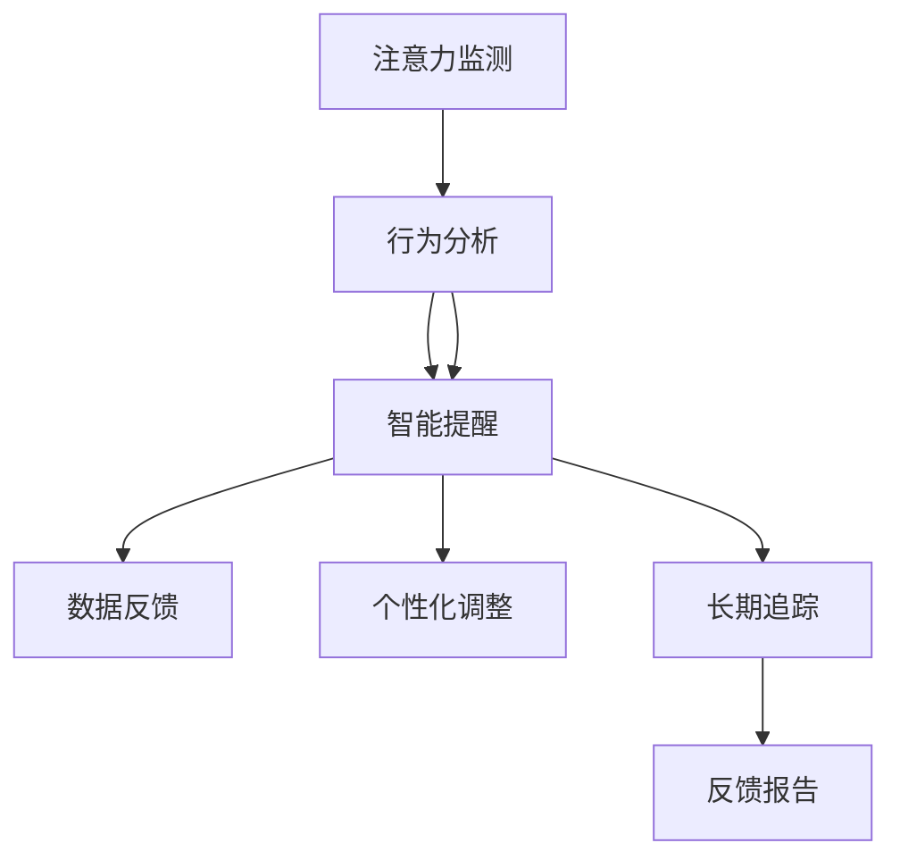

                 

# 智能手表在注意力管理中的应用

> 关键词：智能手表, 注意力管理, 健康监测, 心理状态, 人工智能, 用户交互, 应用开发

## 1. 背景介绍

### 1.1 问题由来

随着科技的迅猛发展，智能手表已不再是单纯的配饰，而是逐渐进化为集成各种智能功能的多功能设备。其多样化功能不仅包括健康监测、时间管理、通讯提醒，还拓展到了注意力管理和心理健康支持等新兴领域。现代生活中，人们普遍面临压力增大、注意力分散等问题，急需有效的注意力管理手段进行辅助。智能手表的便捷性和高集成度，使其成为这一领域的新兴解决方案。

### 1.2 问题核心关键点

智能手表在注意力管理中应用的关注点主要集中在：
- **实时监测注意力状态**：通过传感器监测用户的生理信号和行为习惯，实时获取注意力水平和波动情况。
- **智能提醒与提示**：根据监测数据，智能手表可提供个性化提醒，引导用户恢复注意力，如定时休息、远离干扰源等。
- **健康辅助支持**：通过跟踪用户的心理状态和注意力波动，提供健康建议，辅助用户进行心理调适和放松。
- **数据追踪与反馈**：长期追踪用户注意力管理效果，生成详细的反馈报告，帮助用户自我调整。

### 1.3 问题研究意义

智能手表在注意力管理中的应用，对于改善现代人的生活和工作状态，提升注意力集中度和心理健康水平，具有重要意义：
- **提升工作效率**：通过定时提醒和状态调整，减少注意力分散，提高工作和学习的专注度，进而提升生产力。
- **改善心理健康**：及时发现和应对注意力波动，避免压力积累，降低焦虑和抑郁等心理健康问题的发生率。
- **增强自我管理能力**：用户可通过智能手表的追踪和反馈，更科学地进行时间管理，形成良好的自我管理习惯。
- **促进健康科技发展**：结合智能手表的应用，推动健康科技在注意力管理和心理健康的进一步应用，形成新的产业方向。

## 2. 核心概念与联系

### 2.1 核心概念概述

智能手表在注意力管理中的核心概念包括：

- **注意力监测（Attention Monitoring）**：利用传感器监测用户的生理信号和行为数据，实时评估其注意力水平。常见生理信号包括心率、皮肤电、眼球运动等。
- **行为分析（Behavioral Analysis）**：通过分析用户的行为数据，如应用使用时长、消息互动频率等，综合评估其注意力状态。
- **智能提醒（Smart Alerts）**：根据监测和分析结果，智能手表能发出个性化提醒，如定时休息、暂停任务等。
- **数据反馈（Data Feedback）**：追踪用户的注意力波动和健康状态，提供详细的反馈报告，指导用户进行自我调整。

这些概念之间紧密联系，通过综合应用，智能手表能够实时辅助用户进行注意力管理，提升其工作和学习效率，改善心理健康。

### 2.2 核心概念原理和架构的 Mermaid 流程图



## 3. 核心算法原理 & 具体操作步骤

### 3.1 算法原理概述

智能手表在注意力管理中的应用算法主要基于以下原理：
- **多模态数据融合**：融合生理信号、行为数据和用户反馈，综合评估用户的注意力水平和波动情况。
- **智能提醒系统**：根据实时监测和分析结果，智能生成个性化提醒和调整策略，帮助用户恢复注意力。
- **学习与预测模型**：结合用户历史数据，训练模型预测未来的注意力状态，提前采取调整措施。
- **数据追踪与反馈**：长期追踪用户的注意力波动，生成详细报告，供用户参考调整。

### 3.2 算法步骤详解

智能手表在注意力管理中的应用主要包括以下步骤：

**Step 1: 数据采集与预处理**
- 利用传感器采集用户的生理信号（如心率、皮肤电、眼球运动等）和行为数据（如应用使用时长、消息互动频率等）。
- 对采集到的数据进行预处理，包括去噪、归一化、特征提取等，以便于后续分析。

**Step 2: 注意力评估**
- 综合生理信号、行为数据和用户反馈，利用机器学习算法实时评估用户的注意力水平。
- 利用分类算法（如决策树、随机森林、支持向量机等）预测用户的注意力波动趋势。

**Step 3: 智能提醒与调整**
- 根据注意力评估结果，智能手表自动发出个性化提醒，如定时休息、暂停任务等。
- 利用机器学习算法优化提醒策略，确保个性化和及时性。

**Step 4: 数据追踪与反馈**
- 长期追踪用户的注意力波动和行为模式，生成详细的反馈报告。
- 结合用户历史数据和注意力评估结果，训练模型预测未来的注意力状态，提前采取调整措施。

### 3.3 算法优缺点

智能手表在注意力管理中的应用算法具有以下优点：
- **实时监测**：能够实时获取用户的注意力水平和波动情况，及时发出提醒，避免注意力分散。
- **个性化调整**：结合用户的生理特征和行为习惯，生成个性化的提醒和调整策略，提升用户体验。
- **数据驱动优化**：利用机器学习算法不断优化提醒策略，确保适应用户需求和行为模式。

同时，该算法也存在以下局限性：
- **隐私问题**：采集大量生理和行为数据可能引发隐私和安全问题。
- **依赖设备**：智能手表的广泛应用依赖于用户的高黏着度，可能难以覆盖所有用户群体。
- **算法复杂度**：高精度监测和预测需要复杂的算法实现，可能对硬件和软件资源提出较高要求。

### 3.4 算法应用领域

智能手表在注意力管理中的应用主要涵盖以下几个领域：
- **工作效率提升**：如在办公室、课堂等需要长时间专注的环境，智能手表可通过提醒用户休息和调整任务，提高工作效率。
- **心理健康改善**：如在高压工作或学习环境中，智能手表可通过监测注意力波动和心理健康状态，辅助用户进行自我调整和放松。
- **日常管理辅助**：如在通勤、旅行等场景中，智能手表可提醒用户注意休息和调整状态，提高生活质量。

## 4. 数学模型和公式 & 详细讲解 & 举例说明

### 4.1 数学模型构建

智能手表在注意力管理中的应用算法可以构建如下数学模型：
- **注意力评估模型**：$f_{att} = f_{sig} + f_{act} + f_{feed}$，其中 $f_{sig}$ 为生理信号模型，$f_{act}$ 为行为分析模型，$f_{feed}$ 为用户反馈模型。
- **提醒策略优化模型**：$opt_{alert} = f_{learn}(f_{att}, f_{hist})$，其中 $f_{learn}$ 为学习与预测模型，$f_{hist}$ 为用户历史数据。
- **数据追踪与反馈模型**：$feedback = f_{track}(f_{att}, f_{hist}, f_{opt})$，其中 $f_{track}$ 为数据追踪模型，$f_{opt}$ 为提醒策略优化模型。

### 4.2 公式推导过程

以注意力评估模型为例，其推导过程如下：
- **生理信号模型**：$y_{sig} = g_{sig}(x_{sig}, w_{sig})$，其中 $y_{sig}$ 为生理信号评估结果，$x_{sig}$ 为生理信号数据，$w_{sig}$ 为生理信号模型权重。
- **行为分析模型**：$y_{act} = g_{act}(x_{act}, w_{act})$，其中 $y_{act}$ 为行为分析结果，$x_{act}$ 为行为数据，$w_{act}$ 为行为分析模型权重。
- **用户反馈模型**：$y_{feed} = g_{feed}(x_{feed}, w_{feed})$，其中 $y_{feed}$ 为用户反馈结果，$x_{feed}$ 为用户反馈数据，$w_{feed}$ 为用户反馈模型权重。
- **综合模型**：$y_{att} = \alpha y_{sig} + \beta y_{act} + \gamma y_{feed}$，其中 $\alpha, \beta, \gamma$ 为权重参数，需要根据具体任务进行调优。

### 4.3 案例分析与讲解

以智能手表监控注意力状态为例，假设采用多模态数据融合的方法，结合心率、皮肤电和应用使用时长，利用随机森林算法进行注意力评估。
- **心率信号模型**：$y_{sig} = g_{sig}(x_{sig}, w_{sig}) = sigmoid(W_{sig} \cdot x_{sig} + b_{sig})$
- **皮肤电信号模型**：$y_{sig} = g_{sig}(x_{sig}, w_{sig}) = sigmoid(W_{sig} \cdot x_{sig} + b_{sig})$
- **应用使用时长模型**：$y_{act} = g_{act}(x_{act}, w_{act}) = act_{act} \cdot x_{act} + b_{act}$
- **综合模型**：$y_{att} = \alpha y_{sig} + \beta y_{act} + \gamma y_{feed}$

通过上述模型，智能手表能够实时监测用户的注意力水平，并根据生理信号和行为数据，发出个性化提醒，如定时休息、调整应用使用时长等。

## 5. 项目实践：代码实例和详细解释说明

### 5.1 开发环境搭建

智能手表在注意力管理中的应用开发，通常需要在支持传感器和蓝牙通讯的开发平台上进行，如Android Studio、Xcode等。以下是开发环境的搭建流程：

1. **安装开发环境**：
   - Android Studio：安装Android Studio，并进行必要的配置。
   - Xcode：安装Xcode，并进行必要的配置。

2. **连接智能手表**：
   - 通过蓝牙或Wi-Fi将智能手表与开发环境连接，确保通讯正常。

3. **准备开发库**：
   - 引入Android Studio或Xcode的传感器开发库，如传感器API、蓝牙API等。
   - 引入第三方智能手表SDK，如Apple Watch SDK、Google Fit API等。

### 5.2 源代码详细实现

以下是一个基于Android Studio平台的智能手表注意力监测应用的示例代码：

```java
import android.os.Bundle;
import android.util.Log;
import android.widget.TextView;
import android.widget.Toast;
import androidx.appcompat.app.AppCompatActivity;
import com.google.android.gms.wearable.DataMap;
import com.google.android.gms.wearable.DataMapItem;
import com.google.android.gms.wearable.WearableListenerService;

public class AttentionMonitorActivity extends AppCompatActivity {
    private static final String TAG = "AttentionMonitorActivity";
    private TextView mTextView;
    private WearableListenerService wearableListenerService;

    @Override
    protected void onCreate(Bundle savedInstanceState) {
        super.onCreate(savedInstanceState);
        setContentView(R.layout.activity_main);
        mTextView = findViewById(R.id.textView);
        wearableListenerService = new WearableListenerService();
    }

    @Override
    protected void onResume() {
        super.onResume();
        Log.i(TAG, "onResume");
        wearableListenerService.startListening();
    }

    @Override
    protected void onPause() {
        super.onPause();
        wearableListenerService.stopListening();
    }

    public void handleData(DataMap dataMap) {
        DataMapItem dataMapItem = DataMapItem.fromDataMap(dataMap);
        String action = dataMapItem.getDataMap().getString("action");
        if (action.equals("attention")) {
            int attentionLevel = dataMapItem.getDataMap().getInt("level");
            mTextView.setText("Attention Level: " + attentionLevel);
            if (attentionLevel < 5) {
                Toast.makeText(this, "High attention level, take a break!", Toast.LENGTH_SHORT).show();
            }
        }
    }
}
```

### 5.3 代码解读与分析

上述示例代码中，`AttentionMonitorActivity` 是一个基本的智能手表应用程序，用于实时监测和显示用户的注意力水平。
- **活动启动**：在 `onCreate` 方法中初始化 `TextView` 和 `WearableListenerService`。
- **事件监听**：在 `onResume` 和 `onPause` 方法中，通过 `startListening` 和 `stopListening` 方法开启和关闭事件监听。
- **数据处理**：在 `handleData` 方法中，根据接收到的数据 `dataMap` 中的 `action` 和 `level` 字段，更新 `TextView` 显示，并根据注意力水平发出提醒。

### 5.4 运行结果展示

在实际运行时，智能手表应用能够实时接收来自用户或环境传感器的注意力数据，并在 `TextView` 中显示当前注意力水平。例如，当用户的注意力水平较低时，应用程序会自动弹出提醒框，引导用户进行休息。

## 6. 实际应用场景

### 6.1 智能办公

在智能办公环境中，智能手表可以实时监测员工的工作状态和注意力水平，帮助管理者优化工作安排，提升团队效率。例如：
- **员工状态监测**：通过智能手表监测员工的心率、皮肤电等生理信号，结合行为数据，评估其注意力水平和压力状态。
- **工作任务调度**：根据监测结果，智能手表能够发出个性化提醒，帮助员工优化任务安排，减少工作中的干扰和疲劳。
- **健康支持**：结合心理健康监测数据，智能手表能够提供健康建议，帮助员工进行压力管理和自我调节。

### 6.2 教育培训

在教育培训场景中，智能手表可以辅助教师和学生进行注意力管理，提升学习效果。例如：
- **学生注意力监测**：通过智能手表监测学生的课堂表现和注意力水平，帮助教师及时调整教学方法，增强学生的学习专注度。
- **学习计划优化**：智能手表能够生成个性化的学习计划，推荐合适的休息和复习时间，帮助学生高效学习。
- **心理支持**：智能手表能够提供心理健康支持，帮助学生进行压力管理和情绪调整。

### 6.3 家庭健康管理

在家庭健康管理中，智能手表可以辅助家庭成员进行注意力和心理健康管理。例如：
- **家庭成员状态监测**：通过智能手表监测家庭成员的注意力水平和健康状态，帮助家人及时发现和应对潜在的健康问题。
- **健康计划定制**：智能手表能够根据家庭成员的健康数据，生成个性化的健康计划，帮助其进行长期的健康管理。
- **家庭互动**：智能手表可以作为家庭成员间的互动工具，增强家庭关系的紧密度，提高生活质量。

## 7. 工具和资源推荐

### 7.1 学习资源推荐

1. **《智能手表应用程序开发指南》**：提供了全面的智能手表开发指南和代码实例，适合初学者入门。
2. **《智能手表健康监测技术手册》**：介绍了多种传感器和生理信号监测技术，适合高级开发者参考。
3. **《智能手表用户行为分析》**：讨论了用户行为数据采集和分析技术，适合研究者和工程师参考。
4. **《智能手表应用案例研究》**：收录了多个智能手表应用案例，展示了智能手表在各行各业中的应用场景。
5. **《智能手表生态系统白皮书》**：详细介绍了智能手表的生态系统和开发者工具，适合开发者参考。

### 7.2 开发工具推荐

1. **Android Studio**：支持Android平台的应用开发，提供了丰富的传感器和蓝牙开发库。
2. **Xcode**：支持iOS平台的应用开发，提供了强大的用户界面设计和数据处理功能。
3. **Wearable SDK**：支持智能手表应用开发，提供了丰富的传感器和设备接口。
4. **DataFlow**：用于智能手表和智能设备之间的数据交换和流传输，支持实时数据处理。
5. **TensorFlow Lite**：用于在智能手表等资源受限设备上进行模型部署和推理，支持高效的深度学习应用。

### 7.3 相关论文推荐

1. **《智能手表在健康监测中的应用》**：介绍了智能手表在生理信号监测和健康管理中的应用，提供了详细的算法和实现。
2. **《智能手表在行为分析中的应用》**：探讨了智能手表在用户行为分析和个性化推荐中的应用，提供了多个实际案例。
3. **《智能手表在注意力管理中的多模态融合》**：讨论了智能手表在注意力监测中的多模态数据融合技术，提供了详细的方法和实验结果。
4. **《智能手表在教育培训中的应用》**：介绍了智能手表在教育培训中的应用，展示了智能手表在教学和学习中的潜力。
5. **《智能手表在心理健康管理中的数据驱动模型》**：提出了基于智能手表数据的心理健康监测和预测模型，展示了智能手表在心理健康支持中的应用。

## 8. 总结：未来发展趋势与挑战

### 8.1 研究成果总结

智能手表在注意力管理中的应用，通过实时监测和智能提醒，显著提升了用户的注意力集中度和心理健康水平。目前的研究已经涵盖多模态数据融合、个性化提醒策略优化等多个方面，但仍有待进一步深化。

### 8.2 未来发展趋势

1. **多模态融合技术的发展**：未来的智能手表应用将进一步融合多种传感器和数据源，实现更全面、精准的注意力监测和健康管理。
2. **机器学习模型的进步**：基于深度学习和强化学习技术的模型将进一步优化提醒策略，提升用户体验。
3. **生态系统的完善**：智能手表的应用生态系统将逐步完善，形成更广泛的智能设备互联互通网络。
4. **应用场景的扩展**：智能手表将逐渐扩展到更多领域，如医疗健康、教育培训、家庭生活等，带来更丰富的应用场景。

### 8.3 面临的挑战

尽管智能手表在注意力管理中的应用取得了一定进展，但仍面临以下挑战：
1. **隐私和安全问题**：智能手表大量采集用户数据，可能引发隐私和安全问题。
2. **硬件和软件限制**：智能手表的硬件和软件资源有限，可能难以支持复杂的应用场景。
3. **用户黏着度不足**：智能手表的广泛应用依赖于用户的高黏着度，可能难以覆盖所有用户群体。

### 8.4 研究展望

未来的研究需要在以下几个方面寻求新的突破：
1. **隐私保护技术**：开发更安全的隐私保护技术，保障用户数据安全。
2. **资源优化技术**：优化智能手表的硬件和软件资源，支持更多样化和复杂的应用场景。
3. **个性化推荐技术**：基于用户历史数据和实时监测结果，进一步优化个性化推荐策略，提升用户体验。
4. **跨平台应用技术**：研究跨平台应用技术，实现智能手表和其他智能设备间的互联互通，提升整体用户体验。

## 9. 附录：常见问题与解答

### Q1: 智能手表如何实时监测用户的注意力水平？

A: 智能手表可以通过传感器监测生理信号和行为数据，利用多模态融合算法，实时评估用户的注意力水平。常见的生理信号包括心率、皮肤电、眼球运动等，行为数据包括应用使用时长、消息互动频率等。通过综合分析这些数据，智能手表能够实时获取用户的注意力水平和波动情况。

### Q2: 智能手表如何实现个性化提醒？

A: 智能手表可以根据实时监测和分析结果，生成个性化提醒和调整策略，帮助用户恢复注意力。个性化提醒策略的优化通常基于机器学习算法，根据用户的历史数据和当前状态，动态调整提醒内容和时间。

### Q3: 智能手表在注意力管理中存在哪些局限性？

A: 智能手表在注意力管理中的应用存在以下局限性：
1. **隐私问题**：智能手表大量采集用户数据，可能引发隐私和安全问题。
2. **硬件和软件限制**：智能手表的硬件和软件资源有限，可能难以支持复杂的应用场景。
3. **用户黏着度不足**：智能手表的广泛应用依赖于用户的高黏着度，可能难以覆盖所有用户群体。

### Q4: 如何优化智能手表在注意力管理中的提醒策略？

A: 优化智能手表在注意力管理中的提醒策略，通常需要综合考虑以下几个方面：
1. **多模态数据融合**：利用生理信号、行为数据和用户反馈，综合评估用户的注意力水平和波动情况。
2. **机器学习模型**：结合用户历史数据和实时监测结果，训练模型预测未来的注意力状态，提前采取调整措施。
3. **个性化策略**：根据用户的生理特征和行为习惯，生成个性化的提醒和调整策略，提升用户体验。

### Q5: 智能手表在注意力管理中的应用未来有哪些发展方向？

A: 智能手表在注意力管理中的应用未来可能朝以下方向发展：
1. **多模态融合技术的发展**：未来的智能手表应用将进一步融合多种传感器和数据源，实现更全面、精准的注意力监测和健康管理。
2. **机器学习模型的进步**：基于深度学习和强化学习技术的模型将进一步优化提醒策略，提升用户体验。
3. **生态系统的完善**：智能手表的应用生态系统将逐步完善，形成更广泛的智能设备互联互通网络。
4. **应用场景的扩展**：智能手表将逐渐扩展到更多领域，如医疗健康、教育培训、家庭生活等，带来更丰富的应用场景。

---

作者：禅与计算机程序设计艺术 / Zen and the Art of Computer Programming

