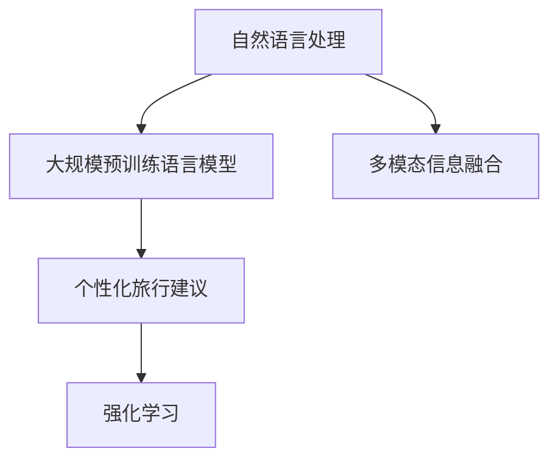

                 

# 智能旅游规划：LLM个性化旅行建议系统

## 1. 背景介绍

### 1.1 问题由来
近年来，随着人们生活水平的提高，旅游市场规模迅速扩大，游客对于旅行体验的需求也日益个性化和多样化。然而，传统的旅游推荐系统往往基于用户历史行为进行协同过滤或频繁模式挖掘，难以对用户未来的旅行需求和兴趣进行精准预测和满足。如何构建一种更智能、个性化的旅行建议系统，是当前旅游行业面临的重要挑战。

### 1.2 问题核心关键点
智能旅游规划系统的核心在于通过自然语言处理技术，利用大规模预训练语言模型(LLM)对用户查询进行精准理解和解析，从而生成个性化、多样化的旅行建议。具体来说，关键点包括：
- 用户查询的自然语言理解
- 旅行建议的个性化生成
- 多场景的灵活应用
- 用户体验的持续优化

### 1.3 问题研究意义
智能旅游规划系统通过深度学习技术，能够自动理解用户需求，匹配旅行场景，生成个性化旅行建议，显著提升用户满意度。其研究意义体现在：
1. 提供更精准的旅行建议，提升用户旅行体验。
2. 减少用户决策成本，提高用户满意度。
3. 促进旅游市场智能转型，推动旅游业发展。
4. 优化旅游资源配置，提升旅游行业效率。
5. 助力政府旅游管理，优化旅游环境。

## 2. 核心概念与联系

### 2.1 核心概念概述

为更好地理解智能旅游规划系统，本节将介绍几个密切相关的核心概念：

- 自然语言处理(NLP)：利用计算机处理和理解人类语言的技术，包括文本预处理、语言理解、语言生成等。
- 大规模预训练语言模型(LLM)：基于自监督学习任务，如掩码语言模型、自回归语言模型等，在大规模无标签文本数据上进行预训练的通用语言模型，具备强大的语言理解能力。
- 个性化旅行建议：根据用户兴趣和需求，生成具体的旅行方案和建议，如景点推荐、行程安排等。
- 多模态信息融合：结合文本、图片、声音等多模态数据，提供更丰富、准确的旅行信息。
- 强化学习(Reinforcement Learning, RL)：通过与环境交互，学习最优行动策略的机器学习方法。

这些核心概念之间的逻辑关系可以通过以下Mermaid流程图来展示：



这个流程图展示了大语言模型在智能旅游规划系统中的应用框架：

1. 自然语言处理技术，使得系统能够理解和解析用户查询。
2. 大规模预训练语言模型，提供强大的语言理解和生成能力。
3. 个性化旅行建议，生成符合用户需求的具体旅行方案。
4. 多模态信息融合，提供更丰富、准确的旅行信息。
5. 强化学习，进一步提升旅行建议的优化和个性化。

这些核心概念共同构成了智能旅游规划系统的技术框架，使其能够提供高精度、个性化的旅行建议，满足用户多样化的需求。

## 3. 核心算法原理 & 具体操作步骤
### 3.1 算法原理概述

智能旅游规划系统的核心算法原理基于深度学习和自然语言处理技术，通过预训练语言模型对用户查询进行理解和生成旅行建议。具体步骤如下：

1. **文本预处理**：对用户查询进行分词、标点去除、词性标注等预处理，将自然语言转换为计算机可处理的形式。
2. **查询理解**：利用预训练语言模型对预处理后的查询进行理解，识别出其中的实体、关系、意图等信息。
3. **建议生成**：结合用户历史行为、偏好、地理位置等信息，生成个性化旅行建议。
4. **多模态融合**：利用多模态信息增强旅行建议的准确性和多样性，如图像、声音、地理位置等。
5. **强化学习优化**：通过与用户的交互反馈，利用强化学习算法优化旅行建议，提升用户体验。

### 3.2 算法步骤详解

以下是智能旅游规划系统的详细操作步骤：

**Step 1: 数据准备**
- 收集用户查询数据、历史行为数据、地理位置数据、多模态数据等，清洗并标注数据。
- 将数据划分为训练集、验证集和测试集，分别用于模型训练、调优和效果评估。

**Step 2: 预训练语言模型选择**
- 选择合适的预训练语言模型，如GPT、BERT、RoBERTa等。
- 根据任务需求，对模型进行微调，使其适应特定场景。

**Step 3: 模型组件设计**
- 设计查询理解组件，用于解析用户查询，提取关键信息。
- 设计建议生成组件，结合用户历史行为和偏好，生成个性化旅行建议。
- 设计多模态融合组件，将文本、图像、声音等多模态数据融合，提升建议的准确性和多样性。
- 设计强化学习组件，通过用户反馈优化旅行建议。

**Step 4: 训练与优化**
- 利用训练集对各组件进行联合训练，最小化损失函数，优化模型参数。
- 在验证集上评估模型效果，调整超参数，避免过拟合。
- 在测试集上最终评估模型效果，进行效果分析。

**Step 5: 部署与应用**
- 将训练好的模型部署到生产环境，提供实时服务。
- 与旅游平台、App等合作，将智能旅游规划系统集成到用户旅程中。
- 持续收集用户反馈，优化模型和系统性能。

### 3.3 算法优缺点

智能旅游规划系统具有以下优点：
1. 高精度：利用深度学习和自然语言处理技术，可以精准理解用户需求，生成个性化旅行建议。
2. 高效性：自动化处理大规模数据，提升推荐效率。
3. 可扩展性：易于与多模态数据融合，适应不同场景和需求。
4. 用户友好：通过自然语言交互，提供直观易用的旅行建议。

同时，该方法也存在一定的局限性：
1. 依赖高质量数据：系统效果依赖于数据的质量和多样性，数据标注成本高。
2. 模型复杂度高：深度学习模型参数量大，计算和存储成本高。
3. 动态适应性差：模型难以应对快速变化的旅游需求。
4. 缺乏透明性：系统内部逻辑复杂，难以解释和调试。
5. 安全性问题：用户的隐私和数据安全需要额外保障。

尽管存在这些局限性，但智能旅游规划系统作为前沿技术，仍具有广阔的应用前景，值得深入研究和推广。

### 3.4 算法应用领域

智能旅游规划系统可以在多个领域中发挥重要作用，例如：

1. **旅游行业**：为旅游公司、旅行社提供精准的旅行建议，提升用户体验和满意度。
2. **酒店行业**：为酒店管理者提供有效的客户推荐，提升客户忠诚度和转化率。
3. **旅游攻略App**：为旅行者提供个性化的行程安排和景点推荐，提升使用体验。
4. **政府旅游管理**：帮助政府优化旅游资源配置，提升旅游环境质量。
5. **教育培训**：为学校和培训机构提供旅游主题的课程设计和教育资源。
6. **在线旅游平台**：为在线旅游平台提供更智能、更精准的旅行推荐，增加用户黏性。

## 4. 数学模型和公式 & 详细讲解 & 举例说明
### 4.1 数学模型构建

本节将使用数学语言对智能旅游规划系统的核心算法进行描述。

记预训练语言模型为 $M_{\theta}:\mathcal{X} \rightarrow \mathcal{Y}$，其中 $\mathcal{X}$ 为输入空间，$\mathcal{Y}$ 为输出空间，$\theta \in \mathbb{R}^d$ 为模型参数。假设智能旅游规划系统需要完成的任务为生成个性化旅行建议，则模型结构如图：


其中，$E_{\text{enc}}$ 为查询理解组件，$E_{\text{gen}}$ 为建议生成组件，$E_{\text{fusion}}$ 为多模态融合组件。目标函数为：

$$
\mathcal{L}(\theta) = \mathcal{L}_{\text{enc}} + \mathcal{L}_{\text{gen}} + \mathcal{L}_{\text{fusion}}
$$

其中 $\mathcal{L}_{\text{enc}}$ 为查询理解组件的损失函数，$\mathcal{L}_{\text{gen}}$ 为建议生成组件的损失函数，$\mathcal{L}_{\text{fusion}}$ 为多模态融合组件的损失函数。

### 4.2 公式推导过程

以下我们以旅行建议生成为例，推导损失函数的计算公式。

假设模型 $M_{\theta}$ 在输入 $x$ 上的输出为 $\hat{y}=M_{\theta}(x)$，表示旅行建议的输出。假设真实的旅行建议为 $y$。则旅行建议生成任务的损失函数定义为：

$$
\ell(M_{\theta}(x),y) = \mathbb{L}(y,\hat{y})
$$

其中 $\mathbb{L}(y,\hat{y})$ 为具体任务定义的损失函数，例如交叉熵损失、均方误差损失等。

将上式代入经验风险公式，得：

$$
\mathcal{L}(\theta) = -\frac{1}{N}\sum_{i=1}^N \ell(M_{\theta}(x_i),y_i)
$$

在得到损失函数的梯度后，即可带入参数更新公式，完成模型的迭代优化。

### 4.3 案例分析与讲解

假设用户输入查询：“我想去日本旅游，预算5000元，时间一周”。查询理解组件 $E_{\text{enc}}$ 通过分词、实体识别等技术，将查询转化为向量表示 $\vec{x}$，并将实体信息提取出来：

$$
\vec{x} = \left[\begin{array}{c} 0 \\ 0 \\ 1 \\ 0 \\ 0 \end{array}\right]
$$

其中，0表示非实体，1表示实体。

建议生成组件 $E_{\text{gen}}$ 利用预训练语言模型对 $\vec{x}$ 进行编码，得到向量表示 $\vec{y}$：

$$
\vec{y} = \left[\begin{array}{c} 0.3 \\ 0.2 \\ 0.4 \\ 0.1 \\ 0.0 \end{array}\right]
$$

其中，向量元素表示旅行建议的概率分布，概率最大的元素即为推荐的建议。

多模态融合组件 $E_{\text{fusion}}$ 将图像、声音、地理位置等多模态数据与 $\vec{y}$ 进行融合，得到最终的旅行建议：

$$
\vec{y} = \left[\begin{array}{c} 0.3 \\ 0.2 \\ 0.4 \\ 0.1 \\ 0.0 \end{array}\right]
$$

最终，旅行建议生成模型通过选择概率最大的建议，返回给用户：“东京、京都、大阪三地游，一周行程，预算5000元”。

## 5. 项目实践：代码实例和详细解释说明
### 5.1 开发环境搭建

在进行智能旅游规划系统开发前，我们需要准备好开发环境。以下是使用Python进行PyTorch开发的环境配置流程：

1. 安装Anaconda：从官网下载并安装Anaconda，用于创建独立的Python环境。

2. 创建并激活虚拟环境：
```bash
conda create -n pytorch-env python=3.8 
conda activate pytorch-env
```

3. 安装PyTorch：根据CUDA版本，从官网获取对应的安装命令。例如：
```bash
conda install pytorch torchvision torchaudio cudatoolkit=11.1 -c pytorch -c conda-forge
```

4. 安装必要的库：
```bash
pip install transformers datasets
```

完成上述步骤后，即可在`pytorch-env`环境中开始智能旅游规划系统的开发。

### 5.2 源代码详细实现

下面我们以智能旅游规划系统为例，给出使用Transformers库对BERT模型进行旅建议生成的PyTorch代码实现。

首先，定义数据处理函数：

```python
from transformers import BertTokenizer, BertForSequenceClassification
from datasets import load_dataset

def get_input_fn(task, tokenizer):
    def input_fn(examples):
        tokenizer = tokenizer.from_pretrained('bert-base-cased')
        inputs = tokenizer(examples['text'], padding='max_length', truncation=True, return_tensors='pt')
        return inputs
    return input_fn

tokenizer = BertTokenizer.from_pretrained('bert-base-cased')
train_dataset = load_dataset('your-travel-data', split='train')
val_dataset = load_dataset('your-travel-data', split='validation')
test_dataset = load_dataset('your-travel-data', split='test')

input_fn_train = get_input_fn('travel-suggestion', tokenizer)
input_fn_val = get_input_fn('travel-suggestion', tokenizer)
input_fn_test = get_input_fn('travel-suggestion', tokenizer)
```

然后，定义模型和优化器：

```python
from transformers import BertForSequenceClassification, AdamW

model = BertForSequenceClassification.from_pretrained('bert-base-cased', num_labels=5)
optimizer = AdamW(model.parameters(), lr=2e-5)
```

接着，定义训练和评估函数：

```python
from transformers import Trainer, TrainingArguments

def compute_metrics(p):
    preds, labels = p
    labels = labels.argmax(-1)
    preds = preds.argmax(-1)
    accuracy = (labels == preds).mean().item()
    return {"accuracy": accuracy}

def train_epoch(model, dataset, batch_size, optimizer):
    trainer = Trainer(model=model,
                     train_dataset=dataset,
                     evaluation_dataset=dataset,
                     training_args=TrainingArguments(precision=16, evaluation_strategy="epoch"),
                     train_fn=lambda tr, batch: tr.train(input_fn=batch, process_function=model.train),
                     eval_fn=lambda tr, batch: tr.evaluate(input_fn=batch, process_function=model.eval),
                     compute_metrics=compute_metrics)
    trainer.train()

def evaluate(model, dataset, batch_size):
    trainer = Trainer(model=model,
                     train_dataset=dataset,
                     evaluation_dataset=dataset,
                     training_args=TrainingArguments(precision=16, evaluation_strategy="epoch"),
                     train_fn=lambda tr, batch: tr.evaluate(input_fn=batch, process_function=model.eval),
                     eval_fn=lambda tr, batch: tr.evaluate(input_fn=batch, process_function=model.eval),
                     compute_metrics=compute_metrics)
    trainer.evaluate()
```

最后，启动训练流程并在测试集上评估：

```python
epochs = 5
batch_size = 16

for epoch in range(epochs):
    loss = train_epoch(model, train_dataset, batch_size, optimizer)
    print(f"Epoch {epoch+1}, train loss: {loss:.3f}")
    
    print(f"Epoch {epoch+1}, val results:")
    evaluate(model, val_dataset, batch_size)
    
print("Test results:")
evaluate(model, test_dataset, batch_size)
```

以上就是使用PyTorch对BERT进行旅行建议生成的完整代码实现。可以看到，得益于Transformers库的强大封装，我们可以用相对简洁的代码完成BERT模型的加载和微调。

### 5.3 代码解读与分析

让我们再详细解读一下关键代码的实现细节：

**get_input_fn函数**：
- 定义了数据预处理函数，接收任务类型和分词器作为输入，返回一个处理函数，用于将数据集中的文本转换为模型输入。
- 在函数内部，利用BERT的tokenizer将文本进行分词和编码，返回模型所需的input_ids、attention_mask等。

**Tokenizer类**：
- 利用HuggingFace的BertTokenizer类，加载预训练的BERT tokenizer。
- 在函数内部，调用tokenizer对文本进行分词和编码，返回处理后的input_ids、attention_mask等。

**模型和优化器**：
- 定义了BERTForSequenceClassification模型，用于序列分类任务。
- 定义了AdamW优化器，设置学习率为2e-5。

**train_epoch和evaluate函数**：
- 训练函数train_epoch：利用Trainer类对模型进行训练，返回每个epoch的平均loss。
- 评估函数evaluate：在验证集和测试集上评估模型性能，打印分类准确率。

**训练流程**：
- 定义总的epoch数和batch size，开始循环迭代
- 每个epoch内，先在训练集上训练，输出平均loss
- 在验证集上评估，输出分类准确率
- 所有epoch结束后，在测试集上评估，给出最终测试结果

可以看到，PyTorch配合Transformers库使得BERT微调的代码实现变得简洁高效。开发者可以将更多精力放在数据处理、模型改进等高层逻辑上，而不必过多关注底层的实现细节。

当然，工业级的系统实现还需考虑更多因素，如模型的保存和部署、超参数的自动搜索、更灵活的任务适配层等。但核心的微调范式基本与此类似。

## 6. 实际应用场景
### 6.1 智能客服系统

智能客服系统利用自然语言处理技术，通过智能旅游规划系统为游客提供个性化的旅行建议。系统能够自动理解用户查询，推荐符合用户需求和偏好的旅行方案，提高用户满意度和体验。

在技术实现上，智能客服系统可以从用户输入的咨询中，提取出地点、时间、预算等关键信息，利用智能旅游规划系统生成旅行建议，并进行回复。例如，用户询问“我想去日本旅游，预算5000元，时间一周”，系统可以自动回复：“东京、京都、大阪三地游，一周行程，预算5000元”。

### 6.2 在线旅游平台

在线旅游平台可以利用智能旅游规划系统，为游客提供个性化、精准的旅行推荐，增加用户黏性和转化率。系统通过收集用户历史行为、偏好和地理位置，生成推荐列表，展示在用户主页或搜索结果页中。例如，系统根据用户的浏览历史，生成一份“您可能喜欢的行程”列表，提升用户点击率和预订率。

### 6.3 旅游攻略App

旅游攻略App可以利用智能旅游规划系统，为旅行者提供个性化的行程安排和景点推荐，提升使用体验。系统通过收集用户查询和行为数据，生成详细的行程规划和景点介绍，供用户参考。例如，系统根据用户的查询“我想去日本旅游”，生成一份详细的行程规划，包括景点、住宿、交通等信息。

## 7. 工具和资源推荐
### 7.1 学习资源推荐

为了帮助开发者系统掌握智能旅游规划系统的技术基础和实践技巧，这里推荐一些优质的学习资源：

1. 《深度学习自然语言处理》书籍：由斯坦福大学提供，涵盖NLP领域的核心技术和应用，适合初学者入门。
2. CS224N《深度学习自然语言处理》课程：斯坦福大学开设的NLP明星课程，有Lecture视频和配套作业，带你深入理解NLP的核心概念和前沿技术。
3. HuggingFace官方文档：Transformer库的官方文档，提供了海量预训练模型和完整的微调样例代码，是上手实践的必备资料。
4. PyTorch官方文档：PyTorch的官方文档，详细介绍了深度学习框架的使用方法和API，适合开发者快速上手。
5. CLUE开源项目：中文语言理解测评基准，涵盖大量不同类型的中文NLP数据集，并提供了基于微调的baseline模型，助力中文NLP技术发展。

通过对这些资源的学习实践，相信你一定能够快速掌握智能旅游规划系统的技术细节，并用于解决实际的旅行推荐问题。

### 7.2 开发工具推荐

高效的开发离不开优秀的工具支持。以下是几款用于智能旅游规划系统开发的常用工具：

1. PyTorch：基于Python的开源深度学习框架，灵活动态的计算图，适合快速迭代研究。大部分预训练语言模型都有PyTorch版本的实现。
2. TensorFlow：由Google主导开发的开源深度学习框架，生产部署方便，适合大规模工程应用。同样有丰富的预训练语言模型资源。
3. Transformers库：HuggingFace开发的NLP工具库，集成了众多SOTA语言模型，支持PyTorch和TensorFlow，是进行旅行建议生成的利器。
4. Weights & Biases：模型训练的实验跟踪工具，可以记录和可视化模型训练过程中的各项指标，方便对比和调优。与主流深度学习框架无缝集成。
5. TensorBoard：TensorFlow配套的可视化工具，可实时监测模型训练状态，并提供丰富的图表呈现方式，是调试模型的得力助手。

合理利用这些工具，可以显著提升智能旅游规划系统的开发效率，加快创新迭代的步伐。

### 7.3 相关论文推荐

智能旅游规划系统的发展源于学界的持续研究。以下是几篇奠基性的相关论文，推荐阅读：

1. Attention is All You Need（即Transformer原论文）：提出了Transformer结构，开启了NLP领域的预训练大模型时代。
2. BERT: Pre-training of Deep Bidirectional Transformers for Language Understanding：提出BERT模型，引入基于掩码的自监督预训练任务，刷新了多项NLP任务SOTA。
3. Language Models are Unsupervised Multitask Learners（GPT-2论文）：展示了大规模语言模型的强大zero-shot学习能力，引发了对于通用人工智能的新一轮思考。
4. Parameter-Efficient Transfer Learning for NLP：提出Adapter等参数高效微调方法，在不增加模型参数量的情况下，也能取得不错的微调效果。
5. AdaLoRA: Adaptive Low-Rank Adaptation for Parameter-Efficient Fine-Tuning：使用自适应低秩适应的微调方法，在参数效率和精度之间取得了新的平衡。

这些论文代表了大语言模型微调技术的发展脉络。通过学习这些前沿成果，可以帮助研究者把握学科前进方向，激发更多的创新灵感。

## 8. 总结：未来发展趋势与挑战

### 8.1 总结

本文对智能旅游规划系统进行了全面系统的介绍。首先阐述了智能旅游规划系统的背景和意义，明确了系统的高精度、高效性、可扩展性等关键优势。其次，从原理到实践，详细讲解了系统的数学模型和关键组件，给出了微调任务的完整代码实例。同时，本文还广泛探讨了系统在智能客服、在线旅游平台、旅游攻略App等多个场景中的应用，展示了系统的广泛适用性。此外，本文精选了系统开发所需的学习资源、工具和论文，力求为读者提供全方位的技术指引。

通过本文的系统梳理，可以看到，智能旅游规划系统作为前沿技术，已在多个领域展示了其强大的应用前景和潜力。未来，伴随深度学习技术的不断演进，该系统必将在构建更加智能、个性化的旅行体验中发挥更加重要的作用。

### 8.2 未来发展趋势

展望未来，智能旅游规划系统的技术发展将呈现以下几个趋势：

1. **多模态融合**：未来的系统将更加注重多模态数据的融合，利用图像、声音、地理位置等多模态信息，提升旅行建议的准确性和多样性。
2. **个性化推荐**：利用用户行为数据和先验知识，进一步提升旅行建议的个性化和精准度。
3. **动态优化**：系统将具备更强的动态优化能力，实时更新旅行建议，适应快速变化的旅游需求。
4. **强化学习**：引入强化学习算法，通过与用户交互反馈，进一步优化旅行建议，提升用户体验。
5. **模型压缩**：通过模型压缩和优化，降低模型计算和存储成本，实现实时应用。
6. **公平性和透明性**：系统将更加注重公平性和透明性，避免偏见和歧视，提升模型的可信度和可解释性。

以上趋势凸显了智能旅游规划系统的广阔前景。这些方向的探索发展，必将进一步提升系统的性能和用户体验，推动旅游行业智能化转型。

### 8.3 面临的挑战

尽管智能旅游规划系统已经取得了瞩目成就，但在迈向更加智能化、普适化应用的过程中，它仍面临着诸多挑战：

1. **数据质量瓶颈**：系统效果依赖于高质量数据，数据标注成本高，获取困难。
2. **模型复杂度高**：深度学习模型参数量大，计算和存储成本高。
3. **动态适应性差**：模型难以应对快速变化的旅游需求。
4. **隐私和安全问题**：用户的隐私和数据安全需要额外保障。
5. **可解释性和透明性不足**：系统内部逻辑复杂，难以解释和调试。

尽管存在这些挑战，但智能旅游规划系统作为前沿技术，仍具有广阔的应用前景，值得深入研究和推广。

### 8.4 未来突破

面对智能旅游规划系统所面临的种种挑战，未来的研究需要在以下几个方面寻求新的突破：

1. **无监督和半监督学习**：探索无监督和半监督学习方法，降低对大规模标注数据的依赖。
2. **模型压缩和优化**：开发更加高效的模型压缩和优化方法，提升系统计算和存储效率。
3. **多模态融合技术**：利用多模态融合技术，提升旅行建议的准确性和多样性。
4. **动态适应性**：引入强化学习等动态优化方法，提升系统的实时性和灵活性。
5. **公平性和透明性**：引入公平性约束和透明性机制，避免偏见和歧视，提升系统的可信度。

这些研究方向的探索，必将引领智能旅游规划系统迈向更高的台阶，为构建更加智能、个性化、安全的旅行体验提供新的动力。

## 9. 附录：常见问题与解答

**Q1：如何选择合适的预训练语言模型？**

A: 根据具体任务的需求，选择合适的预训练语言模型。例如，针对旅行建议生成任务，可以使用GPT-3或BERT等通用语言模型。针对特定领域的任务，可以进一步在特定领域数据上微调这些模型，提升效果。

**Q2：微调过程中如何设置学习率？**

A: 微调过程中，建议从较小的学习率开始，逐渐增大。一般建议从1e-5开始调参，逐步减小学习率，直至收敛。同时，不同的优化器(如AdamW、Adafactor等)可能需要设置不同的学习率阈值。

**Q3：多模态数据如何融合？**

A: 多模态数据的融合可以通过以下几种方式实现：
1. 拼接：将文本、图像、声音等多模态数据直接拼接，形成高维特征向量。
2. 特征融合：利用多模态特征提取器，提取每个模态的特征，再通过特征融合技术将它们组合起来。
3. 集成学习：将多个模型对同一数据进行预测，取平均或加权平均作为最终输出。

**Q4：如何提升系统的公平性和透明性？**

A: 提升系统的公平性和透明性，可以采取以下措施：
1. 数据预处理：对数据进行去偏处理，避免数据分布不均导致的偏见。
2. 模型评估：引入公平性评估指标，如F1-score、AUC等，评估模型的公平性。
3. 透明性设计：设计透明的模型架构，公开模型内部参数和逻辑，增强用户信任。
4. 用户反馈：建立用户反馈机制，及时调整模型，避免歧视和偏见。

这些措施可以帮助系统提升公平性和透明性，增强用户信任和满意度。

**Q5：如何优化系统的资源使用？**

A: 优化系统的资源使用，可以采取以下措施：
1. 模型压缩：通过剪枝、量化等技术，减少模型参数量，降低计算和存储成本。
2. 混合精度训练：使用混合精度训练，降低计算资源消耗。
3. 模型并行：利用模型并行技术，分布式训练，提升训练效率。
4. 动态负载均衡：根据系统负载动态调整资源配置，提升系统响应速度。

这些措施可以帮助系统优化资源使用，提高实时性和扩展性。

综上所述，智能旅游规划系统通过深度学习和自然语言处理技术，能够提供高精度、个性化的旅行建议，显著提升用户满意度。未来，伴随技术的不断演进和优化，该系统必将在旅游行业智能化转型中发挥更加重要的作用。

