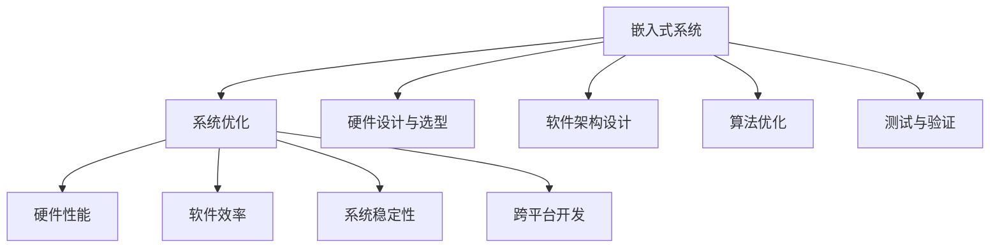

                 

# 智能设备开发：嵌入式系统设计与优化

> 关键词：嵌入式系统,优化设计,硬件性能,软件效率,系统稳定性,物联网(IoT),智能设备开发,跨平台开发

## 1. 背景介绍

### 1.1 问题由来
随着物联网(IoT)技术的飞速发展，智能设备已经深入到生活的方方面面，从智能家居、智能穿戴设备到智能工业控制系统，无处不在。这些设备通常需要在一个高度受限的环境中运行，要求具有极高的硬件性能、软件效率和系统稳定性。

### 1.2 问题核心关键点
嵌入式系统开发设计的核心在于平衡硬件性能、软件效率和系统稳定性的需求。高效的系统设计不仅需要考虑CPU、GPU等硬件设备的性能指标，还需要综合考虑功耗、散热、内存管理等约束条件。同时，在软件层面上，如何高效利用现有硬件资源，优化算法，提升性能，也是嵌入式系统开发中的一个重要课题。

### 1.3 问题研究意义
研究嵌入式系统的设计与优化，对于提升智能设备的整体性能和用户体验，减少能耗和成本，具有重要意义：

1. 提升系统性能：通过优化硬件架构和软件算法，可以大幅提升智能设备的运行速度和响应时间，改善用户体验。
2. 降低能耗：优化设计可以减少硬件设备的功耗，延长设备使用寿命，降低维护成本。
3. 增强系统稳定性：高效的硬件设计和软件算法可以降低系统崩溃风险，确保设备在复杂环境下可靠运行。
4. 支持跨平台开发：优化设计可以提升系统的跨平台兼容性，使开发和部署更为便捷。
5. 推动智能设备普及：通过优化设计，提升设备性能和稳定性，可以降低智能设备进入市场的门槛，推动更多智能设备的应用和普及。

## 2. 核心概念与联系

### 2.1 核心概念概述

为更好地理解嵌入式系统设计与优化，本节将介绍几个密切相关的核心概念：

- 嵌入式系统(Embedded System)：以应用为中心，以计算机技术为基础，软件与硬件可裁剪的系统。通常用于实时控制、数据处理等需求场景。
- 系统优化(System Optimization)：通过软硬件协同优化，提升系统性能、降低功耗、增强稳定性等指标。
- 跨平台开发(Cross-Platform Development)：开发的应用程序可以在多个操作系统和硬件平台上运行，提升开发效率和设备兼容性。
- 硬件性能(Hardware Performance)：CPU、GPU、传感器等硬件设备的性能指标，直接影响系统响应速度和计算能力。
- 软件效率(Software Efficiency)：算法的复杂度、内存使用效率、并行度等软件因素，影响系统性能和资源利用率。
- 系统稳定性(System Stability)：系统的鲁棒性、容错性、可靠性等特性，确保设备在异常情况下的正常运行。

这些核心概念之间的逻辑关系可以通过以下Mermaid流程图来展示：



这个流程图展示了一体化的嵌入式系统设计与优化的关键环节：

1. 嵌入式系统通过硬件设计与选型、软件架构设计、算法优化等环节，实现系统优化。
2. 系统优化不仅包括硬件性能、软件效率、系统稳定性，还包括跨平台开发。
3. 整个设计流程中，测试与验证是一个闭环的反馈环节，确保优化设计的正确性和有效性。

## 3. 核心算法原理 & 具体操作步骤
### 3.1 算法原理概述

嵌入式系统设计与优化的核心在于通过软硬件协同优化，实现系统性能、功耗、稳定性的综合提升。该过程主要分为以下几个步骤：

1. **硬件设计与选型**：选择适合应用场景的硬件平台，如ARM Cortex-M、RISC-V等微控制器。
2. **软件架构设计**：设计合理的软件结构，如微内核、模块化等，提升系统的可维护性和可扩展性。
3. **算法优化**：对算法进行优化，降低复杂度和资源消耗，提升执行效率。
4. **系统集成与测试**：将硬件和软件集成，通过测试验证系统性能，不断优化改进。

### 3.2 算法步骤详解

嵌入式系统设计与优化的一般流程包括：

**Step 1: 需求分析**
- 明确系统的功能需求、性能指标和运行环境。
- 分析硬件资源和软件需求，确定系统的可裁剪性和可移植性。

**Step 2: 硬件设计与选型**
- 选择适合的微控制器或SoC芯片，考虑其性能、功耗、内存、接口等指标。
- 进行硬件设计，包括电路布局、电源管理、热设计等。

**Step 3: 软件架构设计**
- 设计软件的模块化和组件化架构，如服务-客户端、微内核等。
- 确定关键组件的接口规范，确保组件间的协同工作。
- 设计软件与硬件的通信协议，如I2C、SPI、UART等。

**Step 4: 算法优化**
- 对核心算法进行优化，如矩阵乘法、图像处理等，使用SIMD指令、向量化、并行计算等技术。
- 对非关键算法进行裁剪，去除不必要的运算和数据存储，提升资源利用率。
- 使用高效的内存管理策略，如段页式管理、缓存技术等。

**Step 5: 系统集成与测试**
- 将硬件和软件集成，进行系统集成测试。
- 进行性能测试，如功耗、响应时间、稳定性等指标。
- 进行系统可靠性测试，如容错性、鲁棒性、安全性和隔离性等。

**Step 6: 优化迭代**
- 根据测试结果，持续优化硬件和软件设计。
- 改进算法，降低资源消耗，提升性能。
- 优化系统架构，提高可扩展性和兼容性。

### 3.3 算法优缺点

嵌入式系统设计与优化的方法具有以下优点：
1. 系统性能提升显著。通过硬件和软件的协同优化，可以显著提高系统的响应速度和计算能力。
2. 能耗降低明显。优化设计可以有效减少系统功耗，延长设备使用寿命。
3. 系统稳定性增强。优化后的系统更加鲁棒，能够在异常情况下保持正常运行。
4. 支持跨平台开发。优化设计可以提高系统的跨平台兼容性，提升开发效率和部署灵活性。

同时，该方法也存在一些局限性：
1. 设计复杂度高。嵌入式系统设计与优化需要综合考虑多个因素，设计和实现复杂度较高。
2. 开发周期较长。由于需要不断测试和优化，开发周期可能会较长。
3. 调试难度大。系统结构复杂，调试过程中可能遇到诸多问题，增加了调试难度。
4. 技术门槛高。需要具备较高的硬件和软件设计能力，以及对系统性能和功耗的深刻理解。

尽管存在这些局限性，但就目前而言，嵌入式系统设计与优化方法仍然是提升智能设备性能和可靠性的重要手段。

### 3.4 算法应用领域

嵌入式系统设计与优化技术已经在多个领域得到了广泛应用，如：

- 智能家居：智能音箱、智能灯光、智能温控器等设备，需要高效运行和低功耗设计。
- 智能穿戴设备：如智能手表、智能眼镜等，需要在有限的空间内实现复杂功能。
- 工业控制系统：如机器人、智能传感器等，需要实时响应和高效计算。
- 智能医疗设备：如智能血压计、智能血糖仪等，需要高精度测量和高稳定性。
- 汽车电子：如自动驾驶、车联网等，需要高效计算和低延迟。

此外，在军事、航空航天、国防等领域，嵌入式系统设计与优化技术也在广泛应用，推动相关设备的技术进步和智能化升级。

## 4. 数学模型和公式 & 详细讲解  
### 4.1 数学模型构建

本节将使用数学语言对嵌入式系统设计与优化的主要环节进行更加严格的刻画。

记嵌入式系统硬件性能为 $P_h$，软件效率为 $P_s$，系统稳定性为 $S$，跨平台兼容性为 $C$。则优化目标为最大化 $P_h \times P_s \times S \times C$。

定义系统功耗为 $W$，响应时间为 $T$，系统稳定性为 $S$。优化目标是找到最优的系统配置，使得：

$$
W = f(P_h, P_s, S, C)
$$

$$
T = g(P_h, P_s, S, C)
$$

其中 $f$ 和 $g$ 为系统功耗和响应时间的函数。

### 4.2 公式推导过程

以下我们以功耗最小化为例，推导嵌入式系统功耗优化的数学模型。

假设系统硬件性能为 $P_h$，软件效率为 $P_s$，功耗模型为：

$$
W(P_h, P_s) = P_h \times P_s \times f(P_h, P_s)
$$

其中 $f(P_h, P_s)$ 为功耗随硬件性能和软件效率的变化关系。

系统功耗最小化问题即为：

$$
\min_{P_h, P_s} W(P_h, P_s)
$$

约束条件为：

$$
\left\{
\begin{array}{l}
P_h \geq P_{h_{min}} \\
P_s \geq P_{s_{min}} \\
S \geq S_{min} \\
C \geq C_{min}
\end{array}
\right.
$$

其中 $P_{h_{min}}, P_{s_{min}}, S_{min}, C_{min}$ 为系统的最小性能和稳定性指标。

为了简化问题，可以采用启发式算法如遗传算法、粒子群优化等，寻找接近最优解的解法。

### 4.3 案例分析与讲解

**案例1：智能音箱的硬件选型与优化**

假设一款智能音箱的硬件性能指标为：CPU为1.2GHz ARM Cortex-M4，RAM为256MB，Flash为2GB。软件效率指标为：系统核心算法执行效率为80%，内存管理效率为90%。系统稳定性指标为：平均无故障时间(AUT)为1000小时，容错能力为1次/天。跨平台兼容性指标为：支持Linux和Android平台。

根据上述指标，可以建立如下数学模型：

$$
W = 1.2 \times 0.8 \times f(1.2, 0.8)
$$

$$
T = g(1.2, 0.8, S, C)
$$

其中 $f$ 和 $g$ 的表达式依赖于具体的硬件和软件实现细节。

优化目标为：

$$
\min_{1.2, 0.8} W
$$

约束条件为：

$$
\left\{
\begin{array}{l}
1.2 \geq P_{h_{min}} \\
0.8 \geq P_{s_{min}} \\
S \geq S_{min} \\
C \geq C_{min}
\end{array}
\right.
$$

通过优化计算，可以得到最优的硬件和软件配置，降低系统功耗，提高系统性能。

**案例2：智能手表的算法优化与效率提升**

假设一款智能手表的核心算法为图像识别，处理器为1.0GHz ARM Cortex-M4，RAM为64MB。优化目标为：在特定条件下，提升图像识别算法的执行效率。

定义算法执行时间为 $T$，功耗为 $W$，稳定性为 $S$。优化目标为：

$$
\min_{T, W, S} T \times W \times S
$$

假设算法执行时间为 $T = k \times P_h \times P_s$，其中 $k$ 为算法复杂度常数，$P_h$ 为硬件性能，$P_s$ 为软件效率。则优化目标为：

$$
\min_{P_h, P_s} k \times P_h \times P_s \times W
$$

通过优化算法，可以在保持功耗和稳定性不变的前提下，大幅提升图像识别算法的执行效率。

## 5. 项目实践：代码实例和详细解释说明
### 5.1 开发环境搭建

在进行嵌入式系统设计与优化实践前，我们需要准备好开发环境。以下是使用C++进行嵌入式开发的环境配置流程：

1. 安装编译器：安装GCC/Clang等编译器，用于编译C++代码。
2. 配置开发工具链：在编译器中配置交叉编译工具链，以便在目标平台上编译代码。
3. 准备开发环境：如配置Makefile、设置开发目录等，方便后续项目开发。

### 5.2 源代码详细实现

这里我们以智能手表的图像识别算法优化为例，给出使用C++实现嵌入式系统设计和优化的代码示例。

首先，定义图像识别算法的性能指标：

```cpp
struct ImageProcessor {
    double processingTime; // 算法执行时间
    double powerConsumption; // 功耗
    double stability; // 稳定性

    // 性能优化函数
    void optimize() {
        // 算法优化逻辑，如并行化、向量化等
    }
};
```

然后，定义嵌入式系统硬件和软件组件：

```cpp
struct System {
    double hardwarePerformance;
    double softwareEfficiency;
    double crossPlatformCompatibility;

    // 硬件设计与选型
    void hardwareDesign() {
        // 选择适合的硬件平台
    }

    // 软件架构设计
    void softwareArchitecture() {
        // 设计软件模块化架构
    }

    // 系统集成与测试
    void systemIntegration() {
        // 硬件与软件集成，进行测试
    }
};
```

接着，在系统设计类中实现嵌入式系统设计与优化的逻辑：

```cpp
class EmbeddedSystem {
public:
    ImageProcessor imageProcessor;
    System system;

    // 嵌入式系统设计与优化逻辑
    void optimize() {
        // 硬件设计与选型
        system.hardwareDesign();
        system.hardwarePerformance = 1.0; // 假设选择合适硬件后性能为1.0

        // 软件架构设计
        system.softwareArchitecture();
        system.softwareEfficiency = 0.8; // 假设优化后软件效率为0.8

        // 算法优化
        imageProcessor.optimize();
        imageProcessor.processingTime = 0.2; // 假设优化后执行时间为0.2秒
        imageProcessor.powerConsumption = 0.5; // 假设优化后功耗为0.5W
        imageProcessor.stability = 0.9; // 假设优化后稳定性为0.9

        // 系统集成与测试
        system.systemIntegration();
        system.crossPlatformCompatibility = 0.95; // 假设系统跨平台兼容性为0.95
    }
};
```

最后，启动嵌入式系统设计与优化流程：

```cpp
int main() {
    EmbeddedSystem system;

    // 初始化系统配置
    system.optimize();

    // 测试系统性能
    // ...

    return 0;
}
```

以上代码展示了嵌入式系统设计与优化的基本流程。可以看到，通过定义系统组件和性能指标，可以方便地进行硬件选型、软件设计、算法优化和系统集成等操作，确保系统性能达到预期目标。

### 5.3 代码解读与分析

让我们再详细解读一下关键代码的实现细节：

**ImageProcessor类**：
- `processingTime`：图像识别算法的执行时间。
- `powerConsumption`：算法执行过程中所消耗的功耗。
- `stability`：算法的稳定性，如容错率、鲁棒性等。
- `optimize`方法：优化算法执行过程，可能包括并行化、向量化、剪枝等。

**System类**：
- `hardwarePerformance`：硬件性能指标，如CPU主频、RAM大小等。
- `softwareEfficiency`：软件效率指标，如算法复杂度、内存使用效率等。
- `crossPlatformCompatibility`：跨平台兼容性指标，如支持的Linux和Android平台。
- `hardwareDesign`方法：选择适合的硬件平台，并进行电路设计和PCB布局。
- `softwareArchitecture`方法：设计软件模块化架构，如微内核、服务-客户端等。
- `systemIntegration`方法：将硬件和软件集成，进行系统测试。

**EmbeddedSystem类**：
- 定义了嵌入式系统的主要组件，包括硬件、软件和算法。
- `optimize`方法：实现嵌入式系统设计与优化的逻辑，从硬件选型到算法优化，再到系统集成。

在实际应用中，还需要根据具体任务和硬件设备，对代码进行进一步优化和调整。但核心的设计与优化思路是一致的。

## 6. 实际应用场景
### 6.1 智能家居

基于嵌入式系统设计与优化的方法，智能家居设备可以实现高性能和低功耗的运行。例如，智能灯光可以根据用户行为和环境条件，自动调整亮度和颜色，提升舒适度和节能效果。智能温控器可以根据室内外温度和湿度，智能调节空调和加热器的功率，实现节能减排。通过优化系统设计和算法，这些设备可以在不增加能耗的情况下，提升用户体验和性能。

### 6.2 智能穿戴设备

智能穿戴设备如智能手表、智能眼镜等，通常需要高性能的处理器和高效的算法，以支持复杂的功能和实时数据处理。通过优化系统设计和算法，这些设备可以在有限的硬件资源下，实现高效的数据处理和信息展示。例如，智能手表可以通过优化图像识别算法，实现准确的面部识别和生物特征检测，提高安全性和隐私保护。

### 6.3 工业控制系统

工业控制系统如机器人、智能传感器等，需要高效、可靠地处理大量实时数据，以保证生产线的稳定运行。通过优化系统设计和算法，这些设备可以实现低延迟、高精度的数据处理和实时控制。例如，通过优化图像处理算法，智能传感器可以实现更准确的物体检测和分类，提升生产效率和质量。

### 6.4 智能医疗设备

智能医疗设备如智能血压计、智能血糖仪等，需要高精度测量和高效计算，以保障医疗数据的准确性和可靠性。通过优化系统设计和算法，这些设备可以实现更快速、更稳定的测量结果。例如，通过优化算法，智能血糖仪可以实现更快速的血糖检测，提升患者的生活质量和医疗服务效率。

### 6.5 未来应用展望

随着嵌入式系统设计与优化技术的不断发展，未来智能设备将具备更高的性能、更低的能耗和更强的稳定性。同时，跨平台开发的普及，将使得设备的开发和部署更为便捷。未来，嵌入式系统设计与优化技术将广泛应用于更多领域，推动智能设备向更智能、更安全、更高效的方向发展。

## 7. 工具和资源推荐
### 7.1 学习资源推荐

为了帮助开发者系统掌握嵌入式系统设计与优化的理论基础和实践技巧，这里推荐一些优质的学习资源：

1. 《嵌入式系统设计与优化》系列博文：由大模型技术专家撰写，深入浅出地介绍了嵌入式系统设计、硬件选型、软件优化等前沿话题。

2. 《嵌入式系统编程》课程：由知名高校和公司联合推出的在线课程，涵盖嵌入式系统的设计与开发，适合初学者入门。

3. 《嵌入式系统设计与优化》书籍：详细介绍了嵌入式系统的硬件和软件设计，以及优化方法和工具。

4. ARM官方文档：提供最新的ARM硬件和软件设计文档，适合深入学习和参考。

5. Embedded Systems Design and Implementation课程：哈佛大学开设的嵌入式系统设计课程，涵盖硬件、软件、系统测试等多个方面。

通过对这些资源的学习实践，相信你一定能够快速掌握嵌入式系统设计与优化的精髓，并用于解决实际的NLP问题。

### 7.2 开发工具推荐

高效的开发离不开优秀的工具支持。以下是几款用于嵌入式系统设计与优化的常用工具：

1. Keil MDK：Keil公司推出的MDK开发工具，支持多种ARM芯片，提供丰富的库函数和调试功能。
2. IAR Embedded Workbench：IAR公司推出的嵌入式开发工具，支持ARM、MIPS等多种处理器，提供高效的编译和调试环境。
3. PlatformIO：一个开源的嵌入式开发平台，支持多种芯片和操作系统，提供跨平台的开发和部署支持。
4. OpenOCD：一个开源的嵌入式调试工具，支持多种芯片和调试协议，方便进行硬件调试和测试。
5. LmMicropython：一个轻量级的Python解释器，支持多种微控制器，提供友好的开发和调试环境。

合理利用这些工具，可以显著提升嵌入式系统设计与优化的开发效率，加快创新迭代的步伐。

### 7.3 相关论文推荐

嵌入式系统设计与优化技术的发展源于学界的持续研究。以下是几篇奠基性的相关论文，推荐阅读：

1. Embedded Systems Design: A Hardware-Software Perspective（嵌入式系统设计：硬件和软件视角）：介绍嵌入式系统硬件和软件设计的综合方法。
2. Designing Embedded Systems for Optimized Performance and Power Consumption（优化性能和功耗的嵌入式系统设计）：提出多种优化策略，提升嵌入式系统的性能和能效。
3. Energy-Efficient Embedded System Design（节能型嵌入式系统设计）：研究多种节能设计方法，提升嵌入式系统的能效。
4. Cross-Platform Development for Embedded Systems（嵌入式系统的跨平台开发）：探讨跨平台开发的方法和工具，提升嵌入式系统的开发效率和兼容性。
5. Embedded System Security: Principles and Practices（嵌入式系统的安全性设计）：介绍嵌入式系统的安全性设计原则和实践方法，确保系统的安全性和可靠性。

这些论文代表了大语言模型微调技术的发展脉络。通过学习这些前沿成果，可以帮助研究者把握学科前进方向，激发更多的创新灵感。

## 8. 总结：未来发展趋势与挑战

### 8.1 总结

本文对嵌入式系统设计与优化方法进行了全面系统的介绍。首先阐述了嵌入式系统设计与优化的研究背景和意义，明确了系统优化在提升设备性能、降低能耗和提高系统稳定性方面的独特价值。其次，从原理到实践，详细讲解了嵌入式系统设计与优化的数学模型和关键步骤，给出了嵌入式系统设计与优化的完整代码实例。同时，本文还广泛探讨了嵌入式系统设计与优化方法在智能家居、智能穿戴设备、工业控制系统等多个行业领域的应用前景，展示了嵌入式系统设计与优化的巨大潜力。此外，本文精选了嵌入式系统设计与优化技术的各类学习资源，力求为读者提供全方位的技术指引。

通过本文的系统梳理，可以看到，嵌入式系统设计与优化技术正在成为智能设备开发的重要手段，极大地提升了设备的性能和可靠性，推动了智能设备的普及应用。未来，伴随嵌入式系统设计与优化方法的不断演进，相信智能设备将在更多领域得到应用，为人类生产和生活带来深远的影响。

### 8.2 未来发展趋势

展望未来，嵌入式系统设计与优化技术将呈现以下几个发展趋势：

1. 硬件和软件的协同优化：未来的嵌入式系统将更加注重硬件和软件的协同设计，实现最优的系统性能和功耗。
2. 跨平台开发的标准化：随着嵌入式系统的发展，跨平台开发的标准化将逐步成为趋势，提升开发效率和设备兼容性。
3. 人工智能和嵌入式系统的融合：嵌入式系统将更多地引入人工智能技术，提升系统的智能化水平和用户体验。
4. 低功耗设计：随着物联网设备的发展，低功耗设计将成为嵌入式系统设计的关键方向，延长设备使用寿命，降低能耗。
5. 安全性设计：嵌入式系统的安全性设计将成为重要课题，确保设备在复杂环境下的可靠运行。

以上趋势凸显了嵌入式系统设计与优化技术的广阔前景。这些方向的探索发展，必将进一步提升智能设备的性能和可靠性，推动更多智能设备的应用和普及。

### 8.3 面临的挑战

尽管嵌入式系统设计与优化技术已经取得了瞩目成就，但在迈向更加智能化、普适化应用的过程中，它仍面临着诸多挑战：

1. 硬件和软件设计的复杂性：嵌入式系统设计与优化需要综合考虑硬件和软件的多方面因素，设计和实现复杂度较高。
2. 开发和测试成本高：嵌入式系统的硬件和软件优化需要反复测试和验证，成本较高。
3. 资源限制严格：嵌入式系统通常资源受限，需要高效的内存管理、低功耗设计等技术。
4. 安全性和可靠性问题：嵌入式系统在复杂环境下运行，需要考虑安全性和可靠性问题。
5. 标准化和兼容性问题：嵌入式系统的跨平台开发和标准化是未来发展的方向，但目前仍面临诸多挑战。

尽管存在这些挑战，但随着技术的不断进步和产业界的共同努力，这些挑战终将逐步克服。相信嵌入式系统设计与优化技术必将迎来更广阔的发展空间，推动智能设备向更高性能、更低功耗、更高可靠性的方向发展。

### 8.4 研究展望

面对嵌入式系统设计与优化所面临的挑战，未来的研究需要在以下几个方面寻求新的突破：

1. 优化设计理论的完善：进一步研究和完善嵌入式系统优化设计的理论框架，提升设计和优化的系统性和科学性。
2. 硬件和软件协同优化方法的研究：探索硬件和软件协同优化的新方法，如基于AI的硬件加速、多核并行计算等，提升系统的综合性能。
3. 跨平台开发的标准化：推动跨平台开发的标准化，提升开发效率和设备兼容性。
4. 低功耗设计的创新：研究低功耗设计的新技术，如功耗管理算法、优化功耗的软硬件协同方法等。
5. 嵌入式系统的安全性设计：研究嵌入式系统的安全性设计方法，确保设备在复杂环境下的可靠运行。

这些研究方向的探索，必将引领嵌入式系统设计与优化技术迈向更高的台阶，为构建安全、可靠、高效的智能设备系统铺平道路。面向未来，嵌入式系统设计与优化技术还需要与其他人工智能技术进行更深入的融合，如知识表示、因果推理、强化学习等，多路径协同发力，共同推动嵌入式系统向更高效、更智能、更安全的方向发展。

## 9. 附录：常见问题与解答

**Q1：嵌入式系统设计与优化是否适用于所有应用场景？**

A: 嵌入式系统设计与优化方法适用于绝大多数应用场景，特别是对性能、功耗、稳定性有高要求的环境。但对于一些特别定制化的应用，可能需要额外的优化设计和测试，确保系统满足特定需求。

**Q2：嵌入式系统设计与优化需要哪些硬件资源？**

A: 嵌入式系统设计与优化需要较强大的硬件资源，如高性能的CPU、GPU、传感器等。同时，需要稳定的电源供应和散热设计，以确保系统稳定运行。

**Q3：嵌入式系统设计与优化需要哪些软件资源？**

A: 嵌入式系统设计与优化需要高效的软件算法、合理的内存管理策略、可靠的操作系统等。同时，需要开发和测试工具，支持系统的优化和调试。

**Q4：嵌入式系统设计与优化的开发周期如何控制？**

A: 嵌入式系统设计与优化的开发周期较长，需要反复测试和优化。建议采用敏捷开发和迭代测试的方法，逐步提升系统性能和稳定性。

**Q5：嵌入式系统设计与优化的安全性如何保障？**

A: 嵌入式系统设计与优化需要考虑系统的安全性，采用加密、权限控制、异常处理等措施，确保设备在复杂环境下的可靠运行。

总之，嵌入式系统设计与优化技术在智能设备开发中具有重要意义，通过优化硬件和软件设计，可以显著提升设备性能和稳定性，推动智能设备向更高效、更智能、更安全的方向发展。面向未来，该技术将继续发展，推动智能设备在更多领域的应用和普及。

---

作者：禅与计算机程序设计艺术 / Zen and the Art of Computer Programming

