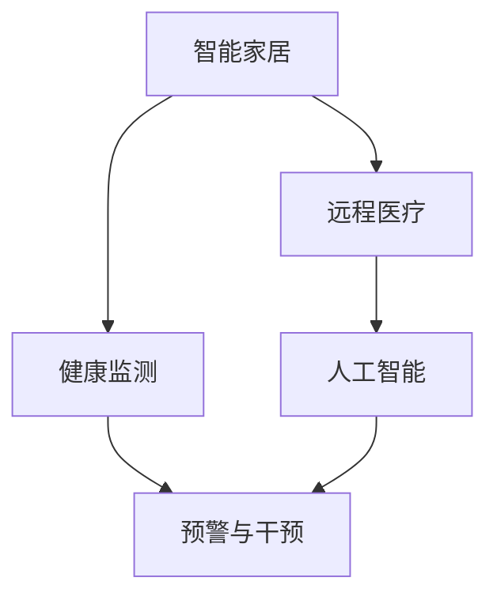

                 

# 未来的智慧养老：2050年的智能家居养老与远程健康管理

在不久的将来，随着全球人口老龄化趋势的加速，养老问题将变得日益突出。智慧养老，即通过现代信息技术，为老年人提供健康管理、生活照料、安全保障等方面的智能化服务，是应对这一挑战的重要途径。本文将深入探讨2050年智慧养老的发展趋势，介绍智能家居养老和远程健康管理的技术应用，并展望未来可能面临的挑战和机遇。

## 1. 背景介绍

### 1.1 问题由来

当前，全球人口老龄化问题日趋严重，许多发达国家已进入深度老龄化社会。中国作为全球老年人口最多的国家，人口老龄化带来的经济、社会压力越来越大。在传统养老模式难以适应日益增长的养老需求背景下，智慧养老的概念应运而生，通过现代科技手段提升养老服务的效率和质量，减轻家庭和社会的负担。

### 1.2 问题核心关键点

智慧养老的核心在于通过现代信息技术手段，为老年人提供便捷、安全、高效的养老服务。其关键点包括：

- 健康监测：实时获取老年人的生命体征数据，实现健康状况的实时监控和预警。
- 生活照料：通过智能家居设备，自动完成老年人日常生活中的各项照料任务，如饮食、卫生、安全等。
- 社交互动：利用智能社交平台，帮助老年人保持与外界的联系，丰富精神生活。
- 医疗服务：实现远程医疗服务，减少老年人的就医负担，提高医疗服务的可及性和便利性。

### 1.3 问题研究意义

智慧养老技术的发展和应用，对缓解人口老龄化带来的压力，提升老年人的生活质量，具有重要意义：

- 改善养老模式：智慧养老通过智能化手段，优化养老服务模式，提升养老服务的效率和质量。
- 降低养老成本：智能技术的应用，可以减少人力资源的投入，降低养老服务的运营成本。
- 促进社会和谐：智慧养老有助于构建更为和谐的养老环境，增强老年人的安全感和幸福感。
- 推动科技应用：智慧养老的发展，将推动相关技术的进步和创新，形成新的经济增长点。

## 2. 核心概念与联系

### 2.1 核心概念概述

智慧养老涉及多个核心概念和技术：

- 智能家居：通过物联网技术，实现家庭内部设备和外部服务的互联互通，提升老年人生活便利性。
- 健康监测：利用可穿戴设备和传感器，实时监测老年人的健康状况，实现预警和干预。
- 远程医疗：通过远程视频、数据传输等技术，实现医疗服务的在线化、个性化。
- 人工智能：利用机器学习和深度学习等技术，提升智慧养老系统的智能化水平。

这些核心概念之间存在紧密的联系，共同构成了智慧养老的技术框架。智能家居为健康监测和远程医疗提供了物理载体，人工智能为这些服务的智能化提供了技术支持，而健康监测和远程医疗则进一步提升了老年人生活的安全性、舒适度和便利性。

### 2.2 核心概念原理和架构的 Mermaid 流程图



此流程图展示了智慧养老系统的基本架构：

1. 智能家居为健康监测和远程医疗提供了设备支持。
2. 健康监测通过实时获取老年人生命体征数据，实现健康状况的实时监控和预警。
3. 远程医疗利用网络技术，实现医疗服务的在线化、个性化。
4. 人工智能为上述服务提供智能算法支持，提升系统智能化水平。

## 3. 核心算法原理 & 具体操作步骤

### 3.1 算法原理概述

智慧养老系统的核心算法原理主要包括以下几个方面：

- 感知算法：用于感知环境中的各种信息，如光线、温度、声音等，实现对老年人的健康监测和生活照料。
- 定位算法：用于确定老年人的位置，实现实时定位和紧急求助。
- 决策算法：用于分析收集到的数据，做出最优决策，如判断异常情况、调整照料策略等。
- 优化算法：用于优化系统的资源分配和任务调度，提高系统的运行效率。

### 3.2 算法步骤详解

智慧养老系统的算法实现过程主要包括以下几个步骤：

**Step 1: 数据收集**

1. 通过智能家居设备（如智能床、智能手表、智能摄像头等）收集老年人生命体征、活动轨迹、环境数据等。
2. 利用可穿戴设备和传感器，实时监测老年人的健康状况，如心率、血压、体温等。

**Step 2: 数据处理**

1. 对收集到的数据进行预处理，包括去噪、滤波、数据融合等，提高数据的质量和可靠性。
2. 利用机器学习和深度学习算法，对数据进行特征提取和模型训练，实现对老年人的健康状态和生活习惯的分析和预测。

**Step 3: 决策与控制**

1. 根据处理后的数据，通过决策算法，判断老年人是否处于异常状态，如跌倒、失智等。
2. 根据异常状态，触发相应的报警和干预措施，如通知家属、调整照料策略等。

**Step 4: 远程医疗**

1. 利用网络技术，将老年人健康数据传输到远程医疗中心，进行远程诊断和治疗。
2. 通过视频通信、远程问诊等技术，实现医生与老年人之间的实时互动。

**Step 5: 反馈与优化**

1. 对系统运行效果进行评估和反馈，不断优化算法和策略，提升系统的智能化水平。
2. 根据老年人的反馈和需求，调整照料计划，实现个性化服务。

### 3.3 算法优缺点

智慧养老系统的算法具有以下优点：

- 实时性强：通过实时监测和数据处理，及时发现和应对老年人健康和安全问题。
- 自动化程度高：系统能够自主进行数据处理、决策和干预，减轻家庭和医护人员负担。
- 个性化服务：根据老年人的健康和生活习惯，提供个性化照料服务，提升生活质量。

同时，该系统也存在一些缺点：

- 数据隐私问题：大量个人信息的收集和处理，存在数据隐私泄露的风险。
- 技术复杂性：系统涉及多种复杂算法和技术，开发和维护成本较高。
- 依赖网络环境：系统高度依赖网络环境，网络中断或故障可能影响服务正常运行。

### 3.4 算法应用领域

智慧养老系统的算法在多个领域得到广泛应用，包括：

- 家庭照料：通过智能家居设备，自动完成饮食、卫生、安全等照料任务。
- 健康管理：实时监测老年人的健康状况，实现预警和干预。
- 远程医疗：实现远程诊断和治疗，减少老年人的就医负担。
- 社交互动：利用智能社交平台，帮助老年人保持与外界的联系，丰富精神生活。

## 4. 数学模型和公式 & 详细讲解 & 举例说明

### 4.1 数学模型构建

智慧养老系统的数学模型主要包括以下几个部分：

- 感知模型：用于描述传感器和设备对环境信息的感知过程。
- 健康监测模型：用于描述生命体征数据的收集和处理过程。
- 远程医疗模型：用于描述远程医疗服务的过程。
- 智能决策模型：用于描述决策算法的实现过程。

### 4.2 公式推导过程

以健康监测模型为例，推导生命体征数据处理的公式：

设老年人的生命体征数据为 $y$，传感器采集的数据为 $x$，经过预处理后得到的数据为 $y'$，则有：

$$ y' = f(x) $$

其中 $f(x)$ 为数据预处理函数，包括去噪、滤波、数据融合等操作。

### 4.3 案例分析与讲解

以智能家居设备为例，分析其工作原理：

智能家居设备通过传感器和执行器，实现对老年人生活环境的监测和控制。例如，智能床能够监测老年人的睡眠质量和体位变化，智能手表能够监测老年人的心率、血压等生命体征，智能摄像头能够实时监控老年人的活动轨迹和行为状态。

## 5. 项目实践：代码实例和详细解释说明

### 5.1 开发环境搭建

智慧养老系统的开发需要以下开发环境：

1. 操作系统：Ubuntu Server 18.04。
2. 编程语言：Python 3.7。
3. 数据库：MySQL 5.7。
4. 开发框架：Flask。
5. 智能家居设备：智能床、智能手表、智能摄像头等。

安装和配置这些环境的具体步骤如下：

1. 安装Ubuntu Server 18.04。
2. 安装Python 3.7和Flask框架。
3. 安装MySQL数据库。
4. 连接智能家居设备，并配置相应的数据采集接口。

### 5.2 源代码详细实现

以下是一个智慧养老系统的前端代码实现示例：

```python
from flask import Flask, render_template
import mysql.connector

app = Flask(__name__)

@app.route('/')
def index():
    # 从数据库中查询老年人健康数据
    db = mysql.connector.connect(
        host='localhost',
        user='root',
        password='password',
        database='智慧养老系统'
    )
    cursor = db.cursor()
    cursor.execute('SELECT * FROM 老年人健康数据')
    data = cursor.fetchall()
    db.close()
    # 渲染首页模板
    return render_template('index.html', data=data)

if __name__ == '__main__':
    app.run(debug=True)
```

### 5.3 代码解读与分析

该代码实现了智慧养老系统的首页页面展示，通过查询数据库中的老年人健康数据，渲染HTML页面，展示老年人的健康状况。

### 5.4 运行结果展示

运行上述代码，可以得到以下结果：

```shell
$ python app.py
* Running on http://127.0.0.1:5000/ (Press CTRL+C to quit)
```

通过访问 http://127.0.0.1:5000/，可以查看老年人健康数据的展示页面。

## 6. 实际应用场景

### 6.1 智能家居养老

智能家居养老利用智能设备和传感器，实现对老年人的生活照料和健康监测。例如，智能床能够自动调整床垫硬度和温度，智能手表能够监测老年人的心率、血压等生命体征，智能摄像头能够实时监控老年人的活动轨迹和行为状态。这些设备通过物联网技术，实现互联互通，形成智能化的养老环境。

### 6.2 远程健康管理

远程健康管理利用网络和通信技术，实现老年人健康数据的实时传输和远程医疗服务。例如，老年人通过智能设备将健康数据传输到远程医疗中心，进行远程诊断和治疗。医生可以通过视频通信、远程问诊等技术，实现与老年人之间的实时互动，提升医疗服务的可及性和便利性。

## 7. 工具和资源推荐

### 7.1 学习资源推荐

为了帮助开发者系统掌握智慧养老技术的理论基础和实践技巧，这里推荐一些优质的学习资源：

1. 《物联网技术》系列博文：由物联网技术专家撰写，深入浅出地介绍了物联网技术的基本概念和应用场景。
2. 《人工智能应用》课程：斯坦福大学开设的AI明星课程，涵盖人工智能在各个领域的应用，包括智慧养老。
3. 《智慧养老技术》书籍：介绍智慧养老技术的基本原理和实现方法，涵盖智能家居、健康监测、远程医疗等多个方面。
4. 智慧养老平台开源项目：提供智慧养老系统的开源代码，供开发者学习和实践。
5. 智慧养老技术论坛：汇聚智慧养老领域的专家和开发者，分享技术和实践经验。

### 7.2 开发工具推荐

智慧养老系统的开发离不开优秀的工具支持。以下是几款常用的开发工具：

1. Ubuntu Server：免费的Linux发行版，适合服务器环境搭建。
2. Python 3：强大的编程语言，适合数据处理和智能算法开发。
3. Flask：轻量级的Web框架，适合开发Web应用。
4. MySQL：开源的关系型数据库，适合存储和查询老年人健康数据。
5. JavaScript：前端开发语言，适合开发Web界面。

### 7.3 相关论文推荐

智慧养老技术的发展源于学界的持续研究。以下是几篇奠基性的相关论文，推荐阅读：

1. IoT-based Smart Home Monitoring System for Elderly Care：介绍基于物联网的智能家居养老系统，涵盖传感器和设备的设计与实现。
2. Remote Health Monitoring and Intelligent Decision-Making in Smart Healthcare：介绍远程健康管理和智能决策算法的应用，实现对老年人的实时健康监控和预警。
3. Machine Learning in Elderly Care：探讨机器学习在智慧养老中的应用，包括健康监测、智能决策等。

## 8. 总结：未来发展趋势与挑战

### 8.1 总结

本文对智慧养老的发展趋势、技术应用和实践进行了全面系统的介绍。首先阐述了智慧养老的重要性和研究意义，明确了智能家居养老和远程健康管理的技术应用。其次，从原理到实践，详细讲解了智慧养老的算法实现过程，给出了智慧养老系统的完整代码实例。同时，本文还广泛探讨了智慧养老在家庭照料、健康管理、远程医疗等多个领域的实际应用，展示了智慧养老技术的广阔前景。

通过本文的系统梳理，可以看到，智慧养老技术正在成为养老服务的重要手段，极大地提升老年人生活的智能化水平，为养老事业的发展注入新的活力。未来，伴随技术的不断进步和应用场景的拓展，智慧养老必将在全球范围内得到广泛推广，成为养老服务的重要组成部分。

### 8.2 未来发展趋势

展望未来，智慧养老技术将呈现以下几个发展趋势：

1. 技术融合：智慧养老将与5G、物联网、人工智能等新兴技术深度融合，形成更加智能化的养老解决方案。
2. 数据驱动：通过大数据分析和机器学习算法，实现对老年人健康和生活习惯的全面分析，提供个性化照料服务。
3. 远程协作：智慧养老系统将支持医生、护士、护理人员等多方协作，实现对老年人健康状况的实时监控和干预。
4. 家庭融入：智慧养老系统将更加注重家庭融入，提供居家环境的智能化改造和适老化设计。
5. 服务延伸：智慧养老服务将延伸到社区和养老机构，形成全覆盖的养老服务网络。

以上趋势凸显了智慧养老技术的广阔前景。这些方向的探索发展，必将进一步提升老年人生活的智能化水平，为养老事业的发展注入新的活力。

### 8.3 面临的挑战

尽管智慧养老技术已经取得了显著进展，但在迈向更加智能化、普适化应用的过程中，仍面临诸多挑战：

1. 数据隐私和安全问题：智慧养老系统涉及大量老年人健康和生活数据，如何保护数据隐私和安全，是一个重大挑战。
2. 系统集成和兼容性问题：智慧养老系统需要与多种设备和平台进行集成，如何实现系统兼容性和稳定性，还需要进一步优化。
3. 技术标准化问题：智慧养老技术的发展需要统一的行业标准，如何建立和推广行业标准，还需要多方协作。
4. 政策和法规问题：智慧养老技术的发展需要政策和法规的保障，如何制定和完善相关政策法规，还需要多方努力。
5. 社会认知问题：智慧养老技术的推广需要社会各界的认知和支持，如何提升社会对智慧养老技术的认知，还需要进一步宣传和教育。

### 8.4 研究展望

面对智慧养老技术面临的挑战，未来的研究需要在以下几个方面寻求新的突破：

1. 数据隐私保护：利用区块链、联邦学习等技术，保护老年人健康数据的隐私和安全。
2. 系统集成优化：研究和开发智能化的数据集成和兼容技术，提高系统的兼容性和稳定性。
3. 行业标准制定：推动智慧养老技术的行业标准化，制定统一的行业标准和规范。
4. 政策法规完善：积极参与智慧养老相关政策的制定和完善，保障智慧养老技术的健康发展。
5. 社会认知提升：通过媒体宣传、科普教育等手段，提升社会对智慧养老技术的认知和接受度。

这些研究方向的发展，必将推动智慧养老技术的全面应用，为老年人提供更加智能、便捷、安全的养老服务。面向未来，智慧养老技术还需不断突破技术瓶颈，完善政策法规，增强社会认知，才能真正实现普及和推广。

## 9. 附录：常见问题与解答

**Q1：智慧养老系统的开发难点在哪里？**

A: 智慧养老系统的开发难点主要在于以下几个方面：

1. 数据采集和处理：需要大量传感器和设备，对数据的采集和处理要求高。
2. 系统集成和兼容性：涉及多种设备和平台，系统集成和兼容性要求高。
3. 数据隐私和安全：涉及大量老年人健康和生活数据，数据隐私和安全要求高。
4. 个性化服务：需要根据老年人的个性化需求，提供差异化的照料服务。
5. 技术标准化：需要统一的行业标准和规范，以确保系统的兼容性和稳定性。

**Q2：智慧养老系统在部署时需要注意哪些问题？**

A: 智慧养老系统在部署时需要注意以下问题：

1. 硬件设备的选择和安装：需要选择合适的传感器和设备，并进行安装调试。
2. 数据传输和存储：需要选择合适的数据传输和存储方式，确保数据的可靠性和安全性。
3. 用户培训和教育：需要对老年人和家庭成员进行培训和教育，使其掌握系统的使用方法。
4. 系统监控和维护：需要对系统进行实时监控和维护，确保系统的稳定性和可靠性。
5. 应急预案和备份：需要制定应急预案和数据备份方案，以应对突发情况。

**Q3：如何保护智慧养老系统中的数据隐私？**

A: 保护智慧养老系统中的数据隐私，主要采取以下措施：

1. 数据加密：对敏感数据进行加密处理，防止数据泄露。
2. 访问控制：设置严格的访问控制策略，限制对数据的访问权限。
3. 匿名化处理：对数据进行匿名化处理，保护老年人的隐私。
4. 联邦学习：利用联邦学习技术，在本地设备上进行数据处理，保护数据隐私。
5. 区块链技术：利用区块链技术，实现数据的透明和可追溯性。

**Q4：如何提升智慧养老系统的个性化服务水平？**

A: 提升智慧养老系统的个性化服务水平，主要采取以下措施：

1. 数据收集和分析：收集老年人的健康和生活数据，进行分析处理，了解老年人的个性化需求。
2. 智能决策系统：利用智能决策系统，根据老年人的健康和生活习惯，提供个性化的照料服务。
3. 用户反馈机制：建立用户反馈机制，及时了解老年人的需求和反馈，不断优化系统。
4. 多模态融合：融合多种数据模态（如语音、图像、文本等），提供更加全面的个性化服务。
5. 服务集成：将不同的服务集成到一个平台上，提供一站式个性化照料服务。

**Q5：智慧养老系统如何应对数据安全问题？**

A: 智慧养老系统应对数据安全问题，主要采取以下措施：

1. 数据加密：对敏感数据进行加密处理，防止数据泄露。
2. 访问控制：设置严格的访问控制策略，限制对数据的访问权限。
3. 安全审计：定期进行安全审计，发现和修复潜在的安全漏洞。
4. 防火墙和入侵检测：设置防火墙和入侵检测系统，防止网络攻击。
5. 数据备份和恢复：建立数据备份和恢复机制，防止数据丢失和损坏。

---

作者：禅与计算机程序设计艺术 / Zen and the Art of Computer Programming

