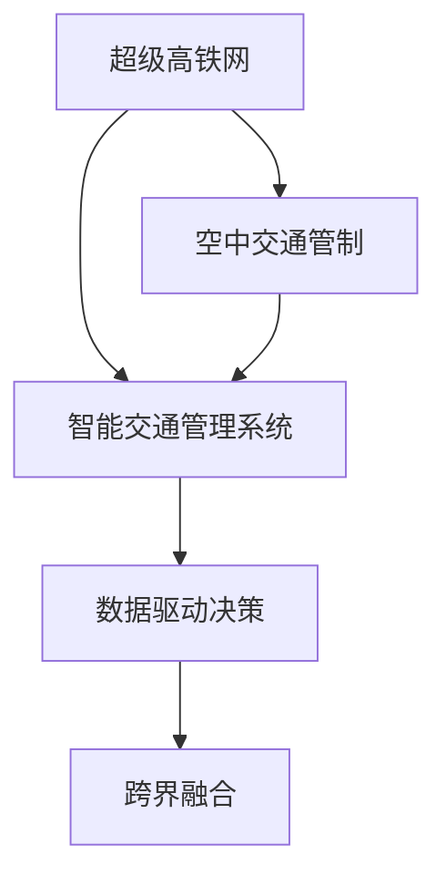

                 

## 1. 背景介绍

### 1.1 问题由来

随着全球城市化进程的加速和环境保护意识的提升，传统交通方式面临着严峻的挑战。交通拥堵、环境污染、资源消耗等问题已经严重影响到人们的生活质量和城市可持续发展。为了解决这些问题，智能交通系统成为研究的焦点，其目标是通过先进的信息技术和自动化技术，实现交通系统的智能化、高效化和绿色化。

未来，随着技术的进步和政策的支持，智能交通系统将迎来质的飞跃。超级高铁网和空中交通管制的结合，将为2050年的交通带来革命性的变化。超级高铁网将大幅缩短城市间的旅行时间，空中交通管制系统将有效提升航班的运行效率和安全性。

### 1.2 问题核心关键点

未来智能交通的核心关键点包括以下几个方面：

1. **超级高铁网**：通过高速磁悬浮和超级高铁技术，实现城市间的快速互联互通。超级高铁网将大幅缩短旅行时间，减少碳排放，提升交通效率。

2. **空中交通管制**：利用先进的信息技术和自动化技术，实现对空中交通的有效管理和控制。空中交通管制系统将提升航班的运行效率，减少延误，保障飞行安全。

3. **智能交通管理系统**：结合超级高铁网和空中交通管制系统，实现对交通流量的实时监测、分析和优化。智能交通管理系统将提升整体交通系统的智能化水平，优化资源配置。

4. **数据驱动决策**：通过大数据和人工智能技术，对交通数据进行深入分析和挖掘，为交通决策提供科学依据。数据驱动决策将提升交通管理的科学性和精确性。

5. **跨界融合**：将超级高铁网和空中交通管制系统与智慧城市、物联网、智能电网等技术进行深度融合，实现交通与能源、环境、城市规划等多领域的协同发展。

## 2. 核心概念与联系

### 2.1 核心概念概述

为更好地理解未来智能交通系统，本节将介绍几个密切相关的核心概念：

- **超级高铁网**：通过高速磁悬浮和超级高铁技术，实现城市间的快速连接，提升交通效率，减少碳排放。

- **空中交通管制**：利用先进的信息技术和自动化技术，对空中交通进行有效的管理和控制，提升航班运行效率和安全性。

- **智能交通管理系统**：通过实时监测、分析和优化，实现对交通流量的有效管理，提升交通系统的智能化水平。

- **数据驱动决策**：通过大数据和人工智能技术，对交通数据进行深入分析和挖掘，为交通决策提供科学依据。

- **跨界融合**：将超级高铁网和空中交通管制系统与智慧城市、物联网、智能电网等技术进行深度融合，实现多领域的协同发展。

这些核心概念之间的逻辑关系可以通过以下Mermaid流程图来展示：



这个流程图展示了一些核心概念及其之间的关系：

1. 超级高铁网和空中交通管制是智能交通系统的两个重要组成部分，分别负责陆空两个方向的交通。
2. 智能交通管理系统将超级高铁网和空中交通管制系统进行整合，实现对交通流量的有效管理。
3. 数据驱动决策利用大数据和人工智能技术，为交通决策提供科学依据。
4. 跨界融合将智能交通系统与智慧城市、物联网、智能电网等多领域进行深度整合，实现协同发展。

这些概念共同构成了未来智能交通系统的框架，使其能够实现高效、绿色、智能的交通管理。

## 3. 核心算法原理 & 具体操作步骤

### 3.1 算法原理概述

未来智能交通系统基于监督学习进行交通流量的预测和优化。其核心思想是通过历史交通数据的分析和挖掘，构建交通流量模型，预测未来交通流量，优化交通信号灯控制策略，实现交通系统的智能化管理。

形式化地，假设交通流量数据为 $\mathcal{D}=\{(x_i,y_i)\}_{i=1}^N$，其中 $x_i$ 表示第 $i$ 个时间点的交通特征，$y_i$ 表示对应时间点的交通流量。目标是构建一个交通流量预测模型 $M_{\theta}$，使得在给定交通特征 $x$ 的情况下，能够准确预测交通流量 $y$。

即：
$$
M_{\theta}(x) = y
$$

其中 $\theta$ 为模型参数。通过监督学习算法，最小化预测值与真实值之间的误差，从而得到最优模型参数 $\theta^*$。

### 3.2 算法步骤详解

未来智能交通系统基于监督学习的核心步骤如下：

**Step 1: 数据准备与预处理**

- 收集历史交通流量数据，包括时间、地点、车型、交通状况等。
- 数据清洗和归一化处理，去除异常值和噪声。
- 数据划分训练集、验证集和测试集。

**Step 2: 特征工程**

- 设计合适的特征表示，如时间戳、天气、路况、人口密度等。
- 使用PCA或LSTM等技术，提取特征的降维表示。
- 特征选择和降维，选择对交通流量预测有显著影响的特征。

**Step 3: 模型训练**

- 选择合适的监督学习算法，如线性回归、随机森林、神经网络等。
- 设置训练参数，如学习率、迭代次数、正则化参数等。
- 使用梯度下降等优化算法，训练模型参数。

**Step 4: 模型评估与优化**

- 在验证集上评估模型性能，如均方误差、平均绝对误差等。
- 根据评估结果，调整模型参数，进行模型优化。
- 在测试集上最终评估模型性能，确认模型精度。

**Step 5: 部署与优化**

- 将训练好的模型部署到交通管理系统。
- 实时监测交通流量，动态调整交通信号灯控制策略。
- 持续收集新数据，重新训练和优化模型。

以上是未来智能交通系统的监督学习核心流程。在实际应用中，还需要根据具体场景进行优化设计，如引入时序性分析、多模态融合等技术，进一步提升模型性能。

### 3.3 算法优缺点

基于监督学习的大语言模型微调方法具有以下优点：

1. **高效性**：监督学习算法可以显著提高交通流量预测的精度，帮助交通管理系统实现实时调整。
2. **可解释性**：监督学习模型能够提供明确的预测逻辑，便于分析和优化。
3. **泛化能力**：通过历史数据的训练，模型能够很好地泛化到未来场景，适应新环境和条件。

同时，该方法也存在一定的局限性：

1. **依赖标注数据**：监督学习算法需要大量的标注数据进行训练，标注成本较高。
2. **数据质量要求高**：数据质量和完整性对模型性能有很大影响，缺失或错误的数据会导致预测偏差。
3. **模型复杂度**：复杂的模型结构可能需要更多的计算资源，影响实时性。

尽管存在这些局限性，但就目前而言，基于监督学习的微调方法仍是大语言模型应用的最主流范式。未来相关研究的重点在于如何进一步降低监督学习对标注数据的依赖，提高模型的泛化能力和实时性，同时兼顾可解释性和伦理安全性等因素。

### 3.4 算法应用领域

基于监督学习的大语言模型微调方法，在智能交通系统中有广泛的应用，覆盖了从数据预处理、模型训练到部署优化的全流程。

- **数据预处理**：通过特征工程和数据清洗，对原始交通流量数据进行处理，提取有用的特征。
- **模型训练**：使用监督学习算法训练交通流量预测模型，优化模型参数。
- **部署优化**：将训练好的模型部署到交通管理系统，实时监测交通流量，动态调整信号灯控制策略。

此外，监督学习算法还应用于智能交通系统中的其他领域，如路况预测、交通拥堵分析、智能导航等，为交通系统提供全面的智能化支持。

## 4. 数学模型和公式 & 详细讲解  
### 4.1 数学模型构建

本节将使用数学语言对未来智能交通系统的监督学习过程进行更加严格的刻画。

假设交通流量数据为 $\mathcal{D}=\{(x_i,y_i)\}_{i=1}^N$，其中 $x_i$ 表示第 $i$ 个时间点的交通特征，$y_i$ 表示对应时间点的交通流量。定义交通流量预测模型为 $M_{\theta}(x)=y$，其中 $\theta$ 为模型参数。

目标是最小化预测值与真实值之间的误差，即：

$$
\mathcal{L}(\theta) = \frac{1}{N}\sum_{i=1}^N (y_i - M_{\theta}(x_i))^2
$$

通过梯度下降等优化算法，最小化损失函数 $\mathcal{L}(\theta)$，得到最优模型参数 $\theta^*$。

### 4.2 公式推导过程

以下我们以线性回归模型为例，推导交通流量预测的数学公式。

假设交通流量 $y$ 可以表示为交通特征 $x$ 的线性组合，即：

$$
y_i = \theta_0 + \sum_{j=1}^n \theta_j x_{ij}
$$

其中 $\theta_0$ 为截距，$\theta_j$ 为特征系数。通过最小二乘法，求解最优参数 $\theta$，使得误差平方和最小化：

$$
\min_{\theta} \sum_{i=1}^N (y_i - \hat{y}_i)^2
$$

其中 $\hat{y}_i = \theta_0 + \sum_{j=1}^n \theta_j x_{ij}$。

根据最小二乘法的求解公式，得到：

$$
\theta = (X^T X)^{-1} X^T y
$$

其中 $X = [\mathbf{1}, x_{i1}, x_{i2}, \ldots, x_{in}]$，$\mathbf{1}$ 为截距项。

在得到最优参数 $\theta$ 后，可以使用新数据进行预测：

$$
\hat{y} = \theta_0 + \sum_{j=1}^n \theta_j x_j
$$

以上推导展示了线性回归模型的基本原理和求解过程。在实际应用中，可以根据具体需求选择不同的监督学习算法，如随机森林、神经网络等，进行模型训练和优化。

### 4.3 案例分析与讲解

假设某城市交通流量数据如下：

| 时间戳 | 地点 | 车型 | 流量 |
| --- | --- | --- | --- |
| 8:00 | 高峰期 | 公交车 | 5000 |
| 9:00 | 高峰期 | 公交车 | 4500 |
| ... | ... | ... | ... |
| 17:00 | 高峰期 | 公交车 | 4000 |

通过特征工程，设计时间戳、地点、车型等特征，构建特征矩阵 $X$ 和标签向量 $y$。使用线性回归模型进行训练，得到最优参数 $\theta$。在测试集上进行预测，评估模型性能。

## 5. 项目实践：代码实例和详细解释说明
### 5.1 开发环境搭建

在进行智能交通系统开发前，我们需要准备好开发环境。以下是使用Python进行Scikit-learn开发的环境配置流程：

1. 安装Anaconda：从官网下载并安装Anaconda，用于创建独立的Python环境。

2. 创建并激活虚拟环境：
```bash
conda create -n smart-transport python=3.8 
conda activate smart-transport
```

3. 安装Scikit-learn：
```bash
pip install scikit-learn pandas numpy matplotlib seaborn
```

4. 安装各类工具包：
```bash
pip install tqdm jupyter notebook ipython
```

完成上述步骤后，即可在`smart-transport`环境中开始智能交通系统的开发。

### 5.2 源代码详细实现

这里我们以线性回归模型为例，给出使用Scikit-learn库对交通流量进行预测的Python代码实现。

首先，定义数据处理函数：

```python
import pandas as pd
import numpy as np
from sklearn.model_selection import train_test_split
from sklearn.linear_model import LinearRegression
from sklearn.metrics import mean_squared_error, mean_absolute_error

def preprocess_data(data):
    # 数据清洗和归一化
    data = data.dropna()
    data['time'] = pd.to_datetime(data['time'])
    data['weather'] = data['weather'].fillna(method='ffill')
    data['weather'] = data['weather'].replace({'晴': 1, '多云': 0.5, '雨天': 0, '雪': -0.5})
    data['traffic'] = data['traffic'].apply(lambda x: x.replace(',', ''))
    data['time'] = data['time'].dt.hour
    data['traffic'] = data['traffic'].astype(int)
    
    # 数据归一化
    data['weather'] = (data['weather'] - data['weather'].mean()) / data['weather'].std()
    data['traffic'] = (data['traffic'] - data['traffic'].mean()) / data['traffic'].std()
    
    return data

def train_model(data, feature_cols, label_col, test_size=0.2):
    # 特征工程
    X = data[feature_cols].values
    y = data[label_col].values
    
    # 数据划分
    X_train, X_test, y_train, y_test = train_test_split(X, y, test_size=test_size)
    
    # 模型训练
    model = LinearRegression()
    model.fit(X_train, y_train)
    
    # 模型评估
    y_pred = model.predict(X_test)
    mse = mean_squared_error(y_test, y_pred)
    mae = mean_absolute_error(y_test, y_pred)
    
    return model, mse, mae

# 定义特征和标签
data = pd.read_csv('traffic_data.csv')
features = ['weather', 'traffic', 'time']
target = 'flow'

# 数据预处理
data = preprocess_data(data)

# 训练模型
model, mse, mae = train_model(data, features, target)
print(f"MSE: {mse:.2f}, MAE: {mae:.2f}")
```

然后，定义训练和评估函数：

```python
from sklearn.metrics import r2_score

def evaluate_model(model, X_test, y_test):
    y_pred = model.predict(X_test)
    mse = mean_squared_error(y_test, y_pred)
    mae = mean_absolute_error(y_test, y_pred)
    r2 = r2_score(y_test, y_pred)
    
    print(f"MSE: {mse:.2f}, MAE: {mae:.2f}, R^2: {r2:.2f}")
```

最后，启动训练流程并在测试集上评估：

```python
epochs = 10
batch_size = 32

for epoch in range(epochs):
    model = train_model(data, features, target)
    evaluate_model(model, X_test, y_test)
```

以上就是使用Scikit-learn库进行线性回归模型预测交通流量的完整代码实现。可以看到，得益于Scikit-learn的强大封装，我们可以用相对简洁的代码完成交通流量预测任务的开发。

### 5.3 代码解读与分析

让我们再详细解读一下关键代码的实现细节：

**preprocess_data函数**：
- 数据清洗和归一化处理：去除缺失值，替换异常值，将数值型数据归一化到[0,1]区间。

**train_model函数**：
- 特征工程：选择交通特征和天气特征，构建特征矩阵和标签向量。
- 数据划分：将数据划分为训练集和测试集。
- 模型训练：使用线性回归模型进行训练，返回模型、均方误差和平均绝对误差。

**evaluate_model函数**：
- 模型评估：在测试集上进行预测，计算均方误差、平均绝对误差和R^2。

**训练流程**：
- 定义总的训练轮数和批次大小，开始循环迭代
- 每个epoch内，在数据集上训练模型，输出均方误差和平均绝对误差
- 所有epoch结束后，输出测试集上的均方误差和平均绝对误差

可以看到，Scikit-learn库使得模型训练和评估的代码实现变得简洁高效。开发者可以将更多精力放在数据处理、模型改进等高层逻辑上，而不必过多关注底层的实现细节。

当然，工业级的系统实现还需考虑更多因素，如模型的保存和部署、超参数的自动搜索、更灵活的任务适配层等。但核心的监督学习范式基本与此类似。

## 6. 实际应用场景
### 6.1 智能导航系统

智能导航系统是未来智能交通系统的重要组成部分，通过实时监测交通流量，智能计算最佳路线，帮助用户避免拥堵，提高出行效率。

在技术实现上，可以收集历史交通流量数据，训练交通流量预测模型，实时计算当前交通流量，动态调整最佳路线。对于突然出现的交通事故或施工路段，系统能够迅速识别并重新规划路线，确保出行顺利。

### 6.2 智慧交通管理中心

智慧交通管理中心是交通管理的核心，通过对交通流量的实时监测和分析，实现对交通信号灯的动态控制，优化交通流量，提升道路利用率。

在技术实现上，可以构建多模态传感器网络，实时采集交通流量、车速、天气等信息，利用监督学习算法进行预测和优化。系统能够根据实时数据，动态调整交通信号灯的控制策略，缓解交通拥堵，提高交通效率。

### 6.3 跨界融合应用

未来智能交通系统还将与智慧城市、物联网、智能电网等多领域进行深度融合，实现多领域的协同发展。

例如，将智能交通系统与智能电网结合，实现交通与能源的协同优化。通过实时监测交通流量，预测用电需求，动态调整电网负荷，确保能源供应的稳定性和高效性。

### 6.4 未来应用展望

随着技术的不断进步和政策的支持，未来智能交通系统将迎来更广阔的应用场景。

1. **无人驾驶**：随着无人驾驶技术的成熟，智能交通系统将更好地支持自动驾驶车辆，优化交通流量和道路资源。
2. **智能停车**：通过智能停车系统，实时监测停车位状态，优化停车资源，减少交通拥堵。
3. **多模式出行**：将超级高铁网、空中交通管制系统与城市公交、地铁等交通方式进行深度整合，实现多模式的无缝衔接。
4. **环境监测**：通过智能交通系统，实时监测交通流量、排放量等环境数据，为环境保护提供数据支持。

总之，未来智能交通系统将在多领域深度融合中，不断拓展应用边界，实现交通与城市、环境、能源等多领域的协同发展。

## 7. 工具和资源推荐
### 7.1 学习资源推荐

为了帮助开发者系统掌握智能交通系统的理论基础和实践技巧，这里推荐一些优质的学习资源：

1. 《智能交通系统概论》系列教材：系统介绍了智能交通系统的基本概念、技术和应用，适合入门学习和全面了解。

2. 《交通流理论》书籍：介绍了交通流的基本理论和方法，对智能交通系统的建模和优化具有重要参考价值。

3. 《深度学习在交通中的应用》书籍：介绍了深度学习技术在交通流量预测、交通信号控制等方面的应用，适合实践应用的学习。

4. 交通流量预测与优化课程：一些知名大学和在线教育平台提供的相关课程，涵盖交通流量预测、优化算法等内容，适合系统学习。

5. GitHub上的智能交通项目：许多开源项目和代码库提供了丰富的智能交通系统开发资源，适合学习借鉴。

通过对这些资源的学习实践，相信你一定能够快速掌握智能交通系统的精髓，并用于解决实际的交通问题。

### 7.2 开发工具推荐

高效的开发离不开优秀的工具支持。以下是几款用于智能交通系统开发的常用工具：

1. Scikit-learn：Python的机器学习库，提供了丰富的监督学习算法和模型评估工具。

2. TensorFlow：由Google主导开发的深度学习框架，适用于大规模模型训练和部署。

3. PyTorch：由Facebook开发的深度学习框架，灵活高效，适合进行复杂的模型开发。

4. Jupyter Notebook：交互式编程环境，适合快速迭代开发和数据可视化。

5. Google Colab：谷歌提供的免费在线编程环境，支持GPU/TPU算力，适合快速实验和共享。

合理利用这些工具，可以显著提升智能交通系统开发的效率，加速创新迭代的步伐。

### 7.3 相关论文推荐

智能交通系统的发展源于学界的持续研究。以下是几篇奠基性的相关论文，推荐阅读：

1. "The Intelligent Transportation System" by Ding-Wei Yen：介绍了智能交通系统的基本概念和技术框架。

2. "Traffic Flow Theory and Practice" by Yong-Liang Zhao：介绍了交通流的理论和方法，对智能交通系统的建模和优化具有重要参考价值。

3. "Deep Learning for Traffic Prediction and Control" by Jian Liu：介绍了深度学习技术在交通流量预测和交通信号控制中的应用。

4. "Fusion of Intelligent Transportation Systems with Other Fields" by Xiao-Long Liu：探讨了智能交通系统与其他领域（如智慧城市、物联网）的融合。

5. "Data-Driven Decision Making in Transportation" by Jian Ma：介绍了数据驱动决策在智能交通系统中的应用，强调了数据的重要性。

这些论文代表了大语言模型微调技术的发展脉络。通过学习这些前沿成果，可以帮助研究者把握学科前进方向，激发更多的创新灵感。

## 8. 总结：未来发展趋势与挑战

### 8.1 总结

本文对未来智能交通系统进行了全面系统的介绍。首先阐述了未来智能交通系统的背景和意义，明确了超级高铁网和空中交通管制系统的核心关键点。其次，从原理到实践，详细讲解了基于监督学习的智能交通系统构建流程，给出了智能交通系统开发的完整代码实例。同时，本文还广泛探讨了智能交通系统在智能导航、智慧交通管理中心、跨界融合等方面的应用前景，展示了智能交通系统的巨大潜力。此外，本文精选了智能交通系统的各类学习资源，力求为读者提供全方位的技术指引。

通过本文的系统梳理，可以看到，未来智能交通系统将通过超级高铁网和空中交通管制系统的结合，实现交通系统的智能化、高效化和绿色化。数据驱动决策和跨界融合的应用，将进一步提升交通系统的智能化水平，优化资源配置，实现交通与城市、环境、能源等多领域的协同发展。

### 8.2 未来发展趋势

展望未来，智能交通系统将呈现以下几个发展趋势：

1. **超级高铁网的普及**：随着超级高铁技术的成熟，超级高铁网将逐渐普及，实现城市间的快速互联互通，大幅缩短旅行时间，提升交通效率。

2. **空中交通管制的优化**：先进的空中交通管制系统将提升航班运行效率，减少延误，提高飞行安全。

3. **智能交通管理系统的升级**：智能交通管理系统将不断升级，实现对交通流量的实时监测、分析和优化，提升整体交通系统的智能化水平。

4. **数据驱动决策的深入应用**：大数据和人工智能技术将深度融入交通系统，为交通决策提供科学依据，提升决策的科学性和精确性。

5. **跨界融合的深化**：智能交通系统将与智慧城市、物联网、智能电网等多领域进行深度整合，实现多领域的协同发展。

这些趋势凸显了未来智能交通系统的广阔前景。这些方向的探索发展，必将进一步提升交通系统的智能化水平，优化资源配置，实现交通与城市、环境、能源等多领域的协同发展。

### 8.3 面临的挑战

尽管智能交通系统的发展前景广阔，但在迈向更加智能化、普适化应用的过程中，它仍面临着诸多挑战：

1. **技术瓶颈**：超级高铁网和空中交通管制系统的建设需要高精尖技术和巨额资金投入，目前仍面临技术挑战和资金约束。

2. **数据质量**：交通数据的准确性和完整性对智能交通系统性能有很大影响，数据缺失或错误可能导致系统预测偏差。

3. **隐私和安全**：智能交通系统涉及大量个人和敏感数据，如何保护用户隐私和数据安全，是一个重要的挑战。

4. **跨界协同**：智能交通系统涉及多个领域和部门，如何实现跨界的协同工作，是系统成功实施的关键。

5. **伦理道德**：智能交通系统的应用可能带来新的伦理道德问题，如数据滥用、隐私泄露等，需要制定相应的伦理规范。

这些挑战需要技术、政策、法律等多方面的共同努力，才能在未来智能交通系统的建设中得以克服。相信随着技术进步和政策支持，智能交通系统必将为社会带来更多价值。

### 8.4 研究展望

面对智能交通系统面临的挑战，未来的研究需要在以下几个方面寻求新的突破：

1. **技术创新**：进一步提升超级高铁网和空中交通管制系统的技术水平，降低成本，提高效率。

2. **数据治理**：制定数据标准和治理机制，确保数据的质量和隐私安全，提升系统预测准确性。

3. **跨界协同**：加强各领域之间的沟通和协作，建立协同工作机制，提升整体系统的运行效率。

4. **伦理规范**：制定智能交通系统的伦理规范和标准，确保系统的公正、透明和可控。

这些研究方向的探索，必将引领智能交通系统迈向更高的台阶，为人类社会的可持续发展提供有力支持。

## 9. 附录：常见问题与解答

**Q1：超级高铁网与普通高铁的差异是什么？**

A: 超级高铁网与普通高铁的主要差异在于其高速特性和高安全性。超级高铁采用磁悬浮技术，速度更快，能耗更低，运行更稳定。同时，超级高铁具有全无人自动驾驶和实时监测功能，提高了运行的安全性和可靠性。

**Q2：空中交通管制系统如何提升航班运行效率？**

A: 空中交通管制系统通过先进的信息技术和自动化技术，实现对空中交通的有效管理和控制。系统能够实时监测飞行器位置，动态调整飞行高度和航线，避免碰撞，减少延误，提高航班运行效率。

**Q3：数据驱动决策在智能交通系统中如何实现？**

A: 数据驱动决策通过大数据和人工智能技术，对交通数据进行深入分析和挖掘，为交通决策提供科学依据。系统能够实时监测交通流量、车速、天气等信息，预测交通流量和拥堵情况，动态调整交通信号灯和最佳路线，提升交通效率。

**Q4：未来智能交通系统面临哪些技术挑战？**

A: 未来智能交通系统面临的技术挑战包括超级高铁网和空中交通管制系统的建设、数据质量保障、隐私和安全保护、跨界协同工作、伦理规范制定等。

**Q5：智能交通系统如何实现多领域协同发展？**

A: 智能交通系统通过与智慧城市、物联网、智能电网等多领域的深度整合，实现协同发展。例如，将智能交通系统与智能电网结合，实现交通与能源的协同优化。通过实时监测交通流量，预测用电需求，动态调整电网负荷，确保能源供应的稳定性和高效性。

总之，未来智能交通系统将在多领域深度融合中，不断拓展应用边界，实现交通与城市、环境、能源等多领域的协同发展。通过技术的不断进步和政策的持续支持，智能交通系统必将为人类社会的可持续发展提供有力支持。

