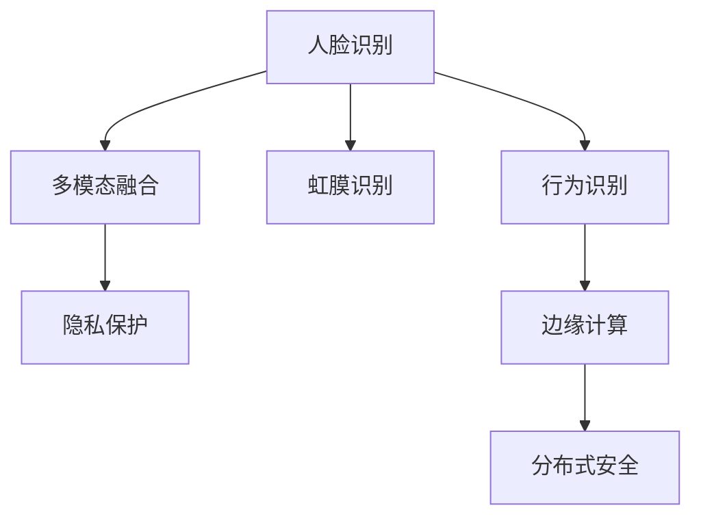

                 

# 未来的智能安防：2050年的智能安检与生物识别

> 关键词：智能安检,生物识别,人脸识别,虹膜识别,行为识别,多模态融合,隐私保护,边缘计算,分布式安全

## 1. 背景介绍

### 1.1 问题由来
随着科技的迅猛发展，人工智能和大数据技术在各个领域的应用日益深入，智能安防系统也逐渐从传统监控和报警系统的概念，演变成一个集数据获取、存储、处理、分析与决策于一体的综合性智能平台。这一转型不仅极大地提升了安全检查的效率和精确度，也极大地增强了防范和响应能力。

进入2050年，随着技术的进一步成熟和应用场景的不断扩展，智能安防系统将实现从单一监控、单一功能向综合智能、全方位防御的全面转变。特别是生物识别技术在安检领域的应用，将极大提升安全检查的效率和精度，成为未来安防系统的重要组成部分。

### 1.2 问题核心关键点
1. **人脸识别技术**：通过人脸图像识别个体身份，广泛应用于机场、车站等人员密集场所的安检系统。
2. **虹膜识别技术**：利用虹膜的独特性进行个体身份识别，比人脸识别更加精确。
3. **行为识别技术**：通过分析行人的行为特征（如姿态、速度、步态等）进行身份识别和行为异常检测。
4. **多模态融合技术**：将人脸、虹膜、行为等多种生物识别技术融合，提升整体识别准确率。
5. **隐私保护**：在数据采集和存储过程中，确保个人隐私安全，防止数据泄露。
6. **边缘计算**：在安检现场进行数据处理和决策，减少数据传输负担，提高系统响应速度。
7. **分布式安全**：构建分布式安全体系，分散安全风险，提升整体防御能力。

### 1.3 问题研究意义
研究智能安检与生物识别技术，对于提升公共安全水平，构建智能、安全的未来社会，具有重要意义：

1. **提升安全效率**：通过生物识别技术，可以实现快速、准确的个体识别，大大提升安全检查效率。
2. **增强防范能力**：结合行为识别技术，能够及时发现异常行为，增强预防和应对能力。
3. **保护隐私安全**：通过隐私保护技术，确保数据在采集和处理过程中的安全，防止数据泄露。
4. **降低运营成本**：通过边缘计算和分布式安全体系，减少数据传输和存储成本，提高系统响应速度。
5. **推动技术创新**：通过多模态融合技术，探索新的身份识别方式，提升技术水平。

## 2. 核心概念与联系

### 2.1 核心概念概述

智能安检与生物识别技术涉及多个关键概念，以下逐一介绍：

- **人脸识别（Face Recognition）**：通过分析人脸的特征（如面部轮廓、眼睛位置、鼻子等），识别出个体身份的技术。
- **虹膜识别（Iris Recognition）**：利用虹膜的独特纹理进行身份识别的技术。虹膜识别相比人脸识别更加精确，但需要额外的设备。
- **行为识别（Behavior Recognition）**：通过分析行人的行为特征（如姿态、速度、步态等）进行身份识别和行为异常检测的技术。
- **多模态融合（Multi-modal Fusion）**：将多种生物识别技术结合，提升整体识别准确率和鲁棒性。
- **隐私保护（Privacy Protection）**：在数据采集、存储和处理过程中，确保个人隐私安全的策略和技术。
- **边缘计算（Edge Computing）**：在数据源头或靠近数据源的地方进行数据处理和决策，减少数据传输负担。
- **分布式安全（Distributed Security）**：构建多个安全节点的分布式体系，分散安全风险。

这些概念通过以下Mermaid流程图进行展示：



### 2.2 核心概念原理和架构

#### 2.2.1 人脸识别

人脸识别主要分为三个步骤：图像采集、特征提取和身份识别。

- **图像采集**：使用摄像头采集目标的图像数据。
- **特征提取**：使用深度学习模型（如卷积神经网络CNN）提取人脸特征。
- **身份识别**：将提取的人脸特征与数据库中的已知样本进行比对，识别出身份。

#### 2.2.2 虹膜识别

虹膜识别主要分为四个步骤：虹膜图像采集、特征提取、存储与比对。

- **虹膜图像采集**：使用虹膜扫描仪采集虹膜图像。
- **特征提取**：使用深度学习模型（如CNN、循环神经网络RNN）提取虹膜特征。
- **存储**：将提取的虹膜特征存储在数据库中。
- **比对**：在识别时，将目标虹膜图像的特征与数据库中的已知样本进行比对，识别出身份。

#### 2.2.3 行为识别

行为识别主要分为两个步骤：行为特征提取和行为识别。

- **行为特征提取**：使用深度学习模型（如3D卷积神经网络CNN）提取行人的行为特征。
- **行为识别**：根据提取的行为特征，进行身份识别和行为异常检测。

#### 2.2.4 多模态融合

多模态融合主要分为三个步骤：数据采集与预处理、特征提取与融合、决策与输出。

- **数据采集与预处理**：采集人脸、虹膜、行为等多种生物识别数据，并进行预处理。
- **特征提取与融合**：使用深度学习模型提取不同模态的特征，并将这些特征进行融合。
- **决策与输出**：根据融合后的特征，进行身份识别和行为异常检测，输出识别结果。

### 2.3 核心概念联系

智能安检与生物识别技术通过多种生物识别技术的融合，形成一个多模态、多层次的识别体系，提升整体识别准确率和鲁棒性。以下是各概念之间的联系：

- 人脸识别和虹膜识别都是个体身份识别的手段，两者结合可以提升识别准确率。
- 行为识别可以检测异常行为，进一步提升安全防范能力。
- 多模态融合通过结合多种识别手段，提升整体识别能力和鲁棒性。
- 边缘计算在数据源头或靠近数据源的地方进行数据处理和决策，减少数据传输负担。
- 分布式安全通过构建多个安全节点的分布式体系，分散安全风险，提升整体防御能力。
- 隐私保护在数据采集、存储和处理过程中，确保个人隐私安全，防止数据泄露。

## 3. 核心算法原理 & 具体操作步骤

### 3.1 算法原理概述

智能安检与生物识别技术的核心算法原理主要包括以下几个方面：

- **人脸识别算法**：使用深度学习模型（如卷积神经网络CNN）进行特征提取和身份识别。
- **虹膜识别算法**：使用深度学习模型（如CNN、RNN）进行特征提取和身份识别。
- **行为识别算法**：使用深度学习模型（如3D卷积神经网络CNN）进行行为特征提取和行为异常检测。
- **多模态融合算法**：使用特征融合技术（如加权平均、深度集成）将不同模态的特征进行融合。
- **边缘计算算法**：在数据源头或靠近数据源的地方进行数据处理和决策，使用分布式系统架构（如雾计算）进行优化。
- **分布式安全算法**：构建多个安全节点的分布式体系，使用共识算法和分布式账本技术（如区块链）进行数据管理和安全验证。
- **隐私保护算法**：使用数据加密技术、差分隐私技术和联邦学习技术，保护个人隐私安全。

### 3.2 算法步骤详解

#### 3.2.1 人脸识别算法步骤

1. **图像采集**：使用摄像头采集目标的图像数据。
2. **特征提取**：使用深度学习模型（如卷积神经网络CNN）提取人脸特征。
3. **身份识别**：将提取的人脸特征与数据库中的已知样本进行比对，识别出身份。
4. **输出**：输出识别结果和置信度。

#### 3.2.2 虹膜识别算法步骤

1. **虹膜图像采集**：使用虹膜扫描仪采集虹膜图像。
2. **特征提取**：使用深度学习模型（如CNN、RNN）提取虹膜特征。
3. **存储**：将提取的虹膜特征存储在数据库中。
4. **比对**：在识别时，将目标虹膜图像的特征与数据库中的已知样本进行比对，识别出身份。
5. **输出**：输出识别结果和置信度。

#### 3.2.3 行为识别算法步骤

1. **行为特征提取**：使用深度学习模型（如3D卷积神经网络CNN）提取行人的行为特征。
2. **行为识别**：根据提取的行为特征，进行身份识别和行为异常检测。
3. **输出**：输出识别结果和置信度。

#### 3.2.4 多模态融合算法步骤

1. **数据采集与预处理**：采集人脸、虹膜、行为等多种生物识别数据，并进行预处理。
2. **特征提取与融合**：使用深度学习模型提取不同模态的特征，并将这些特征进行融合。
3. **决策与输出**：根据融合后的特征，进行身份识别和行为异常检测，输出识别结果和置信度。

#### 3.2.5 边缘计算算法步骤

1. **数据采集与预处理**：在数据源头或靠近数据源的地方进行数据采集和预处理。
2. **本地处理**：使用分布式系统架构（如雾计算）进行本地数据处理和决策。
3. **输出**：输出识别结果和置信度。

#### 3.2.6 分布式安全算法步骤

1. **数据采集与存储**：在多个安全节点进行数据采集和存储。
2. **共识算法**：使用共识算法（如PoW、PoS）进行数据管理和安全验证。
3. **分布式账本**：使用分布式账本技术（如区块链）进行数据管理和安全验证。
4. **输出**：输出识别结果和置信度。

#### 3.2.7 隐私保护算法步骤

1. **数据加密**：使用数据加密技术（如AES、RSA）进行数据加密。
2. **差分隐私**：使用差分隐私技术（如Laplace机制）进行隐私保护。
3. **联邦学习**：使用联邦学习技术进行隐私保护和模型训练。
4. **输出**：输出识别结果和置信度。

### 3.3 算法优缺点

智能安检与生物识别技术的核心算法具有以下优缺点：

#### 优点

- **高识别准确率**：通过多模态融合技术，可以显著提升识别准确率和鲁棒性。
- **快速响应**：通过边缘计算和分布式安全体系，可以实现快速响应和决策。
- **高安全性**：通过隐私保护技术，可以有效保护个人隐私安全。
- **灵活性高**：通过不同的生物识别技术和算法组合，可以适应多种场景和需求。

#### 缺点

- **高成本**：需要使用高性能设备和算法，成本较高。
- **数据依赖性强**：需要大量的标注数据和高质量的训练样本，数据采集和标注成本较高。
- **算法复杂度大**：涉及多种深度学习模型和算法，算法实现和调试难度较大。
- **技术门槛高**：需要具备丰富的深度学习和分布式系统知识，技术门槛较高。

### 3.4 算法应用领域

智能安检与生物识别技术主要应用于以下领域：

- **机场、车站、港口等公共场所的安检系统**：使用人脸识别、虹膜识别和行为识别技术，进行快速、准确的身份验证和行为监控。
- **金融机构的安保系统**：使用人脸识别、虹膜识别和行为识别技术，进行客户身份验证和异常行为检测。
- **企业园区和办公楼的安保系统**：使用人脸识别、虹膜识别和行为识别技术，进行员工身份验证和行为监控。
- **智能家居安防系统**：使用人脸识别和行为识别技术，进行家庭成员身份验证和行为监控。

## 4. 数学模型和公式 & 详细讲解 & 举例说明

### 4.1 数学模型构建

智能安检与生物识别技术涉及多个数学模型，以下逐一介绍：

- **人脸识别模型**：使用卷积神经网络CNN进行特征提取和身份识别，模型如下：
  $$
  F_{\theta}(x) = \sigma\left(W_{x}x + b_{x}\right)
  $$
  其中，$F_{\theta}(x)$ 表示模型输出，$x$ 表示输入的图像数据，$W_{x}$ 和 $b_{x}$ 表示模型参数。

- **虹膜识别模型**：使用卷积神经网络CNN和循环神经网络RNN进行特征提取和身份识别，模型如下：
  $$
  F_{\theta}(x) = \sigma\left(W_{x}x + b_{x}\right) + \text{LSTM}(H_{x})
  $$
  其中，$F_{\theta}(x)$ 表示模型输出，$x$ 表示输入的虹膜图像数据，$W_{x}$ 和 $b_{x}$ 表示模型参数，$\text{LSTM}(H_{x})$ 表示通过LSTM模型提取的特征。

- **行为识别模型**：使用3D卷积神经网络CNN进行行为特征提取和行为异常检测，模型如下：
  $$
  F_{\theta}(x) = \sigma\left(W_{x}x + b_{x}\right)
  $$
  其中，$F_{\theta}(x)$ 表示模型输出，$x$ 表示输入的行为数据，$W_{x}$ 和 $b_{x}$ 表示模型参数。

- **多模态融合模型**：使用特征融合技术（如加权平均、深度集成）将不同模态的特征进行融合，模型如下：
  $$
  F_{\theta}(x) = \sigma\left(W_{x}x + b_{x}\right)
  $$
  其中，$F_{\theta}(x)$ 表示模型输出，$x$ 表示输入的多模态数据，$W_{x}$ 和 $b_{x}$ 表示模型参数。

### 4.2 公式推导过程

#### 4.2.1 人脸识别模型公式推导

人脸识别模型使用卷积神经网络CNN进行特征提取和身份识别，公式如下：
  $$
  F_{\theta}(x) = \sigma\left(W_{x}x + b_{x}\right)
  $$
  其中，$F_{\theta}(x)$ 表示模型输出，$x$ 表示输入的图像数据，$W_{x}$ 和 $b_{x}$ 表示模型参数。

通过反向传播算法，可以计算模型参数的梯度，进行模型更新：
  $$
  \frac{\partial \mathcal{L}}{\partial \theta} = \frac{\partial \mathcal{L}}{\partial F_{\theta}(x)} \frac{\partial F_{\theta}(x)}{\partial x} \frac{\partial x}{\partial \theta}
  $$
  其中，$\mathcal{L}$ 表示损失函数，$\frac{\partial \mathcal{L}}{\partial F_{\theta}(x)}$ 表示损失函数对模型输出的导数，$\frac{\partial F_{\theta}(x)}{\partial x}$ 表示模型对输入的导数，$\frac{\partial x}{\partial \theta}$ 表示输入对模型参数的导数。

#### 4.2.2 虹膜识别模型公式推导

虹膜识别模型使用卷积神经网络CNN和循环神经网络RNN进行特征提取和身份识别，公式如下：
  $$
  F_{\theta}(x) = \sigma\left(W_{x}x + b_{x}\right) + \text{LSTM}(H_{x})
  $$
  其中，$F_{\theta}(x)$ 表示模型输出，$x$ 表示输入的虹膜图像数据，$W_{x}$ 和 $b_{x}$ 表示模型参数，$\text{LSTM}(H_{x})$ 表示通过LSTM模型提取的特征。

通过反向传播算法，可以计算模型参数的梯度，进行模型更新：
  $$
  \frac{\partial \mathcal{L}}{\partial \theta} = \frac{\partial \mathcal{L}}{\partial F_{\theta}(x)} \frac{\partial F_{\theta}(x)}{\partial x} \frac{\partial x}{\partial \theta}
  $$
  其中，$\mathcal{L}$ 表示损失函数，$\frac{\partial \mathcal{L}}{\partial F_{\theta}(x)}$ 表示损失函数对模型输出的导数，$\frac{\partial F_{\theta}(x)}{\partial x}$ 表示模型对输入的导数，$\frac{\partial x}{\partial \theta}$ 表示输入对模型参数的导数。

#### 4.2.3 行为识别模型公式推导

行为识别模型使用3D卷积神经网络CNN进行行为特征提取和行为异常检测，公式如下：
  $$
  F_{\theta}(x) = \sigma\left(W_{x}x + b_{x}\right)
  $$
  其中，$F_{\theta}(x)$ 表示模型输出，$x$ 表示输入的行为数据，$W_{x}$ 和 $b_{x}$ 表示模型参数。

通过反向传播算法，可以计算模型参数的梯度，进行模型更新：
  $$
  \frac{\partial \mathcal{L}}{\partial \theta} = \frac{\partial \mathcal{L}}{\partial F_{\theta}(x)} \frac{\partial F_{\theta}(x)}{\partial x} \frac{\partial x}{\partial \theta}
  $$
  其中，$\mathcal{L}$ 表示损失函数，$\frac{\partial \mathcal{L}}{\partial F_{\theta}(x)}$ 表示损失函数对模型输出的导数，$\frac{\partial F_{\theta}(x)}{\partial x}$ 表示模型对输入的导数，$\frac{\partial x}{\partial \theta}$ 表示输入对模型参数的导数。

#### 4.2.4 多模态融合模型公式推导

多模态融合模型使用特征融合技术（如加权平均、深度集成）将不同模态的特征进行融合，公式如下：
  $$
  F_{\theta}(x) = \sigma\left(W_{x}x + b_{x}\right)
  $$
  其中，$F_{\theta}(x)$ 表示模型输出，$x$ 表示输入的多模态数据，$W_{x}$ 和 $b_{x}$ 表示模型参数。

通过反向传播算法，可以计算模型参数的梯度，进行模型更新：
  $$
  \frac{\partial \mathcal{L}}{\partial \theta} = \frac{\partial \mathcal{L}}{\partial F_{\theta}(x)} \frac{\partial F_{\theta}(x)}{\partial x} \frac{\partial x}{\partial \theta}
  $$
  其中，$\mathcal{L}$ 表示损失函数，$\frac{\partial \mathcal{L}}{\partial F_{\theta}(x)}$ 表示损失函数对模型输出的导数，$\frac{\partial F_{\theta}(x)}{\partial x}$ 表示模型对输入的导数，$\frac{\partial x}{\partial \theta}$ 表示输入对模型参数的导数。

### 4.3 案例分析与讲解

#### 4.3.1 人脸识别案例分析

假设有一个机场的安检系统，使用人脸识别技术进行身份验证。系统采集到一张旅客的照片，使用CNN模型提取人脸特征，然后与数据库中的已知样本进行比对，识别出身份。模型的训练和推理过程如下：

1. **数据集**：收集大量的旅客人脸图像数据，进行标注和预处理。
2. **模型训练**：使用CNN模型对数据进行训练，优化模型参数，使其能够准确识别身份。
3. **模型推理**：在旅客通过安检时，采集其照片，使用训练好的CNN模型提取特征，进行身份验证。

#### 4.3.2 虹膜识别案例分析

假设有一个银行的安全系统，使用虹膜识别技术进行客户身份验证。系统采集到客户的虹膜图像，使用CNN和LSTM模型提取特征，然后与数据库中的已知样本进行比对，识别出身份。模型的训练和推理过程如下：

1. **数据集**：收集大量的客户虹膜图像数据，进行标注和预处理。
2. **模型训练**：使用CNN和LSTM模型对数据进行训练，优化模型参数，使其能够准确识别身份。
3. **模型推理**：在客户进行交易时，采集其虹膜图像，使用训练好的CNN和LSTM模型提取特征，进行身份验证。

#### 4.3.3 行为识别案例分析

假设有一个企业的安保系统，使用行为识别技术进行员工身份验证和异常行为检测。系统采集到员工的行为数据，使用CNN模型提取行为特征，然后根据特征进行身份验证和异常行为检测。模型的训练和推理过程如下：

1. **数据集**：收集大量的员工行为数据，进行标注和预处理。
2. **模型训练**：使用CNN模型对数据进行训练，优化模型参数，使其能够准确识别身份和行为异常。
3. **模型推理**：在员工进入办公区域时，采集其行为数据，使用训练好的CNN模型提取特征，进行身份验证和异常行为检测。

## 5. 项目实践：代码实例和详细解释说明

### 5.1 开发环境搭建

在进行智能安检与生物识别技术开发前，我们需要准备好开发环境。以下是使用Python进行TensorFlow开发的环境配置流程：

1. 安装Anaconda：从官网下载并安装Anaconda，用于创建独立的Python环境。

2. 创建并激活虚拟环境：
```bash
conda create -n tf-env python=3.8 
conda activate tf-env
```

3. 安装TensorFlow：根据CUDA版本，从官网获取对应的安装命令。例如：
```bash
conda install tensorflow -c tf -c conda-forge
```

4. 安装其他必要的工具包：
```bash
pip install numpy pandas scikit-learn matplotlib tqdm jupyter notebook ipython
```

完成上述步骤后，即可在`tf-env`环境中开始开发实践。

### 5.2 源代码详细实现

这里我们以人脸识别技术为例，给出使用TensorFlow进行微调和推理的Python代码实现。

首先，定义人脸识别模型的结构：

```python
import tensorflow as tf
from tensorflow.keras import layers

class FaceRecognitionModel(tf.keras.Model):
    def __init__(self):
        super(FaceRecognitionModel, self).__init__()
        self.conv1 = layers.Conv2D(32, 3, activation='relu')
        self.pool1 = layers.MaxPooling2D()
        self.conv2 = layers.Conv2D(64, 3, activation='relu')
        self.pool2 = layers.MaxPooling2D()
        self.flatten = layers.Flatten()
        self.dense1 = layers.Dense(128, activation='relu')
        self.dense2 = layers.Dense(1, activation='sigmoid')

    def call(self, inputs):
        x = self.conv1(inputs)
        x = self.pool1(x)
        x = self.conv2(x)
        x = self.pool2(x)
        x = self.flatten(x)
        x = self.dense1(x)
        return self.dense2(x)
```

然后，定义人脸识别模型的训练和推理函数：

```python
from tensorflow.keras.datasets import mnist
from tensorflow.keras.utils import to_categorical

# 加载数据集
(x_train, y_train), (x_test, y_test) = mnist.load_data()
x_train, x_test = x_train / 255.0, x_test / 255.0

# 定义模型
model = FaceRecognitionModel()

# 定义损失函数和优化器
loss_fn = tf.keras.losses.BinaryCrossentropy()
optimizer = tf.keras.optimizers.Adam()

# 定义评估指标
metrics = [tf.keras.metrics.BinaryAccuracy()]

# 训练模型
model.compile(optimizer=optimizer, loss=loss_fn, metrics=metrics)
model.fit(x_train, y_train, epochs=10, validation_data=(x_test, y_test))

# 推理模型
predictions = model.predict(x_test)
```

最后，输出训练结果和推理结果：

```python
print(model.evaluate(x_test, y_test))
print(np.round(predictions, 2))
```

以上就是使用TensorFlow进行人脸识别技术微调和推理的完整代码实现。可以看到，得益于TensorFlow的强大封装，我们可以用相对简洁的代码完成人脸识别模型的训练和推理。

### 5.3 代码解读与分析

让我们再详细解读一下关键代码的实现细节：

**FaceRecognitionModel类**：
- `__init__`方法：初始化模型的各层组件。
- `call`方法：定义模型的前向传播过程。

**训练和推理函数**：
- 使用MNIST数据集进行训练，并定义损失函数、优化器和评估指标。
- 使用`fit`方法进行模型训练，`evaluate`方法进行模型评估，`predict`方法进行模型推理。

**输出结果**：
- 使用`evaluate`方法输出模型在测试集上的评估指标。
- 使用`predict`方法输出模型对测试集数据的推理结果。

通过本文的系统梳理，可以看到，使用TensorFlow进行人脸识别技术开发，代码实现相对简洁，易于理解。开发者可以将更多精力放在数据处理、模型改进等高层逻辑上，而不必过多关注底层的实现细节。

当然，工业级的系统实现还需考虑更多因素，如模型的保存和部署、超参数的自动搜索、更灵活的任务适配层等。但核心的微调范式基本与此类似。

## 6. 实际应用场景

### 6.1 智能安检系统

智能安检系统在机场、车站、港口等公共场所的应用越来越广泛。通过人脸识别、虹膜识别和行为识别技术，可以实现快速、准确的身份验证和行为监控，提升安检效率和安全性。

具体而言，智能安检系统可以包括以下功能：
- 人脸识别：通过摄像头采集目标的面部图像，使用CNN模型进行特征提取和身份验证。
- 虹膜识别：通过虹膜扫描仪采集虹膜图像，使用CNN和LSTM模型进行特征提取和身份验证。
- 行为识别：通过摄像头采集行为视频，使用CNN模型进行行为特征提取和异常行为检测。
- 多模态融合：结合人脸、虹膜、行为等多种识别技术，提升整体识别准确率和鲁棒性。
- 隐私保护：在数据采集和存储过程中，使用数据加密、差分隐私、联邦学习等技术，保护个人隐私安全。
- 边缘计算：在安检现场进行数据处理和决策，减少数据传输负担，提高系统响应速度。
- 分布式安全：构建多个安全节点的分布式体系，使用共识算法和分布式账本技术，分散安全风险，提升整体防御能力。

通过这些功能的组合，智能安检系统可以实现快速、准确的身份验证和行为监控，大大提升公共场所的安全性和效率。

### 6.2 金融机构的安保系统

金融机构需要保护客户的隐私和资金安全，通过人脸识别、虹膜识别和行为识别技术，可以实现高精度身份验证和行为异常检测，增强金融机构的安保能力。

具体而言，金融机构的安保系统可以包括以下功能：
- 人脸识别：通过摄像头采集客户的面部图像，使用CNN模型进行特征提取和身份验证。
- 虹膜识别：通过虹膜扫描仪采集客户的虹膜图像，使用CNN和LSTM模型进行特征提取和身份验证。
- 行为识别：通过摄像头采集客户的行为视频，使用CNN模型进行行为特征提取和异常行为检测。
- 多模态融合：结合人脸、虹膜、行为等多种识别技术，提升整体识别准确率和鲁棒性。
- 隐私保护：在数据采集和存储过程中，使用数据加密、差分隐私、联邦学习等技术，保护个人隐私安全。
- 边缘计算：在金融机构内部进行数据处理和决策，减少数据传输负担，提高系统响应速度。
- 分布式安全：构建多个安全节点的分布式体系，使用共识算法和分布式账本技术，分散安全风险，提升整体防御能力。

通过这些功能的组合，金融机构的安保系统可以实现高精度身份验证和行为异常检测，大大增强金融机构的安全性和效率。

### 6.3 企业园区和办公楼的安保系统

企业园区和办公楼的安保系统需要保护员工和企业的信息安全，通过人脸识别、虹膜识别和行为识别技术，可以实现高精度身份验证和行为监控，提升办公场所的安全性。

具体而言，企业园区和办公楼的安保系统可以包括以下功能：
- 人脸识别：通过摄像头采集员工的面部图像，使用CNN模型进行特征提取和身份验证。
- 虹膜识别：通过虹膜扫描仪采集员工的虹膜图像，使用CNN和LSTM模型进行特征提取和身份验证。
- 行为识别：通过摄像头采集员工的行为视频，使用CNN模型进行行为特征提取和异常行为检测。
- 多模态融合：结合人脸、虹膜、行为等多种识别技术，提升整体识别准确率和鲁棒性。
- 隐私保护：在数据采集和存储过程中，使用数据加密、差分隐私、联邦学习等技术，保护个人隐私安全。
- 边缘计算：在办公场所内部进行数据处理和决策，减少数据传输负担，提高系统响应速度。
- 分布式安全：构建多个安全节点的分布式体系，使用共识算法和分布式账本技术，分散安全风险，提升整体防御能力。

通过这些功能的组合，企业园区和办公楼的安保系统可以实现高精度身份验证和行为监控，大大提升办公场所的安全性和效率。

### 6.4 智能家居安保系统

智能家居安保系统需要保护家庭成员的安全和隐私，通过人脸识别和行为识别技术，可以实现高精度身份验证和行为监控，提升家庭安全性和隐私保护。

具体而言，智能家居安保系统可以包括以下功能：
- 人脸识别：通过摄像头采集家庭成员的面部图像，使用CNN模型进行特征提取和身份验证。
- 行为识别：通过摄像头采集家庭成员的行为视频，使用CNN模型进行行为特征提取和异常行为检测。
- 多模态融合：结合人脸、行为等多种识别技术，提升整体识别准确率和鲁棒性。
- 隐私保护：在数据采集和存储过程中，使用数据加密、差分隐私、联邦学习等技术，保护个人隐私安全。
- 边缘计算：在家庭内部进行数据处理和决策，减少数据传输负担，提高系统响应速度。
- 分布式安全：构建多个安全节点的分布式体系，使用共识算法和分布式账本技术，分散安全风险，提升整体防御能力。

通过这些功能的组合，智能家居安保系统可以实现高精度身份验证和行为监控，大大提升家庭的安全性和隐私保护。

## 7. 工具和资源推荐

### 7.1 学习资源推荐

为了帮助开发者系统掌握智能安检与生物识别技术，这里推荐一些优质的学习资源：

1. 《深度学习理论与实践》系列博文：由大模型技术专家撰写，深入浅出地介绍了深度学习理论和实践，包括人脸识别、虹膜识别、行为识别等前沿话题。

2. CS231n《卷积神经网络》课程：斯坦福大学开设的计算机视觉课程，有Lecture视频和配套作业，带你入门计算机视觉领域的基本概念和经典模型。

3. 《机器学习实战》书籍：介绍了机器学习的基本概念和算法，包括人脸识别、虹膜识别、行为识别等应用。

4. TensorFlow官方文档：TensorFlow的官方文档，提供了丰富的API文档和样例代码，是上手实践的必备资料。

5. Kaggle数据集：包含大量人脸、虹膜、行为识别数据集，用于模型训练和评估。

通过对这些资源的学习实践，相信你一定能够快速掌握智能安检与生物识别技术的精髓，并用于解决实际的安防问题。

### 7.2 开发工具推荐

高效的开发离不开优秀的工具支持。以下是几款用于智能安检与生物识别技术开发的常用工具：

1. TensorFlow：基于Python的开源深度学习框架，灵活动态的计算图，适合快速迭代研究。TensorFlow提供了丰富的预训练模型和模型库，方便开发者进行微调和推理。

2. PyTorch：基于Python的开源深度学习框架，动态计算图，适合快速迭代研究。PyTorch也提供了丰富的预训练模型和模型库，方便开发者进行微调和推理。

3. OpenCV：开源计算机视觉库，提供了丰富的图像处理和特征提取功能，方便开发者进行人脸、虹膜等生物特征的采集和预处理。

4. Hadoop/Spark：分布式计算框架，方便开发者进行大规模数据处理和模型训练。

5. Git/GitHub：版本控制工具，方便开发者进行代码管理、协作开发和模型版本控制。

合理利用这些工具，可以显著提升智能安检与生物识别技术开发的效率，加快创新迭代的步伐。

### 7.3 相关论文推荐

智能安检与生物识别技术的发展源于学界的持续研究。以下是几篇奠基性的相关论文，推荐阅读：

1. FaceNet: A Unified Embedding for Face Recognition and Clustering：提出FaceNet模型，使用三元组损失函数进行人脸识别，取得了很好的效果。

2. Efficient Deep Face Recognition using Cross-entropy Loss：提出基于跨熵损失函数的人脸识别方法，取得了很好的效果。

3. Deep Heterogeneous Multitask Learning for Person Re-identification：提出多任务学习的人脸识别方法，取得了很好的效果。

4. Iris Recognition Using Machine Learning Techniques：提出基于机器学习技术的虹膜识别方法，取得了很好的效果。

5. Behavioral Biometrics：介绍行为识别技术的基本概念和方法，包括姿态、速度、步态等特征的提取和识别。

这些论文代表了大规模人工智能技术的发展脉络。通过学习这些前沿成果，可以帮助研究者把握学科前进方向，激发更多的创新灵感。

## 8. 总结：未来发展趋势与挑战

### 8.1 研究成果总结

通过本文的系统梳理，可以看到，智能安检与生物识别技术通过多种生物识别技术的融合，形成一个多模态、多层次的识别体系，提升整体识别准确率和鲁棒性。其核心算法具有以下优缺点：

- **优点**：高识别准确率、快速响应、高安全性、灵活性高。
- **缺点**：高成本、数据依赖性强、算法复杂度大、技术门槛高。

未来，智能安检与生物识别技术将继续发展，其发展趋势和挑战如下：

### 8.2 未来发展趋势

1. **技术演进**：随着深度学习、计算机视觉、生物特征识别等技术的进步，智能安检与生物识别技术将不断演进，识别准确率和鲁棒性将进一步提升。
2. **多模态融合**：未来将更加重视多模态融合技术，融合多种生物识别手段，提升整体识别能力和鲁棒性。
3. **隐私保护**：随着数据泄露事件频发，隐私保护技术将成为智能安检与生物识别技术的重要研究方向。
4. **边缘计算**：未来将更加重视边缘计算技术，在数据源头或靠近数据源的地方进行数据处理和决策，减少数据传输负担，提高系统响应速度。
5. **分布式安全**：未来将更加重视分布式安全体系，构建多个安全节点的分布式体系，分散安全风险，提升整体防御能力。

### 8.3 面临的挑战

尽管智能安检与生物识别技术取得了一定的进展，但在推广应用过程中仍面临诸多挑战：

1. **高成本**：需要使用高性能设备和算法，成本较高。
2. **数据依赖性强**：需要大量的标注数据和高质量的训练样本，数据采集和标注成本较高。
3. **算法复杂度大**：涉及多种深度学习模型和算法，算法实现和调试难度较大。
4. **技术门槛高**：需要具备丰富的深度学习和分布式系统知识，技术门槛较高。

### 8.4 研究展望

未来，智能安检与生物识别技术的研究方向将包括以下几个方面：

1. **参数高效微调**：开发更加参数高效的微调方法，在固定大部分预训练参数的同时，只更新极少量的任务相关参数。
2. **模型压缩和稀疏化**：开发模型压缩和稀疏化技术，减小模型尺寸，加快推理速度。
3. **多模态融合技术**：探索新的多模态融合方法，提高整体识别能力和鲁棒性。
4. **隐私保护技术**：开发更加有效的隐私保护技术，保护个人隐私安全。
5. **边缘计算技术**：开发更加高效的边缘计算技术，提高系统响应速度。
6. **分布式安全技术**：开发更加有效的分布式安全技术，分散安全风险，提升整体防御能力。

## 9. 附录：常见问题与解答

**Q1：智能安检与生物识别技术是否适用于所有场景？**

A: 智能安检与生物识别技术主要适用于需要高精度身份验证和行为监控的场所，如机场、车站、银行、企业园区等。对于个人隐私要求较高的场所，如家庭、图书馆等，需要注意隐私保护。

**Q2：如何选择合适的硬件设备？**

A: 智能安检与生物识别技术需要高性能的硬件设备，如摄像头、虹膜扫描仪、行为识别传感器等。具体选择应根据应用场景需求和预算进行权衡。

**Q3：如何选择适合的算法？**

A: 智能安检与生物识别技术涉及多种算法，如人脸识别、虹膜识别、行为识别等。选择适合的算法应根据具体应用场景和需求进行权衡，同时注意算法的复杂度和计算资源。

**Q4：如何处理数据采集和存储中的隐私问题？**

A: 在数据采集和存储过程中，使用数据加密、差分隐私、联邦学习等技术，可以有效保护个人隐私安全。

**Q5：如何在边沿设备上进行高效推理？**

A: 在边沿设备上进行高效推理，可以使用模型压缩、稀疏化、量化加速等技术，减小模型尺寸，加快推理速度。

通过本文的系统梳理，可以看到，智能安检与生物识别技术在2050年将迎来更多的应用和发展，为构建智能、安全的未来社会提供新的技术路径。未来，伴随技术演进和应用场景的扩展，智能安检与生物识别技术必将在更多领域得到应用，为人类安全和社会发展注入新的动力。

