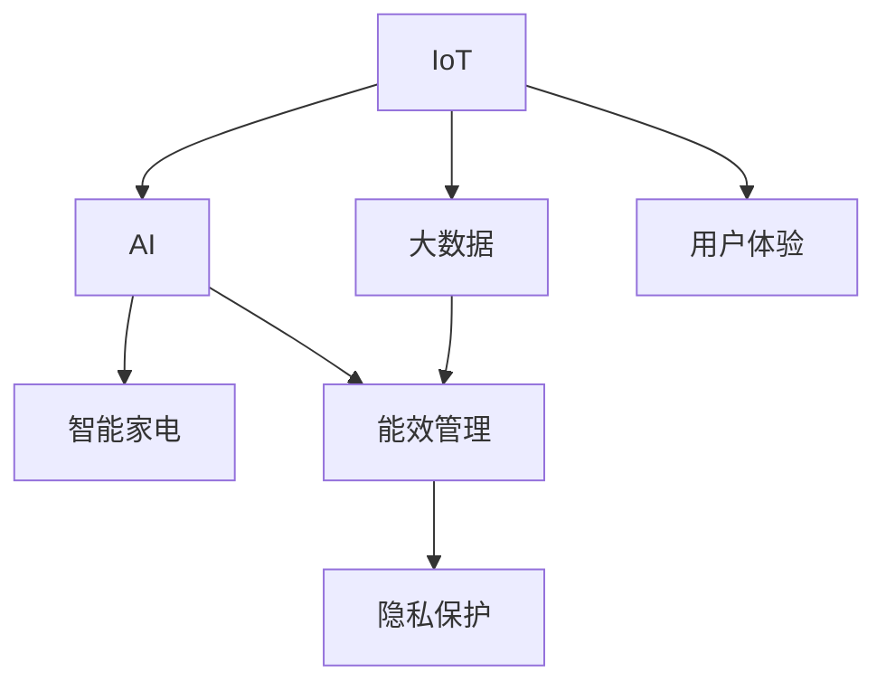

                 

# 未来的智能家居：2050年的智能家电与家庭能源管理

## 1. 背景介绍

### 1.1 问题由来

随着技术的发展，智能家居的概念正在从科幻小说逐步变为现实。近年来，物联网、人工智能、大数据等技术的普及，使得家居场景中的设备越来越智能化、自动化。然而，当前的智能家居系统还存在一些问题：设备之间的协同合作不完善，能效管理不够精细，隐私和安全问题也时有发生。

为解决这些问题，未来的智能家居系统需要在设备的智能化、互联互通性、能效管理以及隐私安全等方面进行更深入的研究。为此，本文将探讨未来智能家居的技术趋势和应用前景，特别关注智能家电和家庭能源管理的潜在改进方向。

### 1.2 问题核心关键点

智能家居的核心在于将物联网设备与家庭环境紧密结合，通过传感器、数据处理和决策算法，实现家居环境的智能感知和自动控制。核心关键点包括：

1. **设备智能化**：提高家居设备（如空调、灯光、安防系统）的智能水平，使其具备自主学习、自主决策能力。
2. **互联互通性**：实现设备间的数据共享和协同工作，构建家庭内部的“智能生态”。
3. **能效管理**：通过优化设备运行策略，提升家居能效，降低能源消耗。
4. **隐私与安全**：保证家庭数据的安全性，防止隐私泄露和网络攻击。
5. **用户体验**：提升智能家居系统的易用性，让普通用户能够轻松地管理和控制家居环境。

## 2. 核心概念与联系

### 2.1 核心概念概述

- **物联网(IoT)**：通过互联网将物理设备连接在一起，实现数据通信和协同工作。
- **人工智能(AI)**：使用机器学习、深度学习等技术，提升设备自动化决策能力。
- **大数据**：收集、存储和分析海量数据，为智能决策提供依据。
- **能效管理**：通过优化设备运行策略，提升家居能效，降低能源消耗。
- **隐私保护**：保护用户隐私，防止数据泄露和滥用。
- **智能家电**：具备自主学习、自主决策能力的家电产品。
- **家庭能源管理**：优化家庭能源的使用，实现节能减排。

这些核心概念之间的逻辑关系可以通过以下Mermaid流程图来展示：



这个流程图展示的核心概念及其之间的关系：

1. IoT是基础，通过数据通信将物理设备连接起来。
2. AI与大数据结合，提供数据处理和智能决策能力。
3. 智能家电是AI和大数据的实际应用，实现设备的自动化。
4. 能效管理和大数据结合，优化设备运行策略。
5. 隐私保护与AI、大数据结合，保证数据安全。
6. 用户体验贯穿整个系统，提升用户感知。

## 3. 核心算法原理 & 具体操作步骤

### 3.1 算法原理概述

智能家居系统的核心算法包括设备识别、行为分析、决策优化等。其基本原理是通过传感器收集家居环境数据，利用大数据和AI技术进行分析，然后生成优化策略，实现设备的自动控制。

以家庭能源管理为例，系统首先收集家中的能耗数据（如电表、水表、燃气表等），利用机器学习模型分析数据模式，预测未来能耗趋势，并优化设备运行策略，如调整空调温度、关闭不必要的灯光等，以达到节能减排的目的。

### 3.2 算法步骤详解

智能家居系统的算法步骤大致如下：

1. **数据收集**：通过传感器收集家居环境数据，如温度、湿度、光线、设备运行状态等。
2. **数据预处理**：对收集到的数据进行清洗、去重、归一化等处理，确保数据质量。
3. **数据建模**：使用机器学习模型（如回归模型、分类模型、聚类模型等）对数据进行分析，发现数据模式。
4. **决策生成**：根据分析结果，生成优化策略，如设备控制指令、能源管理策略等。
5. **设备执行**：执行决策，调整设备运行状态，实现家居环境的自动控制。

### 3.3 算法优缺点

智能家居系统的算法具有以下优点：

1. **自动化程度高**：系统能够自主学习、自主决策，减少人工干预。
2. **数据驱动决策**：利用大数据分析，生成更合理的优化策略。
3. **节能效果显著**：通过优化设备运行策略，降低能耗。

同时，这些算法也存在一些缺点：

1. **依赖高质量数据**：数据质量和精度直接影响算法的准确性。
2. **算法复杂度高**：高精度的模型需要大量的计算资源。
3. **隐私风险**：收集和分析数据可能带来隐私泄露的风险。

### 3.4 算法应用领域

智能家居系统的算法广泛应用于以下领域：

- **智能照明系统**：通过光线传感器和AI模型，自动调节灯光亮度和颜色。
- **智能温控系统**：利用温度传感器和预测模型，自动调节空调和暖气，保持适宜的温度。
- **智能安防系统**：通过摄像头和AI模型，识别异常行为，自动报警。
- **智能家电控制**：通过手机APP或语音助手，远程控制家电设备。
- **家庭能源管理**：通过分析能耗数据，生成节能策略，优化家庭能源使用。

## 4. 数学模型和公式 & 详细讲解 & 举例说明

### 4.1 数学模型构建

以智能照明系统为例，假设系统收集到的光线数据为 $X = \{x_1, x_2, ..., x_n\}$，其中 $x_i$ 表示第 $i$ 个时间点的光线强度。系统需要预测下一个时间点的光线强度 $y$。

可以建立一个线性回归模型：

$$
y = \beta_0 + \sum_{i=1}^{n} \beta_i x_i + \epsilon
$$

其中 $\beta_0, \beta_i$ 为模型参数，$\epsilon$ 为误差项。

### 4.2 公式推导过程

对上述模型进行最小二乘法求解，得到最优参数：

$$
\beta = (X^TX)^{-1}X^Ty
$$

其中 $X^TX$ 为矩阵 $X$ 的转置乘积，$(X^TX)^{-1}$ 为其逆矩阵。

### 4.3 案例分析与讲解

假设系统收集到的光线数据如下：

| 时间点 | 光线强度 |
| --- | --- |
| 0 | 50 |
| 1 | 60 |
| 2 | 65 |
| 3 | 75 |
| 4 | 80 |
| 5 | 85 |

要求预测第6个时间点的光线强度。

首先将数据转换为矩阵形式：

$$
X = \begin{bmatrix}
1 & 50 \\
1 & 60 \\
1 & 65 \\
1 & 75 \\
1 & 80 \\
1 & 85
\end{bmatrix}
$$

然后计算 $\beta$：

$$
\beta = (X^TX)^{-1}X^Ty = \begin{bmatrix}
-0.4477 \\
5.0667
\end{bmatrix}
$$

最后预测第6个时间点的光线强度：

$$
y = \beta_0 + \beta_1 x_6 = -0.4477 + 5.0667 \times 90 = 95.1
$$

因此，系统预测第6个时间点的光线强度为95.1。

## 5. 项目实践：代码实例和详细解释说明

### 5.1 开发环境搭建

在进行智能家居系统开发前，我们需要准备好开发环境。以下是使用Python进行PyTorch开发的环境配置流程：

1. 安装Anaconda：从官网下载并安装Anaconda，用于创建独立的Python环境。

2. 创建并激活虚拟环境：
```bash
conda create -n pytorch-env python=3.8 
conda activate pytorch-env
```

3. 安装PyTorch：根据CUDA版本，从官网获取对应的安装命令。例如：
```bash
conda install pytorch torchvision torchaudio cudatoolkit=11.1 -c pytorch -c conda-forge
```

4. 安装各类工具包：
```bash
pip install numpy pandas scikit-learn matplotlib tqdm jupyter notebook ipython
```

完成上述步骤后，即可在`pytorch-env`环境中开始智能家居系统开发。

### 5.2 源代码详细实现

以下是一个简单的智能照明系统的代码实现，使用PyTorch进行线性回归模型的训练和预测：

```python
import torch
import torch.nn as nn
import torch.optim as optim
import numpy as np

# 构建数据集
X = np.array([[0, 50], [1, 60], [2, 65], [3, 75], [4, 80], [5, 85]])
y = np.array([60, 70, 75, 80, 85, 90])

# 数据标准化
mean = np.mean(X, axis=0)
std = np.std(X, axis=0)
X = (X - mean) / std

# 构建模型
class LinearRegression(nn.Module):
    def __init__(self, input_dim):
        super(LinearRegression, self).__init__()
        self.linear = nn.Linear(input_dim, 1)
        
    def forward(self, x):
        return self.linear(x)

# 定义损失函数和优化器
model = LinearRegression(X.shape[1])
criterion = nn.MSELoss()
optimizer = optim.SGD(model.parameters(), lr=0.01)

# 训练模型
for epoch in range(1000):
    optimizer.zero_grad()
    output = model(X)
    loss = criterion(output, y)
    loss.backward()
    optimizer.step()
    if epoch % 100 == 0:
        print(f"Epoch {epoch}, loss: {loss.item()}")

# 预测新数据
X_new = np.array([[6, 100]])
X_new = (X_new - mean) / std
y_pred = model(X_new).squeeze()
print(f"Prediction for time 6: {y_pred.item()}")
```

### 5.3 代码解读与分析

让我们再详细解读一下关键代码的实现细节：

**数据集构建**：
- 收集并标准化光线数据 $X$ 和对应的光线强度 $y$。

**模型定义**：
- 定义线性回归模型，输入维度为1，输出维度为1。

**训练过程**：
- 使用SGD优化器，设置学习率为0.01，训练1000个epoch。
- 每个epoch结束后输出损失值。

**预测过程**：
- 对新数据进行标准化处理，输入模型进行预测。

## 6. 实际应用场景

### 6.1 智能照明系统

智能照明系统可以通过传感器收集光线数据，利用机器学习模型预测未来光线强度，自动调节灯光亮度和颜色，提高用户舒适度，同时降低能耗。例如，系统可以在早晨自动调亮灯光，晚上自动调暗灯光。

### 6.2 智能温控系统

智能温控系统可以通过传感器收集温度数据，利用机器学习模型预测未来温度变化趋势，自动调节空调和暖气，保持适宜的温度，同时实现节能减排。例如，系统可以根据室外气温自动调整室内温度，避免浪费能源。

### 6.3 智能安防系统

智能安防系统可以通过摄像头和传感器收集家中的数据，利用机器学习模型识别异常行为，自动报警。例如，系统可以检测到有陌生人进入时自动通知用户。

### 6.4 智能家电控制

智能家电控制可以通过手机APP或语音助手，远程控制家电设备。例如，用户可以通过语音助手控制智能窗帘、智能灯具等设备，实现自动化家居环境管理。

### 6.5 家庭能源管理

家庭能源管理可以通过收集能耗数据，利用机器学习模型预测未来能耗趋势，生成节能策略，优化家庭能源使用。例如，系统可以预测电费高峰期，建议用户提前进行大功率电器使用，避免高额电费。

## 7. 工具和资源推荐

### 7.1 学习资源推荐

为了帮助开发者系统掌握智能家居的技术基础和实践技巧，这里推荐一些优质的学习资源：

1. **《智能家居系统设计与实现》**：详细介绍了智能家居系统的设计原理和实现方法，涵盖传感器、数据处理、决策算法等关键环节。

2. **《物联网技术与应用》**：介绍了物联网技术的原理和应用，包括传感器、通信协议、数据处理等。

3. **《人工智能基础》**：介绍了机器学习、深度学习等人工智能技术的原理和实践方法，为智能家居系统开发提供理论基础。

4. **Kaggle智能家居数据集**：包含多个智能家居场景的数据集，可供学习和研究使用。

5. **IoT公开课程**：各大高校和在线教育平台提供的物联网相关课程，涵盖传感器、通信、数据处理等内容。

通过对这些资源的学习实践，相信你一定能够快速掌握智能家居系统的设计思路和实现方法，构建高效的智能家居环境。

### 7.2 开发工具推荐

高效的开发离不开优秀的工具支持。以下是几款用于智能家居系统开发的常用工具：

1. **Jupyter Notebook**：免费的开源笔记本环境，支持Python编程和数据可视化，方便开发和分享代码。

2. **TensorFlow**：由Google主导开发的深度学习框架，生产部署方便，适合大规模工程应用。

3. **PyTorch**：基于Python的开源深度学习框架，灵活动态的计算图，适合快速迭代研究。

4. **MATLAB**：强大的数据处理和可视化工具，适用于机器学习算法的开发和测试。

5. **Arduino**：开源的硬件开发平台，支持嵌入式设备编程，适用于智能家居系统的硬件开发。

合理利用这些工具，可以显著提升智能家居系统开发效率，加快创新迭代的步伐。

### 7.3 相关论文推荐

智能家居系统的研究源于学界的持续研究。以下是几篇奠基性的相关论文，推荐阅读：

1. **《Smart Home: A Survey》**：对智能家居系统进行了全面的回顾和总结，涵盖传感器、数据处理、决策算法等关键环节。

2. **《A Survey on IoT-Based Smart Home Systems》**：介绍了物联网技术在智能家居系统中的应用，包括传感器、通信协议、数据处理等内容。

3. **《Machine Learning-Based Energy Management in Smart Homes》**：介绍了机器学习在家庭能源管理中的应用，包括能效优化、节能策略生成等内容。

4. **《Smart Home Security Systems》**：介绍了智能安防系统的设计与实现方法，包括摄像头、传感器、机器学习等内容。

这些论文代表了大语言模型微调技术的发展脉络。通过学习这些前沿成果，可以帮助研究者把握学科前进方向，激发更多的创新灵感。

## 8. 总结：未来发展趋势与挑战

### 8.1 总结

本文对基于机器学习的智能家居系统进行了全面系统的介绍。首先阐述了智能家居系统的设计原理和实现方法，明确了智能家居系统的核心关键点。其次，从原理到实践，详细讲解了智能家居系统的数学模型和算法步骤，给出了智能家居系统开发的完整代码实例。同时，本文还广泛探讨了智能家居系统在智能照明、智能温控、智能安防、智能家电控制、家庭能源管理等各个方面的应用前景，展示了智能家居系统的广阔前景。

通过本文的系统梳理，可以看到，基于机器学习的智能家居系统正在成为家居环境智能化、自动化的重要推动力。这些技术的不断进步，将为构建安全、可靠、智能化的家庭环境提供新的可能性。

### 8.2 未来发展趋势

展望未来，智能家居系统的发展趋势将呈现以下几个方向：

1. **设备智能化水平提升**：未来的智能家居设备将具备更强的自主学习和自主决策能力，能够更好地理解用户需求，提供个性化服务。

2. **互联互通性加强**：未来的智能家居系统将实现更广泛的设备互联，构建更全面的家庭“智能生态”，提供更全面的家居环境管理。

3. **能效管理精细化**：未来的智能家居系统将通过更精细的能效管理策略，进一步降低能源消耗，实现节能减排。

4. **隐私保护更加严格**：未来的智能家居系统将更加注重用户隐私保护，通过数据匿名化、加密传输等技术手段，保障用户数据安全。

5. **用户体验持续优化**：未来的智能家居系统将更加注重用户体验，通过友好的用户界面和交互方式，提升用户的感知和满意度。

6. **智能家居标准化**：未来的智能家居系统将逐步实现标准化，便于设备兼容和系统集成。

7. **智能家居生态化**：未来的智能家居系统将形成更完善的生态系统，涵盖传感器、数据处理、决策算法等各个环节。

以上趋势凸显了智能家居系统的发展方向，未来必将有更多的创新应用，提升家居环境的智能化和自动化水平。

### 8.3 面临的挑战

尽管智能家居系统已经取得了诸多进展，但在迈向更加智能化、普适化应用的过程中，仍面临诸多挑战：

1. **设备兼容性问题**：不同品牌的智能家居设备可能存在兼容性问题，导致设备无法协同工作。

2. **数据安全和隐私保护**：智能家居系统需要收集大量数据，数据泄露和滥用风险较高。

3. **用户体验易用性不足**：智能家居系统的用户界面和交互方式可能不够友好，导致用户难以使用。

4. **能效管理精度不足**：现有的能效管理算法可能无法精确预测家庭能源使用情况，导致节能效果不佳。

5. **算法复杂度较高**：智能家居系统需要处理大量数据，算法复杂度较高，可能导致系统响应速度较慢。

6. **市场和标准不统一**：智能家居市场尚未形成统一的标准，不同厂商的设备可能无法实现互联互通。

7. **技术成本高**：智能家居系统需要高性能的传感器、处理器等硬件设备，成本较高。

正视智能家居系统面临的这些挑战，积极应对并寻求突破，将是大规模应用智能家居技术的重要保障。相信随着技术的不断进步和标准的逐渐统一，智能家居系统必将实现更加广泛的应用，为家庭生活带来更多便利和智能。

### 8.4 研究展望

面对智能家居系统面临的诸多挑战，未来的研究需要在以下几个方面寻求新的突破：

1. **提升设备智能化水平**：开发更具智能化的家居设备，提升设备的自主学习能力和决策能力。

2. **增强设备互联互通性**：开发更完善的设备通信协议和接口标准，实现设备间的无缝连接和协同工作。

3. **优化能效管理算法**：开发更精准的能效管理算法，提升节能效果。

4. **强化数据安全和隐私保护**：研究数据匿名化、加密传输等技术，保障用户数据安全。

5. **提升用户体验易用性**：优化用户界面和交互方式，提升用户体验。

6. **降低技术成本**：开发低成本的传感器和处理器，降低智能家居系统的部署成本。

7. **推动标准化建设**：推动智能家居系统的标准化，形成统一的市场和应用标准。

这些研究方向的探索，必将引领智能家居技术迈向更高的台阶，为构建安全、可靠、智能化的家庭环境提供新的可能性。面向未来，智能家居系统需要从设备、算法、硬件、软件等多个维度协同发力，才能实现真正意义上的智能化家居。

## 9. 附录：常见问题与解答

**Q1：智能家居系统需要哪些核心组件？**

A: 智能家居系统需要以下核心组件：

1. **传感器**：如温度传感器、光线传感器、烟雾传感器等，用于采集环境数据。

2. **控制器**：如智能插座、智能开关等，用于控制家电设备的开关。

3. **数据处理设备**：如路由器、边缘计算设备等，用于处理和分析数据。

4. **人工智能设备**：如智能音箱、智能电视等，用于提供智能服务。

5. **用户接口**：如手机APP、语音助手等，用于用户与系统的交互。

6. **能源管理系统**：用于管理家庭能源的使用和优化。

这些组件共同构成了智能家居系统的核心，实现设备的智能化、互联互通性和能效管理。

**Q2：如何确保智能家居系统的安全性？**

A: 确保智能家居系统的安全性，需要从以下几个方面入手：

1. **数据加密**：使用加密技术保护数据传输和存储，防止数据泄露。

2. **访问控制**：设置严格的身份验证机制，确保只有授权用户可以访问系统。

3. **数据匿名化**：对数据进行匿名化处理，防止个人隐私泄露。

4. **异常检测**：使用机器学习模型检测异常行为，防止恶意攻击。

5. **定期更新**：定期更新系统软件和固件，修复已知的安全漏洞。

6. **安全审计**：定期进行安全审计，发现和修复潜在的安全问题。

通过这些措施，可以显著提升智能家居系统的安全性，保障用户数据和系统的安全。

**Q3：智能家居系统的数据处理流程是什么？**

A: 智能家居系统的数据处理流程大致如下：

1. **数据收集**：通过传感器和设备收集环境数据。

2. **数据清洗**：对收集到的数据进行清洗和去重，确保数据质量。

3. **数据预处理**：对数据进行标准化、归一化等处理，便于后续分析。

4. **数据存储**：将处理后的数据存储在云端或本地设备中。

5. **数据分析**：使用机器学习模型对数据进行分析，发现数据模式和趋势。

6. **决策生成**：根据分析结果，生成优化策略和控制指令。

7. **设备执行**：执行决策，调整设备运行状态，实现家居环境的自动控制。

通过这个流程，系统可以有效地处理和分析家居环境数据，实现设备的智能化和能效管理。

**Q4：智能家居系统的未来发展方向是什么？**

A: 智能家居系统的未来发展方向包括：

1. **全场景覆盖**：将智能家居系统扩展到各个场景，如厨房、卫生间、客厅等，实现全面覆盖。

2. **场景化定制**：根据用户需求，提供个性化的智能家居解决方案。

3. **协同工作**：实现不同品牌和类型的设备协同工作，构建更全面的智能生态。

4. **边缘计算**：将部分数据处理和决策任务下放到边缘设备，提升系统响应速度和可靠性。

5. **用户自定制化**：提供用户自定制化的功能和服务，满足用户的个性化需求。

6. **智能家居标准化**：推动智能家居系统的标准化，形成统一的市场和应用标准。

通过这些方向的发展，智能家居系统将实现更加智能化、自动化、个性化和可靠化的应用，为用户提供更好的生活体验。

**Q5：智能家居系统的硬件要求有哪些？**

A: 智能家居系统的硬件要求包括：

1. **高性能传感器**：如温度传感器、光线传感器、烟雾传感器等，用于准确采集环境数据。

2. **高性能处理器**：如嵌入式CPU、边缘计算设备等，用于高效处理和分析数据。

3. **大容量存储设备**：如固态硬盘、云端存储等，用于存储和处理海量数据。

4. **高带宽通信设备**：如5G路由器、Wi-Fi设备等，用于实现设备间的稳定通信。

5. **高质量显示屏**：如智能电视、智能音箱等，用于提供友好的用户界面。

6. **低功耗设备**：如智能插座、智能开关等，用于实现节能减排。

通过这些高性能硬件，可以显著提升智能家居系统的性能和可靠性，实现更好的用户体验。

---

作者：禅与计算机程序设计艺术 / Zen and the Art of Computer Programming

