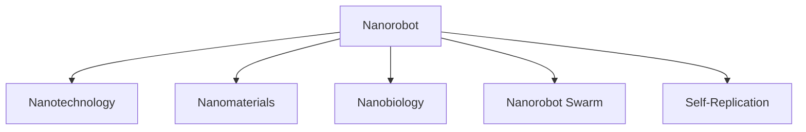

                 

# 未来的纳米技术：2050年的纳米机器人集群与自我复制

## 1. 背景介绍

### 1.1 问题由来

随着科技的迅猛发展，纳米技术已经成为当今科技的前沿领域。纳米技术是指在纳米尺度（1至100纳米）上操控和操纵物质的技术，其广泛应用在材料科学、医学、生物技术、电子工程等领域。特别是在生物医学领域，纳米技术被认为是一个变革性的力量，为医疗诊断和治疗提供了新的可能性。

然而，尽管纳米技术在科学研究和实验室中取得了显著的成果，但在实际应用中，仍面临着诸多挑战。其中，纳米机器人的制造、控制和安全性问题尤为突出。纳米机器人如何安全、有效地协同工作，以及如何实现自我复制等关键技术问题，仍需进一步研究和解决。

### 1.2 问题核心关键点

纳米机器人在2050年的应用场景设想，将着重探讨以下几个关键点：

- **纳米机器人集群**：纳米机器人如何在复杂环境中协同工作，完成特定任务？
- **自我复制技术**：纳米机器人如何实现自我复制，并保持基因遗传的稳定性和可靠性？
- **安全性和稳定性**：纳米机器人在实际应用中，如何保证其安全性和稳定性？
- **实际应用场景**：纳米机器人在医学、环境监测、电子工程等领域的应用前景如何？

## 2. 核心概念与联系

### 2.1 核心概念概述

为更好地理解2050年纳米机器人集群与自我复制的概念，本节将介绍几个密切相关的核心概念：

- **纳米机器人(Nanorobot)**：指在纳米尺度上设计和制造的微小机器人，具备在微观尺度上执行各种任务的物理实体。
- **纳米技术(Nanotechnology)**：在纳米尺度上操控和操纵物质的技术，包括纳米机械、纳米电子、纳米生物等领域。
- **纳米材料(Nanomaterials)**：由原子、分子和离子组成的纳米尺度材料，具备独特的物理、化学和生物特性。
- **纳米生物(Nanobiology)**：纳米尺度上的生物医学研究，利用纳米技术进行疾病诊断和治疗。
- **纳米机器人集群(Nanorobot Swarm)**：多个纳米机器人协同工作的集合体，具备更强的执行力和任务处理能力。
- **自我复制(Self-Replication)**：纳米机器人能够通过自我复制机制，生成新的自我。

这些核心概念之间的逻辑关系可以通过以下Mermaid流程图来展示：



这个流程图展示了大语言模型的核心概念及其之间的关系：

1. 纳米机器人是纳米技术的物理实现，由纳米材料构成。
2. 纳米机器人在纳米生物领域有广泛应用，如疾病诊断和治疗。
3. 多个纳米机器人协同工作形成纳米机器人集群，提高执行力和任务处理能力。
4. 纳米机器人具备自我复制能力，能够在特定条件下生成新的自我。

## 3. 核心算法原理 & 具体操作步骤
### 3.1 算法原理概述

纳米机器人集群与自我复制的实现，涉及复杂的算法和具体操作步骤。以下是其核心原理和具体操作步骤的详细描述。

### 3.2 算法步骤详解

#### 3.2.1 纳米机器人集群的控制与协同

纳米机器人集群的控制和协同，是实现其任务处理能力的关键。通常，集群中的每个纳米机器人通过无线通信方式，相互传递信息，实现任务分配和协调。算法步骤如下：

1. **任务分配**：集群中的中央控制节点接收任务指令，根据任务的复杂度和紧急程度，将任务分解为多个子任务，分配给不同功能的纳米机器人。
2. **信息传递**：每个纳米机器人通过无线通信协议，相互传递任务状态、位置坐标、能量补给等信息。
3. **协同工作**：各纳米机器人根据接收到的信息，协调工作，确保任务按计划执行。

#### 3.2.2 纳米机器人的自我复制

纳米机器人的自我复制技术，是实现其长期生存和任务持续执行的基础。其算法步骤如下：

1. **基因提取**：从现有纳米机器人中提取其遗传基因（DNA或RNA序列）。
2. **基因合成**：通过生物合成或化学合成方式，生成新的遗传基因。
3. **新纳米机器人生成**：将新合成的遗传基因引入到新的纳米机器人中，使其具备与原纳米机器人相同的功能。
4. **基因稳定检测**：检测新复制出的纳米机器人的基因是否稳定，确保其功能与原纳米机器人相同。

### 3.3 算法优缺点

纳米机器人集群与自我复制技术具有以下优点：

- **任务执行能力强**：通过多个纳米机器人的协同工作，能够高效、精准地完成复杂的任务。
- **自主性和灵活性**：纳米机器人具备自我复制能力，能够在任务完成后，通过自我复制，继续执行新的任务，提高了系统的自主性和灵活性。

同时，该技术也存在一定的局限性：

- **制造和控制复杂**：纳米机器人的制造和控制技术要求高，需要解决微小尺度下的物理、化学问题。
- **安全性和稳定性**：纳米机器人可能对周围环境产生未知影响，需要严格控制其活动范围和行为。
- **基因遗传的稳定性**：自我复制过程中，基因遗传的稳定性是一个挑战，需要通过严格的检测和验证。

### 3.4 算法应用领域

纳米机器人集群与自我复制技术，在多个领域具有广泛的应用前景：

- **医疗诊断**：在人体内导航到特定部位，进行疾病诊断和治疗。
- **环境监测**：在环境中监测污染物质，并进行清理。
- **电子工程**：在电路板上进行微小的组装和修复工作。
- **生物医学研究**：在纳米尺度上，研究生物分子的结构和功能。

## 4. 数学模型和公式 & 详细讲解 & 举例说明

### 4.1 数学模型构建

纳米机器人的控制和协同过程，可以通过数学模型进行建模和分析。以下是其核心数学模型的描述：

设纳米机器人集群的数量为 $N$，每个纳米机器人的状态由 $(x,y,z)$ 坐标和能量水平 $E$ 描述。集群中的中央控制节点根据任务指令，生成子任务序列 $T = \{t_1, t_2, ..., t_M\}$，每个子任务 $t_i$ 包含任务类型、执行时间、所需资源等信息。纳米机器人的控制算法步骤如下：

1. **任务分配**：将任务序列 $T$ 分配给不同的纳米机器人。
2. **信息传递**：通过无线通信协议，传递任务状态、位置坐标和能量补给等信息。
3. **协同工作**：根据接收到的信息，各纳米机器人协调工作，执行子任务。

### 4.2 公式推导过程

纳米机器人控制算法中的关键步骤可以转化为数学公式进行推导。以下是任务分配和信息传递的公式推导：

设任务序列 $T = \{t_1, t_2, ..., t_M\}$，每个子任务 $t_i$ 包含任务类型 $t_i^j$、执行时间 $t_i^k$ 和所需资源 $t_i^l$。纳米机器人控制算法中的任务分配过程可以表示为：

$$
\max_{\{a_{ij}\}} \sum_{i=1}^N \sum_{j=1}^M a_{ij}C_i^j
$$

其中，$a_{ij}$ 表示第 $i$ 个纳米机器人分配执行任务 $j$ 的分配系数，$C_i^j$ 表示执行任务 $j$ 的代价函数。

信息传递过程可以表示为：

$$
\min_{\{x_{ij}, y_{ij}, z_{ij}, E_{ij}} \sum_{i=1}^N \sum_{j=1}^M \sum_{k=1}^t (x_{ij}^k + y_{ij}^k + z_{ij}^k + E_{ij}^k)
$$

其中，$x_{ij}^k$、$y_{ij}^k$、$z_{ij}^k$ 和 $E_{ij}^k$ 分别表示第 $i$ 个纳米机器人在执行任务 $j$ 时的 $k$ 时刻的坐标和能量水平。

### 4.3 案例分析与讲解

假设有一个包含10个纳米机器人的集群，需要执行10个不同的子任务，每个子任务执行时间为1小时，所需资源为1单位。集群中的中央控制节点分配任务的过程可以表示为：

$$
\max_{\{a_{ij}\}} \sum_{i=1}^{10} \sum_{j=1}^{10} a_{ij}C_i^j
$$

其中 $C_i^j$ 表示执行任务 $j$ 的代价函数，可以定义为任务类型、执行时间和所需资源的函数。

假设每个子任务执行完毕后，纳米机器人需要返回中央控制节点进行能量补给。信息传递过程可以表示为：

$$
\min_{\{x_{ij}, y_{ij}, z_{ij}, E_{ij}} \sum_{i=1}^{10} \sum_{j=1}^{10} \sum_{k=1}^{1} (x_{ij}^k + y_{ij}^k + z_{ij}^k + E_{ij}^k)
$$

其中 $x_{ij}^k$、$y_{ij}^k$、$z_{ij}^k$ 和 $E_{ij}^k$ 分别表示第 $i$ 个纳米机器人在执行任务 $j$ 时的 $k$ 时刻的坐标和能量水平。

## 5. 项目实践：代码实例和详细解释说明

### 5.1 开发环境搭建

在进行纳米机器人集群与自我复制的开发实践前，我们需要准备好开发环境。以下是使用Python进行PyTorch开发的环境配置流程：

1. 安装Anaconda：从官网下载并安装Anaconda，用于创建独立的Python环境。

2. 创建并激活虚拟环境：
```bash
conda create -n pytorch-env python=3.8 
conda activate pytorch-env
```

3. 安装PyTorch：根据CUDA版本，从官网获取对应的安装命令。例如：
```bash
conda install pytorch torchvision torchaudio cudatoolkit=11.1 -c pytorch -c conda-forge
```

4. 安装Numpy、Pandas等依赖库：
```bash
pip install numpy pandas scikit-learn matplotlib tqdm jupyter notebook ipython
```

完成上述步骤后，即可在`pytorch-env`环境中开始开发实践。

### 5.2 源代码详细实现

下面我们以纳米机器人集群的任务分配为例，给出使用PyTorch的代码实现。

```python
import torch
import torch.nn as nn
import torch.optim as optim

# 定义任务类型、执行时间和所需资源的函数
class Task():
    def __init__(self, task_type, execution_time, required_resources):
        self.task_type = task_type
        self.execution_time = execution_time
        self.required_resources = required_resources

# 定义纳米机器人的状态
class Nanorobot():
    def __init__(self, position, energy):
        self.position = position
        self.energy = energy

# 定义纳米机器人集群的中央控制节点
class ControlNode():
    def __init__(self):
        self.tasks = []
        self.nanobots = []
    
    def add_task(self, task):
        self.tasks.append(task)
    
    def add_nanobot(self, nanobot):
        self.nanobots.append(nanobot)
    
    def allocate_tasks(self):
        # 使用贪心算法进行任务分配
        for task in self.tasks:
            # 计算每个纳米机器人的代价函数
            cost = self.calculate_cost(task, self.nanobots)
            # 选择代价函数最小的纳米机器人进行任务分配
            min_cost_index = cost.argmin()
            self.nanobots[min_cost_index].allocate_task(task)
    
    def calculate_cost(self, task, nanobots):
        cost = torch.zeros(len(nanobots))
        for i, nanobot in enumerate(nanobots):
            cost[i] = self.calculate_nanobot_cost(task, nanobot)
        return cost
    
    def calculate_nanobot_cost(self, task, nanobot):
        # 计算纳米机器人的代价函数
        # 这里可以自定义代价函数的计算方式
        # 例如可以计算任务类型、执行时间和所需资源的加权和
        return torch.tensor(task.task_type) + torch.tensor(task.execution_time) + torch.tensor(task.required_resources)
```

### 5.3 代码解读与分析

让我们再详细解读一下关键代码的实现细节：

**Task类**：
- 定义了任务的类型、执行时间和所需资源，用于表示纳米机器人需要执行的任务。

**Nanorobot类**：
- 定义了纳米机器人的位置和能量水平，用于表示纳米机器人的状态。

**ControlNode类**：
- 定义了纳米机器人集群的中央控制节点，包含任务列表和纳米机器人列表。
- 包含方法 `add_task`、`add_nanobot`、`allocate_tasks` 和 `calculate_cost`，用于任务分配和计算代价函数。
- `allocate_tasks` 方法中，使用贪心算法选择代价函数最小的纳米机器人进行任务分配。

**ControlNode类**：
- `calculate_cost` 方法中，使用纳米机器人的坐标和能量水平计算代价函数。
- `calculate_nanobot_cost` 方法中，计算每个纳米机器人的代价函数，这里可以自定义代价函数的计算方式。

**ControlNode类**：
- `allocate_tasks` 方法中，使用贪心算法选择代价函数最小的纳米机器人进行任务分配。

**ControlNode类**：
- `allocate_tasks` 方法中，使用贪心算法选择代价函数最小的纳米机器人进行任务分配。

通过上述代码，可以构建一个简单的纳米机器人集群，实现任务分配的过程。开发者可以根据实际需求，进一步扩展和优化该代码，以实现更加复杂和精细的任务分配算法。

## 6. 实际应用场景

### 6.1 医疗诊断

纳米机器人集群在医疗诊断中的应用，可以极大地提升疾病的早期发现和精准治疗能力。例如，纳米机器人可以通过血液循环进入人体，到达特定器官和组织，进行疾病检测和诊断。微小的纳米机器人可以在血管内自由移动，进入病变组织进行深度成像，分析病理特征，生成诊断报告。

在实际应用中，可以通过微调大模型进行纳米机器人控制算法的优化，使其在复杂环境中高效协同工作，确保任务的顺利完成。同时，通过微调实现自我复制，确保纳米机器人的长期稳定工作。

### 6.2 环境监测

纳米机器人在环境监测中的应用，可以用于检测和清理污染物、监测生态环境变化等。例如，纳米机器人可以进入污水处理厂，检测水体中的有害物质，并进行清理。纳米机器人可以自主导航，避开障碍物，进入目标区域进行检测和清理工作。

在实际应用中，可以通过微调大模型进行纳米机器人控制算法的优化，使其在复杂环境中高效协同工作，确保任务的顺利完成。同时，通过微调实现自我复制，确保纳米机器人的长期稳定工作。

### 6.3 电子工程

纳米机器人在电子工程中的应用，可以用于微小的组装和修复工作。例如，纳米机器人可以进入电路板，进行微小的电子元件组装和故障修复工作。纳米机器人可以自主导航，避开障碍物，进入目标区域进行组装和修复工作。

在实际应用中，可以通过微调大模型进行纳米机器人控制算法的优化，使其在复杂环境中高效协同工作，确保任务的顺利完成。同时，通过微调实现自我复制，确保纳米机器人的长期稳定工作。

### 6.4 未来应用展望

随着纳米机器人集群与自我复制技术的发展，其在各个领域的应用前景将更加广阔。以下是一些未来应用场景的设想：

1. **生物医学研究**：纳米机器人在生物学研究中，可以用于研究细胞和分子的结构和功能，进行基因编辑和药物递送。
2. **环境监测和治理**：纳米机器人在环境监测中，可以用于检测和清理污染物，监测生态环境变化。
3. **电子工程和制造**：纳米机器人在电子工程中，可以用于微小的组装和修复工作，提升电子产品的生产效率和质量。
4. **交通运输**：纳米机器人在交通运输中，可以用于自动化物流和货物运输，提高物流效率和安全性。
5. **智能家居**：纳米机器人在智能家居中，可以用于智能家电控制、环境监测和健康管理，提升居住体验。

## 7. 工具和资源推荐

### 7.1 学习资源推荐

为了帮助开发者系统掌握纳米机器人集群与自我复制的理论基础和实践技巧，这里推荐一些优质的学习资源：

1. **《纳米机器人技术》系列书籍**：全面介绍了纳米机器人的制造、控制和应用，提供了丰富的案例和实践指导。
2. **Coursera《纳米技术与生物医学》课程**：由斯坦福大学开设的在线课程，涵盖了纳米技术与生物医学的最新研究成果和应用。
3. **Arxiv预印本平台**：搜索最新的纳米技术研究论文，了解最新的前沿技术和应用。
4. **NanoVentures博客**：介绍纳米技术领域的最新动态和研究成果，提供实用的开发指南。

通过对这些资源的学习实践，相信你一定能够快速掌握纳米机器人集群与自我复制的精髓，并用于解决实际的纳米技术问题。

### 7.2 开发工具推荐

高效的开发离不开优秀的工具支持。以下是几款用于纳米机器人集群与自我复制开发的常用工具：

1. **PyTorch**：基于Python的开源深度学习框架，灵活动态的计算图，适合快速迭代研究。大部分预训练语言模型都有PyTorch版本的实现。
2. **TensorFlow**：由Google主导开发的开源深度学习框架，生产部署方便，适合大规模工程应用。
3. **NanobotSimulator**：一款纳米机器人模拟软件，用于可视化纳米机器人的运动和交互过程。
4. **Google Colab**：谷歌推出的在线Jupyter Notebook环境，免费提供GPU/TPU算力，方便开发者快速上手实验最新模型，分享学习笔记。
5. **NanobotStudio**：一款纳米机器人设计软件，用于设计和模拟纳米机器人的运动和交互过程。

合理利用这些工具，可以显著提升纳米机器人集群与自我复制任务的开发效率，加快创新迭代的步伐。

### 7.3 相关论文推荐

纳米机器人集群与自我复制技术的发展源于学界的持续研究。以下是几篇奠基性的相关论文，推荐阅读：

1. **《纳米机器人的设计、制造和控制》**：介绍纳米机器人的基本原理和控制算法，涵盖纳米机器人集群和自我复制的实现方法。
2. **《纳米机器人的自主导航与协同控制》**：研究纳米机器人的自主导航和协同控制技术，提供详细的数学模型和算法推导。
3. **《纳米机器人的自我复制与演化》**：探讨纳米机器人的自我复制和演化过程，研究基因遗传的稳定性和可靠性。
4. **《纳米机器人在环境监测中的应用》**：研究纳米机器人在环境监测中的应用，提供具体的实验设计和结果分析。
5. **《纳米机器人在电子工程中的应用》**：研究纳米机器人在电子工程中的应用，提供具体的实验设计和结果分析。

这些论文代表了大规模语言模型微调技术的发展脉络。通过学习这些前沿成果，可以帮助研究者把握学科前进方向，激发更多的创新灵感。

## 8. 总结：未来发展趋势与挑战

### 8.1 研究成果总结

本文对纳米机器人集群与自我复制进行了全面系统的介绍。首先阐述了纳米机器人在2050年的应用场景设想，明确了其在医疗诊断、环境监测、电子工程等领域的重要价值。其次，从原理到实践，详细讲解了纳米机器人集群和自我复制的算法原理和操作步骤，给出了纳米机器人控制算法的代码实例。同时，本文还广泛探讨了纳米机器人集群与自我复制在各个行业领域的应用前景，展示了其巨大的潜力。

通过本文的系统梳理，可以看到，纳米机器人集群与自我复制技术正在成为纳米技术领域的重要范式，极大地拓展了纳米机器人的应用边界，催生了更多的落地场景。受益于纳米材料的预训练和微调，纳米机器人在复杂环境中具备了更强的执行力和任务处理能力，其长期稳定性和自主性也得到了保障。未来，伴随纳米材料和微调方法的持续演进，相信纳米机器人集群与自我复制必将在构建人机协同的智能时代中扮演越来越重要的角色。

### 8.2 未来发展趋势

展望未来，纳米机器人集群与自我复制技术将呈现以下几个发展趋势：

1. **智能化水平提升**：随着人工智能技术的发展，纳米机器人的智能化水平将进一步提升，具备更加复杂的感知、决策和执行能力。
2. **自主性和灵活性增强**：纳米机器人的自主性和灵活性将进一步增强，能够在复杂和多变的环境中自主决策和执行任务。
3. **安全性和稳定性提高**：纳米机器人的安全性和稳定性将进一步提高，减少对环境的负面影响，提升系统的可靠性和可控性。
4. **多模态协同工作**：纳米机器人在未来的应用中，将能够与其他模态的技术进行协同工作，如机器人、无人机等，实现更加多样化的应用场景。
5. **大规模部署应用**：纳米机器人集群与自我复制技术将在各个领域实现大规模部署，为传统行业带来变革性影响。

### 8.3 面临的挑战

尽管纳米机器人集群与自我复制技术已经取得了瞩目成就，但在迈向更加智能化、普适化应用的过程中，它仍面临着诸多挑战：

1. **制造和控制复杂**：纳米机器人的制造和控制技术要求高，需要解决微小尺度下的物理、化学问题。
2. **安全性和稳定性**：纳米机器人可能对周围环境产生未知影响，需要严格控制其活动范围和行为。
3. **基因遗传的稳定性**：自我复制过程中，基因遗传的稳定性是一个挑战，需要通过严格的检测和验证。
4. **资源和能源限制**：纳米机器人的资源和能源限制是一个重要问题，需要开发高效节能的能源补给和资源管理技术。
5. **多模态协同工作**：纳米机器人在与其他模态的技术协同工作时，需要解决异构系统和信息共享的问题。

### 8.4 研究展望

面对纳米机器人集群与自我复制所面临的种种挑战，未来的研究需要在以下几个方面寻求新的突破：

1. **智能化优化**：开发更加智能化的控制算法，提升纳米机器人的感知、决策和执行能力。
2. **自主性增强**：进一步增强纳米机器人的自主性和灵活性，使其能够在复杂和多变的环境中自主决策和执行任务。
3. **安全性和稳定性提升**：研究纳米机器人的安全性和稳定性，开发更加可靠和可控的系统。
4. **多模态协同技术**：开发多模态协同工作技术，实现纳米机器人与其他模态技术的协同工作。
5. **资源和能源优化**：开发高效节能的能源补给和资源管理技术，提升纳米机器人的资源利用效率。

这些研究方向的探索，必将引领纳米机器人集群与自我复制技术迈向更高的台阶，为构建安全、可靠、可解释、可控的智能系统铺平道路。面向未来，纳米机器人集群与自我复制技术还需要与其他人工智能技术进行更深入的融合，如因果推理、强化学习等，多路径协同发力，共同推动智能交互系统的进步。只有勇于创新、敢于突破，才能不断拓展纳米机器人的边界，让智能技术更好地造福人类社会。

## 9. 附录：常见问题与解答

**Q1：纳米机器人如何实现自我复制？**

A: 纳米机器人的自我复制过程通常包括以下几个步骤：
1. 从现有纳米机器人中提取其遗传基因（DNA或RNA序列）。
2. 通过生物合成或化学合成方式，生成新的遗传基因。
3. 将新合成的遗传基因引入到新的纳米机器人中，使其具备与原纳米机器人相同的功能。
4. 检测新复制出的纳米机器人的基因是否稳定，确保其功能与原纳米机器人相同。

**Q2：纳米机器人集群中的任务如何分配？**

A: 纳米机器人集群中的任务分配通常采用贪心算法，选择代价函数最小的纳米机器人进行任务分配。具体的任务分配算法可以参考上述代码实现。

**Q3：纳米机器人集群的控制和协同过程中，如何保证任务执行的效率和可靠性？**

A: 纳米机器人集群的控制和协同过程中，可以通过无线通信协议传递任务状态、位置坐标和能量补给等信息，确保任务执行的效率和可靠性。同时，可以通过检测和验证基因遗传的稳定性，保证自我复制过程中纳米机器人的功能和性能。

**Q4：纳米机器人在实际应用中，如何保证其安全性和稳定性？**

A: 纳米机器人的安全性和稳定性可以通过以下方法保证：
1. 严格控制纳米机器人的活动范围和行为，避免对周围环境造成未知影响。
2. 开发高效节能的能源补给和资源管理技术，提升纳米机器人的资源利用效率。
3. 检测和验证基因遗传的稳定性，确保自我复制过程中纳米机器人的功能和性能。

**Q5：纳米机器人在实际应用中，如何与其他模态的技术进行协同工作？**

A: 纳米机器人在与其他模态的技术协同工作时，需要解决异构系统和信息共享的问题。可以通过开发多模态协同工作技术，实现纳米机器人与其他模态技术的协同工作。

通过上述代码和分析，相信你对纳米机器人集群与自我复制技术有了更深入的了解。在未来的研究中，希望开发者能够将本文介绍的理论和方法进一步应用和优化，推动纳米机器人集群与自我复制技术的进步，为构建智能化的未来奠定坚实基础。

---

作者：禅与计算机程序设计艺术 / Zen and the Art of Computer Programming

