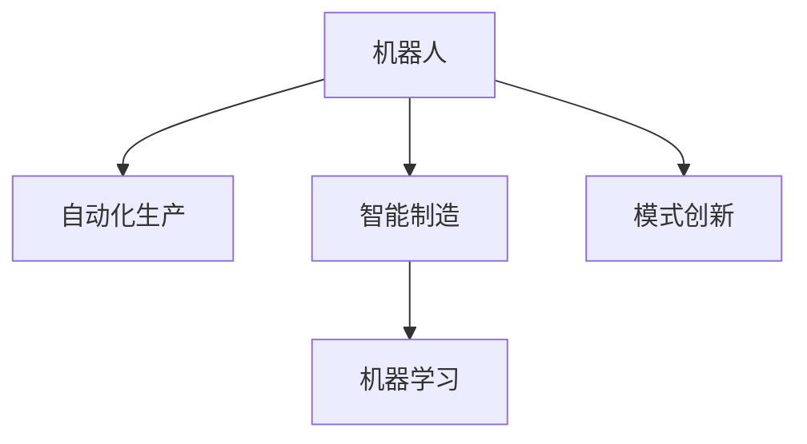

                 

# 机器人创业：自动化生产的未来蓝图

> 关键词：机器人创业,自动化生产,自动化技术,智能制造,人工智能,机器学习,创业指南,智能工厂

## 1. 背景介绍

### 1.1 问题由来

随着全球制造业的加速发展，自动化技术成为提升生产效率、降低成本的关键。机器人作为现代工业生产的重要组成部分，以其高效、精准、可靠等优点，被广泛应用于汽车制造、电子装配、食品加工等各个行业。然而，当前机器人行业仍面临诸多挑战：如高昂的初始投资、灵活性不足、维护复杂等。这些问题严重制约了机器人在更多场景中的应用。

### 1.2 问题核心关键点

面对上述问题，机器人创业公司需要寻求技术突破和模式创新，以克服现有难题，实现更大规模的推广应用。机器人创业的核心关键点如下：

- **技术突破**：提升机器人的智能化水平，增强其环境适应能力和任务执行的灵活性，降低对人工干预的依赖。
- **成本优化**：通过技术创新和规模化生产，降低机器人的初始购置和运营成本，提高经济性。
- **市场推广**：利用多样化的市场渠道，包括线上销售、租赁服务、系统集成等，拓展应用场景。
- **商业模式创新**：探索如按需租赁、远程维护、共享经济等新型的商业模式，满足不同客户需求。

### 1.3 问题研究意义

机器人创业对推动自动化生产具有重要意义：

1. **提高生产效率**：机器人通过自动化生产流程，大幅提升生产效率，缩短产品上市时间。
2. **降低运营成本**：通过规模化生产降低单台机器人成本，并通过远程监控和维护减少人工维护费用。
3. **促进产业升级**：智能机器人的应用加速制造业向智能化、柔性化方向转型，提升整体产业竞争力。
4. **推动技术创新**：机器人创业公司不断追求技术突破，推动产业上下游的技术创新和产品升级。
5. **增加就业机会**：机器人生产和服务需要大量技术人才，带来新的就业机会。

## 2. 核心概念与联系

### 2.1 核心概念概述

为更好地理解机器人创业，本节将介绍几个核心概念：

- **机器人**：能够模拟人或动物的动作，完成各种任务的人工智能设备。通常由机械臂、传感器、控制系统等组成。
- **自动化生产**：通过机器人等自动化设备，实现生产过程的自动化、智能化，提高生产效率和经济效益。
- **智能制造**：利用人工智能技术，提升制造过程的智能化水平，实现生产流程的优化和升级。
- **机器学习**：通过数据驱动的学习方法，使机器人能够自动学习和优化任务执行策略。
- **模式创新**：探索新型的商业模式和市场渠道，以适应不同的市场需求和客户体验。

这些核心概念之间的逻辑关系可以通过以下Mermaid流程图来展示：



这个流程图展示核心概念之间的关系：

1. 机器人作为智能制造和自动化生产的基础设备，通过学习提升智能水平。
2. 机器学习推动机器人智能化，使机器人在不同场景下更具灵活性和适应性。
3. 模式创新提供多样化的商业运作方式，为机器人创业公司开拓更多市场。

## 3. 核心算法原理 & 具体操作步骤

### 3.1 算法原理概述

机器人创业的核心算法原理主要涉及机器人的智能化控制和优化，具体包括：

- **路径规划**：确定机器人从起点到终点的最优路径，通常采用基于图论或启发式算法如A*、D*等。
- **姿态控制**：通过传感器反馈信息，调整机器人关节位置和姿态，以适应任务需求。
- **环境感知**：利用视觉、声音、触觉等传感器，实时获取环境信息，避免碰撞和异常。
- **任务执行优化**：通过机器学习算法，优化机器人任务执行的策略和参数。

### 3.2 算法步骤详解

机器人创业中的算法步骤主要分为以下几个关键环节：

1. **需求分析与建模**：分析机器人应用场景，确定机器人需要完成的任务，建立数学或仿真模型。
2. **传感器集成与配置**：根据任务需求选择合适的传感器类型，并进行系统集成和参数配置。
3. **路径规划与优化**：通过算法生成机器人路径，并使用启发式搜索方法进行优化。
4. **姿态控制与调整**：实时获取环境反馈，利用控制算法调整机器人姿态，确保任务执行精度。
5. **机器学习训练**：利用历史数据或现场数据，训练机器学习模型，优化任务执行策略。
6. **系统集成与调试**：将机器人与生产线系统集成，进行全面的系统调试和性能优化。

### 3.3 算法优缺点

机器人创业中的算法具有以下优点：

- **高效性**：通过路径规划和姿态控制算法，大幅提升机器人执行任务的速度和精度。
- **灵活性**：通过机器学习，机器人能够适应不同任务和环境，增强应用场景的覆盖。
- **可扩展性**：机器人算法容易通过软件更新和升级，扩展新功能或改进现有性能。

同时，该算法也存在一定局限性：

- **依赖传感器**：机器人的性能高度依赖传感器的精度和可靠性。传感器故障可能导致任务执行失败。
- **环境适应性**：机器人算法对于环境变化的适应性不足，可能导致任务执行中断。
- **计算资源需求**：某些复杂的路径规划和机器学习算法需要大量计算资源，对硬件要求较高。

### 3.4 算法应用领域

机器人创业中的算法在多个领域得到广泛应用，包括：

- **汽车制造**：用于自动化车身焊接、零件装配、质量检测等环节，提升生产效率和质量。
- **电子装配**：通过机器人完成微电子元器件的自动焊接、封装等，降低生产成本和报废率。
- **食品加工**：用于自动分拣、包装、搬运等流程，提高食品安全和加工效率。
- **医疗健康**：在手术、康复训练、药品配送等方面，提升医疗服务的精细化和智能化。
- **仓储物流**：在智能仓库和配送中心，实现货物分拣、打包、搬运等自动化操作。

## 4. 数学模型和公式 & 详细讲解 & 举例说明（备注：数学公式请使用latex格式，latex嵌入文中独立段落使用 $$，段落内使用 $)
### 4.1 数学模型构建

在机器人创业中，数学模型主要涉及机器人运动学和控制系统的设计。以下以机器人路径规划为例，介绍相关数学模型。

假设机器人在笛卡尔空间中的位置为 $(x,y,z)$，关节角度为 $(\theta_1,\theta_2,\theta_3,\dots,\theta_n)$，则机器人的正运动学方程为：

$$
\begin{cases}
x = f_1(\theta_1, \theta_2, \dots, \theta_n) \\
y = f_2(\theta_1, \theta_2, \dots, \theta_n) \\
z = f_3(\theta_1, \theta_2, \dots, \theta_n)
\end{cases}
$$

其中 $f_i$ 表示关节角度到笛卡尔空间坐标的映射关系。

机器人路径规划问题可以描述为：在给定起点 $(x_0, y_0, z_0)$ 和终点 $(x_f, y_f, z_f)$ 的条件下，找到一条最短路径，使得机器人从起点到达终点。该问题可以转化为图论中的最短路径问题，使用A*等算法求解。

### 4.2 公式推导过程

A*算法使用启发式函数 $g(n) = h(n) + g'(n)$ 来估计从起点 $s$ 到节点 $n$ 的最短路径代价。其中 $h(n)$ 为节点 $n$ 到终点 $t$ 的估计代价，$g'(n)$ 为节点 $n$ 到起点的已知代价。

启发式函数 $h(n)$ 可以有多种形式，常见的有曼哈顿距离和欧几里得距离：

$$
h(n) = 
\begin{cases}
\sqrt{(x_n-x_f)^2+(y_n-y_f)^2+(z_n-z_f)^2} & \text{(欧几里得距离)} \\
|x_n-x_f|+|y_n-y_f|+|z_n-z_f| & \text{(曼哈顿距离)}
\end{cases}
$$

A*算法的主要流程如下：

1. 将起点 $s$ 加入开放集 $o$，并将其估计代价 $g(s)$ 赋值为0。
2. 从开放集 $o$ 中取出具有最小估计代价的节点 $n$。
3. 若 $n$ 为终点 $t$，则算法结束，返回路径。
4. 否则，根据启发式函数计算 $n$ 的子节点列表 $L(n)$，更新其估计代价和前驱节点。
5. 若 $L(n)$ 中存在新节点，将其加入开放集 $o$。
6. 重复步骤2-5，直至找到终点或开放集为空。

### 4.3 案例分析与讲解

考虑一个简单的例子，机器人在二维平面内从点 $(0,0)$ 移动到点 $(5,5)$，路径规划过程如下：

1. 起点加入开放集 $o$，$g(s) = 0$。
2. 从 $o$ 中取出节点 $(0,0)$，估计代价 $g(s) = h(s) + g'(s) = \sqrt{(0-5)^2+(0-5)^2} + 0 = \sqrt{50} = 5.7$。
3. 计算节点 $(0,0)$ 的子节点列表 $L((0,0))$，包括 $(1,0), (0,1), (2,0), (0,2), (3,0), (0,3)$。
4. 计算这些子节点的估计代价，取其中最小的节点 $(1,0)$，更新其前驱节点为 $(0,0)$。
5. 将 $(1,0)$ 加入开放集 $o$，$g((1,0)) = h((1,0)) + g'((1,0)) = 5 + 0 = 5$。
6. 重复2-5步骤，直至找到终点 $(5,5)$。

最终得到的路径为 $(0,0) \rightarrow (1,0) \rightarrow (1,1) \rightarrow (2,1) \rightarrow (2,2) \rightarrow (3,2) \rightarrow (3,3) \rightarrow (4,3) \rightarrow (4,4) \rightarrow (5,4) \rightarrow (5,5)$。

## 5. 项目实践：代码实例和详细解释说明
### 5.1 开发环境搭建

在进行机器人创业实践前，我们需要准备好开发环境。以下是使用Python进行ROS开发的环境配置流程：

1. 安装ROS（Robot Operating System）：根据系统平台从官网下载并安装ROS发行版，如Ubuntu 16.04。
2. 安装ROS节点管理工具rqt_reconfigure：
```bash
sudo apt-get install ros-{distro}-rqt-reconfigure
```
3. 安装ROS工具包，如move_base、robot_localization、nav_msgs等：
```bash
sudo apt-get install ros-{distro}-move-base ros-{distro}-robot-localization ros-{distro}-nav-msgs
```

完成上述步骤后，即可在ROS环境下进行机器人创业的开发实践。

### 5.2 源代码详细实现

我们以ROS中的move_base节点为例，介绍如何实现机器人路径规划功能。

首先，在ROS中找到move_base包，在src目录下创建新的Python文件move_base.launch.py：

```python
from launch import LaunchDescription
from launch.actions import DeclareLaunchArgument, WaitUntilCondition
from launch.substitutions import LaunchConfiguration
from launch_ros.actions import Node

def launch():

    arg_tortoise_base_name = DeclareLaunchArgument(
        name="tortoise_base_name",
        description="Turtlebase name",
        default_value="turtlebot3_base"
    )

    arg_is_sim = DeclareLaunchArgument(
        name="is_sim",
        description="Whether the move_base is simulated",
        default_value="False"
    )

    move_base_node = Node(
        package="move_base",
        executable="move_base",
        name="move_base_node",
        arguments=[arg_tortoise_base_name, arg_is_sim],
        output='screen'
    )

    return LaunchDescription([
        move_base_node,
    ])
```

然后，在src目录下创建move_base.py文件，实现路径规划的核心逻辑：

```python
import rospy
from nav_msgs.msg import Odometry, Path
from move_base_msgs.msg import MoveBaseActionGoal, MoveBaseAction
from tf.transformations import euler_from_quaternion
from tf.transformations import quaternion_from_euler

def haversine(theta):
    x = np.cos(theta)
    y = np.sin(theta)
    return x*x + y*y

def path_planner():
    rospy.init_node('path_planner', anonymous=True)
    r = rospy.Rate(10)

    start_point = (0, 0)
    end_point = (5, 5)

    move_base = rospy.wait_for_service('/move_base')
    goal = MoveBaseActionGoal(move_base, start_point, end_point)

    while not rospy.is_shutdown():
        # 计算路径
        path = calculate_path(start_point, end_point)

        # 设置移动目标
        move_base.send_goal(path)

        while not move_base.done():
            r.sleep()

        if move_base.state == MoveBaseAction.getState.StringValues.SUCCEEDED:
            print("Path succeeded")
        else:
            print("Path failed")

def calculate_path(start_point, end_point):
    path = []
    for i in range(101):
        theta = start_point[0] + (end_point[0] - start_point[0]) * i / 100
        point = (theta, 0)
        path.append(point)
    return path

if __name__ == '__main__':
    path_planner()
```

最后，在move_base.launch.py中调用path_planner函数：

```python
move_base_node = Node(
    package="move_base",
    executable="move_base",
    name="move_base_node",
    arguments=[arg_tortoise_base_name, arg_is_sim],
    output='screen',
    parameters=[path_planner]
)
```

这样，我们就完成了ROS中move_base节点的路径规划功能实现。

### 5.3 代码解读与分析

让我们再详细解读一下关键代码的实现细节：

**move_base.launch.py**：
- 使用launch库定义启动函数，设置启动参数，包括turtlebase节点名和是否模拟。
- 启动move_base节点，传入参数并输出到控制台。

**move_base.py**：
- 初始化节点，设置更新速率。
- 定义起点和终点。
- 等待move_base服务，创建移动目标。
- 循环执行路径规划和目标移动，直到移动完成。

**path_planner函数**：
- 计算路径，使用haversine函数计算每一步的估计代价。
- 发送移动目标到move_base服务。
- 检查移动状态，输出结果。

**calculate_path函数**：
- 计算路径，按照直线路径分步计算每一步的位置。
- 返回路径列表。

**主函数**：
- 调用path_planner函数进行路径规划和移动。

可以看到，ROS中的move_base路径规划实现相对简单，主要通过Python代码调用move_base服务完成目标移动。

当然，工业级的系统实现还需考虑更多因素，如路径优化、障碍物检测、实时监控等。但核心的路径规划算法基本与此类似。

## 6. 实际应用场景
### 6.1 智能仓储

智能仓储是机器人创业的重要应用场景，通过自动化仓储物流，提高仓库作业效率和准确性。

在智能仓储中，机器人主要用于自动分拣、搬运、包装等任务。通过路径规划算法，机器人可以准确地定位到指定位置，自动完成物料的搬运和包装。系统通过RFID、二维码等技术，实现物料的实时跟踪和仓储管理。机器人创业公司可以根据不同仓库需求，定制化的设计仓储解决方案。

### 6.2 工业制造

工业制造是机器人创业的核心市场之一，涵盖电子、汽车、家电等多个行业。

在工业制造中，机器人主要用于自动化装配、质量检测、设备维护等环节。通过路径规划和姿态控制算法，机器人可以高效地完成复杂的装配任务，提高生产效率和产品质量。机器人创业公司可以通过与各大制造企业合作，推广机器人自动化方案，推动工业4.0的发展。

### 6.3 医疗健康

医疗健康是机器人创业的潜力市场，未来将有大量应用场景。

在医疗健康中，机器人主要用于手术机器人、康复机器人、药品配送等环节。通过路径规划算法和实时监控系统，机器人可以精确地执行手术操作，辅助医生完成复杂手术。机器人创业公司可以与医院合作，推广机器人医疗应用，提高医疗服务的精细化和智能化水平。

### 6.4 未来应用展望

随着机器人技术的不断进步，机器人创业在未来将呈现更多应用场景：

1. **智能家居**：机器人可以用于智能家电控制、清洁服务、家庭娱乐等，提升家庭生活的智能化和便利性。
2. **教育培训**：机器人可以用于教育机器人、虚拟助教等，辅助学生学习和教师教学，促进教育公平和创新。
3. **农业自动化**：机器人可以用于农业自动化、精准种植、农药喷洒等，提高农业生产效率和质量。
4. **环保监测**：机器人可以用于环境监测、污染治理等，提升环境保护和治理能力。
5. **物流配送**：机器人可以用于智能配送、仓库管理等，提高物流效率和准确性。

未来机器人创业将与更多新兴行业融合，推动社会生产方式和生活方式的变革，带来巨大的经济效益和社会效益。

## 7. 工具和资源推荐
### 7.1 学习资源推荐

为了帮助开发者系统掌握机器人创业的理论基础和实践技巧，这里推荐一些优质的学习资源：

1. ROS官方文档：ROS作为机器人系统开发的开源平台，提供了丰富的官方文档和教程，涵盖ROS环境搭建、节点开发、系统集成等各个环节。
2. ROS Tutorials：ROS社区提供了一系列针对不同场景的教程，帮助开发者快速上手ROS开发，实现机器人功能。
3. Udacity机器人学课程：Udacity与ROS社区合作，提供了一系列机器人学相关的在线课程，涵盖机器人感知、规划、控制等核心内容。
4. ROS-Based Mobile Robots by Willow Garage：Willow Garage出版的经典书籍，详细介绍了ROS在移动机器人开发中的应用。
5. ROS-Botdev：ROS官方社区的博客和资源页面，提供大量ROS开发的实践案例和开源项目。

通过对这些资源的学习实践，相信你一定能够快速掌握机器人创业的精髓，并用于解决实际的机器人问题。

### 7.2 开发工具推荐

高效的开发离不开优秀的工具支持。以下是几款用于机器人创业开发的常用工具：

1. ROS：Robot Operating System，支持跨平台开发，适用于多种机器人系统。
2. MoveIt!：ROS中用于路径规划和运动控制的工具包，支持复杂机器人系统的运动控制和规划。
3. RViz：ROS中用于可视化工具，可以实时展示机器人状态和环境数据。
4. Gazebo：ROS中用于仿真环境的工具，支持各种机器人场景的仿真测试。
5. PCL：点云处理库，适用于机器人感知和地图构建，支持各种传感器数据处理。

合理利用这些工具，可以显著提升机器人创业开发的效率，加快创新迭代的步伐。

### 7.3 相关论文推荐

机器人创业中的核心算法和应用受到学界的广泛关注，以下是几篇奠基性的相关论文，推荐阅读：

1. "Robot Operating System: a framework for robot software development"：ROS的官方论文，介绍了ROS的架构和设计理念。
2. "A Survey of Modern Robot Path Planning"：综述现代机器人路径规划算法，详细介绍了各种路径规划算法的原理和应用。
3. "Receding Horizon Motion Planning for Mobile Robots"：介绍动态路径规划算法，解决了动态环境下的机器人路径规划问题。
4. "Towards Autonomous Mobile Robots: A Survey of Advanced Topics in Navigation, Localization, and Path Planning"：综述了导航、定位和路径规划等机器人核心技术，提供了丰富的算法和应用案例。
5. "Understanding Robot Path Planning through the Lenses of Graphs and Grids"：通过图论和网格模型，介绍机器人路径规划算法的原理和应用。

这些论文代表了大语言模型微调技术的发展脉络。通过学习这些前沿成果，可以帮助研究者把握学科前进方向，激发更多的创新灵感。

## 8. 总结：未来发展趋势与挑战

### 8.1 总结

本文对机器人创业进行全面系统的介绍。首先阐述了机器人创业的背景和意义，明确了机器人创业公司的技术突破和模式创新方向。其次，从原理到实践，详细讲解了机器人路径规划和姿态控制的算法原理和操作步骤，给出了ROS中move_base节点的代码实例。同时，本文还广泛探讨了机器人创业在智能仓储、工业制造、医疗健康等多个行业领域的应用前景，展示了机器人创业的巨大潜力。此外，本文精选了机器人创业的相关学习资源，力求为读者提供全方位的技术指引。

通过本文的系统梳理，可以看到，机器人创业对推动自动化生产具有重要意义。机器人在各个行业中的应用将带来广泛的经济和社会效益。未来，伴随机器人技术的不断进步，机器人创业也将拓展更多应用场景，推动人工智能技术在工业生产和社会生活的进一步渗透。

### 8.2 未来发展趋势

展望未来，机器人创业的发展趋势如下：

1. **技术突破**：通过自主学习、感知、控制等技术的创新，提高机器人的智能化和灵活性，降低对人工干预的依赖。
2. **成本优化**：通过规模化生产、技术创新和资源优化，降低机器人初始购置和运营成本，提高经济性。
3. **市场推广**：利用线上销售、租赁服务、系统集成等多样化的市场渠道，拓展应用场景，提升市场覆盖率。
4. **模式创新**：探索按需租赁、远程维护、共享经济等新型的商业模式，满足不同客户需求，增强竞争力。
5. **应用场景**：拓展到智能家居、教育培训、农业自动化、环保监测、物流配送等多个新兴行业，推动社会生产方式和生活方式的变革。

### 8.3 面临的挑战

尽管机器人创业前景广阔，但在迈向更大规模应用的过程中，仍面临诸多挑战：

1. **高昂的初始投资**：机器人系统的初始购置和安装成本较高，需要企业具备较强的资金实力。
2. **环境适应性不足**：机器人在复杂环境下的适应性和鲁棒性有待提高，可能面临环境变化导致的任务失败。
3. **技术成熟度不足**：当前机器人技术尚未完全成熟，部分关键技术仍需进一步研究和改进。
4. **人机交互问题**：机器人与人类之间的交互仍存在技术瓶颈，需要提升人机交互的智能化和自然性。
5. **法律和伦理问题**：机器人自动化应用涉及大量法律和伦理问题，如隐私保护、责任归属等，需要制定相应的政策和标准。

### 8.4 研究展望

面对机器人创业所面临的挑战，未来的研究需要在以下几个方面寻求新的突破：

1. **提升机器人智能化**：通过自主学习和感知技术的提升，使机器人具备更强的环境适应性和任务执行灵活性。
2. **优化机器人路径规划**：引入更高效、可靠的路径规划算法，增强机器人对复杂环境任务的应对能力。
3. **改进机器人控制系统**：优化机器人姿态控制和实时监控系统，提高机器人任务的执行精度和稳定性。
4. **探索新型商业模式**：结合市场需求，探索更灵活、多样化的商业模式，提升机器人应用的经济性。
5. **解决人机交互问题**：研究更自然、高效的人机交互技术，提升机器人与人类之间的互动体验。
6. **制定法律和伦理标准**：建立机器人应用的标准和规范，明确法律责任，保障人机安全和伦理道德。

这些研究方向的探索，必将引领机器人创业走向更高层次，推动人工智能技术在实际应用中的深入发展。

## 9. 附录：常见问题与解答

**Q1：机器人创业需要多少初始投资？**

A: 机器人创业的初始投资因应用场景和机器人规模而异。一般来说，一个完整的机器人系统包括硬件购置、软件开发、系统集成等，所需投资较大。但对于小规模应用场景，如无人配送、智能家居等，投资相对较小。企业应根据具体需求和市场潜力，合理评估投资回报，制定合理的预算计划。

**Q2：机器人创业中如何降低成本？**

A: 机器人创业可以通过以下途径降低成本：

- 规模化生产：通过批量化生产，降低单台机器人成本，提高经济效益。
- 技术创新：通过技术改进和产品优化，提升机器人性能，减少维护成本。
- 共享经济：通过共享机器人设备和服务，降低一次性投资，提高资源利用率。
- 开源合作：利用开源社区和合作伙伴的资源，降低研发成本。

**Q3：机器人创业在哪些行业有应用前景？**

A: 机器人创业在以下几个行业有广泛的应用前景：

- 智能仓储：用于自动化仓储物流，提高仓库作业效率和准确性。
- 工业制造：用于自动化装配、质量检测、设备维护等环节，推动工业4.0的发展。
- 医疗健康：用于手术机器人、康复机器人、药品配送等，提高医疗服务的精细化和智能化水平。
- 物流配送：用于智能配送、仓库管理等，提高物流效率和准确性。
- 智能家居：用于智能家电控制、清洁服务、家庭娱乐等，提升家庭生活的智能化和便利性。

**Q4：机器人创业如何提升市场竞争力？**

A: 机器人创业公司可以通过以下途径提升市场竞争力：

- 技术突破：通过自主学习、感知、控制等技术的创新，提高机器人智能化水平。
- 成本优化：通过规模化生产、技术创新和资源优化，降低机器人初始购置和运营成本。
- 市场推广：利用线上销售、租赁服务、系统集成等多样化的市场渠道，拓展应用场景。
- 模式创新：探索按需租赁、远程维护、共享经济等新型的商业模式，满足不同客户需求。
- 应用拓展：拓展到智能家居、教育培训、农业自动化、环保监测、物流配送等多个新兴行业，推动社会生产方式和生活方式的变革。

这些途径将帮助机器人创业公司赢得市场竞争，实现可持续发展。

通过本文的系统梳理，可以看到，机器人创业对推动自动化生产具有重要意义。机器人在各个行业中的应用将带来广泛的经济和社会效益。未来，伴随机器人技术的不断进步，机器人创业也将拓展更多应用场景，推动人工智能技术在工业生产和社会生活的进一步渗透。

