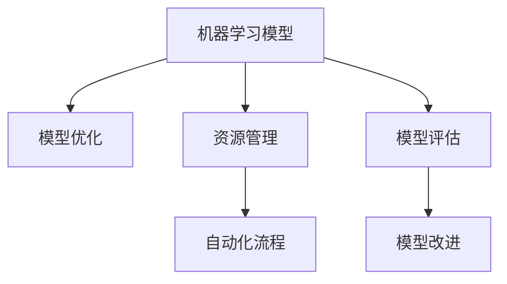

                 

# 机器学习模型部署：从开发到生产环境

> 关键词：机器学习模型, 模型部署, 生产环境, 模型优化, 资源管理, 自动化流程, 微调策略, 模型评估

## 1. 背景介绍

### 1.1 问题由来
在当今数字化和数据驱动的时代，机器学习模型在各个领域的应用越来越广泛，从金融、医疗、教育到智能制造、智慧城市，几乎无处不在。然而，构建一个高性能、可扩展的机器学习模型只是开始，如何让模型从开发环境平稳地迁移到生产环境，并且能够持续稳定运行，是数据科学家和工程师面临的重大挑战。

### 1.2 问题核心关键点
模型部署的核心在于确保模型在生产环境中的稳定性和性能，同时最大限度地利用有限的资源，避免过度消耗资源导致的运行成本和性能问题。这涉及到模型的优化、资源的合理分配、监控和运维等各个方面。

### 1.3 问题研究意义
研究模型部署的方法，对于提升模型的应用效果，降低开发和运维成本，加速AI技术的产业化进程，具有重要意义：

1. 提升模型性能：通过优化模型结构和参数，提升模型在生产环境中的执行效率和准确性。
2. 降低资源消耗：在资源受限的生产环境中，通过合理的资源管理，实现模型的最优运行。
3. 保障模型稳定：通过全面的监控和故障处理，确保模型在生产环境中的长期稳定运行。
4. 优化自动化流程：通过自动化部署和优化流程，提高模型部署的效率和可靠性。
5. 确保模型公平性：在模型部署过程中，注意避免模型的偏见和歧视，确保输出结果的公平性。

## 2. 核心概念与联系

### 2.1 核心概念概述

为更好地理解机器学习模型部署的方法，本节将介绍几个密切相关的核心概念：

- **机器学习模型(Machine Learning Model)**：基于数据训练得到的，可以自动学习并预测未知数据的模型。包括监督学习、非监督学习和强化学习等不同类型。
- **模型优化(Model Optimization)**：通过调整模型结构、参数和超参数等，提升模型的性能和效率。
- **资源管理(Resource Management)**：在模型部署过程中，对计算资源、内存资源、存储资源等进行合理配置和管理。
- **自动化流程(Automation Pipeline)**：通过脚本、工具和平台，自动化地完成模型训练、优化、部署和监控等任务。
- **模型评估(Model Evaluation)**：通过一系列指标和工具，对模型在生产环境中的表现进行评估和调整。

这些核心概念之间的逻辑关系可以通过以下Mermaid流程图来展示：



这个流程图展示了一体化模型部署的核心流程，从模型训练、优化、部署到评估和改进，各环节环环相扣，共同构成了一个完整的部署框架。

## 3. 核心算法原理 & 具体操作步骤

### 3.1 算法原理概述

机器学习模型部署的主要目标是确保模型在生产环境中的性能和稳定性，同时最小化资源消耗和部署成本。其核心思想是：通过模型优化和资源管理，实现模型在目标环境中的最佳运行。

形式化地，假设机器学习模型为 $M(x; \theta)$，其中 $x$ 为输入数据，$\theta$ 为模型参数。目标是通过一系列优化操作，使模型在生产环境 $E$ 中的运行效果达到最优，即：

$$
\maximize_{M(x; \theta), E} M(x; \theta) - \text{cost}(E)
$$

其中 $\text{cost}(E)$ 为模型在环境 $E$ 中的运行成本。

### 3.2 算法步骤详解

基于机器学习模型部署的一般流程，可以分为以下几个关键步骤：

**Step 1: 模型选择和优化**
- 根据应用场景和需求，选择合适的机器学习模型。
- 在训练集上对模型进行优化，选择最优的模型参数。

**Step 2: 资源配置和优化**
- 根据生产环境的硬件和网络资源，合理配置模型的运行参数。
- 采用资源优化技术，如模型剪枝、量化、压缩等，减小模型的资源消耗。

**Step 3: 模型部署和验证**
- 使用自动化流程将模型部署到生产环境。
- 在生产环境上验证模型的性能，确保满足业务需求。

**Step 4: 持续监控和调优**
- 在生产环境上对模型进行实时监控，检测异常和故障。
- 根据监控结果，对模型和资源配置进行定期调优。

### 3.3 算法优缺点

机器学习模型部署的主要优点：
1. 提升模型性能：通过优化模型结构和参数，模型在生产环境中的执行效率和准确性将大大提升。
2. 降低资源消耗：通过合理的资源管理，可以显著降低模型在生产环境中的运行成本。
3. 保障模型稳定：通过持续监控和调优，可以确保模型在生产环境中的长期稳定运行。
4. 加速自动化流程：通过自动化部署和优化流程，可以快速迭代模型，提升开发效率。

同时，该方法也存在一定的局限性：
1. 依赖硬件资源：模型优化和资源配置需要依赖目标环境的硬件和网络资源，部署场景受限。
2. 复杂度较高：模型优化和资源配置涉及多方面技术，需要较深的技术积累和经验。
3. 模型过度优化可能导致性能下降：过度优化模型可能导致模型在生产环境中的性能下降。
4. 模型版本管理复杂：不同版本模型在生产环境中的配置和管理较为复杂。

尽管存在这些局限性，但就目前而言，模型部署方法仍是大规模应用机器学习模型的重要手段。未来相关研究的重点在于如何进一步降低模型部署的复杂度，提升模型的通用性和可迁移性，同时兼顾性能和稳定性等因素。

### 3.4 算法应用领域

机器学习模型部署在多个领域中得到了广泛应用，例如：

- 金融风控：利用模型评估客户信用风险，筛选潜在欺诈行为。
- 医疗诊断：通过优化模型，快速准确地诊断疾病，辅助医生决策。
- 智能推荐：部署推荐模型，为电商用户推荐个性化的商品和内容。
- 智能客服：部署聊天机器人模型，提高客户咨询体验和问题解决效率。
- 智慧城市：部署交通管理模型，优化交通流量，提升城市管理效率。

除了上述这些典型应用外，机器学习模型部署还被创新性地应用到更多场景中，如实时数据分析、自然语言处理、智能合约等，为各行各业带来了新的技术突破。

## 4. 数学模型和公式 & 详细讲解 & 举例说明

### 4.1 数学模型构建

在机器学习模型部署中，数学模型主要关注模型在生产环境中的性能评估和优化。常见的评估指标包括：

- 准确率(Accuracy)：模型正确预测的比例。
- 召回率(Recall)：模型正确识别正样本的比例。
- 精确率(Precision)：模型正确识别正样本且无误判的比例。
- F1分数：精确率和召回率的调和平均数。
- AUC-ROC曲线：ROC曲线下的面积，用于评估二分类模型的性能。

假设模型 $M$ 在训练集 $D$ 上的损失函数为 $\mathcal{L}$，则模型在生产环境 $E$ 中的评估指标为：

$$
\text{Accuracy} = \frac{1}{N} \sum_{i=1}^N I[M(x_i; \theta) = y_i]
$$

其中 $N$ 为样本数，$I$ 为示性函数，$y_i$ 为真实标签。

### 4.2 公式推导过程

以二分类模型为例，假设模型 $M$ 的输出为 $M(x; \theta) = \sigma(Wx + b)$，其中 $\sigma$ 为激活函数，$W$ 和 $b$ 为模型参数。

计算准确率的公式为：

$$
\text{Accuracy} = \frac{1}{N} \sum_{i=1}^N I[M(x_i; \theta) = y_i] = \frac{1}{N} \sum_{i=1}^N \sigma(Wx_i + b) = \frac{1}{N} \sum_{i=1}^N \sigma(M(x_i; \theta))
$$

其中 $\sigma$ 为激活函数，$x_i$ 为输入数据，$y_i$ 为真实标签。

### 4.3 案例分析与讲解

假设有一个图像分类任务，模型在训练集上的准确率为 85%，如何在生产环境中提升模型性能？

**Step 1: 数据集评估**
- 在生产环境上，使用相同的测试集对模型进行评估，发现模型准确率降至75%。

**Step 2: 模型优化**
- 分析模型在生产环境中的性能下降原因，可能是模型过拟合或数据分布变化。
- 对模型进行重新训练或微调，优化模型结构或参数，减小模型复杂度。
- 对数据集进行重新分析，发现新数据集中的负样本分布发生了变化，导致模型性能下降。
- 修改数据集，增加负样本的比例，调整模型训练目标。

**Step 3: 资源优化**
- 发现模型在生产环境中的计算资源占用较高，可能导致性能下降。
- 对模型进行剪枝、量化等优化，减小模型尺寸。
- 对硬件资源进行重新配置，优化模型运行环境。

## 5. 项目实践：代码实例和详细解释说明

### 5.1 开发环境搭建

在进行模型部署实践前，我们需要准备好开发环境。以下是使用Python进行TensorFlow开发的环境配置流程：

1. 安装Anaconda：从官网下载并安装Anaconda，用于创建独立的Python环境。

2. 创建并激活虚拟环境：
```bash
conda create -n tensorflow-env python=3.7 
conda activate tensorflow-env
```

3. 安装TensorFlow：根据CUDA版本，从官网获取对应的安装命令。例如：
```bash
conda install tensorflow -c pytorch -c conda-forge
```

4. 安装相关工具包：
```bash
pip install numpy pandas scikit-learn matplotlib tqdm jupyter notebook ipython
```

完成上述步骤后，即可在`tensorflow-env`环境中开始模型部署实践。

### 5.2 源代码详细实现

这里我们以TensorFlow为例，展示一个简单的图像分类模型的部署过程。

首先，定义模型的输入和输出：

```python
import tensorflow as tf
from tensorflow import keras

# 定义模型输入
input_shape = (28, 28, 1)

# 定义模型输出
num_classes = 10

# 定义模型结构
model = keras.Sequential([
    keras.layers.Conv2D(32, (3, 3), activation='relu', input_shape=input_shape),
    keras.layers.MaxPooling2D((2, 2)),
    keras.layers.Conv2D(64, (3, 3), activation='relu'),
    keras.layers.MaxPooling2D((2, 2)),
    keras.layers.Flatten(),
    keras.layers.Dense(64, activation='relu'),
    keras.layers.Dense(num_classes, activation='softmax')
])
```

然后，加载训练数据并进行预处理：

```python
# 加载数据集
(x_train, y_train), (x_test, y_test) = keras.datasets.mnist.load_data()

# 数据预处理
x_train = x_train.reshape(x_train.shape[0], 28, 28, 1).astype('float32') / 255.0
x_test = x_test.reshape(x_test.shape[0], 28, 28, 1).astype('float32') / 255.0
y_train = keras.utils.to_categorical(y_train, num_classes)
y_test = keras.utils.to_categorical(y_test, num_classes)
```

接着，训练模型：

```python
# 定义优化器和损失函数
optimizer = keras.optimizers.Adam(lr=0.001)
loss_fn = keras.losses.categorical_crossentropy

# 训练模型
model.compile(optimizer=optimizer, loss=loss_fn, metrics=['accuracy'])
model.fit(x_train, y_train, epochs=10, validation_data=(x_test, y_test))
```

最后，进行模型评估和导出：

```python
# 模型评估
test_loss, test_acc = model.evaluate(x_test, y_test)

# 模型导出
model.save('model.h5')
```

以上就是使用TensorFlow进行模型训练、评估和部署的完整代码实现。可以看到，TensorFlow提供了丰富的API和工具，使得模型部署的代码实现变得简洁高效。

### 5.3 代码解读与分析

让我们再详细解读一下关键代码的实现细节：

**Sequential模型定义**：
- 使用Sequential模型定义线性堆叠的神经网络，适合于定义简单的全连接网络。

**数据预处理**：
- 将输入数据转换为模型可接受的格式，包括调整尺寸、归一化等。

**优化器和损失函数**：
- 选择Adam优化器和交叉熵损失函数，适合于分类任务。

**模型训练**：
- 使用compile方法配置优化器和损失函数。
- 使用fit方法训练模型，指定训练集和验证集，迭代轮数等。

**模型评估和导出**：
- 使用evaluate方法评估模型性能。
- 使用save方法将模型保存到文件中，方便部署和后续调用。

可以看出，TensorFlow的API设计非常直观，开发者可以通过简单的代码实现完整的模型训练和部署流程。同时，TensorFlow的高级API如Keras还提供了更便捷的方式，使得模型部署更加容易上手。

## 6. 实际应用场景

### 6.1 智能推荐系统

智能推荐系统是机器学习模型部署的重要应用之一。通过训练推荐模型，可以为用户推荐个性化的商品、新闻、视频等内容，提升用户体验和满意度。

在技术实现上，推荐模型通常采用协同过滤、基于内容的推荐、深度学习等方法，通过在线训练和优化，实时更新推荐结果。推荐模型的部署需要考虑高并发、低延迟的要求，通常采用分布式架构，使用GPU或TPU等高性能硬件进行加速。

### 6.2 医疗影像分析

医疗影像分析是机器学习模型部署在医疗领域的重要应用。通过训练影像分类、分割、检测等模型，可以有效辅助医生进行疾病诊断和治疗决策。

在医疗影像分析中，模型需要处理大规模的高分辨率医学影像数据，计算资源消耗较大。为了提升模型性能和减少资源消耗，通常采用模型量化、剪枝等优化技术，并在GPU集群上进行并行训练和推理。

### 6.3 智能客服系统

智能客服系统是机器学习模型部署在客户服务领域的重要应用。通过训练聊天机器人模型，可以为客户提供24小时不间断的咨询和服务，提升客户满意度。

在智能客服系统中，模型需要处理大量的自然语言输入和输出，计算资源消耗较大。为了提升模型性能和减少资源消耗，通常采用多轮对话的序列模型，使用GPU进行加速，并在云端进行部署和调用。

### 6.4 未来应用展望

随着机器学习模型和部署技术的不断发展，未来的应用前景将更加广阔。以下是几个可能的方向：

1. 联邦学习：通过分布式训练，保护数据隐私和安全，提升模型在大规模数据上的性能。
2. 边缘计算：在边缘设备上进行模型推理，减少网络延迟，提升实时性。
3. 实时数据流处理：通过实时数据流处理技术，动态更新模型，适应数据分布的变化。
4. 模型自适应：通过元学习技术，使模型能够动态调整参数，提升泛化性能。
5. 模型压缩和稀疏化：通过模型压缩和稀疏化技术，减小模型尺寸，提升计算效率。

## 7. 工具和资源推荐

### 7.1 学习资源推荐

为了帮助开发者系统掌握机器学习模型部署的理论基础和实践技巧，这里推荐一些优质的学习资源：

1. TensorFlow官方文档：TensorFlow的官方文档提供了完整的API参考、示例代码和最佳实践，是学习TensorFlow的重要资源。
2. PyTorch官方文档：PyTorch的官方文档同样提供了丰富的API参考和示例代码，适合于使用PyTorch的开发者。
3. 《深度学习入门：基于TensorFlow》书籍：由知名AI专家撰写，深入浅出地介绍了深度学习的基本概念和TensorFlow的使用方法。
4. Kaggle平台：Kaggle提供了丰富的机器学习竞赛和数据集，适合于实践和测试模型性能。
5. Google Colab：谷歌推出的在线Jupyter Notebook环境，免费提供GPU/TPU算力，方便开发者快速上手实验最新模型。

通过对这些资源的学习实践，相信你一定能够快速掌握机器学习模型部署的精髓，并用于解决实际的NLP问题。

### 7.2 开发工具推荐

高效的开发离不开优秀的工具支持。以下是几款用于机器学习模型部署开发的常用工具：

1. TensorFlow：由Google主导开发的开源深度学习框架，生产部署方便，适合大规模工程应用。
2. PyTorch：基于Python的开源深度学习框架，灵活度较高，适合于研究和原型开发。
3. Keras：基于TensorFlow和PyTorch的高级API，使得模型构建和训练更加便捷。
4. Weights & Biases：模型训练的实验跟踪工具，可以记录和可视化模型训练过程中的各项指标，方便对比和调优。
5. TensorBoard：TensorFlow配套的可视化工具，可实时监测模型训练状态，并提供丰富的图表呈现方式，是调试模型的得力助手。

合理利用这些工具，可以显著提升模型部署的开发效率，加快创新迭代的步伐。

### 7.3 相关论文推荐

机器学习模型部署涉及的文献众多，以下是几篇奠基性的相关论文，推荐阅读：

1. Deep Learning with Large Batch Sizes on GPUs（即TensorFlow论文）：提出了TensorFlow框架，详细介绍了其分布式训练和优化方法。
2. TensorFlow: A System for Large-Scale Machine Learning（即TensorFlow论文）：介绍了TensorFlow的设计理念和关键技术，是理解TensorFlow架构的重要文献。
3. TensorFlow: A Tutorial（即TensorFlow教程）：提供了TensorFlow的全面教程，适合于初学者上手学习。
4. PyTorch: An Open Source Machine Learning Library（即PyTorch论文）：介绍了PyTorch的设计理念和关键技术，是理解PyTorch架构的重要文献。
5. Super-Supervised Sequence Learning（即TextRank论文）：提出了一种基于图结构的文本相似性模型，为文本处理任务提供了新的思路。

这些论文代表了大规模机器学习模型部署技术的发展脉络。通过学习这些前沿成果，可以帮助研究者把握学科前进方向，激发更多的创新灵感。

## 8. 总结：未来发展趋势与挑战

### 8.1 总结

本文对机器学习模型部署的方法进行了全面系统的介绍。首先阐述了模型部署的重要性，明确了模型部署在提升模型性能、降低成本、保障稳定性等方面的独特价值。其次，从原理到实践，详细讲解了模型部署的数学原理和关键步骤，给出了模型部署任务开发的完整代码实例。同时，本文还广泛探讨了模型部署在推荐系统、医疗影像分析、智能客服等多个行业领域的应用前景，展示了模型部署范式的巨大潜力。此外，本文精选了模型部署技术的各类学习资源，力求为读者提供全方位的技术指引。

通过本文的系统梳理，可以看到，机器学习模型部署在大规模应用中扮演了重要角色，成为推动AI技术产业化的重要手段。未来，伴随模型优化技术的发展和部署工具的演进，相信机器学习模型将在更广阔的应用领域大放异彩，深刻影响人类社会的方方面面。

### 8.2 未来发展趋势

展望未来，机器学习模型部署将呈现以下几个发展趋势：

1. 模型优化技术将更加自动化和智能化。通过自动化调参、自适应优化等技术，使得模型优化过程更加高效和可靠。
2. 模型资源管理将更加动态和灵活。通过动态资源调度、资源池化等技术，使得模型在资源受限的环境下仍能高效运行。
3. 模型部署将更加安全可靠。通过安全加固、隐私保护等技术，确保模型在生产环境中的安全性和可靠性。
4. 模型版本管理将更加精细和高效。通过版本控制、模型注册等技术，使得模型部署和更新更加可控和透明。
5. 模型部署将更加兼容和开放。通过标准化接口、跨平台部署等技术，使得模型部署更加灵活和便捷。

以上趋势凸显了机器学习模型部署技术的广阔前景。这些方向的探索发展，必将进一步提升机器学习模型在生产环境中的性能和应用范围，为人工智能技术的落地应用提供坚实保障。

### 8.3 面临的挑战

尽管机器学习模型部署技术已经取得了显著进展，但在迈向更加智能化、普适化应用的过程中，它仍面临着诸多挑战：

1. 硬件资源限制：模型优化和资源配置需要依赖目标环境的硬件资源，部署场景受限。
2. 模型部署复杂度较高：模型优化和资源配置涉及多方面技术，需要较深的技术积累和经验。
3. 模型性能下降风险：过度优化模型可能导致性能下降，需要进行反复调优。
4. 模型版本管理复杂：不同版本模型在生产环境中的配置和管理较为复杂。
5. 模型安全性和隐私问题：模型在生产环境中的安全性和隐私保护需要得到充分保障。

尽管存在这些挑战，但通过不断的技术创新和实践积累，相信机器学习模型部署技术将不断突破瓶颈，走向成熟。未来，在模型优化、资源管理、自动化流程等方面还有很大的发展空间，机器学习模型部署将在构建安全、可靠、高效的智能系统中扮演越来越重要的角色。

### 8.4 研究展望

未来的研究需要从以下几个方面寻求新的突破：

1. 自动化模型优化技术：通过自动化调参、自适应优化等技术，使得模型优化过程更加高效和可靠。
2. 动态资源管理技术：通过动态资源调度、资源池化等技术，使得模型在资源受限的环境下仍能高效运行。
3. 模型安全和隐私保护：通过安全加固、隐私保护等技术，确保模型在生产环境中的安全性和隐私保护。
4. 模型版本管理技术：通过版本控制、模型注册等技术，使得模型部署和更新更加可控和透明。
5. 跨平台部署技术：通过标准化接口、跨平台部署等技术，使得模型部署更加灵活和便捷。

这些研究方向的探索，必将引领机器学习模型部署技术迈向更高的台阶，为构建安全、可靠、可解释、可控的智能系统铺平道路。面向未来，机器学习模型部署技术还需要与其他人工智能技术进行更深入的融合，如知识表示、因果推理、强化学习等，多路径协同发力，共同推动人工智能技术的发展。只有勇于创新、敢于突破，才能不断拓展机器学习模型部署的边界，让智能技术更好地造福人类社会。

## 9. 附录：常见问题与解答

**Q1：模型部署过程中如何降低资源消耗？**

A: 模型部署过程中降低资源消耗的方法包括：
1. 模型优化：通过剪枝、量化、压缩等技术，减小模型尺寸和计算量。
2. 资源管理：合理配置计算资源、内存资源、存储资源等，避免资源浪费。
3. 并行训练和推理：采用分布式训练和推理，利用多核和GPU等硬件加速。

**Q2：模型部署过程中如何保证模型稳定性？**

A: 模型部署过程中保证模型稳定性的方法包括：
1. 持续监控：实时监测模型运行状态，及时发现异常和故障。
2. 异常处理：针对异常情况，设置容错机制和应急处理策略。
3. 定期调优：根据监控结果，定期调整模型和资源配置。

**Q3：模型部署过程中如何确保模型安全性和隐私保护？**

A: 模型部署过程中确保模型安全性和隐私保护的方法包括：
1. 数据加密：对敏感数据进行加密处理，防止数据泄露。
2. 安全加固：对模型进行安全加固，防止恶意攻击。
3. 隐私保护：采用差分隐私、联邦学习等技术，保护用户隐私。

**Q4：模型部署过程中如何进行自动化调优？**

A: 模型部署过程中进行自动化调优的方法包括：
1. 自动化调参：使用自动化调参工具，自动搜索最优模型参数。
2. 自适应优化：使用自适应优化算法，动态调整模型参数。
3. 在线优化：在生产环境中进行在线优化，实时更新模型。

**Q5：模型部署过程中如何进行版本管理？**

A: 模型部署过程中进行版本管理的方法包括：
1. 版本控制：使用版本控制系统，记录模型版本信息。
2. 模型注册：使用模型注册系统，管理模型版本和更新。
3. 版本回滚：在出现问题时，及时回滚到之前的版本，避免影响生产环境。

通过对这些常见问题的解答，相信你一定能够更好地理解和掌握机器学习模型部署的精髓，并用于解决实际的NLP问题。

---

作者：禅与计算机程序设计艺术 / Zen and the Art of Computer Programming

