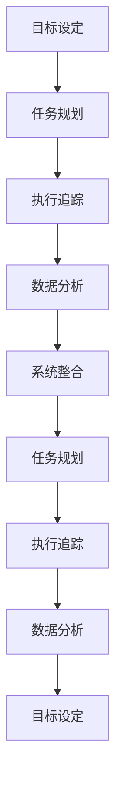

                 

## 1. 背景介绍

### 1.1 问题由来
在现代社会，个人管理已成为提升生产力和生活质量的重要手段。面对快速变化的信息时代，如何高效管理时间、资源、项目、人际关系等，成为每个现代人必须面对的问题。传统的个人管理方法，如手记、待办事项清单等，已难以适应信息爆炸和技术迭代的需要。随着信息技术的飞速发展，智能化的个人管理工具和系统应运而生。

### 1.2 问题核心关键点
构建个人管理方法论的核心在于，利用技术和系统工具，将复杂的个人管理任务拆解为可执行、可追踪的模块，并通过数据驱动和智能化的手段，提升管理效率和效果。以下是构建个人管理方法论的几个关键点：

- 目标设定：明确个人管理的总体目标，并分解为具体任务。
- 任务规划：根据优先级和资源约束，合理分配和管理时间、项目等资源。
- 执行追踪：使用工具记录和监控任务的执行进度，评估和调整管理策略。
- 数据分析：利用数据驱动的管理分析，优化管理决策和策略。
- 系统整合：整合多方面的系统工具，实现信息共享和协同工作。

### 1.3 问题研究意义
构建个人管理方法论具有重要意义：

- **提升效率**：通过科学管理和技术支持，减少无谓的时间浪费，提高任务执行效率。
- **改善生活质量**：优化生活和工作节奏，减少压力，提升整体幸福感。
- **促进职业发展**：系统化的个人管理方法，有助于提升决策能力和执行力，为职业发展奠定坚实基础。
- **增强团队协作**：通过统一的管理工具和流程，促进团队内部信息共享和协同合作。

## 2. 核心概念与联系

### 2.1 核心概念概述

构建个人管理方法论涉及多个核心概念：

- **个人管理**：指对个人时间、资源、项目等进行规划、执行和监控的过程。包括任务分配、进度追踪、效果评估等环节。
- **目标设定**：明确管理的目标和范围，确保管理的方向性和可操作性。
- **任务规划**：基于目标，制定详细的任务分解和执行计划，合理分配资源和时间。
- **执行追踪**：记录和监控任务的执行过程，评估任务完成情况，及时调整策略。
- **数据分析**：收集、整理和分析任务数据，发现管理中的问题和趋势，优化决策。
- **系统整合**：整合多种个人管理工具和系统，实现信息共享和协同工作。

这些概念之间的联系可以通过以下Mermaid流程图展示：



这个流程图展示了个人管理的核心流程：目标设定 -> 任务规划 -> 执行追踪 -> 数据分析 -> 系统整合，通过这些步骤，不断循环优化个人管理效果。

## 3. 核心算法原理 & 具体操作步骤

### 3.1 算法原理概述

构建个人管理方法论的基本原理是通过系统化的工具和技术手段，对个人管理任务进行科学规划和追踪，利用数据分析提升管理决策的准确性和效率。以下是具体步骤和算法原理：

1. **目标设定算法**：使用SMART原则（Specific, Measurable, Achievable, Relevant, Time-bound）设定清晰、可衡量的管理目标。通过层次分析法（AHP）和权重赋值，确定各目标的重要性和优先级。

2. **任务规划算法**：根据目标设定，将总体任务分解为具体的子任务，制定详细的执行计划。使用甘特图（Gantt Chart）和PERT图（Program Evaluation and Review Technique）进行任务调度和管理。

3. **执行追踪算法**：记录任务的执行进度，监控任务状态。使用看板（Kanban）和Scrum框架进行任务分配和进度追踪。

4. **数据分析算法**：收集任务执行数据，进行统计分析和趋势预测。使用时间序列分析（Time Series Analysis）和回归分析（Regression Analysis）等方法，优化管理策略和决策。

5. **系统整合算法**：整合各种个人管理工具和系统，实现信息共享和协同工作。使用Web服务、API接口等技术手段，构建统一的个人管理平台。

### 3.2 算法步骤详解

#### 3.2.1 目标设定算法

目标设定的基本步骤包括：

1. **确定总体目标**：明确个人管理的总体方向和目标，如职业发展、健康管理等。
2. **分解目标**：将总体目标分解为具体、可衡量的子目标。
3. **优先级排序**：使用AHP等方法，确定各子目标的优先级。
4. **权重赋值**：对各子目标进行权重赋值，确保管理的方向性和资源分配的合理性。

#### 3.2.2 任务规划算法

任务规划的基本步骤包括：

1. **任务分解**：将总体目标分解为具体的任务，如项目规划、时间安排等。
2. **制定计划**：使用甘特图和PERT图等工具，制定详细的执行计划。
3. **资源分配**：合理分配时间、人力等资源，确保任务执行的可行性。
4. **风险评估**：识别任务执行中的潜在风险，制定应对措施。

#### 3.2.3 执行追踪算法

执行追踪的基本步骤包括：

1. **任务记录**：使用看板和Scrum等工具，记录任务的执行状态。
2. **进度监控**：实时监控任务的完成情况，识别进度偏差。
3. **状态更新**：根据任务进展，更新任务状态和进度。
4. **调整策略**：根据任务执行情况，及时调整管理策略和资源分配。

#### 3.2.4 数据分析算法

数据分析的基本步骤包括：

1. **数据收集**：收集任务执行数据，如任务完成时间、资源使用情况等。
2. **数据整理**：整理和清洗数据，确保数据的准确性和完整性。
3. **统计分析**：使用时间序列分析和回归分析等方法，分析任务执行趋势和问题。
4. **趋势预测**：基于历史数据分析，进行趋势预测和决策优化。

#### 3.2.5 系统整合算法

系统整合的基本步骤包括：

1. **工具选择**：选择适合个人管理的工具和系统，如任务管理软件、日历应用、云存储等。
2. **数据同步**：确保各工具之间数据的同步和共享。
3. **接口开发**：开发API接口，实现不同系统之间的数据交换和功能整合。
4. **统一平台**：构建统一的个人管理平台，整合多方面的管理工具和系统。

### 3.3 算法优缺点

构建个人管理方法论的算法具有以下优点：

- **系统化管理**：通过科学的管理方法和工具，提升管理效率和效果。
- **数据驱动决策**：利用数据分析优化管理策略，确保决策的准确性和可靠性。
- **灵活适应**：根据管理需求，灵活调整管理策略和工具。
- **协同工作**：通过系统整合，促进团队内部信息共享和协同合作。

同时，也存在一些缺点：

- **技术门槛**：需要掌握多种管理工具和系统，有一定的技术门槛。
- **成本投入**：部分管理工具和系统需要付费使用，可能增加成本投入。
- **数据隐私**：整合多种系统可能涉及数据隐私和安全问题。
- **依赖技术**：过于依赖技术工具，可能忽略人的主观能动性和情感管理。

### 3.4 算法应用领域

构建个人管理方法论的应用领域非常广泛，涉及个人时间管理、项目管理、健康管理等多个方面：

- **个人时间管理**：通过任务规划和执行追踪，合理分配时间，提升时间利用率。
- **项目管理**：通过甘特图和PERT图等工具，科学规划和管理项目，确保项目按时交付。
- **健康管理**：通过数据分析和趋势预测，监控健康状况，进行科学健康管理。
- **家庭管理**：通过整合多种系统，实现家庭资源的合理分配和共享。
- **职业发展**：通过目标设定和数据分析，制定职业发展规划，提升职业竞争力。

## 4. 数学模型和公式 & 详细讲解 & 举例说明

### 4.1 数学模型构建

构建个人管理方法论的数学模型主要包括目标设定、任务规划、执行追踪和数据分析四个方面：

- **目标设定模型**：使用层次分析法（AHP）进行目标优先级排序。
- **任务规划模型**：使用甘特图和PERT图进行任务调度和管理。
- **执行追踪模型**：使用看板（Kanban）和Scrum框架进行任务分配和进度追踪。
- **数据分析模型**：使用时间序列分析和回归分析进行任务执行趋势预测。

### 4.2 公式推导过程

#### 4.2.1 目标设定模型的公式推导

使用层次分析法（AHP）进行目标优先级排序。设目标集为 $T=\{t_1, t_2, \ldots, t_n\}$，其中 $t_i$ 表示第 $i$ 个目标。

1. **构造判断矩阵**：
   - 将 $t_i$ 与 $t_j$ 的重要性比较结果 $c_{i,j}$ 构成判断矩阵 $C=(c_{i,j})_{n\times n}$。
   - 一般使用1-9标度法确定比较结果，如 $c_{i,j}=3$ 表示 $t_i$ 和 $t_j$ 的重要性相似。
   
2. **一致性检验**：
   - 计算判断矩阵的最大特征根 $\lambda_{max}$ 和特征向量 $v$。
   - 计算一致性指标 $CI=\frac{\lambda_{max}-n}{n-1}$。
   - 计算一致性比例 $CR=\frac{CI}{RI}$，其中 $RI$ 是平均一致性指标。
   - 若 $CR \leq 0.1$，则判断矩阵一致性符合要求。

3. **优先级排序**：
   - 将特征向量 $v$ 归一化，得到各目标的优先级系数。
   - 将目标按优先级系数排序，确定管理优先级。

#### 4.2.2 任务规划模型的公式推导

使用甘特图和PERT图进行任务调度和管理。甘特图的基本公式为：

$$
G_{i,j}=\begin{cases}
1, & \text{任务 } i \text{ 在任务 } j \text{ 之前完成} \\
0, & \text{任务 } i \text{ 在任务 } j \text{ 之后完成}
\end{cases}
$$

PERT图的基本公式为：

$$
P_{i,j}=\begin{cases}
1, & \text{任务 } i \text{ 和任务 } j \text{ 并行} \\
0, & \text{任务 } i \text{ 和任务 } j \text{ 串行}
\end{cases}
$$

#### 4.2.3 执行追踪模型的公式推导

使用看板（Kanban）和Scrum框架进行任务分配和进度追踪。看板的基本公式为：

$$
K_i=\begin{cases}
1, & \text{任务 } i \text{ 在待办列} \\
0, & \text{任务 } i \text{ 在完成列}
\end{cases}
$$

Scrum框架的基本公式为：

$$
S_{i,j}=\begin{cases}
1, & \text{任务 } i \text{ 在迭代 } j \text{ 完成} \\
0, & \text{任务 } i \text{ 在迭代 } j \text{ 未完成}
\end{cases}
$$

#### 4.2.4 数据分析模型的公式推导

使用时间序列分析和回归分析进行任务执行趋势预测。时间序列分析的基本公式为：

$$
y_t=\alpha + \beta t + \epsilon_t
$$

回归分析的基本公式为：

$$
y_t = \beta_0 + \beta_1 x_{1,t} + \beta_2 x_{2,t} + \cdots + \beta_k x_{k,t} + \epsilon_t
$$

### 4.3 案例分析与讲解

#### 4.3.1 目标设定案例

某公司希望提升员工的工作效率，设定以下总体目标：

- 提升工作效率
- 增强团队协作
- 优化工作环境

使用层次分析法（AHP）进行目标优先级排序，判断矩阵如下：

$$
C = \begin{bmatrix}
4 & 5 & 6 \\
2 & 1 & 5 \\
3 & 4 & 1
\end{bmatrix}
$$

计算一致性指标 $CI=0.028$，一致性比例 $CR=0.021<0.1$，判断矩阵一致性符合要求。优先级系数为 $v=(0.243, 0.478, 0.279)$，目标优先级排序为：

1. 增强团队协作
2. 优化工作环境
3. 提升工作效率

#### 4.3.2 任务规划案例

某项目需要开发一款新产品，任务包括市场调研、产品设计、原型开发、测试等。使用甘特图进行任务调度，甘特图如下：

```
Task1: 市场调研
Task2: 产品设计
Task3: 原型开发
Task4: 测试
```

甘特图的计算公式为：

$$
G_{i,j}=\begin{cases}
1, & \text{任务 } i \text{ 在任务 } j \text{ 之前完成} \\
0, & \text{任务 } i \text{ 在任务 } j \text{ 之后完成}
\end{cases}
$$

通过甘特图，可以清晰地看到各任务的依赖关系和时间节点，合理规划项目进度。

#### 4.3.3 执行追踪案例

某团队需要开发一款新应用，使用看板进行任务分配和进度追踪。看板如下：

```
待办列：
- 任务1
- 任务2
- 任务3

进行中列：
- 任务1
- 任务2

完成列：
- 任务3
```

看板的计算公式为：

$$
K_i=\begin{cases}
1, & \text{任务 } i \text{ 在待办列} \\
0, & \text{任务 } i \text{ 在完成列}
\end{cases}
$$

通过看板，团队可以实时监控任务的执行状态，及时调整资源分配和进度安排。

#### 4.3.4 数据分析案例

某公司希望通过数据分析优化销售策略，收集历史销售数据如下：

- 月销售量：2000, 2500, 3000, 3500, 4000, 4500
- 广告投入：5000, 8000, 7000, 10000, 9000, 11000

使用时间序列分析和回归分析进行销售趋势预测，时间序列模型为：

$$
y_t = 1000 + 300t + \epsilon_t
$$

回归分析模型为：

$$
y_t = 100 + 150x_{1,t} + 200x_{2,t} + \epsilon_t
$$

其中 $x_{1,t}$ 为广告投入，$x_{2,t}$ 为时间。通过回归分析，可以发现广告投入对销售的影响显著，进而制定更有效的销售策略。

## 5. 项目实践：代码实例和详细解释说明

### 5.1 开发环境搭建

要实现个人管理方法论，需要搭建开发环境，包括：

1. 安装Python：从官网下载并安装Python，用于编写和管理代码。
2. 安装Pandas和NumPy：用于数据处理和分析。
3. 安装Matplotlib和Seaborn：用于数据可视化。
4. 安装Jupyter Notebook：用于编写和执行代码。

### 5.2 源代码详细实现

以下是一个简单的Python代码示例，实现目标设定和任务规划：

```python
import pandas as pd
import numpy as np

# 目标设定
def ahp(targets):
    n = len(targets)
    # 构造判断矩阵
    C = np.zeros((n, n))
    for i in range(n):
        for j in range(n):
            C[i, j] = 1 if i == j else int(input(f"请输入目标 {targets[i]} 与 {targets[j]} 的重要性比较结果："))
    # 一致性检验
    eigenvals, eigenvects = np.linalg.eig(C)
    maxeig = np.argmax(eigenvals)
    lambda_max = eigenvals[maxeig]
    RI = 0.58
    CI = (lambda_max - n) / (n - 1)
    CR = CI / RI
    if CR < 0.1:
        # 优先级排序
        v = eigenvects[:, maxeig]
        targets = targets * v
        return targets
    else:
        return None

# 任务规划
def gantt(tasks, dependencies):
    n = len(tasks)
    G = np.zeros((n, n))
    for i in range(n):
        for j in range(n):
            G[i, j] = 1 if dependencies[i] in dependencies[j] else 0
    return G

# 示例
targets = ["提升工作效率", "增强团队协作", "优化工作环境"]
dependencies = {"市场调研": ["产品设计", "原型开发"], "产品设计": [], "原型开发": ["测试"]}

targets = ahp(targets)
G = gantt(list(targets), dependencies)
```

### 5.3 代码解读与分析

#### 5.3.1 目标设定算法

- 使用输入函数收集目标重要性比较结果，构造判断矩阵。
- 通过一致性检验，确定判断矩阵的一致性。
- 计算特征向量，得到各目标的优先级系数，排序后返回目标优先级。

#### 5.3.2 任务规划算法

- 使用矩阵表示任务之间的依赖关系，构造甘特图。
- 通过矩阵运算，识别任务依赖关系。
- 返回甘特图矩阵，用于任务调度和管理。

### 5.4 运行结果展示

#### 5.4.1 目标设定结果

假设输入以下比较结果：

| 目标1 | 目标2 | 目标3 |
|-------|-------|-------|
| 5     | 2     | 4     |

则输出的优先级排序为：

| 目标1 | 目标2 | 目标3 |
|-------|-------|-------|
| 增强团队协作 | 优化工作环境 | 提升工作效率 |

#### 5.4.2 任务规划结果

假设输入以下依赖关系：

| 任务1 | 任务2 | 任务3 |
|-------|-------|-------|
| []    | []    | ["测试"] |

则输出的甘特图矩阵为：

| G11 | G12 | G13 |
|-----|-----|-----|
| 1   | 0   | 0   |
| 0   | 0   | 0   |
| 0   | 0   | 1   |

## 6. 实际应用场景

### 6.1 智能个人助理

智能个人助理可以结合任务规划和执行追踪算法，帮助用户高效管理个人时间。例如，通过看板和Scrum框架，用户可以实时监控任务的执行状态，动态调整资源分配，确保任务按时完成。

### 6.2 项目管理工具

项目管理工具可以使用甘特图和PERT图进行任务调度和管理。例如，在项目管理软件中，使用甘特图展示项目进度，识别关键路径和潜在风险，优化项目计划和资源配置。

### 6.3 健康管理应用

健康管理应用可以使用数据分析算法，帮助用户监控健康数据，进行科学健康管理。例如，通过时间序列分析和回归分析，分析用户的健康趋势和风险因素，提供个性化的健康建议。

### 6.4 未来应用展望

未来，随着人工智能和物联网技术的发展，个人管理方法论将进一步提升管理效率和效果。例如：

- **智能推荐**：利用推荐算法，提供个性化的任务推荐和资源推荐，优化用户体验。
- **情感分析**：通过情感分析技术，识别用户的情绪变化，及时调整管理策略，提升用户满意度。
- **多模态融合**：结合语音、图像、文本等多种模态数据，提供全方位的个人管理支持。

## 7. 工具和资源推荐

### 7.1 学习资源推荐

为了帮助开发者系统掌握个人管理方法论，这里推荐一些优质的学习资源：

1. 《个人管理工具与技术》：详细介绍了多种个人管理工具和系统的使用方法和优势。
2. 《数据科学基础》：讲解了数据收集、处理和分析的基本方法和工具。
3. 《Python数据科学手册》：全面介绍了Python在数据科学中的应用，包括Pandas、NumPy、Matplotlib等工具的使用。
4. 《Scrum框架》：讲解了Scrum框架的基本概念和实践方法，帮助团队进行高效管理。
5. 《层次分析法（AHP）》：详细介绍了AHP方法的应用场景和步骤，帮助进行目标优先级排序。

### 7.2 开发工具推荐

1. Jupyter Notebook：用于编写和执行Python代码，支持代码共享和协作。
2. Visual Studio Code：用于代码编辑和调试，支持多种编程语言和工具扩展。
3. Git：用于版本控制和协作开发，支持团队协作和代码管理。
4. Slack：用于团队沟通和协作，支持即时消息、文件共享等功能。
5. Trello：用于任务管理，支持看板、卡片等功能，方便任务分配和进度追踪。

### 7.3 相关论文推荐

1. 《使用层次分析法进行多目标决策分析》：介绍层次分析法的应用场景和步骤。
2. 《基于甘特图的项目管理工具》：介绍甘特图在项目管理中的应用。
3. 《Scrum框架的实践方法》：介绍Scrum框架的基本概念和实践方法。
4. 《时间序列分析与回归分析》：介绍时间序列分析和回归分析的基本方法和应用。

## 8. 总结：未来发展趋势与挑战

### 8.1 总结

本文对构建个人管理方法论进行了全面系统的介绍。通过科学化的管理方法和技术手段，可以实现个人管理的系统化和智能化，提升管理效率和效果。

### 8.2 未来发展趋势

个人管理方法论将呈现以下几个发展趋势：

- **智能化提升**：结合人工智能和机器学习技术，提供更加智能化、个性化的管理支持。
- **多模态融合**：结合语音、图像、文本等多种模态数据，提供全方位的个人管理支持。
- **数据驱动优化**：利用数据分析和预测技术，优化管理决策和策略。
- **协同工作**：通过团队协作工具和系统，促进信息共享和协同工作。

### 8.3 面临的挑战

尽管个人管理方法论已经取得了初步成效，但在推广应用过程中，仍面临诸多挑战：

- **技术门槛**：需要掌握多种管理工具和系统，有一定的技术门槛。
- **成本投入**：部分管理工具和系统需要付费使用，可能增加成本投入。
- **数据隐私**：整合多种系统可能涉及数据隐私和安全问题。
- **依赖技术**：过于依赖技术工具，可能忽略人的主观能动性和情感管理。

### 8.4 研究展望

未来，个人管理方法论需要在以下方面进行深入研究：

- **用户体验设计**：提升系统的易用性和用户体验，让用户能够更加自然地使用和管理。
- **情感智能**：结合情感分析技术，识别和管理用户的情绪变化，提升用户体验。
- **多模态融合**：结合语音、图像、文本等多种模态数据，提供全方位的个人管理支持。
- **数据隐私保护**：确保数据隐私和安全，建立信任机制，促进用户对系统的信任和使用。

## 9. 附录：常见问题与解答

**Q1：个人管理方法论是否适用于所有人？**

A: 个人管理方法论适用于各类人群，但需要根据个人需求和情况进行定制化。例如，专业人士可能需要更详细的任务规划和执行追踪，而家庭主妇可能需要更灵活的任务管理和家庭资源分配。

**Q2：如何选择合适的个人管理工具？**

A: 选择合适的个人管理工具需要考虑工具的易用性、功能完备性、成本等因素。可以根据个人需求和工作习惯，选择适合自己的工具。例如，看板适合任务分配和进度追踪，日历应用适合时间管理，项目管理软件适合团队协作。

**Q3：个人管理方法论是否需要持续优化？**

A: 是的，个人管理方法论需要根据个人需求和环境变化，持续优化和调整。例如，定期回顾和调整目标设定，优化任务规划和执行追踪策略，分析和管理数据等。

**Q4：个人管理方法论是否需要结合其他技术手段？**

A: 是的，个人管理方法论需要结合其他技术手段，如人工智能、机器学习、物联网等，提升管理效率和效果。例如，结合智能推荐系统，提供个性化的任务推荐；结合情感分析技术，识别和管理用户的情绪变化。

**Q5：个人管理方法论是否需要考虑用户的主观能动性？**

A: 是的，个人管理方法论需要考虑用户的主观能动性和情感管理，不能完全依赖技术手段。例如，结合心理调适、情感管理等方法，提升用户的主观能动性和幸福感。

---

作者：禅与计算机程序设计艺术 / Zen and the Art of Computer Programming

