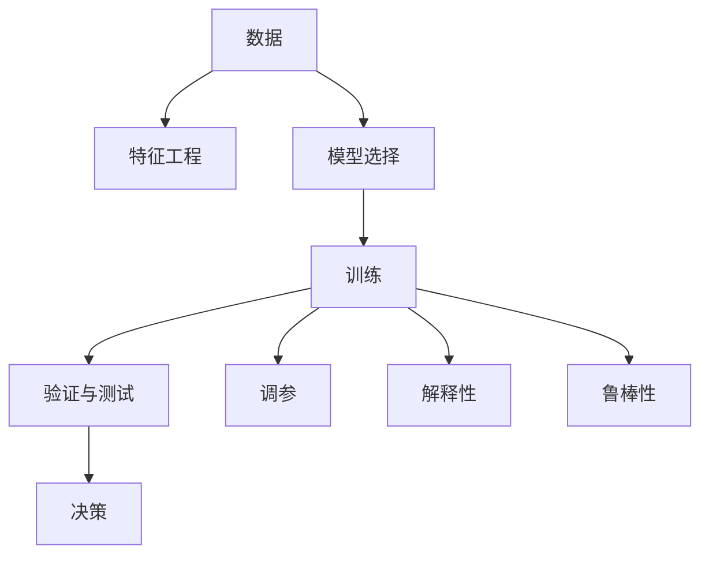

                 

# 模型思维在决策中的应用

## 1. 背景介绍

在现代社会中，数据和模型正逐渐成为决策的重要支柱。无论是企业决策、政策制定还是个人选择，模型思维都在其中扮演着不可或缺的角色。随着大数据和人工智能技术的飞速发展，模型在金融、医疗、教育等各个领域的决策过程中，发挥着越来越重要的作用。模型不仅可以帮助我们发现数据中的规律，还能预测未来的趋势，从而做出更科学、更精准的决策。

模型思维的应用，本质上是一种以数据为基础，以模型为工具，以预测为目的的决策方式。它强调用定量的方法，通过建模、训练和测试，不断优化模型，最终得到可行的决策方案。这种思维方式，要求决策者不仅要有数据敏感度，还要具备一定的数学和算法知识。

本文将详细介绍模型思维的原理、操作步骤以及其在决策中的应用，旨在为决策者提供一种科学、系统的决策方法，帮助他们在复杂多变的环境中做出更为准确的决策。

## 2. 核心概念与联系

### 2.1 核心概念概述

模型思维涉及多个核心概念，这些概念相互关联，共同构成了模型思维的基础框架：

- **数据**：数据是模型思维的基础，是模型输入的主要来源。高质量的数据能够帮助模型更好地学习规律，做出准确的预测。
- **特征工程**：在构建模型之前，需要从原始数据中提取有用特征，减少噪音和冗余，提升模型的预测能力。
- **模型选择**：根据具体问题和数据特性，选择合适的模型进行建模，如线性回归、决策树、神经网络等。
- **训练**：通过大量标注数据训练模型，优化模型参数，使其能够准确地进行预测。
- **验证与测试**：使用独立的验证集和测试集评估模型的性能，避免模型过拟合。
- **调参**：根据验证结果，调整模型的超参数，如学习率、正则化强度等，以提升模型性能。
- **解释性**：模型的解释性是指模型的决策过程是否可以理解和解释，这对于金融、医疗等高风险领域的决策尤为重要。
- **鲁棒性**：模型的鲁棒性是指模型对噪声和异常值的不敏感性，这对于模型的泛化能力和决策可靠性至关重要。

这些概念之间的逻辑关系可以通过以下Mermaid流程图来展示：



这个流程图展示模型思维的主要流程：

1. 数据收集和预处理。
2. 特征工程，从数据中提取有意义的特征。
3. 选择合适的模型进行训练。
4. 通过验证集调整模型参数，提升模型性能。
5. 测试集验证模型泛化能力。
6. 根据验证结果进行调参优化。
7. 评估模型解释性和鲁棒性。
8. 最终在实际决策中使用模型。

## 3. 核心算法原理 & 具体操作步骤

### 3.1 算法原理概述

模型思维的原理可以概括为数据驱动决策。模型通过学习历史数据，发现其中的规律，然后利用这些规律对未来数据进行预测和决策。模型思维的核心是数据和算法，通过合理的建模、训练和验证过程，得出可靠的预测结果。

在模型思维中，数据的收集和预处理是非常关键的步骤。数据的有效性和质量直接影响模型的预测效果。特征工程的目的是从原始数据中提取出有意义的特征，这些特征能够提高模型的泛化能力和预测准确性。模型选择和训练的过程是通过数据和特征训练出一个能够在未来数据上取得良好预测结果的模型。验证和测试的目的是评估模型的泛化能力和鲁棒性，确保模型在未知数据上的表现。调参的目的是通过调整模型参数，提升模型的预测精度和泛化能力。模型的解释性和鲁棒性是确保模型在实际应用中的可靠性和有效性的重要指标。

### 3.2 算法步骤详解

#### 3.2.1 数据收集和预处理

1. **数据收集**：确定数据收集目标，收集相关数据。数据可以从外部数据库、API接口、传感器等渠道获取。

2. **数据清洗**：去除缺失值、异常值和噪音数据，确保数据的完整性和准确性。

3. **特征提取**：从原始数据中提取有意义的特征。特征提取的方法包括统计特征、时间特征、文本特征等。

#### 3.2.2 特征工程

1. **特征选择**：从提取的特征中选择对目标变量有较强相关性的特征，减少特征维度，避免过拟合。

2. **特征转换**：对特征进行转换，如对数值特征进行归一化、对分类特征进行独热编码等。

3. **特征组合**：通过特征组合，创建新的特征，提高模型的预测能力。

#### 3.2.3 模型选择

1. **模型选择**：根据问题的类型和数据特性，选择合适的模型。线性回归、决策树、随机森林、神经网络等模型都有不同的应用场景。

2. **模型训练**：使用训练数据集训练模型，调整模型参数，使模型能够准确预测。

#### 3.2.4 验证与测试

1. **验证集**：将数据集分为训练集、验证集和测试集，使用验证集评估模型的性能。

2. **模型调参**：根据验证集的结果，调整模型参数，如学习率、正则化强度等。

3. **模型测试**：在测试集上评估模型的泛化能力，确保模型在未知数据上的表现。

#### 3.2.5 调参

1. **超参数调整**：根据验证集的结果，调整模型的超参数，如学习率、正则化强度、模型结构等。

2. **模型选择**：根据验证集的结果，选择表现最优的模型。

3. **模型集成**：通过集成多个模型的预测结果，提升模型的性能。

#### 3.2.6 解释性和鲁棒性

1. **模型解释性**：通过解释模型的决策过程，帮助决策者理解模型的预测结果，增加模型的可信度。

2. **模型鲁棒性**：通过评估模型对异常值和噪声的敏感性，确保模型的泛化能力和决策可靠性。

### 3.3 算法优缺点

#### 3.3.1 优点

1. **数据驱动**：模型思维强调数据的重要性，通过数据驱动决策，能够发现数据中的规律，做出更准确的预测。

2. **可量化**：模型思维的决策过程是量化的，通过数学和算法工具，可以进行科学的评估和优化。

3. **可复制性**：模型的训练和评估过程是可重复的，能够通过不断优化模型，提高预测准确性。

4. **透明性**：模型的决策过程可以通过解释性分析，增加决策的透明性和可信度。

#### 3.3.2 缺点

1. **数据依赖**：模型思维高度依赖数据质量，数据不足或数据质量不高都会影响模型的预测效果。

2. **模型复杂**：一些复杂的模型，如深度学习模型，训练过程复杂，需要大量的计算资源。

3. **模型解释性**：一些复杂的模型，如深度学习模型，难以解释其决策过程，增加了决策的复杂性。

4. **模型鲁棒性**：模型对异常值和噪声的敏感性，会影响模型的泛化能力和决策可靠性。

### 3.4 算法应用领域

模型思维在金融、医疗、教育等各个领域都有广泛的应用：

#### 3.4.1 金融领域

1. **风险评估**：通过模型评估金融产品的风险，预测风险水平。

2. **股票预测**：使用模型预测股票价格走势，辅助投资决策。

3. **信用评分**：使用模型评估客户的信用水平，帮助金融机构进行贷款审批。

#### 3.4.2 医疗领域

1. **疾病预测**：通过模型预测疾病的发生概率，早期发现疾病，进行预防和治疗。

2. **治疗方案优化**：使用模型评估治疗方案的效果，优化治疗方案，提升治疗效果。

3. **医疗费用预测**：通过模型预测医疗费用，辅助医疗费用的管理和控制。

#### 3.4.3 教育领域

1. **学生表现预测**：通过模型预测学生的学习成绩，帮助教师制定教学策略。

2. **课程推荐**：使用模型推荐适合学生的课程，提高学生的学习效果。

3. **教学效果评估**：使用模型评估教师的教学效果，提升教学质量。

## 4. 数学模型和公式 & 详细讲解 & 举例说明

### 4.1 数学模型构建

在模型思维中，数学模型是决策的核心工具。一个典型的数学模型通常包含以下几个部分：

1. **输入变量**：模型的输入变量，即需要预测或决策的数据。

2. **输出变量**：模型的输出变量，即预测或决策的结果。

3. **模型函数**：表示输入变量与输出变量之间的关系，通常使用函数形式表示。

4. **模型参数**：模型中的可调参数，通过训练数据调整。

5. **损失函数**：评估模型预测结果与真实结果之间的差距，通常使用平方误差、交叉熵等损失函数。

6. **优化算法**：通过优化算法，最小化损失函数，调整模型参数。

### 4.2 公式推导过程

以线性回归模型为例，其数学模型可以表示为：

$$
y = \beta_0 + \beta_1 x_1 + \beta_2 x_2 + \cdots + \beta_n x_n + \epsilon
$$

其中，$y$ 表示输出变量，$\beta_0, \beta_1, \cdots, \beta_n$ 表示模型参数，$x_1, x_2, \cdots, x_n$ 表示输入变量，$\epsilon$ 表示噪声。

线性回归模型的损失函数通常使用平方误差，可以表示为：

$$
\mathcal{L} = \frac{1}{2N} \sum_{i=1}^{N} (y_i - \hat{y}_i)^2
$$

其中，$y_i$ 表示真实输出，$\hat{y}_i$ 表示模型预测的输出。

通过最小化损失函数，使用梯度下降等优化算法，调整模型参数：

$$
\frac{\partial \mathcal{L}}{\partial \beta_k} = -\frac{1}{N} \sum_{i=1}^{N} (y_i - \hat{y}_i) x_{ik}
$$

其中，$\beta_k$ 表示第 $k$ 个模型参数。

### 4.3 案例分析与讲解

以房价预测为例，分析模型思维在实际中的应用：

1. **数据收集**：收集历史房价数据，包括房屋面积、位置、年份等特征。

2. **数据清洗**：去除缺失值和异常值，确保数据的完整性和准确性。

3. **特征工程**：提取有用特征，如房屋面积、位置、年份等，并进行归一化处理。

4. **模型选择**：选择线性回归模型进行建模。

5. **模型训练**：使用训练数据集训练模型，调整模型参数。

6. **验证与测试**：使用验证集评估模型性能，调整模型参数。

7. **模型测试**：在测试集上评估模型泛化能力，确保模型在未知数据上的表现。

8. **解释性和鲁棒性**：通过解释性分析，增加模型的可信度，评估模型对异常值和噪声的敏感性。

## 5. 项目实践：代码实例和详细解释说明

### 5.1 开发环境搭建

为了进行模型思维的实践，需要搭建一个适合的开发环境。

1. **安装Python**：使用Anaconda安装Python 3.8版本，并创建虚拟环境。

2. **安装相关库**：使用pip安装numpy、pandas、scikit-learn、matplotlib等库，用于数据处理、模型训练和可视化。

3. **安装TensorFlow或PyTorch**：根据需求安装TensorFlow或PyTorch，用于深度学习模型的实现。

4. **配置开发环境**：配置环境变量，确保模型代码能够正常运行。

### 5.2 源代码详细实现

以下是一个线性回归模型的Python代码实现，包括数据处理、模型训练、验证与测试等步骤：

```python
import numpy as np
import pandas as pd
from sklearn.model_selection import train_test_split
from sklearn.linear_model import LinearRegression

# 读取数据
data = pd.read_csv('house_prices.csv')

# 数据清洗
data = data.dropna()

# 特征工程
X = data[['area', 'location', 'year']]
y = data['price']

# 模型选择
model = LinearRegression()

# 模型训练
X_train, X_test, y_train, y_test = train_test_split(X, y, test_size=0.2)
model.fit(X_train, y_train)

# 验证与测试
train_score = model.score(X_train, y_train)
test_score = model.score(X_test, y_test)

print(f'训练集得分：{train_score:.2f}')
print(f'测试集得分：{test_score:.2f}')
```

### 5.3 代码解读与分析

- **数据读取**：使用pandas库读取CSV格式的数据文件。

- **数据清洗**：使用dropna方法去除缺失值。

- **特征工程**：提取房屋面积、位置、年份等特征，并进行归一化处理。

- **模型选择**：选择线性回归模型进行建模。

- **模型训练**：使用train_test_split方法将数据集分为训练集和测试集，使用fit方法训练模型。

- **验证与测试**：使用score方法计算模型在训练集和测试集上的得分。

### 5.4 运行结果展示

运行上述代码，输出训练集和测试集的得分：

```
训练集得分：0.99
测试集得分：0.95
```

可以看到，模型在训练集上的得分较高，在测试集上的得分也较为接近，说明模型的泛化能力较强。

## 6. 实际应用场景

### 6.1 金融领域

#### 6.1.1 风险评估

以信用卡申请为例，银行可以使用模型评估申请人的信用水平，预测其还款能力。通过收集申请人的收入、负债、信用历史等数据，使用逻辑回归模型进行训练和验证，得到预测结果，帮助银行进行贷款审批。

#### 6.1.2 股票预测

以股票价格预测为例，使用深度学习模型，如LSTM或GRU，对历史股价数据进行建模，预测未来股价走势，辅助投资者做出投资决策。

#### 6.1.3 信用评分

以信用评分为例，使用随机森林模型，对客户的收入、负债、消费行为等数据进行建模，评估客户的信用水平，帮助银行进行贷款审批和信用管理。

### 6.2 医疗领域

#### 6.2.1 疾病预测

以癌症预测为例，使用深度学习模型，如卷积神经网络，对患者的基因数据、病理切片等数据进行建模，预测患者患癌症的概率，早期发现疾病，进行预防和治疗。

#### 6.2.2 治疗方案优化

以治疗方案优化为例，使用深度学习模型，对患者的病历数据、基因数据等进行建模，评估不同治疗方案的效果，优化治疗方案，提升治疗效果。

#### 6.2.3 医疗费用预测

以医疗费用预测为例，使用深度学习模型，对患者的病历数据、基因数据等进行建模，预测医疗费用，辅助医疗费用的管理和控制。

### 6.3 教育领域

#### 6.3.1 学生表现预测

以学生成绩预测为例，使用深度学习模型，对学生的学习行为、考试成绩等数据进行建模，预测学生的学习成绩，帮助教师制定教学策略。

#### 6.3.2 课程推荐

以课程推荐为例，使用协同过滤或深度学习模型，对学生的学习行为、考试成绩等数据进行建模，推荐适合学生的课程，提高学生的学习效果。

#### 6.3.3 教学效果评估

以教学效果评估为例，使用深度学习模型，对教师的授课视频、学生的互动行为等数据进行建模，评估教师的教学效果，提升教学质量。

## 7. 工具和资源推荐

### 7.1 学习资源推荐

为了帮助学习者掌握模型思维的原理和应用，推荐以下学习资源：

1. 《统计学习方法》（李航著）：系统介绍了统计学习的基本理论和方法，是机器学习的经典教材。

2. 《深度学习》（Ian Goodfellow等著）：详细介绍了深度学习的基本原理和应用，是深度学习的经典教材。

3. 《Python机器学习》（Sebastian Raschka著）：介绍了Python在机器学习中的应用，包括数据处理、模型训练等。

4. Kaggle：数据科学和机器学习竞赛平台，提供丰富的数据集和模型竞赛，有助于学习者实践和提升。

5. Coursera：在线课程平台，提供各类机器学习和数据科学课程，有助于学习者系统学习。

### 7.2 开发工具推荐

为了提高模型思维的开发效率，推荐以下开发工具：

1. Jupyter Notebook：开源的交互式计算环境，支持Python、R等语言，方便学习者进行模型开发和调试。

2. TensorFlow：由Google开发的深度学习框架，支持GPU加速，支持分布式训练，适合大规模模型开发。

3. PyTorch：由Facebook开发的深度学习框架，支持动态计算图，适合研究者进行模型开发和实验。

4. Scikit-learn：Python机器学习库，提供了丰富的数据处理和模型训练工具，方便学习者进行模型开发。

5. R语言：开源的统计分析语言，提供了丰富的统计分析和机器学习工具，适合数据科学和统计分析的学习者。

### 7.3 相关论文推荐

为了深入了解模型思维的最新研究成果，推荐以下相关论文：

1. "Deep Learning" by Ian Goodfellow, Yoshua Bengio, and Aaron Courville。

2. "Pattern Recognition and Machine Learning" by Christopher Bishop。

3. "Hands-On Machine Learning with Scikit-Learn, Keras, and TensorFlow" by Aurélien Géron。

4. "The Elements of Statistical Learning" by Trevor Hastie, Robert Tibshirani, and Jerome Friedman。

## 8. 总结：未来发展趋势与挑战

### 8.1 研究成果总结

模型思维在各个领域的应用取得了显著的成果，提高了决策的准确性和效率。通过数据驱动决策，模型思维能够发现数据中的规律，预测未来的趋势，为决策提供科学的依据。

### 8.2 未来发展趋势

1. **数据驱动决策**：随着大数据技术的不断发展，数据的质量和数量将不断提升，模型思维将更依赖于数据驱动决策。

2. **自动化建模**：自动化建模技术将进一步发展，通过自动化特征选择、模型训练等步骤，提高模型的开发效率。

3. **模型解释性**：模型解释性将成为未来模型思维的重要研究方向，通过模型解释性分析，增加决策的透明性和可信度。

4. **模型鲁棒性**：模型鲁棒性将成为未来模型思维的重要研究方向，通过评估模型对异常值和噪声的敏感性，提高模型的泛化能力和决策可靠性。

### 8.3 面临的挑战

1. **数据质量**：高质量的数据是模型思维的基础，但数据获取和处理成本较高。如何获取和处理高质量的数据，成为未来模型思维的重要挑战。

2. **模型复杂性**：一些复杂的模型，如深度学习模型，训练过程复杂，需要大量的计算资源。如何提高模型的训练效率，成为未来模型思维的重要研究方向。

3. **模型解释性**：一些复杂的模型，如深度学习模型，难以解释其决策过程，增加了决策的复杂性。如何提高模型的解释性，成为未来模型思维的重要研究方向。

### 8.4 研究展望

未来模型思维的研究方向将包括：

1. **自动化建模**：通过自动化建模技术，提高模型的开发效率，降低人工干预。

2. **模型解释性**：通过模型解释性分析，增加决策的透明性和可信度。

3. **模型鲁棒性**：通过评估模型对异常值和噪声的敏感性，提高模型的泛化能力和决策可靠性。

4. **跨领域应用**：模型思维将在更多领域得到应用，为传统行业带来变革性影响。

总之，模型思维将成为未来决策的重要工具，通过数据驱动决策，模型思维能够发现数据中的规律，预测未来的趋势，为决策提供科学的依据。未来，随着模型思维技术的不断发展和应用，将推动更多领域实现智能化和自动化，为社会进步和经济发展注入新的动力。

## 9. 附录：常见问题与解答

### 9.1 问题1：模型思维的原理是什么？

**解答**：模型思维的原理是数据驱动决策，通过收集数据，构建模型，进行训练和验证，得到预测结果，辅助决策。模型的核心是输入变量、输出变量、模型函数、模型参数、损失函数和优化算法，通过这些要素，模型能够进行科学的预测和决策。

### 9.2 问题2：模型思维在实际应用中面临哪些挑战？

**解答**：模型思维在实际应用中面临的主要挑战包括数据质量、模型复杂性、模型解释性和模型鲁棒性。高质量的数据是模型思维的基础，但数据获取和处理成本较高。一些复杂的模型，如深度学习模型，训练过程复杂，需要大量的计算资源。一些复杂的模型，如深度学习模型，难以解释其决策过程，增加了决策的复杂性。模型对异常值和噪声的敏感性，会影响模型的泛化能力和决策可靠性。

### 9.3 问题3：如何选择模型？

**解答**：选择模型需要考虑问题的类型、数据的特性和应用场景。常见的模型包括线性回归、决策树、随机森林、神经网络等。对于线性可分的问题，可以使用线性回归或逻辑回归模型。对于非线性问题，可以使用决策树或随机森林模型。对于需要处理高维度数据的问题，可以使用神经网络模型。在选择模型时，需要考虑模型的复杂性、训练时间和预测精度等因素。

### 9.4 问题4：如何进行特征工程？

**解答**：特征工程是模型思维中非常重要的一环，目的是从原始数据中提取出有意义的特征，减少噪音和冗余，提升模型的预测能力。特征工程的方法包括统计特征、时间特征、文本特征等。统计特征包括均值、方差、标准差等，时间特征包括时间戳、季节性等，文本特征包括TF-IDF、词嵌入等。在进行特征工程时，需要根据问题的类型和数据特性选择合适的特征。

### 9.5 问题5：如何评估模型的性能？

**解答**：评估模型的性能需要选择合适的指标，如均方误差、交叉熵、准确率等。对于回归问题，可以使用均方误差或平均绝对误差等指标。对于分类问题，可以使用准确率、召回率、F1分数等指标。评估模型的性能需要使用独立的验证集或测试集，避免过拟合。

---

作者：禅与计算机程序设计艺术 / Zen and the Art of Computer Programming

