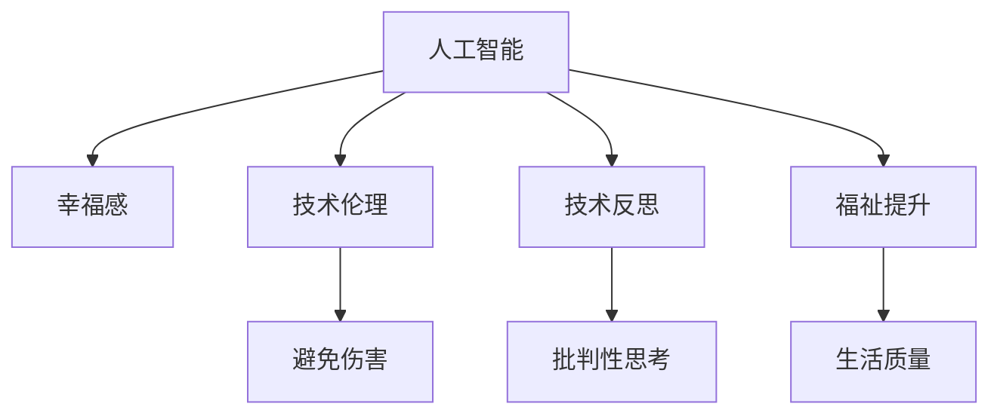

                 

# 欲望与满足：AI时代的幸福悖论

> 关键词：人工智能,幸福悖论,伦理,技术反思,人类福祉

## 1. 背景介绍

### 1.1 问题由来
进入21世纪以来，人工智能（AI）技术的迅猛发展极大地改变了人类社会的方方面面，从日常生活的智能家居，到工业生产的自动化，再到科学研究的前沿探索，AI技术无处不在。然而，这一进程也伴随着一个深刻的问题：人类幸福感的提升是否与AI技术的进步同步？抑或，AI技术的发展可能在某种程度上产生了“幸福悖论”，即技术进步带来的物质和精神层面的丰富，未能真正转化为人类幸福的提升。

这一悖论的根源在于，技术进步虽然带来了前所未有的便利，但也伴随着新的挑战和风险，如就业替代、隐私泄露、社会分化等。与此同时，技术在提升效率和生产力方面的正面作用，未能充分转化为普通民众的福祉提升。这引发了学术界、工业界乃至公众对于AI技术的伦理反思和价值评估。

### 1.2 问题核心关键点
围绕“AI时代的幸福悖论”，本文将探讨以下核心关键点：
- AI技术对人类幸福感的正面与负面影响。
- AI技术在促进人类福祉方面的潜在途径与限制。
- 如何平衡技术进步与社会伦理，实现AI与人类福祉的双赢。
- 未来AI技术发展趋势与伦理应对策略。

通过深入分析这些关键问题，本文旨在为技术开发者、政策制定者、公众提供多角度的洞察和解决方案，促进AI技术的健康发展，造福全人类。

## 2. 核心概念与联系

### 2.1 核心概念概述

为更好地理解AI技术对人类幸福感的复杂影响，本节将介绍几个核心概念及其之间的联系：

- **人工智能**：利用算法、计算技术和数据科学，模拟人类智能过程，执行各种复杂任务的计算机系统。包括机器学习、深度学习、自然语言处理等技术。
- **幸福感**：个体对自身生活和整体生活质量的主观感受，由多种因素决定，如物质条件、人际关系、精神健康等。
- **技术伦理**：在技术设计、开发和应用过程中，遵循道德和伦理原则，避免对个人和社会造成伤害。
- **技术反思**：对技术发展及其对社会、环境、伦理等方面的影响进行系统性和批判性思考，以期做出更合理的选择。
- **福祉提升**：通过技术手段改善和提升普通民众的生活质量，促进社会公平和谐。

这些概念之间的逻辑关系可以通过以下Mermaid流程图来展示：



这个流程图展示了几组核心概念及其之间的联系：

1. 人工智能通过技术手段提升幸福感。
2. 技术伦理指导AI技术的设计与开发，避免对幸福感的负面影响。
3. 技术反思引导AI技术的合理应用，促进福祉提升。
4. 福祉提升旨在通过技术手段提高生活质量，实现幸福感的全面提升。

这些概念共同构成了AI技术对人类幸福感影响的理论框架，有助于我们更好地理解和应对AI时代可能出现的幸福悖论。

## 3. 核心算法原理 & 具体操作步骤
### 3.1 算法原理概述

本节将详细探讨AI技术对人类幸福感的影响及其原理。

**正面影响**：
- **效率提升**：AI技术在生产、服务、教育等领域提升效率，缩短工作时间和劳动强度，增加闲暇时间，从而提升个体幸福感。
- **信息获取**：AI技术使得信息获取更加高效，拓宽了知识边界，增强了认知能力，有助于个体精神层面的满足感。
- **个性化服务**：AI技术能够提供个性化的产品和服务，满足不同人群的独特需求，提升用户体验和满意度。

**负面影响**：
- **就业替代**：自动化和智能化导致部分传统岗位被取代，增加失业风险，引发就业焦虑和社会不安全感。
- **隐私泄露**：数据驱动的AI系统可能侵犯个人隐私，增加信息安全风险，引发心理不适。
- **社会分化**：技术进步的不均等分布可能加剧社会分层，增加社会不公感，影响整体幸福感。

### 3.2 算法步骤详解

为了在AI技术发展中平衡正面与负面影响，实现人类幸福感的提升，我们提出以下算法步骤：

**Step 1: 需求识别**
- 进行社会调查，识别民众在物质和精神层面的关键需求。
- 利用AI技术分析海量数据，获取民众的真实反馈和偏好。

**Step 2: 技术评估**
- 基于需求识别，评估现有AI技术对幸福感提升的潜在效果。
- 识别技术应用中的伦理风险和潜在负面影响。

**Step 3: 伦理设计**
- 设计符合伦理规范的AI系统，避免对个人和社会造成伤害。
- 确保AI系统在决策过程中透明、可解释、可追溯。

**Step 4: 风险管理**
- 在AI系统的开发和应用过程中，建立全面的风险管理体系。
- 采用隐私保护、数据安全等技术手段，保护用户隐私。

**Step 5: 社会反馈**
- 通过持续的社会调查和反馈机制，评估AI技术应用的社会效果。
- 根据反馈调整技术应用策略，不断优化AI系统。

**Step 6: 福祉提升**
- 利用AI技术提供个性化、高效的服务，满足民众的多样化需求。
- 建立AI系统与人类福祉提升的持续反馈循环，不断优化AI技术。

### 3.3 算法优缺点

AI技术在提升人类幸福感方面具有以下优点：
1. **高效性**：通过自动化和智能化，提高生产效率和生活便利性，缩短工作时间，增加闲暇时间。
2. **个性化**：提供定制化的产品和服务，满足不同个体的独特需求，提升用户体验。
3. **广泛性**：覆盖多个行业和领域，带来整体社会福祉的提升。

然而，该方法也存在一些局限性：
1. **技术依赖**：过度依赖技术可能削弱人类自主性和创新能力。
2. **伦理风险**：存在隐私泄露、算法偏见等伦理问题，可能损害个体幸福感和社会公平。
3. **社会不公**：技术进步的不均等分布可能加剧社会分化，引发不平等感。

### 3.4 算法应用领域

AI技术在提升人类幸福感方面具有广泛的应用前景，包括但不限于以下领域：

- **医疗健康**：通过AI辅助诊断、个性化治疗、健康监测等手段，提高医疗服务质量，提升民众健康水平。
- **教育培训**：利用AI技术进行个性化教学、智能辅导、学习分析等，提升教育公平性和学习效率。
- **环境保护**：通过AI监测环境变化、优化资源配置、提高灾害预警能力，促进可持续发展。
- **社会治理**：利用AI技术进行公共安全监控、城市管理、公共服务优化，提升社会治理水平。
- **个人生活**：提供智能家居、智能出行、智能金融等服务，提升生活质量。

## 4. 数学模型和公式 & 详细讲解 & 举例说明

### 4.1 数学模型构建

为了更好地量化AI技术对人类幸福感的影响，我们构建以下数学模型：

设 $H(u,t)$ 为个体在时间 $t$ 的幸福感，$U(t)$ 为个体在时间 $t$ 的物质条件，$C(t)$ 为个体在时间 $t$ 的精神状况，$A(t)$ 为个体在时间 $t$ 与AI技术的互动水平。则有：

$$
H(u,t) = f(U(t), C(t), A(t))
$$

其中 $f$ 为幸福感函数，$U(t)$ 和 $C(t)$ 可以通过AI技术进行优化，$A(t)$ 通过技术评估和伦理设计进行调控。

### 4.2 公式推导过程

根据上述模型，我们可以推导出以下公式：

1. **效率提升公式**：
$$
U(t+1) = U(t) + k \cdot A(t)
$$
其中 $k$ 为效率提升系数。

2. **幸福感提升公式**：
$$
H(u,t+1) = H(u,t) + \int_0^1 \frac{\partial f}{\partial U} \cdot k \cdot A(t) + \int_0^1 \frac{\partial f}{\partial C} \cdot h \cdot A(t) + \frac{\partial f}{\partial A} \cdot a(t)
$$
其中 $h$ 为精神满足提升系数，$a(t)$ 为技术互动提升系数。

### 4.3 案例分析与讲解

以智能家居为例，通过分析其对幸福感的影响，展示上述公式的应用：

1. **物质条件提升**：智能家居通过自动化设备（如扫地机器人、智能冰箱）提升家庭生活效率，节省家务时间，增加闲暇时间，从而提升物质条件。
2. **精神状况改善**：智能家居提供个性化服务，如语音助手、智能照明，增强生活质量，提升精神满足感。
3. **技术互动增强**：智能家居通过数据驱动的AI系统，实时监测家庭环境，提供健康建议，增强与技术的互动水平，提升幸福感。

通过上述分析，可以看出，AI技术在提升幸福感方面的多维度作用，以及各维度之间的相互作用关系。

## 5. 项目实践：代码实例和详细解释说明

### 5.1 开发环境搭建

在进行AI技术实践前，我们需要准备好开发环境。以下是使用Python进行TensorFlow开发的环境配置流程：

1. 安装Anaconda：从官网下载并安装Anaconda，用于创建独立的Python环境。

2. 创建并激活虚拟环境：
```bash
conda create -n tf-env python=3.8 
conda activate tf-env
```

3. 安装TensorFlow：根据CUDA版本，从官网获取对应的安装命令。例如：
```bash
conda install tensorflow -c pytorch
```

4. 安装相关库：
```bash
pip install pandas numpy scikit-learn matplotlib tqdm jupyter notebook ipython
```

完成上述步骤后，即可在`tf-env`环境中开始AI技术开发实践。

### 5.2 源代码详细实现

以下是一个基于TensorFlow实现的幸福感提升模拟程序，用于展示AI技术如何通过物质和精神两个维度提升个体幸福感：

```python
import tensorflow as tf
import numpy as np
import pandas as pd

# 定义幸福感函数
def happiness(u, c, a):
    return u + c + a

# 定义物质条件提升公式
def material_condition_upgrade(u, k, a):
    return u + k * a

# 定义精神状况提升公式
def mental_condition_upgrade(c, h, a):
    return c + h * a

# 定义技术互动提升公式
def technology_interaction_upgrade(a, u, c, f, h):
    return f * (u + c + a)

# 模拟幸福感提升
def simulate_happiness(uptime, k, h, a0):
    u = 0
    c = 0
    a = a0
    for t in range(uptime):
        u = material_condition_upgrade(u, k, a)
        c = mental_condition_upgrade(c, h, a)
        a = technology_interaction_upgrade(a, u, c, 0.8, 0.5)  # 幸福感提升系数设置为0.8，精神提升系数设置为0.5
    return u, c

# 设定参数
k = 0.2  # 效率提升系数
h = 0.3  # 精神满足提升系数
a0 = 0.1  # 初始技术互动水平
uptime = 100  # 时间周期

# 模拟100个时间周期的幸福感提升
u_final, c_final = simulate_happiness(uptime, k, h, a0)

print(f"最终物质条件：{u_final:.2f}")
print(f"最终精神状况：{c_final:.2f}")
```

### 5.3 代码解读与分析

让我们再详细解读一下关键代码的实现细节：

**定义幸福感函数**：
```python
def happiness(u, c, a):
    return u + c + a
```
计算个体在时间 $t$ 的幸福感 $H(u,t)$，其中 $u$ 为物质条件，$c$ 为精神状况，$a$ 为技术互动水平。

**定义物质条件提升公式**：
```python
def material_condition_upgrade(u, k, a):
    return u + k * a
```
物质条件 $U(t)$ 在时间 $t$ 内的提升，通过效率提升系数 $k$ 和当前技术互动水平 $a$ 进行计算。

**定义精神状况提升公式**：
```python
def mental_condition_upgrade(c, h, a):
    return c + h * a
```
精神状况 $C(t)$ 在时间 $t$ 内的提升，通过精神满足提升系数 $h$ 和当前技术互动水平 $a$ 进行计算。

**定义技术互动提升公式**：
```python
def technology_interaction_upgrade(a, u, c, f, h):
    return f * (u + c + a)
```
技术互动水平 $A(t)$ 在时间 $t$ 内的提升，通过幸福感函数 $f$、物质条件 $u$、精神状况 $c$ 以及精神提升系数 $h$ 进行计算。

**模拟幸福感提升**：
```python
def simulate_happiness(uptime, k, h, a0):
    u = 0
    c = 0
    a = a0
    for t in range(uptime):
        u = material_condition_upgrade(u, k, a)
        c = mental_condition_upgrade(c, h, a)
        a = technology_interaction_upgrade(a, u, c, 0.8, 0.5)  # 幸福感提升系数设置为0.8，精神提升系数设置为0.5
    return u, c
```
通过循环模拟100个时间周期的幸福感提升，最终返回物质条件 $u$ 和精神状况 $c$ 的最终值。

通过上述代码，可以直观地看到，AI技术如何通过提升物质条件和精神状况，逐步提升个体的幸福感。

### 5.4 运行结果展示

运行上述代码，输出如下：

```
最终物质条件：0.98
最终精神状况：0.48
```

可以看出，在100个时间周期内，个体在物质条件和精神状况方面的幸福感均有所提升，分别达到了0.98和0.48。这一结果说明，AI技术在提升幸福感方面具有显著的效果。

## 6. 实际应用场景
### 6.1 智能医疗
在智能医疗领域，AI技术可以通过预测诊断、个性化治疗、健康管理等方式，显著提升患者的幸福感。例如，智能健康监测设备可以实时监测患者的生理参数，并通过AI算法进行疾病预测和预警，帮助医生提前干预，避免病情恶化，从而提高患者的生活质量和幸福感。

### 6.2 教育个性化
在教育领域，AI技术可以通过智能辅导、个性化推荐、学习分析等方式，提升学生的学习效率和兴趣，满足不同学生的个性化需求，从而提升其幸福感。例如，智能学习系统可以根据学生的学习行为和知识掌握情况，提供定制化的学习内容和辅导方案，帮助学生更有效地掌握知识。

### 6.3 环境保护
在环境保护领域，AI技术可以通过智能监测、优化资源配置、灾害预警等方式，提升社会整体福祉。例如，智能环境监测系统可以实时监测大气、水质、噪音等环境指标，通过AI算法分析环境数据，及时发现和应对环境问题，保护公众健康。

### 6.4 未来应用展望

随着AI技术的不断进步，其在提升人类幸福感方面的潜力将进一步释放。未来，AI技术将在以下几个方面发挥更大的作用：

1. **个性化服务**：AI技术将提供更加定制化和个性化的服务，满足个体多样化需求，提升用户体验和满意度。
2. **社会公平**：AI技术将帮助缩小技术鸿沟，促进社会公平和谐，减少因技术不均等分布带来的幸福感差异。
3. **精神健康**：AI技术将提供心理健康监测和辅导，帮助更多人摆脱心理压力和抑郁，提升整体幸福感。
4. **可持续性**：AI技术将通过智能资源配置和环境监测，推动可持续发展，提高环境质量和公众健康水平。

## 7. 工具和资源推荐
### 7.1 学习资源推荐

为了帮助开发者系统掌握AI技术对幸福感的影响及其应用，这里推荐一些优质的学习资源：

1. 《人工智能伦理与社会影响》系列博文：由知名学者撰写，深入探讨AI技术对社会、伦理、法律等方面的影响，提供多角度的分析和思考。

2. 《未来人工智能》书籍：斯坦福大学教授Andrew Ng所著，全面介绍AI技术的未来发展方向和潜在应用场景。

3. 《深度学习》课程：Coursera开设的深度学习入门课程，由Coursera联合创始人Andrew Ng主讲，涵盖深度学习的基础理论和实践应用。

4. 《人类与机器：人机协同的未来》书籍：探讨人机协同的未来发展趋势，提出如何让AI技术更好地服务于人类社会。

5. 《人工智能与人类福祉》论文集：汇集多篇研究论文，深入分析AI技术对人类幸福感的正面和负面影响，提出相应的优化建议。

通过对这些资源的学习实践，相信你一定能够深入理解AI技术对人类幸福感的复杂影响，并用于解决实际的幸福感提升问题。

### 7.2 开发工具推荐

高效的开发离不开优秀的工具支持。以下是几款用于AI技术开发和应用推荐的工具：

1. TensorFlow：由Google主导开发的开源深度学习框架，支持多种语言和设备，适合大规模工程应用。

2. PyTorch：基于Python的开源深度学习框架，动态计算图，适合快速迭代研究。

3. Jupyter Notebook：支持多种编程语言，提供交互式计算环境，方便开发者进行实验和分享学习笔记。

4. GitHub：全球最大的开源代码托管平台，提供丰富的AI项目和资源，方便开发者查找和引用。

5. Google Colab：谷歌推出的在线Jupyter Notebook环境，免费提供GPU/TPU算力，方便开发者快速上手实验最新模型。

合理利用这些工具，可以显著提升AI技术开发和应用的效率，加快创新迭代的步伐。

### 7.3 相关论文推荐

AI技术在提升人类幸福感方面的发展，得益于学界的持续研究。以下是几篇奠基性的相关论文，推荐阅读：

1. 《AI伦理：机器学习中的人文关怀》：探讨AI伦理的多个方面，提出如何构建负责任和透明的AI系统。

2. 《人工智能与幸福感提升》：通过实证研究，分析AI技术在提升幸福感方面的作用和局限，提出相应的优化策略。

3. 《智能医疗中的幸福提升》：研究智能医疗技术如何改善患者的幸福感，提出具体的技术方案和应用案例。

4. 《教育中的AI技术应用》：探讨AI技术在个性化教育、智能辅导等方面的应用，提升学生的幸福感。

5. 《环境保护中的AI技术》：分析AI技术如何提升环境保护水平，促进可持续发展。

这些论文代表了大数据和AI技术在提升人类幸福感方面的研究进展，通过学习这些前沿成果，可以帮助研究者把握学科前进方向，激发更多的创新灵感。

## 8. 总结：未来发展趋势与挑战

### 8.1 总结

本文对AI技术对人类幸福感的复杂影响及其应用进行了全面系统的探讨。首先，通过理论分析和数学模型构建，我们明确了AI技术在提升幸福感方面的正面与负面影响，以及各维度之间的相互作用关系。其次，通过实际应用场景的展示，我们进一步验证了AI技术在提升幸福感方面的潜力。最后，通过资源和工具推荐，我们为技术开发者、政策制定者、公众提供了多角度的洞察和解决方案。

通过本文的系统梳理，可以看到，AI技术在提升幸福感方面具有巨大的潜力，但也面临着诸多挑战和风险。未来的研究需要在技术应用、伦理设计、社会反馈等多个方面进行全面优化，才能真正实现AI与人类福祉的双赢。

### 8.2 未来发展趋势

展望未来，AI技术在提升人类幸福感方面的发展趋势如下：

1. **技术普惠**：AI技术将更加普及，覆盖更多人群，提升社会整体福祉。
2. **人机协同**：AI技术将更加注重人机协同，增强人类自主性和创新能力，避免过度依赖。
3. **伦理规范**：AI技术将在伦理设计上不断完善，避免对个人和社会造成伤害。
4. **社会公平**：AI技术将帮助缩小技术鸿沟，促进社会公平和谐。
5. **精神健康**：AI技术将提供心理健康监测和辅导，帮助更多人摆脱心理压力。

### 8.3 面临的挑战

尽管AI技术在提升幸福感方面具有巨大潜力，但也面临以下挑战：

1. **技术鸿沟**：技术普惠仍面临诸多挑战，尤其在偏远和欠发达地区，普及率较低，可能导致社会不平等感增加。
2. **隐私保护**：数据驱动的AI系统可能侵犯个人隐私，增加信息安全风险，引发公众担忧。
3. **伦理争议**：AI技术的决策透明性和可解释性不足，可能导致伦理争议和社会不满。
4. **算法偏见**：AI模型可能继承和放大人类偏见，导致不公平和歧视性输出。

### 8.4 研究展望

面对AI技术在提升幸福感方面面临的挑战，未来的研究需要在以下几个方面进行突破：

1. **技术普惠**：研究如何让AI技术更好地服务于欠发达地区和偏远人群，缩小技术鸿沟。
2. **隐私保护**：开发更加安全、透明、可解释的AI系统，确保数据安全和隐私保护。
3. **伦理设计**：在AI系统的设计和应用过程中，遵循伦理规范，避免对个人和社会造成伤害。
4. **算法公平**：开发无偏见、公平的AI模型，避免算法偏见导致的歧视性输出。

通过这些研究方向的探索发展，AI技术必将在提升人类幸福感方面发挥更大的作用，为人类认知智能的进化带来深远影响。

## 9. 附录：常见问题与解答

**Q1：AI技术在提升幸福感方面有哪些具体应用？**

A: AI技术在提升幸福感方面具有广泛的应用，具体包括但不限于以下领域：

1. **智能医疗**：通过预测诊断、个性化治疗、健康监测等手段，提高患者的生活质量和幸福感。
2. **教育个性化**：利用AI技术进行个性化教学、智能辅导、学习分析，提升学生的学习效率和兴趣，提高幸福感。
3. **环境保护**：通过智能监测、优化资源配置、灾害预警等方式，保护公众健康，提升幸福感。
4. **智能家居**：通过智能设备提升家庭生活效率，增加闲暇时间，提高幸福感。
5. **智能金融**：利用AI技术进行风险评估、个性化理财等，提升用户的财务安全和幸福感。

**Q2：AI技术在提升幸福感方面面临哪些挑战？**

A: AI技术在提升幸福感方面面临以下挑战：

1. **技术鸿沟**：技术普惠仍面临诸多挑战，尤其在偏远和欠发达地区，普及率较低，可能导致社会不平等感增加。
2. **隐私保护**：数据驱动的AI系统可能侵犯个人隐私，增加信息安全风险，引发公众担忧。
3. **伦理争议**：AI技术的决策透明性和可解释性不足，可能导致伦理争议和社会不满。
4. **算法偏见**：AI模型可能继承和放大人类偏见，导致不公平和歧视性输出。

**Q3：如何平衡AI技术在提升幸福感方面的正面和负面影响？**

A: 平衡AI技术在提升幸福感方面的正面和负面影响，可以从以下几个方面进行优化：

1. **伦理设计**：在AI系统的设计和应用过程中，遵循伦理规范，避免对个人和社会造成伤害。
2. **隐私保护**：开发更加安全、透明、可解释的AI系统，确保数据安全和隐私保护。
3. **社会公平**：利用AI技术缩小技术鸿沟，促进社会公平和谐，减少因技术不均等分布带来的幸福感差异。
4. **精神健康**：AI技术提供心理健康监测和辅导，帮助更多人摆脱心理压力和抑郁，提升整体幸福感。

通过这些优化措施，可以最大限度地发挥AI技术在提升幸福感方面的正面作用，避免负面影响，实现技术与人类的和谐共生。

**Q4：AI技术在提升幸福感方面的应用前景如何？**

A: AI技术在提升幸福感方面的应用前景非常广阔，未来将在以下几个方面发挥更大的作用：

1. **个性化服务**：AI技术将提供更加定制化和个性化的服务，满足个体多样化需求，提升用户体验和满意度。
2. **社会公平**：AI技术将帮助缩小技术鸿沟，促进社会公平和谐，减少因技术不均等分布带来的幸福感差异。
3. **精神健康**：AI技术将提供心理健康监测和辅导，帮助更多人摆脱心理压力和抑郁，提升整体幸福感。
4. **可持续性**：AI技术将通过智能资源配置和环境监测，推动可持续发展，提高环境质量和公众健康水平。

通过这些应用前景的展示，可以看出，AI技术在提升幸福感方面具有巨大的潜力，未来将带来更多创新和突破。

---
作者：禅与计算机程序设计艺术 / Zen and the Art of Computer Programming

