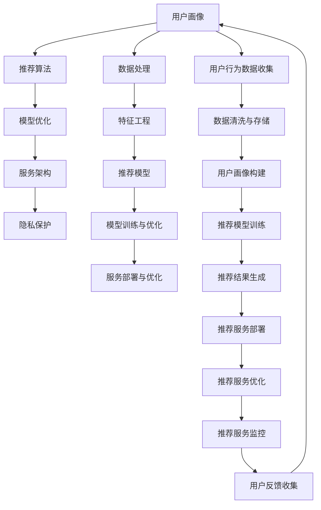

                 

# 欲望个性化引擎架构师：AI定制的需求满足系统设计师

在数字化时代，个性化服务已成为提升用户体验、增强用户粘性的关键要素。随着人工智能技术的不断演进，个性化的需求满足系统也逐渐从简单的推荐系统，演进到复杂的个性化引擎。本文将深入探讨基于人工智能的需求满足系统的架构设计，旨在帮助设计师和架构师理解如何构建高效、可扩展的个性化引擎，满足用户的个性化需求。

## 1. 背景介绍

### 1.1 问题由来

在过去的十年里，随着互联网的普及和智能设备的普及，用户的个性化需求日益凸显。传统的一对多服务模式已难以满足用户的个性化需求，个性化推荐、个性化广告、个性化内容分发等需求应运而生。

然而，传统推荐系统往往采用基于协同过滤或基于内容的推荐算法，难以处理海量用户数据，更难以实现精准的个性化推荐。近年来，基于深度学习的大规模个性化引擎逐渐成为行业的热点。

### 1.2 问题核心关键点

构建个性化引擎的核心问题在于如何有效地处理海量用户数据，并将用户的个性化需求转化为高效、可扩展的推荐引擎。主要包括以下几个关键点：

1. **数据处理**：如何高效地收集、清洗和存储用户数据，以便进行后续的分析和建模。
2. **特征工程**：如何从海量用户数据中提取出有效的特征，用于构建推荐模型。
3. **模型构建**：如何选择和构建推荐模型，以实现精准的个性化推荐。
4. **模型训练与优化**：如何在有限的时间和计算资源下，高效地训练和优化推荐模型。
5. **服务部署与优化**：如何构建可扩展的推荐服务，并在不同的应用场景下进行优化。

## 2. 核心概念与联系

### 2.1 核心概念概述

在个性化引擎的设计过程中，涉及多个核心概念和技术，这些概念和技术相互关联，共同构成了整个系统的架构。

- **用户画像**：通过收集和分析用户行为数据，构建用户的多维度特征，用于描述用户的兴趣、偏好、行为等。
- **推荐算法**：基于用户画像和物品特征，选择合适的推荐算法，构建推荐模型，实现个性化推荐。
- **模型优化**：通过在线学习、强化学习等技术，不断优化推荐模型，提升推荐精度和实时性。
- **服务架构**：设计高效、可扩展的推荐服务架构，支持大规模用户和高并发请求。
- **隐私保护**：在收集和处理用户数据时，采取必要的隐私保护措施，确保用户数据的安全和隐私。

这些核心概念和技术之间存在紧密的联系，需要通过合理的架构设计和算法选择，实现个性化需求的精准满足。

### 2.2 核心概念原理和架构的 Mermaid 流程图



该图展示了个性化引擎的核心概念和技术之间的逻辑关系。用户画像通过数据处理和特征工程构建，然后用于推荐模型训练和优化，最终生成推荐结果。推荐服务通过服务架构部署和优化，同时考虑隐私保护，实现高效、可扩展的推荐服务。用户行为数据和推荐结果反馈，进一步完善用户画像，形成闭环。

## 3. 核心算法原理 & 具体操作步骤

### 3.1 算法原理概述

个性化引擎的算法原理主要基于推荐系统中的主流算法，包括协同过滤、基于内容的推荐、深度学习推荐等。本文将重点介绍基于深度学习的推荐算法。

深度学习推荐系统主要分为两个阶段：特征提取和模型训练。特征提取阶段通过神经网络对用户画像和物品特征进行映射，生成高维向量表示；模型训练阶段通过优化算法（如梯度下降）对推荐模型进行训练，最终生成推荐结果。

### 3.2 算法步骤详解

#### 3.2.1 数据预处理

数据预处理是深度学习推荐系统的第一步，主要包括数据清洗、特征提取和特征选择等。

1. **数据清洗**：去除缺失、重复、异常等数据，确保数据的质量。
2. **特征提取**：通过神经网络对用户画像和物品特征进行映射，生成高维向量表示。
3. **特征选择**：选择对推荐结果影响较大的特征，减少计算量和存储需求。

#### 3.2.2 模型构建

模型构建是深度学习推荐系统的核心步骤，主要包括以下几个部分：

1. **神经网络结构**：选择适合推荐任务的神经网络结构，如全连接网络、卷积神经网络（CNN）、循环神经网络（RNN）等。
2. **损失函数**：选择适合推荐任务的损失函数，如均方误差（MSE）、交叉熵（CE）等。
3. **优化算法**：选择适合推荐任务的优化算法，如随机梯度下降（SGD）、Adam等。

#### 3.2.3 模型训练与优化

模型训练与优化是深度学习推荐系统的关键步骤，主要包括以下几个部分：

1. **训练过程**：将用户画像和物品特征输入神经网络，通过前向传播计算预测结果，并通过反向传播计算损失函数。
2. **优化算法**：根据优化算法更新模型参数，最小化损失函数。
3. **模型评估**：通过测试集评估模型性能，选择最优模型。

#### 3.2.4 模型部署与优化

模型部署与优化是深度学习推荐系统的最后一步，主要包括以下几个部分：

1. **模型保存**：将训练好的模型保存为可部署的格式，如TensorFlow SavedModel、PyTorch模型文件等。
2. **服务部署**：将模型部署到生产环境，并保证服务的稳定性和高可用性。
3. **服务优化**：根据服务性能和用户反馈，不断优化模型和系统架构，提升推荐效果和服务质量。

### 3.3 算法优缺点

#### 3.3.1 优点

1. **高精度**：深度学习推荐系统能够学习复杂的非线性关系，实现高精度的个性化推荐。
2. **可扩展性**：通过并行计算和分布式训练，深度学习推荐系统可以处理大规模数据和高并发请求。
3. **自适应性**：深度学习推荐系统可以通过在线学习不断优化推荐模型，适应用户需求的变化。

#### 3.3.2 缺点

1. **计算资源需求高**：深度学习推荐系统需要大量的计算资源和时间进行模型训练和优化。
2. **数据需求大**：深度学习推荐系统需要大量的标注数据进行模型训练，且对数据质量要求较高。
3. **模型解释性差**：深度学习推荐系统的黑盒性质使其难以解释推荐结果的来源和逻辑。

### 3.4 算法应用领域

深度学习推荐系统在多个领域都有广泛的应用，主要包括以下几个方面：

1. **电商推荐**：通过分析用户浏览、购买等行为数据，实现个性化商品推荐。
2. **内容推荐**：通过分析用户阅读、观看等行为数据，实现个性化内容推荐。
3. **广告推荐**：通过分析用户搜索、点击等行为数据，实现个性化广告推荐。
4. **金融推荐**：通过分析用户交易、理财等行为数据，实现个性化金融产品推荐。
5. **社交推荐**：通过分析用户互动、关系等行为数据，实现个性化社交网络推荐。

## 4. 数学模型和公式 & 详细讲解

### 4.1 数学模型构建

深度学习推荐系统的数学模型主要包括以下几个部分：

- **用户画像**：$x \in \mathbb{R}^n$，表示用户的多维度特征。
- **物品特征**：$y \in \mathbb{R}^m$，表示物品的多维度特征。
- **推荐模型**：$z = f(x,y)$，表示用户和物品之间的相似度。
- **损失函数**：$L(z,y)$，表示预测结果与真实结果之间的差异。

### 4.2 公式推导过程

以深度学习推荐系统中的协同过滤算法为例，推导其基本公式：

1. **用户画像**：$x = (x_1, x_2, ..., x_n)$，表示用户的多维度特征。
2. **物品特征**：$y = (y_1, y_2, ..., y_m)$，表示物品的多维度特征。
3. **推荐模型**：$z = f(x,y) = \sigma(W \cdot [x;y] + b)$，其中$\sigma$表示激活函数，$W$表示权重矩阵，$b$表示偏置项。
4. **损失函数**：$L(z,y) = \frac{1}{2} \Vert z - y \Vert^2$，表示预测结果与真实结果之间的差异。

### 4.3 案例分析与讲解

以电商推荐系统为例，分析其数据预处理、模型构建、模型训练与优化、模型部署与优化等步骤：

1. **数据预处理**：收集用户的浏览、购买等行为数据，清洗和存储数据，提取用户画像和物品特征。
2. **模型构建**：选择全连接网络作为推荐模型，定义损失函数和优化算法。
3. **模型训练与优化**：通过前向传播和反向传播计算损失函数，使用Adam算法更新模型参数。
4. **模型部署与优化**：将训练好的模型保存为PyTorch模型文件，部署到生产环境，并通过A/B测试优化推荐结果。

## 5. 项目实践：代码实例和详细解释说明

### 5.1 开发环境搭建

为了搭建深度学习推荐系统的开发环境，需要安装以下软件和工具：

1. **Python**：推荐使用Python 3.x版本，安装Anaconda进行环境管理。
2. **深度学习框架**：选择TensorFlow或PyTorch进行深度学习模型的构建和训练。
3. **数据处理工具**：安装Pandas、NumPy等数据处理工具，用于数据清洗和特征提取。
4. **可视化工具**：安装Matplotlib、Seaborn等可视化工具，用于数据可视化和模型评估。

### 5.2 源代码详细实现

以电商推荐系统为例，给出其代码实现和详细解释：

```python
# 导入必要的库和工具
import pandas as pd
import numpy as np
import tensorflow as tf
import seaborn as sns
import matplotlib.pyplot as plt

# 数据预处理
# 加载数据
data = pd.read_csv('data.csv')
# 清洗数据
data = data.dropna()
# 特征提取
user_features = data[['user_id', 'age', 'gender']]
item_features = data[['item_id', 'price', 'category']]
user_features = pd.get_dummies(user_features)
item_features = pd.get_dummies(item_features)

# 模型构建
# 定义神经网络结构
model = tf.keras.Sequential([
    tf.keras.layers.Dense(128, activation='relu', input_shape=(user_features.shape[1] + item_features.shape[1],)),
    tf.keras.layers.Dense(1)
])
# 定义损失函数和优化算法
loss_fn = tf.keras.losses.MeanSquaredError()
optimizer = tf.keras.optimizers.Adam()

# 模型训练与优化
# 划分训练集和测试集
train_data = data.sample(frac=0.8, random_state=42)
test_data = data.drop(train_data.index)
# 定义训练过程
train_loss = []
for epoch in range(50):
    # 前向传播
    predictions = model.predict([user_features, item_features])
    # 计算损失
    loss = loss_fn(predictions, y)
    # 反向传播
    optimizer.apply_gradients(zip(predictions, loss))
    # 记录损失
    train_loss.append(loss)
# 模型评估
test_loss = model.evaluate([test_data.user_features, test_data.item_features], y)
print('Test loss:', test_loss)

# 模型部署与优化
# 保存模型
model.save('recommendation_model.h5')
# 部署模型
# 加载模型
model = tf.keras.models.load_model('recommendation_model.h5')
# 使用模型进行推荐
```

### 5.3 代码解读与分析

上述代码实现了电商推荐系统的数据预处理、模型构建、模型训练与优化、模型评估和模型部署等步骤：

1. **数据预处理**：使用Pandas库加载数据，并进行清洗和特征提取。
2. **模型构建**：定义神经网络结构，包括全连接层和激活函数。
3. **模型训练与优化**：使用TensorFlow库进行模型训练，并记录训练过程中的损失值。
4. **模型评估**：使用测试集评估模型的性能，输出测试损失值。
5. **模型部署与优化**：使用Keras库保存模型，并在生产环境中加载和使用模型。

## 6. 实际应用场景

### 6.1 智能客服系统

智能客服系统通过深度学习推荐技术，可以实现个性化的用户服务。在智能客服系统中，用户输入问题后，系统通过分析用户的历史记录、行为数据等，推荐最合适的答案模板，并引导用户进行下一步操作。

### 6.2 金融理财推荐

金融理财推荐系统通过深度学习推荐技术，可以实现个性化的理财产品推荐。在金融理财推荐系统中，用户输入自己的财务状况、风险偏好等，系统通过分析用户的历史交易记录、理财行为等，推荐最适合的理财产品，帮助用户实现财务目标。

### 6.3 娱乐内容推荐

娱乐内容推荐系统通过深度学习推荐技术，可以实现个性化的内容推荐。在娱乐内容推荐系统中，用户输入自己的兴趣爱好、观看历史等，系统通过分析用户的历史行为数据，推荐最适合的内容，提高用户的满意度和留存率。

### 6.4 未来应用展望

随着深度学习推荐技术的不断发展，未来在更多领域的应用前景将更加广阔：

1. **医疗推荐**：通过分析患者的历史病历、治疗记录等，实现个性化的医疗推荐。
2. **教育推荐**：通过分析学生的学习记录、成绩等，实现个性化的学习资源推荐。
3. **交通推荐**：通过分析用户的出行历史、偏好等，实现个性化的交通路线推荐。

## 7. 工具和资源推荐

### 7.1 学习资源推荐

为了帮助开发者系统掌握深度学习推荐技术，以下是一些优质的学习资源：

1. **《深度学习》书籍**：由Goodfellow等所著，全面介绍了深度学习的基本概念和算法。
2. **《TensorFlow官方文档》**：TensorFlow的官方文档，提供了详细的API和示例代码。
3. **《PyTorch官方文档》**：PyTorch的官方文档，提供了详细的API和示例代码。
4. **Kaggle竞赛**：Kaggle平台上的深度学习推荐系统竞赛，提供大量数据集和竞赛经验。
5. **Coursera课程**：Coursera平台上的深度学习推荐系统课程，涵盖深度学习推荐系统的基本概念和算法。

### 7.2 开发工具推荐

为了提高深度学习推荐系统的开发效率，以下是一些推荐的开发工具：

1. **Jupyter Notebook**：Python的交互式开发环境，支持代码运行和结果展示。
2. **TensorFlow**：谷歌开源的深度学习框架，支持大规模模型训练和分布式计算。
3. **PyTorch**：Facebook开源的深度学习框架，支持动态计算图和高效模型训练。
4. **Keras**：高层API，支持快速原型设计和模型训练。
5. **Pandas**：数据处理库，支持数据清洗、转换和分析。
6. **NumPy**：数值计算库，支持高效矩阵运算和数值计算。

### 7.3 相关论文推荐

为了深入理解深度学习推荐技术，以下是一些推荐阅读的论文：

1. **《Deep Personalized Recommendation using Matrix Factorization Techniques》**：Hu等，提出了基于矩阵分解的深度推荐系统。
2. **《A Deep Learning Framework for Recommender Systems》**：Koren等，提出了基于深度神经网络的推荐系统。
3. **《A Deep Multi-Task Learning Approach for Recommendation System》**：Li等，提出了基于多任务学习的深度推荐系统。
4. **《Differentiable Programming for Recommendation Systems》**：Cao等，提出了基于可微分编程的推荐系统。

## 8. 总结：未来发展趋势与挑战

### 8.1 研究成果总结

深度学习推荐技术已经取得了显著的成果，广泛应用于电商、金融、娱乐等多个领域。通过不断优化推荐算法和模型，提高了推荐系统的精度和效率。

### 8.2 未来发展趋势

未来，深度学习推荐技术将在以下几个方面进一步发展：

1. **个性化推荐**：通过深度学习技术，实现更加精准的个性化推荐，满足用户的个性化需求。
2. **跨领域推荐**：将推荐系统扩展到多个领域，如医疗、教育、交通等，提供更全面的服务。
3. **实时推荐**：通过在线学习技术，实时更新推荐模型，提升推荐效果。
4. **跨模态推荐**：将推荐系统扩展到多模态数据，如文本、图像、语音等，实现跨模态推荐。

### 8.3 面临的挑战

深度学习推荐技术在发展过程中，也面临一些挑战：

1. **数据隐私问题**：深度学习推荐系统需要大量用户数据，如何保护用户隐私，避免数据泄露是一个重要问题。
2. **推荐算法透明性**：深度学习推荐系统的黑盒性质，导致推荐算法透明性差，难以解释推荐结果的来源。
3. **推荐算法鲁棒性**：深度学习推荐系统容易受到数据偏差的影响，导致推荐结果偏差。
4. **推荐算法可扩展性**：深度学习推荐系统在大规模数据和高并发请求下，容易受到资源限制。

### 8.4 研究展望

为了解决深度学习推荐技术面临的挑战，未来需要在以下几个方面进行研究：

1. **数据隐私保护技术**：研究数据匿名化、差分隐私等技术，保护用户隐私。
2. **推荐算法透明性**：研究推荐算法的可解释性，提高推荐算法的透明性。
3. **推荐算法鲁棒性**：研究推荐算法的鲁棒性，减少数据偏差的影响。
4. **推荐算法可扩展性**：研究分布式推荐算法和大规模数据处理技术，提升推荐算法的可扩展性。

## 9. 附录：常见问题与解答

**Q1：深度学习推荐系统如何处理数据隐私问题？**

A: 深度学习推荐系统需要大量用户数据进行训练，因此需要采取多种隐私保护措施，如数据匿名化、差分隐私、联邦学习等，以保护用户隐私。

**Q2：深度学习推荐系统的模型训练时间较长，如何加速训练？**

A: 可以通过分布式训练、模型压缩、模型剪枝等方法，加速深度学习推荐系统的训练过程。

**Q3：深度学习推荐系统的模型解释性较差，如何解决？**

A: 可以通过研究推荐算法的可解释性，如使用可解释模型、可视化推荐过程等，提高深度学习推荐系统的透明性。

**Q4：深度学习推荐系统的鲁棒性较差，如何解决？**

A: 可以通过研究推荐算法的鲁棒性，如使用对抗样本训练、多模型集成等，提高深度学习推荐系统的鲁棒性。

**Q5：深度学习推荐系统的可扩展性较差，如何解决？**

A: 可以通过研究推荐算法的可扩展性，如使用分布式训练、模型并行化等，提升深度学习推荐系统的可扩展性。

---

作者：禅与计算机程序设计艺术 / Zen and the Art of Computer Programming

