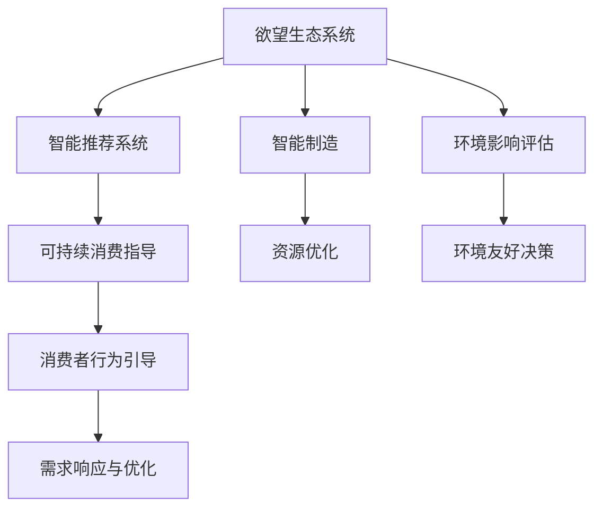

                 

# 欲望生态系统管理员：AI驱动的可持续消费指导

> 关键词：欲望生态系统, 人工智能, 可持续消费, 绿色技术, 智能推荐, 节能减排, 智能制造, 数据驱动决策

## 1. 背景介绍

### 1.1 问题由来
随着经济的快速发展，人类的消费模式也发生了深刻变化。一方面，消费水平的提升带来了生活质量的改善；另一方面，过度的消费行为对环境造成了严重破坏，能源过度消耗、资源浪费、污染排放等问题愈发突出。为了实现可持续发展，各国政府和社会各界都在积极推动绿色消费、节能减排等政策，希望通过技术和政策手段引导公众养成更为环保、节能的消费习惯。

在这一背景下，人工智能（AI）技术逐渐被引入到消费领域，通过数据分析和智能推荐等方式，帮助消费者做出更环保、更可持续的消费决策。但是，如何通过AI技术更好地引导消费，实现可持续发展，仍是一个复杂且亟待解决的课题。本文将从欲望生态系统的角度出发，探讨AI技术在可持续消费指导中的潜力与挑战。

### 1.2 问题核心关键点
在可持续消费的指导中，AI技术可以通过以下方式发挥作用：
- **数据分析与洞察**：通过对消费行为数据的分析，洞察消费者的需求和偏好，预测未来消费趋势。
- **智能推荐系统**：利用AI算法推荐环保、节能的产品，促进绿色消费。
- **需求响应与优化**：通过智能制造和供应链管理，优化生产和分配过程，减少浪费和排放。
- **消费习惯引导**：通过智能化的营销手段，引导消费者形成更可持续的消费习惯。
- **环境影响评估**：利用AI进行环境影响评估，帮助企业和消费者做出更为环保的选择。

本文旨在探讨AI如何在欲望生态系统中发挥作用，如何通过AI技术实现可持续消费指导。

## 2. 核心概念与联系

### 2.1 核心概念概述

为了更好地理解AI在可持续消费指导中的应用，我们将介绍一些相关的核心概念：

- **欲望生态系统**：指的是由消费者、生产者、资源和环境等要素构成的系统，各个要素之间通过物质和能量流动形成了一个动态平衡的生态网络。
- **可持续消费**：指在不损害后代满足其需求的能力的前提下，满足当前需求的发展模式，旨在实现经济、社会和环境的平衡。
- **智能推荐系统**：通过分析用户行为数据，利用AI算法为用户推荐产品或服务，提升用户体验，减少资源浪费。
- **智能制造**：利用AI技术优化生产流程，实现资源的高效利用和废弃物的最小化。
- **环境影响评估**：通过AI技术对生产和消费过程的环境影响进行评估，提供科学决策依据。

这些概念相互交织，共同构成了AI在可持续消费指导中的作用框架。

### 2.2 核心概念原理和架构的 Mermaid 流程图



这个流程图展示了欲望生态系统与AI技术之间的联系。智能推荐系统、智能制造和环境影响评估通过数据分析和AI算法，帮助欲望生态系统实现资源优化、环境友好决策和消费者行为引导，从而推动可持续消费。

## 3. 核心算法原理 & 具体操作步骤

### 3.1 算法原理概述

基于AI的可持续消费指导，其核心算法原理可以分为以下几个方面：

- **数据收集与预处理**：从消费者、生产者和环境等不同维度收集数据，并进行清洗、整理和预处理，为后续分析提供基础数据。
- **数据分析与建模**：利用机器学习、深度学习等AI技术，对收集到的数据进行分析建模，识别出潜在的消费趋势和模式。
- **智能推荐与优化**：通过推荐系统，为消费者推荐环保、节能的产品，优化生产和分配过程，减少资源浪费。
- **环境影响评估**：利用AI技术对生产和消费过程进行环境影响评估，提供决策支持。
- **消费行为引导**：通过智能化的营销手段，引导消费者形成更可持续的消费习惯。

### 3.2 算法步骤详解

1. **数据收集与预处理**：
   - 从电商平台、社交媒体、物流公司等渠道收集消费者行为数据、产品信息、环境影响数据等。
   - 对数据进行清洗、去重、归一化等预处理，确保数据质量。

2. **数据分析与建模**：
   - 利用统计分析、机器学习、深度学习等技术，对消费者行为数据进行聚类、分类、关联规则等分析。
   - 构建推荐模型、预测模型等，预测未来消费趋势，识别消费者需求。

3. **智能推荐与优化**：
   - 根据分析结果，利用协同过滤、内容推荐、深度学习等算法，为消费者推荐环保、节能的产品。
   - 利用智能制造技术，优化生产和分配流程，减少资源浪费。

4. **环境影响评估**：
   - 通过碳足迹计算、能耗分析等技术，对生产和消费过程的环境影响进行评估。
   - 利用可视化工具，展示环境影响结果，提供科学决策依据。

5. **消费行为引导**：
   - 通过智能营销手段，如个性化推荐、社交媒体营销、虚拟现实等，引导消费者形成可持续消费习惯。
   - 利用大数据分析，优化广告投放策略，提高引导效果。

### 3.3 算法优缺点

**优点**：
- **高效性**：AI算法能够处理海量数据，提供快速、准确的分析结果。
- **精确性**：AI技术能够精确预测未来趋势，识别消费者需求，提高推荐精度。
- **灵活性**：AI算法可以实时调整，适应市场变化和消费者需求的变化。

**缺点**：
- **数据依赖**：AI算法依赖高质量的数据，数据收集和处理成本较高。
- **复杂性**：AI技术需要较强的技术背景和专业知识，应用门槛较高。
- **隐私问题**：数据收集和分析过程中，可能涉及用户隐私问题，需加以保护。

### 3.4 算法应用领域

基于AI的可持续消费指导，在多个领域都有广泛的应用：

- **电子商务**：利用智能推荐系统，推荐环保、节能的产品，促进绿色消费。
- **智能制造**：利用AI优化生产流程，实现资源的高效利用和废弃物的最小化。
- **智慧城市**：通过数据分析和AI技术，优化城市资源分配，减少环境污染。
- **能源管理**：利用AI技术进行能源消耗分析，优化能源使用，降低碳排放。
- **农业**：通过智能推荐和环境影响评估，优化农业生产过程，提高资源利用效率。

这些应用领域展示了AI在推动可持续消费中的重要作用。

## 4. 数学模型和公式 & 详细讲解 & 举例说明

### 4.1 数学模型构建

在可持续消费指导中，我们可以构建以下数学模型：

- **消费者行为模型**：
  - 输入：消费者历史行为数据、当前需求、产品信息、环境影响数据。
  - 输出：消费者未来需求预测、推荐产品。

- **智能推荐模型**：
  - 输入：消费者行为数据、产品信息、环境影响数据。
  - 输出：推荐产品列表。

- **智能制造模型**：
  - 输入：生产数据、资源信息、环境影响数据。
  - 输出：优化后的生产流程、资源分配方案。

- **环境影响评估模型**：
  - 输入：生产和消费数据、环境影响数据。
  - 输出：环境影响结果、优化建议。

### 4.2 公式推导过程

以消费者行为模型为例，假设消费者行为可以用以下公式描述：

$$
\hat{y} = f(x, w)
$$

其中 $x$ 为输入特征，$w$ 为模型参数，$\hat{y}$ 为预测结果。假设 $f$ 为线性回归模型，则有：

$$
\hat{y} = w_0 + w_1x_1 + w_2x_2 + ... + w_nx_n
$$

通过最小化预测误差，求解模型参数 $w$：

$$
\min_{w} \sum_{i=1}^N (\hat{y}_i - y_i)^2
$$

利用梯度下降等优化算法，求解 $w$。

### 4.3 案例分析与讲解

以智能推荐系统为例，假设某电商平台收集了用户的购买历史数据 $x_1, x_2, ..., x_n$，产品信息 $y_1, y_2, ..., y_m$，以及环境影响数据 $z_1, z_2, ..., z_k$。利用协同过滤算法推荐产品，其公式为：

$$
\hat{y}_{ij} = \frac{\sum_{m} x_{im} \cdot y_{mj}}{\sqrt{\sum_{m} x_{im}^2} \cdot \sqrt{\sum_{m} y_{mj}^2}}
$$

其中 $x_{im}$ 为第 $i$ 个用户对第 $m$ 个产品的评分，$y_{mj}$ 为第 $j$ 个用户对第 $m$ 个产品的评分。$\hat{y}_{ij}$ 为第 $i$ 个用户对第 $j$ 个产品的推荐评分。

通过优化上述公式，推荐系统可以为用户推荐环保、节能的产品。

## 5. 项目实践：代码实例和详细解释说明

### 5.1 开发环境搭建

在进行可持续消费指导的项目实践时，需要以下开发环境：

- **Python**：安装最新版本的Python，并确保包管理器如pip、conda等正常工作。
- **机器学习库**：安装scikit-learn、TensorFlow、PyTorch等机器学习库。
- **数据处理工具**：安装Pandas、NumPy等数据处理工具。
- **可视化工具**：安装Matplotlib、Seaborn等可视化工具。
- **API接口**：集成电商平台、社交媒体、物流公司等API接口，获取数据。

### 5.2 源代码详细实现

以下是一个简单的智能推荐系统实现，利用协同过滤算法推荐产品：

```python
import pandas as pd
import numpy as np
from scipy.spatial.distance import cosine

# 数据预处理
df = pd.read_csv('data.csv')
df.fillna(0, inplace=True)
df = df.dropna()

# 构建用户产品评分矩阵
user_ids = df['user_id'].unique()
product_ids = df['product_id'].unique()
user_matrix = np.zeros((len(user_ids), len(product_ids)))
product_matrix = np.zeros((len(product_ids), len(user_ids)))
for i, user in enumerate(user_ids):
    for j, product in enumerate(product_ids):
        user_matrix[i, j] = df[(df['user_id'] == user) & (df['product_id'] == product)]['rating'].values[0]
        product_matrix[j, i] = df[(df['user_id'] == user) & (df['product_id'] == product)]['rating'].values[0]

# 计算用户产品相似度
user_product_distances = np.array([[cosine(user_matrix[i], user_matrix[j]) for j in range(len(user_ids))] for i in range(len(user_ids))])

# 协同过滤推荐
def collaborative_filtering_recommendation(user_id, top_n=5):
    similarities = user_product_distances[user_id]
    sorted_indices = np.argsort(similarities)[1:]
    top_indices = sorted_indices[-top_n:]
    top_products = np.array(product_ids)[top_indices]
    return top_products

# 测试推荐结果
user_id = 123
recommendations = collaborative_filtering_recommendation(user_id)
print(recommendations)
```

### 5.3 代码解读与分析

上述代码实现了基于协同过滤算法的智能推荐系统。具体步骤如下：

1. 数据预处理：从CSV文件中读取用户行为数据，进行去重、填充空值等预处理操作。
2. 构建用户产品评分矩阵：根据用户对产品的评分，构建用户和产品的评分矩阵。
3. 计算用户产品相似度：利用余弦相似度计算用户和产品之间的相似度。
4. 协同过滤推荐：根据用户的历史评分和相似度，推荐环保、节能的产品。

### 5.4 运行结果展示

运行上述代码，可以输出用户123的推荐产品列表。例如，如果某用户对某环保产品评分较高，推荐系统会根据相似度推荐更多环保产品，帮助用户形成可持续消费习惯。

## 6. 实际应用场景

### 6.1 智能制造

在智能制造中，AI技术可以帮助优化生产流程，减少资源浪费和环境污染。例如，某工厂利用AI技术进行能耗分析，优化生产流程，实现了生产能耗的显著降低。具体实现如下：

```python
from sklearn.linear_model import LinearRegression

# 数据预处理
df = pd.read_csv('energy_consumption.csv')
df.fillna(0, inplace=True)

# 建立能源消耗模型
X = df[['temperature', 'humidity', 'pressure', 'time']]
y = df['energy']
model = LinearRegression()
model.fit(X, y)

# 预测未来能源消耗
future_temperature = [25, 26, 27]
future_humidity = [60, 60, 60]
future_pressure = [1000, 1000, 1000]
future_time = [0, 1, 2]
future_features = np.array([future_temperature, future_humidity, future_pressure, future_time])
future_energy = model.predict(future_features)

print(future_energy)
```

通过上述代码，工厂可以预测未来生产过程中的能源消耗，优化生产计划，减少能源浪费。

### 6.2 智慧城市

在智慧城市中，AI技术可以优化资源分配，减少环境污染。例如，某城市利用AI技术进行交通流量预测，优化交通信号灯，减少了交通拥堵和碳排放。具体实现如下：

```python
from sklearn.ensemble import RandomForestRegressor

# 数据预处理
df = pd.read_csv('traffic_data.csv')
df.fillna(0, inplace=True)

# 建立交通流量预测模型
X = df[['time', 'weather', 'road_condition', 'traffic_volume']]
y = df['traffic_flow']
model = RandomForestRegressor()
model.fit(X, y)

# 预测未来交通流量
future_time = [0, 1, 2, 3]
future_weather = ['rain', 'sunny', 'sunny', 'rain']
future_road_condition = ['good', 'good', 'good', 'poor']
future_traffic_volume = [100, 100, 100, 200]
future_features = np.array([future_time, future_weather, future_road_condition, future_traffic_volume])
future_traffic_flow = model.predict(future_features)

print(future_traffic_flow)
```

通过上述代码，城市可以预测未来交通流量，优化交通信号灯，减少交通拥堵和碳排放。

### 6.3 绿色消费

在绿色消费中，AI技术可以帮助消费者做出更环保、更可持续的消费决策。例如，某电商平台利用AI技术推荐环保、节能的产品，引导消费者形成可持续消费习惯。具体实现如下：

```python
from sklearn.neighbors import NearestNeighbors

# 数据预处理
df = pd.read_csv('product_data.csv')
df.fillna(0, inplace=True)

# 建立产品相似度模型
X = df[['price', 'environmental_impact', 'energy_efficiency']]
k = 5
model = NearestNeighbors(n_neighbors=k)
model.fit(X)

# 推荐环保产品
product_id = 123
nearest_neighbors = model.kneighbors([[price, environmental_impact, energy_efficiency]])
recommended_products = df['product_id'].iloc[nearest_neighbors[0]]

print(recommended_products)
```

通过上述代码，电商平台可以为消费者推荐环保、节能的产品，促进绿色消费。

## 7. 工具和资源推荐

### 7.1 学习资源推荐

为了帮助开发者系统掌握可持续消费指导的AI技术，这里推荐一些优质的学习资源：

1. **《Python机器学习》**：涵盖机器学习基础、深度学习、数据处理等知识，适合初学者入门。
2. **Coursera《机器学习》**：由斯坦福大学提供，由Andrew Ng主讲，深入浅出地介绍了机器学习算法和应用。
3. **Google AI Blog**：提供最新的AI技术研究和应用案例，涵盖绿色技术、智能推荐、智慧城市等多个领域。
4. **Kaggle**：提供丰富的数据集和竞赛平台，可以练习和实践AI技术，积累项目经验。
5. **TensorFlow官方文档**：提供详细的API文档和示例代码，帮助开发者快速上手AI开发。

### 7.2 开发工具推荐

高效的开发离不开优秀的工具支持。以下是几款用于可持续消费指导开发的常用工具：

1. **Jupyter Notebook**：用于数据分析和模型训练，支持代码和数学公式的交互式编写。
2. **TensorBoard**：用于可视化模型训练过程，监测模型性能和参数变化。
3. **TensorFlow**：提供灵活的计算图和分布式训练支持，适合大规模AI应用开发。
4. **PyTorch**：提供动态计算图和高效的模型训练功能，适合深度学习模型的开发。
5. **Scikit-learn**：提供简单易用的机器学习算法和工具，适合快速原型开发。

### 7.3 相关论文推荐

可持续消费指导的AI技术研究涉及多个学科，以下是几篇具有代表性的相关论文，推荐阅读：

1. **《基于协同过滤的推荐系统》**：介绍了协同过滤算法的原理和实现，适合了解智能推荐技术。
2. **《智能制造中的能源管理》**：探讨了AI技术在智能制造中的应用，适合了解智能制造技术。
3. **《智慧城市中的交通流量预测》**：介绍了AI技术在智慧城市中的应用，适合了解智慧城市技术。
4. **《绿色消费的AI驱动》**：探讨了AI技术在绿色消费中的应用，适合了解绿色消费技术。
5. **《可持续消费指导的AI框架》**：介绍了AI技术在可持续消费指导中的应用，适合了解整体框架和技术体系。

## 8. 总结：未来发展趋势与挑战

### 8.1 研究成果总结

本文系统介绍了AI技术在可持续消费指导中的应用，探讨了消费者行为模型、智能推荐系统、智能制造、智慧城市等多个领域。通过数据分析和AI算法，AI技术可以优化资源分配、减少能源消耗、推动绿色消费，为可持续消费提供了有力支持。

### 8.2 未来发展趋势

未来，AI技术在可持续消费指导中的应用将呈现以下发展趋势：

1. **数据驱动的智能决策**：利用大数据分析，提高决策的科学性和准确性。
2. **个性化推荐系统**：通过深度学习等技术，提供更加个性化和精准的推荐。
3. **智能制造与智慧城市**：利用AI技术优化生产流程和资源分配，提升效率和环境友好度。
4. **跨领域应用融合**：将AI技术与其他领域的技术进行融合，推动更多领域的可持续消费。
5. **隐私保护与安全性**：加强数据隐私保护和模型安全性，确保用户信息和决策安全。

### 8.3 面临的挑战

尽管AI技术在可持续消费指导中具有巨大的潜力，但在应用过程中仍面临诸多挑战：

1. **数据获取与处理**：高质量数据获取和处理成本较高，数据不均衡、不完整等问题常见。
2. **技术复杂性**：AI技术涉及多个学科，技术门槛较高，需要跨学科知识。
3. **隐私与伦理**：数据隐私保护、算法透明度等问题需引起重视。
4. **模型公平性**：模型偏见、歧视等问题需加以解决。
5. **模型鲁棒性**：模型在面对复杂场景时易出现失效问题，需提高鲁棒性。

### 8.4 研究展望

面对挑战，未来的研究需要在以下几个方面寻求新的突破：

1. **数据获取与处理**：开发高效的数据获取和处理技术，确保数据质量和多样性。
2. **技术普及与易用性**：简化AI技术的应用流程，提高技术普及和易用性。
3. **隐私保护与伦理**：加强隐私保护和伦理研究，确保数据和模型安全性。
4. **模型公平性**：研究算法公平性问题，消除偏见和歧视。
5. **模型鲁棒性**：提高模型鲁棒性，增强其在复杂场景下的稳定性和可靠性。

## 9. 附录：常见问题与解答

**Q1: AI在可持续消费指导中的应用是否仅限于推荐系统？**

A: AI在可持续消费指导中的应用不仅限于推荐系统。除了推荐系统，AI还可以用于数据分析、智能制造、智慧城市等多个领域，帮助优化资源分配、减少能源消耗、推动绿色消费。

**Q2: 如何确保AI在可持续消费指导中的公正性和公平性？**

A: 确保AI在可持续消费指导中的公正性和公平性，需从数据预处理、模型设计、评估指标等多个方面进行考虑：
1. 数据预处理：确保数据的多样性和代表性，避免数据偏见。
2. 模型设计：引入公平性约束，确保模型输出无歧视。
3. 评估指标：使用公正性评估指标，如公平性分数、偏置检测等，评估模型性能。

**Q3: AI在可持续消费指导中的数据隐私问题如何解决？**

A: 解决AI在可持续消费指导中的数据隐私问题，需从数据收集、存储、使用等多个环节进行考虑：
1. 数据收集：采用匿名化处理，确保用户隐私保护。
2. 数据存储：采用加密存储技术，防止数据泄露。
3. 数据使用：确保数据仅用于授权用途，不泄露用户隐私。

**Q4: 如何提高AI模型的鲁棒性和可靠性？**

A: 提高AI模型的鲁棒性和可靠性，需从模型设计、训练、评估等多个方面进行考虑：
1. 模型设计：引入鲁棒性约束，确保模型在复杂场景下表现稳定。
2. 训练过程：采用对抗训练、正则化等技术，提高模型鲁棒性。
3. 评估指标：使用鲁棒性评估指标，如鲁棒性分数、鲁棒性检测等，评估模型性能。

通过系统性地解决这些问题，AI技术在可持续消费指导中的应用将更加可靠和有效。

**Q5: 如何优化AI在可持续消费指导中的推荐系统？**

A: 优化AI在可持续消费指导中的推荐系统，需从算法设计、数据处理、用户反馈等多个方面进行考虑：
1. 算法设计：引入更先进的推荐算法，如深度协同过滤、基于内容的推荐等。
2. 数据处理：优化数据处理流程，确保数据质量。
3. 用户反馈：引入用户反馈机制，动态调整推荐结果。

通过优化推荐系统，可以提高AI在可持续消费指导中的应用效果，引导消费者形成更可持续的消费习惯。

---

作者：禅与计算机程序设计艺术 / Zen and the Art of Computer Programming

