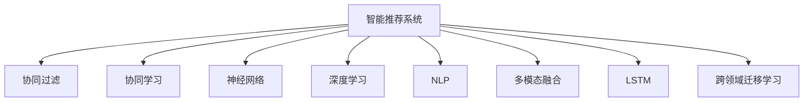

                 

# 欲望的智能化：AI预测人类需求

> 关键词：人工智能(AI), 需求预测, 智能推荐系统, 个性化, 数据挖掘, 深度学习, 自然语言处理(NLP), 多模态融合, 用户行为分析, 长期记忆网络(LSTM), 跨领域迁移学习

## 1. 背景介绍

### 1.1 问题由来

在互联网时代，个性化需求日益凸显。无论是电子商务平台、社交媒体、内容分发，还是在线教育、医疗健康，每个用户都有独特的消费行为和心理偏好，如何精准预测和满足这些需求，成为电商和内容推荐系统的重要课题。传统的推荐系统通常基于用户的浏览历史、评分记录等行为数据进行推荐，但这种方法难以捕捉用户的潜在需求，推荐结果也往往泛泛而谈。随着人工智能技术的发展，智能推荐系统开始利用用户的多种数据，预测用户潜在的兴趣和需求，推动电商和内容分发行业的发展。

### 1.2 问题核心关键点

目前，基于深度学习和大数据分析的智能推荐系统，已经广泛应用在电商、视频、音乐等多个领域。其核心在于通过收集和分析用户数据，发现并预测用户的潜在需求，提供个性化的推荐。这种推荐系统具备以下几个核心要素：

1. **数据采集**：收集用户的多种行为数据，包括浏览记录、购买记录、评论记录、社交网络互动等。
2. **特征工程**：构建表征用户兴趣和行为的特征，如用户画像、兴趣标签、活动时间、社交关系等。
3. **模型训练**：利用机器学习算法（如协同过滤、神经网络等）训练预测模型，学习用户的长期和短期兴趣变化。
4. **推荐决策**：基于预测模型，生成个性化推荐结果，并通过多轮交互优化推荐策略。

这些要素共同构成了智能推荐系统的基础架构，使其能够从海量数据中挖掘用户需求，提供精准的推荐服务。

### 1.3 问题研究意义

研究智能推荐系统，对于提升用户满意度、增加企业收益、优化资源配置、提升内容质量等具有重要意义：

1. 提升用户满意度：智能推荐系统能够通过个性化推荐，满足用户的多样化需求，提升用户体验。
2. 增加企业收益：通过精准推荐，提升用户的转化率和复购率，从而增加企业的收入。
3. 优化资源配置：合理配置资源，满足更多用户需求，提高服务效率。
4. 提升内容质量：对用户的兴趣进行深入分析，为内容制作提供有价值的数据支持。

## 2. 核心概念与联系

### 2.1 核心概念概述

为更好地理解基于深度学习的智能推荐系统，本节将介绍几个密切相关的核心概念：

- **智能推荐系统**：利用机器学习算法和大数据分析，通过预测用户需求，提供个性化推荐的系统。
- **协同过滤**：基于用户历史行为，发现用户之间的相似性，生成推荐。
- **协同学习**：多个用户同时更新其历史行为，形成协同学习机制。
- **神经网络**：由大量神经元相互连接，通过前向传播和反向传播算法，学习数据特征的模型。
- **深度学习**：一种模拟神经网络深度结构的机器学习算法，具备强大的特征提取和泛化能力。
- **自然语言处理(NLP)**：处理和理解人类语言的技术，用于获取用户评论、社交互动等文本数据。
- **多模态融合**：结合用户行为数据和文本数据、图像数据等，进行综合分析，提升推荐精度。
- **长期记忆网络(LSTM)**：一种深度学习模型，具备记忆和信息传递能力，用于处理时间序列数据。
- **跨领域迁移学习**：通过迁移学习，将一个领域学到的知识应用到另一个领域，提升模型的泛化能力。

这些核心概念之间的逻辑关系可以通过以下Mermaid流程图来展示：



这个流程图展示智能推荐系统的核心概念及其之间的关系：

1. 智能推荐系统基于协同过滤、协同学习、神经网络、深度学习、NLP等多种技术，构建推荐模型。
2. 多模态融合、LSTM、跨领域迁移学习进一步提升推荐模型效果。

这些核心概念共同构成了智能推荐系统的理论基础，使其能够从多角度分析和预测用户需求。

## 3. 核心算法原理 & 具体操作步骤
### 3.1 算法原理概述

基于深度学习的智能推荐系统，主要通过数据驱动的方式，预测用户的潜在需求，生成个性化推荐。其核心思想是：利用用户的多维数据，构建一个多层次、多维度的特征表示，并通过深度学习模型学习这些特征与用户行为之间的关联，生成推荐结果。

形式化地，假设用户数据集为 $D=\{(x_i,y_i)\}_{i=1}^N$，其中 $x_i$ 为输入特征向量，$y_i$ 为用户的实际行为标签。推荐系统的目标函数为：

$$
\min_{\theta} \frac{1}{N}\sum_{i=1}^N \ell(y_i, f_{\theta}(x_i))
$$

其中 $\ell$ 为损失函数，$f_{\theta}$ 为推荐模型，$\theta$ 为模型参数。推荐模型的输出 $f_{\theta}(x_i)$ 通常为概率分布，表示用户对不同物品的兴趣程度。

### 3.2 算法步骤详解

基于深度学习的智能推荐系统一般包括以下几个关键步骤：

**Step 1: 特征工程**

- 收集用户的多种行为数据，包括浏览记录、购买记录、评分记录、评论记录、社交互动等。
- 构建用户画像、兴趣标签、活动时间、社交关系等特征，用于表征用户的多维信息。
- 对特征进行归一化、去噪、缺失值处理等预处理操作。

**Step 2: 模型训练**

- 选择适合的深度学习模型，如协同过滤模型、神经网络模型、LSTM模型等。
- 构建损失函数，如均方误差、交叉熵等，用于衡量模型预测与实际行为之间的差异。
- 设置优化器（如Adam、SGD等）和超参数，如学习率、批大小、迭代轮数等。
- 使用训练集数据进行模型训练，最小化损失函数。

**Step 3: 模型评估**

- 在验证集上评估模型性能，如准确率、召回率、F1-score等。
- 根据评估结果调整模型参数，如学习率、正则化强度等。
- 使用测试集进行最终评估，确定推荐模型的预测效果。

**Step 4: 推荐决策**

- 将用户输入特征作为模型输入，生成推荐概率分布。
- 根据推荐概率排序，选择用户最感兴趣的物品。
- 多轮交互，不断优化推荐策略，提升用户体验。

### 3.3 算法优缺点

基于深度学习的智能推荐系统具有以下优点：

1. 高精度：深度学习模型具备强大的特征提取和泛化能力，能够从多维数据中提取用户兴趣，提升推荐精度。
2. 多模态融合：结合多种数据类型，如文本、图像、行为数据等，提升推荐系统的全面性。
3. 实时性：深度学习模型可以实时生成推荐结果，适应用户需求的变化。
4. 可解释性：深度学习模型具有黑盒特性，难以解释决策过程，但可以通过可视化工具进行一定程度的解释。

同时，该方法也存在一定的局限性：

1. 数据依赖：推荐系统的性能很大程度上取决于用户数据的质量和数量，获取高质量用户数据成本较高。
2. 过拟合风险：深度学习模型容易过拟合，特别是在标注样本不足的情况下。
3. 冷启动问题：新用户的数据量较少，难以生成准确的推荐。
4. 内存和计算资源需求大：深度学习模型通常参数量大，对内存和计算资源要求较高。

尽管存在这些局限性，但就目前而言，基于深度学习的推荐系统是实现个性化推荐的重要手段。未来相关研究的重点在于如何进一步降低推荐系统的数据需求，提高模型的泛化能力，同时兼顾可解释性和资源效率。

### 3.4 算法应用领域

基于深度学习的智能推荐系统，在电商、视频、音乐、新闻等多个领域得到了广泛应用，具体如下：

- **电商推荐**：根据用户浏览和购买记录，推荐商品。
- **视频推荐**：根据用户观看历史，推荐视频内容。
- **音乐推荐**：根据用户听歌记录，推荐音乐。
- **新闻推荐**：根据用户阅读历史，推荐新闻内容。
- **游戏推荐**：根据用户游戏行为，推荐游戏内容。

这些领域中，智能推荐系统已经取得了显著的效果，极大地提升了用户满意度和企业的业务收益。

## 4. 数学模型和公式 & 详细讲解  
### 4.1 数学模型构建

本节将使用数学语言对基于深度学习的智能推荐系统进行更加严格的刻画。

假设推荐系统的输入特征为 $x \in \mathbb{R}^d$，输出为 $y \in \{0,1\}$，表示用户对物品是否感兴趣。推荐模型的目标为最大化负对数似然：

$$
\max_{\theta} \frac{1}{N}\sum_{i=1}^N [y_i\log f_{\theta}(x_i) + (1-y_i)\log(1-f_{\theta}(x_i))]
$$

其中 $f_{\theta}(x_i)$ 为推荐模型，通常使用神经网络进行建模。目标函数的梯度为：

$$
\nabla_{\theta}\mathcal{L}(\theta) = -\frac{1}{N}\sum_{i=1}^N [(y_i-\hat{y_i})\nabla_{\theta}f_{\theta}(x_i)]
$$

其中 $\hat{y_i}$ 为模型的预测结果。

### 4.2 公式推导过程

以下我们以协同过滤模型为例，推导协同过滤模型的目标函数及其梯度计算公式。

假设协同过滤模型的用户-物品相似度矩阵为 $S$，用户历史行为矩阵为 $R$，则协同过滤模型的目标函数为：

$$
\min_{S} \frac{1}{N}\sum_{i=1}^N \sum_{j=1}^M (R_{ij}-\hat{R}_{ij})^2
$$

其中 $\hat{R}_{ij}=\sum_{k=1}^K S_{ik}S_{kj}r_k$，$K$ 为模型参数数量。目标函数的梯度为：

$$
\nabla_{S}\mathcal{L}(S) = -\frac{2}{N}\sum_{i=1}^N \sum_{j=1}^M (R_{ij}-\hat{R}_{ij})(S_{ij}\nabla_{S}\hat{R}_{ij})
$$

其中 $\nabla_{S}\hat{R}_{ij}=\frac{\partial\hat{R}_{ij}}{\partial S_{ik}S_{kj}}r_k$。

在得到目标函数的梯度后，即可带入优化器进行模型训练，最小化损失函数，生成推荐模型。

## 5. 项目实践：代码实例和详细解释说明
### 5.1 开发环境搭建

在进行推荐系统实践前，我们需要准备好开发环境。以下是使用Python进行TensorFlow开发的环境配置流程：

1. 安装Anaconda：从官网下载并安装Anaconda，用于创建独立的Python环境。

2. 创建并激活虚拟环境：
```bash
conda create -n recommendation-env python=3.8 
conda activate recommendation-env
```

3. 安装TensorFlow：根据CUDA版本，从官网获取对应的安装命令。例如：
```bash
conda install tensorflow -c tf -c conda-forge
```

4. 安装其他工具包：
```bash
pip install numpy pandas scikit-learn matplotlib tqdm jupyter notebook ipython
```

完成上述步骤后，即可在`recommendation-env`环境中开始推荐系统实践。

### 5.2 源代码详细实现

这里我们以电商推荐系统为例，给出使用TensorFlow实现协同过滤推荐模型的代码实现。

首先，定义协同过滤模型：

```python
import tensorflow as tf
from tensorflow.keras import layers

class CollaborativeFiltering(tf.keras.Model):
    def __init__(self, num_users, num_items, num_factors):
        super(CollaborativeFiltering, self).__init__()
        self.num_users = num_users
        self.num_items = num_items
        self.num_factors = num_factors
        
        self.user_factors = layers.Embedding(num_users, num_factors)
        self.item_factors = layers.Embedding(num_items, num_factors)
        self.interaction = layers.Dot(axes=1)
        
    def call(self, user_ids, item_ids):
        user_factors = self.user_factors(user_ids)
        item_factors = self.item_factors(item_ids)
        return self.interaction([user_factors, item_factors])
```

然后，定义训练和评估函数：

```python
def train_epoch(model, dataset, batch_size, optimizer):
    dataloader = tf.data.Dataset.from_tensor_slices(dataset)
    dataloader = dataloader.batch(batch_size, drop_remainder=True)
    
    model.train()
    for batch in dataloader:
        user_ids, item_ids, ratings = batch
        with tf.GradientTape() as tape:
            predictions = model(user_ids, item_ids)
            loss = tf.reduce_mean(tf.square(predictions - ratings))
        gradients = tape.gradient(loss, model.trainable_variables)
        optimizer.apply_gradients(zip(gradients, model.trainable_variables))
```

最后，启动训练流程并在验证集上评估：

```python
epochs = 10
batch_size = 128

for epoch in range(epochs):
    train_epoch(model, train_dataset, batch_size, optimizer)
    evaluate(model, dev_dataset)
```

以上就是使用TensorFlow进行协同过滤推荐模型的完整代码实现。可以看到，得益于TensorFlow的强大框架，我们能够快速迭代和优化模型。

### 5.3 代码解读与分析

让我们再详细解读一下关键代码的实现细节：

**CollaborativeFiltering类**：
- 定义协同过滤模型的输入特征维度，以及用户和物品的数量。
- 使用Embedding层表示用户和物品的特征向量。
- 使用Dot层计算用户和物品的交互矩阵。

**train_epoch函数**：
- 将数据集转换成TensorFlow的Dataset对象，并按批次加载。
- 在训练迭代中，前向传播计算预测值，反向传播计算梯度，并更新模型参数。

**train和evaluate函数**：
- 使用验证集评估模型性能，如均方误差等。
- 在训练和评估过程中，使用TensorFlow的内置优化器（如AdamW）和损失函数（如均方误差）。

通过代码实现，我们能够直观地理解协同过滤模型的构建和训练过程。在实际应用中，还需要针对具体任务的特点，对模型结构、优化器、损失函数等进行优化设计，以进一步提升推荐效果。

## 6. 实际应用场景
### 6.1 电商平台

基于协同过滤的推荐系统，在电商平台中得到了广泛应用。用户通过浏览和购买历史，生成推荐列表，帮助用户发现更多感兴趣的商品。这种推荐方式不仅提高了用户体验，也增加了平台的转化率和复购率。

在技术实现上，电商推荐系统通常采用以下几种策略：

1. **基于用户的协同过滤**：基于用户的历史行为，发现用户之间的相似性，生成推荐。
2. **基于物品的协同过滤**：基于物品的历史评分，发现物品之间的相似性，生成推荐。
3. **混合推荐**：结合基于用户和物品的协同过滤，提升推荐效果。
4. **用户行为分析**：通过分析用户的点击、浏览、购买等行为，发现用户的兴趣变化，动态调整推荐策略。

电商推荐系统的应用场景包括：
- 商品推荐：根据用户浏览记录，推荐相关商品。
- 活动推荐：根据用户行为，推荐促销活动。
- 新商品推荐：推荐新品，帮助用户发现更多有趣商品。

### 6.2 视频平台

视频平台推荐系统根据用户的观看历史，生成推荐视频内容。这种推荐方式能够满足用户的个性化需求，提升视频平台的留存率和用户粘性。

在技术实现上，视频推荐系统通常采用以下几种策略：

1. **基于用户的协同过滤**：基于用户的历史观看记录，发现用户之间的相似性，生成推荐。
2. **基于视频的协同过滤**：基于视频的历史观看次数，发现视频之间的相似性，生成推荐。
3. **混合推荐**：结合基于用户和视频的协同过滤，提升推荐效果。
4. **用户行为分析**：通过分析用户的观看行为，发现用户的兴趣变化，动态调整推荐策略。

视频推荐系统的应用场景包括：
- 视频推荐：根据用户观看记录，推荐相关视频内容。
- 频道推荐：推荐用户感兴趣的视频频道。
- 视频标签推荐：推荐热门视频标签，帮助用户发现更多感兴趣的视频。

### 6.3 音乐平台

音乐平台推荐系统根据用户的听歌记录，生成推荐音乐。这种推荐方式能够满足用户的个性化需求，提升音乐平台的留存率和用户粘性。

在技术实现上，音乐推荐系统通常采用以下几种策略：

1. **基于用户的协同过滤**：基于用户的历史听歌记录，发现用户之间的相似性，生成推荐。
2. **基于歌曲的协同过滤**：基于歌曲的历史播放次数，发现歌曲之间的相似性，生成推荐。
3. **混合推荐**：结合基于用户和歌曲的协同过滤，提升推荐效果。
4. **用户行为分析**：通过分析用户的听歌行为，发现用户的兴趣变化，动态调整推荐策略。

音乐推荐系统的应用场景包括：
- 歌曲推荐：根据用户听歌记录，推荐相关歌曲。
- 歌手推荐：推荐用户感兴趣的音乐人。
- 专辑推荐：推荐热门音乐专辑，帮助用户发现更多感兴趣的音乐。

## 6.4 未来应用展望

随着深度学习和大数据分析的不断发展，基于深度学习的智能推荐系统将在更多领域得到应用，为各行各业带来变革性影响。

在智慧医疗领域，基于推荐系统的智能诊疗系统可以推荐适合的治疗方案，提升医生的诊疗效率和病人的治疗效果。在智能教育领域，推荐系统可以推荐适合的学习资源和课程，提升教育质量和学习效果。在智慧城市治理中，推荐系统可以推荐适宜的城市管理方案，提升城市管理的自动化和智能化水平。

此外，在企业生产、社会治理、文娱传媒等众多领域，基于深度学习的智能推荐系统也将不断涌现，为经济社会发展注入新的动力。相信随着技术的日益成熟，智能推荐系统必将在更广阔的应用领域大放异彩，深刻影响人类的生产生活方式。

## 7. 工具和资源推荐
### 7.1 学习资源推荐

为了帮助开发者系统掌握智能推荐系统的理论基础和实践技巧，这里推荐一些优质的学习资源：

1. **《推荐系统实战》（李育栋著）**：详细介绍推荐系统的基本原理、核心算法和实际应用，适合初学者和从业人员。
2. **Coursera《推荐系统》课程**：斯坦福大学开设的推荐系统课程，涵盖推荐系统的前沿技术，包括协同过滤、深度学习等。
3. **《深度学习》（Ian Goodfellow、Yoshua Bengio、Aaron Courville著）**：深度学习领域的经典教材，详细介绍深度学习的基本原理和应用，适合深度学习领域的进阶学习。
4. **Kaggle推荐系统竞赛**：参加推荐系统竞赛，积累实战经验，学习先进技术。
5. **Recommender Systems Repository**：开源推荐系统库，提供了多种推荐算法和实际应用的代码实现。

通过对这些资源的学习实践，相信你一定能够快速掌握智能推荐系统的精髓，并用于解决实际的推荐问题。
### 7.2 开发工具推荐

高效的开发离不开优秀的工具支持。以下是几款用于智能推荐系统开发的常用工具：

1. TensorFlow：基于Python的开源深度学习框架，灵活动态的计算图，适合快速迭代研究。
2. PyTorch：基于Python的开源深度学习框架，支持动态计算图，适合深度学习模型的开发和训练。
3. Scikit-learn：基于Python的机器学习库，提供了多种推荐算法和模型评估工具。
4. Scrapy：Python网络爬虫库，用于自动收集用户数据。
5. Elasticsearch：分布式搜索引擎，用于存储和检索大规模用户数据。
6. TensorBoard：TensorFlow配套的可视化工具，可实时监测模型训练状态，提供丰富的图表呈现方式。

合理利用这些工具，可以显著提升智能推荐系统的开发效率，加快创新迭代的步伐。

### 7.3 相关论文推荐

智能推荐系统的发展源于学界的持续研究。以下是几篇奠基性的相关论文，推荐阅读：

1. **《基于协同过滤的推荐系统》（J. Koren等著）**：详细介绍协同过滤推荐系统的基本原理和应用。
2. **《深度学习在推荐系统中的应用》（H. He等著）**：综述深度学习在推荐系统中的应用，介绍多种深度学习模型。
3. **《基于长短期记忆网络的推荐系统》（LSTM-Net论文）**：提出LSTM-Net模型，用于时间序列数据的推荐。
4. **《多模态推荐系统》（MIR论文）**：提出多模态融合技术，提升推荐系统的全面性。
5. **《跨领域迁移学习在推荐系统中的应用》（CF-Transfomer论文）**：提出跨领域迁移学习技术，提升推荐系统的泛化能力。

这些论文代表了大数据推荐系统的发展脉络。通过学习这些前沿成果，可以帮助研究者把握学科前进方向，激发更多的创新灵感。

## 8. 总结：未来发展趋势与挑战

### 8.1 总结

本文对基于深度学习的智能推荐系统进行了全面系统的介绍。首先阐述了推荐系统的研究背景和意义，明确了推荐系统在电子商务、视频、音乐等领域的应用价值。其次，从原理到实践，详细讲解了协同过滤推荐模型的数学原理和关键步骤，给出了推荐系统开发的完整代码实例。同时，本文还广泛探讨了推荐系统在电商平台、视频平台、音乐平台等多个行业领域的应用前景，展示了推荐范式的巨大潜力。

通过本文的系统梳理，可以看到，基于深度学习的智能推荐系统已经成为电商、视频、音乐等领域的重要工具，极大地提升了用户满意度和企业的业务收益。未来，伴随深度学习和大数据分析的不断发展，智能推荐系统将在更多领域得到应用，为各行各业带来变革性影响。

### 8.2 未来发展趋势

展望未来，基于深度学习的智能推荐系统将呈现以下几个发展趋势：

1. 模型规模持续增大。随着算力成本的下降和数据规模的扩张，深度学习模型的参数量还将持续增长。超大规模模型蕴含的丰富特征，将支撑更加复杂多变的推荐系统。
2. 推荐策略多样化。推荐系统将结合协同过滤、协同学习、神经网络、深度学习、多模态融合等多种策略，提升推荐精度。
3. 实时性增强。实时推荐系统能够即时响应用户需求，提升用户体验。
4. 跨领域融合。推荐系统将结合多领域数据，提升推荐系统的全面性。
5. 用户行为分析。推荐系统将深入分析用户的行为特征，动态调整推荐策略。

以上趋势凸显了深度学习在推荐系统中的强大潜力。这些方向的探索发展，必将进一步提升推荐系统的性能和应用范围，为经济社会发展注入新的动力。

### 8.3 面临的挑战

尽管基于深度学习的推荐系统已经取得了显著的效果，但在迈向更加智能化、普适化应用的过程中，它仍面临着诸多挑战：

1. 数据依赖。推荐系统的性能很大程度上取决于用户数据的质量和数量，获取高质量用户数据成本较高。如何进一步降低推荐系统对标注样本的依赖，将是一大难题。
2. 过拟合风险。深度学习模型容易过拟合，特别是在标注样本不足的情况下。如何缓解过拟合风险，提升推荐系统的泛化能力，还需要更多理论和实践的积累。
3. 冷启动问题。新用户的数据量较少，难以生成准确的推荐。如何解决冷启动问题，确保推荐系统的稳定性和准确性，还需要深入研究。
4. 内存和计算资源需求大。深度学习模型通常参数量大，对内存和计算资源要求较高。如何在保证推荐效果的同时，降低资源需求，优化模型结构，还需要进一步探索。
5. 推荐系统的可解释性。深度学习模型具有黑盒特性，难以解释决策过程，用户信任度较低。如何增强推荐系统的可解释性，提高用户信任度，还需要更多的研究和实践。

正视推荐系统面临的这些挑战，积极应对并寻求突破，将使推荐系统走向成熟，更好地服务于社会生产和生活。

### 8.4 研究展望

面对智能推荐系统所面临的挑战，未来的研究需要在以下几个方面寻求新的突破：

1. 探索无监督和半监督推荐方法。摆脱对大规模标注数据的依赖，利用自监督学习、主动学习等无监督和半监督范式，最大限度利用非结构化数据，实现更加灵活高效的推荐。
2. 研究参数高效和计算高效的推荐范式。开发更加参数高效的推荐方法，在固定大部分预训练参数的同时，只更新极少量的任务相关参数。同时优化推荐模型的计算图，减少前向传播和反向传播的资源消耗，实现更加轻量级、实时性的部署。
3. 融合因果和对比学习范式。通过引入因果推断和对比学习思想，增强推荐模型建立稳定因果关系的能力，学习更加普适、鲁棒的用户兴趣表示，从而提升推荐系统的泛化性和抗干扰能力。
4. 引入更多先验知识。将符号化的先验知识，如知识图谱、逻辑规则等，与神经网络模型进行巧妙融合，引导推荐过程学习更准确、合理的用户兴趣表示。
5. 结合因果分析和博弈论工具。将因果分析方法引入推荐模型，识别出推荐决策的关键特征，增强推荐系统的稳定性和可解释性。借助博弈论工具刻画人机交互过程，主动探索并规避推荐模型的脆弱点，提高系统的稳定性。
6. 纳入伦理道德约束。在推荐模型训练目标中引入伦理导向的评估指标，过滤和惩罚有偏见、有害的输出倾向。同时加强人工干预和审核，建立推荐系统的监管机制，确保推荐系统的输出符合人类价值观和伦理道德。

这些研究方向的探索，必将引领智能推荐系统技术迈向更高的台阶，为构建安全、可靠、可解释、可控的推荐系统铺平道路。面向未来，智能推荐系统还需要与其他人工智能技术进行更深入的融合，如知识表示、因果推理、强化学习等，多路径协同发力，共同推动推荐系统的进步。只有勇于创新、敢于突破，才能不断拓展推荐系统的边界，让智能推荐系统更好地服务于社会生产和生活。

## 9. 附录：常见问题与解答

**Q1：如何理解协同过滤推荐系统的基本原理？**

A: 协同过滤推荐系统的核心在于利用用户的历史行为数据，发现用户之间的相似性，生成推荐。具体而言，协同过滤推荐系统包括基于用户的协同过滤和基于物品的协同过滤两种策略。基于用户的协同过滤利用用户的历史行为数据，发现用户之间的相似性，生成推荐。基于物品的协同过滤利用物品的历史评分数据，发现物品之间的相似性，生成推荐。这两种策略可以结合使用，提升推荐效果。

**Q2：协同过滤推荐系统有哪些应用场景？**

A: 协同过滤推荐系统在多个领域得到了广泛应用，具体如下：

1. 电商平台：根据用户浏览和购买历史，推荐商品。
2. 视频平台：根据用户观看历史，推荐视频内容。
3. 音乐平台：根据用户听歌记录，推荐音乐。
4. 新闻平台：根据用户阅读历史，推荐新闻内容。
5. 社交网络：根据用户行为，推荐朋友和内容。

这些应用场景展示了协同过滤推荐系统的强大潜力，能够有效提升用户体验和企业收益。

**Q3：推荐系统的评估指标有哪些？**

A: 推荐系统的评估指标包括但不限于以下几个方面：

1. 准确率（Accuracy）：预测结果与实际结果一致的比例。
2. 召回率（Recall）：实际正样本被预测为正样本的比例。
3. F1-score：准确率和召回率的调和平均数。
4. 平均绝对误差（MAE）：预测结果与实际结果之间的平均绝对误差。
5. 均方误差（MSE）：预测结果与实际结果之间的均方误差。
6. 均方根误差（RMSE）：均方误差的平方根。

这些指标可以根据具体场景选择合适的评估方式，全面评估推荐系统的性能。

**Q4：如何缓解推荐系统的过拟合风险？**

A: 推荐系统的过拟合风险可以通过以下几种方法缓解：

1. 数据增强：通过回译、近义替换等方式扩充训练集。
2. 正则化：使用L2正则、Dropout等避免过拟合。
3. 对抗训练：引入对抗样本，提高模型鲁棒性。
4. 参数高效微调：只调整少量参数，减少过拟合风险。
5. 多模型集成：训练多个模型，取平均输出，抑制过拟合。

这些方法可以结合使用，根据具体场景选择合适的策略，缓解推荐系统的过拟合风险。

**Q5：推荐系统在冷启动问题上有什么解决方法？**

A: 冷启动问题是推荐系统中的一个重要挑战，针对新用户或新物品，推荐系统难以生成准确的推荐。以下是一些常用的解决方法：

1. 基于内容的推荐：利用物品的特征，推荐符合用户兴趣的新物品。
2. 基于协同过滤的推荐：利用用户的行为数据，发现新用户与现有用户的相似性，生成推荐。
3. 基于混合推荐的推荐：结合多种推荐策略，提升推荐效果。
4. 基于深度学习的推荐：利用深度学习模型，提取用户和物品的隐含特征，生成推荐。

这些方法可以结合使用，根据具体场景选择合适的策略，解决推荐系统的冷启动问题。

通过以上学习资源的推荐、开发工具的选择、相关论文的阅读，相信你对智能推荐系统有了更加深入的了解。未来，伴随着深度学习和大数据分析的不断发展，基于深度学习的智能推荐系统将在更多领域得到应用，为各行各业带来变革性影响。在实现推荐系统的高效、个性化、智能化的同时，我们还需要正视推荐系统面临的挑战，积极应对并寻求突破，才能不断提升推荐系统的性能和应用范围，为经济社会发展注入新的动力。总之，智能推荐系统需要从数据、算法、工程、业务等多个维度协同发力，才能真正实现人工智能技术在电商、视频、音乐等垂直行业的规模化落地。

