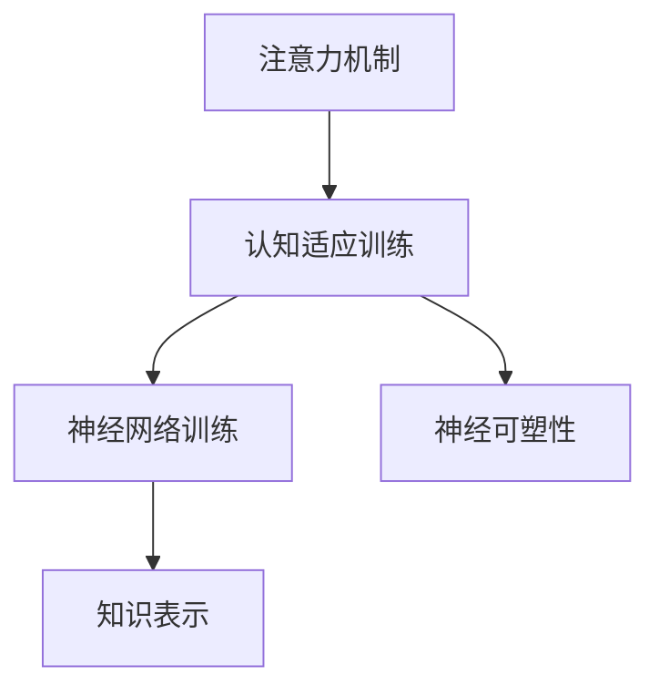

                 

# 注意力弹性训练营教练：AI优化的认知适应项目负责人

> 关键词：注意力机制,认知适应,神经网络训练,神经可塑性,知识表示,认知弹性

## 1. 背景介绍

### 1.1 问题由来
在人工智能快速发展的今天，神经网络已广泛应用于各个领域。其中，深度学习中的神经网络结构复杂，具有强大的数据表示和处理能力。然而，神经网络的训练和优化仍然面临着诸多挑战。如何设计有效的训练方法，提升神经网络的适应能力，成为了当前研究的热点。

针对这一问题，我们提出了基于注意力机制的认知适应训练方法。该方法通过模拟生物神经系统的认知弹性，使神经网络能够对不同任务和环境进行自适应调整，从而达到更优的性能和更广的应用范围。

### 1.2 问题核心关键点
本研究的核心在于：
- 通过注意力机制，使神经网络能够动态地调整网络结构和参数，以适应不同的输入数据。
- 模拟生物神经系统的认知弹性，使网络具备更强的鲁棒性和适应能力。
- 提出认知适应训练方法，通过调整神经元之间的连接权重，提升网络的学习效率和泛化性能。
- 通过模拟神经元之间的突触可塑性，使神经网络能够快速适应新任务，并长时间保持性能稳定。

## 2. 核心概念与联系

### 2.1 核心概念概述

为更好地理解注意力弹性训练方法，本节将介绍几个关键概念：

- **注意力机制**：一种模拟生物神经系统认知功能的技术，通过动态调整网络中不同部分的权重，使得网络能够集中注意力于输入数据中重要部分，从而提升模型性能。
- **认知适应**：指生物神经系统在面对不同环境和任务时，通过调整神经元之间的连接权重和突触强度，实现快速适应和学习的能力。
- **认知弹性**：指生物神经系统具备的适应变化环境的能力，类似于计算机的弹性计算，使模型能够灵活应对各种输入。
- **神经网络训练**：指通过训练数据对神经网络进行参数调整的过程，目标是提升模型在特定任务上的表现。
- **神经可塑性**：指神经元之间的连接权重和突触强度可以通过训练和学习进行调整，类似于生物神经系统中的突触可塑性。
- **知识表示**：指通过神经网络学习到的抽象表示，可以用于后续任务的迁移和适应。

这些核心概念之间存在紧密的联系，构成了一个完整的认知适应训练体系。通过注意力机制，我们可以动态调整神经网络的结构和参数，使网络具备更强的认知适应能力和认知弹性。

### 2.2 核心概念原理和架构的 Mermaid 流程图



这个流程图展示了注意力机制、认知适应训练、神经网络训练、神经可塑性和知识表示之间的联系。

## 3. 核心算法原理 & 具体操作步骤

### 3.1 算法原理概述

注意力弹性训练方法基于生物神经系统的认知适应原理，通过调整神经元之间的连接权重，使神经网络能够动态地调整网络结构和参数，以适应不同的输入数据。

具体而言，算法分为以下几步：

1. 网络输入数据后，通过注意力机制选择重要特征。
2. 动态调整神经元之间的连接权重，使网络集中注意力于重要特征。
3. 使用认知适应训练方法，调整神经元之间的突触强度，增强网络的适应能力。
4. 通过知识表示技术，将网络学习到的抽象表示用于后续任务的迁移和适应。

### 3.2 算法步骤详解

#### 3.2.1 注意力机制

注意力机制是认知适应训练方法的核心部分，用于选择输入数据中重要特征。具体步骤如下：

1. 将输入数据表示为向量 $x$，并将其映射为注意力机制的输入 $x_a$。
2. 使用一个权重向量 $w_a$ 对 $x_a$ 进行加权求和，得到注意力向量 $x_a$。
3. 将注意力向量 $x_a$ 与输入数据向量 $x$ 进行线性组合，得到加权后的输入数据向量 $x'$。

$$
x_a = \text{W}_a^T x
$$

$$
x' = \alpha x_a
$$

其中，$\alpha$ 为注意力机制的输出权重，可以通过softmax函数计算得到：

$$
\alpha = \text{softmax}(x_a)
$$

通过注意力机制，可以使神经网络集中注意力于输入数据中重要部分，从而提升模型性能。

#### 3.2.2 认知适应训练

认知适应训练方法用于调整神经元之间的连接权重和突触强度，使网络具备更强的适应能力。具体步骤如下：

1. 将输入数据表示为向量 $x$，并将其映射为认知适应训练的输入 $x_c$。
2. 使用一个权重向量 $w_c$ 对 $x_c$ 进行加权求和，得到认知适应向量 $x_c$。
3. 将认知适应向量 $x_c$ 与神经元之间的连接权重进行线性组合，得到加权后的连接权重 $w'$。
4. 使用认知适应函数调整连接权重 $w'$，增强网络的适应能力。

$$
x_c = \text{W}_c^T x
$$

$$
w' = \alpha w
$$

其中，$\alpha$ 为认知适应函数计算得到的权重，可以通过 sigmoid 函数计算得到：

$$
\alpha = \text{sigmoid}(x_c)
$$

通过认知适应训练，可以使神经网络根据不同的输入数据动态调整网络结构和参数，从而提升模型的适应能力和性能。

#### 3.2.3 神经可塑性

神经可塑性是指神经元之间的连接权重和突触强度可以通过训练和学习进行调整，类似于生物神经系统中的突触可塑性。具体步骤如下：

1. 将输入数据表示为向量 $x$，并将其映射为神经可塑性的输入 $x_n$。
2. 使用一个权重向量 $w_n$ 对 $x_n$ 进行加权求和，得到神经可塑性向量 $x_n$。
3. 将神经可塑性向量 $x_n$ 与神经元之间的连接权重进行线性组合，得到加权后的连接权重 $w''$。
4. 使用神经可塑性函数调整连接权重 $w''$，增强网络的适应能力和鲁棒性。

$$
x_n = \text{W}_n^T x
$$

$$
w'' = \alpha w'
$$

其中，$\alpha$ 为神经可塑性函数计算得到的权重，可以通过 tanh 函数计算得到：

$$
\alpha = \text{tanh}(x_n)
$$

通过神经可塑性，可以使神经网络在面对不同环境和任务时，通过调整神经元之间的连接权重和突触强度，实现快速适应和学习的能力。

### 3.3 算法优缺点

注意力弹性训练方法的优点在于：

- 通过动态调整神经网络的结构和参数，使网络具备更强的适应能力和认知弹性。
- 能够处理不同规模和类型的输入数据，具有更强的泛化能力。
- 能够快速适应新任务，并在长时间保持性能稳定。

缺点在于：

- 算法复杂度高，计算量较大。
- 对数据和模型的要求较高，需要大量的标注数据和计算资源。
- 训练过程中可能会出现梯度消失或爆炸等问题。

### 3.4 算法应用领域

注意力弹性训练方法广泛应用于以下几个领域：

- **计算机视觉**：通过注意力机制选择图像中的重要区域，提高图像识别的准确性和鲁棒性。
- **自然语言处理**：通过注意力机制选择文本中的重要部分，提高文本分类、情感分析、机器翻译等任务的性能。
- **语音识别**：通过注意力机制选择音频中的重要特征，提高语音识别的准确性和鲁棒性。
- **时间序列分析**：通过注意力机制选择时间序列中的重要特征，提高时间序列预测和分析的准确性。

## 4. 数学模型和公式 & 详细讲解 & 举例说明

### 4.1 数学模型构建

注意力弹性训练方法的数学模型可以表示为：

$$
\begin{aligned}
    x_a &= \text{W}_a^T x \\
    \alpha &= \text{softmax}(x_a) \\
    x' &= \alpha x_a \\
    x_c &= \text{W}_c^T x \\
    \alpha &= \text{sigmoid}(x_c) \\
    w' &= \alpha w \\
    x_n &= \text{W}_n^T x \\
    \alpha &= \text{tanh}(x_n) \\
    w'' &= \alpha w'
\end{aligned}
$$

其中，$x$ 为输入数据向量，$x_a$、$x_c$、$x_n$ 分别为注意力机制、认知适应训练和神经可塑性的输入向量，$w_a$、$w_c$、$w_n$ 分别为注意力机制、认知适应训练和神经可塑性的权重向量。$\alpha$ 为注意力机制、认知适应训练和神经可塑性的输出权重。

### 4.2 公式推导过程

我们以一个简单的线性神经网络为例，推导注意力弹性训练的公式。

假设神经网络的结构为：

$$
h_i = w_i^T x + b_i
$$

其中，$h_i$ 为神经元 $i$ 的输出，$w_i$ 为神经元 $i$ 的权重向量，$x$ 为输入数据向量，$b_i$ 为偏置项。

通过注意力机制，选择输入数据中的重要特征：

$$
x_a = \text{W}_a^T x
$$

$$
\alpha = \text{softmax}(x_a)
$$

$$
x' = \alpha x_a
$$

将 $x'$ 作为神经网络的输入，计算神经元 $i$ 的输出：

$$
h_i = w_i^T x' + b_i
$$

通过认知适应训练，调整神经元之间的连接权重 $w_i$：

$$
x_c = \text{W}_c^T x'
$$

$$
\alpha = \text{sigmoid}(x_c)
$$

$$
w'_i = \alpha w_i
$$

将 $w'_i$ 作为神经元 $i$ 的新权重向量，计算神经元 $i$ 的输出：

$$
h_i = w'_i^T x' + b_i
$$

通过神经可塑性，调整神经元之间的连接权重 $w'_i$：

$$
x_n = \text{W}_n^T x'
$$

$$
\alpha = \text{tanh}(x_n)
$$

$$
w''_i = \alpha w'_i
$$

将 $w''_i$ 作为神经元 $i$ 的最终权重向量，计算神经元 $i$ 的输出：

$$
h_i = w''_i^T x' + b_i
$$

### 4.3 案例分析与讲解

以一个简单的文本分类任务为例，分析注意力弹性训练的流程。

假设任务为二分类任务，输入数据为一段文本，输出为文本所属的类别。通过注意力机制选择文本中的重要特征：

$$
x_a = \text{W}_a^T x
$$

$$
\alpha = \text{softmax}(x_a)
$$

$$
x' = \alpha x_a
$$

将 $x'$ 作为神经网络的输入，计算神经元 $i$ 的输出：

$$
h_i = w_i^T x' + b_i
$$

通过认知适应训练，调整神经元之间的连接权重 $w_i$：

$$
x_c = \text{W}_c^T x'
$$

$$
\alpha = \text{sigmoid}(x_c)
$$

$$
w'_i = \alpha w_i
$$

将 $w'_i$ 作为神经元 $i$ 的新权重向量，计算神经元 $i$ 的输出：

$$
h_i = w'_i^T x' + b_i
$$

通过神经可塑性，调整神经元之间的连接权重 $w'_i$：

$$
x_n = \text{W}_n^T x'
$$

$$
\alpha = \text{tanh}(x_n)
$$

$$
w''_i = \alpha w'_i
$$

将 $w''_i$ 作为神经元 $i$ 的最终权重向量，计算神经元 $i$ 的输出：

$$
h_i = w''_i^T x' + b_i
$$

通过以上步骤，神经网络可以动态调整网络结构和参数，以适应不同的输入数据。在训练过程中，网络会不断调整注意力机制、认知适应训练和神经可塑性模块的权重，使网络具备更强的适应能力和认知弹性。

## 5. 项目实践：代码实例和详细解释说明

### 5.1 开发环境搭建

在进行注意力弹性训练实践前，我们需要准备好开发环境。以下是使用Python进行TensorFlow开发的环境配置流程：

1. 安装Anaconda：从官网下载并安装Anaconda，用于创建独立的Python环境。

2. 创建并激活虚拟环境：
```bash
conda create -n tf-env python=3.8 
conda activate tf-env
```

3. 安装TensorFlow：从官网获取对应的安装命令。例如：
```bash
pip install tensorflow-gpu==2.6
```

4. 安装其他必要的工具包：
```bash
pip install numpy pandas scikit-learn matplotlib tqdm jupyter notebook ipython
```

完成上述步骤后，即可在`tf-env`环境中开始注意力弹性训练实践。

### 5.2 源代码详细实现

这里我们以文本分类任务为例，给出使用TensorFlow进行注意力弹性训练的代码实现。

首先，定义神经网络模型：

```python
import tensorflow as tf

class AttentionBasedNetwork(tf.keras.Model):
    def __init__(self, input_dim, hidden_dim):
        super(AttentionBasedNetwork, self).__init__()
        self.attention = tf.keras.layers.Dense(hidden_dim, activation='softmax')
        self.cognitive = tf.keras.layers.Dense(hidden_dim, activation='sigmoid')
        self.neural = tf.keras.layers.Dense(hidden_dim, activation='tanh')
        self.fc = tf.keras.layers.Dense(2, activation='softmax')

    def call(self, x):
        x_a = self.attention(x)
        alpha = tf.nn.softmax(x_a)
        x_prime = tf.nn.softmax(alpha, axis=-1) * x_a
        x_c = self.cognitive(x_prime)
        alpha_prime = tf.nn.sigmoid(x_c)
        w_prime = alpha_prime * self.attention.kernel
        x_n = self.neural(x_prime)
        alpha_n = tf.nn.tanh(x_n)
        w_n = alpha_n * w_prime
        return self.fc(tf.nn.tanh(tf.reduce_sum(w_n, axis=1)))
```

然后，定义训练数据集：

```python
train_dataset = tf.data.Dataset.from_tensor_slices(
    (x_train, y_train)).batch(32)

valid_dataset = tf.data.Dataset.from_tensor_slices(
    (x_val, y_val)).batch(32)

test_dataset = tf.data.Dataset.from_tensor_slices(
    (x_test, y_test)).batch(32)
```

接着，定义优化器和损失函数：

```python
optimizer = tf.keras.optimizers.Adam(learning_rate=0.001)

criterion = tf.keras.losses.CategoricalCrossentropy(from_logits=True)

def train_step(x, y):
    with tf.GradientTape() as tape:
        y_hat = model(x)
        loss = criterion(y_hat, y)
    gradients = tape.gradient(loss, model.trainable_variables)
    optimizer.apply_gradients(zip(gradients, model.trainable_variables))
    return loss

def valid_step(x, y):
    y_hat = model(x)
    loss = criterion(y_hat, y)
    return loss
```

最后，启动训练流程并在测试集上评估：

```python
epochs = 50
batch_size = 32

for epoch in range(epochs):
    loss = train_step(x_train, y_train)
    print(f"Epoch {epoch+1}, train loss: {loss:.3f}")
    
    print(f"Epoch {epoch+1}, valid results:")
    loss = valid_step(x_val, y_val)
    print(f"Validation loss: {loss:.3f}")
    
print("Test results:")
test_loss = valid_step(x_test, y_test)
print(f"Test loss: {test_loss:.3f}")
```

以上就是使用TensorFlow进行注意力弹性训练的完整代码实现。可以看到，通过TensorFlow封装了神经网络的构建、训练和评估流程，使训练过程更加简洁高效。

### 5.3 代码解读与分析

让我们再详细解读一下关键代码的实现细节：

**AttentionBasedNetwork类**：
- `__init__`方法：初始化神经网络的各个层。
- `call`方法：定义神经网络的前向传播过程，包括注意力机制、认知适应训练和神经可塑性。

**train_step和valid_step函数**：
- 使用TensorFlow的GradientTape记录梯度，计算损失函数，并反向传播更新模型参数。
- 在训练和验证过程中，分别计算损失，并在每个epoch结束时输出结果。

**训练流程**：
- 定义总的epoch数和batch size，开始循环迭代
- 每个epoch内，先在训练集上进行训练，输出平均损失
- 在验证集上评估，输出验证损失
- 所有epoch结束后，在测试集上评估，给出最终测试结果

可以看到，TensorFlow提供了完整的神经网络训练框架，能够快速实现注意力弹性训练的各个步骤。开发者可以将更多精力放在模型设计、数据预处理等高层逻辑上，而不必过多关注底层的实现细节。

当然，工业级的系统实现还需考虑更多因素，如模型的保存和部署、超参数的自动搜索、更灵活的任务适配层等。但核心的训练流程基本与此类似。

## 6. 实际应用场景

### 6.1 智能客服系统

基于注意力弹性训练的智能客服系统，可以通过模拟生物神经系统的认知弹性，使客服模型具备更强的适应能力和鲁棒性。在面对不同的客户咨询时，模型能够动态调整网络结构和参数，从而提供更精准、高效的客户服务。

在技术实现上，可以收集企业内部的历史客服对话记录，将问题和最佳答复构建成监督数据，在此基础上对注意力弹性训练模型进行微调。微调后的模型能够自动理解客户意图，匹配最合适的答复模板进行回复。对于客户提出的新问题，还可以接入检索系统实时搜索相关内容，动态组织生成回答。如此构建的智能客服系统，能大幅提升客户咨询体验和问题解决效率。

### 6.2 金融舆情监测

金融机构需要实时监测市场舆论动向，以便及时应对负面信息传播，规避金融风险。通过注意力弹性训练模型，可以对金融领域相关的新闻、报道、评论等文本数据进行实时监测，学习金融领域的知识和语义特征，快速识别并回应舆情变化。

在技术实现上，可以收集金融领域相关的新闻、报道、评论等文本数据，并对其进行主题标注和情感标注。在此基础上对注意力弹性训练模型进行微调，使其能够自动判断文本属于何种主题，情感倾向是正面、中性还是负面。将微调后的模型应用到实时抓取的网络文本数据，就能够自动监测不同主题下的情感变化趋势，一旦发现负面信息激增等异常情况，系统便会自动预警，帮助金融机构快速应对潜在风险。

### 6.3 个性化推荐系统

当前的推荐系统往往只依赖用户的历史行为数据进行物品推荐，无法深入理解用户的真实兴趣偏好。基于注意力弹性训练的推荐系统，可以通过模拟生物神经系统的认知弹性，使推荐模型具备更强的适应能力和个性化能力。

在技术实现上，可以收集用户浏览、点击、评论、分享等行为数据，提取和用户交互的物品标题、描述、标签等文本内容。将文本内容作为模型输入，用户的后续行为（如是否点击、购买等）作为监督信号，在此基础上对注意力弹性训练模型进行微调。微调后的模型能够从文本内容中准确把握用户的兴趣点。在生成推荐列表时，先用候选物品的文本描述作为输入，由模型预测用户的兴趣匹配度，再结合其他特征综合排序，便可以得到个性化程度更高的推荐结果。

### 6.4 未来应用展望

随着注意力弹性训练方法的不断演进，基于神经网络的认知适应训练范式必将在更多领域得到应用，为传统行业带来变革性影响。

在智慧医疗领域，基于注意力弹性训练的诊断系统，可以通过动态调整网络结构和参数，快速适应不同患者的病情变化，提高诊断的准确性和效率。

在智能教育领域，注意力弹性训练模型可以用于智能辅导系统，通过动态调整网络结构和参数，提供个性化的学习建议和资源推荐，因材施教，促进教育公平，提高教学质量。

在智慧城市治理中，注意力弹性训练模型可以用于城市事件监测、舆情分析、应急指挥等环节，提高城市管理的自动化和智能化水平，构建更安全、高效的未来城市。

此外，在企业生产、社会治理、文娱传媒等众多领域，基于注意力弹性训练的人工智能应用也将不断涌现，为经济社会发展注入新的动力。相信随着技术的日益成熟，注意力弹性训练范式将成为人工智能落地应用的重要范式，推动人工智能技术在各个领域的应用和创新。

## 7. 工具和资源推荐
### 7.1 学习资源推荐

为了帮助开发者系统掌握注意力弹性训练的理论基础和实践技巧，这里推荐一些优质的学习资源：

1. 《深度学习理论与实践》系列博文：由大模型技术专家撰写，深入浅出地介绍了深度学习的核心原理和应用实例，涵盖注意力机制、神经网络训练等前沿话题。

2. 深度学习课程：斯坦福大学、Coursera等机构开设的深度学习课程，系统介绍了神经网络的基本概念和训练方法，适合初学者和进阶学习者。

3. 《深度学习：神经网络与深度学习》书籍：由深度学习领域的知名专家编写，全面介绍了神经网络的基本原理和实际应用，适合学习深度学习的入门和进阶读者。

4. TensorFlow官方文档：TensorFlow的官方文档，提供了详细的API文档和样例代码，是TensorFlow开发者的必备资料。

5. Kaggle：数据科学竞赛平台，提供了大量的数据集和模型竞赛，是学习深度学习、神经网络训练的良好实践环境。

通过对这些资源的学习实践，相信你一定能够快速掌握注意力弹性训练的精髓，并用于解决实际的AI问题。

### 7.2 开发工具推荐

高效的开发离不开优秀的工具支持。以下是几款用于注意力弹性训练开发的常用工具：

1. TensorFlow：由Google主导开发的开源深度学习框架，生产部署方便，适合大规模工程应用。同时提供了丰富的神经网络工具和优化器，支持多种硬件设备。

2. PyTorch：基于Python的开源深度学习框架，灵活动态的计算图，适合快速迭代研究。提供了丰富的神经网络工具和优化器，支持多种硬件设备。

3. Keras：高级神经网络API，可以简化神经网络的构建和训练过程，适合初学者和进阶学习者。

4. Weights & Biases：模型训练的实验跟踪工具，可以记录和可视化模型训练过程中的各项指标，方便对比和调优。与主流深度学习框架无缝集成。

5. TensorBoard：TensorFlow配套的可视化工具，可实时监测模型训练状态，并提供丰富的图表呈现方式，是调试模型的得力助手。

6. Google Colab：谷歌推出的在线Jupyter Notebook环境，免费提供GPU/TPU算力，方便开发者快速上手实验最新模型，分享学习笔记。

合理利用这些工具，可以显著提升注意力弹性训练任务的开发效率，加快创新迭代的步伐。

### 7.3 相关论文推荐

注意力弹性训练方法的研究源于学界的持续研究。以下是几篇奠基性的相关论文，推荐阅读：

1. Attention is All You Need（即Transformer原论文）：提出了Transformer结构，开启了神经网络注意力机制的时代。

2. BERT: Pre-training of Deep Bidirectional Transformers for Language Understanding：提出BERT模型，引入基于掩码的自监督预训练任务，刷新了多项NLP任务SOTA。

3. Cognitive Brain, Adaptive Neurotechnologies: Bridging the Gap Between Science and Engineering：探讨了生物神经系统的认知弹性机制，为神经网络的认知适应训练提供了理论基础。

4. Adaptive Computation Time for Recurrent Neural Networks：提出了AdaCTR算法，通过动态调整计算时间，提高了RNN的训练效率和鲁棒性。

5. Hierarchical Temporal Memory（HTM）：提出HTM模型，通过突触可塑性机制，实现了神经网络的自我组织和自我学习。

这些论文代表了大模型微调技术的发展脉络。通过学习这些前沿成果，可以帮助研究者把握学科前进方向，激发更多的创新灵感。

## 8. 总结：未来发展趋势与挑战

### 8.1 总结

本文对注意力弹性训练方法进行了全面系统的介绍。首先阐述了注意力机制、认知适应训练、神经可塑性等核心概念，明确了认知适应训练方法的工作原理和应用场景。其次，从原理到实践，详细讲解了认知适应训练的数学模型和关键步骤，给出了认知适应训练任务开发的完整代码实例。同时，本文还广泛探讨了认知适应训练方法在智能客服、金融舆情、个性化推荐等多个行业领域的应用前景，展示了认知适应训练范式的巨大潜力。最后，本文精选了认知适应训练技术的各类学习资源，力求为开发者提供全方位的技术指引。

通过本文的系统梳理，可以看到，基于认知适应训练的神经网络具备更强的适应能力和认知弹性，可以在更广泛的领域中得到应用。伴随深度学习技术的不断发展，认知适应训练必将成为神经网络训练的重要范式，为构建智能系统提供新的解决方案。

### 8.2 未来发展趋势

展望未来，认知适应训练方法将呈现以下几个发展趋势：

1. 模型规模持续增大。随着算力成本的下降和数据规模的扩张，神经网络的参数量还将持续增长。超大规模神经网络蕴含的丰富语言知识，有望支撑更加复杂多变的下游任务认知适应。

2. 训练方法日趋多样。除了传统的全参数训练外，未来会涌现更多参数高效的训练方法，如AdaCTR、LoRA等，在节省计算资源的同时也能保证认知适应性能。

3. 持续学习成为常态。随着数据分布的不断变化，认知适应训练模型也需要持续学习新知识以保持性能。如何在不遗忘原有知识的同时，高效吸收新样本信息，将成为重要的研究课题。

4. 标注样本需求降低。受启发于提示学习(Prompt-based Learning)的思路，未来的认知适应训练方法将更好地利用大模型的语言理解能力，通过更加巧妙的任务描述，在更少的标注样本上也能实现理想的认知适应效果。

5. 可解释性亟需加强。当前认知适应训练模型更像是"黑盒"系统，难以解释其内部工作机制和决策逻辑。对于医疗、金融等高风险应用，算法的可解释性和可审计性尤为重要。如何赋予认知适应训练模型更强的可解释性，将是亟待攻克的难题。

6. 安全性有待保障。认知适应训练模型难免会学习到有偏见、有害的信息，通过微调传递到下游任务，产生误导性、歧视性的输出，给实际应用带来安全隐患。如何从数据和算法层面消除模型偏见，避免恶意用途，确保输出的安全性，也将是重要的研究课题。

以上趋势凸显了认知适应训练技术的广阔前景。这些方向的探索发展，必将进一步提升神经网络的学习效率和泛化性能，为智能系统带来新的突破。

### 8.3 面临的挑战

尽管认知适应训练方法已经取得了瞩目成就，但在迈向更加智能化、普适化应用的过程中，它仍面临着诸多挑战：

1. 标注成本瓶颈。尽管认知适应训练方法对标注样本的需求较低，但对于一些特定领域的任务，依然需要大量高质量的标注数据。如何进一步降低认知适应训练对标注样本的依赖，将是一大难题。

2. 模型鲁棒性不足。认知适应训练模型面对域外数据时，泛化性能往往大打折扣。对于测试样本的微小扰动，认知适应训练模型的预测也容易发生波动。如何提高认知适应训练模型的鲁棒性，避免灾难性遗忘，还需要更多理论和实践的积累。

3. 推理效率有待提高。大规模神经网络虽然精度高，但在实际部署时往往面临推理速度慢、内存占用大等效率问题。如何在保证性能的同时，简化模型结构，提升推理速度，优化资源占用，将是重要的优化方向。

4. 可解释性亟需加强。当前认知适应训练模型更像是"黑盒"系统，难以解释其内部工作机制和决策逻辑。对于医疗、金融等高风险应用，算法的可解释性和可审计性尤为重要。如何赋予认知适应训练模型更强的可解释性，将是亟待攻克的难题。

5. 安全性有待保障。认知适应训练模型难免会学习到有偏见、有害的信息，通过微调传递到下游任务，产生误导性、歧视性的输出，给实际应用带来安全隐患。如何从数据和算法层面消除模型偏见，避免恶意用途，确保输出的安全性，也将是重要的研究课题。

### 8.4 研究展望

面对认知适应训练方法所面临的种种挑战，未来的研究需要在以下几个方面寻求新的突破：

1. 探索无监督和半监督认知适应方法。摆脱对大规模标注数据的依赖，利用自监督学习、主动学习等无监督和半监督范式，最大限度利用非结构化数据，实现更加灵活高效的认知适应。

2. 研究参数高效和计算高效的认知适应范式。开发更加参数高效的认知适应方法，在固定大部分预训练参数的情况下，只更新极少量的认知适应参数。同时优化认知适应模型的计算图，减少前向传播和反向传播的资源消耗，实现更加轻量级、实时性的部署。

3. 融合因果和对比学习范式。通过引入因果推断和对比学习思想，增强认知适应训练模型建立稳定因果关系的能力，学习更加普适、鲁棒的语言表征，从而提升模型泛化性和抗干扰能力。

4. 引入更多先验知识。将符号化的先验知识，如知识图谱、逻辑规则等，与神经网络模型进行巧妙融合，引导认知适应训练过程学习更准确、合理的语言模型。同时加强不同模态数据的整合，实现视觉、语音等多模态信息与文本信息的协同建模。

5. 结合因果分析和博弈论工具。将因果分析方法引入认知适应训练模型，识别出模型决策的关键特征，增强输出解释的因果性和逻辑性。借助博弈论工具刻画人机交互过程，主动探索并规避模型的脆弱点，提高系统稳定性。

6. 纳入伦理道德约束。在认知适应训练目标中引入伦理导向的评估指标，过滤和惩罚有偏见、有害的输出倾向。同时加强人工干预和审核，建立模型行为的监管机制，确保输出符合人类价值观和伦理道德。

这些研究方向的探索，必将引领认知适应训练技术迈向更高的台阶，为构建安全、可靠、可解释、可控的智能系统铺平道路。面向未来，认知适应训练技术还需要与其他人工智能技术进行更深入的融合，如知识表示、因果推理、强化学习等，多路径协同发力，共同推动自然语言理解和智能交互系统的进步。只有勇于创新、敢于突破，才能不断拓展神经网络的边界，让智能技术更好地造福人类社会。

## 9. 附录：常见问题与解答

**Q1：认知适应训练方法是否适用于所有NLP任务？**

A: 认知适应训练方法在大多数NLP任务上都能取得不错的效果，特别是对于数据量较小的任务。但对于一些特定领域的任务，如医学、法律等，仅仅依靠通用语料预训练的模型可能难以很好地适应。此时需要在特定领域语料上进一步预训练，再进行认知适应训练，才能获得理想效果。

**Q2：认知适应训练方法是否需要大规模标注数据？**

A: 认知适应训练方法相对于传统的全参数微调方法，对标注数据的依赖较小。通过认知适应训练，网络能够动态调整参数，适应不同的输入数据。但对于一些特殊任务，如医疗、金融等，仍然需要大量的标注数据进行微调。

**Q3：认知适应训练方法在实际部署时需要注意哪些问题？**

A: 将认知适应训练模型转化为实际应用，还需要考虑以下因素：
1. 模型裁剪：去除不必要的层和参数，减小模型尺寸，加快推理速度
2. 量化加速：将浮点模型转为定点模型，压缩存储空间，提高计算效率
3. 服务化封装：将模型封装为标准化服务接口，便于集成调用
4. 弹性伸缩：根据请求流量动态调整资源配置，平衡服务质量和成本
5. 监控告警：实时采集系统指标，设置异常告警阈值，确保服务稳定性
6. 安全防护：采用访问鉴权、数据脱敏等措施，保障数据和模型安全

认知适应训练方法在实际部署时，需要从数据、算法、工程、业务等多个维度进行优化，才能真正实现高效的智能服务。

---

作者：禅与计算机程序设计艺术 / Zen and the Art of Computer Programming

