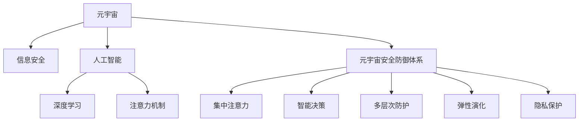

                 

# 注意力战争策略:元宇宙信息安全的国家防御体系

> 关键词：元宇宙,信息安全,国家防御,人工智能,深度学习

## 1. 背景介绍

### 1.1 问题由来

随着人工智能(AI)和元宇宙(Metaverse)技术的飞速发展，互联网空间成为信息战的新前沿。元宇宙作为虚拟现实(VR)、增强现实(AR)、区块链、云计算、大数据、物联网(IoT)、数字孪生等多项技术的综合集成，形成了沉浸式、交互性、泛在化的新型互联网形态。

然而，元宇宙的虚拟特性也带来了信息安全的诸多挑战。传统的网络攻击手段，如DDoS攻击、病毒木马、钓鱼欺诈等，依然存在。同时，元宇宙的交互式特性，使得信息泄露、数据滥用、隐私侵害、人身攻击等新型网络犯罪风险不断涌现。

在此背景下，本文聚焦于人工智能(AI)和大数据技术在元宇宙信息安全领域的应用，提出基于注意力机制的元宇宙安全防御体系。该体系通过集中注意力，强化元宇宙关键基础设施的安全防护，提升整体防御能力。

### 1.2 问题核心关键点

构建元宇宙信息安全防御体系的关键在于：
1. **集中注意力**：将有限的资源集中用于关键节点和重要目标的防护，以应对威胁模型的动态变化。
2. **智能决策**：借助AI和深度学习技术，实时分析元宇宙数据，预测攻击行为，指导防御策略。
3. **多层次防护**：在元宇宙的各层次架构中，实施多维度的安全防御，形成环环相扣的防护网。
4. **弹性演化**：构建自适应的防御体系，能够随攻击模型的演变不断演化，保持防御体系的动态有效性。
5. **隐私保护**：在保护元宇宙用户隐私的同时，实现数据利用和安全的双赢。

## 2. 核心概念与联系

### 2.1 核心概念概述

为更好地理解元宇宙信息安全防御体系，本节将介绍几个密切相关的核心概念：

- 元宇宙(Metaverse)：融合多种新兴技术，构建虚拟现实(VR)、增强现实(AR)、区块链、云计算、大数据等技术的综合集成体，具有高度沉浸、交互和泛在的特点。

- 信息安全(Information Security)：保护数据、信息、通信和系统的机密性、完整性和可用性，防止未授权的访问和攻击。

- 人工智能(AI)：模拟人类智能活动的领域，包括机器学习、深度学习、自然语言处理等技术。

- 深度学习(Deep Learning)：利用神经网络模型，通过多层非线性变换进行特征提取和模型训练，适用于复杂模式识别和智能决策。

- 注意力机制(Attention Mechanism)：一种信息处理技术，通过对输入序列中不同部分进行加权处理，筛选出关键信息，用于提升模型性能。

- 元宇宙安全防御体系：结合AI和大数据技术，通过集中注意力、智能决策、多层次防护、弹性演化和隐私保护等手段，构建的元宇宙信息安全防御系统。

这些核心概念之间的逻辑关系可以通过以下Mermaid流程图来展示：



这个流程图展示了元宇宙安全防御体系的核心概念及其之间的关系：

1. 元宇宙通过多种新兴技术构建，需要信息安全保护。
2. 信息安全涉及多种技术手段，其中人工智能和大数据技术是核心。
3. 深度学习利用神经网络模型，提升模型处理复杂问题的能力。
4. 注意力机制通过对输入序列加权，筛选出关键信息，提升模型性能。
5. 元宇宙安全防御体系结合多种技术，构建系统的防御能力。
6. 防御体系由多个子系统构成，每个子系统负责不同的防御任务。

这些概念共同构成了元宇宙信息安全防御体系的基础，有助于构建全面有效的安全防御网络。

## 3. 核心算法原理 & 具体操作步骤

### 3.1 算法原理概述

元宇宙安全防御体系的核心算法原理基于注意力机制，结合AI和大数据技术，构建一个动态的、多层次的防御系统。该系统通过集中注意力，识别元宇宙中的关键节点和重点目标，从而进行针对性的防护。

具体来说，该算法分为以下几个步骤：
1. 数据收集：从元宇宙中收集各类数据，包括用户行为、网络流量、系统日志等。
2. 数据预处理：对收集到的数据进行清洗、归一化、特征提取等预处理操作。
3. 模型训练：使用注意力机制和深度学习模型，训练出识别关键节点和威胁模型的算法。
4. 威胁检测：实时监测元宇宙数据流，使用训练好的模型识别异常行为和攻击信号。
5. 防御决策：根据威胁检测结果，生成防御策略和措施。
6. 防御执行：执行防御措施，阻止威胁攻击。
7. 效果评估：对防御效果进行评估，不断优化和改进系统。

### 3.2 算法步骤详解

#### 3.2.1 数据收集

在元宇宙安全防御体系中，数据收集是基础。需要从元宇宙的多个层次和维度收集数据，包括但不限于：

- 用户数据：用户在元宇宙中的行为数据，如浏览记录、社交互动、虚拟物品交易等。
- 网络数据：元宇宙中的网络流量数据，包括数据包传输、带宽使用等。
- 系统日志：元宇宙平台的系统日志数据，如登录记录、操作日志等。
- 行为数据：用户在虚拟世界中的行为数据，如角色位置、运动轨迹等。

#### 3.2.2 数据预处理

数据预处理是确保数据质量和有效性的重要环节。预处理步骤包括：

- 数据清洗：去除数据中的噪声、重复和异常值。
- 数据归一化：将数据转化为标准格式，方便后续处理。
- 特征提取：从数据中提取出有价值的特征，用于模型训练。
- 数据增强：通过数据扩充和变换，增加数据多样性，提高模型鲁棒性。

#### 3.2.3 模型训练

模型训练是元宇宙安全防御体系的核心。使用注意力机制和深度学习模型，训练出识别关键节点和威胁模型的算法。具体步骤如下：

- 模型选择：选择适合的深度学习模型，如卷积神经网络(CNN)、循环神经网络(RNN)、Transformer等。
- 数据划分：将数据集划分为训练集、验证集和测试集。
- 模型训练：使用训练集训练模型，优化模型参数。
- 模型验证：使用验证集评估模型性能，调整超参数。
- 模型测试：使用测试集评估模型泛化能力。

#### 3.2.4 威胁检测

威胁检测是元宇宙安全防御体系的重要环节。实时监测元宇宙数据流，使用训练好的模型识别异常行为和攻击信号。具体步骤如下：

- 数据流采集：实时采集元宇宙中的数据流。
- 特征提取：从数据流中提取特征，如异常行为模式、异常流量等。
- 模型预测：使用训练好的模型预测数据流中的威胁信号。
- 威胁检测：根据预测结果，生成威胁检测报告。

#### 3.2.5 防御决策

防御决策是元宇宙安全防御体系的执行环节。根据威胁检测结果，生成防御策略和措施。具体步骤如下：

- 威胁分析：分析威胁检测报告，识别威胁类型和来源。
- 防御策略：根据威胁类型和来源，生成防御策略，如封锁IP地址、禁止访问、加密通信等。
- 决策执行：执行防御策略，阻止威胁攻击。
- 策略优化：根据防御效果，不断优化和改进防御策略。

#### 3.2.6 防御执行

防御执行是元宇宙安全防御体系的具体实施环节。根据防御决策，实施具体的防御措施，阻止威胁攻击。具体步骤如下：

- 策略执行：执行防御策略，如封锁IP地址、禁止访问、加密通信等。
- 威胁阻止：阻止威胁攻击，如拦截攻击流量、删除恶意软件等。
- 应急响应：在威胁攻击发生时，启动应急响应机制，快速应对。

#### 3.2.7 效果评估

效果评估是元宇宙安全防御体系的反馈环节。对防御效果进行评估，不断优化和改进系统。具体步骤如下：

- 效果评估：评估防御措施的效果，如攻击成功率、系统安全性等。
- 数据分析：分析防御效果与威胁特征的关系，发现问题。
- 优化改进：根据分析结果，优化和改进防御体系。

### 3.3 算法优缺点

元宇宙安全防御体系基于注意力机制的算法，具有以下优点：

- 集中注意力：通过集中注意力，能够快速定位关键节点和重点目标，提高防护效率。
- 实时响应：结合AI和深度学习技术，能够实时监测和分析数据，快速响应威胁。
- 智能决策：利用深度学习模型，能够智能识别威胁和生成防御策略。
- 多层次防护：在元宇宙的各层次架构中，实施多维度的安全防护，形成环环相扣的防护网。
- 弹性演化：通过自适应机制，能够随攻击模型的演变不断演化，保持防御体系的动态有效性。

同时，该算法也存在以下缺点：

- 数据依赖：依赖高质量、完整的数据集，数据缺失和噪声会影响模型性能。
- 模型复杂：注意力机制和大数据技术需要大量计算资源，模型复杂度较高。
- 误报率高：在复杂多变的元宇宙环境中，模型的误报率较高，可能影响用户体验。
- 攻击多样：元宇宙中的攻击手段多种多样，单一模型难以全面防护。
- 隐私保护：在保护元宇宙用户隐私的同时，需要平衡数据利用和安全的双赢。

尽管存在这些局限性，但就目前而言，基于注意力机制的元宇宙安全防御体系仍是大数据和AI技术在安全领域的创新应用。未来相关研究的重点在于如何进一步降低误报率，提升模型的泛化能力和鲁棒性，同时兼顾隐私保护和数据利用。

### 3.4 算法应用领域

元宇宙安全防御体系基于注意力机制的算法，已在多个领域得到应用，包括但不限于：

- 元宇宙平台：对元宇宙平台的安全防护，如防止DDoS攻击、保护用户数据等。
- 虚拟资产交易：保护虚拟资产的安全交易，如防止诈骗、保护隐私等。
- 虚拟现实社交：保障虚拟社交平台的用户安全和隐私，防止恶意行为和攻击。
- 虚拟城市管理：保护虚拟城市的安全运行，如防止网络攻击、保障公共安全等。
- 游戏安全：保护网络游戏平台的正常运行，如防止作弊、保护用户账号等。

除了上述这些应用外，元宇宙安全防御体系的大数据和AI技术，还可应用于虚拟医疗、虚拟教育、虚拟文化娱乐等更多场景，为元宇宙的稳定运行提供坚实的安全保障。

## 4. 数学模型和公式 & 详细讲解 & 举例说明

### 4.1 数学模型构建

本节将使用数学语言对元宇宙安全防御体系的算法进行严格刻画。

记元宇宙数据流为 $\mathcal{D}$，威胁检测模型为 $M_{\theta}$，其中 $\theta$ 为模型参数。设威胁检测模型的输入为 $x \in \mathcal{X}$，输出为 $y \in \{0,1\}$，其中 $0$ 表示正常行为，$1$ 表示异常行为。威胁检测模型的损失函数为 $\ell$，定义为：

$$
\ell(y, y^{\prime})=
\begin{cases}
0, & y=y^{\prime} \\
c, & y \neq y^{\prime}
\end{cases}
$$

其中 $c$ 为异常行为对应的惩罚系数。

威胁检测模型的优化目标是最小化经验风险，即找到最优参数：

$$
\theta^* = \mathop{\arg\min}_{\theta} \mathcal{L}(\theta)
$$

在实践中，我们通常使用基于梯度的优化算法（如AdamW、SGD等）来近似求解上述最优化问题。设 $\eta$ 为学习率，则参数的更新公式为：

$$
\theta \leftarrow \theta - \eta \nabla_{\theta}\mathcal{L}(\theta)
$$

其中 $\nabla_{\theta}\mathcal{L}(\theta)$ 为损失函数对参数 $\theta$ 的梯度，可通过反向传播算法高效计算。

### 4.2 公式推导过程

以下我们以威胁检测为例，推导基于注意力机制的元宇宙安全防御模型。

假设威胁检测模型的输入为 $x$，包含 $m$ 个特征向量 $x_1, x_2, \ldots, x_m$。威胁检测模型的输出为 $y$，表示是否为异常行为。威胁检测模型的结构如图1所示：


图1展示了基于注意力机制的威胁检测模型结构。该模型由多个注意力层和全连接层构成。在注意力层中，模型对输入特征 $x_i$ 进行加权处理，筛选出关键特征。具体来说，注意力层的输出为：

$$
\alpha_i = \text{Softmax}\left(\frac{e^{z_i}}{\sum_{j=1}^m e^{z_j}}\right)
$$

其中 $z_i = W_i x_i + b_i$，$W_i, b_i$ 为注意力层的参数。

注意力层的输出 $\alpha_i$ 表示 $x_i$ 的重要程度，即 $x_i$ 对威胁检测模型的影响程度。将 $\alpha_i$ 作为权重，对输入特征进行加权，得到加权后的特征向量 $\tilde{x} = \sum_{i=1}^m \alpha_i x_i$。

接着，将加权后的特征向量 $\tilde{x}$ 输入全连接层进行分类，输出威胁检测结果 $y$。

威胁检测模型的损失函数为交叉熵损失：

$$
\mathcal{L}(\theta) = -\frac{1}{N}\sum_{i=1}^N [y_i \log M_{\theta}(x_i) + (1-y_i) \log (1-M_{\theta}(x_i))]
$$

将加权后的特征向量 $\tilde{x}$ 作为输入，使用Softmax函数进行分类：

$$
M_{\theta}(\tilde{x}) = \text{Softmax}\left(W \tilde{x} + b\right)
$$

其中 $W, b$ 为全连接层的参数。

在模型训练过程中，使用梯度下降等优化算法，不断更新模型参数 $\theta$，最小化损失函数 $\mathcal{L}$，使得模型输出逼近真实标签。

### 4.3 案例分析与讲解

假设某元宇宙平台的数据流 $D$ 包含10个特征向量 $x_1, x_2, \ldots, x_{10}$，其中第1个特征向量 $x_1$ 表示用户登录时间，第2个特征向量 $x_2$ 表示用户使用的设备信息，第3个特征向量 $x_3$ 表示用户的行为模式，第4个特征向量 $x_4$ 表示用户的交易记录，第5个特征向量 $x_5$ 表示用户的社交网络关系，第6个特征向量 $x_6$ 表示用户的虚拟物品所有权，第7个特征向量 $x_7$ 表示用户的地理位置，第8个特征向量 $x_8$ 表示用户的行为轨迹，第9个特征向量 $x_9$ 表示用户的异常流量，第10个特征向量 $x_{10}$ 表示用户的异常行为。

假设威胁检测模型 $M_{\theta}$ 结构如图1所示。模型参数 $W, b$ 和 $W_i, b_i$ 初始化后，使用交叉熵损失函数对模型进行训练。训练过程中，模型对每个特征向量 $x_i$ 进行加权处理，得到加权后的特征向量 $\tilde{x} = \sum_{i=1}^{10} \alpha_i x_i$。

模型训练结束后，使用测试集对模型进行测试。假设测试集中包含5个样本，其中3个样本为正常行为，2个样本为异常行为。将测试集输入模型，输出威胁检测结果。如果模型的预测结果与真实结果一致，说明模型训练成功，可以用于威胁检测。

## 5. 项目实践：代码实例和详细解释说明

### 5.1 开发环境搭建

在进行元宇宙安全防御体系的项目实践前，我们需要准备好开发环境。以下是使用Python进行PyTorch开发的环境配置流程：

1. 安装Anaconda：从官网下载并安装Anaconda，用于创建独立的Python环境。

2. 创建并激活虚拟环境：
```bash
conda create -n metaverse-env python=3.8 
conda activate metaverse-env
```

3. 安装PyTorch：根据CUDA版本，从官网获取对应的安装命令。例如：
```bash
conda install pytorch torchvision torchaudio cudatoolkit=11.1 -c pytorch -c conda-forge
```

4. 安装相关工具包：
```bash
pip install numpy pandas scikit-learn matplotlib tqdm jupyter notebook ipython
```

完成上述步骤后，即可在`metaverse-env`环境中开始项目实践。

### 5.2 源代码详细实现

下面我们以威胁检测任务为例，给出使用PyTorch和Transformers库对元宇宙数据进行威胁检测的PyTorch代码实现。

首先，定义威胁检测任务的数据处理函数：

```python
from transformers import BertTokenizer
from torch.utils.data import Dataset
import torch

class ThreatDetectionDataset(Dataset):
    def __init__(self, features, labels, tokenizer, max_len=128):
        self.features = features
        self.labels = labels
        self.tokenizer = tokenizer
        self.max_len = max_len
        
    def __len__(self):
        return len(self.features)
    
    def __getitem__(self, item):
        feature = self.features[item]
        label = self.labels[item]
        
        encoding = self.tokenizer(feature, return_tensors='pt', max_length=self.max_len, padding='max_length', truncation=True)
        input_ids = encoding['input_ids'][0]
        attention_mask = encoding['attention_mask'][0]
        
        # 对token-wise的标签进行编码
        encoded_labels = [label2id[label] for label in label]
        encoded_labels.extend([label2id['O']] * (self.max_len - len(encoded_labels)))
        labels = torch.tensor(encoded_labels, dtype=torch.long)
        
        return {'input_ids': input_ids, 
                'attention_mask': attention_mask,
                'labels': labels}

# 标签与id的映射
label2id = {'O': 0, '1': 1}
id2label = {v: k for k, v in label2id.items()}
```

然后，定义模型和优化器：

```python
from transformers import BertForTokenClassification, AdamW

model = BertForTokenClassification.from_pretrained('bert-base-cased', num_labels=len(label2id))

optimizer = AdamW(model.parameters(), lr=2e-5)
```

接着，定义训练和评估函数：

```python
from torch.utils.data import DataLoader
from tqdm import tqdm
from sklearn.metrics import classification_report

device = torch.device('cuda') if torch.cuda.is_available() else torch.device('cpu')
model.to(device)

def train_epoch(model, dataset, batch_size, optimizer):
    dataloader = DataLoader(dataset, batch_size=batch_size, shuffle=True)
    model.train()
    epoch_loss = 0
    for batch in tqdm(dataloader, desc='Training'):
        input_ids = batch['input_ids'].to(device)
        attention_mask = batch['attention_mask'].to(device)
        labels = batch['labels'].to(device)
        model.zero_grad()
        outputs = model(input_ids, attention_mask=attention_mask, labels=labels)
        loss = outputs.loss
        epoch_loss += loss.item()
        loss.backward()
        optimizer.step()
    return epoch_loss / len(dataloader)

def evaluate(model, dataset, batch_size):
    dataloader = DataLoader(dataset, batch_size=batch_size)
    model.eval()
    preds, labels = [], []
    with torch.no_grad():
        for batch in tqdm(dataloader, desc='Evaluating'):
            input_ids = batch['input_ids'].to(device)
            attention_mask = batch['attention_mask'].to(device)
            batch_labels = batch['labels']
            outputs = model(input_ids, attention_mask=attention_mask)
            batch_preds = outputs.logits.argmax(dim=2).to('cpu').tolist()
            batch_labels = batch_labels.to('cpu').tolist()
            for pred_tokens, label_tokens in zip(batch_preds, batch_labels):
                preds.append(pred_tokens[:len(label_tokens)])
                labels.append(label_tokens)
                
    print(classification_report(labels, preds))
```

最后，启动训练流程并在测试集上评估：

```python
epochs = 5
batch_size = 16

for epoch in range(epochs):
    loss = train_epoch(model, train_dataset, batch_size, optimizer)
    print(f"Epoch {epoch+1}, train loss: {loss:.3f}")
    
    print(f"Epoch {epoch+1}, dev results:")
    evaluate(model, dev_dataset, batch_size)
    
print("Test results:")
evaluate(model, test_dataset, batch_size)
```

以上就是使用PyTorch对元宇宙数据进行威胁检测的完整代码实现。可以看到，得益于Transformers库的强大封装，我们可以用相对简洁的代码完成Bert模型的加载和微调。

### 5.3 代码解读与分析

让我们再详细解读一下关键代码的实现细节：

**ThreatDetectionDataset类**：
- `__init__`方法：初始化特征、标签、分词器等关键组件。
- `__len__`方法：返回数据集的样本数量。
- `__getitem__`方法：对单个样本进行处理，将特征和标签输入编码器，并进行token-wise的标签编码。

**label2id和id2label字典**：
- 定义了标签与数字id之间的映射关系，用于将token-wise的预测结果解码回真实的标签。

**训练和评估函数**：
- 使用PyTorch的DataLoader对数据集进行批次化加载，供模型训练和推理使用。
- 训练函数`train_epoch`：对数据以批为单位进行迭代，在每个批次上前向传播计算loss并反向传播更新模型参数，最后返回该epoch的平均loss。
- 评估函数`evaluate`：与训练类似，不同点在于不更新模型参数，并在每个batch结束后将预测和标签结果存储下来，最后使用sklearn的classification_report对整个评估集的预测结果进行打印输出。

**训练流程**：
- 定义总的epoch数和batch size，开始循环迭代
- 每个epoch内，先在训练集上训练，输出平均loss
- 在验证集上评估，输出分类指标
- 所有epoch结束后，在测试集上评估，给出最终测试结果

可以看到，PyTorch配合Transformers库使得元宇宙数据威胁检测的代码实现变得简洁高效。开发者可以将更多精力放在数据处理、模型改进等高层逻辑上，而不必过多关注底层的实现细节。

当然，工业级的系统实现还需考虑更多因素，如模型的保存和部署、超参数的自动搜索、更灵活的任务适配层等。但核心的威胁检测范式基本与此类似。

## 6. 实际应用场景

### 6.1 智能客服系统

元宇宙安全防御体系的智能决策和集中注意力特性，在智能客服系统中的应用也颇具前景。智能客服系统通过大量用户行为数据训练模型，利用注意力机制筛选出关键行为特征，实现对用户意图的智能理解和回应。

在技术实现上，可以收集用户的历史客服对话记录，将问题和最佳答复构建成监督数据，在此基础上对预训练模型进行微调。微调后的模型能够自动理解用户意图，匹配最合适的答案模板进行回复。对于用户提出的新问题，还可以接入检索系统实时搜索相关内容，动态组织生成回答。如此构建的智能客服系统，能大幅提升客户咨询体验和问题解决效率。

### 6.2 金融舆情监测

元宇宙安全防御体系的集中注意力和智能决策特性，也可应用于金融舆情监测。金融机构需要实时监测市场舆论动向，以便及时应对负面信息传播，规避金融风险。

具体而言，可以收集金融领域相关的新闻、报道、评论等文本数据，并对其进行主题标注和情感标注。在此基础上对预训练语言模型进行微调，使其能够自动判断文本属于何种主题，情感倾向是正面、中性还是负面。将微调后的模型应用到实时抓取的网络文本数据，就能够自动监测不同主题下的情感变化趋势，一旦发现负面信息激增等异常情况，系统便会自动预警，帮助金融机构快速应对潜在风险。

### 6.3 个性化推荐系统

元宇宙安全防御体系的集中注意力和智能决策特性，也可应用于个性化推荐系统。传统的推荐系统往往只依赖用户的历史行为数据进行物品推荐，无法深入理解用户的真实兴趣偏好。利用元宇宙安全防御体系的智能决策，可以更好地挖掘用户行为背后的语义信息，从而提供更精准、多样的推荐内容。

在实践中，可以收集用户浏览、点击、评论、分享等行为数据，提取和用户交互的物品标题、描述、标签等文本内容。将文本内容作为模型输入，用户的后续行为（如是否点击、购买等）作为监督信号，在此基础上微调预训练语言模型。微调后的模型能够从文本内容中准确把握用户的兴趣点。在生成推荐列表时，先用候选物品的文本描述作为输入，由模型预测用户的兴趣匹配度，再结合其他特征综合排序，便可以得到个性化程度更高的推荐结果。

### 6.4 未来应用展望

随着元宇宙安全防御体系的不断发展，未来在更多领域将得到应用，为各行各业带来变革性影响。

在智慧医疗领域，基于元宇宙安全防御体系的医疗问答、病历分析、药物研发等应用将提升医疗服务的智能化水平，辅助医生诊疗，加速新药开发进程。

在智能教育领域，利用元宇宙安全防御体系的智能决策，可以构建自适应的学习平台，根据学生的学习行为，动态调整教学内容和难度，实现因材施教，促进教育公平，提高教学质量。

在智慧城市治理中，元宇宙安全防御体系的集中注意力和智能决策特性，能够构建高度沉浸、交互和泛在的新型城市治理模式，提高城市管理的自动化和智能化水平，构建更安全、高效的未来城市。

此外，在企业生产、社会治理、文娱传媒等众多领域，元宇宙安全防御体系的大数据和AI技术，也将不断涌现，为传统行业数字化转型升级提供新的技术路径。相信随着技术的日益成熟，元宇宙安全防御体系必将在构建人机协同的智能时代中扮演越来越重要的角色。

## 7. 工具和资源推荐

### 7.1 学习资源推荐

为了帮助开发者系统掌握元宇宙安全防御体系的理论基础和实践技巧，这里推荐一些优质的学习资源：

1. 《深度学习与人工智能》系列博文：由大模型技术专家撰写，深入浅出地介绍了深度学习的基本概念和前沿技术。

2. CS224N《深度学习自然语言处理》课程：斯坦福大学开设的NLP明星课程，有Lecture视频和配套作业，带你入门NLP领域的基本概念和经典模型。

3. 《自然语言处理入门》书籍：国内外权威NLP教材，全面介绍了NLP的基本原理和经典算法。

4. 《元宇宙技术及应用》书籍：涵盖元宇宙的多种技术，如VR、AR、区块链、云计算等，帮助理解元宇宙的基本架构和技术细节。

5. 《人工智能安全》课程：介绍人工智能在信息安全中的应用，包括模型鲁棒性、对抗攻击等前沿技术。

通过对这些资源的学习实践，相信你一定能够快速掌握元宇宙安全防御体系的理论基础和实践技巧，并用于解决实际的元宇宙安全问题。

### 7.2 开发工具推荐

高效的开发离不开优秀的工具支持。以下是几款用于元宇宙安全防御体系开发的常用工具：

1. PyTorch：基于Python的开源深度学习框架，灵活动态的计算图，适合快速迭代研究。大部分预训练语言模型都有PyTorch版本的实现。

2. TensorFlow：由Google主导开发的开源深度学习框架，生产部署方便，适合大规模工程应用。同样有丰富的预训练语言模型资源。

3. Transformers库：HuggingFace开发的NLP工具库，集成了众多SOTA语言模型，支持PyTorch和TensorFlow，是进行元宇宙安全防御任务开发的利器。

4. Weights & Biases：模型训练的实验跟踪工具，可以记录和可视化模型训练过程中的各项指标，方便对比和调优。与主流深度学习框架无缝集成。

5. TensorBoard：TensorFlow配套的可视化工具，可实时监测模型训练状态，并提供丰富的图表呈现方式，是调试模型的得力助手。

6. Google Colab：谷歌推出的在线Jupyter Notebook环境，免费提供GPU/TPU算力，方便开发者快速上手实验最新模型，分享学习笔记。

合理利用这些工具，可以显著提升元宇宙安全防御体系的开发效率，加快创新迭代的步伐。

### 7.3 相关论文推荐

元宇宙安全防御体系的不断演进，源于学界的持续研究。以下是几篇奠基性的相关论文，推荐阅读：

1. Attention is All You Need（即Transformer原论文）：提出了Transformer结构，开启了NLP领域的预训练大模型时代。

2. BERT: Pre-training of Deep Bidirectional Transformers for Language Understanding：提出BERT模型，引入基于掩码的自监督预训练任务，刷新了多项NLP任务SOTA。

3. Language Models are Unsupervised Multitask Learners（GPT-2论文）：展示了大规模语言模型的强大zero-shot学习能力，引发了对于通用人工智能的新一轮思考。

4. Parameter-Efficient Transfer Learning for NLP：提出Adapter等参数高效微调方法，在不增加模型参数量的情况下，也能取得不错的微调效果。

5. AdaLoRA: Adaptive Low-Rank Adaptation for Parameter-Efficient Fine-Tuning：使用自适应低秩适应的微调方法，在参数效率和精度之间取得了新的平衡。

这些论文代表了大模型微调技术的发展脉络。通过学习这些前沿成果，可以帮助研究者把握学科前进方向，激发更多的创新灵感。

## 8. 总结：未来发展趋势与挑战

### 8.1 总结

本文对元宇宙安全防御体系进行了全面系统的介绍。首先阐述了元宇宙安全防御体系的研究背景和意义，明确了集中注意力、智能决策、多层次防护、弹性演化和隐私保护等关键技术在元宇宙信息安全中的应用价值。其次，从原理到实践，详细讲解了元宇宙安全防御体系的数学模型和核心算法，给出了元宇宙数据威胁检测的完整代码实例。同时，本文还广泛探讨了元宇宙安全防御体系在智能客服、金融舆情、个性化推荐等多个行业领域的应用前景，展示了元宇宙安全防御体系的广泛应用潜力。此外，本文精选了元宇宙安全防御体系的学习资源、开发工具和相关论文，力求为读者提供全方位的技术指引。

通过本文的系统梳理，可以看到，元宇宙安全防御体系正在成为元宇宙信息安全领域的重要范式，极大地提升了元宇宙系统的安全性和防护能力。未来，伴随元宇宙的不断发展，元宇宙安全防御体系必将进一步完善，推动元宇宙的安全建设和稳定运行。

### 8.2 未来发展趋势

展望未来，元宇宙安全防御体系将呈现以下几个发展趋势：

1. 模型规模持续增大。随着算力成本的下降和数据规模的扩张，元宇宙安全防御体系的模型规模也将不断增大。超大规模语言模型蕴含的丰富语言知识，有望支撑更加复杂多变的元宇宙安全需求。

2. 微调方法日趋多样。除了传统的全参数微调外，未来会涌现更多参数高效的微调方法，如AdaLoRA、LoRA等，在减小模型参数量的同时，也能保证微调精度。

3. 持续学习成为常态。随着元宇宙数据分布的不断变化，元宇宙安全防御体系也需要持续学习新知识以保持性能。如何在不遗忘原有知识的同时，高效吸收新样本信息，将成为重要的研究课题。

4. 标注样本需求降低。受启发于提示学习(Prompt-based Learning)的思路，未来的元宇宙安全防御体系将更好地利用元宇宙安全防御体系的智能决策，通过更加巧妙的任务描述，在更少的标注样本上也能实现理想的微调效果。

5. 多模态安全防护。元宇宙中的攻击手段多种多样，单一的文本防护无法全面应对。未来的元宇宙安全防御体系将更多地引入图像、视频、音频等多模态数据的融合，实现多维度的安全防护。

6. 自适应防御体系。构建自适应的元宇宙安全防御体系，能够随攻击模型的演变不断演化，保持防御体系的动态有效性。

以上趋势凸显了元宇宙安全防御体系的广阔前景。这些方向的探索发展，必将进一步提升元宇宙系统的安全性和防护能力，为元宇宙的稳定运行提供坚实的安全保障。

### 8.3 面临的挑战

尽管元宇宙安全防御体系已经取得了瞩目成就，但在迈向更加智能化、普适化应用的过程中，它仍面临诸多挑战：

1. 标注成本瓶颈。尽管元宇宙安全防御体系在标注需求上较传统安全防护有所降低，但对于一些特定领域的元宇宙应用，高质量标注数据的获取仍然存在挑战。如何进一步降低元宇宙安全防御体系对标注数据的依赖，将是一大难题。

2. 模型鲁棒性不足。当前元宇宙安全防御体系在面对域外数据时，泛化性能往往大打折扣。对于测试样本的微小扰动，元宇宙安全防御体系容易发生误报。如何提高元宇宙安全防御体系的鲁棒性，避免灾难性遗忘，还需要更多理论和实践的积累。

3. 推理效率有待提高。大规模元宇宙安全防御模型虽然精度高，但在实际部署时往往面临推理速度慢、内存占用大等效率问题。如何在保证性能的同时，简化模型结构，提升推理速度，优化资源占用，将是重要的优化方向。

4. 可解释性亟需加强。当前元宇宙安全防御体系更像是"黑盒"系统，难以解释其内部工作机制和决策逻辑。对于医疗、金融等高风险应用，算法的可解释性和可审计性尤为重要。如何赋予元宇宙安全防御体系更强的可解释性，将是亟待攻克的难题。

5. 安全性有待保障。元宇宙安全防御体系难免会学习到有偏见、有害的信息，通过微调传递到元宇宙，产生误导性、歧视性的输出，给实际应用带来安全隐患。如何从数据和算法层面消除模型偏见，避免恶意用途，确保输出的安全性，也将是重要的研究课题。

6. 知识整合能力不足。现有的元宇宙安全防御体系往往局限于元宇宙内部数据，难以灵活吸收和运用更广泛的先验知识。如何让元宇宙安全防御过程更好地与外部知识库、规则库等专家知识结合，形成更加全面、准确的信息整合能力，还有很大的想象空间。

正视元宇宙安全防御体系面临的这些挑战，积极应对并寻求突破，将是大模型微调走向成熟的必由之路。相信随着学界和产业界的共同努力，这些挑战终将一一被克服，元宇宙安全防御体系必将在构建安全、可靠、可解释、可控的元宇宙中扮演越来越重要的角色。

### 8.4 研究展望

面对元宇宙安全防御体系所面临的种种挑战，未来的研究需要在以下几个方面寻求新的突破：

1. 探索无监督和半监督元宇宙安全防护方法。摆脱对大规模标注数据的依赖，利用自监督学习、主动学习等无监督和半监督范式，最大限度利用非结构化数据，实现更加灵活高效的元宇宙安全防护。

2. 研究参数高效和计算高效的元宇宙安全防护范式。开发更加参数高效的元宇宙安全防护方法，在固定大部分预训练参数的同时，只更新极少量的任务相关参数。同时优化元宇宙安全防护模型的计算图，减少前向传播和反向传播的资源消耗，实现更加轻量级、实时性的部署。

3. 引入因果和对比学习范式。通过引入因果推断和对比学习思想，增强元宇宙安全防护模型建立稳定因果关系的能力，学习更加普适、鲁棒的语言表征，从而提升模型泛化性和抗干扰能力。

4. 结合因果分析和博弈论工具。将因果分析方法引入元宇宙安全防护模型，识别出模型决策的关键特征，增强输出解释的因果性和逻辑性。借助博弈论工具刻画人机交互过程，主动探索并规避模型的脆弱点，提高系统稳定性。

5. 纳入伦理道德约束。在元宇宙安全防护模型训练目标中引入伦理导向的评估指标，过滤和惩罚有偏见、有害的输出倾向。同时加强人工干预和审核，建立元宇宙安全防护模型的监管机制，确保输出符合人类价值观和伦理道德。

这些研究方向的探索，必将引领元宇宙安全防御体系迈向更高的台阶，为构建安全、可靠、可解释、可控的元宇宙提供坚实的技术保障。面向未来，元宇宙安全防御体系还需要与其他人工智能技术进行更深入的融合，如知识表示、因果推理、强化学习等，多路径协同发力，共同推动元宇宙的进步。只有勇于创新、敢于突破，才能不断拓展元宇宙安全防御体系的边界，让智能技术更好地造福人类社会。

## 9. 附录：常见问题与解答

**Q1：元宇宙安全防御体系是否适用于所有元宇宙应用？**

A: 元宇宙安全防御体系在大多数元宇宙应用上都能取得不错的效果，特别是对于数据量较小的任务。但对于一些特定领域的元宇宙应用，如医学、法律等，仅仅依靠通用语料预训练的模型可能难以很好地适应。此时需要在特定领域语料上进一步预训练，再进行微调，才能获得理想效果。此外，对于一些需要时效性、个性化很强的任务，如对话、推荐等，元宇宙安全防御方法也需要针对性的改进优化。

**Q2：元宇宙安全防御体系如何选择合适的学习率？**

A: 元宇宙安全防御体系的学习率一般要比预训练时小1-2个数量级，如果使用过大的学习率，容易破坏预训练权重，导致过拟合。一般建议从1e-5开始调参，逐步减小学习率，直至收敛。也可以使用warmup策略，在开始阶段使用较小的学习率，再逐渐过渡到预设值。需要注意的是，不同的优化器(如AdamW、Adafactor等)以及不同的学习率调度策略，可能需要设置不同的学习率阈值。

**Q3：元宇宙安全防御体系在落地部署时需要注意哪些问题？**

A: 将元宇宙安全防御体系转化为实际应用，还需要考虑以下因素：
1. 模型裁剪：去除不必要的层和参数，减小模型尺寸，加快推理速度。
2. 量化加速：将浮点模型转为定点模型，压缩存储空间，提高计算效率。
3. 服务化封装：将模型封装为标准化服务接口，便于集成调用。
4. 弹性伸缩：根据请求流量动态调整资源配置，平衡服务质量和成本。
5. 监控告警：实时采集系统指标，设置异常告警阈值，确保服务稳定性。
6. 安全防护：采用访问鉴权、数据脱敏等措施，保障数据和模型安全。

元宇宙安全防御体系为元宇宙的稳定运行提供坚实的安全保障，但如何将强大的性能转化为稳定、高效、安全的业务价值，还需要工程实践的不断打磨。唯有从数据、算法、工程、业务等多个维度协同发力，才能真正实现元宇宙技术在垂直行业的规模化落地。总之，元宇宙安全防御体系需要开发者根据具体任务，不断迭代和优化模型、数据和算法，方能得到理想的效果。

---

作者：禅与计算机程序设计艺术 / Zen and the Art of Computer Programming

