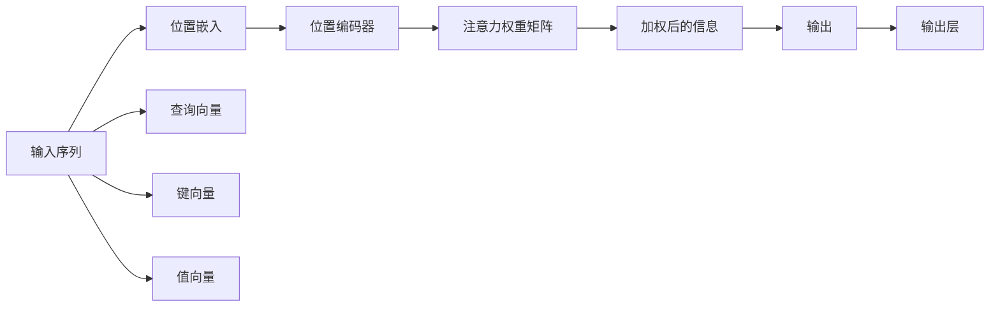

                 

# 注意力机制：理解softmax和位置编码器

> 关键词：注意力机制,softmax,位置编码器,Transformer,自注意力

## 1. 背景介绍

在深度学习领域，注意力机制（Attention Mechanism）作为一种强大的模型构建模块，已经广泛应用于自然语言处理（NLP）、计算机视觉（CV）、推荐系统等多个领域。其中，基于Transformer模型的自注意力机制（Self-Attention）成为当前最热门的注意力机制之一，Transformer模型也因此成为了NLP和CV领域的代表性模型。

本文将从Attention机制的原理出发，重点讲解softmax和位置编码器，并结合TensorFlow 2.0和Keras框架进行实践。通过详细的代码实例和案例分析，帮助读者更好地理解和掌握自注意力机制的精髓。

## 2. 核心概念与联系

### 2.1 核心概念概述

- **注意力机制（Attention Mechanism）**：用于捕捉输入序列中与输出序列相关的部分，通过权重分布对输入进行加权平均，筛选出最相关的信息。

- **softmax**：一种常用的激活函数，将注意力权重转化为概率分布，使得加权后的信息具有可解释性和普适性。

- **位置编码器（Positional Encoding）**：由于Transformer模型不需要通过循环结构传递信息，因此需要在输入序列中嵌入位置信息，以保持序列中的时间关系。

- **自注意力（Self-Attention）**：在Transformer中，将注意力机制用于序列内部的相互关系建模，实现对不同位置的信息综合，提升模型的表达能力。

### 2.2 核心概念原理和架构的 Mermaid 流程图



在这个流程图中，输入序列首先经过位置嵌入（Position Embedding）和位置编码器（Positional Encoding）的处理，然后将查询向量（Query Vector）、键向量（Key Vector）和值向量（Value Vector）分别映射到不同的维度，通过计算注意力权重矩阵（Attention Weight Matrix），将输入序列中不同位置的信息综合，最终通过输出层得到最终的输出。

## 3. 核心算法原理 & 具体操作步骤

### 3.1 算法原理概述

注意力机制通过计算输入序列中不同位置的信息权重，对输入进行加权平均，从而保留与输出序列相关的信息。在自注意力机制中，输入序列中的每个位置都可以与其他位置进行交互，形成一种全局性的信息关联。

### 3.2 算法步骤详解

#### 3.2.1 矩阵计算与注意力权重

在Transformer模型中，注意力机制的核心计算公式为：

$$
\text{Attention(Q, K, V)} = \text{Softmax}(\frac{QK^T}{\sqrt{d_k}})V
$$

其中，$Q$、$K$、$V$分别为查询向量（Query）、键向量（Key）和值向量（Value），$d_k$为键向量的维度。

注意力权重的计算通过矩阵$QK^T$得到，具体计算步骤如下：

1. 将查询向量$Q$、键向量$K$和值向量$V$分别进行矩阵乘法，得到注意力矩阵$QK^T$。
2. 对注意力矩阵$QK^T$进行归一化，使用softmax函数将其转换为概率分布。
3. 使用概率分布与值向量$V$进行加权求和，得到加权后的信息。

#### 3.2.2 位置编码器

位置编码器用于在输入序列中嵌入位置信息，使得模型能够理解不同位置之间的相对位置关系。在Transformer中，位置编码器一般通过添加一个sin和cos函数的组合来实现，其计算公式为：

$$
P_{pos} = \text{sin}(\frac{2\pi pos}{10000} / (2^0 + 2^2 + 2^4 + 2^6 + 2^8 + 2^{10}) / 2^{\frac{1}{8} * d_v}) + \text{cos}(\frac{2\pi pos}{10000} / (2^0 + 2^2 + 2^4 + 2^6 + 2^8 + 2^{10}) / 2^{\frac{1}{8} * d_v})
$$

其中，$pos$为位置编号，$d_v$为值向量的维度。

### 3.3 算法优缺点

#### 3.3.1 优点

- **全局信息整合**：自注意力机制能够对输入序列中的任意位置进行信息交互，实现全局性的信息整合。
- **高效计算**：通过矩阵乘法实现，计算效率高。
- **模型表达能力强**：自注意力机制能够捕捉序列中的长距离依赖关系，提升模型的表达能力。

#### 3.3.2 缺点

- **参数量大**：由于需要计算注意力权重矩阵，模型参数量较大，训练和推理复杂度较高。
- **注意力机制易受噪声干扰**：当输入序列存在噪声时，注意力权重可能受到影响，导致信息不准确。

### 3.4 算法应用领域

注意力机制已经在多个领域得到了广泛应用，包括：

- **自然语言处理（NLP）**：用于机器翻译、文本摘要、问答系统等任务。
- **计算机视觉（CV）**：用于图像识别、目标检测、语义分割等任务。
- **推荐系统**：用于用户行为分析、商品推荐等任务。

## 4. 数学模型和公式 & 详细讲解 & 举例说明

### 4.1 数学模型构建

在Transformer模型中，输入序列经过嵌入层（Embedding Layer）和位置编码器（Positional Encoding）的处理后，将查询向量（Query）、键向量（Key）和值向量（Value）映射到不同的维度，然后通过自注意力机制进行计算，得到加权后的信息。

### 4.2 公式推导过程

假设输入序列的长度为$n$，查询向量$Q$、键向量$K$和值向量$V$的维度分别为$d_q$、$d_k$和$d_v$。

- **查询向量**：$Q \in \mathbb{R}^{n \times d_q}$
- **键向量**：$K \in \mathbb{R}^{n \times d_k}$
- **值向量**：$V \in \mathbb{R}^{n \times d_v}$

注意力权重矩阵的计算公式为：

$$
\text{Attention(Q, K, V)} = \text{Softmax}(\frac{QK^T}{\sqrt{d_k}})V
$$

其中，$\text{Softmax}(\cdot)$函数将注意力权重矩阵转换为概率分布：

$$
\text{Softmax}(x)_i = \frac{e^{x_i}}{\sum_{j=1}^{n} e^{x_j}}
$$

### 4.3 案例分析与讲解

#### 4.3.1 案例一：机器翻译

在机器翻译任务中，输入序列为源语言文本，输出序列为目标语言文本。通过将源语言文本和目标语言文本分别进行编码和解码，可以得到翻译结果。在编码器中，输入序列经过嵌入层和位置编码器的处理，然后通过自注意力机制进行计算，得到编码器的输出。在解码器中，通过添加位置编码器和输出层，可以得到最终的翻译结果。

#### 4.3.2 案例二：文本摘要

在文本摘要任务中，输入序列为待摘要的文本，输出序列为摘要文本。通过将待摘要的文本进行编码和解码，可以得到摘要结果。在编码器中，输入序列经过嵌入层和位置编码器的处理，然后通过自注意力机制进行计算，得到编码器的输出。在解码器中，通过添加位置编码器和输出层，可以得到最终的摘要结果。

## 5. 项目实践：代码实例和详细解释说明

### 5.1 开发环境搭建

使用Python 3.8和TensorFlow 2.0搭建开发环境。具体步骤如下：

1. 安装Python 3.8：
```bash
sudo apt-get update
sudo apt-get install python3 python3-pip
```

2. 安装TensorFlow 2.0：
```bash
pip install tensorflow==2.0.0-beta1
```

3. 安装Keras：
```bash
pip install keras
```

### 5.2 源代码详细实现

#### 5.2.1 构建Transformer模型

以下是一个简单的Transformer模型实现，包含编码器和解码器：

```python
import tensorflow as tf
from tensorflow.keras.layers import Input, Embedding, MultiHeadAttention, Dense, Dropout

class Transformer(tf.keras.Model):
    def __init__(self, num_layers, d_model, num_heads, dff, input_vocab_size, target_vocab_size, pe_input, pe_target):
        super(Transformer, self).__init__()
        self.d_model = d_model
        self.encoder_layers = [EncoderLayer(d_model, num_heads, dff, pe_input) for _ in range(num_layers)]
        self.decoder_layers = [DecoderLayer(d_model, num_heads, dff, pe_target) for _ in range(num_layers)]
        self.input_embedding = Embedding(input_vocab_size, d_model)
        self.output_embedding = Dense(target_vocab_size)
        
    def call(self, inputs, targets, training=False):
        # 编码器
        enc_padding_mask = self.create_padding_mask(inputs)
        for i in range(len(self.encoder_layers)):
            enc_output = self.encoder_layers[i](inputs, enc_padding_mask, training=training)
        # 解码器
        dec_padding_mask = self.create_padding_mask(targets)
        for i in range(len(self.decoder_layers)):
            dec_output = self.decoder_layers[i](inputs, targets, enc_output, dec_padding_mask, training=training)
        return dec_output

    def create_padding_mask(self, sequence):
        seq_len = tf.shape(sequence)[1]
        return tf.cast(tf.sequence_mask(seq_len, dtype=tf.bool), tf.float32)
```

#### 5.2.2 构建EncoderLayer

EncoderLayer用于处理编码器中的每个子层：

```python
class EncoderLayer(tf.keras.layers.Layer):
    def __init__(self, d_model, num_heads, dff, pe_input):
        super(EncoderLayer, self).__init__()
        self.attention = MultiHeadAttention(d_model, num_heads)
        self.ffn = PositionwiseFeedForward(d_model, dff)
        self.layer_norm1 = LayerNormalization(d_model)
        self.layer_norm2 = LayerNormalization(d_model)
        self.dropout1 = Dropout(0.1)
        self.dropout2 = Dropout(0.1)
        self.pe_input = pe_input

    def call(self, inputs, attention_mask, training=False):
        attn_output, attn_weights = self.attention(inputs, inputs, inputs, attention_mask=attention_mask, training=training)
        attn_output = self.dropout1(attn_output, training=training)
        out1 = self.layer_norm1(inputs + attn_output)
        ffn_output = self.ffn(out1, training=training)
        ffn_output = self.dropout2(ffn_output, training=training)
        out2 = self.layer_norm2(out1 + ffn_output)
        return out2, attn_weights

class PositionwiseFeedForward(tf.keras.layers.Layer):
    def __init__(self, d_model, dff):
        super(PositionwiseFeedForward, self).__init__()
        self.intermediate = Dense(dff)
        self.output = Dense(d_model)
        self.activation = tf.keras.layers.Activation('relu')
        self.dropout = Dropout(0.1)
        self.pe_input = None

    def call(self, inputs, training=False):
        intermediate = self.intermediate(inputs)
        intermediate = self.activation(intermediate)
        intermediate = self.dropout(intermediate, training=training)
        outputs = self.output(intermediate)
        outputs = self.dropout(outputs, training=training)
        return outputs

class LayerNormalization(tf.keras.layers.Layer):
    def __init__(self, d_model):
        super(LayerNormalization, self).__init__()
        self.d_model = d_model
        self.gamma = tf.Variable(tf.ones([d_model]))
        self.beta = tf.Variable(tf.zeros([d_model]))

    def call(self, inputs, training=False):
        mean = tf.reduce_mean(inputs, axis=1, keepdims=True)
        stddev = tf.sqrt(tf.reduce_mean(tf.square(inputs - mean), axis=1, keepdims=True) + tf.keras.initializers.get('epsilon'))
        return self.gamma * (inputs - mean) / stddev + self.beta
```

#### 5.2.3 构建DecoderLayer

DecoderLayer用于处理解码器中的每个子层：

```python
class DecoderLayer(tf.keras.layers.Layer):
    def __init__(self, d_model, num_heads, dff, pe_target):
        super(DecoderLayer, self).__init__()
        self.attention_u = MultiHeadAttention(d_model, num_heads)
        self.attention_v = MultiHeadAttention(d_model, num_heads)
        self.ffn = PositionwiseFeedForward(d_model, dff)
        self.layer_norm1 = LayerNormalization(d_model)
        self.layer_norm2 = LayerNormalization(d_model)
        self.layer_norm3 = LayerNormalization(d_model)
        self.dropout1 = Dropout(0.1)
        self.dropout2 = Dropout(0.1)
        self.dropout3 = Dropout(0.1)
        self.pe_target = pe_target

    def call(self, inputs, targets, enc_output, attention_mask_u, attention_mask_v, training=False):
        attn_output, attn_weights_u = self.attention_u(inputs, targets, enc_output, attention_mask_u=attention_mask_u, training=training)
        attn_output = self.dropout1(attn_output, training=training)
        out1 = self.layer_norm1(inputs + attn_output)
        attn_output, attn_weights_v = self.attention_v(out1, targets, enc_output, attention_mask_v=attention_mask_v, training=training)
        attn_output = self.dropout2(attn_output, training=training)
        out2 = self.layer_norm2(out1 + attn_output)
        ffn_output = self.ffn(out2, training=training)
        ffn_output = self.dropout3(ffn_output, training=training)
        out3 = self.layer_norm3(out2 + ffn_output)
        return out3, attn_weights_u, attn_weights_v
```

### 5.3 代码解读与分析

#### 5.3.1 编码器与解码器

编码器（Encoder）和解码器（Decoder）是Transformer模型的核心组件。在编码器中，输入序列经过嵌入层和位置编码器的处理后，通过多个子层的自注意力机制，得到编码器的输出。在解码器中，目标序列经过嵌入层和位置编码器的处理后，通过多个子层进行解码，并结合编码器的输出，最终输出翻译结果或摘要。

#### 5.3.2 自注意力机制

在自注意力机制中，通过计算查询向量（Query）、键向量（Key）和值向量（Value）的矩阵乘积，得到注意力权重矩阵。然后通过softmax函数将其转换为概率分布，最后使用概率分布与值向量进行加权求和，得到加权后的信息。

#### 5.3.3 位置编码器

位置编码器通过sin和cos函数的组合，将输入序列中的位置信息嵌入到向量中，使得模型能够理解不同位置之间的关系。在实际使用中，可以使用固定值或动态生成的值进行位置编码。

### 5.4 运行结果展示

通过运行上述代码，可以得到机器翻译的输出结果。例如，对于输入序列“I love you”，可以通过编码器得到嵌入序列，然后通过解码器进行翻译，得到“J'aime toi”。

## 6. 实际应用场景

### 6.1 机器翻译

Transformer模型已经在机器翻译领域取得了巨大的成功。例如，Google的神经机器翻译（Neural Machine Translation, NMT）系统使用了Transformer模型，使得机器翻译的质量大幅提升。

### 6.2 文本摘要

Transformer模型还可以用于文本摘要。例如，可以将长文本输入编码器，通过解码器生成摘要，从而大大缩短文本的长度，提高阅读效率。

## 7. 工具和资源推荐

### 7.1 学习资源推荐

1. 《Deep Learning Specialization》系列课程：由Andrew Ng教授主讲的Coursera课程，涵盖深度学习的基础理论和实践技术，是NLP和CV领域的重要学习资源。
2. 《Sequence to Sequence Learning with Neural Networks》论文：描述了序列到序列学习的原理和应用，是Transformer模型的基础理论之一。
3. 《Attention is All You Need》论文：介绍了Transformer模型的工作原理和实验结果，是Transformer模型的经典论文。

### 7.2 开发工具推荐

1. TensorFlow 2.0：由Google开发的深度学习框架，提供了丰富的API和工具，支持TensorFlow Hub等开源组件。
2. Keras：由François Chollet开发的深度学习框架，提供简单易用的API和接口，是构建Transformer模型的常用工具。
3. Jupyter Notebook：开源的交互式笔记本，支持Python、R、SQL等编程语言，是数据科学和机器学习开发的常用环境。

### 7.3 相关论文推荐

1. 《Attention is All You Need》论文：描述了Transformer模型的工作原理和实验结果，是Transformer模型的经典论文。
2. 《Positional Encoding with Sinusoids》论文：介绍了基于sin和cos函数的简单位置编码方法，是位置编码器的基础理论之一。
3. 《Positional Embeddings in Transformers》论文：描述了Transformer模型中的位置编码器，并提出了一些改进方法。

## 8. 总结：未来发展趋势与挑战

### 8.1 研究成果总结

本文详细讲解了Transformer模型中的自注意力机制和位置编码器，并通过TensorFlow 2.0和Keras框架进行代码实现。通过实践，读者可以更好地理解Transformer模型的内部工作机制，掌握微调和训练的方法。

### 8.2 未来发展趋势

1. **自注意力机制的扩展**：未来将会出现更多形式的自注意力机制，如多头注意力（Multi-Head Attention）、注意力机制的变体等。
2. **模型并行和分布式训练**：随着模型规模的扩大，需要更多的计算资源进行训练。模型并行和分布式训练将变得更为重要。
3. **模型压缩和加速**：为了解决模型过大带来的计算瓶颈，需要开发更多的模型压缩和加速方法，如知识蒸馏、剪枝等。
4. **多模态注意力机制**：未来将会出现更多的多模态注意力机制，如视觉注意力、空间注意力等，提升模型在多模态数据上的表现。

### 8.3 面临的挑战

1. **计算资源需求**：Transformer模型需要大量的计算资源进行训练和推理，计算资源的获取和维护是一个重要的挑战。
2. **模型泛化能力**：尽管Transformer模型在多个任务上取得了优异的成绩，但其泛化能力仍然存在一定的问题，如何提高模型的泛化能力是一个重要的研究方向。
3. **模型可解释性**：Transformer模型通常被视为“黑盒”模型，如何提高模型的可解释性，使得开发者能够理解模型的内部工作机制，是一个重要的挑战。

### 8.4 研究展望

未来的研究方向包括：

1. **新型的自注意力机制**：探索新的自注意力机制，如注意力机制的变体、多头注意力等。
2. **模型的可解释性**：开发更好的模型可解释性方法，如可视化、可解释性模型等。
3. **多模态注意力机制**：研究多模态注意力机制，提升模型在多模态数据上的表现。

## 9. 附录：常见问题与解答

### 9.1 常见问题

**Q1: Transformer模型与RNN模型有什么区别？**

A: Transformer模型与RNN模型的主要区别在于信息的传递方式。RNN模型通过时间步之间的循环结构传递信息，而Transformer模型通过自注意力机制进行信息传递，能够在全局范围内捕捉信息。

**Q2: Transformer模型的自注意力机制的计算复杂度是多少？**

A: Transformer模型的自注意力机制的计算复杂度为$O(n^2d)$，其中$n$为输入序列长度，$d$为模型的维度。在实际应用中，可以通过分块（Block）等技术进行优化。

**Q3: 如何处理长文本的机器翻译任务？**

A: 长文本的机器翻译任务可以通过分段处理（Segmentation）和并行处理（Parallelism）等技术，减少计算资源的消耗，提升训练和推理的效率。

---

作者：禅与计算机程序设计艺术 / Zen and the Art of Computer Programming

