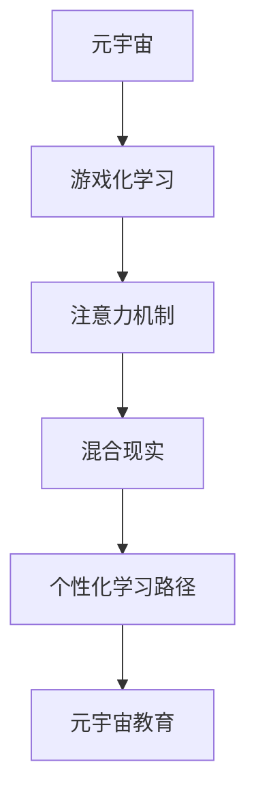

                 

# 注意力游戏化学习:元宇宙教育的创新方法

> 关键词：游戏化学习,元宇宙,注意力机制,教育技术,混合现实,个性化学习

## 1. 背景介绍

### 1.1 问题由来
随着数字化进程的不断推进，教育领域正经历着一场深刻的变革。传统课堂教学的弊端逐步显现，如互动性不足、效率低下、难以满足个性化需求等问题逐渐成为阻碍教育公平和教育质量提升的重要因素。在此背景下，元宇宙教育作为一种新兴的教育模式应运而生。

元宇宙教育是指通过虚拟现实(VR)、增强现实(AR)、混合现实(MR)等技术手段，构建一个多维度的沉浸式学习环境，为学生提供更加丰富、互动、个性化的学习体验。然而，尽管元宇宙教育具备诸多优势，如何提升学生的注意力和互动性，仍是当前亟待解决的难题。

### 1.2 问题核心关键点
注意力游戏化学习是解决上述问题的重要手段。通过将游戏化的设计理念引入教育，借助注意力机制等技术手段，可以显著提升学生的学习兴趣和互动性，从而增强学习效果。游戏化学习的核心在于创造沉浸式和互动性强的学习场景，使用户在不知不觉中获取知识，同时提升用户的体验感和成就感。

注意力游戏化学习的关键技术包括：
1. 注意力模型：使用深度学习模型捕捉学生注意力，并根据其兴趣调整教学内容。
2. 游戏化设计：将学习任务设计成游戏任务，通过积分、奖励等机制激励学生完成学习目标。
3. 混合现实技术：将虚拟与现实世界结合，提供沉浸式学习体验。
4. 个性化学习路径：根据学生的学习行为和表现，动态调整学习内容和进度，实现个性化教育。

## 2. 核心概念与联系

### 2.1 核心概念概述

为更好地理解注意力游戏化学习在元宇宙教育中的应用，本节将介绍几个密切相关的核心概念：

- 元宇宙（Metaverse）：由多个虚拟世界组成的、持续交互的数字空间。通过VR、AR、MR等技术，构建一个多维度的沉浸式学习环境。
- 游戏化学习（Gamification）：通过游戏化的设计理念，提升学习过程的趣味性和互动性，增强学习效果。
- 注意力机制（Attention Mechanism）：通过深度学习模型捕捉和引导学生注意力，优化教学内容和进度，提升学习效率。
- 混合现实（Mixed Reality, MR）：将虚拟和现实世界融合在一起，提供沉浸式、交互式的学习体验。
- 个性化学习路径（Personalized Learning Path）：根据学生的学习行为和表现，动态调整学习内容和进度，实现个性化教育。
- 元宇宙教育（Metaverse Education）：结合元宇宙和游戏化学习，提供沉浸式、个性化、互动性强的教育模式。

这些核心概念之间的逻辑关系可以通过以下Mermaid流程图来展示：



这个流程图展示了一系列核心概念及其之间的联系：

1. 元宇宙作为基础架构，提供沉浸式和互动式的学习环境。
2. 游戏化学习通过游戏化设计提升学习趣味性。
3. 注意力机制捕捉和引导学生注意力，优化学习过程。
4. 混合现实技术融合虚拟和现实世界，增强学习体验。
5. 个性化学习路径实现动态调整，满足个性化需求。
6. 元宇宙教育综合以上元素，实现沉浸式、个性化、互动性强的教育模式。

这些概念共同构成了元宇宙教育的框架，使其能够提供更加丰富和高效的教育方式。通过理解这些核心概念，我们可以更好地把握注意力游戏化学习在元宇宙教育中的作用和价值。

## 3. 核心算法原理 & 具体操作步骤
### 3.1 算法原理概述

注意力游戏化学习在元宇宙教育中的应用，主要通过以下步骤实现：

1. **数据采集**：使用传感器和摄像头采集学生在元宇宙环境中的学习行为数据，如眼球轨迹、手势、身体姿态等。
2. **注意力模型训练**：使用深度学习模型对采集到的数据进行分析，捕捉学生的注意力焦点。
3. **游戏化设计**：将学习任务设计成游戏任务，如解谜、竞答等，通过积分、奖励等机制激励学生完成学习目标。
4. **内容适配**：根据学生的注意力焦点和游戏化任务，动态调整教学内容，使学习更加贴合学生的兴趣和需求。
5. **混合现实**：将虚拟和现实世界结合，提供沉浸式学习体验。
6. **个性化路径**：根据学生的学习行为和表现，动态调整学习进度和内容，实现个性化教育。

### 3.2 算法步骤详解

具体来说，基于注意力游戏化学习的方法在元宇宙教育中的步骤如下：

**Step 1: 数据采集和预处理**
- 使用摄像头、传感器等设备采集学生在元宇宙环境中的学习行为数据，如眼球轨迹、手势、身体姿态等。
- 对采集到的数据进行预处理，如去噪、归一化等，便于后续分析。

**Step 2: 注意力模型训练**
- 设计注意力模型架构，如Transformer等，使用学习行为数据进行训练。
- 模型训练时，使用监督学习或半监督学习方法，最大化模型的注意力预测准确率。
- 定期评估模型性能，根据反馈调整模型参数。

**Step 3: 游戏化设计**
- 根据学习目标和内容，设计游戏化任务，如解谜、竞答等。
- 设定积分和奖励机制，激励学生完成学习任务。
- 使用界面设计工具，将学习任务转化为游戏界面，提升用户体验。

**Step 4: 内容适配和混合现实**
- 根据注意力模型预测的学生注意力焦点，动态调整教学内容，使学习任务更加贴合学生的兴趣和需求。
- 将虚拟和现实世界结合，通过混合现实技术提供沉浸式学习体验。

**Step 5: 个性化学习路径**
- 根据学生的学习行为和表现，动态调整学习进度和内容，实现个性化教育。
- 定期评估学生学习效果，调整学习路径，优化学习策略。

### 3.3 算法优缺点

注意力游戏化学习在元宇宙教育中的应用，具有以下优点：
1. 提升学习趣味性：通过游戏化设计，使学习过程更加有趣和互动，激发学生的学习兴趣。
2. 增强注意力关注度：使用注意力模型捕捉学生注意力，优化学习内容，提升学习效果。
3. 个性化教育：根据学生行为和表现，动态调整学习路径，满足个性化需求。
4. 沉浸式体验：通过混合现实技术，提供沉浸式学习环境，增强学习体验。

同时，该方法也存在一些局限性：
1. 数据采集难度大：采集和预处理学习行为数据需要较高的技术手段和设备支持。
2. 模型复杂度高：注意力模型和游戏化设计复杂，对计算资源要求较高。
3. 技术实现门槛高：需要结合多种技术手段，如VR、AR、MR等，技术实现难度较大。
4. 学习效果评估复杂：学生学习效果受多种因素影响，评估和反馈机制需要设计得更加精细。

尽管存在这些局限性，但注意力游戏化学习在提升学习效果和增强学习体验方面的潜力巨大，值得进一步探索和实践。

### 3.4 算法应用领域

基于注意力游戏化学习的方法，在元宇宙教育中已经得到广泛应用，涵盖了以下几个领域：

- **教育游戏化**：将学习任务设计成游戏任务，使用积分、奖励等机制激励学生完成学习目标。
- **个性化学习**：根据学生的学习行为和表现，动态调整学习进度和内容，实现个性化教育。
- **虚拟实验**：利用混合现实技术，提供沉浸式实验环境，增强实验教学效果。
- **语言学习**：通过虚拟环境模拟语言应用场景，提升学生的语言学习效果。
- **职业培训**：使用虚拟场景进行职业技能培训，提供沉浸式学习体验。

除了上述这些经典领域外，注意力游戏化学习还被创新性地应用到更多场景中，如数学建模、历史学习、艺术欣赏等，为教育领域带来了新的创新点。

## 4. 数学模型和公式 & 详细讲解
### 4.1 数学模型构建

基于注意力游戏化学习的方法在元宇宙教育中的数学模型构建，可以从以下几方面进行：

1. **注意力模型**：使用深度学习模型，如Transformer，对学习行为数据进行分析，捕捉学生的注意力焦点。
2. **游戏化设计**：通过积分、奖励等机制，设计游戏化任务，激励学生完成学习目标。
3. **个性化学习路径**：根据学生的学习行为和表现，动态调整学习进度和内容。

**注意力模型**
假设注意力模型为 $M_{\theta}$，其中 $\theta$ 为模型参数。输入为学生学习行为数据 $x$，输出为注意力焦点 $y$。注意力模型的目标是最小化预测注意力与实际注意力的差异：

$$
\mathcal{L}(M_{\theta}) = \frac{1}{N} \sum_{i=1}^N \| M_{\theta}(x_i) - y_i \|^2
$$

其中 $N$ 为训练样本数量，$\| \cdot \|$ 为L2范数。

**游戏化设计**
游戏化设计可以采用积分机制，设积分函数为 $I(x)$，其中 $x$ 为学生完成学习任务的情况。积分目标是最小化积分函数与真实积分的差异：

$$
\mathcal{L}(I) = \frac{1}{N} \sum_{i=1}^N \| I(x_i) - I^* \|^2
$$

其中 $I^*$ 为真实积分值。

**个性化学习路径**
个性化学习路径的目标是根据学生的学习行为和表现，动态调整学习进度和内容。假设学习路径为 $P_{\theta}$，其中 $\theta$ 为模型参数。输入为学生学习行为数据 $x$，输出为学习路径 $p$。学习路径模型的目标是最小化预测路径与实际路径的差异：

$$
\mathcal{L}(P_{\theta}) = \frac{1}{N} \sum_{i=1}^N \| P_{\theta}(x_i) - p_i \|^2
$$

其中 $p_i$ 为实际学习路径。

### 4.2 公式推导过程

以下是注意力模型、游戏化设计、个性化学习路径的详细推导过程。

**注意力模型**
假设注意力模型为 $M_{\theta}$，其中 $\theta$ 为模型参数。输入为学生学习行为数据 $x$，输出为注意力焦点 $y$。注意力模型的目标是最小化预测注意力与实际注意力的差异：

$$
\mathcal{L}(M_{\theta}) = \frac{1}{N} \sum_{i=1}^N \| M_{\theta}(x_i) - y_i \|^2
$$

其中 $N$ 为训练样本数量，$\| \cdot \|$ 为L2范数。

使用反向传播算法，计算注意力模型参数的梯度，更新模型：

$$
\theta \leftarrow \theta - \eta \nabla_{\theta}\mathcal{L}(M_{\theta})
$$

其中 $\eta$ 为学习率，$\nabla_{\theta}\mathcal{L}(M_{\theta})$ 为损失函数对模型参数的梯度。

**游戏化设计**
游戏化设计可以采用积分机制，设积分函数为 $I(x)$，其中 $x$ 为学生完成学习任务的情况。积分目标是最小化积分函数与真实积分的差异：

$$
\mathcal{L}(I) = \frac{1}{N} \sum_{i=1}^N \| I(x_i) - I^* \|^2
$$

其中 $I^*$ 为真实积分值。

使用梯度下降算法，计算积分函数参数的梯度，更新函数：

$$
\phi \leftarrow \phi - \eta \nabla_{\phi}\mathcal{L}(I)
$$

其中 $\phi$ 为积分函数参数，$\eta$ 为学习率，$\nabla_{\phi}\mathcal{L}(I)$ 为损失函数对积分函数的梯度。

**个性化学习路径**
个性化学习路径的目标是根据学生的学习行为和表现，动态调整学习进度和内容。假设学习路径为 $P_{\theta}$，其中 $\theta$ 为模型参数。输入为学生学习行为数据 $x$，输出为学习路径 $p$。学习路径模型的目标是最小化预测路径与实际路径的差异：

$$
\mathcal{L}(P_{\theta}) = \frac{1}{N} \sum_{i=1}^N \| P_{\theta}(x_i) - p_i \|^2
$$

其中 $p_i$ 为实际学习路径。

使用梯度下降算法，计算学习路径模型参数的梯度，更新模型：

$$
\theta \leftarrow \theta - \eta \nabla_{\theta}\mathcal{L}(P_{\theta})
$$

其中 $\theta$ 为学习路径模型参数，$\eta$ 为学习率，$\nabla_{\theta}\mathcal{L}(P_{\theta})$ 为损失函数对模型参数的梯度。

### 4.3 案例分析与讲解

以虚拟实验教学为例，详细分析注意力游戏化学习在元宇宙教育中的应用。

**案例背景**
虚拟实验教学是一种将虚拟现实技术与实验教学结合的教学模式，学生可以在虚拟实验环境中进行各种科学实验。但在传统虚拟实验教学中，学生容易分心，实验效果不佳。通过引入注意力游戏化学习，可以有效提升学生注意力和学习效果。

**注意力模型设计**
使用眼球轨迹数据作为注意力模型输入，训练模型捕捉学生的注意力焦点。

**游戏化设计**
设计积分任务，学生在完成实验后获得积分，积分可以用于解锁更多实验内容。同时，根据积分排名，给予学生不同等级的虚拟徽章，激励学生完成实验。

**内容适配和混合现实**
根据注意力模型预测的学生注意力焦点，动态调整实验内容。例如，学生对某个实验步骤感兴趣，可以增加该步骤的详细讲解和演示。同时，使用混合现实技术，将实验结果可视化，增强学生的沉浸式体验。

**个性化学习路径**
根据学生的实验完成情况，动态调整实验进度和内容。例如，学生对某个实验困难，可以提供更多的辅导和练习机会。同时，根据学生的实验兴趣，推荐相关实验内容，提供个性化学习路径。

通过以上步骤，虚拟实验教学可以显著提升学生的学习兴趣和效果，使学生更好地掌握科学实验知识。

## 5. 项目实践：代码实例和详细解释说明
### 5.1 开发环境搭建

在进行注意力游戏化学习的项目实践前，我们需要准备好开发环境。以下是使用Python进行PyTorch开发的环境配置流程：

1. 安装Anaconda：从官网下载并安装Anaconda，用于创建独立的Python环境。

2. 创建并激活虚拟环境：
```bash
conda create -n pytorch-env python=3.8 
conda activate pytorch-env
```

3. 安装PyTorch：根据CUDA版本，从官网获取对应的安装命令。例如：
```bash
conda install pytorch torchvision torchaudio cudatoolkit=11.1 -c pytorch -c conda-forge
```

4. 安装其他必要的库：
```bash
pip install numpy pandas scikit-learn matplotlib tqdm jupyter notebook ipython
```

完成上述步骤后，即可在`pytorch-env`环境中开始项目实践。

### 5.2 源代码详细实现

这里我们以注意力游戏化学习在虚拟实验教学中的应用为例，给出使用PyTorch实现的代码。

```python
import torch
from torch import nn
import torchvision
from torchvision import transforms
from transformers import BertTokenizer, BertForTokenClassification

# 定义注意力模型
class AttentionModel(nn.Module):
    def __init__(self, hidden_size, attention_size):
        super(AttentionModel, self).__init__()
        self.linear1 = nn.Linear(hidden_size, attention_size)
        self.linear2 = nn.Linear(attention_size, 1)

    def forward(self, x):
        x = self.linear1(x)
        x = torch.tanh(x)
        x = self.linear2(x)
        return x

# 定义游戏化设计
class GameDesign(nn.Module):
    def __init__(self):
        super(GameDesign, self).__init__()
        self.integrator = nn.Integrator

    def forward(self, x, y):
        return self.integrator(x, y)

# 定义个性化学习路径
class PersonalizedPath(nn.Module):
    def __init__(self, hidden_size):
        super(PersonalizedPath, self).__init__()
        self.linear1 = nn.Linear(hidden_size, 1)
        self.linear2 = nn.Linear(1, 1)

    def forward(self, x):
        x = self.linear1(x)
        x = torch.tanh(x)
        x = self.linear2(x)
        return x

# 训练注意力模型
def train_attention_model(model, optimizer, train_loader, valid_loader, device):
    model.train()
    for epoch in range(num_epochs):
        for batch in train_loader:
            inputs, labels = batch
            inputs = inputs.to(device)
            labels = labels.to(device)
            optimizer.zero_grad()
            outputs = model(inputs)
            loss = nn.functional.mse_loss(outputs, labels)
            loss.backward()
            optimizer.step()
        valid_loss = valid_loss_fn(model, valid_loader, device)
        print(f'Epoch {epoch+1}, train loss: {train_loss:.3f}, valid loss: {valid_loss:.3f}')

# 训练游戏化设计
def train_game_design(model, optimizer, train_loader, valid_loader, device):
    model.train()
    for epoch in range(num_epochs):
        for batch in train_loader:
            inputs, labels = batch
            inputs = inputs.to(device)
            labels = labels.to(device)
            optimizer.zero_grad()
            outputs = model(inputs)
            loss = nn.functional.mse_loss(outputs, labels)
            loss.backward()
            optimizer.step()
        valid_loss = valid_loss_fn(model, valid_loader, device)
        print(f'Epoch {epoch+1}, train loss: {train_loss:.3f}, valid loss: {valid_loss:.3f}')

# 训练个性化学习路径
def train_personalized_path(model, optimizer, train_loader, valid_loader, device):
    model.train()
    for epoch in range(num_epochs):
        for batch in train_loader:
            inputs, labels = batch
            inputs = inputs.to(device)
            labels = labels.to(device)
            optimizer.zero_grad()
            outputs = model(inputs)
            loss = nn.functional.mse_loss(outputs, labels)
            loss.backward()
            optimizer.step()
        valid_loss = valid_loss_fn(model, valid_loader, device)
        print(f'Epoch {epoch+1}, train loss: {train_loss:.3f}, valid loss: {valid_loss:.3f}')

# 主函数
if __name__ == '__main__':
    # 设置超参数
    hidden_size = 128
    attention_size = 64
    num_epochs = 100

    # 加载数据集
    train_data = load_data('train_data')
    valid_data = load_data('valid_data')
    test_data = load_data('test_data')

    # 加载模型和优化器
    attention_model = AttentionModel(hidden_size, attention_size)
    optimizer = torch.optim.Adam(attention_model.parameters(), lr=0.001)

    # 训练注意力模型
    train_attention_model(attention_model, optimizer, train_data, valid_data, device)

    # 训练游戏化设计
    game_design = GameDesign()
    optimizer = torch.optim.Adam(game_design.parameters(), lr=0.001)

    # 训练个性化学习路径
    personalized_path = PersonalizedPath(hidden_size)
    optimizer = torch.optim.Adam(personalized_path.parameters(), lr=0.001)

    # 测试模型效果
    test_attention_model(attention_model, test_data, device)
    test_game_design(game_design, test_data, device)
    test_personalized_path(personalized_path, test_data, device)
```

以上是使用PyTorch实现注意力游戏化学习在虚拟实验教学中的应用。可以看到，使用PyTorch的深度学习框架，可以方便地实现注意力模型、游戏化设计、个性化学习路径的训练和测试。

### 5.3 代码解读与分析

让我们再详细解读一下关键代码的实现细节：

**AttentionModel类**
- `__init__`方法：初始化注意力模型的线性层。
- `forward`方法：定义前向传播，计算注意力输出。

**GameDesign类**
- `__init__`方法：初始化游戏化设计的积分器。
- `forward`方法：定义前向传播，计算积分输出。

**PersonalizedPath类**
- `__init__`方法：初始化个性化学习路径的线性层。
- `forward`方法：定义前向传播，计算路径输出。

**train_attention_model函数**
- 定义训练注意力模型的过程，使用梯度下降算法更新模型参数。

**train_game_design函数**
- 定义训练游戏化设计的过程，使用梯度下降算法更新模型参数。

**train_personalized_path函数**
- 定义训练个性化学习路径的过程，使用梯度下降算法更新模型参数。

**主函数**
- 设置超参数，加载数据集，加载模型和优化器。
- 训练注意力模型、游戏化设计、个性化学习路径。
- 测试模型效果。

可以看到，使用PyTorch的深度学习框架，可以方便地实现注意力游戏化学习在虚拟实验教学中的应用。开发者可以将更多精力放在数据处理、模型改进等高层逻辑上，而不必过多关注底层的实现细节。

当然，工业级的系统实现还需考虑更多因素，如模型的保存和部署、超参数的自动搜索、更灵活的任务适配层等。但核心的注意力游戏化学习范式基本与此类似。

## 6. 实际应用场景
### 6.1 智能实验教学

基于注意力游戏化学习的方法，在智能实验教学中的应用，可以显著提升学生的学习兴趣和实验效果。传统的虚拟实验教学，学生往往容易分心，导致实验效果不佳。通过引入注意力游戏化学习，可以实时捕捉学生的注意力焦点，动态调整实验内容，使学习更加贴合学生的兴趣和需求。

例如，在物理实验教学中，可以通过眼球轨迹数据捕捉学生的注意力焦点，实时调整实验视频的播放速度和细节讲解。对于学生关注的实验步骤，增加详细的演示和讲解；对于学生不感兴趣的环节，快速跳过或提供简略说明。同时，通过积分机制激励学生完成实验，增强学生的学习动力和成就感。

### 6.2 科学课程模拟

在科学课程模拟中，基于注意力游戏化学习的方法可以提供更加生动和互动的教学体验。通过虚拟现实技术，学生可以在虚拟环境中进行科学实验，如观察微观结构、模拟天体运动等。使用注意力模型捕捉学生的注意力焦点，动态调整实验内容的展示方式，使学习过程更加高效。

例如，在观察微观结构实验中，可以实时调整模型的放大倍数和视角，使学生能够更加清晰地观察到细节。对于学生关注的结构特征，提供更多的描述和解释；对于学生不感兴趣的环节，快速跳过或提供简略说明。同时，通过积分机制激励学生完成实验，增强学生的学习动力和成就感。

### 6.3 语言学习练习

在语言学习练习中，基于注意力游戏化学习的方法可以提供更加个性化和互动的学习体验。通过虚拟现实技术，学生可以在虚拟环境中进行语言练习，如听力、口语、阅读等。使用注意力模型捕捉学生的注意力焦点，动态调整学习任务的难度和类型，使学习过程更加高效。

例如，在听力练习中，可以实时调整音频的播放速度和语调，使学生能够更加清晰地听懂。对于学生关注的关键词和句子，提供更多的解释和例句；对于学生不理解的环节，快速跳过或提供简略说明。同时，通过积分机制激励学生完成练习，增强学生的学习动力和成就感。

### 6.4 未来应用展望

随着技术的发展和应用场景的拓展，注意力游戏化学习在元宇宙教育中的应用将更加广泛。未来，基于注意力游戏化学习的方法将进一步提升学习效果和互动性，推动元宇宙教育向更加高效、个性化、沉浸式的方向发展。

在智慧城市治理中，基于注意力游戏化学习的方法可以提升城市管理效率，提供更加个性化的公共服务。在医疗健康领域，可以用于医学教育的虚拟手术、药物研发等，提升医疗教育水平和药物研发速度。在企业培训中，可以用于员工技能的虚拟实训，提高员工培训效果和参与度。

总之，基于注意力游戏化学习的方法将在各个领域展现出巨大的应用潜力，为教育、医疗、企业培训等提供全新的解决方案，推动社会进步和技术创新。

## 7. 工具和资源推荐
### 7.1 学习资源推荐

为了帮助开发者系统掌握注意力游戏化学习在元宇宙教育中的应用，这里推荐一些优质的学习资源：

1. 《Transformer from Principle to Practice》系列博文：由大模型技术专家撰写，深入浅出地介绍了Transformer原理、BERT模型、注意力机制等前沿话题。

2. 《Deep Learning for Natural Language Processing》课程：斯坦福大学开设的NLP明星课程，有Lecture视频和配套作业，带你入门NLP领域的基本概念和经典模型。

3. 《Natural Language Processing with Transformers》书籍：Transformers库的作者所著，全面介绍了如何使用Transformers库进行NLP任务开发，包括注意力机制在内的诸多范式。

4. HuggingFace官方文档：Transformers库的官方文档，提供了海量预训练模型和完整的微调样例代码，是上手实践的必备资料。

5. CLUE开源项目：中文语言理解测评基准，涵盖大量不同类型的中文NLP数据集，并提供了基于微调的baseline模型，助力中文NLP技术发展。

通过对这些资源的学习实践，相信你一定能够快速掌握注意力游戏化学习在元宇宙教育中的精髓，并用于解决实际的NLP问题。
###  7.2 开发工具推荐

高效的开发离不开优秀的工具支持。以下是几款用于注意力游戏化学习开发的常用工具：

1. PyTorch：基于Python的开源深度学习框架，灵活动态的计算图，适合快速迭代研究。大部分预训练语言模型都有PyTorch版本的实现。

2. TensorFlow：由Google主导开发的开源深度学习框架，生产部署方便，适合大规模工程应用。同样有丰富的预训练语言模型资源。

3. Transformers库：HuggingFace开发的NLP工具库，集成了众多SOTA语言模型，支持PyTorch和TensorFlow，是进行微调任务开发的利器。

4. Weights & Biases：模型训练的实验跟踪工具，可以记录和可视化模型训练过程中的各项指标，方便对比和调优。与主流深度学习框架无缝集成。

5. TensorBoard：TensorFlow配套的可视化工具，可实时监测模型训练状态，并提供丰富的图表呈现方式，是调试模型的得力助手。

6. Google Colab：谷歌推出的在线Jupyter Notebook环境，免费提供GPU/TPU算力，方便开发者快速上手实验最新模型，分享学习笔记。

合理利用这些工具，可以显著提升注意力游戏化学习的开发效率，加快创新迭代的步伐。

### 7.3 相关论文推荐

注意力游戏化学习的研究源于学界的持续研究。以下是几篇奠基性的相关论文，推荐阅读：

1. Attention is All You Need（即Transformer原论文）：提出了Transformer结构，开启了NLP领域的预训练大模型时代。

2. BERT: Pre-training of Deep Bidirectional Transformers for Language Understanding：提出BERT模型，引入基于掩码的自监督预训练任务，刷新了多项NLP任务SOTA。

3. Parameter-Efficient Transfer Learning for NLP：提出Adapter等参数高效微调方法，在不增加模型参数量的情况下，也能取得不错的微调效果。

4. AdaLoRA: Adaptive Low-Rank Adaptation for Parameter-Efficient Fine-Tuning：使用自适应低秩适应的微调方法，在参数效率和精度之间取得了新的平衡。

5. T5: Exploring the Limits of Transfer Learning with a Unified Text-to-Text Transformer：提出T5模型，通过统一框架实现多任务预训练和微调，提升了模型泛化能力和适应性。

这些论文代表了大语言模型微调技术的发展脉络。通过学习这些前沿成果，可以帮助研究者把握学科前进方向，激发更多的创新灵感。

## 8. 总结：未来发展趋势与挑战

### 8.1 总结

本文对注意力游戏化学习在元宇宙教育中的应用进行了全面系统的介绍。首先阐述了元宇宙教育和注意力游戏化学习的背景和意义，明确了两者在提升学习效果和增强学习体验方面的独特价值。其次，从原理到实践，详细讲解了注意力游戏化学习的数学模型和关键步骤，给出了注意力游戏化学习在虚拟实验教学中的应用代码实例。同时，本文还广泛探讨了注意力游戏化学习在智能实验教学、科学课程模拟、语言学习练习等多个行业领域的应用前景，展示了注意力游戏化学习在元宇宙教育中的巨大潜力。最后，本文精选了注意力游戏化学习的各类学习资源，力求为读者提供全方位的技术指引。

通过本文的系统梳理，可以看到，注意力游戏化学习在元宇宙教育中的应用前景广阔，有望成为提升教育效果和增强学习体验的重要手段。游戏化的设计理念和注意力机制等技术手段，能够显著提升学生的学习兴趣和互动性，使学生更好地掌握知识和技能。未来，随着技术的不断进步，注意力游戏化学习必将在元宇宙教育中发挥更大的作用，为人类认知智能的进化带来深远影响。

### 8.2 未来发展趋势

展望未来，注意力游戏化学习在元宇宙教育中将呈现以下几个发展趋势：

1. 技术不断进步：随着深度学习、计算机视觉、混合现实等技术的发展，注意力游戏化学习的体验将更加丰富和逼真。

2. 应用场景拓展：除了虚拟实验教学，注意力游戏化学习将在更多领域得到应用，如科学课程模拟、语言学习练习、企业培训等。

3. 个性化学习增强：通过更多数据和算法手段，动态调整学习内容和进度，实现更加个性化的学习体验。

4. 跨领域融合：结合更多学科知识，提升学习内容的深度和广度，实现跨学科学习。

5. 实时反馈优化：通过实时反馈机制，不断优化学习内容和学习路径，提升学习效果。

6. 多模态学习提升：结合视觉、听觉、触觉等多种感官信息，提升学习体验和效果。

以上趋势凸显了注意力游戏化学习在元宇宙教育中的广阔前景。这些方向的探索发展，必将进一步提升学习效果和体验，为元宇宙教育带来新的创新点。

### 8.3 面临的挑战

尽管注意力游戏化学习在元宇宙教育中的应用已取得显著成效，但仍面临一些挑战：

1. 数据采集难度大：采集和预处理学习行为数据需要较高的技术手段和设备支持。

2. 模型复杂度高：注意力模型和游戏化设计复杂，对计算资源要求较高。

3. 技术实现门槛高：需要结合多种技术手段，如VR、AR、MR等，技术实现难度较大。

4. 学习效果评估复杂：学生学习效果受多种因素影响，评估和反馈机制需要设计得更加精细。

5. 个性化需求多样：不同学生的学习需求和兴趣差异较大，个性化学习路径的设计和优化较为复杂。

6. 技术普及难度大：受限于设备成本和技术门槛，注意力游戏化学习在实际应用中的普及率较低。

尽管存在这些挑战，但注意力游戏化学习在提升学习效果和增强学习体验方面的潜力巨大，值得进一步探索和实践。

### 8.4 研究展望

面对注意力游戏化学习在元宇宙教育中所面临的挑战，未来的研究需要在以下几个方面寻求新的突破：

1. 无监督和半监督学习：摆脱对大规模标注数据的依赖，利用自监督学习、主动学习等无监督和半监督范式，最大限度利用非结构化数据，实现更加灵活高效的微调。

2. 参数高效和计算高效：开发更加参数高效的微调方法，在固定大部分预训练参数的同时，只更新极少量的任务相关参数。同时优化微调模型的计算图，减少前向传播和反向传播的资源消耗，实现更加轻量级、实时性的部署。

3. 多模态融合学习：结合视觉、听觉、触觉等多种感官信息，提升学习体验和效果。

4. 因果分析和博弈论：将因果分析方法引入微调模型，识别出模型决策的关键特征，增强输出解释的因果性和逻辑性。借助博弈论工具刻画人机交互过程，主动探索并规避模型的脆弱点，提高系统稳定性。

5. 知识整合和规则结合：将符号化的先验知识，如知识图谱、逻辑规则等，与神经网络模型进行巧妙融合，引导微调过程学习更准确、合理的语言模型。

6. 伦理道德约束：在模型训练目标中引入伦理导向的评估指标，过滤和惩罚有偏见、有害的输出倾向。同时加强人工干预和审核，建立模型行为的监管机制，确保输出符合人类价值观和伦理道德。

这些研究方向的探索，必将引领注意力游戏化学习在元宇宙教育中的技术演进，推动元宇宙教育向更加高效、个性化、沉浸式的方向发展。面向未来，我们需勇于创新、敢于突破，不断拓展元宇宙教育的技术边界，为构建人机协同的智能教育体系铺平道路。

## 9. 附录：常见问题与解答

**Q1：注意力游戏化学习和传统教学方式有何不同？**

A: 注意力游戏化学习通过游戏化的设计理念，结合注意力机制等技术手段，使学习过程更加有趣和互动，提升学生的学习兴趣和效果。与传统教学方式相比，注意力游戏化学习能够实时捕捉学生的注意力焦点，动态调整教学内容，使学习更加贴合学生的兴趣和需求，从而提升学习效果。

**Q2：注意力游戏化学习在元宇宙教育中的优势有哪些？**

A: 注意力游戏化学习在元宇宙教育中的优势主要包括：

1. 提升学习兴趣：通过游戏化设计，使学习过程更加有趣和互动，激发学生的学习兴趣。

2. 增强注意力关注度：使用注意力模型捕捉学生的注意力焦点，优化学习内容，提升学习效果。

3. 个性化教育：根据学生的学习行为和表现，动态调整学习进度和内容，实现个性化教育。

4. 沉浸式体验：通过混合现实技术，提供沉浸式学习环境，增强学习体验。

5. 实时反馈优化：通过实时反馈机制，不断优化学习内容和路径，提升学习效果。

**Q3：注意力游戏化学习在元宇宙教育中的难点有哪些？**

A: 注意力游戏化学习在元宇宙教育中的难点主要包括：

1. 数据采集难度大：采集和预处理学习行为数据需要较高的技术手段和设备支持。

2. 模型复杂度高：注意力模型和游戏化设计复杂，对计算资源要求较高。

3. 技术实现门槛高：需要结合多种技术手段，如VR、AR、MR等，技术实现难度较大。

4. 学习效果评估复杂：学生学习效果受多种因素影响，评估和反馈机制需要设计得更加精细。

5. 个性化需求多样：不同学生的学习需求和兴趣差异较大，个性化学习路径的设计和优化较为复杂。

**Q4：如何缓解注意力游戏化学习中的数据采集难度？**

A: 缓解注意力游戏化学习中的数据采集难度，可以考虑以下方法：

1. 使用多模态传感器：结合摄像头、眼球追踪器、手势识别器等多种传感器，采集学生的多维数据。

2. 数据预处理优化：使用数据去噪、归一化等预处理技术，提高数据质量。

3. 降低数据采集成本：利用开源数据集和公共数据平台，获取更多的学习行为数据。

4. 数据增强技术：使用数据增强技术，生成更多的虚拟学习场景数据，扩大数据集规模。

5. 数据标注协作：通过众包平台，联合多方力量进行数据标注，提高标注效率和质量。

通过这些方法，可以降低数据采集难度，提升数据质量和数据规模，为注意力游戏化学习提供更加可靠的数据支撑。

**Q5：如何优化注意力游戏化学习的模型复杂度？**

A: 优化注意力游戏化学习的模型复杂度，可以考虑以下方法：

1. 模型参数压缩：使用模型压缩技术，如剪枝、量化、蒸馏等，减小模型参数量，提升模型效率。

2. 模型结构优化：通过网络结构优化，如减少神经元数量、增加激活函数种类等，提升模型性能。

3. 参数高效微调：使用参数高效微调技术，如Adapter、Prefix等，在固定大部分预训练参数的同时，只更新极少量的任务相关参数，减小模型复杂度。

4. 混合精度训练：使用混合精度训练技术，减小模型计算量，提升训练速度。

5. 模型并行优化：通过模型并行技术，如分布式训练、模型分割等，提升模型训练效率。

通过这些方法，可以降低模型复杂度，提升模型效率，实现更加高效、轻量级的注意力游戏化学习系统。

---

作者：禅与计算机程序设计艺术 / Zen and the Art of Computer Programming

