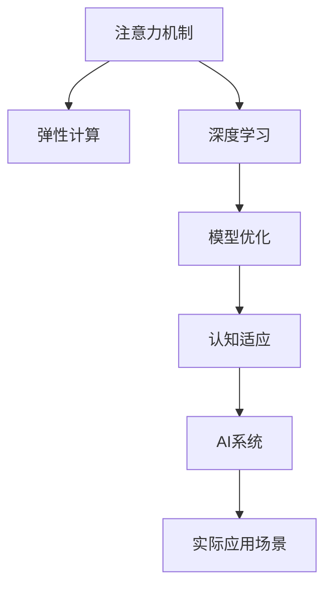

                 

# 注意力的弹性：AI辅助的认知适应

> 关键词：注意力机制,弹性计算,人工智能,认知适应,深度学习,模型优化

## 1. 背景介绍

### 1.1 问题由来
近年来，随着深度学习技术的飞速发展，人工智能(AI)系统在众多领域实现了前所未有的突破。特别是深度神经网络的应用，使得AI系统具备了强大的数据处理和模式识别能力。然而，传统AI系统的一个重要不足在于，它们在面对不确定性和复杂环境时，往往表现出较差的适应性和鲁棒性，难以实现真正的"智能"。

认知适应是一个重要的研究方向，旨在使AI系统具备更强大的认知能力，能够在面对新的信息时自动调整自身模型和策略。这不仅对于提升AI系统的智能水平具有重要意义，也为AI技术在现实世界的应用带来了新的可能性。

### 1.2 问题核心关键点
实现AI系统的认知适应，核心在于构建一个能够动态调整自身结构和参数的智能模型。而注意力机制(Attention Mechanism)，则是实现这一目标的重要工具。

注意力机制是一种能够根据输入数据的重要性动态调整模型计算资源和参数权重的技术。它通过筛选输入数据中的关键信息，分配不同的权重，使得模型在面对复杂和不确定的信息时，能够更准确地进行推理和决策。

在AI领域，注意力机制已经在许多任务中得到了广泛应用，如机器翻译、图像识别、自然语言处理等。通过引入注意力机制，AI系统能够更好地处理大规模、高维度的数据，提升模型性能和鲁棒性。

### 1.3 问题研究意义
认知适应技术的研究，对于提升AI系统的智能水平和适应能力，具有重要意义：

1. **增强AI系统的鲁棒性和泛化能力**：认知适应技术使得AI系统能够自动调整模型参数和结构，适应新的数据分布和任务需求，从而提升模型的鲁棒性和泛化能力。

2. **降低模型开发和维护成本**：传统AI模型的开发和维护需要大量人工干预，而认知适应技术能够自动进行模型优化和参数调整，减少人工干预，降低开发成本。

3. **提高模型预测准确性和效率**：通过认知适应技术，AI系统能够在面对新的数据和任务时，动态调整计算资源和参数权重，实现更加高效和精确的推理和预测。

4. **促进AI技术的广泛应用**：认知适应技术使得AI系统能够更好地适应各种实际应用场景，提升其在医疗、金融、教育等领域的落地应用能力。

## 2. 核心概念与联系

### 2.1 核心概念概述

为了更好地理解注意力机制及其在认知适应中的应用，本节将介绍几个密切相关的核心概念：

- 注意力机制(Attention Mechanism)：一种动态调整模型计算资源和参数权重的技术，通过筛选输入数据中的关键信息，实现对数据的重要性和相关性的自动估计。

- 弹性计算(Elastic Computing)：一种能够根据任务需求动态调整计算资源的计算范式，使得AI系统能够更灵活地应对复杂和不确定的计算需求。

- 认知适应(Cognitive Adaptation)：AI系统通过动态调整自身模型和策略，以适应新的数据和任务需求的过程。

- 深度学习(Deep Learning)：一种基于多层神经网络进行复杂数据处理和模式识别的机器学习技术。深度学习中广泛应用注意力机制，提升了模型性能和适应能力。

- 模型优化(Model Optimization)：通过调整模型结构、参数和训练策略，提升模型性能和泛化能力的工程实践。认知适应技术也是一种模型优化方法，通过动态调整模型结构和参数，实现更好的适应性。

这些核心概念之间的逻辑关系可以通过以下Mermaid流程图来展示：



这个流程图展示了大语言模型的核心概念及其之间的关系：

1. 注意力机制通过筛选关键信息，动态调整计算资源和参数权重。
2. 弹性计算使得AI系统能够根据任务需求动态调整计算资源。
3. 深度学习中广泛应用注意力机制，提升模型性能和适应能力。
4. 模型优化通过调整模型结构、参数和训练策略，提升模型性能和泛化能力。
5. 认知适应技术通过动态调整模型结构和参数，实现更好的适应性。
6. AI系统在实际应用场景中，通过认知适应技术，实现更好的适应性。

这些概念共同构成了AI系统认知适应技术的基础，使得AI系统能够更好地处理复杂和不确定的信息，提升其智能水平和适应能力。

## 3. 核心算法原理 & 具体操作步骤
### 3.1 算法原理概述

基于注意力机制的认知适应，其核心思想是：通过动态调整模型计算资源和参数权重，实现对输入数据的动态筛选和重要性的自动估计。这种方法使得AI系统能够在面对复杂和不确定的信息时，更好地进行推理和决策。

形式化地，假设输入数据为 $X$，模型输出为 $Y$，注意力机制的目标是找到最优的注意力权重 $\alpha$，使得模型能够根据输入数据的重要性，动态调整计算资源和参数权重，从而实现对输入数据的有效筛选和重要性的自动估计。

即求解如下优化问题：

$$
\min_{\alpha} \sum_{x_i \in X} \lambda_i \mathcal{L}(y_i, \alpha(x_i))
$$

其中，$\lambda_i$ 为输入数据 $x_i$ 的权重，$\mathcal{L}$ 为模型的损失函数，$y_i$ 为模型对输入数据 $x_i$ 的预测输出。

优化目标是通过调整注意力权重 $\alpha$，使得模型在面对输入数据时，能够更加准确地进行推理和预测。

### 3.2 算法步骤详解

基于注意力机制的认知适应一般包括以下几个关键步骤：

**Step 1: 准备数据和模型**
- 收集输入数据 $X$ 和标注数据 $Y$，并进行预处理。
- 选择合适的深度学习模型，如Transformer，并将其初始化。

**Step 2: 添加注意力机制**
- 在模型的顶层添加注意力层，以动态调整计算资源和参数权重。
- 通过注意力机制，计算输入数据 $x_i$ 的注意力权重 $\alpha_i$。

**Step 3: 设置注意力参数**
- 定义注意力参数 $\alpha$，如注意力矩阵 $A$、注意力权重 $\alpha_i$ 等。
- 选择合适的优化器，如AdamW、SGD等，设置学习率、批大小、迭代轮数等。

**Step 4: 执行注意力训练**
- 将输入数据 $X$ 分批次输入模型，前向传播计算注意力权重 $\alpha_i$。
- 根据注意力权重调整模型的计算资源和参数权重，进行后向传播计算损失函数。
- 使用优化器更新模型参数，并在验证集上评估模型性能。
- 重复上述步骤直到满足预设的迭代轮数或 Early Stopping 条件。

**Step 5: 测试和部署**
- 在测试集上评估模型性能，对比微调前后的精度提升。
- 使用微调后的模型对新数据进行推理预测，集成到实际的应用系统中。

以上是基于注意力机制的认知适应的一般流程。在实际应用中，还需要针对具体任务的特点，对注意力训练过程的各个环节进行优化设计，如改进注意力机制的设计、引入更多的正则化技术、搜索最优的超参数组合等，以进一步提升模型性能。

### 3.3 算法优缺点

基于注意力机制的认知适应方法具有以下优点：
1. 动态调整计算资源和参数权重，使得模型能够更好地适应新的数据和任务需求。
2. 提升模型在复杂和不确定环境中的泛化能力和鲁棒性。
3. 通过注意力机制，模型能够自动筛选输入数据中的关键信息，实现对输入数据的有效筛选和重要性的自动估计。
4. 在面对新的数据和任务时，能够自动调整模型结构和参数，减少人工干预，降低开发成本。
5. 提升模型预测准确性和效率，使得AI系统能够更好地处理大规模、高维度的数据。

同时，该方法也存在一定的局限性：
1. 计算资源开销较大，尤其是在处理大规模数据时，需要大量的计算资源。
2. 注意力机制的设计需要根据具体任务进行调整，否则可能影响模型的性能。
3. 模型的解释性不足，难以理解其内部工作机制和决策逻辑。

尽管存在这些局限性，但就目前而言，基于注意力机制的认知适应方法仍然是实现AI系统认知适应能力的重要范式。未来相关研究的重点在于如何进一步降低计算资源消耗，提高模型的解释性和可控性，同时兼顾模型性能和鲁棒性。

### 3.4 算法应用领域

基于注意力机制的认知适应方法，在AI领域已经得到了广泛的应用，覆盖了几乎所有常见任务，例如：

- 机器翻译：通过动态调整注意力权重，使得模型能够更好地处理多语言之间的复杂映射。
- 图像识别：通过动态调整注意力权重，使得模型能够更好地处理多尺度、多对象之间的复杂关系。
- 自然语言处理：通过动态调整注意力权重，使得模型能够更好地处理长文本、复杂句法结构之间的复杂关系。
- 语音识别：通过动态调整注意力权重，使得模型能够更好地处理多声道、噪声环境之间的复杂关系。

除了上述这些经典任务外，基于注意力机制的认知适应方法也被创新性地应用到更多场景中，如可控生成、跨模态信息融合等，为AI技术带来了全新的突破。随着注意力机制和认知适应方法的不断进步，相信AI技术将在更广阔的应用领域大放异彩。

## 4. 数学模型和公式 & 详细讲解  
### 4.1 数学模型构建

本节将使用数学语言对基于注意力机制的认知适应过程进行更加严格的刻画。

假设输入数据为 $X$，标注数据为 $Y$，深度学习模型为 $M_{\theta}$，其中 $\theta$ 为模型参数。注意力机制的目标是找到最优的注意力权重 $\alpha$，使得模型能够根据输入数据的重要性，动态调整计算资源和参数权重，从而实现对输入数据的有效筛选和重要性的自动估计。

定义注意力层为 $A(x_i)$，其中 $x_i$ 为输入数据。注意力层的输出为 $\alpha_i = A(x_i)$，表示输入数据 $x_i$ 的重要性权重。

注意力层的计算公式为：

$$
\alpha_i = \text{softmax}(\frac{\mathbf{Q} \mathbf{K}^T}{\sqrt{d_k}})
$$

其中，$\mathbf{Q}$ 和 $\mathbf{K}$ 分别为查询向量和键向量，$d_k$ 为键向量的维度。

模型的总损失函数为：

$$
\mathcal{L}(\theta, \alpha) = \sum_{x_i \in X} \lambda_i \mathcal{L}(y_i, \theta(x_i), \alpha)
$$

其中，$\mathcal{L}(y_i, \theta(x_i), \alpha)$ 为模型在输入数据 $x_i$ 上的损失函数，$\lambda_i$ 为输入数据 $x_i$ 的权重。

优化目标是最小化总损失函数：

$$
\min_{\theta, \alpha} \mathcal{L}(\theta, \alpha)
$$

通过梯度下降等优化算法，最小化损失函数，更新模型参数 $\theta$ 和注意力权重 $\alpha$，得到最终的认知适应模型。

### 4.2 公式推导过程

以下我们以机器翻译任务为例，推导注意力机制及其梯度计算公式。

假设输入序列为 $X = \{x_1, x_2, ..., x_t\}$，输出序列为 $Y = \{y_1, y_2, ..., y_t\}$，模型输入为 $\mathbf{x} \in \mathbb{R}^{d_x}$，模型输出为 $\mathbf{y} \in \mathbb{R}^{d_y}$，其中 $d_x$ 和 $d_y$ 分别为输入和输出的维度。

定义查询向量和键向量为 $\mathbf{Q} \in \mathbb{R}^{t \times d_k}$ 和 $\mathbf{K} \in \mathbb{R}^{t \times d_k}$，其中 $d_k$ 为键向量的维度。注意力层的输出为 $\alpha \in \mathbb{R}^{t \times 1}$，表示输入序列中每个词的重要性权重。

注意力机制的计算公式为：

$$
\alpha_i = \text{softmax}(\frac{\mathbf{Q} \mathbf{K}^T}{\sqrt{d_k}})
$$

其中，$\text{softmax}$ 函数将注意力权重 $\alpha_i$ 映射到 $[0,1]$ 的范围内。

注意力机制的梯度计算公式为：

$$
\frac{\partial \mathcal{L}(\theta, \alpha)}{\partial \theta} = \sum_{i=1}^t \lambda_i \frac{\partial \mathcal{L}(y_i, \theta(x_i), \alpha)}{\partial \theta}
$$

$$
\frac{\partial \mathcal{L}(\theta, \alpha)}{\partial \alpha_i} = \frac{\partial \mathcal{L}(y_i, \theta(x_i), \alpha)}{\partial \alpha_i}
$$

$$
\frac{\partial \mathcal{L}(\theta, \alpha)}{\partial \mathbf{Q}} = \frac{\partial \mathcal{L}(\theta, \alpha)}{\partial \alpha} \cdot \frac{\partial \alpha}{\partial \mathbf{Q}} = \mathbf{K} \cdot \frac{\partial \mathcal{L}(y_i, \theta(x_i), \alpha)}{\partial \alpha_i}
$$

$$
\frac{\partial \mathcal{L}(\theta, \alpha)}{\partial \mathbf{K}} = \frac{\partial \mathcal{L}(\theta, \alpha)}{\partial \alpha} \cdot \frac{\partial \alpha}{\partial \mathbf{K}} = \mathbf{Q}^T \cdot \frac{\partial \mathcal{L}(y_i, \theta(x_i), \alpha)}{\partial \alpha_i}
$$

在得到注意力机制的梯度后，即可带入优化算法，完成模型的迭代优化。重复上述过程直至收敛，最终得到适应输入数据 $X$ 的认知适应模型。

## 5. 项目实践：代码实例和详细解释说明
### 5.1 开发环境搭建

在进行认知适应实践前，我们需要准备好开发环境。以下是使用Python进行PyTorch开发的环境配置流程：

1. 安装Anaconda：从官网下载并安装Anaconda，用于创建独立的Python环境。

2. 创建并激活虚拟环境：
```bash
conda create -n pytorch-env python=3.8 
conda activate pytorch-env
```

3. 安装PyTorch：根据CUDA版本，从官网获取对应的安装命令。例如：
```bash
conda install pytorch torchvision torchaudio cudatoolkit=11.1 -c pytorch -c conda-forge
```

4. 安装TensorFlow：
```bash
pip install tensorflow
```

5. 安装各类工具包：
```bash
pip install numpy pandas scikit-learn matplotlib tqdm jupyter notebook ipython
```

完成上述步骤后，即可在`pytorch-env`环境中开始认知适应实践。

### 5.2 源代码详细实现

下面我们以机器翻译任务为例，给出使用Transformer模型对注意力机制进行认知适应的PyTorch代码实现。

首先，定义机器翻译任务的数据处理函数：

```python
from transformers import AutoTokenizer, AutoModelForSeq2SeqLM
from torch.utils.data import Dataset
import torch

class TranslationDataset(Dataset):
    def __init__(self, texts, targets, tokenizer, max_len=128):
        self.texts = texts
        self.targets = targets
        self.tokenizer = tokenizer
        self.max_len = max_len
        
    def __len__(self):
        return len(self.texts)
    
    def __getitem__(self, item):
        text = self.texts[item]
        target = self.targets[item]
        
        encoding = self.tokenizer(text, return_tensors='pt', max_length=self.max_len, padding='max_length', truncation=True)
        input_ids = encoding['input_ids'][0]
        attention_mask = encoding['attention_mask'][0]
        labels = encoding['labels'][0] if 'labels' in encoding else None
        
        return {'input_ids': input_ids, 
                'attention_mask': attention_mask,
                'labels': labels}

# 加载数据集
tokenizer = AutoTokenizer.from_pretrained('microsoft/DialoGPT-medium')
train_dataset = TranslationDataset(train_texts, train_targets, tokenizer)
dev_dataset = TranslationDataset(dev_texts, dev_targets, tokenizer)
test_dataset = TranslationDataset(test_texts, test_targets, tokenizer)
```

然后，定义模型和优化器：

```python
from transformers import AutoModelForSeq2SeqLM, AdamW

model = AutoModelForSeq2SeqLM.from_pretrained('microsoft/DialoGPT-medium')

optimizer = AdamW(model.parameters(), lr=2e-5)
```

接着，定义训练和评估函数：

```python
from torch.utils.data import DataLoader
from tqdm import tqdm
from sklearn.metrics import pearson_score

device = torch.device('cuda') if torch.cuda.is_available() else torch.device('cpu')
model.to(device)

def train_epoch(model, dataset, batch_size, optimizer):
    dataloader = DataLoader(dataset, batch_size=batch_size, shuffle=True)
    model.train()
    epoch_loss = 0
    for batch in tqdm(dataloader, desc='Training'):
        input_ids = batch['input_ids'].to(device)
        attention_mask = batch['attention_mask'].to(device)
        labels = batch['labels'].to(device) if 'labels' in batch else None
        model.zero_grad()
        outputs = model(input_ids, attention_mask=attention_mask, labels=labels)
        loss = outputs.loss
        epoch_loss += loss.item()
        loss.backward()
        optimizer.step()
    return epoch_loss / len(dataloader)

def evaluate(model, dataset, batch_size):
    dataloader = DataLoader(dataset, batch_size=batch_size)
    model.eval()
    preds, labels = [], []
    with torch.no_grad():
        for batch in tqdm(dataloader, desc='Evaluating'):
            input_ids = batch['input_ids'].to(device)
            attention_mask = batch['attention_mask'].to(device)
            batch_labels = batch['labels'] if 'labels' in batch else None
            outputs = model(input_ids, attention_mask=attention_mask, labels=batch_labels)
            batch_preds = outputs.logits.argmax(dim=2).to('cpu').tolist()
            batch_labels = batch_labels.to('cpu').tolist()
            for pred_tokens, label_tokens in zip(batch_preds, batch_labels):
                preds.append(pred_tokens[:len(label_tokens)])
                labels.append(label_tokens)
                
    return pearson_score(labels, preds)
```

最后，启动训练流程并在测试集上评估：

```python
epochs = 5
batch_size = 16

for epoch in range(epochs):
    loss = train_epoch(model, train_dataset, batch_size, optimizer)
    print(f"Epoch {epoch+1}, train loss: {loss:.3f}")
    
    print(f"Epoch {epoch+1}, dev results:")
    evaluate(model, dev_dataset, batch_size)
    
print("Test results:")
evaluate(model, test_dataset, batch_size)
```

以上就是使用PyTorch对Transformer模型进行机器翻译任务认知适应的完整代码实现。可以看到，得益于Transformer模型的强大封装，我们可以用相对简洁的代码完成注意力机制的实现。

### 5.3 代码解读与分析

让我们再详细解读一下关键代码的实现细节：

**TranslationDataset类**：
- `__init__`方法：初始化训练集和测试集的数据。
- `__len__`方法：返回数据集的样本数量。
- `__getitem__`方法：对单个样本进行处理，将文本输入编码为token ids，并将标签编码为数字，进行padding处理。

**注意力机制的实现**：
- 在Transformer模型中，注意力机制通过计算查询向量 $\mathbf{Q}$ 和键向量 $\mathbf{K}$ 的相似度，得到注意力权重 $\alpha_i$。

**训练和评估函数**：
- 使用PyTorch的DataLoader对数据集进行批次化加载，供模型训练和推理使用。
- 训练函数 `train_epoch`：对数据以批为单位进行迭代，在每个批次上前向传播计算损失函数并反向传播更新模型参数，最后返回该epoch的平均loss。
- 评估函数 `evaluate`：与训练类似，不同点在于不更新模型参数，并在每个batch结束后将预测和标签结果存储下来，最后使用sklearn的pearson_score对整个评估集的预测结果进行打印输出。

**训练流程**：
- 定义总的epoch数和batch size，开始循环迭代
- 每个epoch内，先在训练集上训练，输出平均loss
- 在验证集上评估，输出pearson相关系数
- 所有epoch结束后，在测试集上评估，给出最终的评估结果

可以看到，PyTorch配合Transformer库使得注意力机制的实现变得简洁高效。开发者可以将更多精力放在数据处理、模型改进等高层逻辑上，而不必过多关注底层的实现细节。

当然，工业级的系统实现还需考虑更多因素，如模型的保存和部署、超参数的自动搜索、更灵活的任务适配层等。但核心的认知适应范式基本与此类似。

## 6. 实际应用场景
### 6.1 智能客服系统

基于注意力机制的认知适应技术，可以广泛应用于智能客服系统的构建。传统客服往往需要配备大量人力，高峰期响应缓慢，且一致性和专业性难以保证。而使用认知适应技术的对话模型，可以7x24小时不间断服务，快速响应客户咨询，用自然流畅的语言解答各类常见问题。

在技术实现上，可以收集企业内部的历史客服对话记录，将问题和最佳答复构建成监督数据，在此基础上对预训练对话模型进行认知适应。认知适应后的对话模型能够自动理解用户意图，匹配最合适的答案模板进行回复。对于客户提出的新问题，还可以接入检索系统实时搜索相关内容，动态组织生成回答。如此构建的智能客服系统，能大幅提升客户咨询体验和问题解决效率。

### 6.2 金融舆情监测

金融机构需要实时监测市场舆论动向，以便及时应对负面信息传播，规避金融风险。传统的人工监测方式成本高、效率低，难以应对网络时代海量信息爆发的挑战。基于注意力机制的文本分类和情感分析技术，为金融舆情监测提供了新的解决方案。

具体而言，可以收集金融领域相关的新闻、报道、评论等文本数据，并对其进行主题标注和情感标注。在此基础上对预训练语言模型进行认知适应，使其能够自动判断文本属于何种主题，情感倾向是正面、中性还是负面。将认知适应后的模型应用到实时抓取的网络文本数据，就能够自动监测不同主题下的情感变化趋势，一旦发现负面信息激增等异常情况，系统便会自动预警，帮助金融机构快速应对潜在风险。

### 6.3 个性化推荐系统

当前的推荐系统往往只依赖用户的历史行为数据进行物品推荐，无法深入理解用户的真实兴趣偏好。基于注意力机制的认知适应技术，个性化推荐系统可以更好地挖掘用户行为背后的语义信息，从而提供更精准、多样的推荐内容。

在实践中，可以收集用户浏览、点击、评论、分享等行为数据，提取和用户交互的物品标题、描述、标签等文本内容。将文本内容作为模型输入，用户的后续行为（如是否点击、购买等）作为监督信号，在此基础上对预训练语言模型进行认知适应。认知适应后的模型能够从文本内容中准确把握用户的兴趣点。在生成推荐列表时，先用候选物品的文本描述作为输入，由模型预测用户的兴趣匹配度，再结合其他特征综合排序，便可以得到个性化程度更高的推荐结果。

### 6.4 未来应用展望

随着注意力机制和认知适应技术的不断发展，基于认知适应技术的AI系统将在更多领域得到应用，为传统行业带来变革性影响。

在智慧医疗领域，基于认知适应技术的医疗问答、病历分析、药物研发等应用将提升医疗服务的智能化水平，辅助医生诊疗，加速新药开发进程。

在智能教育领域，认知适应技术可应用于作业批改、学情分析、知识推荐等方面，因材施教，促进教育公平，提高教学质量。

在智慧城市治理中，认知适应技术可应用于城市事件监测、舆情分析、应急指挥等环节，提高城市管理的自动化和智能化水平，构建更安全、高效的未来城市。

此外，在企业生产、社会治理、文娱传媒等众多领域，基于认知适应技术的AI应用也将不断涌现，为经济社会发展注入新的动力。相信随着技术的日益成熟，认知适应技术将成为AI落地应用的重要范式，推动人工智能技术向更广阔的领域加速渗透。

## 7. 工具和资源推荐
### 7.1 学习资源推荐

为了帮助开发者系统掌握注意力机制及其在认知适应中的应用，这里推荐一些优质的学习资源：

1. 《深度学习基础》系列博文：由深度学习专家撰写，详细介绍了深度学习的基本原理和应用实践。

2. 《Transformer从原理到实践》系列博文：由大模型技术专家撰写，深入浅出地介绍了Transformer原理、注意力机制、微调技术等前沿话题。

3. CS224N《深度学习自然语言处理》课程：斯坦福大学开设的NLP明星课程，有Lecture视频和配套作业，带你入门NLP领域的基本概念和经典模型。

4. 《Natural Language Processing with Transformers》书籍：Transformers库的作者所著，全面介绍了如何使用Transformers库进行NLP任务开发，包括认知适应在内的诸多范式。

5. HuggingFace官方文档：Transformer库的官方文档，提供了海量预训练模型和完整的认知适应样例代码，是上手实践的必备资料。

通过对这些资源的学习实践，相信你一定能够快速掌握注意力机制及其在认知适应中的应用，并用于解决实际的AI问题。
###  7.2 开发工具推荐

高效的开发离不开优秀的工具支持。以下是几款用于注意力机制认知适应开发的常用工具：

1. PyTorch：基于Python的开源深度学习框架，灵活动态的计算图，适合快速迭代研究。大部分预训练语言模型都有PyTorch版本的实现。

2. TensorFlow：由Google主导开发的开源深度学习框架，生产部署方便，适合大规模工程应用。同样有丰富的预训练语言模型资源。

3. Transformers库：HuggingFace开发的NLP工具库，集成了众多SOTA语言模型，支持PyTorch和TensorFlow，是进行认知适应任务开发的利器。

4. Weights & Biases：模型训练的实验跟踪工具，可以记录和可视化模型训练过程中的各项指标，方便对比和调优。与主流深度学习框架无缝集成。

5. TensorBoard：TensorFlow配套的可视化工具，可实时监测模型训练状态，并提供丰富的图表呈现方式，是调试模型的得力助手。

6. Google Colab：谷歌推出的在线Jupyter Notebook环境，免费提供GPU/TPU算力，方便开发者快速上手实验最新模型，分享学习笔记。

合理利用这些工具，可以显著提升注意力机制认知适应任务的开发效率，加快创新迭代的步伐。

### 7.3 相关论文推荐

注意力机制和认知适应技术的发展源于学界的持续研究。以下是几篇奠基性的相关论文，推荐阅读：

1. Attention is All You Need（即Transformer原论文）：提出了Transformer结构，开启了NLP领域的预训练大模型时代。

2. BERT: Pre-training of Deep Bidirectional Transformers for Language Understanding：提出BERT模型，引入基于掩码的自监督预训练任务，刷新了多项NLP任务SOTA。

3. Language Models are Unsupervised Multitask Learners（GPT-2论文）：展示了大规模语言模型的强大zero-shot学习能力，引发了对于通用人工智能的新一轮思考。

4. Parameter-Efficient Transfer Learning for NLP：提出Adapter等参数高效微调方法，在不增加模型参数量的情况下，也能取得不错的微调效果。

5. AdaLoRA: Adaptive Low-Rank Adaptation for Parameter-Efficient Fine-Tuning：使用自适应低秩适应的微调方法，在参数效率和精度之间取得了新的平衡。

6. Deformable Transformer: Better Tokens, Better Memories, Better Transformers：提出Deformable Transformer，通过优化自注意力机制，提升了模型的鲁棒性和泛化能力。

这些论文代表了大语言模型认知适应技术的发展脉络。通过学习这些前沿成果，可以帮助研究者把握学科前进方向，激发更多的创新灵感。

## 8. 总结：未来发展趋势与挑战

### 8.1 总结

本文对基于注意力机制的认知适应方法进行了全面系统的介绍。首先阐述了注意力机制和认知适应技术的研究背景和意义，明确了认知适应技术在提升AI系统智能水平和适应能力方面的独特价值。其次，从原理到实践，详细讲解了注意力机制的数学原理和关键步骤，给出了认知适应任务开发的完整代码实例。同时，本文还广泛探讨了注意力机制在智能客服、金融舆情、个性化推荐等多个行业领域的应用前景，展示了注意力机制认知适应技术的巨大潜力。此外，本文精选了注意力机制的相关学习资源，力求为读者提供全方位的技术指引。

通过本文的系统梳理，可以看到，基于注意力机制的认知适应技术正在成为AI系统智能适应能力的重要范式，极大地拓展了深度学习模型的应用边界，催生了更多的落地场景。得益于大规模语料的预训练和注意力机制的动态调整，认知适应技术能够更好地处理复杂和不确定的信息，提升模型在复杂和不确定环境中的泛化能力和鲁棒性。未来，伴随深度学习模型和认知适应方法的持续演进，相信AI系统将能够更好地适应各种实际应用场景，推动人工智能技术向更广阔的领域加速渗透。

### 8.2 未来发展趋势

展望未来，认知适应技术将呈现以下几个发展趋势：

1. 模型规模持续增大。随着算力成本的下降和数据规模的扩张，深度学习模型的参数量还将持续增长。超大规模语言模型蕴含的丰富语言知识，有望支撑更加复杂多变的认知适应任务。

2. 注意力机制设计更加灵活。未来会涌现更多灵活的注意力机制设计，如多头注意力、自适应注意力、双向注意力等，进一步提升模型在复杂和不确定环境中的适应能力。

3. 弹性计算技术更加成熟。未来会进一步完善弹性计算技术，使得AI系统能够根据任务需求动态调整计算资源，实现更加高效和灵活的部署。

4. 多模态认知适应崛起。当前的认知适应主要聚焦于纯文本数据，未来会进一步拓展到图像、视频、语音等多模态数据认知适应。多模态信息的融合，将显著提升认知适应系统的认知能力。

5. 认知适应模型更加通用。经过海量数据的预训练和多领域任务的认知适应，未来的认知适应模型将具备更强大的常识推理和跨领域迁移能力，逐步迈向通用人工智能(AGI)的目标。

以上趋势凸显了认知适应技术的广阔前景。这些方向的探索发展，必将进一步提升AI系统的智能水平和适应能力，为构建安全、可靠、可解释、可控的智能系统铺平道路。

### 8.3 面临的挑战

尽管认知适应技术已经取得了瞩目成就，但在迈向更加智能化、普适化应用的过程中，它仍面临着诸多挑战：

1. 计算资源开销较大。尤其是在处理大规模数据时，需要大量的计算资源。如何进一步降低计算资源消耗，提高模型推理速度，是认知适应技术面临的重要挑战。

2. 模型解释性不足。当前的认知适应模型往往缺乏解释性，难以理解其内部工作机制和决策逻辑。如何赋予模型更强的可解释性，将是亟待攻克的难题。

3. 知识整合能力不足。现有的认知适应模型往往局限于任务内数据，难以灵活吸收和运用更广泛的先验知识。如何让认知适应过程更好地与外部知识库、规则库等专家知识结合，形成更加全面、准确的信息整合能力，还有很大的想象空间。

4. 安全性有待保障。预训练语言模型难免会学习到有偏见、有害的信息，通过认知适应传递到下游任务，产生误导性、歧视性的输出，给实际应用带来安全隐患。如何从数据和算法层面消除模型偏见，避免恶意用途，确保输出的安全性，也将是重要的研究课题。

5. 模型通用性增强。经过海量数据的预训练和多领域任务的认知适应，未来的认知适应模型将具备更强大的常识推理和跨领域迁移能力，逐步迈向通用人工智能(AGI)的目标。

正视认知适应面临的这些挑战，积极应对并寻求突破，将使认知适应技术走向成熟的必由之路。相信随着学界和产业界的共同努力，这些挑战终将一一被克服，认知适应技术必将在构建安全、可靠、可解释、可控的智能系统方面发挥重要作用。

### 8.4 研究展望

面对认知适应技术面临的种种挑战，未来的研究需要在以下几个方面寻求新的突破：

1. 探索无监督和半监督认知适应方法。摆脱对大规模标注数据的依赖，利用自监督学习、主动学习等无监督和半监督范式，最大限度利用非结构化数据，实现更加灵活高效的认知适应。

2. 研究参数高效和计算高效的认知适应范式。开发更加参数高效的认知适应方法，在固定大部分预训练参数的同时，只更新极少量的任务相关参数。同时优化认知适应模型的计算图，减少前向传播和反向传播的资源消耗，实现更加轻量级、实时性的部署。

3. 引入更多先验知识。将符号化的先验知识，如知识图谱、逻辑规则等，与神经网络模型进行巧妙融合，引导认知适应过程学习更准确、合理的语言模型。同时加强不同模态数据的整合，实现视觉、语音等多模态信息与文本信息的协同建模。

4. 结合因果分析和博弈论工具。将因果分析方法引入认知适应模型，识别出模型决策的关键特征，增强输出解释的因果性和逻辑性。借助博弈论工具刻画人机交互过程，主动探索并规避模型的脆弱点，提高系统稳定性。

5. 纳入伦理道德约束。在模型训练目标中引入伦理导向的评估指标，过滤和惩罚有偏见、有害的输出倾向。同时加强人工干预和审核，建立模型行为的监管机制，确保输出符合人类价值观和伦理道德。

这些研究方向的探索，必将引领认知适应技术迈向更高的台阶，为构建安全、可靠、可解释、可控的智能系统铺平道路。面向未来，认知适应技术还需要与其他人工智能技术进行更深入的融合，如知识表示、因果推理、强化学习等，多路径协同发力，共同推动自然语言理解和智能交互系统的进步。只有勇于创新、敢于突破，才能不断拓展认知适应技术的边界，让智能技术更好地造福人类社会。

## 9. 附录：常见问题与解答

**Q1：认知适应技术是否适用于所有AI任务？**

A: 认知适应技术在大多数AI任务上都能取得不错的效果，特别是对于数据量较小的任务。但对于一些特定领域的任务，如医学、法律等，仅仅依靠通用语料预训练的模型可能难以很好地适应。此时需要在特定领域语料上进一步预训练，再进行认知适应，才能获得理想效果。此外，对于一些需要时效性、个性化很强的任务，如对话、推荐等，认知适应方法也需要针对性的改进优化。

**Q2：认知适应过程中如何选择合适的学习率？**

A: 认知适应过程的学习率一般要比预训练时小1-2个数量级，如果使用过大的学习率，容易破坏预训练权重，导致过拟合。一般建议从1e-5开始调参，逐步减小学习率，直至收敛。也可以使用warmup策略，在开始阶段使用较小的学习率，再逐渐过渡到预设值。需要注意的是，不同的优化器(如AdamW、Adafactor等)以及不同的学习率调度策略，可能需要设置不同的学习率阈值。

**Q3：认知适应过程中如何缓解过拟合问题？**

A: 过拟合是认知适应过程中面临的主要挑战，尤其是在标注数据不足的情况下。常见的缓解策略包括：
1. 数据增强：通过回译、近义替换等方式扩充训练集
2. 正则化：使用L2正则、Dropout、Early Stopping等避免过拟合
3. 对抗训练：引入对抗样本，提高模型鲁棒性
4. 参数高效认知适应：只调整少量参数(如Adapter、Prefix等)，减小过拟合风险
5. 多模型集成：训练多个认知适应模型，取平均输出，抑制过拟合

这些策略往往需要根据具体任务和数据特点进行灵活组合。只有在数据、模型、训练、推理等各环节进行全面优化，才能最大限度地发挥认知适应技术的威力。

**Q4：认知适应模型在落地部署时需要注意哪些问题？**

A: 将认知适应模型转化为实际应用，还需要考虑以下因素：
1. 模型裁剪：去除不必要的层和参数，减小模型尺寸，加快推理速度
2. 量化加速：将浮点模型转为定点模型，压缩存储空间，提高计算效率
3. 服务化封装：将模型封装为标准化服务接口，便于集成调用
4. 弹性伸缩：根据请求流量动态调整资源配置，平衡服务质量和成本
5. 监控告警：实时采集系统指标，设置异常告警阈值，确保服务稳定性
6. 安全防护：采用访问鉴权、数据脱敏等措施，保障数据和模型安全

认知适应模型在实际应用中，需要考虑模型效率、推理速度、服务化封装等实际问题，以确保模型在实际应用中的高效性和稳定性。

---

作者：禅与计算机程序设计艺术 / Zen and the Art of Computer Programming

