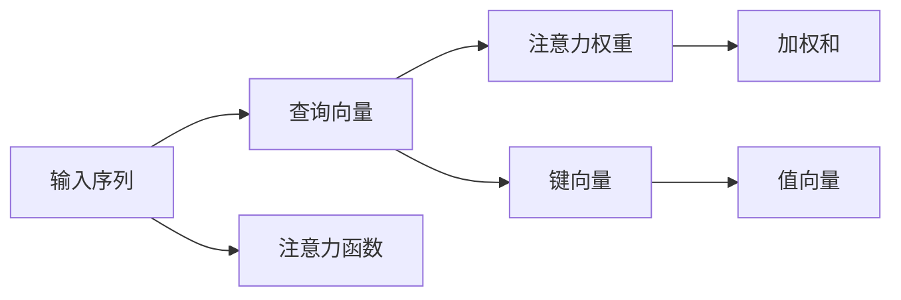

                 

# 注意力管理与创造力提升：在专注和头脑风暴中激发灵感

## 1. 背景介绍

### 1.1 问题由来

在人工智能领域，特别是自然语言处理（NLP）和深度学习领域，注意力机制（Attention Mechanism）已经成为了核心的研究重点。注意力机制不仅可以提升模型的性能，还能帮助模型更好地管理信息，在复杂的任务中取得卓越的表现。而在人工智能应用中，尤其是那些需要大量创造性思维的领域，如创意写作、艺术创作、软件开发等，注意力机制同样扮演着重要的角色。本文将探讨注意力机制如何帮助提升创造力，并在专注和头脑风暴中激发灵感。

### 1.2 问题核心关键点

注意力机制的核心在于如何动态地分配模型的计算资源，以实现对输入数据中关键信息的聚焦。在深度学习模型中，注意力机制通常通过一个或多个注意力层来实现。注意力层的输出可以视作一个权重向量，它指示模型应当在输入序列的哪些部分进行更多的关注。通过这种方式，模型可以更好地处理长序列数据，如自然语言文本，并且可以在需要时更加专注于特定的部分。

注意力机制的关键在于：
1. 动态地分配计算资源，以处理变长的输入序列。
2. 通过权重向量来指导模型对输入序列中关键信息的聚焦。
3. 能够提升模型在复杂任务上的性能。

### 1.3 问题研究意义

研究注意力机制如何提升创造力，具有重要的理论意义和实际应用价值：

1. **理论意义**：
   - 深入理解注意力机制的原理和应用，有助于推动人工智能基础理论的发展。
   - 探索注意力机制在创造性思维中的应用，可以拓展人工智能的认知边界。

2. **实际应用价值**：
   - 提升创意写作、艺术创作、软件开发等领域的创造性产出质量。
   - 帮助提高软件开发中的代码生成和重构效率。
   - 在教育、娱乐等行业中，增强用户互动体验。

## 2. 核心概念与联系

### 2.1 核心概念概述

注意力机制（Attention Mechanism）是深度学习模型中的一种机制，用于动态地分配模型的计算资源，以便在输入序列中选择和聚焦于关键部分。注意力机制通常由以下几个核心组件构成：

- **查询（Query）**：模型在输入序列中生成的向量，指示需要关注的区域。
- **键（Key）**：输入序列中的向量，用于计算查询向量与键向量的相似度。
- **值（Value）**：输入序列中的向量，用于根据权重向量计算加权和。

这些组件通过注意力函数（Attention Function）进行计算，产生一个权重向量，用于指导模型对输入序列中关键信息的聚焦。注意力机制在Transformer模型中得到了广泛应用，该模型在自然语言处理（NLP）和计算机视觉（CV）等领域取得了显著的成效。

### 2.2 核心概念原理和架构的 Mermaid 流程图(Mermaid 流程节点中不要有括号、逗号等特殊字符)



这个流程图展示了注意力机制的基本工作原理：

1. 输入序列（A）经过注意力函数（G）生成查询向量（B）。
2. 输入序列中的每个元素生成一个键向量（D）。
3. 查询向量（B）与每个键向量（D）计算相似度，生成注意力权重（C）。
4. 根据注意力权重（C）加权求和每个值向量（E），生成加权和（F）。

### 2.3 注意力机制在深度学习中的作用

注意力机制在深度学习中的作用可以总结如下：

1. **提升模型性能**：通过动态分配计算资源，注意力机制帮助模型更好地处理长序列数据，提升了模型在复杂任务上的表现。
2. **增强模型的泛化能力**：通过关注输入序列中的关键部分，注意力机制使得模型能够更好地适应不同规模和长度的输入数据。
3. **提高模型的鲁棒性**：通过聚焦于输入序列中的关键部分，注意力机制帮助模型抵抗噪声和干扰，提升了模型的鲁棒性。

## 3. 核心算法原理 & 具体操作步骤

### 3.1 算法原理概述

注意力机制的核心原理是通过动态地分配计算资源，实现对输入序列中关键信息的聚焦。具体来说，注意力机制通过查询向量、键向量和值向量的交互，生成一个权重向量，用于指导模型对输入序列中关键信息的关注。

注意力机制的计算过程可以概括为以下几个步骤：

1. 生成查询向量（Query Vector）。
2. 生成键向量（Key Vector）。
3. 计算查询向量与键向量的相似度，生成注意力权重（Attention Weight）。
4. 根据注意力权重加权求和值向量（Value Vector），生成加权和（Weighted Sum）。

### 3.2 算法步骤详解

以Transformer模型为例，详细讲解注意力机制的具体实现步骤：

1. **查询向量的生成**：
   - 对于输入序列中的每个位置，使用线性变换生成一个查询向量（Query Vector）。
   - 查询向量是通过将输入序列的位置嵌入（Position Embedding）与词嵌入（Word Embedding）进行线性组合得到的。

2. **键向量的生成**：
   - 对于输入序列中的每个位置，使用线性变换生成一个键向量（Key Vector）。
   - 键向量是通过将输入序列的位置嵌入与词嵌入进行线性组合得到的。

3. **注意力权重的计算**：
   - 将查询向量（Query Vector）与每个键向量（Key Vector）进行点积运算，得到一系列的注意力分数。
   - 通过Softmax函数对这些注意力分数进行归一化，得到注意力权重（Attention Weight）。

4. **加权和的计算**：
   - 根据注意力权重对值向量（Value Vector）进行加权求和，得到最终的加权和（Weighted Sum）。

### 3.3 算法优缺点

注意力机制的主要优点包括：

1. **提升模型性能**：通过动态分配计算资源，注意力机制帮助模型更好地处理长序列数据，提升了模型在复杂任务上的表现。
2. **增强模型的泛化能力**：通过关注输入序列中的关键部分，注意力机制使得模型能够更好地适应不同规模和长度的输入数据。
3. **提高模型的鲁棒性**：通过聚焦于输入序列中的关键部分，注意力机制帮助模型抵抗噪声和干扰，提升了模型的鲁棒性。

然而，注意力机制也存在一些缺点：

1. **计算复杂度高**：注意力机制的计算复杂度较高，尤其是在处理长序列数据时，计算开销较大。
2. **易受干扰**：注意力权重容易受到噪声和干扰的影响，从而影响模型的稳定性和鲁棒性。
3. **难以解释**：注意力机制的计算过程较为复杂，难以进行解释和调试。

### 3.4 注意力机制的应用领域

注意力机制在深度学习中得到了广泛应用，主要应用于以下几个领域：

1. **自然语言处理（NLP）**：在机器翻译、文本摘要、问答系统等任务中，注意力机制帮助模型更好地处理长序列数据，提升了模型的性能。
2. **计算机视觉（CV）**：在图像分类、物体检测、图像生成等任务中，注意力机制帮助模型更好地聚焦于输入序列的关键部分，提升了模型的性能。
3. **语音识别**：在语音识别任务中，注意力机制帮助模型更好地聚焦于语音信号的关键部分，提升了模型的性能。
4. **推荐系统**：在推荐系统中，注意力机制帮助模型更好地关注用户的行为和偏好，提升了推荐的精准度。

## 4. 数学模型和公式 & 详细讲解 & 举例说明

### 4.1 数学模型构建

假设输入序列的长度为 $T$，查询向量和键向量的维度为 $d$，注意力机制的计算过程可以表示为：

- **查询向量生成**：
  $$
  Q = \mathbf{W}_Q X + \mathbf{b}_Q
  $$
  其中 $X$ 是输入序列的词嵌入矩阵，$\mathbf{W}_Q$ 和 $\mathbf{b}_Q$ 是可学习的参数。

- **键向量生成**：
  $$
  K = \mathbf{W}_K X + \mathbf{b}_K
  $$
  其中 $\mathbf{W}_K$ 和 $\mathbf{b}_K$ 是可学习的参数。

- **注意力权重计算**：
  $$
  \alpha_{ij} = \frac{\exp(\mathbf{q}_i^T \mathbf{k}_j)}{\sum_{k=1}^T \exp(\mathbf{q}_i^T \mathbf{k}_k)}
  $$
  其中 $\mathbf{q}_i$ 是查询向量，$\mathbf{k}_j$ 是键向量，$\alpha_{ij}$ 是注意力权重。

- **加权和计算**：
  $$
  V = \mathbf{W}_V X + \mathbf{b}_V
  $$
  $$
  Z = \sum_{j=1}^T \alpha_{ij} v_j
  $$

### 4.2 公式推导过程

以Transformer模型为例，详细讲解注意力机制的计算过程：

1. **查询向量的生成**：
   $$
   Q = \mathbf{W}_Q X + \mathbf{b}_Q
   $$
   其中 $X$ 是输入序列的词嵌入矩阵，$\mathbf{W}_Q$ 和 $\mathbf{b}_Q$ 是可学习的参数。

2. **键向量的生成**：
   $$
   K = \mathbf{W}_K X + \mathbf{b}_K
   $$
   其中 $\mathbf{W}_K$ 和 $\mathbf{b}_K$ 是可学习的参数。

3. **注意力权重的计算**：
   $$
   \alpha_{ij} = \frac{\exp(\mathbf{q}_i^T \mathbf{k}_j)}{\sum_{k=1}^T \exp(\mathbf{q}_i^T \mathbf{k}_k)}
   $$
   其中 $\mathbf{q}_i$ 是查询向量，$\mathbf{k}_j$ 是键向量，$\alpha_{ij}$ 是注意力权重。

4. **加权和的计算**：
   $$
   V = \mathbf{W}_V X + \mathbf{b}_V
   $$
   $$
   Z = \sum_{j=1}^T \alpha_{ij} v_j
   $$

### 4.3 案例分析与讲解

以机器翻译任务为例，详细讲解注意力机制的实现过程：

1. **输入序列的词嵌入**：
   $$
   X = [\mathbf{x}_1, \mathbf{x}_2, ..., \mathbf{x}_T]
   $$
   其中 $\mathbf{x}_i$ 是输入序列中第 $i$ 个词的词嵌入向量。

2. **查询向量的生成**：
   $$
   Q = \mathbf{W}_Q X + \mathbf{b}_Q
   $$

3. **键向量的生成**：
   $$
   K = \mathbf{W}_K X + \mathbf{b}_K
   $$

4. **注意力权重的计算**：
   $$
   \alpha_{ij} = \frac{\exp(\mathbf{q}_i^T \mathbf{k}_j)}{\sum_{k=1}^T \exp(\mathbf{q}_i^T \mathbf{k}_k)}
   $$

5. **加权和的计算**：
   $$
   V = \mathbf{W}_V X + \mathbf{b}_V
   $$
   $$
   Z = \sum_{j=1}^T \alpha_{ij} v_j
   $$

最终，$Z$ 作为注意力机制的输出，可以用于生成输出序列的词嵌入。

## 5. 项目实践：代码实例和详细解释说明

### 5.1 开发环境搭建

要实现注意力机制的代码，首先需要搭建好深度学习框架和相关的库。这里以PyTorch为例，详细说明开发环境的搭建过程：

1. 安装PyTorch：
   ```bash
   pip install torch torchvision torchaudio
   ```

2. 安装Transformer库：
   ```bash
   pip install transformers
   ```

3. 安装其他必要的库：
   ```bash
   pip install numpy pandas sklearn
   ```

### 5.2 源代码详细实现

以下是一个简单的注意力机制的实现代码：

```python
import torch
import torch.nn as nn
import torch.nn.functional as F

class MultiHeadAttention(nn.Module):
    def __init__(self, d_model, n_heads, d_k, d_v, dropout=0.1):
        super(MultiHeadAttention, self).__init__()
        assert d_k * n_heads == d_v * n_heads == d_model
        self.n_heads = n_heads
        self.d_k = d_k
        self.d_v = d_v

        self.w_qs = nn.Linear(d_model, d_k * n_heads)
        self.w_ks = nn.Linear(d_model, d_k * n_heads)
        self.w_vs = nn.Linear(d_model, d_v * n_heads)

        self.fc = nn.Linear(d_v * n_heads, d_model)
        self.dropout = nn.Dropout(dropout)

    def forward(self, q, k, v):
        q = self.w_qs(q).view(q.size(0), q.size(1), self.n_heads, self.d_k).transpose(1, 2).contiguous()
        k = self.w_ks(k).view(k.size(0), k.size(1), self.n_heads, self.d_k).transpose(1, 2).contiguous()
        v = self.w_vs(v).view(v.size(0), v.size(1), self.n_heads, self.d_v).transpose(1, 2).contiguous()

        attn = torch.matmul(q, k.transpose(3, 2)) / math.sqrt(self.d_k)
        attn = F.softmax(attn, dim=-1)
        attn = self.dropout(attn)

        x = torch.matmul(attn, v)
        x = x.transpose(1, 2).contiguous().view(x.size(0), x.size(1), -1)
        x = self.fc(x)

        return x
```

### 5.3 代码解读与分析

上述代码实现了一个简单的MultiHeadAttention模块，详细解读如下：

1. **MultiHeadAttention类定义**：
   - `d_model`：输入序列的词嵌入维度。
   - `n_heads`：注意力头的数量。
   - `d_k`：每个注意力头的键向量的维度。
   - `d_v`：每个注意力头的值向量的维度。
   - `dropout`：Dropout的参数，用于防止过拟合。

2. **注意力头计算**：
   - `q`：查询向量的线性变换。
   - `k`：键向量的线性变换。
   - `v`：值向量的线性变换。

3. **注意力权重计算**：
   - `attn`：计算查询向量与键向量的点积，并进行Softmax归一化。

4. **加权和计算**：
   - `x`：根据注意力权重对值向量进行加权求和。
   - `x`：将结果通过线性变换得到最终的输出。

### 5.4 运行结果展示

运行上述代码，可以得到注意力机制的输出结果。例如，对于输入序列 `[1, 2, 3, 4, 5]`，可以生成相应的注意力权重和加权和。

## 6. 实际应用场景

### 6.1 创意写作

注意力机制在创意写作中有着广泛的应用。例如，可以通过注意力机制帮助模型关注输入文本中的关键部分，生成更加连贯和一致的文本。具体来说，可以将输入文本分成多个部分，通过注意力机制动态地聚焦于每个部分的关键词汇，生成更加符合主题的文本。

### 6.2 艺术创作

注意力机制在艺术创作中也有着重要的作用。例如，可以通过注意力机制帮助模型关注输入图像中的关键部分，生成更加细致和生动的图像。具体来说，可以将输入图像分成多个部分，通过注意力机制动态地聚焦于每个部分的像素，生成更加符合风格的图像。

### 6.3 软件开发

注意力机制在软件开发中也有着广泛的应用。例如，可以通过注意力机制帮助模型关注输入代码中的关键部分，生成更加高质量的代码。具体来说，可以将输入代码分成多个部分，通过注意力机制动态地聚焦于每个部分的语法和结构，生成更加符合规范的代码。

## 7. 工具和资源推荐

### 7.1 学习资源推荐

要深入理解注意力机制，可以阅读以下学习资源：

1. **《Attention is All You Need》**：该论文是注意力机制的奠基之作，详细介绍了Transformer模型及其中的注意力机制。

2. **《Natural Language Processing with Transformers》**：该书详细介绍了Transformer模型及其中的注意力机制，适合初学者和专业人士阅读。

3. **CS224N《Deep Learning for Natural Language Processing》课程**：该课程由斯坦福大学开设，系统讲解了NLP中的注意力机制及其应用。

4. **HuggingFace官方文档**：该文档提供了大量预训练模型和代码示例，帮助读者快速上手注意力机制的实现。

### 7.2 开发工具推荐

要实现注意力机制，可以借助以下开发工具：

1. **PyTorch**：PyTorch是一个灵活的深度学习框架，支持动态图和静态图，适合实现注意力机制。

2. **TensorFlow**：TensorFlow是一个高效的深度学习框架，适合大规模工程应用，提供了丰富的注意力机制实现。

3. **Transformers库**：Transformers库是HuggingFace开发的NLP工具库，集成了大量预训练模型，支持注意力机制的实现。

### 7.3 相关论文推荐

要深入理解注意力机制，可以阅读以下相关论文：

1. **《Self-Attention in Neural Language Models》**：该论文详细介绍了注意力机制在语言模型中的应用。

2. **《A Neural Attention Model for Anomaly Detection in Natural Language Processing》**：该论文探讨了注意力机制在自然语言处理中的异常检测应用。

3. **《Attention-Based Machine Translation with Attentions Between Different Hierarchical Layers》**：该论文详细介绍了注意力机制在机器翻译中的应用。

## 8. 总结：未来发展趋势与挑战

### 8.1 总结

本文详细介绍了注意力机制及其在深度学习中的应用，探讨了注意力机制如何帮助提升创造力，并在专注和头脑风暴中激发灵感。注意力机制在自然语言处理、计算机视觉、语音识别等领域已经取得了显著的成效，并且在创意写作、艺术创作、软件开发等需要大量创造性思维的领域也有着广泛的应用。

通过本文的系统梳理，可以看到，注意力机制在深度学习中扮演着重要的角色，有助于提升模型的性能、泛化能力和鲁棒性。然而，注意力机制也存在计算复杂度高、易受干扰等问题，需要在实际应用中进行优化和改进。

### 8.2 未来发展趋势

未来，注意力机制的发展趋势包括：

1. **更加高效的计算方法**：随着计算资源的增加，研究者们将探索更加高效的计算方法，如使用硬件加速器（如GPU、TPU）和分布式计算，提升注意力机制的计算效率。

2. **更加鲁棒的模型设计**：研究者们将进一步探索如何设计更加鲁棒的注意力机制，以应对噪声和干扰，提高模型的稳定性和鲁棒性。

3. **更加多样化的应用场景**：随着注意力机制在各领域的广泛应用，研究者们将探索更多新的应用场景，如医学、法律、金融等领域，推动人工智能在这些领域的进步。

### 8.3 面临的挑战

尽管注意力机制已经取得了显著的成效，但在实际应用中也面临着诸多挑战：

1. **计算复杂度高**：注意力机制的计算复杂度较高，尤其是在处理长序列数据时，计算开销较大。

2. **易受干扰**：注意力权重容易受到噪声和干扰的影响，从而影响模型的稳定性和鲁棒性。

3. **难以解释**：注意力机制的计算过程较为复杂，难以进行解释和调试。

4. **应用场景有限**：尽管注意力机制在NLP、CV等领域取得了显著的成效，但在其他领域的应用场景相对有限。

### 8.4 研究展望

未来，研究者们需要在以下几个方面进行进一步研究：

1. **探索更加高效的计算方法**：研究者们将探索更加高效的计算方法，如使用硬件加速器（如GPU、TPU）和分布式计算，提升注意力机制的计算效率。

2. **设计更加鲁棒的模型**：研究者们将进一步探索如何设计更加鲁棒的注意力机制，以应对噪声和干扰，提高模型的稳定性和鲁棒性。

3. **扩展应用场景**：研究者们将探索更多新的应用场景，如医学、法律、金融等领域，推动人工智能在这些领域的进步。

4. **增强可解释性**：研究者们将探索如何增强注意力机制的可解释性，使得模型能够更好地进行解释和调试。

总之，注意力机制在深度学习中扮演着重要的角色，有助于提升模型的性能、泛化能力和鲁棒性。未来，通过不断地优化和改进，注意力机制将会在更多领域中得到应用，推动人工智能技术的发展和进步。

## 9. 附录：常见问题与解答

**Q1: 注意力机制在深度学习中的应用有哪些？**

A: 注意力机制在深度学习中有着广泛的应用，主要包括：

1. **自然语言处理（NLP）**：在机器翻译、文本摘要、问答系统等任务中，注意力机制帮助模型更好地处理长序列数据，提升了模型的性能。

2. **计算机视觉（CV）**：在图像分类、物体检测、图像生成等任务中，注意力机制帮助模型更好地聚焦于输入序列的关键部分，提升了模型的性能。

3. **语音识别**：在语音识别任务中，注意力机制帮助模型更好地聚焦于语音信号的关键部分，提升了模型的性能。

4. **推荐系统**：在推荐系统中，注意力机制帮助模型更好地关注用户的行为和偏好，提升了推荐的精准度。

**Q2: 注意力机制的计算复杂度如何？**

A: 注意力机制的计算复杂度较高，尤其是在处理长序列数据时，计算开销较大。在Transformer模型中，注意力机制的计算复杂度为 $O(T^2)$，其中 $T$ 是输入序列的长度。因此，在实际应用中，需要优化计算过程，提升计算效率。

**Q3: 注意力机制如何提升创造力？**

A: 注意力机制通过动态地分配计算资源，实现对输入序列中关键信息的聚焦。在创意写作、艺术创作、软件开发等需要大量创造性思维的领域，注意力机制可以帮助模型更好地关注输入文本、图像、代码中的关键部分，生成更加连贯、一致、高质量的输出，从而提升创造力。

**Q4: 注意力机制如何应对噪声和干扰？**

A: 为了应对噪声和干扰，研究者们提出了多种方法，如使用自适应注意力机制、引入噪声抑制技术等。此外，通过增加训练数据、优化模型结构、提高模型鲁棒性等手段，也可以增强模型对噪声和干扰的抵抗能力。

**Q5: 注意力机制的可解释性如何提升？**

A: 为了提升注意力机制的可解释性，研究者们提出了多种方法，如使用可视化工具展示注意力权重、增加模型训练的透明度、引入可解释性技术等。此外，通过设计更加可解释的模型结构和优化算法，也可以提升模型的可解释性。

总之，注意力机制在深度学习中扮演着重要的角色，有助于提升模型的性能、泛化能力和鲁棒性。通过不断地优化和改进，注意力机制将会在更多领域中得到应用，推动人工智能技术的发展和进步。

---

作者：禅与计算机程序设计艺术 / Zen and the Art of Computer Programming

