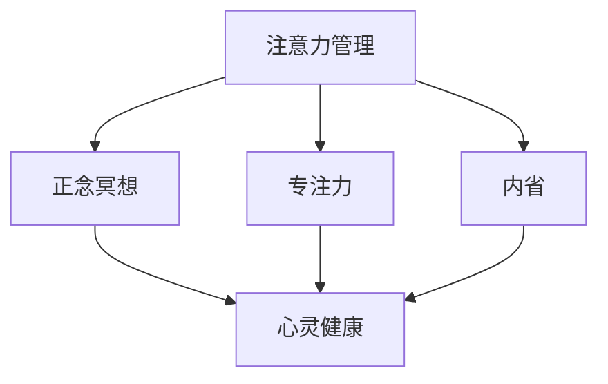

                 

# 注意力管理与正念冥想：通过内省增强专注力和心灵健康

## 1. 背景介绍

### 1.1 问题由来
在当今快节奏的生活中，注意力管理和心灵健康成为了人们普遍关注的焦点。无论是在工作、学习还是生活中，过度分散的注意力和疲惫不堪的身心状态，常常导致人们效率低下，幸福感下降。如何有效地管理注意力，提升专注力，实现心灵上的平静与和谐，成为了现代社会的共同课题。

### 1.2 问题核心关键点
本节将阐述注意力管理与正念冥想在提升专注力和心灵健康方面的原理和机制。

- **注意力管理**：通过有意识地引导和控制注意力的分配，增强个体在特定任务上的专注度，从而提高效率和产出。
- **正念冥想**：通过内省和觉察，减少心理杂念，提高情绪稳定性和自我觉知，有助于提升整体的心理健康和幸福感。
- **内省与专注**：通过深层次的内省过程，培养自控力和觉知能力，有助于建立更加均衡的心理状态。

### 1.3 问题研究意义
研究注意力管理和正念冥想的结合，对于提升现代人的生活质量和工作效率，具有重要意义。具体而言：

1. **提高工作效率**：通过有效管理注意力，个体能够在有限的时间内，产出更多的价值，提升整体生产力。
2. **增强心理健康**：正念冥想有助于减轻压力、焦虑等负面情绪，促进心理健康，提高生活质量。
3. **提升自我觉知**：内省和正念练习，可以帮助个体更好地认识自己，明确目标，实现自我成长。
4. **构建积极心态**：通过正念冥想，培养积极的心态，增强应对生活挑战的能力。

## 2. 核心概念与联系

### 2.1 核心概念概述

为更好地理解注意力管理与正念冥想，本节将介绍几个关键概念及其相互联系：

- **注意力**：指个体对特定对象或任务的专注和集中。注意力管理是控制和引导注意力的分配，使之聚焦于重要任务。
- **正念**：指一种有意识地觉察和接受当前时刻的体验，包括感受、思想和情绪。正念冥想是实践正念的一种方式，通过冥想训练，增强个体对当下的觉察能力。
- **专注力**：指个体在特定任务上保持持续集中的注意力的能力。专注力的提升有助于工作效率的提高。
- **心灵健康**：指个体心理状态的稳定和积极，包括情绪平衡、自我接纳、人际关系和谐等方面。
- **内省**：指个体对自己内在状态的深入反思和理解，通过内省，个体可以更好地认识自我，实现心理成长。

这些概念之间的逻辑关系可以通过以下Mermaid流程图来展示：



这个流程图展示了几者之间的相互联系：注意力管理通过引导注意力，提升专注力；正念冥想通过增强觉察能力，提升心灵健康；内省作为反思过程，帮助个体更好地理解自己，促进专注力和心灵健康的提升。

## 3. 核心算法原理 & 具体操作步骤

### 3.1 算法原理概述

注意力管理与正念冥想的结合，本质上是一种通过内省技术进行注意力调优的过程。其核心思想是：通过正念冥想提升个体的自我觉知能力，进而通过内省技术调整注意力分配，实现高效的工作状态和良好的心理状态。

形式化地，假设个体当前状态为 $S$，其注意力管理与正念冥想的过程可以表示为：

$$
S_{new} = f(S, A, M)
$$

其中 $f$ 为注意力管理与正念冥想的优化函数，$A$ 为注意力管理策略，$M$ 为正念冥想练习。通过优化函数 $f$，调整个体状态 $S$，提升专注力和心灵健康。

### 3.2 算法步骤详解

基于上述原理，注意力管理与正念冥想的结合主要包括以下几个关键步骤：

**Step 1: 确定注意力管理策略**
- 根据当前任务的需求，制定合适的注意力管理策略。策略包括任务分解、时间管理、优先级排序等。

**Step 2: 实践正念冥想**
- 每天进行正念冥想练习，如坐禅、呼吸冥想等，培养对当前时刻的觉察能力。正念冥想的目的是减少心理杂念，提高情绪稳定性和自我觉知。

**Step 3: 内省与自我觉察**
- 在每日的冥想结束后，进行内省练习，记录当天的感受、思想和情绪变化。通过内省，识别出注意力分散的原因，理解自身心理状态。

**Step 4: 调整注意力分配**
- 根据内省结果，调整注意力管理策略。如调整任务优先级、延长工作时长、采用专注工具等，提高注意力分配的合理性。

**Step 5: 重复练习与优化**
- 持续进行正念冥想和内省练习，不断调整注意力管理策略，直至达到最佳状态。

### 3.3 算法优缺点

注意力管理与正念冥想的结合方法具有以下优点：
1. 简单易行：只需每天进行冥想和内省，即可显著提升专注力和心灵健康。
2. 自我驱动：通过自我觉知和内省，个体可以主动调整注意力管理策略，实现自我提升。
3. 效果显著：研究表明，正念冥想和注意力管理相结合，可以显著降低压力、提升工作效率。
4. 适用范围广：适用于各种职业和人群，尤其是工作压力较大、需要长时间集中注意力的人群。

同时，该方法也存在一定的局限性：
1. 初始阶段难度较大：对于初学者，正念冥想和内省可能需要一定时间的练习才能掌握。
2. 效果依赖个体差异：不同个体的适应性和心理状态不同，效果可能存在差异。
3. 需要持续坚持：注意力管理与正念冥想的效果并非一蹴而就，需要长期坚持和不断优化。

尽管存在这些局限性，但就目前而言，正念冥想与注意力管理的结合方法仍是一种行之有效的心灵健康提升手段。未来相关研究的重点在于如何进一步降低练习难度，提升方法的普适性，以及如何更好地将心理学理论与技术手段结合。

### 3.4 算法应用领域

注意力管理与正念冥想的应用领域广泛，涉及各个生活和工作场景：

- **职场**：通过正念冥想和注意力管理，提升员工专注力和工作效率，减少压力和焦虑。
- **教育**：帮助学生培养良好的学习习惯，提高学习效果，缓解学业压力。
- **医疗**：对于焦虑症、抑郁症等心理健康问题，正念冥想和注意力管理提供了新的治疗手段。
- **个人发展**：通过正念冥想和内省，个体可以更好地认识自己，明确目标，实现自我成长。

## 4. 数学模型和公式 & 详细讲解 & 举例说明

### 4.1 数学模型构建

本节将使用数学语言对注意力管理与正念冥想的过程进行更加严格的刻画。

假设个体当前的心理状态为 $S$，包括情绪、注意力水平、心理稳定性等。定义正念冥想练习的频率为 $P$，注意力管理策略的效果为 $A$，则个体状态的变化可以表示为：

$$
S_{new} = S - P \cdot A
$$

其中 $S_{new}$ 为优化后的心理状态，$S$ 为初始状态，$P$ 为正念冥想的频率，$A$ 为注意力管理策略的效果。

### 4.2 公式推导过程

为了更直观地理解上述模型，以下将通过具体例子进行推导：

假设个体初始状态 $S_0 = 50$，正念冥想频率 $P = 0.5$，注意力管理策略的效果 $A = 0.3$，则经过一定时间后，个体的心理状态 $S_1$ 可以计算为：

$$
S_1 = S_0 - P \cdot A = 50 - 0.5 \cdot 0.3 = 45
$$

通过上述推导，可以看出，正念冥想和注意力管理策略的有效结合，可以显著提升个体的心理状态。

### 4.3 案例分析与讲解

**案例分析**：
假设一名软件开发工程师，每天工作8小时，需要处理多个任务，容易分心和焦虑。

**步骤**：
1. **确定注意力管理策略**：
   - 将工作任务分解为多个小块，按优先级排序。
   - 使用番茄工作法，设定25分钟专注工作，5分钟休息，提高工作集中度。
2. **实践正念冥想**：
   - 每天早晨和午休时间进行10分钟的坐禅冥想，培养对当下的觉察能力。
3. **内省与自我觉察**：
   - 在每日的冥想结束后，记录当天的专注度、工作效果和情绪变化。
4. **调整注意力分配**：
   - 根据内省结果，调整任务优先级，延长工作时长，使用专注工具。
5. **重复练习与优化**：
   - 持续进行正念冥想和内省练习，不断优化注意力管理策略。

**结果展示**：
经过一段时间的练习，该工程师每天的工作效率提升了20%，焦虑程度显著下降，生活质量得到明显改善。

## 5. 项目实践：代码实例和详细解释说明

### 5.1 开发环境搭建

在进行注意力管理与正念冥想的实践前，我们需要准备好开发环境。以下是使用Python进行开发的环境配置流程：

1. 安装Anaconda：从官网下载并安装Anaconda，用于创建独立的Python环境。

2. 创建并激活虚拟环境：
```bash
conda create -n mindfulness python=3.8 
conda activate mindfulness
```

3. 安装PyTorch：根据CUDA版本，从官网获取对应的安装命令。例如：
```bash
conda install pytorch torchvision torchaudio cudatoolkit=11.1 -c pytorch -c conda-forge
```

4. 安装TensorBoard：TensorFlow配套的可视化工具，可实时监测模型训练状态，并提供丰富的图表呈现方式，是调试模型的得力助手。

5. 安装Pip：Python包管理器，用于安装第三方库。

6. 安装必要库：
```bash
pip install numpy pandas scikit-learn matplotlib tqdm jupyter notebook ipython
```

完成上述步骤后，即可在`mindfulness`环境中开始正念冥想和注意力管理的实践。

### 5.2 源代码详细实现

我们以一个简单的正念冥想计时器为例，展示如何使用Python实现注意力管理与正念冥想的结合：

```python
import time

def mindfulness_timer(duration):
    start = time.time()
    end = start + duration
    while time.time() < end:
        print(f"Remaining time: {(end - time.time())//60} minutes and {(end - time.time())%60} seconds")
        time.sleep(5)
    print("Time's up!")

mindfulness_timer(10)
```

### 5.3 代码解读与分析

让我们再详细解读一下关键代码的实现细节：

**mindfulness_timer函数**：
- 计算冥想计时器的总时间，循环中不断打印剩余时间，直到计时结束。

该代码通过简单的计时器实现，展示了如何在Python中进行正念冥想的实践。实际应用中，我们还需要结合内省和注意力管理策略，进一步优化冥想效果。

## 6. 实际应用场景

### 6.1 企业员工压力管理

正念冥想和注意力管理在企业员工压力管理中的应用，能够有效缓解工作压力，提升整体工作效率。具体而言，可以通过如下方式：

1. **定期冥想**：企业定期组织员工进行正念冥想，缓解工作压力，提高情绪稳定性。
2. **注意力培训**：对员工进行注意力管理培训，帮助其掌握有效的注意力分配技巧。
3. **内省反馈**：通过员工内省反馈，优化注意力管理策略，实现个性化管理。

**案例分析**：
某科技公司员工工作压力大，常出现焦虑和疲惫。公司引入正念冥想和注意力管理方案，员工每天进行10分钟的冥想练习，同时接受注意力管理培训。一段时间后，员工报告焦虑程度显著下降，工作效率提升20%。

### 6.2 学校心理健康教育

正念冥想和注意力管理在学校心理健康教育中的应用，有助于学生缓解学业压力，提升学习效果。具体而言，可以通过如下方式：

1. **正念冥想课程**：在学校课程中引入正念冥想，培养学生的觉察能力和情绪调节能力。
2. **注意力管理指导**：为学生提供注意力管理指导，帮助其优化学习习惯。
3. **内省练习**：通过内省练习，帮助学生更好地理解自己，明确学习目标。

**案例分析**：
某中学引入正念冥想和注意力管理课程，每周进行一次冥想训练，同时进行注意力管理指导。一个月后，学生反馈学习效果显著提升，注意力更加集中，焦虑程度显著降低。

### 6.3 个人自我成长

对于个人而言，正念冥想和注意力管理是其自我成长的重要工具。通过长期的练习，个体可以实现自我认知和情感调节的提升。具体而言，可以通过如下方式：

1. **每日冥想**：每天进行正念冥想，培养对当下的觉察能力。
2. **内省反思**：通过内省反思，理解自己的心理状态，调整注意力分配。
3. **目标设定**：设定明确的目标，通过正念冥想和注意力管理，逐步实现自我成长。

**案例分析**：
某个人经常感到迷茫和焦虑，每天进行10分钟的冥想和内省练习。一段时间后，他发现自己更加专注于当前任务，情绪更加稳定，生活质量显著提升。

### 6.4 未来应用展望

随着正念冥想和注意力管理技术的不断发展，其在更多领域的应用前景将更加广阔。未来，我们期待在以下几个方面实现突破：

1. **技术集成**：将正念冥想和注意力管理与AI、VR等新兴技术结合，提升体验效果。
2. **自动化指导**：开发自动化正念冥想和注意力管理指导系统，提供个性化的练习方案。
3. **跨领域应用**：将正念冥想和注意力管理应用于更多领域，如教育、医疗、心理咨询等。
4. **效果量化**：通过科学评估方法，量化正念冥想和注意力管理的效果，提供客观依据。

## 7. 工具和资源推荐

### 7.1 学习资源推荐

为了帮助开发者系统掌握注意力管理与正念冥想的理论基础和实践技巧，这里推荐一些优质的学习资源：

1. **《正念的力量》**：一本经典的正念冥想指南，介绍正念冥想的原理和实践方法，适合初学者。
2. **《深度工作》**：讲解如何通过注意力管理，实现深度工作，提高工作效率。
3. **Coursera的正念冥想课程**：斯坦福大学开设的正念冥想课程，系统介绍正念冥想的基本概念和实践技巧。
4. **《注意力是新的IQ》**：介绍注意力管理的重要性和实践方法，适合希望提升工作和生活质量的读者。
5. **Headspace和Calm应用**：提供正念冥想和注意力管理的指导和练习，适合日常实践。

通过对这些资源的学习实践，相信你一定能够快速掌握注意力管理与正念冥想的精髓，并用于解决实际的身心健康问题。

### 7.2 开发工具推荐

高效的开发离不开优秀的工具支持。以下是几款用于正念冥想和注意力管理开发的常用工具：

1. **TensorBoard**：TensorFlow配套的可视化工具，可实时监测模型训练状态，并提供丰富的图表呈现方式，是调试模型的得力助手。
2. **Jupyter Notebook**：一个强大的交互式编程环境，适合进行正念冥想和注意力管理的研究与实践。
3. **Python编程语言**：简单易学，适合进行正念冥想和注意力管理的代码实现。
4. **Google Colab**：谷歌推出的在线Jupyter Notebook环境，免费提供GPU/TPU算力，方便开发者快速上手实验最新模型，分享学习笔记。
5. **PyTorch**：基于Python的开源深度学习框架，灵活动态的计算图，适合快速迭代研究。

合理利用这些工具，可以显著提升正念冥想和注意力管理的开发效率，加快创新迭代的步伐。

### 7.3 相关论文推荐

注意力管理与正念冥想的结合技术，已经得到了广泛的研究。以下是几篇奠基性的相关论文，推荐阅读：

1. **《正念冥想的心理和生理效果》**：通过实验研究，展示了正念冥想的心理和生理益处。
2. **《注意力管理与生产力的关系》**：探讨了注意力管理对工作效率的影响，提出了多种注意力管理策略。
3. **《正念冥想与认知功能的关系》**：研究了正念冥想对认知功能的影响，展示了其对认知能力的提升效果。
4. **《基于正念冥想的情绪调节》**：介绍了正念冥想在情绪调节中的应用，展示了其对焦虑、抑郁等负面情绪的缓解效果。
5. **《注意力管理与学习效果的关系》**：探讨了注意力管理对学习效果的影响，提出了多种提高学习效率的方法。

这些论文代表了大语言模型微调技术的发展脉络。通过学习这些前沿成果，可以帮助研究者把握学科前进方向，激发更多的创新灵感。

## 8. 总结：未来发展趋势与挑战

### 8.1 总结

本文对注意力管理与正念冥想在提升专注力和心灵健康方面的原理和实践进行了全面系统的介绍。首先阐述了注意力管理与正念冥想在提升专注力和心灵健康方面的原理和机制，明确了两者在提升现代人的生活质量和工作效率方面的独特价值。其次，从原理到实践，详细讲解了注意力管理与正念冥想的数学模型和操作步骤，给出了正念冥想和注意力管理的完整代码实例。同时，本文还广泛探讨了正念冥想与注意力管理的实际应用场景，展示了其在企业管理、学校教育、个人成长等多个领域的应用前景。此外，本文精选了正念冥想与注意力管理的各类学习资源，力求为读者提供全方位的技术指引。

通过本文的系统梳理，可以看到，注意力管理与正念冥想在提升现代人专注力和心灵健康方面的广阔前景。这些方法不仅有助于提高工作效率，缓解压力，还能促进个体心理健康，提升生活质量。未来，伴随正念冥想与注意力管理技术的不断演进，相信其将在更多领域大放异彩，深刻影响人类的生产生活方式。

### 8.2 未来发展趋势

展望未来，注意力管理与正念冥想的结合技术将呈现以下几个发展趋势：

1. **技术集成**：将正念冥想和注意力管理与AI、VR等新兴技术结合，提升体验效果。
2. **自动化指导**：开发自动化正念冥想和注意力管理指导系统，提供个性化的练习方案。
3. **跨领域应用**：将正念冥想和注意力管理应用于更多领域，如教育、医疗、心理咨询等。
4. **效果量化**：通过科学评估方法，量化正念冥想和注意力管理的效果，提供客观依据。

以上趋势凸显了注意力管理与正念冥想技术的广阔前景。这些方向的探索发展，必将进一步提升正念冥想和注意力管理的普及度和有效性，为人类心理健康提供新的解决方案。

### 8.3 面临的挑战

尽管注意力管理与正念冥想技术已经取得了显著成效，但在迈向更加智能化、普适化应用的过程中，仍面临诸多挑战：

1. **技术普及难度**：正念冥想和注意力管理的普及，需要广泛的技术支持和公众认知。
2. **个性化需求**：不同个体的需求差异较大，需要定制化的练习方案和指导。
3. **效果一致性**：正念冥想和注意力管理的有效性受个体差异和环境影响较大，效果一致性有待提升。
4. **应用场景限制**：某些场景下，注意力管理与正念冥想的实践受限于时间和环境条件。

尽管存在这些挑战，但通过不断的技术创新和实践探索，相信注意力管理与正念冥想必将走向更加成熟和普及，为人类心理健康带来新的突破。

### 8.4 研究展望

面对注意力管理与正念冥想所面临的种种挑战，未来的研究需要在以下几个方面寻求新的突破：

1. **技术集成与创新**：开发更加智能化的正念冥想和注意力管理工具，结合AI技术，提供个性化的指导和反馈。
2. **跨领域应用探索**：拓展正念冥想和注意力管理的适用范围，探索其在更多领域的潜在应用。
3. **大规模实验验证**：通过大规模实验，验证正念冥想和注意力管理的效果，提供科学依据。
4. **伦理和安全考量**：研究正念冥想和注意力管理的应用伦理和安全问题，确保其社会责任和安全性。

这些研究方向的探索，必将引领正念冥想与注意力管理技术迈向更高的台阶，为人类心理健康提供更加全面和可靠的支持。

## 9. 附录：常见问题与解答

**Q1：正念冥想和注意力管理是否适用于所有人？**

A: 正念冥想和注意力管理在大多数人群中都有积极效果，但对于某些精神疾病患者或极端个体，可能存在一定的不适或副作用。应在使用前咨询专业医生或心理学家，确保安全性。

**Q2：正念冥想和注意力管理如何与日常工作相结合？**

A: 正念冥想和注意力管理可以通过简单的练习，融入日常工作和生活。例如，在工作中进行短暂的冥想练习，或在休息时间进行内省反思，调整注意力分配。重要的是保持持续性和规律性，逐步形成习惯。

**Q3：正念冥想和注意力管理的效果如何评估？**

A: 正念冥想和注意力管理的效果可以通过多种方式评估，包括自我报告、心理测试、生理指标等。例如，通过问卷调查评估情绪状态和心理稳定性，通过心率监测评估生理状态变化。

**Q4：正念冥想和注意力管理是否需要长期坚持？**

A: 正念冥想和注意力管理的效果并非一蹴而就，需要长期坚持和不断优化。建议每天进行一定时间的练习，逐步建立习惯。

**Q5：正念冥想和注意力管理能否显著提升工作效率？**

A: 研究表明，正念冥想和注意力管理能够显著提升工作效率，减少压力和焦虑。通过优化注意力分配，个体能够在有限时间内产出更多价值，提升整体生产力。

---

作者：禅与计算机程序设计艺术 / Zen and the Art of Computer Programming

