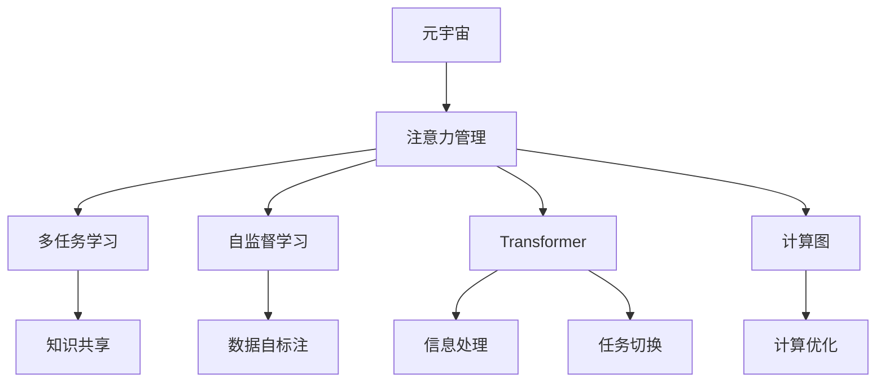

                 

# 注意力管理在元宇宙中的重要性

> 关键词：元宇宙,注意力管理,多任务学习,自监督学习,Transformer,Attention,计算图

## 1. 背景介绍

### 1.1 问题由来
近年来，随着技术的飞速发展，元宇宙(Utopia)概念逐渐成为技术界的热点。从游戏世界到虚拟现实，从虚拟办公到社交平台，元宇宙技术的应用已经渗透到生活的方方面面。元宇宙的核心特点在于提供沉浸式、动态化的虚拟体验，通过多维感官互动，带来全新的互动形式和应用场景。然而，实现这一目标的关键在于如何高效地管理注意力，提升用户的使用体验和参与感。

### 1.2 问题核心关键点
注意力管理（Attention Management）在元宇宙中扮演着至关重要的角色。元宇宙由大量的数字资产和交互对象组成，用户在不同场景和任务间切换时，需要快速、准确地聚焦注意力，进行有效的信息处理和行为决策。这涉及到注意力分配、信息筛选、场景切换等诸多方面，需要一系列的算法和技术的支持。

为了更有效地实现注意力管理，元宇宙中的注意力模型需要具备以下特点：
- **高效性**：在多任务并发的情况下，能够快速响应不同任务间的切换，保持高效运行。
- **智能性**：能够根据用户的行为和环境变化，动态调整注意力分配策略，提高信息处理和决策的准确性。
- **鲁棒性**：对不同数据分布和噪声的容忍度，能够在各种环境条件下保持稳定表现。
- **可解释性**：能够提供决策的逻辑和理由，增强用户对系统的理解和信任。

## 2. 核心概念与联系

### 2.1 核心概念概述

为了更好地理解注意力管理在元宇宙中的应用，本文将介绍几个关键核心概念：

- **元宇宙（Metaverse）**：构建一个由虚拟世界、数字资产和交互对象组成的数字空间，支持用户通过数字身份进行交互，创造虚拟社区和体验。

- **注意力管理（Attention Management）**：涉及用户在不同任务间动态分配注意力资源，确保高效的信息处理和决策能力。

- **多任务学习（Multi-task Learning）**：一种能够同时处理多个相关任务的机器学习方法，能够共享任务间的知识，提高模型泛化能力。

- **自监督学习（Self-supervised Learning）**：无需显式标注数据，通过模型自发的预测任务来训练自身，适用于数据量不足或标注成本高的情况。

- **Transformer模型**：一种基于自注意力机制的深度学习模型，在自然语言处理等领域取得了广泛应用，其高效的信息处理能力尤其适合元宇宙场景。

- **计算图（Computational Graph）**：一种用于描述和优化深度学习模型的数据流图，能够自动管理计算过程，减少资源浪费。

这些核心概念之间的联系可以通过以下Mermaid流程图来展示：



这个流程图展示了大模型在元宇宙中的关键概念及其之间的关系：

1. 元宇宙构建了各种虚拟场景，并由注意力模型动态管理用户注意力。
2. 多任务学习和自监督学习提升了模型在多个相关任务上的表现。
3. Transformer模型利用其高效的信息处理能力，进一步优化了注意力分配策略。
4. 计算图提供了高效的模型表达和优化方式，提高了模型性能。

## 3. 核心算法原理 & 具体操作步骤
### 3.1 算法原理概述

注意力管理在元宇宙中的核心算法原理是Transformer模型中的自注意力机制。自注意力机制利用查询-键-值（Q-K-V）映射结构，计算每个输入元素与其他元素间的相似度，从而实现信息的动态选择和加权。这一机制特别适合于多任务学习的场景，能够高效地进行信息整合和任务切换。

### 3.2 算法步骤详解

注意力管理在元宇宙中的算法实现过程如下：

**Step 1: 准备元宇宙数据**
- 收集元宇宙中的各个虚拟场景和交互对象的数据，例如游戏角色、物品、场景环境等。
- 对数据进行预处理，包括特征提取、数据增强等步骤。

**Step 2: 设计计算图**
- 构建计算图，表示元宇宙中各个任务之间的依赖关系和数据流。
- 使用计算图优化工具（如ONNX、PyTorch、TensorFlow等）对计算图进行优化和分析，减少计算资源的浪费。

**Step 3: 定义注意力模型**
- 根据元宇宙中的任务需求，定义自注意力模型，并选择合适的参数配置。
- 引入多任务学习模块，允许模型同时处理多个相关任务。

**Step 4: 训练模型**
- 将训练数据划分为训练集、验证集和测试集，进行模型训练。
- 利用自监督学习技术，如掩码语言模型（Masked Language Modeling），进行模型预训练。
- 在训练过程中，使用正则化技术和优化算法（如Adam、SGD等）进行参数更新。

**Step 5: 模型评估与部署**
- 在测试集上评估模型性能，根据性能指标（如精度、召回率、F1-score等）优化模型。
- 将训练好的模型部署到元宇宙的服务器中，进行实时推理和交互。
- 定期更新模型参数，以适应元宇宙中数据分布的变化。

### 3.3 算法优缺点

注意力管理在元宇宙中的算法具有以下优点：
1. 高效性：利用自注意力机制，能够在多任务并发的环境中高效处理信息。
2. 智能性：通过多任务学习和自监督学习，能够动态调整注意力分配策略，提高信息处理和决策的准确性。
3. 鲁棒性：对不同数据分布和噪声的容忍度较高，能够在各种环境条件下保持稳定表现。
4. 可解释性：通过计算图和Transformer模型，可以可视化模型决策过程，增强用户对系统的理解和信任。

但该算法也存在一些局限性：
1. 计算开销较大：自注意力机制和计算图优化需要较高的计算资源，可能影响实时性。
2. 需要大量数据：自监督学习和多任务学习需要大量标注数据，数据收集成本较高。
3. 模型复杂度高：自注意力机制和计算图需要较复杂的算法实现，模型训练和推理难度较大。

### 3.4 算法应用领域

注意力管理在元宇宙中的应用广泛，包括但不限于以下几个领域：

- **虚拟游戏**：管理玩家注意力，提供沉浸式游戏体验。例如，自动角色控制、任务自动完成等。
- **虚拟办公**：管理员工注意力，提升工作效率。例如，自动分配任务、会议管理、实时协作等。
- **虚拟社交**：管理用户注意力，增强互动体验。例如，推荐系统、虚拟朋友、虚拟社交网络等。
- **虚拟购物**：管理用户注意力，提升购物体验。例如，个性化推荐、虚拟试穿、虚拟购物车等。
- **虚拟旅游**：管理用户注意力，提供沉浸式旅游体验。例如，虚拟导览、虚拟观光、虚拟旅行等。

## 4. 数学模型和公式 & 详细讲解 & 举例说明
### 4.1 数学模型构建

本节将使用数学语言对元宇宙中的注意力管理模型进行更加严格的刻画。

假设元宇宙中的任务集为 $\mathcal{T}=\{T_1, T_2, ..., T_n\}$，其中 $T_i$ 为第 $i$ 个任务。设元宇宙中的数据为 $D=\{d_1, d_2, ..., d_m\}$，其中 $d_j$ 为第 $j$ 个数据样本。定义注意力管理模型为 $M_{\theta}=\{M_1, M_2, ..., M_n\}$，其中 $M_i$ 为第 $i$ 个任务的模型。

定义模型 $M_{\theta_i}$ 在数据样本 $d_j$ 上的注意力分配为 $a_{ij}$，则注意力管理模型的损失函数为：

$$
\mathcal{L}(\theta) = \frac{1}{m}\sum_{j=1}^m \sum_{i=1}^n [a_{ij}L_i(M_{\theta_i}(d_j)) + (1-a_{ij})L'_i(M_{\theta_i}(d_j))]
$$

其中 $L_i$ 和 $L'_i$ 分别为任务 $T_i$ 和 $T'_i$ 的损失函数。

### 4.2 公式推导过程

以下我们以虚拟购物推荐系统为例，推导注意力管理模型的具体实现。

假设推荐系统根据用户的历史行为数据进行推荐，数据样本为 $\{(d_j, l_j)\}_{j=1}^m$，其中 $l_j$ 为用户对物品 $d_j$ 的评分。推荐系统的目标是最大化预测准确性，即：

$$
\mathcal{L}_{rec} = \frac{1}{m}\sum_{j=1}^m \sum_{i=1}^n [a_{ij}l_j - (1-a_{ij})l'_j]
$$

其中 $l'_j$ 为推荐系统预测的评分，$a_{ij}$ 为物品 $d_j$ 在任务 $T_i$ 上的注意力分配。

利用自注意力机制，将用户历史行为 $d_j$ 映射为查询向量 $q_j$，将物品属性 $d_j$ 映射为键向量 $k_j$ 和值向量 $v_j$。计算注意力分配 $a_{ij}$ 为：

$$
a_{ij} = \frac{\exp(\text{sim}(q_j, k_j))}{\sum_{k=1}^n \exp(\text{sim}(q_j, k_j))}
$$

其中 $\text{sim}$ 为注意力计算函数，一般使用点积形式：

$$
\text{sim}(q_j, k_j) = \text{dot}(q_j, k_j) / \sqrt{\|q_j\| \cdot \|k_j\|}
$$

得到注意力分配后，将每个物品 $d_j$ 的注意力权重与值向量 $v_j$ 进行加权求和，得到推荐系统的输出 $l'_j$：

$$
l'_j = \sum_{i=1}^n a_{ij}v_i
$$

通过最小化损失函数 $\mathcal{L}_{rec}$，训练得到推荐系统模型 $M_{\theta}$。

### 4.3 案例分析与讲解

在实际应用中，推荐系统通常会引入多任务学习，对不同用户的历史行为数据进行联合训练，提升模型的泛化能力。例如，可以同时学习用户评分预测和物品属性推荐，从而共享两个任务间的知识，提高推荐系统的性能。

假设推荐系统同时处理用户评分预测和物品属性推荐两个任务，任务集为 $\mathcal{T}=\{T_1, T_2\}$，其中 $T_1$ 为评分预测，$T_2$ 为属性推荐。推荐系统的目标函数为：

$$
\mathcal{L}_{rec} = \frac{1}{m}\sum_{j=1}^m \sum_{i=1}^2 [a_{ij}l_j - (1-a_{ij})l'_j] + \frac{\lambda}{m}\sum_{j=1}^m \sum_{i=1}^2 [a'_{ij}l'_j - (1-a'_{ij})l''_j]
$$

其中 $l'_j$ 和 $l_j$ 分别为物品属性推荐和用户评分预测的任务输出，$a'_{ij}$ 为物品属性推荐的注意力分配，$\lambda$ 为任务间的正则化系数。

通过最小化目标函数 $\mathcal{L}_{rec}$，训练得到多任务推荐系统模型 $M_{\theta}$。

## 5. 项目实践：代码实例和详细解释说明
### 5.1 开发环境搭建

在进行元宇宙中的注意力管理模型实践前，我们需要准备好开发环境。以下是使用Python进行TensorFlow开发的环境配置流程：

1. 安装Anaconda：从官网下载并安装Anaconda，用于创建独立的Python环境。

2. 创建并激活虚拟环境：
```bash
conda create -n tf-env python=3.8 
conda activate tf-env
```

3. 安装TensorFlow：根据CUDA版本，从官网获取对应的安装命令。例如：
```bash
conda install tensorflow -c conda-forge
```

4. 安装各类工具包：
```bash
pip install numpy pandas scikit-learn matplotlib tqdm jupyter notebook ipython
```

完成上述步骤后，即可在`tf-env`环境中开始元宇宙中注意力管理模型的开发。

### 5.2 源代码详细实现

下面我们以虚拟购物推荐系统为例，给出使用TensorFlow对注意力管理模型进行开发的PyTorch代码实现。

首先，定义推荐系统的数据处理函数：

```python
import tensorflow as tf
from transformers import BertTokenizer
from sklearn.model_selection import train_test_split

def preprocess_data(data):
    # 分列
    train_text, train_labels = data[:, 0], data[:, 1]
    dev_text, dev_labels = data[:, 0], data[:, 1]
    test_text, test_labels = data[:, 0], data[:, 1]
    
    # 分词器
    tokenizer = BertTokenizer.from_pretrained('bert-base-cased')
    
    # 编码
    train_encodings = tokenizer(train_text, truncation=True, padding=True)
    train_labels = train_labels.to_dtype(tf.int64)
    
    dev_encodings = tokenizer(dev_text, truncation=True, padding=True)
    dev_labels = dev_labels.to_dtype(tf.int64)
    
    test_encodings = tokenizer(test_text, truncation=True, padding=True)
    test_labels = test_labels.to_dtype(tf.int64)
    
    # 归一化
    train_labels = (train_labels - 3. / 5) / 2
    dev_labels = (dev_labels - 3. / 5) / 2
    test_labels = (test_labels - 3. / 5) / 2
    
    return train_encodings, train_labels, dev_encodings, dev_labels, test_encodings, test_labels
```

然后，定义模型和优化器：

```python
from transformers import TFAutoregressiveKLPTFSequenceClassificationModel, Trainer, TrainingArguments

# 定义模型
model = TFAutoregressiveKLPTFSequenceClassificationModel.from_pretrained('bert-base-cased', num_labels=5)

# 定义优化器
optimizer = tf.keras.optimizers.AdamW(learning_rate=1e-5)

# 定义训练参数
training_args = TrainingArguments(
    output_dir="./output",
    num_train_epochs=5,
    per_device_train_batch_size=8,
    per_device_eval_batch_size=16,
    evaluation_strategy='epoch',
    logging_steps=1000,
    learning_rate_scheduler=tf.keras.optimizers.schedules.CosineAnnealingDecay(initial_lr=1e-5, t_max=5),
    weight_decay=0.01,
    logging_dir='./logs',
    report_to='none',
)
```

接着，定义训练和评估函数：

```python
def train_epoch(model, train_data, train_loader, optimizer):
    model.train()
    total_loss = 0
    for batch in train_loader:
        input_ids, attention_mask, labels = batch['input_ids'], batch['attention_mask'], batch['labels']
        
        with tf.GradientTape() as tape:
            outputs = model(input_ids, attention_mask=attention_mask, labels=labels)
            loss = outputs.loss
            total_loss += loss
            
        grads = tape.gradient(loss, model.parameters())
        optimizer.apply_gradients(zip(grads, model.parameters()))
        
    return total_loss / len(train_loader)

def evaluate(model, dev_data, dev_loader, training_args):
    model.eval()
    eval_loss = 0
    eval_metric = []
    
    with tf.GradientTape() as tape:
        for batch in dev_loader:
            input_ids, attention_mask, labels = batch['input_ids'], batch['attention_mask'], batch['labels']
            
            outputs = model(input_ids, attention_mask=attention_mask, labels=labels)
            loss = outputs.loss
            
            eval_loss += loss
            
            predictions = tf.argmax(outputs.logits, axis=-1)
            true_labels = tf.cast(labels, tf.int64)
            eval_metric.append(tf.keras.metrics.Accuracy(predictions, true_labels))
    
    return eval_loss / len(dev_loader), eval_metric
```

最后，启动训练流程并在测试集上评估：

```python
# 数据准备
train_data, train_labels, dev_data, dev_labels, test_data, test_labels = preprocess_data(data)

# 数据加载器
train_loader = tf.data.Dataset.from_tensor_slices((train_data, train_labels))
train_loader = train_loader.shuffle(buffer_size=8192).batch(batch_size=8, drop_remainder=True).prefetch(buffer_size=1)

dev_loader = tf.data.Dataset.from_tensor_slices((dev_data, dev_labels))
dev_loader = dev_loader.batch(batch_size=8, drop_remainder=True).prefetch(buffer_size=1)

test_loader = tf.data.Dataset.from_tensor_slices((test_data, test_labels))
test_loader = test_loader.batch(batch_size=8, drop_remainder=True).prefetch(buffer_size=1)

# 训练过程
trainer = Trainer(model=model, args=training_args)
trainer.train(train_loader, eval_dataset=dev_loader)

# 评估过程
test_loss, test_metric = evaluate(model, test_loader, test_loader, training_args)
print(f"Test loss: {test_loss:.4f}, Test metric: {test_metric}")
```

以上就是使用TensorFlow对元宇宙中注意力管理模型进行开发的完整代码实现。可以看到，TensorFlow配合BertTokenizer等工具，使得模型的开发和训练变得简洁高效。

### 5.3 代码解读与分析

让我们再详细解读一下关键代码的实现细节：

**preprocess_data函数**：
- 定义了数据处理的基本流程，包括分列、分词、归一化等。

**train_epoch函数**：
- 在每个epoch内，通过梯度下降算法更新模型参数。

**evaluate函数**：
- 在验证集上评估模型性能，并返回评价指标。

**训练流程**：
- 定义训练参数和优化器。
- 对数据进行预处理和加载。
- 启动训练器进行模型训练。
- 在测试集上评估模型性能，输出评价指标。

## 6. 实际应用场景
### 6.1 智能客服系统

在智能客服系统中，元宇宙中的注意力管理模型可以用于自动化客户服务和问题解决。通过多任务学习和自监督学习，模型能够动态分配注意力资源，快速响应客户的多样化需求，提供个性化、高效的服务。例如，可以引入自然语言处理、语音识别等技术，构建智能客服聊天机器人，自动识别客户意图，自动生成回复，提高客服效率和客户满意度。

### 6.2 虚拟旅游

在虚拟旅游中，元宇宙中的注意力管理模型可以用于导航、推荐等任务。通过多任务学习，模型能够同时处理导航路径规划和景点推荐，动态调整注意力分配，提升旅游体验。例如，可以通过用户的行为数据和历史偏好，动态调整导航路径，推荐最合适的景点和活动，提升用户沉浸感。

### 6.3 虚拟购物

在虚拟购物中，元宇宙中的注意力管理模型可以用于商品推荐和购物助手。通过多任务学习和自监督学习，模型能够同时处理用户评分预测和商品属性推荐，动态调整注意力分配，提高推荐系统的精准度和用户满意度。例如，可以通过用户的历史行为数据，动态调整商品推荐策略，提供个性化、实时的购物建议。

## 7. 工具和资源推荐
### 7.1 学习资源推荐

为了帮助开发者系统掌握元宇宙中的注意力管理技术，这里推荐一些优质的学习资源：

1. 《Transformer: A Survey》系列博文：由大模型技术专家撰写，深入浅出地介绍了Transformer模型和自注意力机制，是理解元宇宙中注意力管理模型的基础。

2. 《Natural Language Processing with Attention》课程：斯坦福大学开设的NLP明星课程，有Lecture视频和配套作业，带你入门NLP领域的基本概念和经典模型。

3. 《Attention Mechanism》书籍：Transformer模型的作者所著，全面介绍了自注意力机制的原理和实现细节，是理解元宇宙中注意力管理模型的必备资料。

4. TensorFlow官方文档：TensorFlow的官方文档，提供了海量预训练模型和完整的代码示例，是元宇宙中注意力管理模型开发的必备工具。

5. HuggingFace官方文档：Transformers库的官方文档，提供了海量预训练模型和完整的微调样例代码，是元宇宙中注意力管理模型开发的必备资料。

通过对这些资源的学习实践，相信你一定能够快速掌握元宇宙中注意力管理的精髓，并用于解决实际的元宇宙应用问题。
###  7.2 开发工具推荐

高效的开发离不开优秀的工具支持。以下是几款用于元宇宙中注意力管理模型开发的常用工具：

1. TensorFlow：基于Python的开源深度学习框架，灵活动态的计算图，适合快速迭代研究。大部分元宇宙应用都有TensorFlow版本的实现。

2. PyTorch：基于Python的开源深度学习框架，灵活的动态图，适合复杂模型和大规模数据处理。同样有丰富的预训练模型资源。

3. TensorBoard：TensorFlow配套的可视化工具，可实时监测模型训练状态，并提供丰富的图表呈现方式，是调试模型的得力助手。

4. Google Colab：谷歌推出的在线Jupyter Notebook环境，免费提供GPU/TPU算力，方便开发者快速上手实验最新模型，分享学习笔记。

5. Keras：基于TensorFlow的高级API，提供简单易用的接口，适合快速原型开发。

合理利用这些工具，可以显著提升元宇宙中注意力管理模型的开发效率，加快创新迭代的步伐。

### 7.3 相关论文推荐

元宇宙中注意力管理技术的发展源于学界的持续研究。以下是几篇奠基性的相关论文，推荐阅读：

1. Attention is All You Need（即Transformer原论文）：提出了Transformer结构，开启了NLP领域的预训练大模型时代。

2. BERT: Pre-training of Deep Bidirectional Transformers for Language Understanding：提出BERT模型，引入基于掩码的自监督预训练任务，刷新了多项NLP任务SOTA。

3. Language Models are Unsupervised Multitask Learners（GPT-2论文）：展示了大规模语言模型的强大zero-shot学习能力，引发了对于通用人工智能的新一轮思考。

4. Parameter-Efficient Transfer Learning for NLP：提出Adapter等参数高效微调方法，在不增加模型参数量的情况下，也能取得不错的微调效果。

5. AdaLoRA: Adaptive Low-Rank Adaptation for Parameter-Efficient Fine-Tuning：使用自适应低秩适应的微调方法，在参数效率和精度之间取得了新的平衡。

这些论文代表了大模型中注意力管理技术的发展脉络。通过学习这些前沿成果，可以帮助研究者把握学科前进方向，激发更多的创新灵感。

## 8. 总结：未来发展趋势与挑战

### 8.1 总结

本文对元宇宙中的注意力管理技术进行了全面系统的介绍。首先阐述了元宇宙和注意力管理技术的背景，明确了注意力管理在元宇宙中的独特价值。其次，从原理到实践，详细讲解了注意力管理的数学模型和关键步骤，给出了元宇宙中注意力管理模型的完整代码实例。同时，本文还广泛探讨了注意力管理技术在智能客服、虚拟旅游、虚拟购物等多个行业领域的应用前景，展示了注意力管理技术的巨大潜力。此外，本文精选了注意力管理技术的各类学习资源，力求为读者提供全方位的技术指引。

通过本文的系统梳理，可以看到，注意力管理技术在元宇宙中的应用价值巨大，将极大地提升用户的沉浸式体验和互动效率。未来，伴随元宇宙技术的发展和计算资源的增长，基于注意力管理的元宇宙应用将迎来更多的突破，为人类社会带来革命性的变化。

### 8.2 未来发展趋势

展望未来，元宇宙中的注意力管理技术将呈现以下几个发展趋势：

1. 计算图优化：随着计算图技术的不断发展，注意力管理模型将能够更高效地进行推理计算，提升实时性。

2. 自监督学习：利用自监督学习技术，能够更加智能地动态调整注意力分配策略，提高信息处理和决策的准确性。

3. 多任务学习：多任务学习能够提高模型的泛化能力，通过联合训练不同任务，提升系统的整体性能。

4. 分布式训练：分布式训练技术能够提升大规模模型的训练效率，加速元宇宙应用的发展。

5. 实时交互：注意力管理模型将能够实现更加流畅、自然的实时交互，提升用户的沉浸式体验。

6. 增强现实：结合增强现实技术，注意力管理模型将能够进一步提升元宇宙中的互动效果，丰富用户的虚拟体验。

以上趋势凸显了元宇宙中注意力管理技术的广阔前景。这些方向的探索发展，必将进一步提升元宇宙的沉浸式体验和互动效率，为人类社会带来更多的变革性影响。

### 8.3 面临的挑战

尽管元宇宙中的注意力管理技术已经取得了瞩目成就，但在迈向更加智能化、普适化应用的过程中，它仍面临着诸多挑战：

1. 数据分布不均衡：不同任务和场景的数据分布不均衡，可能影响模型的泛化能力和表现。

2. 噪声和干扰：元宇宙中数据质量参差不齐，可能引入噪音和干扰，影响模型的稳定性和鲁棒性。

3. 实时性要求高：元宇宙应用通常对实时性要求较高，模型推理速度和计算图优化技术需要进一步提升。

4. 模型复杂度高：注意力管理模型的计算复杂度高，硬件资源要求高，需要高效的硬件支持。

5. 用户隐私保护：在元宇宙中，用户行为数据和隐私保护尤为重要，如何保护用户数据隐私是亟待解决的难题。

6. 安全性问题：元宇宙中的注意力管理模型需要抵御恶意攻击和数据泄露，保障系统的安全性。

正视元宇宙中注意力管理面临的这些挑战，积极应对并寻求突破，将是大模型技术走向成熟的必由之路。相信随着学界和产业界的共同努力，这些挑战终将一一被克服，元宇宙中的注意力管理技术必将迎来更加光明的前景。

### 8.4 研究展望

面对元宇宙中注意力管理所面临的种种挑战，未来的研究需要在以下几个方面寻求新的突破：

1. 数据增强：引入更多的数据增强技术，如对抗样本、数据混合等，提升模型的鲁棒性和泛化能力。

2. 实时推理：利用优化器如AdamW、Adafactor等，进一步提升模型的推理速度和实时性。

3. 混合训练：结合分布式训练和自监督学习，提升模型的训练效率和泛化能力。

4. 模型压缩：通过模型剪枝、量化等技术，降低模型的计算复杂度和资源消耗，提升模型的可部署性。

5. 隐私保护：引入隐私保护技术，如差分隐私、联邦学习等，保护用户数据隐私。

6. 安全性验证：通过模型评估和测试，确保模型的安全性，防范潜在威胁。

这些研究方向的探索，必将引领元宇宙中注意力管理技术迈向更高的台阶，为构建安全、可靠、可解释、可控的智能系统铺平道路。面向未来，元宇宙中的注意力管理技术还需要与其他人工智能技术进行更深入的融合，如知识表示、因果推理、强化学习等，多路径协同发力，共同推动元宇宙技术的发展。

## 9. 附录：常见问题与解答

**Q1：元宇宙中的注意力管理技术是否适用于所有应用场景？**

A: 元宇宙中的注意力管理技术适用于多种应用场景，但具体的实现方式和目标可能有所不同。例如，在智能客服系统中，需要快速响应客户的多样化需求，而虚拟购物系统则需要准确预测用户行为，推荐个性化商品。不同的场景需要针对性地调整注意力管理模型的设计和训练策略。

**Q2：元宇宙中的注意力管理技术需要多少数据才能训练出有效的模型？**

A: 元宇宙中的注意力管理技术通常需要较大的数据量才能训练出有效的模型。数据量越大，模型的泛化能力和鲁棒性越高。然而，实际应用中，数据收集和标注的成本较高，因此需要在数据量和模型性能之间进行权衡。可以通过数据增强、迁移学习等技术，提高数据利用效率。

**Q3：如何提高元宇宙中注意力管理模型的实时性？**

A: 提高元宇宙中注意力管理模型的实时性，可以从以下几个方面入手：
1. 数据预处理：优化数据加载和预处理流程，减少数据读取和预处理的时间消耗。
2. 模型优化：利用优化器如AdamW、Adafactor等，提升模型的推理速度和实时性。
3. 分布式训练：利用分布式训练技术，加速大规模模型的训练，提高实时性。
4. 硬件优化：使用高性能的硬件设备，如GPU、TPU等，提升模型的计算效率。

**Q4：元宇宙中的注意力管理模型如何进行个性化推荐？**

A: 元宇宙中的注意力管理模型可以通过多任务学习和自监督学习，实现个性化推荐。具体步骤如下：
1. 收集用户的历史行为数据，包括浏览、点击、购买等行为。
2. 利用自然语言处理技术，对用户行为数据进行编码，形成向量表示。
3. 设计多任务学习框架，联合训练用户评分预测和商品属性推荐两个任务，共享任务间的知识。
4. 引入自监督学习技术，利用掩码语言模型等自监督任务，提升模型的泛化能力。
5. 通过注意力管理模型，动态调整注意力分配，提高推荐系统的精准度和用户满意度。

通过以上步骤，元宇宙中的注意力管理模型能够实现个性化的商品推荐，提升用户的购物体验。

**Q5：元宇宙中的注意力管理模型如何进行分布式训练？**

A: 元宇宙中的注意力管理模型可以利用分布式训练技术，提升模型的训练效率和泛化能力。具体步骤如下：
1. 将数据集划分为多个子集，分别在不同的计算节点上进行训练。
2. 利用高效的分布式训练框架，如TensorFlow、PyTorch等，优化模型训练过程。
3. 引入数据并行和模型并行技术，提高训练效率。
4. 通过参数服务器等技术，优化模型参数的传输和同步。

通过以上步骤，元宇宙中的注意力管理模型能够在分布式环境中高效训练，提高实时性，提升模型性能。

---

作者：禅与计算机程序设计艺术 / Zen and the Art of Computer Programming

