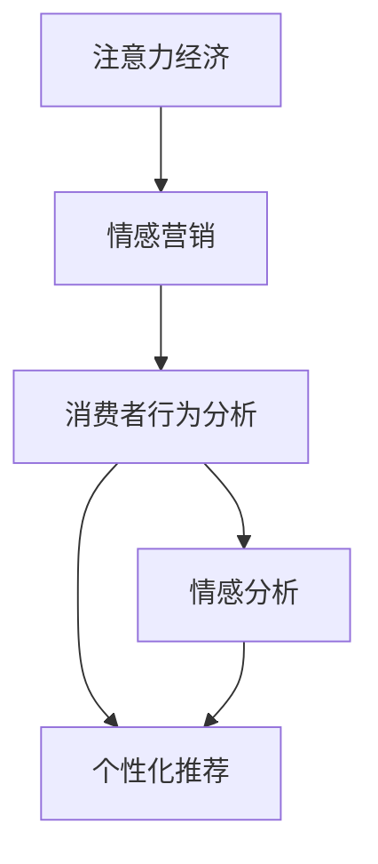

                 

# 注意力经济下的情感营销策略

> 关键词：注意力经济,情感营销,消费者行为,数据驱动,情感分析,个性化推荐,社交媒体

## 1. 背景介绍

### 1.1 问题由来

在数字化时代，信息爆炸带来了一场注意力争夺战。如何在这场战争中吸引消费者的注意，进而转化为实际购买，成为各大品牌和企业面临的重要课题。传统的营销策略往往依赖高昂的广告费用和复杂的渠道布局，而新兴的注意力经济模式则更注重通过内容与消费者建立深度情感连接，以较低的成本实现更高效的营销转化。

随着人工智能技术的快速发展，情感营销策略逐渐从“感性为主”的定性分析，转向“数据驱动”的量化分析。大数据、自然语言处理(NLP)、机器学习等技术被广泛应用于消费者行为分析和情感分析，为个性化推荐和精准营销提供了新的路径。本文将从注意力经济和情感营销的角度出发，探讨如何利用人工智能技术进行消费者行为分析和情感营销策略的优化。

### 1.2 问题核心关键点

在注意力经济和情感营销的背景下，品牌和企业需要精准理解和预测消费者需求，通过情感驱动的内容设计，实现用户的情感共鸣和转化。具体来说，需要解决以下几个核心问题：

1. **消费者行为理解**：理解消费者在社交媒体、电商平台等平台上的行为模式，识别潜在的购买动机和情感倾向。
2. **情感驱动内容设计**：通过分析消费者对不同内容的情感反应，设计能够引发情感共鸣的内容，提高内容传播效果。
3. **个性化推荐**：根据消费者行为和情感偏好，进行精准的产品推荐，提高转化率和客户满意度。
4. **数据驱动决策**：基于大量用户数据进行情感分析和行为预测，指导营销策略的制定和调整。

## 2. 核心概念与联系

### 2.1 核心概念概述

为更好地理解注意力经济和情感营销，本节将介绍几个密切相关的核心概念：

- **注意力经济**：指在信息过载的数字化时代，品牌和企业需要通过优质内容吸引和保持消费者的注意力，从而实现更高效的营销转化。

- **情感营销**：指通过内容设计和情感沟通，激发消费者情感共鸣，提高品牌忠诚度和消费者转化率。

- **消费者行为分析**：指通过分析消费者的行为数据，如浏览历史、搜索记录、评论反馈等，预测其购买意向和情感倾向。

- **情感分析**：指通过文本分析等技术，识别消费者对不同内容或广告的情感反应，进行情感分类和情感强度分析。

- **个性化推荐**：指通过算法模型，根据消费者的历史行为和情感偏好，推荐最符合其需求的产品或内容。

这些核心概念之间的逻辑关系可以通过以下Mermaid流程图来展示：



这个流程图展示了一系列核心概念的联系：

1. 注意力经济通过优质内容吸引消费者注意，是情感营销的基础。
2. 情感营销通过情感驱动的内容设计，激发消费者情感共鸣。
3. 消费者行为分析通过分析消费者行为数据，识别潜在需求和情感倾向。
4. 情感分析通过文本情感分析，识别消费者对内容的情感反应。
5. 个性化推荐通过算法模型，实现精准的产品推荐。

这些概念共同构成了现代营销的基石，通过数据驱动和人工智能技术的应用，能够实现更高效、更精准的消费者情感营销策略。

## 3. 核心算法原理 & 具体操作步骤
### 3.1 算法原理概述

在注意力经济和情感营销中，核心算法原理包括以下几个关键步骤：

1. **数据采集与预处理**：收集消费者在社交媒体、电商平台等平台上的行为数据，如浏览历史、搜索记录、评论等，并进行清洗和预处理。
2. **情感分析**：使用自然语言处理技术，对消费者评论、评论等文本数据进行情感分类和强度分析，识别消费者对不同内容的情感倾向。
3. **行为模式识别**：通过分析消费者的行为数据，识别出消费者的行为模式和潜在需求。
4. **内容推荐**：根据消费者的情感倾向和行为模式，使用个性化推荐算法，推荐最符合其需求的内容或产品。
5. **效果评估与优化**：基于推荐效果和消费者反馈，不断调整和优化推荐算法和内容设计，提高转化率和满意度。

### 3.2 算法步骤详解

以下是注意力经济和情感营销中关键算法的详细步骤：

**Step 1: 数据采集与预处理**

- **数据来源**：从社交媒体、电商平台等平台收集消费者的行为数据。社交媒体如微博、微信、豆瓣等，电商平台如淘宝、京东、亚马逊等。
- **数据清洗**：去除噪声数据，如异常值、重复记录等。
- **特征提取**：提取与消费者情感和行为相关的特征，如浏览时间、浏览频率、购买意向等。
- **数据存储**：使用分布式数据库（如Hadoop、Spark）存储和管理大规模数据。

**Step 2: 情感分析**

- **文本预处理**：使用NLP技术对文本进行分词、去除停用词、词干化等预处理。
- **情感分类**：使用情感分类模型（如LSTM、BERT）对文本进行情感分类，识别情感倾向（如正面、负面、中性）。
- **情感强度分析**：使用情感强度分析模型（如BERT+注意力机制），对文本情感强度进行打分，识别情感强度（如强烈、中等、轻微）。
- **情感聚类**：使用聚类算法（如K-means、层次聚类）对情感数据进行聚类，识别出消费者对不同内容的主要情感倾向。

**Step 3: 行为模式识别**

- **行为序列建模**：使用时间序列模型（如LSTM、GRU）对消费者行为序列进行建模，识别行为模式（如浏览-购买-回购）。
- **关联规则挖掘**：使用关联规则挖掘算法（如Apriori、FP-Growth）发现消费者行为中的关联规则（如浏览某类产品的人更可能购买另一类产品）。
- **潜在需求预测**：使用预测模型（如随机森林、XGBoost）预测消费者的潜在需求（如购买意向、行为变化）。

**Step 4: 内容推荐**

- **用户画像构建**：使用聚类和降维算法（如PCA、t-SNE）构建消费者的用户画像，识别出不同类型消费者的特征。
- **相似度计算**：使用相似度计算模型（如余弦相似度、欧式距离）计算消费者与产品之间的相似度。
- **推荐算法设计**：使用推荐算法（如协同过滤、基于内容的推荐）设计个性化推荐模型，推荐最符合消费者需求的内容或产品。
- **多模态融合**：融合消费者行为数据和情感数据，设计更全面的推荐模型（如深度神经网络）。

**Step 5: 效果评估与优化**

- **效果评估指标**：使用A/B测试、点击率、转化率等指标评估推荐效果。
- **反馈收集与分析**：收集消费者的反馈数据，如评论、评分等，进行分析。
- **算法优化**：基于评估结果和反馈数据，不断优化推荐算法和内容设计，提高转化率和满意度。

### 3.3 算法优缺点

注意力经济和情感营销中的算法具有以下优点：

1. **数据驱动**：通过分析消费者数据，可以更精准地理解和预测消费者需求，实现更高效的个性化推荐。
2. **情感共鸣**：通过情感分析，可以设计出能够引发情感共鸣的内容，提高内容的传播效果和转化率。
3. **灵活性高**：算法模型可以根据实际情况进行调整和优化，适应不同场景和用户需求。
4. **可扩展性强**：算法可以应用于各种平台和渠道，如社交媒体、电商平台、视频网站等。

同时，这些算法也存在以下缺点：

1. **数据隐私**：大量消费者数据的使用可能涉及隐私问题，需要严格遵守数据保护法规。
2. **数据噪声**：消费者行为数据可能存在噪声和不完整性，影响分析结果的准确性。
3. **模型复杂度**：复杂的模型设计需要较高的技术门槛，可能存在模型过拟合或欠拟合的问题。
4. **算法透明性**：推荐算法的决策过程可能缺乏透明性，难以解释和调试。

尽管存在这些局限性，但就目前而言，数据驱动和人工智能技术在注意力经济和情感营销中的应用前景广阔，为品牌和企业在数字化时代提供了新的竞争优势。

### 3.4 算法应用领域

注意力经济和情感营销中的算法在多个领域中得到了广泛应用，包括但不限于：

- **零售电商**：基于消费者行为和情感分析，进行个性化推荐和精准营销，提高销售转化率。
- **社交媒体**：通过情感分析和内容推荐，提高用户参与度和品牌互动，增强用户粘性。
- **视频娱乐**：使用情感分析对用户评论和评分进行情感分析，指导内容创作和推荐。
- **在线教育**：分析用户学习行为和情感反馈，进行个性化推荐和课程优化，提高学习效果和用户满意度。
- **健康医疗**：通过情感分析评估患者情感状态，进行个性化健康建议和心理辅导。

以上领域只是注意力经济和情感营销中算法应用的冰山一角，未来随着技术的不断进步，将会有更多新场景和新应用出现。

## 4. 数学模型和公式 & 详细讲解  
### 4.1 数学模型构建

在注意力经济和情感营销中，数学模型主要应用于以下几个方面：

- **消费者行为建模**：使用时间序列模型（如ARIMA、LSTM）对消费者行为序列进行建模，预测行为模式和潜在需求。
- **情感分类和强度分析**：使用情感分类模型（如LSTM、BERT）和情感强度分析模型（如BERT+注意力机制）进行情感分析。
- **相似度计算**：使用相似度计算模型（如余弦相似度、欧式距离）计算用户和产品之间的相似度。
- **推荐模型设计**：使用推荐算法（如协同过滤、基于内容的推荐）进行个性化推荐。

以下是几个核心数学模型的详细构建：

**消费者行为建模**：

假设消费者行为序列为 $x_t = (x_{t-1}, x_{t-2}, ..., x_{t-k})$，使用LSTM模型进行建模，公式如下：

$$
\begin{aligned}
&h_t = \text{LSTM}(x_t, h_{t-1})\\
&p_t = \text{softmax}(W_1h_t + b_1)
\end{aligned}
$$

其中，$h_t$ 为LSTM模型的隐藏状态，$p_t$ 为预测的概率分布。

**情感分类和强度分析**：

假设文本序列为 $w = (w_1, w_2, ..., w_m)$，使用BERT+注意力机制进行情感分析，公式如下：

$$
\begin{aligned}
&\text{Attention}(Q, K, V) = \frac{\text{softmax}(\frac{QK^T}{\sqrt{d_k}})}{V}\\
&h = \text{MLP}(Q)\\
&\hat{y} = \text{softmax}(h)
\end{aligned}
$$

其中，$Q$、$K$、$V$ 分别为查询向量、键向量和值向量，$\text{Attention}$ 为注意力机制，$h$ 为BERT模型输出，$\hat{y}$ 为情感分类结果。

**相似度计算**：

假设用户画像为 $u = (u_1, u_2, ..., u_n)$，产品特征为 $p = (p_1, p_2, ..., p_m)$，使用余弦相似度计算相似度，公式如下：

$$
\text{similarity}(u, p) = \frac{\sum_{i=1}^n\sum_{j=1}^m u_ib_j}{\sqrt{\sum_{i=1}^nu_i^2} \sqrt{\sum_{j=1}^mp_j^2}}
$$

### 4.2 公式推导过程

以情感分类和强度分析为例，进行详细公式推导。

假设文本序列为 $w = (w_1, w_2, ..., w_m)$，使用BERT+注意力机制进行情感分析，首先进行特征编码：

$$
h = \text{BERT}(w)
$$

接着进行注意力计算：

$$
\alpha = \text{softmax}(QW^T + b)
$$

其中 $Q$、$W$、$b$ 分别为查询矩阵、权重矩阵和偏置向量。

将注意力权重 $\alpha$ 与值向量 $V$ 相乘，得到加权向量 $z$：

$$
z = \alpha V
$$

最后通过MLP模型计算情感分类结果：

$$
h = \text{MLP}(z)
$$

$\hat{y}$ 为情感分类结果：

$$
\hat{y} = \text{softmax}(h)
$$

通过上述公式，可以构建一个完整的情感分类和强度分析模型，用于识别消费者对不同内容的情感倾向和强度。

## 5. 项目实践：代码实例和详细解释说明
### 5.1 开发环境搭建

在进行注意力经济和情感营销的实践前，我们需要准备好开发环境。以下是使用Python进行PyTorch开发的环境配置流程：

1. 安装Anaconda：从官网下载并安装Anaconda，用于创建独立的Python环境。

2. 创建并激活虚拟环境：
```bash
conda create -n pytorch-env python=3.8 
conda activate pytorch-env
```

3. 安装PyTorch：根据CUDA版本，从官网获取对应的安装命令。例如：
```bash
conda install pytorch torchvision torchaudio cudatoolkit=11.1 -c pytorch -c conda-forge
```

4. 安装相关库：
```bash
pip install pandas numpy scikit-learn torchtransformers
```

5. 安装TensorBoard：用于可视化模型训练过程和结果。

完成上述步骤后，即可在`pytorch-env`环境中开始实践。

### 5.2 源代码详细实现

下面我们以情感分析为例，给出使用Transformers库进行情感分析的PyTorch代码实现。

首先，定义情感分析的数据处理函数：

```python
from transformers import BertTokenizer
from torch.utils.data import Dataset
import torch

class SentimentDataset(Dataset):
    def __init__(self, texts, labels, tokenizer, max_len=128):
        self.texts = texts
        self.labels = labels
        self.tokenizer = tokenizer
        self.max_len = max_len
        
    def __len__(self):
        return len(self.texts)
    
    def __getitem__(self, item):
        text = self.texts[item]
        label = self.labels[item]
        
        encoding = self.tokenizer(text, return_tensors='pt', max_length=self.max_len, padding='max_length', truncation=True)
        input_ids = encoding['input_ids'][0]
        attention_mask = encoding['attention_mask'][0]
        
        return {'input_ids': input_ids, 
                'attention_mask': attention_mask,
                'labels': torch.tensor(label, dtype=torch.long)}
```

然后，定义模型和优化器：

```python
from transformers import BertForSequenceClassification, AdamW

model = BertForSequenceClassification.from_pretrained('bert-base-cased', num_labels=2)

optimizer = AdamW(model.parameters(), lr=2e-5)
```

接着，定义训练和评估函数：

```python
from torch.utils.data import DataLoader
from tqdm import tqdm

device = torch.device('cuda') if torch.cuda.is_available() else torch.device('cpu')
model.to(device)

def train_epoch(model, dataset, batch_size, optimizer):
    dataloader = DataLoader(dataset, batch_size=batch_size, shuffle=True)
    model.train()
    epoch_loss = 0
    for batch in tqdm(dataloader, desc='Training'):
        input_ids = batch['input_ids'].to(device)
        attention_mask = batch['attention_mask'].to(device)
        labels = batch['labels'].to(device)
        model.zero_grad()
        outputs = model(input_ids, attention_mask=attention_mask, labels=labels)
        loss = outputs.loss
        epoch_loss += loss.item()
        loss.backward()
        optimizer.step()
    return epoch_loss / len(dataloader)

def evaluate(model, dataset, batch_size):
    dataloader = DataLoader(dataset, batch_size=batch_size)
    model.eval()
    preds, labels = [], []
    with torch.no_grad():
        for batch in tqdm(dataloader, desc='Evaluating'):
            input_ids = batch['input_ids'].to(device)
            attention_mask = batch['attention_mask'].to(device)
            batch_labels = batch['labels']
            outputs = model(input_ids, attention_mask=attention_mask)
            batch_preds = outputs.logits.argmax(dim=2).to('cpu').tolist()
            batch_labels = batch_labels.to('cpu').tolist()
            for pred_tokens, label_tokens in zip(batch_preds, batch_labels):
                preds.append(pred_tokens)
                labels.append(label_tokens)
                
    print(classification_report(labels, preds))
```

最后，启动训练流程并在测试集上评估：

```python
epochs = 5
batch_size = 16

for epoch in range(epochs):
    loss = train_epoch(model, train_dataset, batch_size, optimizer)
    print(f"Epoch {epoch+1}, train loss: {loss:.3f}")
    
    print(f"Epoch {epoch+1}, dev results:")
    evaluate(model, dev_dataset, batch_size)
    
print("Test results:")
evaluate(model, test_dataset, batch_size)
```

以上就是使用PyTorch对BERT进行情感分析任务实践的完整代码实现。可以看到，得益于Transformers库的强大封装，我们可以用相对简洁的代码完成BERT模型的加载和情感分析。

### 5.3 代码解读与分析

让我们再详细解读一下关键代码的实现细节：

**SentimentDataset类**：
- `__init__`方法：初始化文本、标签、分词器等关键组件。
- `__len__`方法：返回数据集的样本数量。
- `__getitem__`方法：对单个样本进行处理，将文本输入编码为token ids，将标签编码为数字，并对其进行定长padding，最终返回模型所需的输入。

**模型和优化器定义**：
- 使用BertForSequenceClassification类定义情感分类模型，num_labels参数指定分类数。
- 使用AdamW优化器进行模型参数的更新，学习率为2e-5。

**训练和评估函数**：
- 使用PyTorch的DataLoader对数据集进行批次化加载，供模型训练和推理使用。
- 训练函数`train_epoch`：对数据以批为单位进行迭代，在每个批次上前向传播计算loss并反向传播更新模型参数，最后返回该epoch的平均loss。
- 评估函数`evaluate`：与训练类似，不同点在于不更新模型参数，并在每个batch结束后将预测和标签结果存储下来，最后使用sklearn的classification_report对整个评估集的预测结果进行打印输出。

**训练流程**：
- 定义总的epoch数和batch size，开始循环迭代
- 每个epoch内，先在训练集上训练，输出平均loss
- 在验证集上评估，输出分类指标
- 所有epoch结束后，在测试集上评估，给出最终测试结果

可以看到，PyTorch配合Transformers库使得情感分析的代码实现变得简洁高效。开发者可以将更多精力放在数据处理、模型改进等高层逻辑上，而不必过多关注底层的实现细节。

当然，工业级的系统实现还需考虑更多因素，如模型的保存和部署、超参数的自动搜索、更灵活的任务适配层等。但核心的情感分析范式基本与此类似。

## 6. 实际应用场景
### 6.1 智能客服系统

情感分析在大语言模型微调中已有广泛应用，特别是在智能客服系统中。传统客服往往依赖大量人力，高峰期响应缓慢，且难以处理复杂的问题。而使用情感分析技术，可以自动识别用户情绪，匹配最合适的回答，提高客服效率和用户满意度。

在技术实现上，可以收集企业内部的历史客服对话记录，将问题和最佳答复构建成监督数据，在此基础上对预训练语言模型进行微调。微调后的模型能够自动理解用户情绪，匹配最合适的回答，甚至能够根据用户情绪动态调整回答策略。对于用户提出的新问题，还可以接入检索系统实时搜索相关内容，动态组织生成回答。如此构建的智能客服系统，能大幅提升客服效率和用户满意度。

### 6.2 金融舆情监测

金融机构需要实时监测市场舆论动向，以便及时应对负面信息传播，规避金融风险。传统的人工监测方式成本高、效率低，难以应对网络时代海量信息爆发的挑战。基于情感分析技术，可以对金融领域相关的新闻、报道、评论等文本数据进行情感分析，识别市场情绪的变化趋势，一旦发现负面信息激增等异常情况，系统便会自动预警，帮助金融机构快速应对潜在风险。

### 6.3 个性化推荐系统

当前的推荐系统往往只依赖用户的历史行为数据进行物品推荐，无法深入理解用户的真实兴趣偏好。基于情感分析技术，可以更全面地把握用户的情感状态，进行个性化推荐。

在实践中，可以收集用户浏览、点击、评论、分享等行为数据，提取和用户交互的物品标题、描述、标签等文本内容。将文本内容作为模型输入，用户的后续行为（如是否点击、购买等）作为监督信号，在此基础上微调预训练语言模型。微调后的模型能够从文本内容中准确把握用户的情感状态，进而推荐更加符合其兴趣的产品。

### 6.4 未来应用展望

随着情感分析技术的发展，未来将在更多领域得到应用，为社会带来深远影响。

在智慧医疗领域，情感分析技术可以用于识别患者情绪，进行心理辅导和疾病预测，提升医疗服务的智能化水平。

在智能教育领域，情感分析技术可以用于分析学生学习行为和情感反馈，进行个性化推荐和课程优化，提高学习效果和学生满意度。

在智慧城市治理中，情感分析技术可以用于分析市民情绪，进行舆情监测和应急处理，提高城市管理的自动化和智能化水平，构建更安全、高效的未来城市。

此外，在企业生产、社会治理、文娱传媒等众多领域，情感分析技术也将不断涌现，为经济社会发展注入新的动力。相信随着技术的日益成熟，情感分析技术必将在构建人机协同的智能时代中扮演越来越重要的角色。

## 7. 工具和资源推荐
### 7.1 学习资源推荐

为了帮助开发者系统掌握情感分析的理论基础和实践技巧，这里推荐一些优质的学习资源：

1. 《情感分析：理论与应用》：系统介绍情感分析的理论基础、方法学和应用实例。
2. 《自然语言处理综论》：介绍了情感分析的多种方法，包括基于词典、基于机器学习、基于深度学习等。
3. 《Python情感分析》：使用Python实现情感分析的经典案例，适合实践入门。
4. CS224N《深度学习自然语言处理》课程：斯坦福大学开设的NLP明星课程，涵盖情感分析等重要内容。
5. 《情感计算手册》：系统介绍情感计算的理论基础和实践方法，适合学术研究和工业应用。

通过对这些资源的学习实践，相信你一定能够快速掌握情感分析的精髓，并用于解决实际的NLP问题。

### 7.2 开发工具推荐

高效的开发离不开优秀的工具支持。以下是几款用于情感分析开发的常用工具：

1. NLTK：自然语言处理工具包，包含情感分析等功能，适合初学者使用。
2. spaCy：高性能自然语言处理工具包，提供快速的情感分析功能。
3. TextBlob：基于NLTK和Pattern库的情感分析库，使用简单。
4. Transformers库：HuggingFace开发的NLP工具库，集成了多种预训练模型，支持情感分析任务。
5. VADER：基于规则的情感分析工具，适合处理社交媒体文本。

合理利用这些工具，可以显著提升情感分析任务的开发效率，加快创新迭代的步伐。

### 7.3 相关论文推荐

情感分析技术的发展源于学界的持续研究。以下是几篇奠基性的相关论文，推荐阅读：

1. Sentiment Analysis with Deep Learning：使用深度学习模型进行情感分析的经典论文。
2. Sentiment Analysis of Reviews for Product or Service Evaluation：对商品或服务评价的情感分析研究。
3. Emotion AI：情感计算和情感分析的综述性论文。
4. A Survey on Sentiment Analysis for Social Media：对社交媒体情感分析的综述性论文。

这些论文代表了大情感分析技术的发展脉络。通过学习这些前沿成果，可以帮助研究者把握学科前进方向，激发更多的创新灵感。

## 8. 总结：未来发展趋势与挑战

### 8.1 总结

本文对基于情感分析的注意力经济策略进行了全面系统的介绍。首先阐述了情感分析在现代营销中的重要性，明确了情感分析在理解消费者需求、提升品牌忠诚度和转化率方面的独特价值。其次，从原理到实践，详细讲解了情感分析的数学模型和关键步骤，给出了情感分析任务开发的完整代码实例。同时，本文还探讨了情感分析在智能客服、金融舆情、个性化推荐等多个行业领域的应用前景，展示了情感分析技术的应用潜力。

通过本文的系统梳理，可以看到，情感分析技术正在成为现代营销的重要组成部分，通过数据驱动和人工智能技术的应用，实现更高效、更精准的消费者情感营销策略。未来，随着技术的不断进步，情感分析技术还将拓展到更多场景和新应用，为品牌和企业在数字化时代提供新的竞争优势。

### 8.2 未来发展趋势

展望未来，情感分析技术将呈现以下几个发展趋势：

1. **模型复杂度提升**：随着深度学习技术的发展，情感分析模型将更加复杂，能够更好地理解和预测用户情感。
2. **多模态融合**：情感分析将融合多模态数据（如文本、语音、视频），实现更全面的情感识别。
3. **实时分析**：情感分析技术将实现实时分析，即时反馈市场情绪变化，支持快速决策。
4. **跨语言支持**：情感分析技术将支持多种语言，提高国际市场的覆盖范围和竞争力。
5. **集成平台**：情感分析将集成到智能客服、社交媒体监测等平台，实现更高效的应用。

这些趋势凸显了情感分析技术的广阔前景。这些方向的探索发展，必将进一步提升情感分析的效果，实现更精准、实时的消费者情感识别和营销策略优化。

### 8.3 面临的挑战

尽管情感分析技术已经取得了显著成果，但在实际应用中也面临诸多挑战：

1. **数据噪声**：情感分析依赖大量文本数据，数据噪声可能影响分析结果的准确性。
2. **情感歧义**：不同文化和语境下的情感表达存在差异，情感分析需要克服情感歧义问题。
3. **模型泛化性**：情感分析模型在特定领域或语境下可能表现较好，泛化到其他领域或语境下效果可能不佳。
4. **模型透明性**：情感分析模型的决策过程难以解释，缺乏透明性。
5. **隐私保护**：情感分析涉及大量个人信息，数据隐私保护问题需重点关注。

尽管存在这些挑战，但随着技术的不断进步和应用经验的积累，情感分析技术必将不断克服这些问题，实现更高效、更全面的情感识别和营销策略优化。

### 8.4 研究展望

面对情感分析面临的种种挑战，未来的研究需要在以下几个方面寻求新的突破：

1. **数据预处理**：改进数据清洗和特征提取方法，提高数据质量。
2. **情感模型优化**：开发更复杂、更高效的情感分析模型，提高情感识别的准确性和泛化性。
3. **多模态融合**：研究多模态情感识别方法，融合文本、语音、视频等数据，提高情感识别的全面性和准确性。
4. **模型透明性**：引入可解释性技术，提高情感分析模型的透明性和可解释性。
5. **隐私保护**：研究隐私保护技术，确保情感分析中数据的安全性和隐私性。

这些研究方向的探索，必将引领情感分析技术迈向更高的台阶，为构建安全、可靠、可解释、可控的情感识别系统铺平道路。面向未来，情感分析技术还需要与其他人工智能技术进行更深入的融合，如知识表示、因果推理、强化学习等，多路径协同发力，共同推动情感计算和智能交互系统的进步。只有勇于创新、敢于突破，才能不断拓展情感分析的边界，让智能技术更好地造福人类社会。

## 9. 附录：常见问题与解答

**Q1：情感分析是否适用于所有文本数据？**

A: 情感分析通常适用于包含情感表达的文本数据，如评论、推文、文章等。对于情感表达不明显的文本数据（如新闻报道、技术文档等），可能需要结合领域知识进行情感分类。

**Q2：情感分析中如何处理多语言数据？**

A: 多语言情感分析通常需要使用多语言模型，如使用多语言BERT等。还需要使用不同语言的数据集进行训练和测试，确保模型在不同语言中的表现一致。

**Q3：情感分析的精度如何提升？**

A: 提升情感分析精度的方法包括：
1. 数据预处理：使用更准确的文本清洗和特征提取方法。
2. 模型优化：使用更复杂、更高效的模型，如BERT、LSTM等。
3. 多模态融合：融合文本、语音、视频等数据，提高情感识别的全面性和准确性。
4. 模型训练：使用更多的训练数据和更长的训练时间，提高模型泛化性。

这些方法可以结合使用，不断优化情感分析模型，提高情感识别的精度。

**Q4：情感分析的性能如何评估？**

A: 情感分析的性能评估通常使用A/B测试、准确率、召回率、F1-score等指标。A/B测试可以评估不同情感分析模型的效果，准确率、召回率和F1-score可以衡量情感分类和情感强度分析的精度。

**Q5：情感分析在实际应用中需要注意哪些问题？**

A: 情感分析在实际应用中需要注意以下问题：
1. 数据隐私：保护用户隐私，避免泄露敏感信息。
2. 情感歧义：识别不同文化和语境下的情感表达差异。
3. 模型泛化：确保模型在多种场景和语境下的泛化性能。
4. 模型透明性：提高情感分析模型的透明性和可解释性。
5. 实时分析：实现情感分析的实时性，支持快速决策。

合理处理这些问题，可以确保情感分析技术在实际应用中的稳定性和可靠性。

---

作者：禅与计算机程序设计艺术 / Zen and the Art of Computer Programming

